# Implement Plan

Execute a design or development plan against the codebase. Challenge first, refine through dialogue, then build — updating the plan as the single source of truth throughout. Works with any structured development document (downstream of `/claudna:audit tech-debt`, `/claudna:product-enhance`, or standalone) or a GitHub Issue created by `--output github`.

## Arguments

Parse the invocation arguments:
- `--source github <number>`: Read a specific GitHub Issue as the implementation plan.
- `--source github` (no number): Browse all open issues via paginated picker — select one or more to implement.
- Remaining text (or no flag): treated as a file path or session directory.
- No arguments at all: scan for plan directories and present a picker.
- See source guide (`skills/_shared/source-guide.md`) for details on both GitHub modes.
- `--auto` (alias: `--autonomous`): Fully non-interactive mode. Replaces user input with sensible defaults and machine synthesis. Requires an explicit work item (`--source github <number>` OR a single file path) — picker modes and queue mode are disallowed. Never merges. Emits the structured-result shape from `skills/_shared/orchestration-guide.md` §10.C as the final output. See the "Autonomous Mode (`--auto`)" section below for the full behavior contract.

## Autonomous Mode (`--auto`)

When `$ARGUMENTS` contains `--auto` (or its alias `--autonomous`), the skill runs end-to-end without user input. This section is the canonical reference for `--auto` behavior. Individual procedure steps below reference back here.

### Required invocation shape

- `/claudna:implement-plan --source github <number> --auto`
- `/claudna:implement-plan <path-to-plan-file> --auto`

NOT supported in `--auto`:
- `--source github` without a number (the browse picker)
- Directory paths (the level-2 plan picker)
- Empty arguments (the directory scanner)

If invoked with `--auto` and any ambiguous source, exit immediately with the structured result `outcome: "blocked"`, `blocker_description: "ambiguous source in --auto; specify a single issue number or plan file path"`.

### Step-by-step behavior in `--auto`

| Step | What changes |
|---|---|
| 1: Receive plan | Picker/browse modes disabled. Single work item only. |
| 1.5: Plan-detail check (NEW) | Refuses sparse issues. Exits with `outcome: "blocked"` if the plan body lacks an `## Implementation Plan` section. |
| 2: Codebase Comparison | No change |
| 2.5: Scope-expansion tripwire (NEW) | If Step 2 reveals the scope is significantly larger than the plan describes, exits with `outcome: "bypassed"` |
| 3: Challenge Round | Replaced by §5.5.2 synthesis pass (see "Synthesis pass" below) |
| 4: Mark In Progress | No change |
| 5: Branch & Implement | "Feels wrong" exits with `outcome: "blocked"` instead of stopping for user discussion |
| 6: Verify | Persistent verification failure (after fix-and-retry attempts) exits with `outcome: "partial"` |
| 6.5: Simplify | On regression, automatically reverts the simplify commit (no user prompt) and proceeds with a note in the PR body |
| 7: PR | Opens PR. Suppresses any post-PR user messages. |
| 8: Merge Gate | Skipped entirely. Never offers merge. |
| 9: Summary | Emits the structured-result JSON block (§10.C) as the FINAL output of the run |

### Synthesis pass (replaces Step 3 in `--auto`)

Per design §5.5.2, when Step 2 (Codebase Comparison) completes in `--auto`, replace the interactive challenge round with a machine synthesis pass that delegates to `/claudna:weigh-development-paths --auto`.

The producer/consumer schema between the two skills is documented at `skills/_shared/contracts/synthesis-contract.md`. Step 3-AUTO below packages a context bundle, dispatches the synthesizer, and parses its structured result per that contract.

### Output (structured result)

After Step 9, emit a single fenced JSON block as the FINAL output (full schema in `skills/_shared/orchestration-guide.md` §10.C):

```json
{
  "skill": "implement-plan",
  "outcome": "completed",
  "artifacts": {
    "pr_url": "https://github.com/org/repo/pull/456",
    "branch": "implement/some-slug",
    "issue_url": "https://github.com/org/repo/issues/123",
    "files_changed": 3,
    "lines_added": 47,
    "lines_removed": 12,
    "synthesis_decisions_resolved": 4,
    "simplify_applied": true,
    "simplify_reverted": false
  },
  "summary": "<2-4 line digest of what shipped>",
  "next": "<orchestrator hint, e.g. 'Schedule reviewer bot to look at PR #456' or null>",
  "errors": [],
  "blocker_description": null
}
```

`outcome` mapping for `--auto`:
- `completed` — PR opened with all verification passing
- `bypassed` — Step 2.5 scope-expansion tripwire fired
- `blocked` — Step 1.5 sparse issue, Step 5 "feels wrong", synthesis pass blocked
- `needs-input` — synthesis pass returned unresolvable decisions
- `partial` — verification ultimately failed after multiple fix attempts; PR opened with failing checks noted in body

When `outcome != "completed"`, populate `blocker_description` with 1-2 sentences explaining what blocked the work and what would unblock it.

### Forbidden in `--auto`

- Interactive user-input prompts. There is no human at the keyboard.
- `EnterPlanMode` / `ExitPlanMode` is allowed when delegating to subagents that need it; the orchestrator itself does NOT enter Plan Mode.
- Offering merge. Step 8 is skipped, period.
- Writing to the user-managed `~/.claude/notes/` or `~/.claude/settings.json` (this rule applies in all modes, but is critical in unattended runs).

## Engineering Philosophy

Read `engineering-principles.md` in this skill directory. Every decision during review and implementation is filtered through those principles (first principles, simple design, modularity, clean implementation, separation of concerns). Code that doesn't meet them doesn't merge.

## Command Execution Rules

Shell operators (`&&`, `||`, `;`, `|`) break `allowed-tools` matching. Never chain or pipe — make separate parallel Bash calls. Use venv python directly (`./venv/bin/python -m pytest`). Use absolute paths instead of `cd`.

## Process Flow

> **This flowchart is the authoritative process definition. Prose below provides detail for each step.**

```dot
digraph implement_plan {
    rankdir=TB;
    node [fontname="Helvetica" fontsize=10];
    edge [fontname="Helvetica" fontsize=9];

    start [label="User invokes\n/implement-plan" shape=doublecircle];

    parse [label="Parse arguments" shape=box];
    auto_mode [label="--auto\nset?" shape=diamond];

    has_path [label="File path\nprovided?" shape=diamond];
    has_number [label="--source github\nwith number?" shape=diamond];
    has_source_gh [label="--source github\nno number?" shape=diamond];
    has_no_args [label="No arguments" shape=box];

    auto_no_source [label="EXIT outcome:\nblocked\n(no source in --auto)" shape=doublecircle style=filled fillcolor=lightcoral];
    auto_dir [label="EXIT outcome:\nblocked\n(directory in --auto)" shape=doublecircle style=filled fillcolor=lightcoral];

    direct_file [label="Path A: Read file\nor browse directory" shape=box];
    direct_issue [label="Path B: Fetch issue\nby number" shape=box];
    browse_issues [label="Path D: Browse issues\npaginated picker" shape=box];
    browse_dirs [label="Path C: Scan directories\ntwo-level picker" shape=box];

    queue [label="Execution queue\n(1+ items)" shape=box];
    next_item [label="Dequeue next item" shape=box];

    step1_5 [label="Step 1.5: Plan-detail check" shape=box];
    sparse_check [label="Plan has\nImpl Section?" shape=diamond];
    sparse_offer [label="Offer to expand\n(interactive)" shape=box];
    sparse_blocked [label="EXIT outcome: blocked\n(sparse plan in --auto)" shape=doublecircle style=filled fillcolor=lightcoral];

    step2 [label="Step 2: Codebase Comparison\nExplore subagents" shape=box];
    blockers [label="Blockers?" shape=diamond];
    report_blockers [label="STOP\nReport blockers" shape=doublecircle];

    step2_5 [label="Step 2.5: Scope tripwire\n(--auto only)" shape=box];
    scope_check [label="Scope expansion\ndetected?" shape=diamond];
    scope_bypassed [label="EXIT outcome: bypassed\n(scope expansion)" shape=doublecircle style=filled fillcolor=lightcoral];

    step3_mode [label="--auto?" shape=diamond];
    step3_auto [label="Step 3-AUTO:\nSynthesis pass via\nweigh-development-paths --auto" shape=box];
    synthesis_result [label="Synthesis\noutcome?" shape=diamond];
    auto_needs_input [label="EXIT outcome:\nneeds-input" shape=doublecircle style=filled fillcolor=lightcoral];
    auto_blocked [label="EXIT outcome:\nblocked" shape=doublecircle style=filled fillcolor=lightcoral];

    step3a [label="Step 3A: Seed with\nadversarial findings" shape=box];
    step3b [label="Step 3B: Matrix\nchallenge round" shape=box];
    update_plan [label="Update plan" shape=box];
    more_challenges [label="More\nchallenges?" shape=diamond];
    ready [label="Ready to\nbuild?" shape=diamond];

    step4 [label="Step 4: Mark In Progress" shape=box];
    step5_branch [label="Step 5: Create branch\nimplement/<slug>" shape=box];
    implement [label="Implement next\nplan step" shape=box];
    feels_wrong [label="Feels\nwrong?" shape=diamond];
    discuss [label="STOP\nDiscuss with user\n(interactive)" shape=box];
    feels_wrong_auto [label="EXIT outcome:\nblocked\n(feels wrong in --auto)" shape=doublecircle style=filled fillcolor=lightcoral];
    commit [label="Commit chunk" shape=box];
    more_steps [label="More\nsteps?" shape=diamond];

    step6a [label="Step 6A: Deliverable Audit" shape=box];
    audit_pass [label="All\ncomplete?" shape=diamond];
    fix_deliverable [label="Fix incomplete\ndeliverable" shape=box];

    step6b [label="Step 6B: Verification\nChecklist" shape=box];
    verify_pass [label="All\npass?" shape=diamond];
    fix_check [label="Fix failing\ncheck" shape=box];

    step6_5 [label="Step 6.5: Simplify\nif diff > threshold" shape=box];
    simplify_pass [label="Verify\npasses?" shape=diamond];
    simplify_revert [label="Revert simplify\ncommit" shape=box];
    simplify_partial [label="EXIT outcome:\npartial (verification\nfailed after revert)" shape=doublecircle style=filled fillcolor=lightcoral];

    step7 [label="Step 7: Create PR\nStatus → COMPLETE" shape=box];
    step7_auto_check [label="--auto?" shape=diamond];
    user_gate [label="Merge or\nstop?" shape=diamond];

    step8 [label="Step 8: Merge & Cleanup\n(interactive only)" shape=box];
    more_queued [label="More in\nqueue?" shape=diamond];
    continue_gate [label="Continue to\nnext?" shape=diamond];

    summary [label="Step 9: Summary" shape=box style=filled fillcolor=lightgreen];
    summary_auto [label="Step 9: Emit\nstructured result JSON" shape=doublecircle style=filled fillcolor=lightgreen];

    start -> parse;
    parse -> auto_mode;

    auto_mode -> has_path [label="no (interactive)"];
    auto_mode -> has_number [label="yes (--auto)"];

    has_path -> direct_file [label="yes"];
    has_path -> has_number [label="no"];

    has_number -> direct_issue [label="yes"];
    has_number -> has_source_gh [label="no"];

    has_source_gh -> browse_issues [label="yes (interactive)"];
    has_source_gh -> auto_no_source [label="yes (--auto)"];
    has_source_gh -> has_no_args [label="no"];

    has_no_args -> browse_dirs [label="interactive"];
    has_no_args -> auto_no_source [label="--auto"];

    direct_file -> auto_dir [label="dir + --auto"];
    direct_file -> queue [label="otherwise"];
    direct_issue -> queue;
    browse_issues -> queue;
    browse_dirs -> queue;

    queue -> next_item;
    next_item -> step1_5;

    step1_5 -> sparse_check;
    sparse_check -> step2 [label="yes"];
    sparse_check -> sparse_offer [label="no (interactive)"];
    sparse_check -> sparse_blocked [label="no (--auto)"];
    sparse_offer -> step2;

    step2 -> blockers;
    blockers -> report_blockers [label="yes"];
    blockers -> step2_5 [label="no, --auto"];
    blockers -> step3_mode [label="no, interactive"];

    step2_5 -> scope_check;
    scope_check -> scope_bypassed [label="yes"];
    scope_check -> step3_mode [label="no"];

    step3_mode -> step3_auto [label="yes (--auto)"];
    step3_mode -> step3a [label="no (interactive)"];

    step3_auto -> synthesis_result;
    synthesis_result -> step4 [label="completed"];
    synthesis_result -> auto_needs_input [label="blocked"];
    synthesis_result -> auto_blocked [label="error"];

    step3a -> step3b;
    step3b -> update_plan;
    update_plan -> more_challenges;
    more_challenges -> step3b [label="yes"];
    more_challenges -> ready [label="no"];
    ready -> step4 [label="ready"];
    ready -> step3b [label="revise"];

    step4 -> step5_branch;
    step5_branch -> implement;
    implement -> feels_wrong;
    feels_wrong -> discuss [label="yes, interactive"];
    feels_wrong -> feels_wrong_auto [label="yes, --auto"];
    feels_wrong -> commit [label="no"];
    discuss -> implement;
    commit -> more_steps;
    more_steps -> implement [label="yes"];
    more_steps -> step6a [label="no"];

    step6a -> audit_pass;
    audit_pass -> step6b [label="yes"];
    audit_pass -> fix_deliverable [label="no"];
    fix_deliverable -> step6a;

    step6b -> verify_pass;
    verify_pass -> step6_5 [label="yes"];
    verify_pass -> fix_check [label="no"];
    fix_check -> step6b;

    step6_5 -> simplify_pass;
    simplify_pass -> step7 [label="yes"];
    simplify_pass -> simplify_revert [label="no"];
    simplify_revert -> simplify_pass [label="re-verify"];
    simplify_revert -> simplify_partial [label="still fails (--auto)"];

    step7 -> step7_auto_check;
    step7_auto_check -> summary_auto [label="yes (--auto)"];
    step7_auto_check -> user_gate [label="no (interactive)"];

    user_gate -> step8 [label="merge"];
    user_gate -> summary [label="stop"];
    step8 -> more_queued;
    more_queued -> continue_gate [label="yes"];
    more_queued -> summary [label="no"];
    continue_gate -> next_item [label="yes"];
    continue_gate -> summary [label="stop"];
}
```



## Procedure

Follow these steps exactly in order.

---

### Step 1: Receive the Plan

Route based on arguments. Four input paths, all leading to an execution queue.

**Path A — Direct file or directory:**
User passes a path.

- If it's a `.md` file, read it, confirm with user (interactive) or proceed silently (`--auto`), add to queue as a single item.
- If it's a directory:
  - **Interactive mode:** read `00_*.md` (overview), then present the **Level 2 plan picker** (multi-select, paginated — same as Path C step 5) to select which plans to implement. Queue selected plans.
  - **`--auto` mode:** EXIT with `outcome: "blocked"`, `blocker_description: "directory source not supported in --auto; specify a single plan file"`. No emission of human-readable text or picker.

**Path B — Direct issue (`--source github <number>`):**
Fetch the issue via `gh issue view <number> --json number,title,body,labels,state,url`. Validate the detail level per the source guide (Section 4). If findings-only, offer to expand. Add to queue (single item).

**Path C — Directory browser (no arguments):**

If `--auto` is set, EXIT with `outcome: "blocked"`, `blocker_description: "no source provided in --auto; require --source github <number> or explicit plan file path"`. Do not scan or present pickers.

1. Scan `documentation/planning/` for subdirectories containing `0N_*.md` files
2. If none found: fall back to asking **"Which document should I implement?"** and accept a file path
3. **Level 1 — Directory picker** (single-select, paginated):
   - Use an interactive question prompt to present up to 3 directories + "More..." as 4th option
   - Each option label: directory name. Each description: N plans, M complete.
   - Selecting "More..." presents the next page of directories
4. Read `00_*.md` (overview) from chosen directory
5. **Level 2 — Plan picker** (multi-select, paginated):
   - If only 1 plan exists: auto-select it, confirm with user, skip picker
   - Print a full summary table in chat: plan number, title, status, severity/effort
   - Use an interactive multi-select question prompt — up to 3 plans + "Done selecting" as 4th
   - Accumulate selections across pages
   - After last page, confirm: **"You selected N plans. Proceed?"**
6. Queue all selected plans

**Path D — Issue browser (`--source github`, no number):**

If `--auto` is set, EXIT with `outcome: "blocked"`, `blocker_description: "--source github without a number not supported in --auto; require --source github <number>"`.

1. Fetch all open issues: `gh issue list --state open --limit 50 --json number,title,labels`
2. If no open issues: tell user **"No open issues found in this repo."** and stop
3. Print a full summary table in chat: issue number, title, labels, priority
4. **Issue picker** (multi-select, paginated):
   - If only 1 issue: auto-select it, confirm with user, skip picker
   - Use an interactive multi-select question prompt — up to 3 issues + "Done selecting" as 4th
   - Accumulate selections across pages
   - After last page, confirm: **"You selected N issues. Proceed?"**
5. Fetch full body for each via `gh issue view <number>`
6. Validate detail level for each (source guide Section 4). Offer to expand findings-only issues.
7. Queue all selected issues

#### Pagination Rules

Interactive question prompts support max 4 options. Pagination works differently for single-select and multi-select:

**Single-select** (Level 1 directory picker):
- Show items 1-3 + "More..." as 4th option
- Selecting "More..." triggers another interactive question prompt with the next batch
- Last page shows remaining items (2-4, no "More...")
- User can always type via "Other" to specify by name

**Multi-select** (Level 2 plan/issue picker):
- Print the **full list** as a numbered table in chat first — the user can see everything
- Then present paginated multi-select pages:
  - Each page shows 3 items + "Done selecting" as 4th option
  - User checks items on this page, submits → selections are accumulated
  - Next page auto-appears with the next batch of items
  - Selecting "Done selecting" (or reaching the last page) stops pagination
- After pagination ends, confirm: **"You selected: [list]. Proceed?"**
- User can always type via "Other" to add items by name or number

#### Execution Queue

When multiple plans or issues are selected, they form an ordered queue:

```
Session queue: 3 items
  1. [next]    01_domain-validation.md — CRITICAL
  2. [queued]  02_search-extraction.md — HIGH
  3. [queued]  03_error-handling.md — MEDIUM
```

Each item goes through the full implementation flow (Steps 2-8) sequentially. After each item's PR is merged (Step 8), present the queue status and use an interactive question prompt:

- "Continue to next: [next item name]"
- "Skip to a different item" (if 3+ items remain)
- "Stop here"

**Do NOT auto-start the next item.** The user should run `/compact` between items to manage context. Present the exact command: `/compact` then `/claudna:implement-plan <path-or-source>` for the next queued item.

For direct paths (A and B): the queue contains a single item. Steps 2-9 execute once with no queue logic.

---

### Step 1.5: Plan-Detail Check

After the work item is loaded into the queue (Step 1), validate that the plan body has enough detail to implement.

**A plan is "implementable" if its body contains an `## Implementation Plan` section** with a `### Steps` (or equivalent step-by-step prose) sub-section. This convention is set by the output-guide (`skills/_shared/output-guide.md` §4.1) — every planning skill produces this section on every target: GitHub Issues carry it directly, and phase docs on disk (`documentation/planning/`) are the same publishable-doc shape (planning-standard's content sections map onto the §4.1 skeleton — see its mapping table; older docs may carry the legacy "Detailed Implementation Plan" heading instead).

**If the plan IS implementable:** proceed to Step 2.

**If the plan is NOT implementable (findings-only or otherwise sparse):**

- **Interactive mode:** Offer to expand. Use an interactive question prompt: "This plan lacks an implementation section. Options: expand via Explore subagents (will edit the plan in place / comment on the issue), or abort." If user picks "expand," delegate to subagent(s) to flesh out the implementation steps based on the findings, then proceed to Step 2 once expansion is committed.

- **`--auto` mode:** Refuse. Exit immediately with the structured-result block:

```json
{
  "skill": "implement-plan",
  "outcome": "blocked",
  "artifacts": {
    "issue_url": "<source URL or path>"
  },
  "summary": "Plan lacks ## Implementation Plan section; cannot implement in --auto mode.",
  "next": "Run /claudna:audit tech-debt --auto, /claudna:audit security --auto, or similar planning skill against this issue to expand it into an implementable plan, then re-invoke /implement-plan --auto.",
  "errors": [],
  "blocker_description": "Source issue body has findings but no implementation plan. Expansion requires planning judgment that --auto mode does not provide. Run a planning skill first."
}
```

Do NOT attempt to write code or branch. Do NOT attempt heuristic expansion in `--auto`. The point of refusing is to keep `--auto` mode narrow: planning skills do planning, implementation skills do implementation.

### Step 2: Codebase Comparison

Use Explore subagents (Task tool) to verify: file paths, function names, before/after examples, codebase patterns, dependency chain. Present a `Plan vs. Codebase` table. Stop on blockers; continue with stale references noted.

---

### Step 2.5: Scope-Expansion Tripwire (`--auto` only)

This step is `--auto` only. Interactive mode skips it — interactive users can ratify scope changes through the challenge round and continue.

After Step 2's codebase comparison produces a "Plan vs. Codebase" table, compare the scope the plan ANTICIPATES against the scope Step 2 REVEALS:

**Plan-anticipated scope:**
- Files listed explicitly in the plan body (e.g., "Files to modify: A.py, B.py" or "Create: new/path.py")
- Files implied by referenced functions/classes (`UserService.authenticate` → `services/user.py`)

**Step-2-revealed scope:**
- All files Step 2 identified as relevant (including dependency-graph callers, related test files, configuration files that import the touched modules)

**Tripwire condition (qualitative judgment):**

If the Step 2 codebase comparison reveals the implementation surface is significantly larger than what the plan anticipated — for example, substantially more affected files, important callers the plan never names, or structural cascades through type definitions or shared utilities — exit `outcome: bypassed`. There are no fixed numeric thresholds; trust the comparison output. A change the plan describes as touching a few files but that Step 2 surfaces as fanning out across many modules is the canonical bypass case.

**Action:**

Exit with the structured-result block:

```json
{
  "skill": "implement-plan",
  "outcome": "bypassed",
  "artifacts": {
    "issue_url": "<source URL or path>",
    "anticipated_files": ["..."],
    "revealed_files": ["..."],
    "files_anticipated": 3,
    "files_revealed": 12
  },
  "summary": "Scope expansion detected: plan anticipated N files but codebase comparison reveals M files. Bypassed to avoid risky headless refactor.",
  "next": "Surface to a human for scope-bounded refactor or split into smaller phase docs.",
  "errors": [],
  "blocker_description": "The plan's stated scope is smaller than the actual codebase impact. Headless implementation would likely produce surprises. Re-plan with the full surface, or split into multiple smaller PRs."
}
```

After emitting the block, also post a comment on the source issue (if GitHub) explaining why the work was bypassed. Comment body:

```markdown
## /implement-plan --auto bypassed: scope expansion detected

The plan anticipates touching N files, but a codebase comparison reveals M files are actually affected:

**Anticipated:** A.py, B.py, C.py
**Actually affected:** [full list]

Headless implementation of this scope risks producing surprises (missed call-sites, type-inference cascades, etc.). Bypassing.

**Suggested next steps:**
- Re-plan with the full surface listed
- Or split into multiple smaller phase docs covering subsets

This was an automatic decision by `/claudna:implement-plan --auto`.
```

Add a `needs-input` label to the issue via `gh issue edit <number> --add-label "needs-input"` (create the label first via `gh label create` if it doesn't exist — skip silently if label creation fails for permission reasons).

**Tripwire is a safety net, not a primary filter.** The claudlobby `autonomous-runner` wrapper does qualitative pre-flight risk classification (mechanical / localized / structural per Phase 4 §6.1.1). The tripwire here catches surprises where the pre-flight classifier was wrong because the issue text understated the change.

### Step 3: Challenge Round

Read `challenge-round-questions.md` for the question matrix and `red-flags-and-rationalizations.md` to guard against rubber-stamping.

**Mode branch:**
- **Interactive mode:** runs sub-steps 3A and 3B below.
- **`--auto` mode:** runs sub-step 3-AUTO below, replacing both 3A and 3B with a machine synthesis pass.

#### Step 3-AUTO: Synthesis pass (`--auto` only)

Per design §5.5.2 and the canonical Autonomous Mode reference earlier in this skill, replace the interactive challenge round with a machine synthesis pass that delegates to `/claudna:weigh-development-paths --auto`. The producer/consumer schema between the two skills is canonical at `skills/_shared/contracts/synthesis-contract.md`.

1. **Create scratch directory.** Use the Write tool to create a file at `/tmp/implement-plan-<YYYY-MM-DD_HHMMSS>/synthesis-bundle.md`. The Write tool creates parent directories automatically.

2. **Extract OPEN adversarial findings.** Read the plan body. Search for `## Adversarial Review Findings`. Collect each finding where the checkbox is `- [ ]` (unchecked). Each finding has `severity`, `concern_area`, `summary`, `recommendation`.

3. **Generate machine-form matrix decision points.** For each matrix category in `challenge-round-questions.md` relevant to this plan:
   - Architecture: where does new code live? Reuse existing pattern or new one?
   - Testing: what tests cover the change? Existing patterns?
   - Dependencies: does the plan introduce new packages?
   - Error handling: what failure modes are explicitly handled?
   - (etc. — match the matrix in the file)
   For each, produce one or more `{category, question, options[]}` triples by drawing options from the Step 2 codebase comparison output.

4. **Write the bundle.** Compose the synthesis bundle at the scratch path:

```markdown
## Plan
<full original plan body>

## Open Adversarial Findings
- [<severity>][<concern_area>] <summary>
  Recommendation: <recommendation>
- ...

## Open Matrix Decisions
- [<category>] <question>
  Options:
  A) <option-A>
  B) <option-B>
  C) <option-C> (if applicable)
- ...

## Codebase Comparison Artifacts
<the Plan vs Codebase table from Step 2 — copy verbatim>
<list of relevant files Step 2 identified beyond what the plan named>
```

5. **Dispatch the synthesis subagent.** Launch a `general-purpose` subagent with this prompt:

```
Read the skill body at skills/weigh-development-paths/SKILL.md.

Apply the skill with --auto mode against the context bundle at:
  /tmp/implement-plan-<timestamp>/synthesis-bundle.md

Return ONLY the structured-result JSON block per the skill's emission contract
(canonical schema: skills/_shared/contracts/synthesis-contract.md).
Do NOT enter Plan Mode. Do NOT issue interactive user-input prompts.
Do NOT write to any plan file — the orchestrator handles that.
```

6. **Parse the subagent's structured result** per `skills/_shared/contracts/synthesis-contract.md`.

   Use the Read tool to read the subagent's final output (it should be a single fenced JSON block). Parse it.

   **If `outcome: "completed"`:**
   - Read `artifacts.refined_plan` (full markdown body) and `artifacts.synthesis_rationales` (per-decision array).
   - Use the Edit tool to update the plan body:
     - Replace the existing plan content with `refined_plan`.
     - For each previously-OPEN adversarial finding, change `- [ ]` to `- [x]` and append a sub-bullet:
       ```
       - [x] **[<severity>] <concern_area>**: <summary>
         - **Recommendation:** <recommendation>
         - **--auto synthesis decision:** <chosen_option> (rationale: <dimensions>)
       ```
   - For GitHub-source issues, post the refined plan as a comment on the issue with the header `## [implement-plan-auto] Refined plan via synthesis pass`.
   - Proceed to Step 4.

   **If `outcome: "blocked"`:** the synthesizer found unresolvable decisions. Exit `/implement-plan --auto` with:

   ```json
   {
     "skill": "implement-plan",
     "outcome": "needs-input",
     "artifacts": {
       "issue_url": "<source URL or path>",
       "unresolvable_decisions": ["..."]
     },
     "summary": "Synthesis pass returned unresolvable decisions; human input needed.",
     "next": "Surface decisions to a human; once resolved, re-invoke /implement-plan --auto.",
     "errors": [],
     "blocker_description": "<copy from subagent's blocker_description>"
   }
   ```

   Post a comment on the source issue (if GitHub) with the unresolvable decisions formatted as a checklist for a human to fill in.

   **If `outcome` is anything else (timeout, error, malformed JSON):** Exit with:

   ```json
   {
     "skill": "implement-plan",
     "outcome": "blocked",
     "artifacts": {"issue_url": "..."},
     "summary": "Synthesis pass failed: <reason>",
     "next": null,
     "errors": ["synthesis pass returned outcome: <X>"],
     "blocker_description": "Synthesis pass did not return a usable result. Re-invoke with a more complete plan or escalate."
   }
   ```

#### Step 3A: Seed with open adversarial-review findings (interactive only)

Open the plan body (the plan document or GitHub issue body). Search for a section titled `## Adversarial Review Findings`.

**If the section exists and has OPEN items** (markdown checkboxes `- [ ]` rather than `- [x]`):

1. Use an interactive question prompt. First question: **"Adversarial review flagged these unresolved concerns. Which to dig into?"**

   Options: up to 3 most-severe findings (use the severity label from the bullet) + "All of them" + "None — ready to build".

   If more than 3 findings are open, paginate: after the user picks from the first 3, present the next 3 in another turn until all are addressed or the user picks "None — ready to build."

2. For each picked finding:
   - Identify the finding's `concern_area` from the bullet text (e.g., `[high] architecture`).
   - Drive matrix questions from `challenge-round-questions.md` scoped to that concern area. Generate options drawn from the codebase, just as in 3B.
   - Process the user's answer. Update the plan body immediately — both the finding's resolution AND any plan-level changes the user's answer implies.
   - Mark the finding's checkbox as resolved: `- [ ]` → `- [x]`. Add the user's decision as a sub-bullet below the finding.

3. After all picked findings are addressed (or user chose "None — ready to build"), proceed to Step 3B for a full matrix pass.

**If the section exists but has NO open items** (all resolved):

Skip Step 3A. Note in chat: "Plan was reviewed adversarially at creation time; all findings already resolved. Proceeding to matrix challenge." Go to Step 3B.

**If the section does NOT exist** (ad-hoc plan):

Skip Step 3A. Note in chat: "No upstream adversarial review present (ad-hoc plan). Running full matrix challenge from scratch." Go to Step 3B.

#### Step 3B: Matrix-driven challenge round

This is the existing challenge-round flow, run AFTER Step 3A regardless of whether findings were resolved. The matrix may surface concerns adversarial-review didn't think to raise; an extra pass is cheap and catches real issues.

**Adaptive one-at-a-time flow using interactive question prompts:**

1. Analyze the plan against the codebase (Explore subagents — same as before)
2. Generate the first challenge question based on the question matrix categories
3. Present an interactive question with 2-4 **contextual options** drawn from the codebase — not generic "accept/reject" but concrete alternatives (e.g., "Extend existing Pydantic model" vs "Add new validation layer" vs "Keep both — defense in depth")
4. Process the user's answer. Update the plan document (or issue body) immediately if the answer changes the approach.
5. Generate the next challenge, informed by the previous answer
6. Repeat until:
   - All relevant categories from the question matrix have been probed
   - No more substantive challenges remain
   - User selects "Skip remaining challenges" (always include as an option)
7. Final gate — interactive question: **"Ready to build?"** with options:
   - "Ready to build" (proceed to Step 4)
   - "I have more concerns" (loop back to Step 3B)
   - "Abort — not implementing this"

**The question matrix still guides what to challenge** (architecture, testing, dependencies, error handling, etc.). The delivery mechanism is one focused interactive question per topic.

#### Note for `--auto` mode

In `--auto` mode, Step 3 is replaced by the Step 3-AUTO synthesis pass above. 3A and 3B describe interactive behavior only.

---

### Step 4: Mark In Progress

**For `--source docs`:** Update the plan document status to `IN PROGRESS` with a `Started: YYYY-MM-DD` timestamp. Update the overview doc if applicable.

**For `--source github`:** Add `in-progress` label to the issue via `gh issue edit <number> --add-label "in-progress"`.

---

<HARD-GATE>
Do NOT write any code, create any branch, or make any changes until Step 3 (Challenge Round) is complete and the user has confirmed "Ready to build."
</HARD-GATE>

### Step 5: Branch & Implement

Create branch `implement/<slug>`. Implement incrementally — commit per logical chunk with messages referencing plan steps.

**Mode branch for "feels wrong":**

If a step feels wrong (you encounter a situation the plan didn't anticipate, you find yourself making decisions the plan should have specified, or the code resists the planned approach):

- **Interactive mode:** stop and discuss with the user. Surface the conflict via an interactive question prompt or plain text; wait for direction.

- **`--auto` mode:** stop implementation, capture the conflict, and exit with the structured-result block:

```json
{
  "skill": "implement-plan",
  "outcome": "blocked",
  "artifacts": {
    "issue_url": "<source URL or path>",
    "branch": "implement/<slug>",
    "files_changed": "<N>",
    "commits_made": "<M>"
  },
  "summary": "Implementation blocked at step <X>: <one-line description of conflict>.",
  "next": "Surface to human for scope clarification; once resolved, re-invoke /implement-plan --auto or implement interactively.",
  "errors": [],
  "blocker_description": "<2 sentences explaining what felt wrong and what would unblock it>"
}
```

Do NOT continue implementing through ambiguity in `--auto`. Do NOT improvise design decisions the plan should have specified. The branch is left as-is (partial commits may exist); a human can pick it up.

Push the branch even though no PR will be opened in this exit path:

```bash
git push -u origin implement/<slug>
```

This makes the work visible without prematurely opening a PR with incomplete content.

Apply `engineering-principles.md` ("Applying During Implementation" checklist). Run tests continuously. Update documentation as specified.

---

### Step 6: Verify

**A. Deliverable Audit** — Every deliverable in the phase doc must be marked `COMPLETE` or skipped with justification. Present audit table. Fix gaps.

**B. Verification Checklist** — Run the plan's checklist: tests, lint, types, docs, manual checks. Present results. Fix failures.

---

### Step 6.5: Simplification Pass

After Step 6 verification passes, evaluate whether the diff warrants a simplification pass via `/simplify`. /simplify reshapes recently changed code for clarity and removes incidental complexity. It operates non-interactively on the working tree.

Follow the procedure in `skills/_shared/subagent-prompts/simplify-chain.md`.

**Trigger condition:**

Run:

```bash
git diff --stat <base-branch>...HEAD
```

Parse the output for total lines changed and file count. If EITHER:
- Total lines added or removed > 50, OR
- Files changed > 2

then proceed with /simplify. Otherwise, skip to Step 7.

**Procedure:**

1. Invoke `/simplify` (no arguments — operates against the current working tree).
2. After /simplify completes, stage and commit its edits as a separate commit:

```bash
git add -u
git commit -m "refactor: simplify pass (post-verify)"
```

3. Re-run the Step 6 verification checklist (tests, lint, types).
4. **If verification passes:** /simplify's changes stay. Proceed to Step 7. The PR body will reference both the implementation commit(s) and the simplification commit.
5. **If verification fails (regression introduced by /simplify):**
   - **Interactive mode:** Present the regression to the user via an interactive question with options:
     - "Fix forward — debug the regression" (return to Step 5 to investigate)
     - "Revert /simplify's commit" (run `git reset --hard HEAD~1`, proceed to Step 7 with the pre-simplify diff)
     - "Abort — stop here"
   - **`--auto` mode:** Revert /simplify's commit unconditionally:

```bash
git reset --hard HEAD~1
```

     Add a note for the eventual PR body (Step 7): "Simplification pass attempted; reverted due to verification regression: `<error summary>`." Proceed to Step 7 with the pre-simplify diff.

     After the revert, re-run Step 6 verification one more time. If verification STILL fails (extremely rare — environmental flakiness or pre-existing breakage that /simplify exposed), exit with the structured-result block:

     ```json
     {
       "skill": "implement-plan",
       "outcome": "partial",
       "artifacts": {
         "issue_url": "<source URL or path>",
         "branch": "implement/<slug>",
         "files_changed": "<N>",
         "simplify_applied": true,
         "simplify_reverted": true,
         "verification_failed_after_revert": true
       },
       "summary": "Implementation completed but verification failed after simplify revert. Manual investigation needed.",
       "next": "Investigate verification regression; may be pre-existing or environmental.",
       "errors": ["<verification error output>"],
       "blocker_description": "Verification failed after reverting the simplify pass. The implementation diff alone (without simplify) does not pass verification. This is unexpected and warrants human investigation."
     }
     ```

     Do NOT open a PR in this case. Push the branch (`git push -u origin implement/<slug>`) so the work is visible.

**Why a separate commit for /simplify:** keeping the simplification in its own commit makes revert trivial and makes the PR history clear: implementation, then quality polish. Reviewers can quickly see what /simplify changed without disentangling it from implementation logic.

**Skipping:** If the diff is below the threshold, the simplification pass is unnecessary — small changes rarely benefit from /simplify, and the runtime cost isn't justified.

### Step 7: PR & Status Update

Create PR (title from plan header/issue title, body with summary + verification results).

**For `--source docs`:** Update plan document to `COMPLETE` with timestamp and PR reference.

**For `--source github`:** Include `Closes #<number>` in the PR body. Remove `in-progress` label via `gh issue edit <number> --remove-label "in-progress"`.

**Mode branch:**

- **Interactive mode:** Tell the user the PR is ready, and remind them they can choose merge/stop at Step 8.

- **`--auto` mode:** Do NOT tell the user. Capture the PR URL into the structured result's `artifacts.pr_url` for Step 9. Also augment the PR body with a footer:

```markdown
---

Opened by `/claudna:implement-plan --auto`.

This PR was generated without interactive human review. Before merging:
- Confirm the implementation matches your understanding of the issue
- Run the verification commands listed above locally if you want a second pass
- The simplification pass [was applied / was reverted / was not run — populate based on actual run]
- Synthesis decisions are recorded in the plan body (see issue/source for full plan)
```

Substitute the bracketed text per the actual run.

---

### Step 8: Merge, Cleanup & Handoff

**Mode branch:**

- **`--auto` mode:** SKIPPED ENTIRELY. The PR is the terminal artifact in `--auto`. Do NOT offer merge. Do NOT post any closing message. Proceed directly to Step 9 (Summary).

- **Interactive mode:** Continue with the procedure below.

Tell the user: **"Say `merge` to merge and wrap up, or `stop` to end here."**

On `merge`: merge PR, switch to main and pull (separate Bash calls).

**For `--source docs`:** Archive plan doc via `git mv`, update cross-references.

**For `--source github`:** The issue auto-closes when the PR merges (via `Closes #<number>`). No archival needed.

**If more items remain in the queue:** Present the queue status and use an interactive question prompt to offer continuing to the next item, skipping, or stopping. Provide the exact commands: `/compact` then `/claudna:implement-plan <path-or-source>` for the next item.

Suggest worktree parallelism for independent phases. **Do NOT auto-start** — the user must run `/compact` between items.

---

### Step 9: Summary

**Mode branch:**

- **Interactive mode:** Present an Implementation Summary: session name, phases completed/remaining with PR numbers, challenges resolved, updates made, archive location. If items remain in the queue, list them with their status.

- **`--auto` mode:** Emit the structured-result block per `skills/_shared/orchestration-guide.md` §10.C as the FINAL output of the run. No human-readable summary, no queue prompt, nothing after the JSON block.

The structured-result for a successful `--auto` run:

```json
{
  "skill": "implement-plan",
  "outcome": "completed",
  "artifacts": {
    "pr_url": "<PR URL from Step 7>",
    "branch": "implement/<slug>",
    "issue_url": "<source URL or null for plan-file source>",
    "files_changed": "<N from git diff --stat>",
    "lines_added": "<N from git diff --stat>",
    "lines_removed": "<N from git diff --stat>",
    "synthesis_decisions_resolved": "<count of findings resolved via Step 3-AUTO>",
    "simplify_applied": "<true if Step 6.5 ran, false otherwise>",
    "simplify_reverted": "<true if Step 6.5 was reverted on regression, false otherwise>"
  },
  "summary": "Implemented '<plan-title>'. PR <PR-URL> opened with <N> files changed, <M> tests added/modified. Awaiting human review.",
  "next": "<orchestrator hint, e.g., 'Schedule code-review run on PR <#>' or null>",
  "errors": [],
  "blocker_description": null
}
```

For non-`completed` outcomes (`bypassed`, `blocked`, `needs-input`, `partial`), the structured-result block is emitted from the failing step (see Steps 1.5, 2.5, 3-AUTO, 5, 6.5) — Step 9 is only reached on `completed` runs. If a non-completed outcome was emitted earlier, Step 9 must NOT emit another block.

**JSON validity:** Before emitting the block, verify it is parseable JSON (no trailing commas, all strings quoted). The orchestrator's parser is strict.

**Emission rule:** The fenced ```json block MUST be the LAST content in the run. No prose, no notes, no follow-up commands after it.

---

## Notes

- The plan is the **single source of truth** — write all changes back to it (file on disk for `--source docs`, issue body for `--source github`).
- Step 3 is not optional. See `red-flags-and-rationalizations.md`.
- Stop and discuss when something feels wrong.
- One PR per plan. Tests are not optional. Deliverable audit before PR.
- One gate between queue items: merge, archive/close, `/compact`, then next item.
- Suggest worktree parallelism for independent phases.
