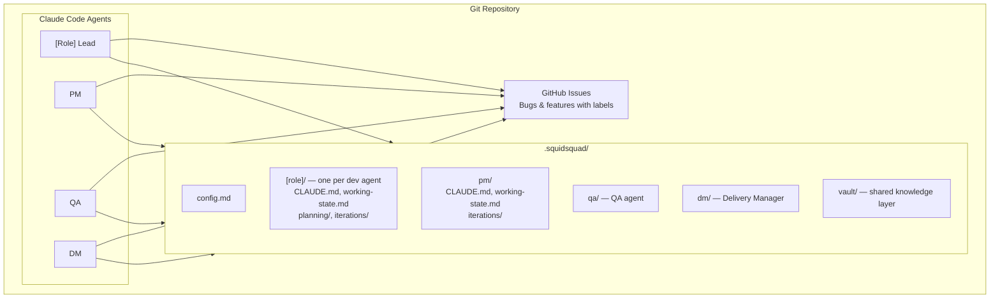

# SquidSquad

You are activating the SquidSquad multi-agent development coordination system. SquidSquad spins up Claude Code CLI instances — one per dev role you define, plus PM, QA, and DM (all mandatory) — that work autonomously on a shared codebase by coordinating through GitHub Issues and a shared `.squidsquad/` folder.

No meetings. No message queues. Just git and GitHub Issues.

---

## Architecture



### Roles

SquidSquad always has **PM**, **QA**, and **DM** agents. Dev agents are flexible — you define them at setup time.

| Agent | Owns | Loop |
|-------|------|------|
| **[role] Lead** (one per dev role) | Code for that role, bugs and features via GitHub Issues | Ralph Loop (fix bugs → implement features → test → push) |
| **QA** | Test results, `qa/qa-log.md`, bug verification, feature testing | Ralph Loop (E2E tests → verify bugs → test features → health checks → push) |
| **PM** | Product backlog, human interaction, feature intake, backlog management | Ralph Loop (check human → feature intake → backlog management → push) |
| **DM** | Delivery packaging, docs, CHANGELOG, version bumps, git tags | Ralph Loop (scan pending-ship → deliver docs → version bump → push) |

**Common team shapes:**

| Shape | Dev agents | Use when |
|-------|-----------|----------|
| `fe, be` | FE Lead + BE Lead + PM + QA + DM | Full-stack app with separate frontend and backend |
| `be` | BE Lead + PM + QA + DM | API-only, CLI tool, library, or skill repo |
| `api, worker` | API Lead + Worker Lead + PM + QA + DM | Backend split across services |
| `web, ios, api` | Web + iOS + API + PM + QA + DM | Multi-platform product |
| _(any names)_ | Whatever you define + PM + QA + DM | Custom team topology |

---

## File Structure Generated

When you invoke SquidSquad, it creates the following inside your project root. One folder is generated per dev agent — the example below shows a `be`-only setup:

```
.squidsquad/
├── config.md                   ← project config, test commands, counters, git protocol
├── [role]/                     ← one folder per dev agent, named after the role (e.g. skill/, be/, fe/)
│   ├── CLAUDE.md               ← full agent instructions (generated by compose.py deploy from sub-skills)
│   ├── SOUL.md                 ← agent personality (read at session start)
│   ├── working-state.md        ← crash recovery state
│   ├── planning/               ← per-task work files (code reviews, audits, AC analysis); canonical planning artifacts live in pm/ and qa/
│   └── iterations/             ← iter-N.md logs per cycle
├── dm/                         ← Delivery Manager
│   ├── CLAUDE.md               ← full agent instructions (generated by compose.py deploy)
│   ├── SOUL.md                 ← agent personality (read at session start)
│   ├── working-state.md        ← crash recovery state
│   └── iterations/             ← iter-N.md logs per cycle
├── pm/                         ← Product Manager (human-facing coordinator)
│   ├── CLAUDE.md               ← full agent instructions (generated by compose.py deploy)
│   ├── SOUL.md                 ← agent personality (read at session start)
│   ├── enhancements.md         ← product backlog / enhancement proposals
│   ├── planning/               ← feature planning artifacts (RESEARCH-NUMBER.md, CONTEXT-NUMBER.md); TEST-PLAN-NUMBER.md lives in qa/planning/ per #9184
│   ├── iterations/             ← iter-N.md logs per cycle
│   └── migrations/             ← historical migration logs (markdown tracker era)
├── qa/                         ← QA (same structure as [role]/, plus qa-log.md)
├── project/                    ← per-install overrides (L4 of #9925 4-layer model)
│   ├── shared-{instructions,responsibility,soul-directives}.md  ← all-agents L4 overrides
│   ├── {dev,dm,pm,qa}-{instructions,responsibility,soul-directives}.md  ← per-role L4 overrides
│   └── setup-upgrade-gate.md   ← optional gate-script invoked during setup/upgrade
└── vault/                      ← shared memory layer (all agents read/write per their own lane)
    ├── BRIEFING.md             ← daily context briefing read by all agents at boot
    ├── projects/               ← active project context, goals, constraints
    ├── areas/                  ← ongoing concerns: conventions, preferences, values
    ├── resources/              ← reference material, external docs
    ├── archives/               ← shipped features, closed decisions, historical context
    └── galaxy/                 ← atomic knowledge notes (decisions, patterns, learnings)
```

> **Note:** All agents share a single GitHub Issues tracker on the repo. Issues are labeled by role, type, and status. QA queries for `Pending Test` items, verifies them, and comments. DM queries for `Pending Ship` items and handles delivery.

For `fe, be` the structure gains a `fe/` folder alongside `be/`.

---

## Tracker — GitHub Issues

SquidSquad uses GitHub Issues as its tracker. All bugs and features are GitHub Issues with structured labels. Agents use `gh` CLI to create, query, update, and comment.

### Label Taxonomy

| Category | Labels | Purpose |
|----------|--------|---------|
| Type | `type:issue`, `type:task` | What kind of item |
| Priority | `priority:high`, `priority:medium`, `priority:low` | Triage ordering |
| Status | `status:open`, `status:pending`, `status:planning`, `status:planned`, `status:approved`, `status:in-progress`, `status:pending-test`, `status:pending-human-review`, `status:pending-human-setup`, `status:pending-ship`, `status:shipped` | Workflow state |
| Role | `role:skill`, `role:fe`, `role:be`, `role:pm`, `role:qa`, `role:dm` | Which agent owns it |
| Severity (bugs) | `severity:high`, `severity:medium`, `severity:low` | Bug impact |
| Special | `squidsquad`, `improvement-scan`, `squidsquad-test`, `review:human-required` | Metadata |

### Bug Flow

Status labels: `status:open` → `status:in-progress` → `status:pending-test` → `status:pending-ship` → (Issue closed)

### Feature Flow

Status labels: `status:pending` → `status:planning` → `status:planned` → `status:approved` → `status:in-progress` → `status:pending-test` → `status:pending-ship` → (Issue closed)

Agents can also transition to `status:pending-human-review` (HITL design review or PR review gate) or `status:pending-human-setup` (blocked on human environment/tool setup). Both route back to `status:in-progress` once resolved.

> **Note:** `pending` = awaiting human approval to plan. `planning` = PM running Feature Intake (Research → Discussion → Planning). `planned` = planning complete, awaiting human approval for execution. `approved` = human greenlit, dev picks it up. `pending-human-review` = awaiting human review (design iteration or PR). `pending-human-setup` = paused for human to complete tool/environment setup. `pending-ship` = QA verified, DM handles delivery. Closed = shipped.

### Discussion Protocol

Discussion entries are **Issue comments** using the same timestamped, role-signed format:
```
> [2026-01-15 09:00] **pm**: Proposed for this sprint.
> [2026-01-15 09:30] **fe-lead**: Picking this up. Status → In Progress.
```

### Feature Lifecycle (5-Phase)

Features go through a deep, research-driven lifecycle before reaching the dev agent:

1. **Research (PM)** — Spawn research agent: codebase impact, side effects, edge cases, integration risks → `.squidsquad/pm/planning/RESEARCH-NUMBER.md`
2. **Discussion (PM + Human)** — Present findings, ask targeted questions with WHY, capture locked decisions vs dev discretion → `.squidsquad/pm/planning/CONTEXT-NUMBER.md`
3. **Planning (PM)** — Synthesize research and discussion into the locked CONTEXT-NUMBER.md decisions; test-plan authorship belongs to QA in phase 5
4. **Execution (Dev)** — Implement reading the planning artifacts, run smoke tests before Pending Test
5. **QA (QA)** — Write the test plan, derive tests, record results → `.squidsquad/qa/planning/TEST-PLAN-NUMBER.md`, `TEST-NUMBER-tests.py`, `QA-RESULTS-NUMBER.md`. Only ship when all pass

Planning artifacts persist in `.squidsquad/pm/planning/` and `.squidsquad/qa/planning/` after ship — they are the audit trail. Bugs are excluded — they use the current lightweight flow. Trivial/cosmetic features can use light mode (PM skips research).

---

## The Ralph Loop

Each agent runs its own Ralph Loop — an autonomous work cycle that repeats on an interval. On startup, agents invoke `/loop [INTERVAL]m execute one Ralph Loop cycle` to schedule repeating cycles. The `/loop` command handles timing and re-invocation reliably — agents do NOT manually sleep or self-loop. Each cycle prints visible start/stop markers with timestamps (e.g. `[🦑] ---- cycle 3 started at 14:32:07 ----`) so the human can spot cycle boundaries in terminal scrollback.

Every step within the loop also prints a `[🦑 HH:MM:SS]` timestamped marker (e.g. `[🦑 HH:MM:SS] Pulling latest...`, `[🦑 HH:MM:SS] Triaging bugs...`). Key sub-actions (filing bugs, verifying fixes, committing) get their own markers too. This makes SquidSquad activity easy to scan in scrollback.

**Iteration log retention**: each agent keeps the last 20 iteration files in its `iterations/` directory. After logging a new iteration, older files beyond this limit are deleted. Git history preserves them if ever needed.

All agents maintain a **working state file** (`.squidsquad/[role]/working-state.md`) that tracks the current task, completed steps, and remaining work. This file is read on startup to resume mid-task after a context window reset. Agents also check **context pressure** at the start of each cycle — if `context_window.used_percentage` exceeds the threshold in `config.md` (default 70%), they save state, commit, and continue (Claude Code compresses prior messages automatically). All agents write their context pressure percentage to `.squidsquad/[role]/context-pressure` each cycle.

**Agent health monitoring**: The harness monitors agent liveness via direct PID checks (primary) and the `.claude-pid` file (fallback). Each agent writes its PID to `.squidsquad/[role]/.claude-pid` at boot; the harness reads it if its in-memory PID record is missing or stale. The legacy `.health` heartbeat file (`booting` / epoch timestamp / `dead` / `error|reason`) is still consulted as a last-resort fallback for wrapper-style agents but is being retired. Pre-flight checks (gh auth, correct branch) run before launching — failures prevent crash loops. The harness automatically reboots dead agents when their intent is `running`, with crash recovery via `.harness-state.json`.

**Auto versioning**: DM tracks a `Shipped Since Last Bump` counter in `config.md`. Each time an item is marked `Shipped`, the counter increments. When the counter reaches `Ship Threshold` (default 10) AND zero open issues exist, DM automatically bumps the minor version (e.g. `0.27.0` → `0.28.0`), updates `config.md` and `SKILL.md` frontmatter, adds a CHANGELOG section, creates a git tag, and pushes. Version bumps bypass PR flow.

**Comprehension testing**: Verify that agents correctly understand their instructions with automated spec-driven tests. Write a JSON spec file (`tests/comprehension/<issue>_spec.json`) listing the files to read and questions with expected behavioral answers. The pipeline (`references/scripts/run_comprehension_test.py`) spawns a test agent that reads only the listed files and answers the questions, then an eval agent that grades answers against expected behavior, producing a `results.json`. A deterministic pytest wrapper asserts all questions pass — no QA agent in the loop. Add new tests by dropping a spec file; run with `python tests/run_tests.py`.

**Multi-model subagents**: Token-heavy tasks (research, discussion prep, test plan drafting, improvement scanning) can be routed to external models via API instead of spawning Claude subagents. Configure which model handles each task type in the `Model Routing` section of `config.md` (e.g. `Research Model: deepseek-v4-pro`, `Comprehension Model: claude`). The router (`references/scripts/model_router.py`) provides a model-agnostic interface with automatic fallback to Claude if the external model fails. Comprehension testing is always Claude-only for same-model fidelity. API keys are stored in `~/.squidsquad/secrets` with restricted file permissions and read automatically by the model router.

### [Role] Lead Ralph Loop

Each dev agent follows this loop, substituting its own role name and tracker paths:

```
1. git pull
1b. Context pressure check — if above threshold, checkpoint state and continue (Claude Code compresses prior messages automatically)
1c. Resume from working-state.md if active task exists
2. Query GitHub Issues via `gh issue list` with label filters (`role:[role]`, `type:issue`, `status:open` or `status:in-progress`)
   → Write working state, fix issue, clear state on completion
   → If issue touches another agent's domain, file a new Issue with the appropriate `role:` label
   → Update issue status labels, append Discussion as Issue comment
3. Query GitHub Issues via `gh issue list` with label filters (`role:[role]`, `type:task`, `status:approved`)
   → Write working state, implement task, update state as sub-steps complete
   → Update status labels to In Progress, then Pending Test
   → Clear working state on completion, append Discussion as Issue comment
3b. Before marking Pending Test: run automated code review against changed files (configurable model in `config.md` under `Code Review Model`). Findings are dispositioned (fix, file to PM, or justified-ignore) and posted as PR comments. Design-level flaws send the task back to planning automatically.
4. Run [role] test command (from config.md)
5. If quiet cycle (no issues fixed, no tasks progressed):
   → If Improvement Scanning enabled and quiet cycle counter ≥ 3: scan target project for domain-specific improvements (max 2 per scan). Classify each finding as an **issue** (broken, wrong, or stale behavior — e.g. dead code, incorrect docs, failing edge cases) or **task** (new or enhanced capability — e.g. missing test coverage, performance optimization, UX improvement). File issues directly as GitHub Issues with `type:issue` + `status:open`; file tasks through PM with `type:task` + `status:pending` for human approval
   → Otherwise: skip log/commit, go to sleep
6. Log iteration to [role]/iterations/iter-N.md
7. cycle_post.py handles commit, push, and iteration logging
8. /loop handles re-invocation on interval — no manual sleep
```

### PM Ralph Loop

```
1. git pull
1b. Context pressure check — if above threshold, checkpoint state and continue (Claude Code compresses prior messages automatically)
1c. Resume from working-state.md if active task exists
1d. Task pickup — check for approved tasks assigned to PM, pick up and execute if found
2. Non-blocking human check-in (print note, continue immediately)
   → If human has provided input: file bugs to tracker; for features, discuss first (predict intent, surface questions, invite refinement), then file and run Feature Intake Process
   → Await human approval before marking features Approved (approval only offered after planning completes)
3. Backlog management — priority changes, feature status updates
3b. If GitHub Issues ingestion enabled: `gh issue list` → ingest new issues into trackers
4. If quiet cycle (no human input, no intake work): skip log/commit, go to sleep
5. Log iteration to pm/iterations/iter-N.md
6. cycle_post.py handles commit, push, and iteration logging
7. /loop handles re-invocation on interval — no manual sleep
```

### QA Ralph Loop

```
1. git pull
1b. Context pressure check — if above threshold, checkpoint state and continue (Claude Code compresses prior messages automatically)
1c. Resume from working-state.md if active task exists
1d. Task pickup — check for approved tasks assigned to QA, pick up and execute if found
2. Run full e2e test command (from config.md)
3. Log results to qa/qa-log.md
4. If tests fail: file bug as GitHub Issue with appropriate `role:` label via `gh issue create`
5. Query GitHub Issues via `gh issue list` with label filters for `status:pending-test` items → verify → update to Pending Ship (DM handles delivery → Shipped)
5b. Monitor open PRs, sync comments/merges/changes to Issues
6. Query GitHub Issues via `gh issue list` with label filters for `type:issue` + `status:in-progress` items marked as fixed → verify → close Issue
7. Agent health check: read `current-state` mtime via cross-clone `.local-config` paths for liveness (stalled if older than 2× iteration interval), file content for phase detail, flag stalled/idle agents
8. If quiet cycle (no issues found, no verifications): skip log/commit
9. Log iteration to qa/iterations/iter-N.md
10. cycle_post.py handles commit, push, and iteration logging
11. /loop handles re-invocation on interval — no manual sleep
```

### DM Ralph Loop

```
1. git pull
1b. Context pressure check — if above threshold, checkpoint state and continue (Claude Code compresses prior messages automatically)
1c. Resume from working-state.md if active task exists
1e. Triage bugs — query GitHub Issues for open bugs assigned to DM, fix delivery/doc issues directly
2. Scan for Pending Ship items — query GitHub Issues with label `status:pending-ship`
   → Check for `delivery:skip` tag — if found, mark Shipped immediately
   → Otherwise: create delivery package (update README, prepare CHANGELOG entry, check config/migration changes, enable feature flags)
   → Transition to Shipped, increment shipped-since-bump counter
3. Version bump check — if shipped-since-bump ≥ ship-threshold AND zero open issues: bump minor version, update config.md + SKILL.md frontmatter + CHANGELOG.md, create git tag, push
4. If quiet cycle (no deliveries, no bug fixes, no version bumps):
   → If Improvement Scanning enabled and quiet cycle counter ≥ 3: run doc improvement scan (max 3 fixes per cycle, rotating across user-facing docs)
   → Otherwise: skip log/commit
5. cycle_post.py handles commit, push, and iteration logging
6. /loop handles re-invocation on interval — no manual sleep
```

---

## Git Protocol

All agents follow these rules to minimize merge conflicts on shared tracker files:

- Always `git pull` before starting any work.
- GitHub Issue comments are **append-only**: never edit or delete existing comments — only add new comments. Status transitions must go through `python references/scripts/tracker.py transition <number> <from> <to> --role <role>`, which enforces legal transitions and role authority; agents never construct `gh issue edit --add-label / --remove-label` commands manually. Closed issues are terminal.
- Discussion comments on Issues are append-only: always add a new comment, never edit previous ones.
- Push after completing each work unit (bug fix, feature, test run).
- **Commit prefix convention**: every commit message must start with the agent's role name followed by a colon (e.g. `skill: fix bug`, `fe: add button`, `pm: verify features`). This prefix is used by the status line and PM health checks to detect agent activity via `git log --grep`.
- If a merge conflict occurs on working-branch state files: keep both versions by appending, never discard. Most state files (iterations, working-state, diagnostics) now live on the state branch (`squid-squad`) to avoid cross-agent conflicts. Tracker data lives in GitHub Issues and is conflict-free.

### Branch + PR Workflow

SquidSquad uses a single-mode branch+PR workflow (#9478): dev agents always work on feature branches and create PRs — there is no toggle to push directly to main.

- **Branching convention**: configurable via the `Branch Pattern` field in `config.md`. Default: `squidsquad/task/{number}` (e.g. `squidsquad/task/67`) — all roles share one branch per task, enabling single-PR holistic review of planning + code together. Projects can also use role-scoped patterns like `squidsquad/{role}/{number}` for per-role branches.
- **Task-level branch boundaries**: agents automatically check out the correct feature branch before working on each task item (verification, shipping, bug fixes) and return to the working branch when done. This is handled by the transport layer (`task-begin` / `task-end`) — agents don't manage branches manually.
- **Dev agent workflow**: during `In Progress`, the dev pushes commits to the feature branch with no PR. When the dev transitions the task to `Pending Test`, the same `cycle_post.py` cycle opens the PR as a **draft** (`gh pr create --draft`) and then `tracker.py` auto-converts it to ready-for-review (#4991 GAP-3). If a human reviewer later requests changes, the dev flips the PR back to draft (`gh pr ready --undo`) before pushing fixes — a ready PR must never be receiving in-flight commits.
- **PM and QA workflow**: each cycle, check open SquidSquad PRs via `gh pr list`. For each PR:
  - If merged: update the tracker item status to `Pending Ship` (DM handles delivery and ships)
  - If changes requested: update status back to `In Progress` and append the feedback to Discussion
  - If new comments: append them to the tracker Discussion
- **PM and QA still push to main** — only dev agent feature/bug work goes through PRs. PM updates (iterations, planning artifacts) and QA updates (qa-log, iterations) continue to push directly to main. All tracker operations use GitHub Issues.

### Auto-Merge (optional)

When `Auto Merge: yes` is set in `config.md`, the harness automatically merges PRs for verified tasks — you don't need to merge them manually. Agents request merges via `POST /merge` on the harness API; the harness executes the merge, and if the PR touched template files (`references/`), automatically recomposes agent templates and reboots only the affected agents.

- **All verified items** — both bug fixes and tasks are auto-merged after QA verification passes.
- **Per-task override**: add the `merge:manual` label to any task to skip auto-merge and require human review.
- **Conflict handling**: if a merge conflict is detected, QA routes the task back to the dev agent to resolve. QA re-verifies after resolution, then the merge is retried.
- **Auto-recomposition**: after a merge that touches `references/`, the harness runs `compose.py deploy-all` and reboots agents whose `CLAUDE.md` or `SOUL.md` changed. This eliminates missed recompositions.
- When `Auto Merge: no` (default for new installs), all PRs require manual merge as before.

---

## Setup Instructions

When this skill is invoked (via `npx squidsquad` or `/squidsquad-setup`), the
**installer agent** walks the user through an adaptive, conversation-driven
setup. The canonical operating manual the installer session follows, top to
bottom, is:

> **`docs/INSTALLER-RUNTIME.md`**

That manual covers the installer's soul and flow (consent & guardrails,
project understanding, workflow mapping, per-agent confirmation, apply,
independent verification, commit & hand-off), the installer agent lifecycle
(ephemeral — hand off and exit), and its § helper playbook carries the
concrete helper invocation sequences, the manifest-driven setup_requirements
walker, the migration walk, and error recovery. Do NOT reimplement the setup
flow inline here — the manual is the single source of truth. SKILL.md
describes SquidSquad's architecture; INSTALLER-RUNTIME.md describes how the
installer behaves when installing it.

The installer uses these mechanical helpers:

- `references/scripts/wizard.py` — gh prerequisite check, re-run detection,
  repo metadata, project-name validation, config.md writer, filesystem
  scaffolder, label management and migration
- `references/scripts/manifest.py` — role / capability / preset manifest registry:
  loading, validation, pipeline resolution
- `references/scripts/compose.py deploy <role>` — per-role CLAUDE.md
  composition (role template + shared sub-skills + placeholder substitution)

All three expose JSON-output CLI commands so the installer agent can call them
and act on structured results without parsing free text.

The taxonomy the installer uses is **not** a hardcoded table. It lives in:

- `references/roles/<role>/` — per-role directory containing `manifest.yaml`,
  `SOUL.md`, and `instructions.md` (the entry file for composition)
- `references/presets/<preset>/` — preset manifests declaring
  `role_install_order` (PM, QA, and DM are implicit and always installed)

(Per-agent tool/MCP/CLI configuration is no longer part of the install taxonomy — it's a post-install runtime concern handled per agent; see INSTALLER-ARCH.md §8.)

Adding a new role or preset is a pure data change: drop in a new
directory, run the validator, re-deploy. No wizard code change required.

---

## Upgrade Instructions

When the user invokes upgrade (via `/squidsquad-upgrade` or "upgrade squidsquad"), follow this orchestrator-driven flow. No parallel subagents — compose.py handles all template regeneration.

### Step 1 — Detect Version Gap

Read `.squidsquad/config.md` to get installed `SquidSquad Version`.
Read `SKILL.md` frontmatter for current version.

If both match: tell the user they're up to date and stop.

### Step 2 — Read Install Spec (if present)

Read `.squidsquad/.install-spec.json` for the install-time configuration (agent list, preset, flags). If the file does not exist (pre-install-spec installations), derive the agent list from the `Dev Agents` field in `config.md` and proceed — the upgrade flow works without it.

### Step 3 — Regenerate Agent Templates

Rebuild all agent CLAUDE.md files from the current sub-skill sources using the compose skill:

```
/squidsquad-compose
```

Or directly via CLI: `python references/scripts/compose.py deploy-all`

This regenerates `.squidsquad/[role]/CLAUDE.md` for every configured agent (dev agents from config + PM + QA + DM — all always present). Placeholder substitution (`[ROLE]`, `[INTERVAL]`, `[ROLE_TEST_CMD]`, etc.) is handled automatically by compose.py.

**SOUL.md preservation**: `compose.py deploy_role` never overwrites an existing SOUL.md — it only writes SOUL.md when the file is missing. User customizations to SOUL.md are preserved across upgrades.

**Vault preservation**: The upgrade does not touch `.squidsquad/vault/`. All vault content is preserved.

### Step 4 — Patch Config Schema (v1 → v2)

If `Architecture Version` in config.md is `1` (or absent), add any missing v2 sections with defaults. **Do not delete existing v1 sections** — agents still read them via config.py.

Check for and add these sections if missing (with defaults):

- `## Preset` — `Id: software-dev`
- `## Tools` — `(none)`
- `## Iteration Interval` — `Minutes: [existing interval value, or 30]` (the polling-fallback cadence; config.py reads it here, not under the old `## Loop` heading)
- `## Context Pressure` — `Threshold: [existing threshold value, or 70]`
- `## Auto Merge` — `Enabled: [existing auto-merge value, or yes]` (the merge gate — the one surviving PR variable, #13355)
- `## PR Flow` — `Enabled: yes` (branch+PR is an invariant since #9478/#13355; config.py reads pr-flow from this section, not from `## Flags`)
- `## Flags` — `Diagnostics: yes`, `Improvement Scan: [existing value]`, `Vault Remember: [existing value]`
- `## Git Branches` — `Working Branch: [existing value or main]`, `State Branch: [existing value or squid-squad]`
- `## Forge Backend` — `Provider: github`, `Endpoint: https://api.github.com`
- `## Model Routing` — carry over existing values or use defaults (`Default Model: claude`, etc.)

After patching, set `Architecture Version` to `2`.

### Step 5 — Sync Labels

```bash
python references/scripts/wizard.py ensure-labels
```

This is idempotent — it creates any missing GitHub Issue labels and skips existing ones.

### Step 6 — Update Version and Commit

Update `SquidSquad Version` in `.squidsquad/config.md` to the current skill version.

```bash
git add .squidsquad/
git commit -m "squidsquad: upgrade to [VERSION]"
git push
```

**Clone isolation note**: Agents running in sibling clones will receive the updated CLAUDE.md on their next `git pull` (which happens at the start of each cycle via cycle_pre.py). The upgrade only writes to the primary repo — agents are not restarted automatically.

### Step 7 — Report

Tell the user: version upgraded from → to, templates regenerated via compose.py, config schema version, any new sections added, label sync result, any failures.

---

## Schema Changelog (Historical)

> **Note**: SquidSquad now uses GitHub Issues as its tracker (since v0.10.0). The markdown tracker schemas below are historical — no new schema migrations are needed. Existing markdown tracker files in `bugs/`, `features/`, and `archived/` are legacy artifacts.

### v0.10.0+: GitHub Issues Tracker

All bugs and features are tracked as GitHub Issues with structured labels. Agents use `python references/scripts/tracker.py` for all tracker operations. Status transitions are enforced by the script. See the Tracker Protocol sub-skill for details.

### Schema 3 (v0.9.0, superseded): Individual Markdown Files

Replaced monolithic `bugs.md` and `features.md` with individual files in `bugs/` and `features/` directories.

### Schema 2 (v0.8.0, superseded): Pending Ship Status

Added `Pending Ship` status to the feature lifecycle for DM delivery.

### Schema 1 (v0.5.0, superseded): Original Markdown Tracker

Original monolithic `bugs.md` and `features.md` files with inline fields.

---

## `/squidsquad-issue` — Report a SquidSquad Issue

When the user says `/squidsquad-issue` (or "report an issue", "squidsquad issue"), collect an issue report and file it to the upstream SquidSquad repo. Works from any agent session.

**Instructions:**

1. Generate the report template: `python references/scripts/diagnostics.py report`
2. Show the full report to the user via AskUserQuestion. Let them edit the description, steps to reproduce, and redact any sensitive info from the config/diagnostics sections.
3. After user confirms, attempt to file upstream:
   ```bash
   gh issue create -R WallyDoodlez/SquidSquad --title "[Bug]: <user's title>" --body "<report content>"
   ```
4. If `gh` auth fails for the upstream repo, generate a pre-filled URL:
   ```
   https://github.com/WallyDoodlez/SquidSquad/issues/new?title=[Bug]:+<title>&body=<url-encoded-body>
   ```
   Print the URL for the user to open in their browser.
5. Confirm: print the issue URL or the browser fallback URL.

**Privacy**: No code, secrets, or project file paths in the report. Config snapshot is auto-sanitized. User previews everything before filing.

---

## `/squidsquad-status` — Squad Overview Command

When the user says `/squidsquad-status` (or "squad status", "show me the squad", etc.), generate a quick dashboard of the entire SquidSquad team. This works from any Claude session in the repo — not just the PM agent.

**Instructions:**

1. Read `.squidsquad/config.md` to get the list of dev agents and the loop interval.
2. For each agent (dev agents + PM + QA + DM):
   - Check health: prefer `python references/scripts/squidsquad_cli.py status` when the harness is reachable — it surfaces live intent + PID state per agent. If the harness is down, fall back to reading `.squidsquad/[role]/current-state` mtime (each agent updates it each cycle) and/or `.squidsquad/[role]/.claude-pid` (PID written at boot). The legacy `.health` heartbeat file (`booting` / epoch / `dead` / `error|reason`) is still consulted as a last-resort fallback for wrapper-style agents but is being retired. Final fallback if none of these are available: `git log --oneline --since="[2×interval] minutes ago" --grep="^[agent]:"` — if commits found, show as `active`; if prior commits exist but none recent, show as `stalled`; else `unknown`.
   - Show last commit time: `git log --oneline --grep="^[agent]:" -1 --format="%ar"`
3. For each dev agent, query GitHub Issues via `python references/scripts/tracker.py`:
   - `python references/scripts/tracker.py list-issues [role]` — count and list open issues
   - `python references/scripts/tracker.py list-tasks [role] --status approved` — count and list approved tasks
   - `python references/scripts/tracker.py list-tasks [role] --status in-progress` — count and list in-progress tasks
4. List recent shipped items: `gh issue list --label "squidsquad" --label "status:shipped" --state closed --limit 5 --json number,title` (the `status:shipped` label filter excludes issues closed for other reasons — cancellations, won't-fix, duplicates).
5. Format as a clean dashboard:

```
🦑 SquidSquad Status — [project name]
══════════════════════════════════════

Agent        Health     Last Commit
─────        ──────     ───────────
skill        active     2 minutes ago
pm           active     3 minutes ago
qa           active     4 minutes ago
dm           active     5 minutes ago

Backlog
───────
skill: 2 open bugs (#93, #95), 1 approved feat (#67)

Recently Shipped
────────────────
1. #66 — Deterministic script layer
2. #29 — Agent name aliases
3. ...
```

## `/squidsquad-interval` — Change Loop Interval On The Fly

When the user says `/squidsquad-interval <Nm>` (e.g. `/squidsquad-interval 10m`), change the Ralph Loop interval for all agents without restarting.

**Instructions:**

1. **Parse input**: Extract the number and validate:
   - Must be an integer followed by `m` (e.g. `5m`, `10m`, `15m`). The `m` suffix is optional — bare integers are accepted (e.g. `10` is treated as `10m`).
   - Must be >= 5 (minimum enforced to prevent git conflicts between concurrent agents).
   - If invalid or missing, print usage: `/squidsquad-interval <Nm>` (e.g. `/squidsquad-interval 10m`). Minimum 5 minutes.
2. **Read current interval** from `.squidsquad/config.md` under `Iteration Interval > Minutes`.
3. **Update config.md**: Replace the `Minutes` value with the new interval.
4. **Reschedule current agent's cron**:
   - Call `CronDelete` with the existing cron job ID.
   - Call `CronCreate` with `*/N * * * *` (or appropriate cron expression for larger intervals), the same prompt (`execute one Ralph Loop cycle`), and `recurring: true`.
5. **Print confirmation**: `Interval changed from [old]m to [new]m. All agents will pick up the change on their next cycle.`

Other agents detect the change automatically: each agent re-reads `config.md` at the start of every cycle (Step 1d — Interval Sync) and re-schedules its cron if the interval has changed.
