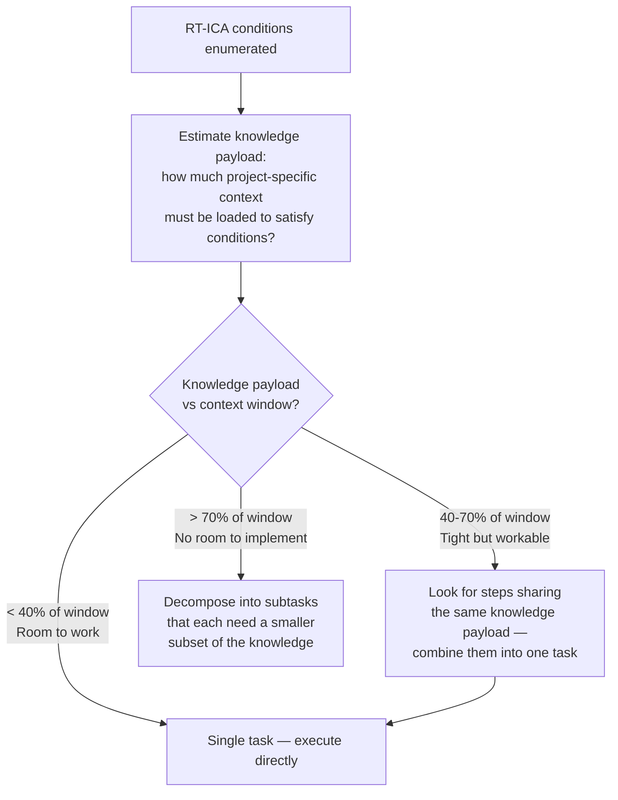

# RT-ICA: Reverse Thinking - Information Completeness Assessment

## Sister skill — when to use which

| If you are… | Load |
|---|---|
| At the S2 implementation gate where missing inputs must halt the pipeline | **`dh:rt-ica`** (this skill — blocking) |
| Grooming a backlog item, generating a plan, decomposing tasks under uncertainty | **`dh:planner-rt-ica`** (the non-blocking sister skill) |

`dh:rt-ica` and `dh:planner-rt-ica` are deliberately split: same framework, different cost-of-being-wrong. At the implementation gate, a `MISSING` condition is a halt event because the agent would otherwise guess. During planning or grooming, the same `MISSING` is a research task or a question for the human. Do not consolidate.

## Purpose

RT-ICA surfaces what the executor needs to know before it can act without stopping.

For every goal (top-level and each decomposed sub-goal), the model should:

1. Reverse-think prerequisites from the goal
2. Assess information completeness for each prerequisite
3. Either BLOCK planning until missing inputs are obtained, or APPROVE with explicit assumptions

<core_rule>

RT-ICA should be performed before planning, delegation, or solution design on:

1. The overall goal/request
2. Each decomposed goal or sub-goal that could fail due to missing information

If any required condition is MISSING, stop and request only the missing information.

</core_rule>

## Complexity Model

Task complexity is not implementation difficulty — it is the ratio of project-specific knowledge required to context window available.

Training data provides craft knowledge (language patterns, framework APIs, tooling). That is free. What consumes context budget is everything specific to this project: schemas, conventions, constraints, interfaces, user preferences, existing system behavior. That knowledge must be loaded before the agent can act.

**This changes how RT-ICA results inform task design:**



**Step combining:** When two steps need the same project knowledge loaded, combining them is nearly free — the knowledge is loaded once, both steps execute in the remaining space. Splitting them wastes context by loading the same knowledge twice. Step boundaries belong where **information gaps** exist, not where implementation boundaries happen to fall.

**Dynamic vs static constraints:** RT-ICA produces dynamic constraints — discovered fresh from the current goal, disposable after use. These provide visibility into edges that would cause problems if crossed blindly: scope creep, missing user opinions, abstract requirements that need to become definite. This is different from static process constraints (hardcoded gates, enforcement hooks, "MUST do X before Y" rules baked into workflow definitions) which carry maintenance cost and go stale. RT-ICA's value is turning the abstract into the definite for each specific task.

## Self-Initialization from Backlog Item

When invoked with a `#N` argument (e.g., `Skill(skill='dh:rt-ica', args='#42')`):

1. Load item context before doing anything else:

```text
mcp__plugin_dh_backlog__backlog_view(selector="#N", summary=false)
```

2. Extract: `title`, `description`, `sections['acceptance criteria']`,
   `sections['expected behavior']`, `sections['impact radius']`, and any other populated sections.
3. Use the loaded content as the goal input for the RT-ICA procedure below.
4. After completing the assessment, write the RT-ICA result back to the item:

```text
mcp__plugin_dh_backlog__backlog_groom(selector="#N", section="RT-ICA", content="{RT-ICA SUMMARY block}")
```

Without a `#N` arg, the skill expects the goal/input to be provided inline in the invocation
context. Invoking without args and without inline context returns BLOCKED — always pass `#N`
when invoking from a workflow step that has an item reference.

## Activation Triggers

<activation_triggers>

Invoke RT-ICA when receiving ANY of:

- Spec, request, ticket, user story, PRD, architecture design, RFC
- Request to produce a plan, execution order, agent delegation, guardrails, acceptance criteria, or rollout steps
- Any multi-step engineering effort with dependencies, unknowns, constraints, or risk

**Integration Points** (where RT-ICA checkpoints MUST occur):

1. Before creating the top-level plan
2. Before delegating tasks to specialized agents (per-agent input completeness)
3. Before finalizing acceptance criteria (verify testability inputs exist)
4. Before defining rollout/ops steps (verify env and access inputs exist)

</activation_triggers>

## Definitions

<definitions>

| Term                     | Definition                                                             |
| ------------------------ | ---------------------------------------------------------------------- |
| **Goal**                 | A desired outcome the user wants                                       |
| **Condition**            | A prerequisite that must be true to achieve the goal                   |
| **Required Information** | Concrete data needed to confirm or satisfy a condition                 |
| **AVAILABLE**            | Explicitly present in provided material or loaded project evidence. Must cite exact source. |
| **EVIDENCE-DERIVED**     | Not stated verbatim, but forced by cited evidence. Must state inference, basis, and contradiction check. Not allowed for taste, policy, product meaning, security, external effects, or user preference. |
| **SAFE-DEFAULTED**       | Not known as fact, but a local default was chosen because every Safe Default Gate criterion passed. Must record chosen default, scope, reversibility, and verification. |
| **MISSING**              | Required information is not available, not evidence-derived, and not safe-defaultable. |
| **HARD-BLOCKED**         | Missing input involves irreversible or destructive action, external side effects, credentials, production data, compliance or security policy, or meaning-affecting user or product choice. |

</definitions>

## Safe Default Gate

Safe-defaulting is permission to choose a low-risk local implementation detail, not permission to invent a requirement. If the missing detail affects meaning, policy, external behavior, data, security, or user intent, it is not safe-defaultable.

A missing detail may be `SAFE-DEFAULTED` only when **all** of the following are true:

1. **Bounded outcome with known blast radius** - the possible outcomes are known, limited, and do not create material risk outside the task boundary.
2. **Blast radius is named** - exact files, commands, generated artifacts, tests, and runtime surfaces affected are identified.
3. **Existing evidence narrows the choice** - code, tests, docs, schemas, examples, or nearby patterns constrain acceptable options. Cite the project evidence; do not rely on general model prior.
4. **Easily reversible action** - the change can be undone cleanly with a local revert, file edit, config rollback, branch reset, or regenerated artifact.
5. **Low-impact local change** - the decision affects naming, formatting, organization, helper structure, comments, local docs, tests, or similar local implementation details without changing scope or product intent.
6. **Convention-following choice** - the selected option matches a cited repository, team, or platform convention.
7. **Equivalent implementation paths** - if multiple approaches are possible, they are equivalent for current requirements, preserve behavior, and do not introduce new operational risk.
8. **Verification method exists before action** - tests, CI, type checks, linters, static analysis, or reproducible local validation exist and can expose a wrong choice before merge or release.
9. **Non-user-visible internal improvement** - the choice does not alter product behavior, public contracts, data formats, persistence, security posture, or external integrations.
10. **Safe default exists** - the project, user instructions, or platform define a conservative default and the agent is following it.
11. **Generated artifact can be regenerated** - if editing derived outputs, the source of truth and regeneration command are known.
12. **Failure mode is recoverable** - a wrong choice fails loudly as a test failure, build rejection, local exception, or harmless no-op rather than causing hidden corruption, user impact, deployment damage, or data loss.
13. **Scope is explicit and narrow** - the task boundary is clear and the choice does not expand the requirement or alter unrelated systems.
14. **No external side effect** - work stays in the local workspace, branch, draft, sandbox, test environment, or disposable resource.
15. **Risk is observable before commit** - problems surface before merge, release, deploy, publish, notify, charge, delete, migrate, or otherwise affect external state.
16. **Choice affects presentation or implementation detail, not meaning** - wording, ordering, section names, formatting, examples, explanation style, internal structure, or equivalent implementation detail may change, but the underlying requirement or behavior does not.

If any item is false, unknown, or subjective, do not safe-default. Mark the condition `MISSING` or `HARD-BLOCKED`.

## Ambiguity Escalation Rules

If ambiguity would increase the risk profile of the task, do not let the agent silently choose a path. Convert the ambiguity into a research item, clarification question, or hard block, then present the findings and open decisions back to the human in a compact, decision-ready form.

Use the following rules:

1. **Security boundary or credential ambiguity** - any action involving secrets, credentials, tokens, auth rules, permissions, encryption keys, signing keys, customer data, or privilege escalation where the agent cannot prove the change is safe. Stop when access scope, exposure risk, or downstream authority is unclear.
2. **External side effect the agent cannot undo** - sending email, posting publicly, notifying users, charging money, opening tickets against another team, modifying vendor systems, or triggering a workflow outside the repo. If the action leaves the local workspace and cannot be confidently recalled, ask first.
3. **Data migration or schema change with uncertain compatibility** - changing persisted data, migrations, serialization formats, protocol contracts, public APIs, config schemas, or artifact formats when backward or forward compatibility is not proven. Stop when existing consumers may break and the agent cannot verify them.
4. **Policy, legal, compliance, or privacy uncertainty** - anything involving licenses, regulated data, retention rules, audit requirements, user privacy, export controls, employment matters, or contractual obligations. The agent must not infer authority from silence.
5. **Missing rollback path** - a change where the agent cannot describe how to recover the previous known-good state. This includes deployments, infra mutations, dependency upgrades, migrations, and generated artifacts. If rollback is unknown, treat the action as unsafe.
6. **Contradiction with explicit instructions or project conventions** - when the task request conflicts with repository rules, prior decisions, ADRs, coding standards, security policy, or direct user instructions. Stop and surface the conflict instead of silently choosing one.
7. **Insufficient test signal for high-impact behavior** - tests pass, but they do not exercise the behavior being changed, or the agent cannot map the test coverage to the risk. Passing unrelated CI is not permission to proceed.
8. **Authority ambiguity** - the agent can technically perform the action, but it is unclear whether it is allowed to make that decision. This includes changing scope, accepting tradeoffs, redefining requirements, merging, releasing, deleting, or overriding another owner.
9. **Dependency or supply-chain uncertainty** - adding, upgrading, replacing, vendoring, or executing third-party code when license, provenance, security posture, runtime behavior, or maintenance status is unclear. Stop when the agent cannot justify the dependency.
10. **Cost, quota, or resource expansion** - actions that may materially increase spend, consume limited quota, reserve infrastructure, start long-running jobs, or scale resources. If the agent cannot estimate or bound the cost, ask first.
11. **Ambiguous ownership of failure** - when a failure could belong to environment, test data, credentials, infrastructure, product behavior, or the agent’s own change, and proceeding would mask the root cause. Stop and report the ambiguity.
12. **User-visible behavior change without confirmed intent** - UI text, API responses, workflow behavior, permissions, defaults, notifications, error handling, or product semantics that could be valid either way. If users would notice and intent is not explicit, ask.

Default routing for these ambiguity classes:

- `HARD-BLOCKED` for security, privacy, destructive external effects, irreversible data risk, compliance, missing rollback, or unclear authority over consequential actions.
- `REQUIRES-USER` when the ambiguity is about intent, policy, scope, ownership, user-visible behavior, or risk acceptance.
- `REQUIRES-DISCOVERY` when repository, runtime, test, or architecture evidence could resolve the ambiguity safely before action.

These are provisional routes, not permanent labels. After discovery:

- If evidence resolves the ambiguity, reclassify it as `AVAILABLE` or `EVIDENCE-DERIVED` and proceed without asking the human.
- If the remaining choice becomes a bounded local default and every Safe Default Gate criterion passes, record it as `SAFE-DEFAULTED` and proceed without asking the human.
- Ask the human only for ambiguity that remains unresolved after research or still requires human judgment.

Respect the human's attention:

- Never interrupt with one-off clarification questions. All `REQUIRES-USER` paths must be batched into a single clarification packet for the current goal or sub-goal.
- Do required discovery first when the answer may already exist in local evidence, runtime evidence, internet research, or other available tools.
- Before asking the human, explore the repo, docs, tests, runtime artifacts, internet sources, or other relevant tools enough to narrow the question and eliminate avoidable uncertainty.
- If exploration disproves the cautionary assumption or resolves the risk, do not ask the human. Reclassify the condition from evidence, answer it directly, and continue.
- Present research findings and open choices together so the human can make an educated decision without redoing the investigation.
- Name the question, why it matters to the goal, the side effects or affected boundary, the current constraints, the available options that fit those constraints, the risk of choosing incorrectly, and the recommended path if one exists.
- Keep the batch minimal in count but complete in context: ask only the questions that still require human judgment after exploration is exhausted.

## Report Back For Review

Exploration for RT-ICA often surfaces issues beyond the current scoped task. These do not automatically block the current work, but they must be reported back to the orchestrator or supervisor agent so they can be tracked, reviewed, and converted into follow-up tasks or backlog items when appropriate.

Create a review report for findings such as:

1. **Tool failure or unreliable tooling** - required tools fail, behave inconsistently, return partial results, time out, produce malformed output, or cannot access expected files, services, commands, APIs, or repositories.
2. **Environmental or configuration failure** - tests fail because of missing dependencies, credentials, paths, services, ports, containers, hardware, permissions, clocks, network access, package versions, or machine-specific state rather than because product behavior is clearly wrong.
3. **Edit, read, or write failure** - the agent cannot read, modify, save, patch, diff, move, delete, or inspect expected files. Include what was attempted, what failed, and whether the final state is known.
4. **Verification gap** - implementation completed but relevant validation could not run, or validation ran but did not exercise the risk being changed.
5. **Suspicious code quality concern** - magic numbers, duplicated logic, non-DRY implementation, non-SOLID architecture, unclear ownership, hidden coupling, excessive complexity, stale abstractions, or brittle tests.
6. **Stale or misleading documentation** - docs, comments, examples, ADRs, READMEs, generated references, or inline guidance appear outdated, contradicted by the code, or likely to mislead future agents or engineers.
7. **TOCTOU or state-race concern** - behavior depends on a check-then-act sequence where state may change between validation and use, especially around files, permissions, credentials, locks, external resources, deployments, or concurrent workflows.
8. **Workaround introduced to achieve the goal** - workaround, shim, bypass, hardcoded assumption, skipped validation, temporary branch, compatibility hack, retry loop, fallback path, or manual step was added to make progress.
9. **Tech debt introduced knowingly** - immediate goal was satisfied but cleanup work, architectural compromise, test debt, duplicated behavior, unclear naming, narrow assumptions, or future migration risk remains.
10. **Unexpected complexity or scope expansion** - the task required touching more systems, files, layers, dependencies, or concepts than expected, even if implementation succeeded.
11. **Inconsistent project conventions** - nearby code uses conflicting patterns and the agent had to choose one without a clear standard.
12. **Ambiguous ownership or boundary friction** - unclear which module, team, interface, service, config layer, or document owns the behavior being changed.
13. **Manual intervention required** - a human must run a command, provide credentials, inspect an environment, approve a change, update an external system, or diagnose a failure before the work can be considered complete.
14. **Partial success** - some parts of the task were completed but others were skipped, blocked, approximated, unverified, or deferred.
15. **Risk accepted locally** - the agent proceeded because the risk was bounded and reversible, but the concern is still worth reviewing before merge, release, or future reuse.

For each report-back item, record:

- Issue category
- What was observed
- Why it matters
- Whether it blocks current work
- Recommended owner or destination
- Recommended follow-up action or backlog item

When such findings exist, emit them in a literal `<concerns>...</concerns>` block so the orchestrator or supervisor can append them into backlog `## Concerns` using the plugin's existing concern-ingestion flow. Do not bury these findings only inside prose.

## RT-ICA Procedure

Apply this procedure to each goal and sub-goal:

The final RT-ICA artifact should function like a compact PRD for the scoped work. It should leave downstream planners and executors with explicit goals, constraints, evidence, open questions, resolved decisions, risks, validation expectations, and review-worthy findings without requiring reconstruction from chat history.

<procedure>

### Step 1: Goal Reconstruction

Produce:

- **Goal statement**: One sentence describing the desired outcome
- **Output form**: What deliverable proves success (artifact, behavior, metric, deployment state)
- **Scope boundaries**: In-scope/out-of-scope if stated

### Step 2: Reverse Prerequisite Enumeration

Work backwards from the goal to list ALL conditions required for success.

Question discovery is recursive:

- During exploration, research, or subagent work, new unknowns may appear.
- Any newly discovered unknown that matters to the goal must be added to the active question queue.
- For each queued question, first attempt resolution through repo evidence, runtime evidence, tests, internet research, or other available tools.
- If research answers the question, close it from the queue and record the evidence.
- If research narrows but does not resolve it, keep it in the queue with updated constraints, options, and risks.
- If it still requires human judgment after exploration, include it in the batched clarification packet.
- Repeat until each queued question is either answered from evidence or escalated to the human.

<condition_categories>

Include conditions in these categories (where applicable):

| Category                    | Example Conditions                                      |
| --------------------------- | ------------------------------------------------------- |
| Functional requirements     | Features, behaviors, user flows                         |
| Non-functional requirements | Latency, throughput, availability, compliance, security |
| Interfaces/Integration      | APIs, schemas, dependencies, external systems           |
| Environment/Runtime         | Cloud, region, OS, language, build system               |
| Data requirements           | Sources, quality, migration, retention                  |
| Access/Permissions          | Repos, secrets, credentials, IAM                        |
| Operational constraints     | SLOs, oncall, monitoring, incident response             |
| Delivery constraints        | Timeline, release process, approvals                    |
| Verification needs          | Tests, canaries, acceptance criteria, observability     |
| Risks/Failure modes         | Rollback, data loss, security exposure                  |
| Replacement coverage        | Full capability inventory of module being replaced, coverage matrix against replacement tool |
| Data Deletion Fidelity      | When goal text signals source data will be deleted (keywords: "delete", "remove", "drop", "migrate from X", "replace X with Y", "convert format", "remove source after migration"): acceptance criteria must include a content completeness check against real production data AND an explicit deletion gate. If absent: classify as MISSING. |

</condition_categories>

For each condition, specify:

- **Condition name**
- **Required information** to verify/satisfy it
- **Why it matters** (one line)

### Step 3: Evidence and Defaultability Verification

For each condition, classify evidence first, then action disposition.

**Evidence status:**

| Status                 | Required proof |
| ---------------------- | -------------- |
| **AVAILABLE**          | Cite exact source snippet or section name |
| **EVIDENCE-DERIVED**   | Cite source, inference, basis, and contradiction check |
| **UNRESOLVED**         | State what source is absent or ambiguous |

If evidence status is `UNRESOLVED`, classify disposition:

| Disposition              | Use when |
| ------------------------ | -------- |
| **SAFE-DEFAULTABLE**     | Every Safe Default Gate criterion passes |
| **REQUIRES-DISCOVERY**   | Repo, runtime, test, or document inspection can resolve the gap |
| **REQUIRES-USER**        | The missing detail affects product meaning, policy, security, external systems, approvals, or user-visible behavior |
| **HARD-BLOCK**           | The gap is destructive, irreversible, external-side-effecting, production-data-affecting, credential-related, compliance-related, or not recoverable |

Final condition label:

- `AVAILABLE`
- `EVIDENCE-DERIVED`
- `SAFE-DEFAULTED`
- `MISSING`
- `HARD-BLOCKED`

### Step 4: Completeness Decision

```text
IF any condition is HARD-BLOCKED:
    DECISION = BLOCKED
ELSE IF any condition is MISSING or REQUIRES-USER:
    DECISION = BLOCKED
ELSE IF any condition is REQUIRES-DISCOVERY:
    DECISION = BLOCKED unless the task is explicitly a discovery task
ELSE:
    DECISION = APPROVED
```

`SAFE-DEFAULTABLE` does **not** mean "fact known." It means the agent may choose a local default and must record that choice explicitly as `SAFE-DEFAULTED`.

### Step 5: Action Based on Decision

<decision_actions>

**IF BLOCKED:**

1. Do NOT plan
2. Ask ONLY for missing inputs
3. Batch all human-required questions for the current scope into one clarification packet
4. Prefer multiple-choice or constrained questions when possible
5. If user explicitly requests assumption-based planning:
   - Proceed with explicit assumptions for each missing condition
   - Include risk note per assumption
   - Add validation tasks to confirm assumptions early
   - Assumptions may be used only for planning, never execution
   - `HARD-BLOCKED` and destructive, data-loss, or external-side-effect conditions are never waivable
6. For ambiguity-escalation cases:
   - Do discovery first if repo evidence, runtime evidence, internet research, or other tools can resolve or narrow the issue
   - If discovery resolves the issue, answer from the evidence and continue without human interruption
   - Then present the human with a compact batched decision packet: findings, open questions, options, constraints, risk, and recommended path
7. If any review-worthy findings were discovered:
   - Emit them in a `<concerns>` block
   - Hand that block back to the orchestrator or supervisor so each concern can be appended into backlog `## Concerns`

**IF APPROVED:**

1. Proceed to normal planning
2. Carry forward the validated condition list
3. Mark `EVIDENCE-DERIVED` items as "assumptions to confirm"
4. Mark `SAFE-DEFAULTED` items as "autonomous decisions" with rationale and validation method
5. Enforce constraints as guardrails

</decision_actions>

</procedure>

## Output Format

<output_format>

The model MUST produce this summary block for each goal/sub-goal:

```text
RT-ICA SUMMARY

Goal:
- [one sentence]

Success Output:
- [deliverable/observable result]

Conditions (reverse prerequisites):
1. [Condition] | Requires: [info] | Why: [1 line]
2. [Condition] | Requires: [info] | Why: [1 line]
...

Verification:
- [Condition 1]: Evidence=[AVAILABLE|EVIDENCE-DERIVED|UNRESOLVED] | Disposition=[N/A|SAFE-DEFAULTABLE|REQUIRES-DISCOVERY|REQUIRES-USER|HARD-BLOCK] | Basis: [citation/inference/check]
- [Condition 2]: Evidence=[AVAILABLE|EVIDENCE-DERIVED|UNRESOLVED] | Disposition=[N/A|SAFE-DEFAULTABLE|REQUIRES-DISCOVERY|REQUIRES-USER|HARD-BLOCK] | Basis: [citation/inference/check]
...

Decision:
- [APPROVED|BLOCKED]

--- IF BLOCKED ---
Missing Inputs Requested:

[Category]:
- Question: [missing item question]
- Why it matters: [impact to goal]
- Known constraints: [repo, runtime, policy, or user constraints already discovered]
- Options under current constraints: [option A / option B / option C]
- Risk if wrong: [side effect or failure mode]

[Category]:
- Question: [missing item question]
- Why it matters: [impact to goal]
- Known constraints: [repo, runtime, policy, or user constraints already discovered]
- Options under current constraints: [option A / option B / option C]
- Risk if wrong: [side effect or failure mode]

--- IF APPROVED ---
Assumptions to Confirm (EVIDENCE-DERIVED only):
- [assumption] | Basis: [basis] | Validation step: [how to confirm early]

Safe Defaults Applied (SAFE-DEFAULTED only):
- [choice made] | Why allowed: [checks passed] | Validation step: [how risk is surfaced before external impact]

<concerns>
[Issue category]
  Observation: [what was found]
  Why it matters: [impact]
  Blocks current work: [yes/no]
  Recommended owner/destination: [owner, supervisor, backlog, or task stream]
  Recommended follow-up: [task/backlog/escalation]
</concerns>
```

</output_format>

## Integration with CoVe-Style Planning

<cove_integration>

Recommended sequence with RT-ICA:

```text
A) RT-ICA on top-level goal
B) Draft plan and decomposition
C) RT-ICA on each major workstream/sub-goal
D) Assign agents with clearly bounded deliverables
E) Verification pass: cross-check plan against conditions and acceptance criteria
F) Refinement pass: resolve gaps, reduce risk, ensure ordering and guardrails
```

</cove_integration>

## Planning Deliverables (After APPROVED)

<planning_deliverables>

After RT-ICA APPROVED decision, produce a plan that includes:

| Section             | Contents                                               |
| ------------------- | ------------------------------------------------------ |
| Workstreams         | Logical groupings and ordering                         |
| Agent Assignment    | Which agent handles each workstream                    |
| Guardrails          | Safety, security, correctness, operational constraints |
| Acceptance Criteria | Testable, measurable success conditions                |
| Risk Register       | Top risks, mitigations, rollback strategy              |
| Dependencies        | Internal and external dependencies                     |
| Verification Plan   | Tests, monitoring, canary, QA                          |
| Change Management   | Rollout, communications, documentation                 |

</planning_deliverables>

## Guardrails

<guardrails>

RT-ICA exists to prevent hallucinated constraints. Without it, models fill knowledge gaps with training data patterns — inventing requirements and presenting them as facts. These guardrails protect that function.

**Redirection rule:**

When you notice yourself generating a value, constraint, or requirement that you cannot source from the input material — that impulse is a discovery, not a mistake. It reveals either a gap that needs resolution or a candidate safe default. Redirect it:

1. Classify evidence status first: `AVAILABLE`, `EVIDENCE-DERIVED`, or `UNRESOLVED`
2. If `UNRESOLVED`, check whether the proposed choice satisfies **every** Safe Default Gate criterion
3. If yes, record it as `SAFE-DEFAULTABLE` and carry the chosen default as `SAFE-DEFAULTED`
4. If no, classify it as `REQUIRES-DISCOVERY`, `REQUIRES-USER`, or `HARD-BLOCK`
5. If the gap remains unresolved after disposition, the final condition is `MISSING` or `HARD-BLOCKED`
6. Continue the assessment

Speculation is the signal that refinement is needed. The goal is not to suppress gap-filling — it is to catch it happening and route it into the unknowns list instead of into the plan as fact.

**Reflection checkpoint:** Before writing each condition's status, pause and answer in writing: "Is this explicit, evidence-derived, unresolved but safe-defaultable, unresolved and requiring discovery, unresolved and requiring the user, or a hard block?" If a dedicated reasoning tool exists, use it. If not, still record the written reflection explicitly in the assessment.

**Never present unsourced content as verified.** Plan with MISSING conditions only when the user explicitly requests assumption-based planning.

**Best practice:**

- Keep missing-input questions minimal and high signal
- Prefer early validation tasks for `EVIDENCE-DERIVED` items
- Prefer safe defaults only for narrow, reversible, convention-following local choices backed by cited project evidence
- Treat risk-increasing ambiguity as a trigger for discovery or human clarification, not autonomous choice
- Block planning when information is insufficient — localize the block to affected tasks where possible, not the entire plan

**Data Deletion Fidelity is never waivable:**

When any condition in the "Data Deletion Fidelity" category is MISSING, the decision is BLOCKED. This condition is **not eligible for assumption-based planning** (the exception clause in Step 5 does not apply). Deletion of source data without a fidelity gate is not a recoverable assumption — it is an irreversible data loss risk.

</guardrails>

## Question Templates

<question_templates>

When requesting missing inputs, use structured questions:

**Environment/Infrastructure:**

- "What is the target environment (prod/stage/dev), and where will this run (cloud/region/account)?"

**Success Criteria:**

- "What are the success metrics or acceptance criteria (latency, correctness, SLO)?"

**Integration:**

- "Which systems/APIs are in scope, and what are their interface contracts (schema/version)?"

**Technical Constraints:**

- "Are there constraints on language/framework/build tooling?"

**Approvals:**

- "Who owns approvals for release and security review (if required)?"

</question_templates>

## Example: RT-ICA in Action

<example>

**User Request:** "Build a user authentication service"

**RT-ICA Summary:**

```text
RT-ICA SUMMARY

Goal:
- Implement user authentication service for the application

Success Output:
- Deployed service that authenticates users and issues session tokens

Conditions (reverse prerequisites):
1. Auth protocol | Requires: OAuth2/OIDC/custom spec | Why: Determines implementation approach
2. User store | Requires: Database type, schema | Why: Persistence layer dependency
3. Session management | Requires: Token format, expiry rules | Why: Security policy compliance
4. Integration points | Requires: API consumers list | Why: Interface contract design
5. Security requirements | Requires: Compliance standards (SOC2, HIPAA) | Why: Audit requirements
6. Deployment target | Requires: Cloud/region/infra | Why: Runtime configuration

Verification:
- Auth protocol: Evidence=UNRESOLVED | Disposition=REQUIRES-USER | Basis: Protocol choice is not specified and affects product behavior
- User store: Evidence=EVIDENCE-DERIVED | Disposition=N/A | Basis: docker-compose.yml shows PostgreSQL; no conflicting store definition found
- Session management: Evidence=UNRESOLVED | Disposition=REQUIRES-USER | Basis: Token format and expiry policy are not specified and affect security posture
- Integration points: Evidence=UNRESOLVED | Disposition=REQUIRES-DISCOVERY | Basis: Calling services may be discoverable from repo interfaces, but are not explicit in the request
- Security requirements: Evidence=UNRESOLVED | Disposition=REQUIRES-USER | Basis: Compliance obligations are not derivable from the request and affect policy and controls
- Deployment target: Evidence=AVAILABLE | Disposition=N/A | Basis: README specifies AWS us-east-1

Decision:
- BLOCKED

Missing Inputs Requested:

Authentication Design:
- Which auth protocol: OAuth2, OIDC, or custom JWT? (determines implementation)
- Session token expiry policy? (security requirement)

Integration:
- Which services will consume this auth service? (API contract design)

Compliance:
- Are there compliance requirements (SOC2, HIPAA, etc.)? (audit scope)
```

</example>

## Anti-Patterns

<anti_patterns>

**Planning without RT-ICA:**

```text
User: "Build auth service"
Model: "Here's my plan: 1. Create user table, 2. Add login endpoint..."

Problem: Assumed requirements, will likely need rework
```

**Asking too many questions:**

```text
Model asks 20 questions about edge cases before understanding core requirements

Problem: Overwhelms user, delays progress on high-signal items
```

**Proceeding with silent assumptions:**

```text
Model: "I'll assume OAuth2 since that's common..."

Problem: Assumption may be wrong, causes rework or security issues
```

</anti_patterns>

## Related Skills

- `agent-orchestration` - Scientific delegation framework for orchestrator-to-agent workflows
- `subagent-contract` - DONE/BLOCKED signaling protocol for sub-agents

## Sources

| Source                       | Attribution                                                                                                            | Access Date |
| ---------------------------- | ---------------------------------------------------------------------------------------------------------------------- | ----------- |
| RT-ICA Framework             | [Liu et al., 2025 - Reverse Thinking Enhances Missing Information Detection in LLMs](https://arxiv.org/abs/2512.10273) | 2026-01-20  |
| CoVe (Chain of Verification) | [Dhuliawala et al., 2023 - Chain-of-Verification Reduces Hallucination](https://arxiv.org/abs/2309.11495)              | 2026-01-20  |

**Note**: This skill adapts the RT-ICA (Reverse Thinking for Information Completeness Assessment) framework for planning workflows.
