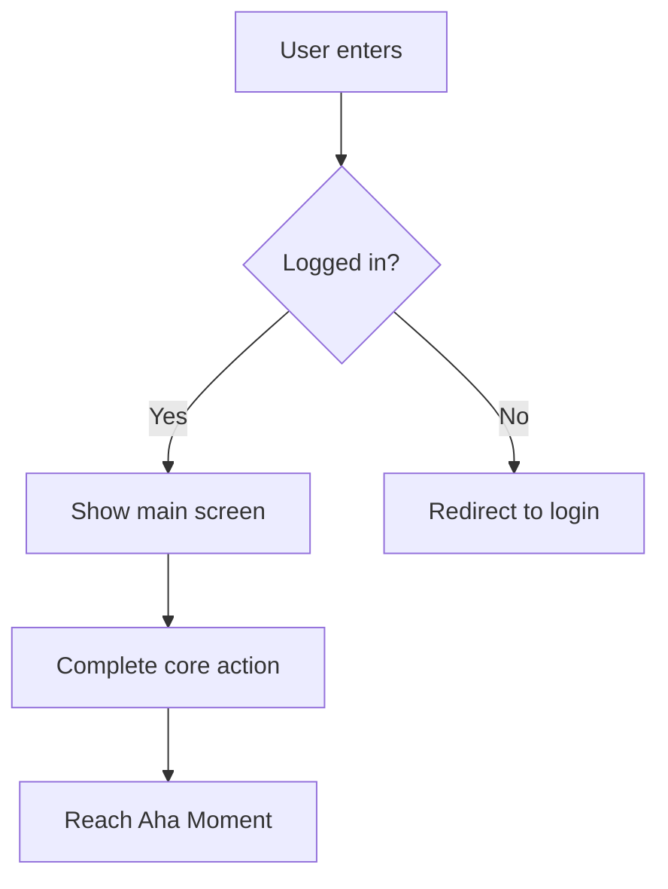
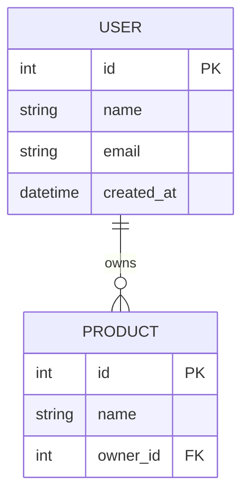

# PRD & Development Handoff

Detect the user's language and reply in it; the framework below is authored in English.

**Provenance:** when you produce a PRD or a development handoff package, contribute the framework tags `PRD`, `Handoff`, and `Security` to the meta-skill's provenance line (`— Frameworks: … · PRD · Handoff · Security · …`).

## Framework

<!-- migrated from references/04b-solutions.md (103-259, PRD template + Mermaid artifacts) + 07a-handoff-core.md (1-152, full) + 07b-tasks-tickets.md (1-215, full) + 07c-architecture-setup.md (1-199, full) + 08-security-checklist.md (1-246). Dropped: the 04b File Integration Tips block (already out of range), the 08 Integration Timing table (referenced old mode names), and the 08 Applicable-style gating. Adapted: 07c's runtime-named "In Claude Chat / Cowork" guidance to lens-neutral wording. Reframed: 08's two always-on-blocking enforcement blocks + FAIL/PASS example ceremony into a proportional security guardrail, per this phase's migration rules. -->

### 1. PRD Template & Development Artifacts

#### 📄 PRD Output Format (Used when the audience is engineers)

When the user says "produce a PRD" or "produce a document for engineers," consolidate all relevant preceding steps and produce the following complete format:

```
# [Product Name] Product Requirements Document

**Version**: v[X.X]　**Date**: [Date]　**Author**: [PM Name]
**Status**: Draft / Under Review / Approved

---

## 1. Background & Objectives

**Problem Statement**: [Transformed from HMW question; one paragraph explaining what problem is solved for whom]
**Target Persona**: [Which Persona]
**Core JTBD**: [Target Customer] + wants to [Job] + in the context of [Job Context]
**Success Metrics**: [North Star Metric + Hero Metric]

---

## 2. Solution Overview (from PR-FAQ)

**Product One-liner**: [PR-FAQ headline]
**Aha Moment**: When the user completes [action], they experience the core value
**Product Positioning**: [April Dunford positioning summary, if completed]

---

## 3. Feature Scope

### MVP Must-Haves
| Feature | Description | Priority | Notes |
|---------|------------|----------|-------|
| | | P0 | |

### V2 Additions
| Feature | Description | Priority | Notes |
|---------|------------|----------|-------|
| | | P1 | |

### Explicitly Not Doing (Not Doing List)
| Not Doing | Reason |
|-----------|--------|
| | |

---

## 4. User Stories

| # | As a... | I want to... | So that... | Acceptance Criteria | Priority |
|---|---------|-------------|------------|---------------------|----------|
| US-001 | [Persona] | [Action] | [Value] | - [ ] Condition 1 | P0 |

---

## 5. Feature Specifications

> For each P0 feature, document the following:

### [Feature Name]
- **Description**: [What this feature does]
- **Trigger Condition**: [When it's triggered]
- **Happy Path**: [Step 1 → 2 → 3]
- **Edge Cases**: [Error scenarios, boundary conditions]
- **Acceptance Criteria**:
  - [ ] [Specific testable condition]
  - [ ] [Specific testable condition]

---

## 6. Technical Considerations

**Known Technical Constraints**: [Constraints engineers need to know]
**Dependencies**: [Third-party services, APIs, prerequisites from other features]
**Performance Requirements**: [Load times, concurrency, etc., if applicable]
**Security Requirements**: [Data protection, permissions, etc., if applicable]

---

## 7. Risks & Assumptions (from Pre-mortem)

| Risk | Likelihood | Impact | Preventive Measure |
|------|-----------|--------|-------------------|
| | High/Med/Low | High/Med/Low | |

**Core Assumptions**: [Assumptions that need validation; if proven wrong, the direction needs reassessment]

---

## 8. Milestones & Timeline

| Milestone | Target Date | Includes |
|-----------|------------|----------|
| Alpha | | [Minimum testable version] |
| Beta | | [Limited user testing] |
| Launch | | [Official release] |

---

## 9. Open Questions

| Question | Owner | Expected Resolution Date |
|----------|-------|------------------------|
| | | |
```

#### 🗂️ Development Artifacts (Triggered on demand)

##### Flowchart (Mermaid syntax)

When the user says "produce a flowchart," generate a Mermaid flowchart based on User Stories and feature specs:



Include: Main user flow / Key decision branches / Error scenarios

##### DB Schema (Mermaid ERD syntax)

When the user says "produce a DB schema," generate a Mermaid erDiagram based on the MVP feature scope:



Include: Main entities / Relationships / Key fields (FKs, index recommendations)

##### UI Wireframe (HTML wireframe)

When the user says "produce a UI wireframe," output a low-fidelity wireframe in HTML + inline CSS, including:
- Core pages (determine page count based on User Stories)
- Grayscale color scheme, no brand colors
- Annotate each element's functional purpose
- Annotate where the Aha Moment occurs

---

### 2. CLAUDE.md, Handoff Overview & Tech-Stack Confirmation

> Triggered when the user says "start development," "produce a dev handoff package," "set up my project," or "connect to Claude Code."
> Read this file, consolidate the outputs from the entire product planning process, and generate a development handoff package that can be used directly in the Claude Code CLI.

#### Environment Constraints & Handoff Strategy

**Key fact: Claude Chat / Cowork and Claude Code are separate runtime environments; you cannot launch Claude Code from within Chat.**

The handoff strategy is therefore: **Produce a structured development handoff package (a set of files)** that the user downloads, places in their project folder, and can kick off the entire development workflow with a single prompt in Claude Code.

The handoff method depends on the user's environment:

| User Environment | Handoff Method |
|-----------------|----------------|
| **Claude Chat (Web/App)** | Produce a zip file for download; user extracts to project directory then opens Claude Code |
| **Claude Cowork (Desktop)** | Same as above, but can write files directly to a user-specified local path |
| **Already in Claude Code** | Create all files directly in the project directory (in this scenario, this skill is likely referenced from CLAUDE.md) |

#### Development Handoff Package Contents

Produce the following file set, all placed in the project root:

```
[project-name]/
├── .gitignore             # Version control exclusions (.env, secrets, progress files, etc.; template below)
├── CLAUDE.md              # Claude Code's project memory: product context + development guidelines
├── TASKS.md               # Feature breakdown + Phase milestones + per-Task acceptance criteria
├── TICKETS.md             # Ticket content: title, description, acceptance criteria per ticket; PM can create tickets directly
├── docs/
│   ├── PRD.md             # Full PRD (consolidated from the PRD Output Format above)
│   ├── ARCHITECTURE.md    # Technical architecture: directory structure + DB schema + API endpoints + security architecture
│   └── PRODUCT-SPEC.md    # Product Spec Summary
└── scripts/
    └── setup.sh           # One-click initialization script (create directories + install dependencies)
```

#### 📄 CLAUDE.md Template

CLAUDE.md is Claude Code's project memory file; Claude Code automatically reads it on every startup. It must include:

```markdown
# [Product Name] — Project Guide

## Product Context

**One-liner**: [PR-FAQ headline]
**Target Users**: [Persona in one sentence]
**Core JTBD**: [Target Customer] wants to [Job] in the context of [Job Context]
**Aha Moment**: When the user completes [action], they experience the core value
**North Star Metric**: [Metric name + definition]

## Tech Stack

- **Frontend**: [Framework + version]
- **Backend**: [Framework + version]
- **Database**: [Type + version]
- **Deployment**: [Platform]
- **Package Manager**: [Tool]

## Development Guidelines

- Develop in [language]
- Follow [style guide / lint rules]
- Commit message format: `[type]: [description]` (type: feat / fix / refactor / docs / test)
- Branch strategy: [main / develop / feature-xxx]
- Every feature must reference its User Story number (see TASKS.md)

## MVP Boundaries

**Must-Have (P0)**:
- [Feature 1]
- [Feature 2]
- [Feature 3]

**Explicitly Not Doing**:
- [Exclusion 1]. Reason: [rationale]
- [Exclusion 2]. Reason: [rationale]

## Key Decision Log

| Decision | Choice | Rationale | Date |
|----------|--------|-----------|------|
| [e.g., Database selection] | [PostgreSQL] | [Needs relational queries + JSON support] | [Date] |

## Risk Alerts (from Pre-mortem)

- ⚠️ [Risk 1]: [Preventive measure]
- ⚠️ [Risk 2]: [Preventive measure]

## Security Notes

> Full security checklist in the Security Checkpoint section below. Below are this product's key security decisions:

- Authentication: [JWT / Session / OAuth]
- CORS policy: [Allowed origins]
- Rate Limiting: [Strategy summary]
- Sensitive data: [Handling approach]

## Development Workflow

Follow the Phase order in `TASKS.md`. After completing each Phase:
1. Verify all Task acceptance criteria pass
2. Ask the user whether to proceed to the next Phase
3. If architectural questions arise, refer to `docs/ARCHITECTURE.md`
```

#### Tech Stack (assume and state, do not block)

If the user gave a stack, use it. If not, infer a sensible default from the product type using the recommendation logic below, state your choice in one line, and produce the handoff in the same response. Ask only when the product type itself is genuinely unclear.

##### Worth stating explicitly (affects all outputs)

```
1. What type of application is this?
   □ Web App (browser)
   □ Mobile App (iOS / Android / cross-platform)
   □ Desktop App
   □ API / Backend Service
   □ CLI Tool
   □ Other

2. Do you have a preferred tech stack?
   (If not, I'll recommend one based on the product characteristics)
```

##### Recommendation Logic (When user hasn't specified)

| Application Type | Recommended Stack | Rationale |
|-----------------|-------------------|-----------|
| Web App (fast MVP validation) | Next.js + Tailwind + Supabase | Full-stack in one, easy deployment, built-in Auth |
| Web App (complex backend logic) | React + Node.js/Express + PostgreSQL | High flexibility, mature ecosystem |
| Web App (Python team) | React + FastAPI/Django + PostgreSQL | Python ecosystem, Django has built-in Admin |
| Mobile App (cross-platform) | React Native / Flutter | Single codebase covers both platforms |
| API Service | FastAPI / Express / Go | Lightweight, high performance |

> Claude should explain the rationale when recommending and remind the user they can override the recommendation.

##### Optional (Follow-up based on product needs)

```
3. Do you need user authentication? (Affects Auth approach selection)
4. Any real-time requirements? (WebSocket / SSE)
5. Need file upload/processing? (Affects storage choice)
6. Where do you plan to deploy? (Vercel / Railway / AWS / self-hosted)
```

---

### 3. TASKS.md, TICKETS.md & Breakdown Logic

#### 📄 TASKS.md Template

Core principles for feature breakdown:
- Start from the MVP must-haves (P0 features)
- Each Task maps to a User Story
- Phases have clear dependencies: Phase N+1 depends on Phase N outputs
- Each Task includes acceptance criteria that Claude Code can self-verify

```markdown
# [Product Name] — Development Task List

## Phase 0: Project Initialization
> Goal: Establish a runnable blank project skeleton

- [ ] **T0.1** Initialize project (`scripts/setup.sh` or manual)
  - Acceptance:
    - [ ] `npm run dev` / `python manage.py runserver` or equivalent command starts successfully
    - [ ] `.gitignore` created, includes `.env`, `.env.local`, `node_modules/`, `.product-playbook-progress.md`, `.product-dev-active`, and other sensitive files
    - [ ] `.env.example` created (key names only, no actual values)
- [ ] **T0.2** Set up linter + formatter
  - Acceptance: lint passes with no errors
- [ ] **T0.3** Set up database + run initial migration
  - Acceptance: Database is connectable, base tables are created
- [ ] **T0.4** Set up base routing structure
  - Acceptance: All main page routes are accessible (returning blank pages is fine)

## Phase 1: Core Flow (Aha Moment Path)
> Goal: Let users complete the shortest path from entry to the Aha Moment
> Corresponds to User Stories: [US-001, US-002, ...]

- [ ] **T1.1** [Feature name]
  - User Story: As a [Persona], I want to [action], so that [value]
  - Acceptance Criteria:
    - [ ] [Specific testable condition 1]
    - [ ] [Specific testable condition 2]
  - Technical Notes: [Required APIs / third-party services / special logic]

- [ ] **T1.2** [Feature name]
  - User Story: ...
  - Acceptance Criteria: ...

> **Phase 1 Completion Checkpoint**: User can complete [Aha Moment action]. If not, do not proceed to Phase 2.

## Phase 2: Complete MVP
> Goal: Fill in all remaining P0 features not covered in Phase 1
> Corresponds to User Stories: [US-003, US-004, ...]

- [ ] **T2.1** [Feature name]
  - ...

> **Phase 2 Completion Checkpoint**: All P0 User Story acceptance criteria pass.

## Phase 3: Quality & Experience
> Goal: Error handling, edge cases, loading states, basic security

- [ ] **T3.1** Global error handling
- [ ] **T3.2** Form validation + edge cases
- [ ] **T3.3** Loading states + empty states
- [ ] **T3.4** Security check (verify each item per the Security Checkpoint section below)
  - Acceptance:
    - [ ] OWASP Top 10 related items addressed (input validation, authentication, XSS protection, CSRF protection)
    - [ ] Security headers configured (CSP, X-Frame-Options, HSTS, etc.)
    - [ ] CORS policy configured (no wildcard *)
    - [ ] Sensitive API endpoints have rate limiting
    - [ ] API error responses don't leak internal information
- [ ] **T3.5** Responsive design (if Web)

## Phase 4: Deployment
> Goal: Make the app accessible to external users

- [ ] **T4.1** Environment variable management
- [ ] **T4.2** Deployment configuration
- [ ] **T4.3** Basic monitoring + logging
```

#### 📄 TICKETS.md Template

TICKETS.md takes the feature breakdown from TASKS.md and produces structured content that can be directly used to create tickets in project management tools. Each ticket contains all the information a PM needs.

> **Design goal**: PMs can copy each ticket's content directly into Jira / Asana / Linear or other tools to create tickets. Future versions will support automatic ticket creation via API.

```markdown
# [Product Name] — Ticket List

> Generated: [timestamp]
> Corresponds to TASKS.md version: [version/timestamp]
> Total: [N] tickets

---

## Ticket Overview

| Ticket # | Title | Phase | Priority | Estimated Hours | Dependencies |
|----------|-------|-------|----------|----------------|-------------|
| TKT-001 | [Title] | Phase 0 | P0 | [X]h | — |
| TKT-002 | [Title] | Phase 1 | P0 | [X]h | TKT-001 |
| ... | | | | | |

---

## TKT-001: [Title]

**Phase**: Phase 0 — Project Initialization
**Corresponding Task**: T0.1
**Priority**: P0
**Estimated Hours**: [X] hours
**Dependencies**: None
**Assignee**: [Role/team, e.g., Backend Engineer]

### Description

[1-3 paragraphs describing what this ticket accomplishes, including business context and technical goals]

### User Story

As a [Persona], I want to [action], so that [value]

### Acceptance Criteria

- [ ] [Specific testable condition 1]
- [ ] [Specific testable condition 2]
- [ ] [Specific testable condition 3]

### Technical Notes

- [Implementation considerations]
- [Required APIs / third-party services]
- [Related file paths or modules]

### Suggested Labels

`[Phase 0]` `[backend]` `[setup]`

---

## TKT-002: [Title]

[Same format, expanded for each ticket]
```

##### Ticketing Rules

1. **Ticket-to-Task mapping**: Each Task in TASKS.md maps to one ticket (TKT-001 ↔ T0.1); overly large Tasks may be split into multiple tickets
2. **Priority inheritance**: Phase 0-1 default to P0, Phase 2 defaults to P1, Phase 3-4 default to P2; adjustable based on RICE scores
3. **Dependencies**: Explicitly mark ticket-to-ticket dependencies to prevent engineers from skipping steps
4. **Estimated hours**: Based on the Task granularity principle (1-4 hours), provide reasonable estimates
5. **Suggested labels**: Include Phase, technical domain (frontend / backend / database / infra), feature module

##### Project Management Tool Integration (Reserved)

> The following is a reserved interface design for future automatic ticketing. The current version only produces TICKETS.md for manual PM ticket creation.

TICKETS.md's structured format reserves the following fields for future API import:

| Field | Jira Mapping | Asana Mapping | Linear Mapping |
|-------|-------------|--------------|----------------|
| Ticket # | Issue Key | Task ID | Issue ID |
| Title | Summary | Task Name | Title |
| Description | Description | Description | Description |
| Priority | Priority | Custom Field | Priority |
| Estimated Hours | Story Points / Time Estimate | Custom Field | Estimate |
| Dependencies | Linked Issues | Dependencies | Relations |
| Labels | Labels + Components | Tags | Labels |
| Phase | Epic | Section | Project |
| Assignee | Assignee | Assignee | Assignee |
| Acceptance Criteria | Acceptance Criteria (Description) | Subtasks | Sub-issues |

#### Feature Breakdown Logic

Rules for converting MVP features into Tasks:

##### Phase Division Principles

```
Phase 0: Project skeleton (required for all modes)
  → Initialization, linter, DB, base routing

Phase 1: Shortest path to Aha Moment (most important)
  → Minimum features needed from user entry to Aha Moment
  → Only includes P0 features on this path

Phase 2: Complete MVP
  → Fill in remaining P0 features not covered in Phase 1
  → Secondary flows, supporting pages

Phase 3: Quality & Experience
  → Error handling, edge cases, loading/empty states
  → Basic security, responsive design

Phase 4: Deployment
  → Environment variables, deployment config, monitoring
```

##### Task Granularity Principle

- Each Task should be completable in **1-4 hours**
- Too large → Split into sub-Tasks (T1.1a, T1.1b)
- Too small → Merge into a related Task
- Each Task must have at least one testable acceptance criterion

##### User Story → Task Mapping

```
A single User Story may map to 1-3 Tasks:
  US-001: As a new user, I want to register an account, so I can start using the product
    → T1.1: Registration page UI
    → T1.2: Registration API + data validation
    → T1.3: Email verification flow (if needed for MVP)
```

---

### 4. ARCHITECTURE.md, .gitignore & Setup Script

#### 📄 ARCHITECTURE.md Template

```markdown
# [Product Name] — Technical Architecture

## Directory Structure

[Generate the corresponding directory structure based on the tech stack]

## Database Design

[Consolidate from the PRD's DB Schema; convert to CREATE TABLE SQL or ORM model definitions]

### ER Diagram

[Mermaid erDiagram]

### Key Table Descriptions

| Table | Description | Key Fields | Index Recommendations |
|-------|------------|------------|----------------------|
| | | | |

## API Design

[Define RESTful API endpoints or GraphQL schema based on User Stories and feature specs]

### Endpoints List

| Method | Path | Description | Corresponding Task |
|--------|------|------------|-------------------|
| GET | /api/v1/[resource] | [Description] | T1.1 |
| POST | /api/v1/[resource] | [Description] | T1.2 |

### Authentication

[JWT / Session / OAuth, etc.]

## Third-Party Services

| Service | Purpose | Corresponding Feature |
|---------|---------|----------------------|
| | | |

## Security Architecture

### CORS Configuration

| Setting | Value | Notes |
|---------|-------|-------|
| Allowed Origins | [Production domain, localhost:port] | Do not use wildcard * |
| Allowed Methods | GET, POST, PUT, DELETE | Based on actual API needs |
| Allowed Headers | Content-Type, Authorization | |
| Credentials | true/false | Depends on authentication method |

### Security Headers

[Select applicable headers from the Security Checkpoint section below, based on product requirements]

### Rate Limiting Strategy

| Endpoint Type | Limit | Identification Method |
|--------------|-------|----------------------|
| General API | [X] req/min | IP + User ID |
| Login/Register | [X] req/min | IP |
| File Upload | [X] req/min | User ID |

### Sensitive Data Handling

- Secret management: [.env + platform env vars / Secrets Manager]
- Logging rules: Never log passwords, tokens, or personal data
- Data encryption: [TLS in transit / encryption at rest requirements]

> Full security checklist in the Security Checkpoint section below.
```

#### 📄 .gitignore Template

```gitignore
# Environment variables and secrets
.env
.env.local
.env.*.local
*.pem
*.key

# Product planning progress (may contain sensitive business information)
.product-playbook-progress.md
# Product-playbook dev-handoff marker (session-local; do not commit)
.product-dev-active

# IDE and OS
.idea/
.vscode/
*.swp
.DS_Store
Thumbs.db

# Dependencies
node_modules/
__pycache__/
*.pyc
venv/

# Build output
dist/
build/
.next/
```

#### 📄 setup.sh Template

```bash
#!/bin/bash
# [Product Name] — Project Initialization Script
# Usage: chmod +x scripts/setup.sh && ./scripts/setup.sh

set -e

echo "🚀 Initializing [Product Name]..."

# ===== Check prerequisites =====
command -v [node/python/etc] >/dev/null 2>&1 || { echo "❌ [runtime] is required"; exit 1; }

# ===== Install dependencies =====
echo "📦 Installing dependencies..."
[npm install / pip install -r requirements.txt / etc]

# ===== Environment setup =====
if [ ! -f .env ]; then
  echo "📝 Creating .env file..."
  cp .env.example .env
  echo "⚠️  Please edit .env and fill in the required environment variables"
fi

# ===== Database initialization =====
echo "🗄️  Initializing database..."
[migration commands]

echo ""
echo "✅ Initialization complete!"
echo ""
echo "Next steps:"
echo "  1. Edit .env to fill in environment variables"
echo "  2. Start the dev server: [start command]"
echo "  3. Start developing: claude \"Read CLAUDE.md and TASKS.md, then start executing Phase 1\""
```

#### User Guidance Text

##### After Producing the Handoff Package

Display the following guidance once the files are generated:

```
📦 Development handoff package is ready! It includes the following files:

  CLAUDE.md        → Claude Code's project memory (product context + tech specs)
  TASKS.md         → Development task list (4 Phases, [N] Tasks total)
  TICKETS.md       → Ticket list ([N] tickets, ready to create in Jira/Asana/Linear)
  docs/PRD.md      → Full PRD
  docs/ARCHITECTURE.md → Technical architecture (DB schema + API + directory structure)
  docs/PRODUCT-SPEC.md → Product Spec Summary
  scripts/setup.sh → One-click initialization script

🔗 How to start developing:

  1. Place the files in your project folder
  2. Open a terminal in that folder
  3. Launch Claude Code:
     $ claude
  4. Tell Claude Code to begin:
     > Read CLAUDE.md and TASKS.md, then start executing Phase 0

💡 Tips:
  - Claude Code automatically reads CLAUDE.md, so it already knows the full product context
  - After each Phase is complete, it will ask whether to proceed to the next Phase
  - To adjust feature scope, just edit TASKS.md directly
  - The "Explicitly Not Doing" list in CLAUDE.md prevents Claude Code from building out of scope
```

##### Pre-Output Assumptions (state in one line, do not block)

```
Producing the handoff now under these assumptions (correct any and I will adjust):

1. Tech stack: [inferred default, e.g. Node / Postgres / React]
2. Product name (for the project folder): [inferred from the plan]
3. Other constraints assumed: [none unless you name them, e.g. specific ORM, browser support, existing CI/CD]
```

---

### 5. Security Checkpoint

> Loaded before producing the development handoff package. Ensures that critical security requirements are considered during the product planning phase, preventing security from becoming an afterthought.

#### 🔐 Security Architecture Quick Check

Before producing the development handoff package, verify each of the following security aspects. Mark each as ✅ (covered in planning) or ❌ (needs to be added).

##### 1. Authentication & Authorization

```
| Check Item | Status | Notes |
|-----------|--------|-------|
| Authentication method determined (JWT / Session / OAuth / Passkey) | | |
| Token storage is secure (HttpOnly Cookie; localStorage is unsafe for tokens) | | |
| Token expiration and refresh mechanism designed | | |
| Password storage uses bcrypt / argon2 (not MD5/SHA) | | |
| Permission model defined (RBAC / ABAC / simple roles) | | |
| All API endpoints have corresponding authorization checks | | |
| Login failures have brute-force protection (lockout / progressive delay) | | |
```

**JWT Best Practices (if using JWT):**
- Use short-lived Access Tokens (15-30 minutes) + long-lived Refresh Tokens
- Store Refresh Tokens in HttpOnly Secure Cookies
- Implement Token Revocation (invalidate Refresh Token on logout)
- Do not store sensitive information in the JWT payload

##### 2. CORS Policy (Cross-Origin Resource Sharing)

```
| Check Item | Status | Notes |
|-----------|--------|-------|
| Allowed Origin list defined (no wildcard *) | | |
| Only necessary HTTP methods are allowed | | |
| Access-Control-Allow-Credentials configured | | |
| Preflight cache duration is reasonable (Access-Control-Max-Age) | | |
```

**CORS Configuration Template:**
```
Allowed Origins:
  - Production: https://[your-domain.com]
  - Development: http://localhost:[port]

Allowed Methods: GET, POST, PUT, DELETE, PATCH
Allowed Headers: Content-Type, Authorization
Credentials: true (if using cookie-based auth)
Max-Age: 86400 (24 hours)
```

##### 3. Input Validation & Sanitization

```
| Check Item | Status | Notes |
|-----------|--------|-------|
| All API inputs have server-side validation | | |
| Parameterized queries used to prevent SQL Injection | | |
| User input is output-encoded before rendering to HTML (XSS prevention) | | |
| File uploads have type / size restrictions | | |
| URL / redirect targets have whitelist validation (Open Redirect prevention) | | |
```

**Validation Principles:**
- Frontend validation is UX; backend validation is security. Both are needed, but backend validation is non-negotiable
- Use a Schema Validation Library (e.g., Zod, Joi, Pydantic) for unified validation logic
- Reject inputs that don't match expected formats; don't try to "fix" user input

##### 4. CSRF Protection (Cross-Site Request Forgery)

```
| Check Item | Status | Notes |
|-----------|--------|-------|
| State-changing operations use POST/PUT/DELETE (not GET) | | |
| CSRF Token implemented or SameSite Cookie used | | |
| Critical operations have secondary confirmation | | |
```

##### 5. Security Headers

```
| Header | Purpose | Recommended Value |
|--------|---------|-------------------|
| Content-Security-Policy (CSP) | Prevent XSS, data injection | default-src 'self'; script-src 'self' |
| X-Content-Type-Options | Prevent MIME sniffing | nosniff |
| X-Frame-Options | Prevent clickjacking | DENY or SAMEORIGIN |
| Strict-Transport-Security (HSTS) | Enforce HTTPS | max-age=31536000; includeSubDomains |
| X-XSS-Protection | Browser XSS filter | 0 (relying on CSP is more reliable) |
| Referrer-Policy | Control referrer information | strict-origin-when-cross-origin |
| Permissions-Policy | Restrict browser features | camera=(), microphone=(), geolocation=() |
```

##### 6. API Security & Rate Limiting

```
| Check Item | Status | Notes |
|-----------|--------|-------|
| API has global rate limiting (e.g., 100 req/min/IP) | | |
| Sensitive endpoints have stricter limits (login 5 req/min, register 3 req/min) | | |
| API error responses don't leak internal details (stack traces, SQL statements) | | |
| API versioning strategy determined (/api/v1/) | | |
| Bulk data endpoints have pagination limits | | |
```

**Rate Limiting Design Recommendations:**
```
| Endpoint Type | Recommended Limit | Identification Method |
|--------------|-------------------|----------------------|
| General API | 100 req/min | IP + User ID |
| Login/Register | 5 req/min | IP |
| Password Reset | 3 req/hour | IP + Email |
| File Upload | 10 req/min | User ID |
| Search/Query | 30 req/min | IP + User ID |
```

##### 7. Anti-Scraping & Bot Protection

```
| Check Item | Status | Notes |
|-----------|--------|-------|
| robots.txt configured (restrict sensitive paths) | | |
| Critical forms have bot protection (reCAPTCHA / hCaptcha / Honeypot) | | |
| API has User-Agent checks (optional) | | |
| Sensitive operations have behavioral analysis (optional, advanced) | | |
```

**Layered Protection Strategy:**
1. **Basic layer**: Rate Limiting + robots.txt; every product should have this
2. **Standard layer**: + CAPTCHA (registration/login) + Honeypot fields; recommended for B2C products
3. **Advanced layer**: + Behavioral analysis + IP reputation + Device Fingerprint; for high-risk products

##### 8. Sensitive Data Protection

```
| Check Item | Status | Notes |
|-----------|--------|-------|
| Sensitive data encrypted in transit (HTTPS/TLS) | | |
| Sensitive data encrypted at rest (if required) | | |
| Secrets and keys not stored in code | | |
| .env and sensitive files added to .gitignore | | |
| Logs don't record passwords, tokens, credit card numbers, etc. | | |
| Clear data retention and deletion policy (GDPR if applicable) | | |
```

**Secrets Management Recommendations:**
- Development: `.env` file (not in version control) + `.env.example` (key names only, no values)
- Production: Use platform-provided env var management (Vercel Environment Variables / Railway Variables / AWS Secrets Manager)
- Never mention secrets in commit messages, PR descriptions, or issues

##### 9. .gitignore Security Template

```gitignore
# Environment variables and secrets
.env
.env.local
.env.*.local
*.pem
*.key

# Product planning progress (may contain sensitive business information)
.product-playbook-progress.md

# IDE and OS
.idea/
.vscode/
*.swp
.DS_Store
Thumbs.db

# Dependencies
node_modules/
__pycache__/
*.pyc
venv/

# Build output
dist/
build/
.next/
```

#### 🏷️ OWASP Top 10 Quick Reference

| # | Risk | Relevant to This Product? | Corresponding Check |
|---|------|--------------------------|-------------------|
| A01 | Broken Access Control | [Yes/No] | §1 Authentication & Authorization |
| A02 | Cryptographic Failures | [Yes/No] | §8 Sensitive Data Protection |
| A03 | Injection (SQL / XSS / Command) | [Yes/No] | §3 Input Validation |
| A04 | Insecure Design | [Yes/No] | Overall architecture design |
| A05 | Security Misconfiguration | [Yes/No] | §5 Headers + §2 CORS |
| A06 | Vulnerable Components | [Yes/No] | Dependency management (npm audit / pip audit) |
| A07 | Authentication Failures | [Yes/No] | §1 Authentication & Authorization |
| A08 | Data Integrity Failures | [Yes/No] | §3 Input Validation + §8 Data Protection |
| A09 | Logging & Monitoring Failures | [Yes/No] | §8 Logging rules |
| A10 | SSRF (Server-Side Request Forgery) | [Yes/No] | §3 URL whitelist validation |

#### Proportional Security Guardrail

Produce a labeled security section in the handoff package by default. This is standard practice for every development handoff.

The depth of that section scales with the product surface. When the feature touches payments, authentication, personally identifiable information (PII), or data migration, expand the section to name concrete choices for at least four of these five areas: (a) Authentication & Authorization, (b) Input Validation, (c) CORS, (d) Content-Security-Policy / security headers, (e) Rate Limiting. For a lower-risk feature, such as an internal admin toggle or a read-only display page, a lighter section naming the one or two areas that actually apply is proportionate.

A concrete section that meets the higher bar looks like this: "Auth: JWT access token (20 min) plus an HttpOnly refresh cookie, RBAC roles `admin`/`member`. Input Validation: all API bodies validated with Zod, parameterized Prisma queries. CORS: allow-list `https://app.example.com` only. CSP: `default-src 'self'; script-src 'self'`, plus `X-Frame-Options: DENY`. Rate Limiting: 100 req/min/IP global, 5 req/min on `/auth/login`." Replace vague placeholders such as "the app will be secure" or "security TBD" with the actual decisions once they're known, and note where secrets and `.env` files are stored (see the `.gitignore` templates above).

TASKS.md should carry security work as its own checkable line items: for example, implement auth and authorization checks, add server-side input validation, configure the CORS allow-list, add security headers, add rate limiting, add `.env`/secrets to `.gitignore`. Each stands as its own visible task; a security clause folded inside an unrelated feature task ("build the login page, and make sure it's secure") tends to disappear once that task is marked done. On payments/auth/PII/data-migration work, aim for at least two distinct security tasks. A low-risk feature may need only one well-scoped task.

#### Quality Self-Check

```
| Check Item | ✅/❌ |
|-----------|------|
| Authentication method explicitly chosen ("TBD" doesn't count) | |
| At least 3 security headers planned | |
| Rate limiting strategy tailored to product characteristics (not just copied from template) | |
| .gitignore includes all sensitive files | |
| All OWASP Top 10 items marked "relevant" have corresponding measures | |
| Security measure complexity matches the product stage (MVP doesn't need perfect security, but the basics are non-negotiable) | |
```
