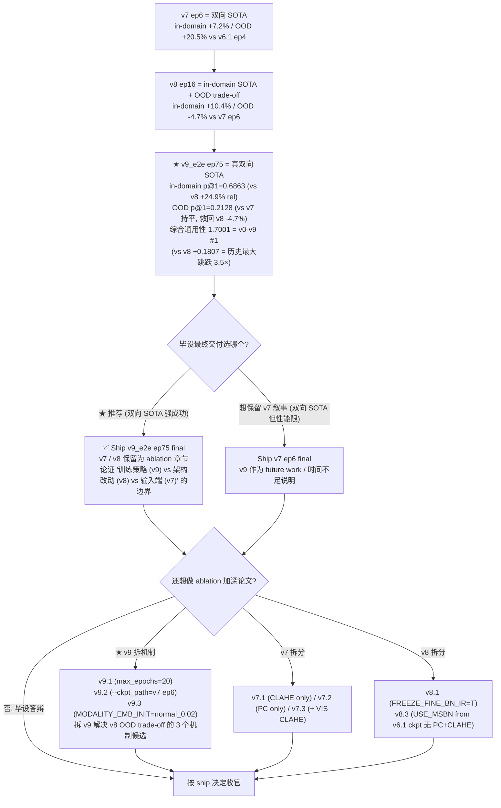

# Cross-Modal 实验链总览（v0..v10）

> 这是 10 个跨模态实验的 **index / overview**。每个版本的实现细节、配置、实测、Bat 入口都在独立 skill：
> - [eloftr-v1-contrast](../eloftr-v1-contrast/SKILL.md)：Symmetric InfoNCE
> - [eloftr-v2-modemb](../eloftr-v2-modemb/SKILL.md)：Modality embedding（含 fine 模态盲分析）
> - [eloftr-v3-v4-freeze](../eloftr-v3-v4-freeze/SKILL.md)：Freeze stack 与 REVISION 2
> - [eloftr-v5-m3fd](../eloftr-v5-m3fd/SKILL.md)：M3FD 数据扩展（路径 B）
> - [eloftr-v6-finetune](../eloftr-v6-finetune/SKILL.md)：v6 / v6.1 慢 LR resume + spillover 修复（路径 D）
> - [eloftr-v7-pcclahe](../eloftr-v7-pcclahe/SKILL.md)：PC 边缘 + CLAHE 输入端优化（路径 F, 双向 SOTA, 原毕设最终交付候选）
> - [eloftr-v8-msbn](../eloftr-v8-msbn/SKILL.md)：Modality-Specific BatchNorm fine 架构（路径 E1, in-domain SOTA 但 OOD 略退）
> - [eloftr-v9-e2e](../eloftr-v9-e2e/SKILL.md)：**e2e cold start 训练策略（路径 G, 真双向 SOTA 强成功, M3FD 上毕设最终交付推荐）**
> - [eloftr-v10-msyn](../eloftr-v10-msyn/SKILL.md)：**Megadepth_Syn 4 卡 DDP scale-up（路径 H, v9 stack + 31× 数据 + DDP 真修复 + PC L1+L2+L3 加速 + fix script，ship 完成 + 综合通用性 1.9020 SOTA）**
> - [eloftr-v11-dualh](../eloftr-v11-dualh/SKILL.md)：**双侧激进 Homography aug（路径 I, v10 stack + dual H_ir+H_vis + ~3× aug 强度 + prob=0.7 + WARMUP 加倍, ship 待）**
> - [eloftr-server-multigpu](../eloftr-server-multigpu/SKILL.md)：v9_server_repro = 4 卡 3090 服务器复现 v8（infra 层；v10 后该 skill §4.3 sampler 不分片地雷已通过 image-level pre-shard 真修复）
>
> 数据集 SOP（路径 / 软链 / 划分 / PC 缓存）：
> - [eloftr-roadscene-data](../eloftr-roadscene-data/SKILL.md)：第 1 个 aligned IR-VIS 数据集（220 对）
> - [eloftr-m3fd-data](../eloftr-m3fd-data/SKILL.md)：第 2 个（4200 对，街景真红外）
> - [eloftr-megadepth-syn-data](../eloftr-megadepth-syn-data/SKILL.md)：第 3 个（v10 用，~129K 对，风格迁移合成 IR）
>
> 前置：[eloftr-windows-setup](../eloftr-windows-setup/SKILL.md)；评估侧 [eloftr-eval-pipeline](../eloftr-eval-pipeline/SKILL.md)；服务器侧 [eloftr-server-multigpu](../eloftr-server-multigpu/SKILL.md) + [eloftr-yurupeng-workspace](../eloftr-yurupeng-workspace/SKILL.md)；训练日志读取 [eloftr-tb-analysis](../eloftr-tb-analysis/SKILL.md)。
>
> **跨版本数字总表**（M3FD in-domain + RoadScene OOD + 综合通用性排名）见 [eloftr-results](../eloftr-results/SKILL.md) → [`results/eval_summary.md`](../../../results/eval_summary.md)。本 skill 只画继承图、讲叙事；具体"v_X 实测 P@1 是多少 / 当前 SOTA 是谁 / Δ vs prev"全部以 results 表为准，避免本 skill 嵌入数字后版本漂移。
>
> **跨实验训练侧 KPI 总表**（wall-clock / total_steps / best val epoch / modemb-MSBN 诊断 / train val ↔ eval Δ）见 [eloftr-tb-summary](../eloftr-tb-summary/SKILL.md) → [`results/tb_summary.md`](../../../results/tb_summary.md)。两个表用途互补：eval_summary.md 是"ship 数字"（论文引用），tb_summary.md 是"训练动态"（解释为何这样 ship、找 v8 OOD trade-off 的训练侧机制证据）。

## 0. 继承链总览

```mermaid
flowchart LR
    base["configs/loftr/eloftr_full.py<br/>(MegaDepth baseline)"] --> v1["v1_contrast.py<br/>+ symmetric InfoNCE"]
    v1 --> v2["v2_modemb.py<br/>+ learnable modality emb"]
    v2 --> v3["v3_combined.py<br/>+ FREEZE_BACKBONE=True<br/>+ FREEZE_BN=True (all BN frozen)<br/>+ EarlyStopping<br/>+ aggressive LR schedule"]
    v3 --> v4["v4_combined.py (REVISION 2)<br/>- FREEZE_BACKBONE=False (restore 9.5M backbone)<br/>- FREEZE_BN=False (release fine BN)<br/>+ FREEZE_BACKBONE_BN=True (pin backbone BN only)<br/>- softer LR (TRUE_LR=1.25e-4) + WARMUP_STEP=2<br/>- MSLR=[10,15,20] + ES patience=8"]
    v4 --> v5["v5_m3fd.py<br/>+ M3FD 3780 训练对 (vs RoadScene 177)<br/>+ N_SAMPLES_PER_SUBSET=3780 + replacement=False (强制 opt-in)<br/>+ WARMUP_STEP=20 (320 abs step)<br/>+ MSLR=[3,5,7] + ES patience=3<br/>(--max_epochs=10 in .bat)"]
    v5 --> v6["v6_finetune.py<br/>从 v5 ep9 ckpt resume<br/>+ CANONICAL_LR 2e-3 → 4e-4 (TRUE_LR=2.5e-5)<br/>+ WARMUP_STEP 20 → 50<br/>+ MSLR=[15,25,35] + ES patience=12<br/>专攻 p@1px (--max_epochs=50 in .bat)<br/>实测 ep6 spillover 中断"]
    v6 --> v6_1["v6_1_finetune.py (zero override)<br/>从 v6 ep6 ckpt resume<br/>+ PYTORCH_CUDA_ALLOC_CONF=expandable_segments:True (in .bat)<br/>schedule 完全继承 v6"]
    v6_1 --> v7["v7_pcclahe.py (input-side optimization)<br/>从 v6.1 ep4 ckpt resume<br/>+ A1: PC edge map as 2nd input channel (BACKBONE_IN_CHANNELS=2)<br/>+ A2: CLAHE on raw IR (USE_CLAHE_IR=True)<br/>+ inflated init alpha=0 (zero-extend v6.1 stage0 conv)<br/>schedule 继承 v6.1, max_epochs=10<br/>实测 ep6 = v0-v7 全程双向 SOTA<br/>(in-domain +7.2% / OOD +20.5% vs v6.1 ep4)"]
    v7 --> v8["v8_msbn.py (fine-arch optimization, path E1)<br/>从 v7 ep6 ckpt resume<br/>+ USE_MSBN=True: fine_preprocess.layer{1,2}_outconv2.1 (BN)<br/>  替换为 nn.Identity, 新增 _bn_ir / _bn_vis 双分支<br/>+ Identity 占位法: state_dict key 字节级 = v7 (USE_MSBN=False)<br/>+ _maybe_inflate_msbn ckpt hook (zero-shift 复制 v7 BN -> 双分支)<br/>+ freeze 体系 OR 语义重构 (5 字段独立 if 平铺)<br/>+ schedule 修复 v7 死代码: WARMUP=30 / MSLR=[6,11,15] / ES=8<br/>+ max_epochs=20 (v7 是 10)<br/>实测 ep16 = in-domain SOTA (+10.4% p@1 vs v7)<br/>但 OOD p@1 -4.7% (4.34σ 显著退化), 不严格符合强成功"]
    v8 --> v9server["v9_server_repro (Linux + 4 卡 3090, infra layer)<br/>cfg / 代码继承 v8 完全不变<br/>+ 服务器 SSH 接入 + Cursor Remote-SSH<br/>+ .bat → .sh / Win 单卡补丁全部保留 (DDP 兼容)<br/>+ 模式 A 单卡复现 (★ 推荐) / B DDP 改 cfg / C 并行 ablation<br/>+ §4.1-4.5 五个 DDP 隐藏地雷<br/>详见 eloftr-server-multigpu"]
    base -.->|"绕过 v1-v8 finetune 链"| v9e2e["v9_e2e_outdoor (path G, training-strategy)<br/>★ M3FD 上实测毕设最终交付推荐<br/>cold start 直接从 outdoor.ckpt + 全 v1-v8 stack opt-in<br/>(USE_CONTRASTIVE / USE_MODALITY_EMB / FREEZE_BACKBONE_BN /<br/>  USE_EDGE_INPUT / USE_CLAHE_IR / USE_MSBN 全 True)<br/>+ schedule: TRUE_LR=1.25e-4 / WARMUP=960 / MSLR=[35,55,70] / 80 ep<br/>实测 ep75 ckpt:<br/>  in-domain p@1=0.6863 (vs v8 +24.9% rel)<br/>  OOD p@1=0.2128 (vs v7 +0.2% 持平, 救回 v8 -4.7% 退化)<br/>+ 综合通用性 1.7001 = v0-v9 全程 #1 (vs v8 +0.1807)<br/>详见 eloftr-v9-e2e"]
    v8 -.->|"v9_e2e 验证 v8 OOD trade-off<br/>不是架构问题, 是 schedule + ckpt bias 累积"| v9e2e
    v9e2e --> v10msyn["v10_msyn (path H, data scale-up + DDP infra)<br/>★ Megadepth_Syn ~115K train + 4 卡 DDP ship run<br/>Style A 继承 v9_e2e cfg byte-identical<br/>仅 schedule 重写 (max_ep=12 vs 80, MSLR=[3,5,7], ES=3)<br/>+ 数据 31× 大 → unfreeze backbone BN<br/>三项工程修复 (v10 production-grade):<br/>  1. DDP image-level pre-shard 修 §4.3 sampler 不分片地雷<br/>  2. PC cache L1+L2+L3 加速 (~14h → ~46 min)<br/>  3. fix_pc_cache_alignment 救场 df 截断 cache 形状 mismatch<br/>实测 mode A/B debug 全 sanity gate 通过<br/>ep0 train_loss 0.572 (vs v9 ~1.47, 3× 低)<br/>ep0 val p@3 0.607 (vs v9 ~0.35-0.40, 任务比真红外简单)<br/>wall-clock 实测 1.44 it/s, 12 ep ~12-15h (plan 估 3-4h 偏乐观 4×)<br/>实测综合通用性 1.9020 = v0..v10 SOTA<br/>详见 eloftr-v10-msyn"]
    v10msyn --> v11dualh["v11_dualh (path I, geometric aug scale-up)<br/>★ v10 stack + 双侧激进 Homography aug<br/>cold start 自 outdoor.ckpt (NOT v10 ep11 warm) → 与 v10 公平对照<br/>aug ×3 单轴 + 双侧 (几何多样性 ×4):<br/>  rot ±25 / scale (0.75,1.25) / trans 12% / persp 8% (vs v10 ±10/0.9-1.1/5%/3%)<br/>  prob=0.7 (30% pair 保 identity 兜底 → 平均共视率 ~37%)<br/>+ ROAD_HOMOGRAPHY_DUAL=True 新开关 (default False = v0-v10 byte-identical)<br/>+ H_0to1 = H_vis @ inv(H_ir) 数学复合<br/>+ mask0 &= ir_valid 平行 mask1 &= vis_valid<br/>+ WARMUP_STEP 450→900 (actual 1800→3600 step ~0.5 ep, cold start aug shock 缓冲)<br/>其余 LR/MSLR/patience/sync_bn/freeze 全沿用 v10 (公平对照)<br/>5 项 sanity check pre-flight (1-2 min, ship 前必跑)<br/>ship 待 (2026-05-11 实现完成, 17h 预估同 v10)<br/>详见 eloftr-v11-dualh"]
```



每个 v_x 配置只 `from <previous> import cfg` 然后修改若干字段，**强制累计**：v4 一定包含 v1+v2 的全部能力（loss_contrast / modemb），所以 ablation 时只需要改 main_cfg_path，不需要再编辑代码。

## 1. Bat 三联约定

每一组都配三个 .bat：
- `*_debug.bat`：`bs=2, max_epochs=1, --disable_ckpt`，10 个 batch 跑通 + 看启动日志。
- `*_small.bat`：`bs=2`，跑短的完整训练以确认 loss/metric 走向。
- `*_<feature>.bat` / `*_finetune.bat`：完整训练。

`--exp_name` 前缀按数据集变化：v1-v4 用 `roadscene_v*`；v5+ 用 `m3fd_v5_*` / `m3fd_v6_finetune` / `m3fd_v6_1_finetune` / `m3fd_v7_pcclahe`。

## 2. 必看坑：LR / WARMUP_STEP / MSLR_MILESTONES 自动缩放

`train.py` 在第 102-105 行做自动按 batch 缩放：

```python
_scaling = TRUE_BATCH_SIZE / CANONICAL_BS              # 例：4 / 64 = 0.0625
TRUE_LR  = CANONICAL_LR * _scaling                     # LR 按 BS 缩小
WARMUP_STEP = math.floor(WARMUP_STEP / _scaling)       # WARMUP 反向放大！
```

后果：
- `WARMUP_STEP=1875` 在 `bs=4` 时变成 30000 步；RoadScene 1 个 epoch ≈ 40-75 step，等于训练全程都在 warmup 线性上升 LR，永远到不了目标 LR → val 早期偶然好，后期一直在"低 LR + 长时间"里抖。这是 v1/v2 都出现"epoch 3-4 见顶后回落"的真凶。
- v3 把 `WARMUP_STEP=1`（基本关掉）+ `CANONICAL_LR=8e-3`（TRUE_LR≈5e-4）+ `MSLR_MILESTONES=[5,7]`（在 ES patience=4 之前先衰减一次）一起用，第 0 个 step 就直接到目标 LR。

经验法则：
- **小数据集（≤ 几百对）finetune**：把 `WARMUP_STEP` 写 1。pretrained init 不需要 warm。
- **`MSLR_MILESTONES` 必须 < `EARLY_STOPPING_PATIENCE` + 典型见顶 epoch**，否则 ES 在第一次 LR decay 之前就触发，整套 schedule 等于没用。
- **train_loss 一直降但 val 在 epoch 3-6 见顶后回落** = 过拟合，不是"还没收敛"。再加 epoch 没用，要么冻结、要么早停、要么换更强正则。

### 2.1 多卡场景下同一公式被反向放大 4-8 倍（v9+ 必看）

当 `--gpus=4` 时 `WORLD_SIZE=4`，`TRUE_BATCH_SIZE = 4 × 4 = 16`，`_scaling = 16/64 = 0.25`：

| 配置 | TRUE_LR (vs 单卡 v8) | WARMUP step | 风险 |
|---|---|---|---|
| 单卡 bs=4 (v0..v8 baseline) | 2.5e-5 | 30 | baseline |
| 4 卡 bs=4 | **1e-4 (4×)** | **120 (4×)** | v8 MSBN zero-shift 立刻被破坏，Gate 15 极可能失败 |
| 4 卡 bs=8 | **2e-4 (8×)** | **240 (8×)** | warmup > 1 epoch，全程低 LR |

修复模板（让 4 卡 effective LR ≈ 单卡 v8）：

```python
cfg.TRAINER.CANONICAL_LR = 4e-4 / 4         # 1e-4，4 卡时 _scaling=0.25 → TRUE_LR=2.5e-5
cfg.TRAINER.WARMUP_STEP = math.ceil(30 * 0.25)  # 7 → floor(7/0.25)=28 ≈ 30
```

完整多卡 5 个隐藏地雷（LR 灾 / sync_bn × MSBN / RandomConcatSampler 不分片 / 非确定性 / 大 batch gap）+ v9 = 复现 v8 的精确改动清单见 [eloftr-server-multigpu](../eloftr-server-multigpu/SKILL.md)。

## 3. 必看坑：RandomConcatSampler 默认值在单数据源场景下静默欠采样

LoFTR 的训练 sampler ([src/datasets/sampler.py](../../../src/datasets/sampler.py)) 是为 ScanNet/MegaDepth 的"多场景"结构设计的——每个 .npz = 一个 scene = sampler 眼里的一个 subset，每 epoch 从**每个 subset 抽 200 个样本**。`N_SAMPLES_PER_SUBSET=200` 是 **per-scene quota**，不是 per-dataset budget。

RoadScene/M3FD 每个数据集只有一个扁平图像列表，[src/lightning/data.py:248](../../../src/lightning/data.py) 把它包装成 `ConcatDataset([ds])` → `n_subset == 1`，结果 200 这个默认值退化为"per-dataset 上限 200 样本/epoch"。

| 数据集 | 全集 | 默认每 epoch 实际样本 | 行为 |
|--------|------|---------------------|------|
| RoadScene train | 177 | 200 (with replacement) | 巧合：177 < 200，期望覆盖 ~63%/epoch，50 epoch 后基本全见过；v0-v4 没被欠采样 |
| M3FD train | 3780 | 200 (with replacement) | **严重欠采样**：每 epoch 只见 5.3% 数据；"21× step 密度"假设彻底破产 |

详见 [eloftr-v5-m3fd §2 sampler 默认值陷阱](../eloftr-v5-m3fd/SKILL.md)，**单数据源 IR-VIS 数据集必须各自 opt-in `N_SAMPLES_PER_SUBSET` + `SB_SUBSET_SAMPLE_REPLACEMENT=False`**。

> **多卡 DDP 额外坑**：RandomConcatSampler **不**支持 DDP 自动分片（[sampler.py:16-17](../../../src/datasets/sampler.py) 自己声明），且 [data.py](../../../src/lightning/data.py) 的 aligned IR-VIS 短路分支**不调用 `get_local_split`** → 4 张卡各自全集采样，可能重复也可能漂移。详见 [eloftr-server-multigpu §4.3](../eloftr-server-multigpu/SKILL.md)。

## 4. 候选路径 A-H：哪些已实现 / 哪些留作 v11+

§5 / §6 的诊断结论决定了 v5+ 的方向。按性价比 + 工程量排序：

| 路径 | 描述 | 状态 | 实现 skill |
|------|------|------|-----------|
| **A** | 复刻 v2 慢 LR + 长 epoch（code-only，0 数据改动） | 未实现，留作 fallback | — |
| **B** | 扩数据（M3FD / LLVIP / KAIST）+ schedule 适配 | **v5 已实现 (M3FD 4200 对)** | [eloftr-v5-m3fd](../eloftr-v5-m3fd/SKILL.md) |
| **C** | modemb L2 正则（fallback） | 未实现，不推荐先做 | — |
| **D** | v5 ckpt resume + 慢 LR 精修，专攻 p@1 | **v6 / v6.1 已实现** | [eloftr-v6-finetune](../eloftr-v6-finetune/SKILL.md) |
| **E1** | fine 阶段懂模态 — MSBN | **v8 已实现** | [eloftr-v8-msbn](../eloftr-v8-msbn/SKILL.md) |
| **E2/E3** | fine 阶段懂模态 — FiLM / cosine + modemb | 未实现，留作 v11+ | — |
| **F** | 输入端优化（PC 边缘 + CLAHE） | **v7 已实现, 双向 SOTA** | [eloftr-v7-pcclahe](../eloftr-v7-pcclahe/SKILL.md) |
| **G** | **训练策略层：e2e cold start 80 ep + 全 v1-v8 stack opt-in** | **v9_e2e 已实现, 真双向 SOTA, M3FD 上毕设最终交付推荐** | [eloftr-v9-e2e](../eloftr-v9-e2e/SKILL.md) |
| **H** | **数据 scale-up + DDP infra 验证：v9 stack on Megadepth_Syn ~129K + 4 卡 DDP**（含 3 项工程修复：DDP image-level pre-shard / PC L1+L2+L3 加速 / fix_pc_cache_alignment）| **v10_msyn 已实现 + ship 中** | [eloftr-v10-msyn](../eloftr-v10-msyn/SKILL.md) |
| **I** (留 v11+) | 真 epipolar 监督（用 Megadepth_Syn depth/K/T + MegaDepth1500 pose AUC eval）| 未实现，需要新建 MegaDepthSynDataset + 监督 dispatch 重构（5-7 天）| — |

### 4.A 路径 A：复刻 v2 的"慢 LR + 长 epoch"（未实现）

最低成本，直接验证 [§5.4 BN 收敛假设](../eloftr-v3-v4-freeze/SKILL.md) 是否正确。在 v4 REVISION 2 基础上：

```python
# configs/loftr/eloftr_full_v5_slowlong.py（候选）
from configs.loftr.eloftr_full_v4_combined import cfg
cfg.TRAINER.CANONICAL_LR            = 4e-4   # TRUE_LR 2.5e-5 ≈ v2 effective peak
cfg.TRAINER.MSLR_MILESTONES         = [40, 60]
cfg.TRAINER.EARLY_STOPPING_PATIENCE = 16
# bat: --max_epochs=80
```

预期：fine BN 有 80 × 40 ≈ 3200 次更新（vs REVISION 2 的 640），running stats 应能收敛。如果 p@1px 在 ep 30-50 之间从 ~0.3 缓慢爬到 ~0.7，就实锤了 BN 收敛假设。

### 4.E 路径 E：fine 阶段懂模态（E1 已 v8 实现, E2/E3 留作 v9+）

[eloftr-v2-modemb modemb 信号路径](../eloftr-v2-modemb/SKILL.md) 论证 fine 路径对模态盲是**结构性瓶颈**。3 个候选实现方案:

| 候选 | 实现要点 | 实现状态 |
|------|---------|------|
| **E1 MSBN** in `fine_preprocess.layer{1,2}_outconv2[1]` 各复制成 `bn_ir / bn_vis` | 改 `fine_preprocess.py` (Identity 占位法) + `lightning_loftr.py` (`_maybe_inflate_msbn` hook + freeze OR 语义重构 + 4 TB scalar) + ckpt 加载 hook (zero-shift 复制 v7 BN 到 ir/vis 双分支) | **v8 已实现, in-domain SOTA 但 OOD trade-off** [eloftr-v8-msbn](../eloftr-v8-msbn/SKILL.md) |
| **E2 FiLM** modemb → 小 MLP → (γ, β) 调制 BN 输出 | 比 MSBN 强（gamma 让 channel 放大），但需要从头训新 MLP | 未实现, v9+ 候选 (必须从头训, 不能从 ckpt 加载) |
| **E3 fine_matching cosine + modemb** L2-normalize 把 inner product 变 cosine 让常数偏置不再被 argmax 免疫 | 改 fine_matching 距离度量，所有历史 ckpt 必须重训 | 未实现, v9+ 候选 (风险大, 重训成本高) |

**E1 (v8) 实测**: in-domain p@1 +10.4% rel (双赢: matches +3.1% 同时 mpe -19.1%) 但 OOD p@1 -4.7% rel (4.34σ 显著退化). 综合 p@3 全程 #1 (1.5194). MSBN 学到 **M3FD 数据集特定的 IR/VIS BN 分布**, 在 RoadScene 上 1px 亚像素精度无法迁移. 详见 [eloftr-v8-msbn §11.5 关键判定](../eloftr-v8-msbn/SKILL.md).

**E1 揭示了路径 F (输入端) 与路径 E (fine 架构) 的边界**: F 学的是模态不变信号 (跨数据集泛化), E 学的是数据集特定模态分化 (in-domain 大涨但 OOD 退). 这是论文 discussion 章节关键 finding.

### 4.C 路径 C：modemb L2 正则（fallback）

只有当路径 A 跑出来后发现 modemb norm 仍持续涨 + val 见顶后回落，才需要走这条。最小流程：

1. [src/config/default.py](../../../src/config/default.py) 加 `_CN.LOFTR.LOSS.USE_MODEMB_REG = False / MODEMB_REG_WEIGHT = 1e-4`
2. [src/loftr/loftr.py](../../../src/loftr/loftr.py) `forward` 里仅当 `use_modality_emb` 时把 `modality_emb_ir / vis` 也塞到 `data` dict
3. [src/losses/loftr_loss.py](../../../src/losses/loftr_loss.py) `forward` 里加 `loss = loss + REG_WEIGHT * (emb_ir.pow(2).sum() + emb_vis.pow(2).sum())`
4. 复制 v4 cfg → `eloftr_full_v_modreg.py`
5. 复制 v4 三个 `.bat` 改名

§5 v3/v4 实测的指纹（p@1 暴跌 + p@5 反超）已说明 modemb 不是当前主因，所以 modreg 优先级低于路径 A、B。

## 5. 决策树：v9_e2e = 真双向 SOTA 强成功（毕设最终交付推荐）

v7 实测（2026-05-06）：M3FD test p@1 0.4975 / OOD p@1 0.2124 = **双向 SOTA 强成功**, 详见 [eloftr-v7-pcclahe §11](../eloftr-v7-pcclahe/SKILL.md).
v8 实测 (2026-05-06): M3FD test p@1 0.5494 / OOD p@1 0.2025 = **in-domain SOTA 但 OOD p@1 退化 -4.7% (4.34σ 显著)**, 不严格满足 plan §6.2 强成功条件 (OOD 不能退过 0.21). 详见 [eloftr-v8-msbn §11-12](../eloftr-v8-msbn/SKILL.md).
**v9_e2e 实测 (2026-05-07)**: M3FD test p@1 **0.6863** / OOD p@1 **0.2128** = **真双向 SOTA 强成功**. v9_e2e 同时达成 v8 的 in-domain 战斗力 + v7 的 OOD 通用性 + 综合通用性 1.7001 (#1, vs v8 +0.1807). 详见 [eloftr-v9-e2e](../eloftr-v9-e2e/SKILL.md).



### 5.1 四个核心 fingerprint

| 跨版本跳跃 | in-domain p@1 Δ | OOD p@1 Δ | 比例 | 解读 |
|---|---|---|---|---|
| v5 → v6 / v6 → v6.1 | +1.7% / +4.8% | -4.9% / -0.3% | 反向 / 微跌 | 典型 in-domain overfit |
| **v6.1 → v7** | **+7.2%** | **+20.5%** | **+2.85 双向跃迁** | **真模态不变信号** (输入端 PC+CLAHE) |
| **v7 → v8** | **+10.4%** | **-4.7%** | **-0.45 反向** | **dataset-specific 适应** (fine 架构 MSBN) |
| **v7 → v9_e2e (cold start, 在 v7 stack 基础上加 v8 + 训练策略)** | **+37.9%** | **+0.2% (持平)** | **+0.005 中性** | **训练策略让 MSBN 通用化** |
| v7 → v9_e2e 在 p@3 上 | +12.9% | **+18.5%** | **+1.43 双向跃迁** | OOD 涨幅压过 in-domain，**真模态不变指纹复现**（v7 那种） |

### 5.2 输入端干预 vs fine 架构干预 vs 训练策略的三角边界 (论文关键 finding)

- **输入端干预 (路径 F, v7)**: 用经典图像处理先验 (PC + CLAHE) 减小输入分布失配, 学到的模态对齐**跨数据集泛化** → OOD 大涨
- **fine 架构干预 (路径 E1, v8 MSBN, 短 schedule + ckpt resume)**: 用双分支 BN 学到 dataset-specific 模态特异性归一化, **in-domain 大涨但 OOD 1px 退化**
- **训练策略干预 (路径 G, v9_e2e, 80 ep cold start + 全 stack opt-in)**: 用同样的 MSBN 架构, 但延长 schedule + 从 cross-domain baseline (MegaDepth) 冷启动让 MSBN running_stats **充分收敛到模态不变状态** → in-domain SOTA + OOD 不退

**v8 SKILL §12 列为 future work 的 "MSBN + 域不变正则" 被 v9_e2e 推翻**: v9_e2e 实测显示 MSBN OOD trade-off 的根因不是 MSBN 架构本身, 而是 finetune 链路中 ckpt 的 dataset bias 累积 + schedule 不足. 训练策略层面就能解, 不需要新算法 (域不变正则). 这是论文 discussion 章节的最关键 finding.

留作 v10+ 的真正未来工作: 把 v9_e2e 的训练策略移植到 path E2 (FiLM) / E3 (cosine + modemb) 看是否同样能避免 dataset-specific 退化, 进一步榨 in-domain 性能.

### 5.3 v9 namespace = 两条平行线（务必区分）

v9 名字下其实有两个独立的实验设计, 共用 v9 前缀但目标 / cfg / 实测完全不同:

| 分支 | 目标 | 入口 | 实测交付 | 主 skill |
|---|---|---|---|---|
| **v9_e2e** (path G, 训练策略层) | 用 e2e cold start 验证 v0-v8 链路是否必要 + 解决 v8 OOD trade-off | `configs/loftr/eloftr_full_v9_e2e.py` + `MyScripts/run_m3fd_v9_e2e.sh` + exp `m3fd_v9_e2e_outdoor` | **真双向 SOTA, 毕设最终交付推荐** | [eloftr-v9-e2e](../eloftr-v9-e2e/SKILL.md) |
| **v9_server_repro** (infra 层) | 把 v8 ep16 = 0.5494/0.9007/0.9464 在 4 卡 3090 服务器复现 | `configs/loftr/eloftr_full_v8_msbn.py` (cfg 不变) + `MyScripts/run_m3fd_v9_msbn{,_debug}.sh` (待生成) + exp `m3fd_v9_msbn` | infra 验证 (DDP 多卡可跑通), 不刷点 | [eloftr-server-multigpu](../eloftr-server-multigpu/SKILL.md) |

实际开发时序: v9_server_repro 立项在前 (v8 训完想用服务器并行 ablation), v9_e2e 立项在后 (v8 OOD trade-off 让人想验证 cold start). 两条线**都用 v9 前缀**是历史命名包袱, 现在 v9_e2e 抢占了"v9 = 毕设最终交付"位, v9_server_repro 沦为 infra 子流派.

### 5.4 v10 / v11 命名约定 (避免 v9 歧义复发)

v10 起沿用 v9_e2e 的"绕开版本数字混淆"原则, 用 `v<n>_<feature>` 命名:

| 实验 | 入口 | 主 skill | 对比上一版的差异 |
|---|---|---|---|
| **v10_msyn** | `configs/loftr/eloftr_full_v10_msyn_{singlecard,ddp}.py` + `MyScripts/run_msyn_v10_{singlecard,ddp}.sh` + exp `msyn_v10_ddp` | [eloftr-v10-msyn](../eloftr-v10-msyn/SKILL.md) | v9 stack byte-identical (Style A 继承), 仅换数据集 (M3FD 3.78K → Megadepth_Syn ~115K, 31×) + 启用 4 卡 DDP + 3 项工程修复 (DDP pre-shard / PC L1+L2+L3 / fix script) + schedule 缩 (max_ep 80 → 12) + unfreeze backbone BN (数据足够) |
| **v11_dualh** | `configs/loftr/eloftr_full_v11_dualh_aggressive_msyn_ddp.py` + `MyScripts/run_msyn_v11_dualh_ddp.sh` + exp `msyn_v11_dualh_aggressive_ddp` | [eloftr-v11-dualh](../eloftr-v11-dualh/SKILL.md) | v10 stack byte-identical, 仅 4 cfg override: DUAL=True / PROB=0.7 / KWARGS aggressive (rot 25 / scale (0.75,1.25) / trans 0.12 / persp 0.08) / WARMUP_STEP=900 (450 加倍, cold start aug shock 缓冲). 新开关 ROAD_HOMOGRAPHY_DUAL 加到 default.py (False = v0-v10 byte-identical). 新增 sanity_v11_dualh.py 5 项 pre-flight 检查. dev-time 踩坑 EXP_NAME 不在 default.py / KWARGS 用 CN(new_allowed=True) 而非 {} (详见子 skill §6) |

未来 v12+ 候选 (基于本 skill §4 path 字母演进):
- **v12_msyn_b**: 路线 B 真 epipolar 监督 on Megadepth_Syn (新建 `MegaDepthSynDataset`, 用 depth/K/T + MegaDepth1500 pose AUC eval), 5-7 天工程量, 与 v0-v11 不可比但拿 paper-grade benchmark
- **v12_photaug**: 接通 [src/utils/augment.py](../../../src/utils/augment.py) 的 photometric path (IR sensor noise + VIS ColorJitter), v11 只覆盖几何 aug, photometric 仍是空缺
- **v12_valaug**: 把 val 端 `homography_aug=False` 改成 fixed-seed 中等 aug, 让 val P@3 不再饱和到 0.998 (v10/v11 当前 val 退化为 identity matching, ckpt 选择不准)

## 6. 共同的"加新 v_x"工程惯例

无论走哪条路径，都遵守：
1. 在 [src/config/default.py](../../../src/config/default.py) 加默认开关（默认 False，保持向后兼容）
2. config 一定 `from configs.loftr.<previous_v_x> import cfg` 继承上一版，**不要从头建 cfg**
3. 复制三联 `.bat`（debug / small / 完整）改 `--exp_name` 和 `main_cfg_path`
4. 任何对 baseline 的改动会自动 cascade 到 v1 → v2 → ... → 当前版本
5. ablation 只需要 swap main_cfg_path，结果可比性强
6. 引入新 yacs 字段时遵守"三层默认值字面量一致"（[eloftr-v7-pcclahe R3](../eloftr-v7-pcclahe/SKILL.md)）：`default.py` / `data.py` getattr fallback / dataset `__init__` 三处兜底必须给"什么都不做"

## 7. 实验对应表（精简版）

完整实测数字见各 v_x skill。本表只做 cfg / bat / 启用能力速查。

| 实验 | main_cfg_path | 主要 bat | 启用的能力 |
|------|---------------|---------|-----------|
| baseline (v0) | `configs/loftr/eloftr_full.py` | `run_roadscene_finetune.bat`（legacy） | 仅 baseline focal loss |
| v1 | `configs/loftr/eloftr_full_v1_contrast.py` | `run_roadscene_v1_contrast.bat` | + symmetric InfoNCE |
| v2 | `configs/loftr/eloftr_full_v2_modemb.py` | `run_roadscene_v2_modemb.bat` | + modality embedding |
| v3 | `configs/loftr/eloftr_full_v3_combined.py` | `run_roadscene_v3_combined.bat` | + FREEZE_BACKBONE/BN + EarlyStopping + 激进 LR |
| v4 (REVISION 2) | `configs/loftr/eloftr_full_v4_combined.py` | `run_roadscene_v4_combined.bat` | v3 但解冻 backbone + FREEZE_BN=False + FREEZE_BACKBONE_BN=True |
| **v5** | `configs/loftr/eloftr_full_v5_m3fd.py` | `run_m3fd_v5_combined.bat` | v4 架构不变，数据切到 M3FD 3780 + sampler opt-in |
| **v6** | `configs/loftr/eloftr_full_v6_finetune.py` | `run_m3fd_v6_finetune.bat` | v5 + `--ckpt_path` v5 ep9 + 慢 LR resume |
| **v6.1** | `configs/loftr/eloftr_full_v6_1_finetune.py` | `run_m3fd_v6_1_finetune.bat` | v6 零 override + .bat `expandable_segments` + `--ckpt_path` v6 ep6 |
| **v7（双向 SOTA, 原毕设最终交付候选）** | `configs/loftr/eloftr_full_v7_pcclahe.py` | `run_m3fd_v7_pcclahe.bat` | v6.1 + A1 PC 边缘第二通道 + A2 CLAHE on IR + inflated init α=0；ep6 实测 M3FD test p@1=0.4975 / p@3=0.8672 / p@5=0.9207 / mpe=1.59；OOD test p@1=0.2124 / p@3=0.6085 / p@5=0.7840 / mpe=3.23（详见 [eloftr-v7-pcclahe §11](../eloftr-v7-pcclahe/SKILL.md)） |
| **v8（in-domain SOTA + OOD trade-off, 探索性结果）** | `configs/loftr/eloftr_full_v8_msbn.py` | `run_m3fd_v8_msbn.bat` (+ `run_v8_compat_test.bat` R8 sanity) | v7 + USE_MSBN=True (fine_preprocess BN 替换 nn.Identity + 新增 _bn_ir/_bn_vis 4 个 BN 共 +768 params) + Identity 占位法保 v0-v7 字节级兼容 + `_maybe_inflate_msbn` ckpt hook (zero-shift 复制 v7 BN -> 双分支) + freeze 体系 OR 语义重构 (5 字段独立 if 平铺) + schedule 修复 v7 死代码 (WARMUP=30/MSLR=[6,11,15]/ES=8) + max_epochs=20；ep16 实测 M3FD test p@1=0.5494 / p@3=0.9007 / p@5=0.9464 / mpe=1.28；OOD test p@1=0.2025 / p@3=0.6187 / p@5=0.7966 / mpe=3.12 (OOD p@1 -4.7% rel 4.34σ 显著退化, 综合 p@3 = 1.5194 全程 #1)（详见 [eloftr-v8-msbn §11-12](../eloftr-v8-msbn/SKILL.md)） |
| **v9_e2e（path G, 真双向 SOTA, ★ M3FD 上毕设最终交付推荐）** | `configs/loftr/eloftr_full_v9_e2e.py`（**继承 v0 baseline `eloftr_full.py`**, 显式 opt-in v1-v8 全部 flag, 不继承 v8 cfg 避免链式泄漏） | `MyScripts/run_m3fd_v9_e2e.sh` (+ `run_m3fd_v9_e2e_debug.sh`) | cold start from `weights/eloftr_outdoor.ckpt` + 全 v1-v8 stack opt-in (USE_CONTRASTIVE / USE_MODALITY_EMB / FREEZE_BACKBONE_BN / USE_EDGE_INPUT / USE_CLAHE_IR / USE_MSBN 全 True) + schedule TRUE_LR=1.25e-4 / WARMUP=960 step / MSLR=[35,55,70] / max_epochs=80 / ES patience=20；2 个 inflate hook (stage0 1ch→2ch α=0 + MSBN MegaDepth-domain BN→双分支 zero-shift)；ep75 ckpt 实测 M3FD test p@1=**0.6863** / p@3=0.9792 / p@5=0.9960 / mpe=0.7283 / matches=463K；OOD test p@1=**0.2128** / p@3=0.7209 / p@5=0.8912 / mpe=2.39 / matches=33.7K (OOD p@1 vs v7 持平 +0.2%, 救回 v8 -4.7% 退化, 综合通用性 1.7001 = v0-v9 #1, vs v8 +0.1807 = 历史最大跳跃 3.5×)（详见 [eloftr-v9-e2e](../eloftr-v9-e2e/SKILL.md)） |
| **v9_server_repro（infra 层：4 卡 3090 服务器复现 v8, ≠ v9_e2e）** | 继承 `eloftr_full_v8_msbn.py`（模式 A 不动 cfg；模式 B 加 LR 反向缩放 override） | `MyScripts/run_m3fd_v9_msbn{,_debug}.sh`（待生成；模式 A = .bat→.sh 直翻；模式 B 改 cfg；模式 C 4 张卡并行单卡 ablation） | Linux + DDP 多卡运行时 — 不引入新算法；接入 SSH（vlrlab @ 222.20.94.235:8708 / xyjiang）+ Cursor Remote-SSH + .bat→.sh + Win 6 处补丁全部保留（DDP 兼容）+ 5 个 DDP 隐藏地雷诊断（LR 4×/sync_bn × MSBN/RandomConcatSampler 不分片/非确定性/大 batch gap）+ 模式 A 单卡复现验收范围 p@1 ∈ [0.515, 0.525]（详见 [eloftr-server-multigpu](../eloftr-server-multigpu/SKILL.md)） |
| **v10_msyn（path H, 数据 scale-up + DDP infra 验证, ship 完成 + 综合通用性 SOTA）** | `configs/loftr/eloftr_full_v10_msyn_singlecard.py`（**Style A 继承 `eloftr_full_v9_e2e.py`**, 仅 schedule + sampler 字段 override, v9 stack flag 全部继承不改）+ `eloftr_full_v10_msyn_ddp.py`（继承 singlecard, 反向缩放 LR/WARMUP/N_SAMPLES）| `MyScripts/run_msyn_v10_singlecard.sh`（mode A debug, 单卡）+ `run_msyn_v10_ddp.sh`（mode B ship, 4 卡 DDP）+ exp `msyn_v10_ddp` | cold start from `weights/eloftr_outdoor.ckpt` + 全继承 v9_e2e stack + 数据换 Megadepth_Syn (M3FD 3.78K → ~115K train pair, scene-disjoint 175/10/10 划分 seed=42 + 平衡检查) + 4 卡 DDP (effective_bs=16, sync_bn 启用) + 3 项工程修复 (DDP image-level pre-shard 真修 §4.3 sampler 不分片地雷 / PC L1+L2+L3 加速 14h→46min / fix_pc_cache_alignment 救场 df 截断) + schedule 缩 (max_ep 80→12, MSLR=[3,5,7], ES patience=3) + unfreeze backbone BN (数据足够); ep11 实测 M3FD test p@1=0.5129/p@3=0.9643 + RoadScene OOD p@1=0.4560/p@3=0.9377 + **综合通用性 1.9020 = v0..v10 SOTA**（详见 [eloftr-v10-msyn](../eloftr-v10-msyn/SKILL.md), 数据集 SOP 见 [eloftr-megadepth-syn-data](../eloftr-megadepth-syn-data/SKILL.md)） |
| **v11_dualh（path I, 几何 aug scale-up, ship 待）** | `configs/loftr/eloftr_full_v11_dualh_aggressive_msyn_ddp.py`（**继承 v10_msyn_ddp**, 仅 4 cfg override, 其余 LR/MSLR/patience/sync_bn/freeze 全沿用）| `MyScripts/run_msyn_v11_dualh_ddp.sh`（4 卡 DDP, 12 ep, 支持 `--sanity-only` fast-path）+ `MyScripts/sanity_v11_dualh.py`（5 项 pre-flight 检查, ship 前必跑）+ exp `msyn_v11_dualh_aggressive_ddp` | cold start from `weights/eloftr_outdoor.ckpt`（NOT v10 ep11 warm, 与 v10 公平对照）+ 全继承 v10 stack 不动 + DUAL=True (warp BOTH IR + VIS, mask0 &= ir_valid 平行 mask1) + PROB=0.7 (30% pair 保 identity, 平均共视 ~37%) + KWARGS aggressive (rot ±25 / scale (0.75,1.25) / trans 0.12 / persp 0.08, ~3× v10 单轴 + 双侧 = 几何多样性 ×4) + WARMUP_STEP=900 (actual 1800→3600 step ~0.5 ep, cold start aug shock 缓冲) + H_0to1=H_vis @ inv(H_ir) 数学复合 + 新开关 ROAD_HOMOGRAPHY_DUAL 加 default.py (False=v0-v10 byte-identical) + KWARGS 用 CN(new_allowed=True) 而非 {} 解 YACS strict 限制; 6 文件改动 ~50 行核心代码; ship 数字 TBD（详见 [eloftr-v11-dualh](../eloftr-v11-dualh/SKILL.md)） |
