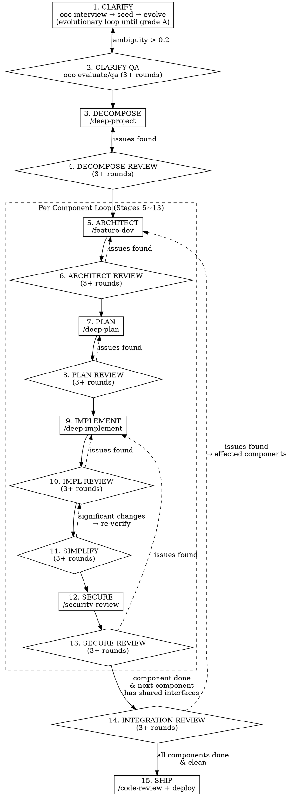

# Buster Call — Full Development Pipeline

> All guns blazing. Every skill deployed. No stage skipped. No review spared.

One command to orchestrate: **Requirements → QA → Decompose → Architect → Plan → Implement → Verify → Ship**

## Pipeline



## How It Works

When user invokes `/buster-call`, guide them through each stage sequentially. At each gate, confirm readiness before proceeding.

**Review rounds scale by mode** (see *Modes* below). In `feature-multi` every gate runs **3 rounds minimum**; lighter modes run fewer, but a gate that runs never drops to zero. Each round produces a findings report; if the last round still has critical issues, continue until clean or the user intervenes.

## Modes (adaptive rigor)

Not every task needs all 15 stages. On invocation, **auto-detect the mode** from the task (or force it with `--mode`), state it and why, and let the user override before starting. The 15 stages are the *superset*; a mode selects a subset and a round budget.

| Mode | When | Stages run | Rounds | Clarify Qs |
|------|------|-----------|--------|-----------|
| `bug-simple` | one-file / null-check / trivial fix | 1·9·10·12·15 | 1 | ≤2 |
| `bug-complex` | tx · data-integrity · edge-case bug | 1·5·7·9·10·11·12·13·15 | 2 | ≤4 |
| `feature-single` | one component/service feature | 1·2·3·5·6·7·8·9·10·11·12·13·15 | 2 | ≤6 |
| `feature-multi` | multi-component / MSA change | **all 15** | 3 | ≤8 |
| `refactoring` | behavior-preserving restructure | 1·5·7·9·10·11·15 (lock outputs first, SIMPLIFY ×3) | 2 | ≤4 |

- **A gate is never dropped to zero.** Lighter modes run *fewer* rounds, not *no* review — every stage that runs keeps ≥1 round. Only `feature-multi` carries the full 3-round + integration-review discipline.
- **Escalate when the work proves heavy.** If a `bug-simple` review surfaces cross-component impact, bump the mode up and add the skipped stages mid-run. Never stay light to save time once the task shows it isn't.
- **Integration review (14)** runs only when >1 component (i.e. `feature-multi`).

## Resuming & flags

**Resumable state** — a run persists progress so it survives interruption and context limits:
- `status.yaml` in the project (`projects/<slug>/` in the Telos vault, or repo root with `--local`): `mode`, `current_stage`, `completed_stages`, rounds done, per-component progress.
- `do-summary.md` (append-only): per-stage record — what ran, diffs, findings, gate verdicts. The durable trail.
- On invoke, **load `status.yaml` and resume from the last incomplete stage** — don't redo passed gates. This is the durable counterpart to `handoff` (handoff = live session state; `status.yaml` = durable run state; the Telos `decisions.md` = the permanent decision record).

| Flag | Effect |
|------|--------|
| `--mode <name>` | Force a mode instead of auto-detecting |
| `--dry-run` | Run analysis/planning + gates, but **no commits / no ship** |
| `--skip-questions` | Skip the Stage-1 interview; use the existing approved spec/context |
| `--resume` | Resume from `status.yaml` (also attempted automatically if one exists) |
| `--local` | Lightweight: no Telos project scaffold; `status.yaml`/`do-summary.md` in repo, gitignored |

## Companion Skills (matt-pocock/skills)

These small, composable skills attach to specific stages. They are **not** replacements for the orchestrated tools above — they sharpen the artifact each stage produces. Invoke the companion at the stage marked, then run that stage's review gate as normal.

| Companion skill | Attaches to | Role (non-negotiable where marked ★) |
|-----------------|-------------|--------------------------------------|
| `domain-modeling` | Stage 1 (start) + 5 | ★ Produces the **single source of truth** for terminology: repo `CONTEXT.md` (ubiquitous language glossary) + `docs/adr/` (decisions). Every consistency check below verifies against these. |
| `grill-with-docs` | Stage 1-2 CLARIFY | Relentless one-question-at-a-time interview that emits ADRs + glossary as it goes. **Primary fallback when Ouroboros MCP is unavailable.** |
| `codebase-design` | Stage 5 + 11 | Shared deep-module vocabulary (module/interface/depth/seam/adapter/leverage/locality). Use these terms exactly in the tradeoff matrix and simplify findings. |
| `tdd` | Stage 9 | Enforces vertical-slice TDD (no horizontal "all tests then all code"). Reinforces deep-implement. |
| `diagnosing-bugs` | Stage 9/10/14 (on failure) | When a review gate or test fails: **build a tight pass/fail feedback loop FIRST**, then bisect. Mandatory before any speculative fix. |
| `handoff` | Any gate (pause/resume) | Writes the **ephemeral** session-state handoff doc to OS temp so a fresh agent resumes mid-pipeline. See the durability split below. |

### The terminology guardrail (★ inviolable)

Stages 4/6/8/14 all check "shared entities defined identically / terminology uniform / decisions not re-litigated." Those checks are **meaningless without a fixed reference.** Therefore:

- **`CONTEXT.md` (repo-local)** is the authority for that project's ubiquitous language. `domain-modeling` owns it. Every spec, architecture, plan, and review **must** use its vocabulary verbatim.
- **`docs/adr/` (repo-local)** records decisions. Review stages **must not re-litigate a recorded ADR** — flag a conflict instead.
- If `CONTEXT.md` does not exist when a consistency check runs, that is a **CRITICAL finding** — run `domain-modeling` (or `grill-with-docs`) to create it before proceeding. Never run a consistency check against an absent reference and call it clean.

## Telos Vault Bridge

The Telos vault (`/Users/hanbi/Library/Mobile Documents/iCloud~md~obsidian/Documents/telos-vault`) is the **durable spine**: intents (why) · wiki (cross-project knowledge) · projects (artifacts) · decisions log (history). Buster-call is a **producer**; Telos is the **memory**. Wire them as a closed loop:

```
telos-query (load prior intent · decisions · wiki)
   → telos-new project (allocate id · board row · skeleton)
      → BUSTER CALL run (produces PRD · ADRs · plan · code)
         → telos-link (adopt artifacts: frontmatter, implements: intent-NNNN, [[wiki]] links)
         + telos-log (append each gate decision to decisions.md — append-only)
            → telos-lint (after the run: broken links · orphans · stale intents)
```

**Hard rules:**
- **Before Stage 1**, run `/telos-query` on the topic to load existing intents, prior decisions, and wiki knowledge. This prevents re-deriving settled questions. If a matching `intent-NNNN` exists, the run **implements** it; the Seed/PRD frontmatter carries `implements: intent-NNNN`.
- **Before Stage 3**, scaffold the workspace with `/telos-new project` so every artifact lands in one `projects/<NNNN-slug>/` folder with a board row.
- **After each gate passes**, append the decision to the project's `decisions.md` via `/telos-log` (append-only; `git pull` first if a vault session may also be open).
- **After Stages 1, 7, and 15** (or whenever a durable artifact lands in `projects/`), run `/telos-link` to adopt it into the graph — up to its intent, across to wiki concepts.
- **After the run completes**, run `/telos-lint` to catch the link rot a multi-artifact dump creates.

**Durability split — handoff vs Telos (do not conflate):**
- `handoff` (matt-pocock) = **ephemeral** session state → OS temp dir. Throwaway. For "resume this pipeline in a fresh context."
- Telos `decisions.md` / `telos-link` = **permanent** record → the vault. For "what we decided and why, forever." Promote a decision that outlives the project to `wiki/` (`type: pattern`).
- A pause at a gate writes **both**: handoff for the live state, telos-log for the durable decision.

**Knowledge boundary (★ no double-authoring):** `CONTEXT.md` (repo-local ubiquitous language) and Telos `wiki/` (cross-project compounding knowledge) must not grow the same glossary twice. `CONTEXT.md` stays next to the code; `telos-ingest`/`telos-link` pull only the **reusable** concepts up into `wiki/`. ADRs live in repo `docs/adr/` and are mirrored as decision facts via `telos-log` — never forked.

### Stage 1: CLARIFY (Why are we building this?)
- **Precondition:** run `/telos-query` on the topic first; if an `intent-NNNN` matches, this run implements it.
- Invoke `ooo interview` to run Socratic interview
- Goal: ambiguity ≤ 0.2, clear problem definition
- **Evolutionary Loop via `ooo evolve`:**
  1. `ooo interview` → collect initial requirements
  2. `ooo seed` → convert interview results to Seed spec
  3. `ooo evaluate` → evaluate Seed spec (ambiguity score, completeness, consistency)
  4. If grade < A → `ooo evolve` starts automatic evolution loop:
     ```
     Interview → Seed → Evaluate → [grade < A? → evolve_step → re-evaluate]
         ↑                                                          ↓
         └──────────── evolutionary feedback loop ──────────────────┘
     ```
  5. Each evolve_step incorporates evaluation feedback to improve the Seed
  6. Repeats automatically until Grade A or user intervention
- **Companion:** run `domain-modeling` alongside to start `CONTEXT.md` (the glossary every later consistency check verifies against).
- **Fallback:** MCP unavailable → `grill-with-docs` (relentless interview + auto ADR/glossary), then `ooo evaluate`-style manual QA. Last resort: `ooo interview` → `ooo evaluate` → re-interview.
- **Gate:** ambiguity ≤ 0.2 AND Seed grade ≥ A AND `CONTEXT.md` seeded AND user confirms requirements are clear

### Stage 2: CLARIFY QA (Are requirements truly clear?)

Automatic 3-round review cycle on the interview/clarification output:

```
Round 1 → Round 2 → Round 3 → [clean? → proceed / dirty? → continue]
```

**Each round checks:**
1. **Completeness** — All key questions (Who, What, Why, How, When, Constraints) answered?
2. **Ambiguity** — Any vague or ambiguous terms/requirements remaining?
3. **Consistency** — No contradictions between requirements?
4. **Feasibility** — Technically implementable? No unrealistic expectations?
5. **Scope** — Clear boundaries? Implicit assumptions made explicit?
6. **Acceptance Criteria** — Each requirement's completion criteria verifiable?

**Round procedure:**
1. Invoke `ooo evaluate` or `ooo qa` on interview results
2. Generate findings report with severity (CRITICAL / WARN / INFO)
3. CRITICAL/WARN → loop back to Stage 1 for focused re-interview
4. Show user the findings and proposed clarifications
5. Next round reviews the updated requirements

**Exit condition:** Round ≥ 3 AND no CRITICAL/WARN findings remaining AND ambiguity ≤ 0.2.

---

### Stage 3: DECOMPOSE (What are the pieces?)
- Invoke `/deep-project` with interview results
- Breaks the project into independent components/modules
- User sets **priority order**
- **Gate:** User approves component breakdown and priority

### Stage 4: DECOMPOSE REVIEW (Are the pieces consistent?)

Automatic 3-round review cycle on the decomposition output:

```
Round 1 → Round 2 → Round 3 → [clean? → proceed / dirty? → continue]
```

**Each round checks:**
1. **Coverage** — All spec requirements mapped to tasks? No missing requirements?
2. **Overlap** — Any duplicate scope between tasks?
3. **Dependency** — Clear inter-task dependencies? No circular dependencies?
4. **Boundary** — Clear task boundaries? No overlapping responsibilities?
5. **Completeness** — Completing all tasks satisfies the full spec?
6. **Inter-Spec Consistency** — No contradictions between component specs? Shared entities defined identically across components? Data models/interfaces consistent? Terminology used uniformly?

**Round procedure:**
1. Dispatch `/code-review` (built-in) — or the `feature-dev` `code-reviewer` agent
2. Generate findings report with severity (CRITICAL / WARN / INFO)
3. Auto-fix CRITICAL and WARN issues
4. Show user the diff between before/after
5. Next round reviews the fixed version

**Exit condition:** Round ≥ 3 AND no CRITICAL/WARN findings remaining.

---

**After Stage 4, Stages 5~13 repeat per component.**

Independent components can run in parallel via `superpowers:dispatching-parallel-agents`.

### Stage 5: ARCHITECT (How does it fit together?)
- Invoke `/feature-dev` — code-architect agent analyzes codebase
- **Companion:** load `codebase-design` for the deep-module vocabulary (module/interface/depth/seam/adapter/leverage/locality) and use those terms exactly in the tradeoff matrix. Use the `CONTEXT.md` glossary for all domain naming.
- **Architecture alternatives exploration (mandatory):**
  1. Derive at minimum 2~3 architecture alternatives
  2. Create **tradeoff matrix** for each:
     | Alternative | Pros | Cons | Complexity | Scalability | Spec Fit |
  3. Present comparison to user → select optimal approach
  4. Write detailed architecture for selected approach
- Produces: file structure, data flows, API design, component relationships, **tradeoff analysis**
- **Gate:** User approves architecture blueprint AND alternatives were compared

### Stage 6: ARCHITECT REVIEW (Does architecture match spec?)

Automatic 3-round review cycle:

**Each round checks:**
1. **Spec↔Architecture Alignment** — All functional requirements reflected? No over-engineering beyond spec?
2. **Data Model Correctness** — Entity relationships accurately express business rules?
3. **API Design Consistency** — Endpoints cover all use cases? Naming conventions consistent?
4. **Component Boundaries** — Clear separation of concerns? No circular dependencies?
5. **Scalability & NFR** — Non-functional requirements (performance, security, scalability) addressed?
6. **Cross-Component Interface** — Interfaces with other components match existing definitions?

**Exit condition:** Round ≥ 3 AND no CRITICAL/WARN findings remaining.

---

### Stage 7: PLAN (What's the build order?)
- Invoke `/deep-plan` for each component
- Produces: detailed implementation plan with dependencies and sequence
- **Gate:** User approves implementation plan

### Stage 8: PLAN REVIEW (Do plan and spec agree?)

Automatic 3-round review cycle:

**Each round checks:**
1. **Spec↔Plan Alignment** — All plan tasks map to spec requirements?
2. **Inter-Task Consistency** — Task A's output matches Task B's input?
3. **Dependency Order** — Build order respects dependencies?
4. **Architecture↔Plan Alignment** — Stage 5 architecture decisions accurately reflected?
5. **Testability** — Each task's completion criteria verifiable? TDD test cases cover requirements?
6. **Cross-Spec Consistency** — Plan doesn't contradict other component specs/plans? Shared API contracts match? Shared DB schemas identical? Event/message formats consistent?

**Exit condition:** Round ≥ 3 AND no CRITICAL/WARN findings remaining.

---

### Stage 9: IMPLEMENT (Build it)
- Invoke `/deep-implement` which uses TDD
- Superpowers TDD and code-review skills activate automatically
- **Companion:** apply `tdd` discipline — vertical slices, behavior through public interfaces, **never** all-tests-then-all-code (horizontal slicing). If a test or build fails and the cause isn't obvious, switch to `diagnosing-bugs`: construct a tight pass/fail feedback loop **before** any speculative fix.
- Work through plan component by component
- **Gate:** All tests pass, code review clean

### Stage 10: IMPLEMENTATION REVIEW (Does code match plan and spec?)

Automatic 3-round review cycle:

**Each round checks:**
1. **Code↔Plan Alignment** — All plan tasks implemented? No missing implementations?
2. **Code↔Spec Alignment** — All original spec requirements in code? No unspecified features added?
3. **Interface Consistency** — Inter-module interfaces (API, types, data models) match plan?
4. **Behavioral Correctness** — Code behavior matches spec's expected behavior? Edge cases handled per spec?
5. **Test Coverage** — Tests sufficiently cover spec requirements? No missing test scenarios?

**Exit condition:** Round ≥ 3 AND no CRITICAL findings remaining.

---

### Stage 11: SIMPLIFY (Is the code clean and lean?)

Automatic 3-round simplification cycle:

**Companion:** judge "clean" with `codebase-design` vocabulary — prefer **deep** modules (much behavior behind a small interface) over shallow ones; apply the deletion test. For structural deepening opportunities across the component, run `improve-codebase-architecture`.

**Each round invokes `/simplify` and checks:**
1. **Duplication** — Duplicate code between tasks or files? Common logic extractable?
2. **Dead Code** — Unused functions, variables, imports, types remaining?
3. **Over-Engineering** — Unnecessary abstractions, excessive config, unused extension points?
4. **AI Bloat** — Unnecessary AI-generated comments, excessive error handling, defensive code?
5. **Complexity** — Functions over 40 lines, nesting over 3 levels, unnecessary helpers?
6. **Naming & Readability** — Clear naming? Intent communicated through code alone?

**Rollback:** If simplification changes are significant (function signatures changed, modules merged/split, data flow altered) → loop back to Stage 10 to re-verify alignment.

**Exit condition:** Round ≥ 3 AND no SIMPLIFY findings remaining.

---

### Stage 12: SECURE (Is it safe?)
- Invoke `/security-review` (built-in) on completed code
- OWASP Top 10, hardcoded secrets, injection flaws
- **Gate:** No critical/high issues remain

### Stage 13: SECURE REVIEW (Are all security issues resolved?)

Automatic 3-round review cycle:

**Each round checks:**
1. **Fix Verification** — Discovered security issues actually fixed? Fixes don't introduce new vulnerabilities?
2. **Regression** — Security fixes don't break existing functionality? Tests still pass?
3. **Coverage** — Scan covered all code paths? No missing attack vectors?
4. **Spec↔Security Alignment** — Spec's security requirements (auth, authz, data protection) all implemented?
5. **Cross-Component Security** — No security gaps at component interfaces? (auth token passing, CORS, API permissions, etc.)

**Exit condition:** Round ≥ 3 AND no CRITICAL/WARN findings remaining.

---

### Stage 14: INTEGRATION REVIEW (Do components work together?)

**Triggers after:** each component completes Stages 5~13 AND shares interfaces with previously completed components.

**Also triggers after:** ALL components complete — final full integration review before Ship.

Automatic 3-round review cycle:

**Each round checks:**
1. **API Contract Consistency** — Component A's API calls match Component B's API definitions?
2. **Shared Data Model** — Shared entity schemas identical across components? No migration conflicts?
3. **Event/Message Contract** — Event publisher and consumer formats/fields match?
4. **Auth Flow** — Auth/authz flow consistent across component boundaries? Token/session handling unified?
5. **Error Handling** — Error propagation consistent between components?
6. **E2E Scenario** — Following user scenario end-to-end, no data flow gaps between components?

**Exit condition:** Round ≥ 3 AND no CRITICAL/WARN findings remaining.

---

### Stage 15: SHIP (Deploy it)
- No dedicated ship plugin is installed. Use the manual path: run the project's
  **lint → test → build**, a final `/code-review` (or `/verify` to confirm the
  change works in the real app), then deploy via the project's existing CI/deploy
  command. *(If you later install a ship plugin like `shipyard`, swap it in here.)*
- **Gate:** Production deployment confirmed
- **Telos close-out (mandatory):** `/telos-link` all durable artifacts into the graph → `/telos-log` the ship decision to `decisions.md` → `/telos-lint` the vault. If the intent's acceptance criteria are now met, mark `intent-NNNN` `fulfilled` and promote any reusable decision to `wiki/` (`type: pattern`).

## Usage

User says `/buster-call` → auto-detect the mode, confirm it, then start at Stage 1 (or resume from `status.yaml` if a run exists).

- `/buster-call` → auto-detect mode, full flow
- `/buster-call --mode bug-simple` → force a lighter mode
- `/buster-call --dry-run --skip-questions` → analysis only, no commits, reuse existing spec
- `/buster-call --resume` → continue the last interrupted run from `status.yaml`
- `/buster-call 5` → jump to Stage 5 (ARCHITECT)
- `/buster-call secure` → jump to Stage 12

## Stage Tracking

At each stage transition, display progress with component context:

```
═══════════════════════════════════════════════════════
  BUSTER CALL [5/15] ARCHITECT — Component A (1/4)
  Mode: feature-multi (3 rounds) · resume: status.yaml
  ─────────────────────────────────────────────────────
  ✅ 1.  CLARIFY
  ✅ 2.  CLARIFY QA          (3/3 rounds ✅)
  ✅ 3.  DECOMPOSE
  ✅ 4.  DECOMPOSE REVIEW    (3/3 rounds ✅)
  ▶ 5.  ARCHITECT
  ○ 6.  ARCHITECT REVIEW    (0/3 rounds)
  ○ 7.  PLAN
  ○ 8.  PLAN REVIEW         (0/3 rounds)
  ○ 9.  IMPLEMENT
  ○ 10. IMPL REVIEW         (0/3 rounds)
  ○ 11. SIMPLIFY            (0/3 rounds)
  ○ 12. SECURE
  ○ 13. SECURE REVIEW       (0/3 rounds)
  ○ 14. INTEGRATION REVIEW  (0/3 rounds)
  ○ 15. SHIP
  ─────────────────────────────────────────────────────
  Components: ▶A  ○B  ○C  ○D
  Telos: intent-0042 · proj 0007-slug · ✅query ✅new ○link ○log
  Glossary: CONTEXT.md ✅seeded
═══════════════════════════════════════════════════════
```

## Prerequisites

This skill orchestrates other skills. Ensure the following are available:

| Skill/Tool | Used In | Required? |
|------------|---------|-----------|
| [Ouroboros](https://github.com/piercelamb/ouroboros) | Stage 1-2 | Yes |
| `/deep-project` | Stage 3 | Yes |
| `/feature-dev` | Stage 5 | Yes |
| `/deep-plan` | Stage 7 | Yes |
| `/deep-implement` | Stage 9 | Yes |
| `/simplify` (built-in) | Stage 11 | Recommended |
| `/security-review` (built-in) | Stage 12 | Recommended |
| `/code-review` (built-in) | Review stages, Stage 15 | Recommended |
| `/verify` (built-in) | Stage 15 | Optional |
| `superpowers:dispatching-parallel-agents` | Parallel components | Optional |
| ~~`/shipyard`~~ | Stage 15 | **Not installed** — use manual ship path |
| `domain-modeling` (matt-pocock) | Stage 1, 5 + all consistency checks | **Yes** — owns `CONTEXT.md`/ADRs, the consistency-check reference |
| `grill-with-docs` (matt-pocock) | Stage 1-2 | Recommended — Ouroboros fallback |
| `codebase-design` (matt-pocock) | Stage 5, 11 | Recommended — deep-module vocabulary |
| `tdd` (matt-pocock) | Stage 9 | Recommended |
| `diagnosing-bugs` (matt-pocock) | Stage 9/10/14 on failure | Recommended |
| `handoff` (matt-pocock) | Any gate | Recommended — pause/resume |
| `telos-query` / `telos-new` / `telos-link` / `telos-log` / `telos-lint` | Bridge (before/after run) | Recommended — durable memory |

## Dependencies & fallbacks (degrade, never halt)

Buster-call is an **orchestrator** — chaining other skills is its whole job, so it
depends on them by design. It is **not** a standalone skill. But it is built to
**degrade gracefully**: every stage has a built-in or installed-companion fallback,
so a missing plugin slows the run down — it never stops it. The one thing it can't
synthesize is real deployment, which is project-specific.

**Tier 0 — built-in (zero install).** `/code-review`, `/simplify`,
`/security-review`, `/verify`, `/run`. These carry **8 of 15 stages** (4, 6, 8, 10,
11, 12, 13, 14) with no external dependency at all.

**Tier 1 — matt-pocock companions (installed globally).** `grill-with-docs`,
`grilling`, `domain-modeling`, `codebase-design`, `tdd`, `diagnosing-bugs`,
`handoff`, `to-issues`. These are the fallbacks for Tier 2.

**Tier 2 — external plugins (preferred, but replaceable).** If one isn't
installed, drop to the fallback and continue:

| Stage | Preferred plugin | If missing → fallback |
|-------|------------------|------------------------|
| 1-2 CLARIFY | `ouroboros` (`ooo *`) | `grill-with-docs` → plain one-question interview + the Stage 2 checklist |
| 3 DECOMPOSE | `/deep-project` | `to-issues` (tracer-bullet vertical slices) → inline component breakdown |
| 5 ARCHITECT | `/feature-dev` | inline architecture using `codebase-design` vocabulary + the mandatory tradeoff matrix |
| 7 PLAN | `/deep-plan` | inline plan sharpened via `grilling` |
| 9 IMPLEMENT | `/deep-implement` | `tdd` discipline + direct edits; `diagnosing-bugs` on failure |
| 15 SHIP | *(none generic)* | project's lint → test → build, then `/code-review` + `/verify`, deploy via the project's own CI/command |

**Runtime rule:** at each stage, check whether the preferred tool resolves. If it
doesn't, **announce the fallback in one line and proceed** — never halt or skip the
stage because a plugin is absent. The review gates (Tier 0) are always available,
so the 3-round verification discipline holds no matter what's installed.

**Bottom line:** with only Tier 0 + Tier 1 (built-ins + your matt-pocock skills),
buster-call runs end-to-end through Stage 14. Every Tier 2 plugin is an upgrade,
not a hard requirement. Only Stage 15 deployment needs project-specific wiring.

## Commit & PR convention (during a run)

- **Branch per run, never commit to the default branch.** Name by mode:
  `feat/<slug>` (feature-*), `fix/<slug>` (bug-*), `refactor/<slug>` (refactoring).
  Multi-component runs may branch per component: `feat/<slug>-<component>`.
- **Commit at stage boundaries, not mid-stage.** Land a commit after IMPLEMENT (9)
  clears its review (10), and after SIMPLIFY (11). Imperative subject; body says
  *why* and references the spec/intent. End every commit body with the repo's
  `Co-Authored-By` trailer.
- **`--dry-run` never commits or ships.**
- **PR/MR at Stage 15** — title mirrors the spec's Outcome; body links the spec,
  the `do-summary.md`, and `intent-NNNN`. Don't merge until the ship gate passes.
- **Record refs back.** Write commit SHAs / PR URL into `do-summary.md` per stage,
  and log the ship decision to the Telos project's `decisions.md` via `/telos-log`.

## Rules

- **NEVER skip a review stage entirely.** Rounds scale by mode (see *Modes*): `feature-multi` = 3, lighter modes = 1–2. A stage that runs always runs at least 1 review round, and you never go below the mode's round budget. Dropping a gate to zero is never allowed.
- **Review stages are NOT optional gates** — they are mandatory verification steps.
- Never skip a gate without user confirmation.
- If a stage's tool is unavailable, explain what to do manually.
- Each stage produces artifacts that feed the next stage.
- User can pause and resume at any gate.
- **Review checklist enforcement:** At each review stage, explicitly list all check items with PASS/FAIL/WARN status. Do not summarize — show each item.
- **Integration review is mandatory** after each component that shares interfaces with completed components AND after all components complete.
- **If you catch yourself thinking "reviews are already sufficient" or "this is simple enough to skip review" — that is exactly when you MUST run the review.** No exceptions.

### Guardrails (companion skills & Telos)

- **No consistency check without a reference.** A terminology/consistency check (Stages 4/6/8/14) run while `CONTEXT.md` is absent is itself a CRITICAL finding. Create it via `domain-modeling`/`grill-with-docs` first. Never declare an absent-reference check "clean."
- **Never re-litigate a recorded ADR.** If a review conflicts with `docs/adr/`, flag the conflict for the user — don't silently overrule a decision.
- **One glossary, two homes by purpose only.** `CONTEXT.md` = repo-local ubiquitous language; Telos `wiki/` = cross-project knowledge. Never author the same glossary in both — promote reusable concepts up via `telos-link`/`telos-ingest`.
- **Bridge is not optional bookkeeping.** `/telos-query` before Stage 1 and `/telos-link` + `/telos-log` after gates are part of the pipeline, not afterthoughts. An undocumented decision is a lost decision.
- **Pause writes both records.** On any pause: `handoff` for ephemeral session state (OS temp), `telos-log` for the durable decision (vault). Never rely on the handoff doc as permanent memory.
- **Failure → feedback loop first.** On a failing gate/test, `diagnosing-bugs` discipline applies: build a tight pass/fail signal before any speculative fix.
- **Missing plugin → fallback, never halt.** If a stage's preferred external plugin isn't installed, announce the Tier-1/Tier-0 fallback (see *Dependencies & fallbacks*) and continue. Never skip a stage or abort the run because a plugin is absent — the built-in review gates always hold.
