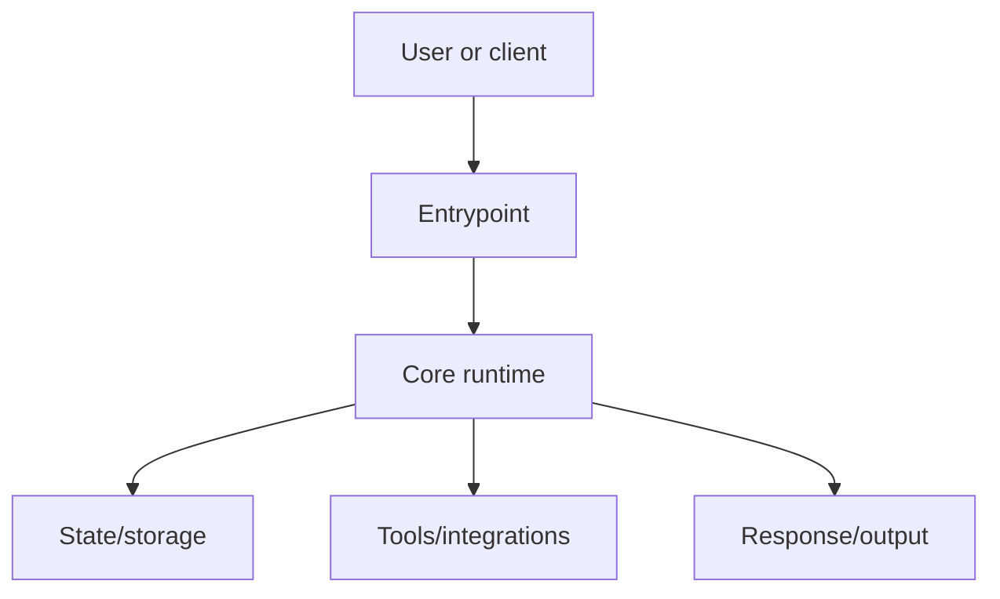

# Repo Expert Onboarding

Use this skill when the user wants to deeply understand a repository, create architecture documentation, onboard from zero to expert, explain how an agent/app/framework works, or generate a complete guide for future contributors.

The goal is not a README summary. The goal is a source-grounded expert guide that explains how the repo works end to end and lets a new engineer reason about behavior, modify it safely, and debug it.

## Process

1. Inventory the repository.
2. Classify it against the domain modules in `references/` and read every matching module.
3. Build a provisional coverage matrix: repository surfaces plus module topics, with unresolved depth marks where investigation is still needed.
4. Investigate deeply, with subagents when available, until every matrix row is resolved.
5. Derive the file plan from the resolved matrix. Structure is an output of investigation, never a preset.
6. Write the guide and wire it into the repository's agent docs.
7. Validate: bundled script, semantic checks, and an independent critic whose structure verdict is recorded in the guide.

If the output directory already contains a guide, switch to the update flow in "Updating an Existing Guide" instead of regenerating.

## Operating Rules

- Inspect the repository before explaining it.
- Prefer `rg`, `rg --files`, `git`, package manifests, tests, and source files over assumptions.
- Cite concrete files and line numbers for important claims.
- Keep unrelated repo changes untouched.
- If the user gives an output folder, write all guide files there. Otherwise create `repo-expert-guide/` at the repository root.
- If the repository is remote and not present locally, clone or fetch it only when tools and permissions allow it. Otherwise explain the blocker and proceed from available files.
- If subagent tools are available, use them for independent focused passes. If not, perform the same passes sequentially yourself.
- Do not rely only on `README`, docs, or release notes. Treat them as orientation, then verify against code.
- Do not invent missing behavior. Mark unknowns explicitly and explain how to verify them.
- Qualify behavior by entrypoint and deployment mode. Never imply that Gateway, embedded, CLI, worker, test, and container paths behave identically without evidence.
- Treat tests as behavioral evidence, especially for edge cases and compatibility behavior. When prose, source, tests, and examples disagree, document the disagreement.
- Avoid unsupported absolutes such as "all", "every", "never", "secure", or "isolated". Prove them with an inventory or narrow the claim.

## First Pass: Repository Inventory

Run an inventory before deep reading:

```sh
pwd
git status --short
git rev-parse --show-toplevel
git rev-parse HEAD
git branch --show-current
git remote -v
git rev-list --left-right --count HEAD...@{upstream}
rg --files
```

Then identify:

- Languages, package managers, frameworks, and runtime versions.
- Entrypoints: binaries, CLI commands, services, web servers, workers, tests, scripts.
- Top-level directories and ownership boundaries.
- Configuration files and environment variables.
- Generated/vendor/build directories that should not be over-read.
- Tests and examples that demonstrate intended behavior.
- Docs that may already explain architecture.
- Local `HEAD` versus its configured upstream. Fetch only when permitted; never pull over a dirty worktree. Record any known divergence in the guide.
- Rough code weight per subsystem (file counts, line counts). The file plan later allocates depth by this weight, and the investigation scales by it.

Create a short source map for yourself before writing the final guide.

## Domain Modules

After the inventory, decide which domain modules describe this repository. Most real repositories match more than one — a research agent with a Next.js frontend matches both agent-harness and web-app; a knowledge-graph platform may match data-pipeline, web-app, and agent-harness at once. Read every matching file:

- `<skill-dir>/references/agent-harness.md` — agent loops, prompts/context, memory, model providers, tool execution, protocol adapters, chat channels.
- `<skill-dir>/references/web-app.md` — frontends, HTTP APIs, data models, auth, background jobs, ingress, deployment/IaC, service topology.
- `<skill-dir>/references/data-pipeline.md` — stage graphs, connectors, extraction/canonicalization, data products, evaluation harnesses, backfills.
- `<skill-dir>/references/cli-library.md` — command surfaces, TUIs, published packages, releases, supply-chain controls.
- `<skill-dir>/references/evals-benchmark.md` — task/dataset definitions, system-under-test adapters, scoring and judges, run matrices, results lifecycle, statistical rigor.
- `<skill-dir>/references/infrastructure.md` — IaC stacks and state, environments and promotion, plan/apply and GitOps lifecycle, secrets and identity, blast radius.
- `<skill-dir>/references/spec-framework.md` — prompt/spec/DSL frameworks: definition language and schema, spec-vs-implementation drift, compiler/emitter, composition and inheritance, provenance auditing, vocabulary evolution.

Each matched module contributes required topics and investigation questions: merge them into the coverage matrix as rows. Modules never dictate file names, file counts, or file boundaries.

If no module matches, derive topics from the inventory alone. If a repository type recurs that no module covers, say so in your final response so a new module can be added.

## Coverage Gate

Immediately after reading the matched modules — before deep investigation — build a provisional coverage matrix. Rows come in two kinds:

- **Surface rows**, from the inventory: every first-class surface (package, service, executable, route group, worker, protocol adapter, persistence backend, UI surface), each with its rough code weight.
- **Topic rows**, from the matched domain modules and the Topic Requirements below. Attach each topic row to the surface(s) it concerns. Topics that concern the whole repository — testing, observability, the security narrative, change playbooks — are cross-cutting aspects, not surfaces.

For each row, mark one of:

- deep coverage with a traced flow;
- summarized coverage with source links;
- intentionally omitted with a reason;
- unresolved and requiring investigation.

At the gate, most depth marks will be provisional or unresolved — that is expected. Deep investigation resolves them: a row keeps a deep-coverage mark only once its flow has actually been traced. The topology matrix and persistence ledger below are likewise completed during investigation, not at the gate.

Do not let the primary happy path consume the entire guide. Trace every major runtime mode, or state explicitly that a mode is not covered. Publish the final matrix in `appendix-coverage-and-evidence.md`.

Treat a surface as first-class/major when it is independently executable, deployable, publicly routed, operator-configurable, persisted, or backed by its own package/test domain. Treat a repository as large when it has multiple runtime services or more than three such surfaces. The important diagrams are the architecture, end-to-end runtime, and state lifecycle diagrams required by the writing requirements below.

Build these inventories when the repository has the corresponding surface:

1. **Topology matrix:** launcher/deployment variant, processes, listeners, public proxy routes, authentication boundary, state backend, sandbox/isolation boundary, and shutdown owner.
2. **Persistence ledger:** logical state, physical location/table, owner or tenant key, secret/content sensitivity, writer and reader, locking/atomicity, retention/deletion/cascade, migration/backup, and multi-process behavior.

## Subagent Strategy

When subagents are available, launch focused agents with bounded tasks. Give each subagent only the repo path, the target output, and its investigation scope. Do not feed them your conclusions unless validating a specific section.

### Scaling the investigation

Scale effort to the code-weight inventory from the first pass:

- Small repository (one runtime surface, roughly under 50k LOC): two or three focused passes, or do them sequentially yourself.
- Medium repository: the six roles below, once each.
- Large repository (multiple runtime services or over ~300k LOC): run the architecture mapper first to partition the repository, then fan out runtime/state/security passes per heavy subsystem rather than one global pass each.

Stop when every coverage-matrix row is resolved — deep, summarized, or omitted-with-reason — not when a fixed number of agents has run. Depth target: at least one traced end-to-end flow per surface row marked deep.

Recommended subagents:

1. Architecture mapper
   - Map top-level modules, boundaries, public APIs, and dependency direction.
   - Find the main execution paths and entrypoints.
   - Return source-backed findings and unresolved questions.

2. Runtime tracer
   - Trace a representative request/task/command from entrypoint to completion.
   - Identify event loops, queues, background jobs, concurrency, retries, cancellation, and error handling.
   - Return a sequence diagram outline.

3. State and data analyst
   - Find databases, files, caches, memory systems, checkpoints, context stores, sessions, and migrations.
   - Produce the persistence ledger, including deletion order, orphaned data, secret-bearing files, locking, and behavior across entrypoints/workers.

4. Tools and integrations analyst
   - Identify external APIs, plugins, MCP/tool systems, SDK wrappers, provider adapters, webhooks, CLIs, and extension points.
   - Explain registration, discovery, execution, permissions, and result handling.

5. Security and operations reviewer
   - Identify auth, authorization, secret handling, sandboxing, permission prompts, network boundaries, input validation, file safety, and prompt-injection defenses.
   - Enumerate public routes from proxy/deployment configuration and find direct-service bypasses, missing/null ownership, global mutable resources, subprocess environment exposure, SSRF/upload limits, TLS, and default-off controls.
   - Identify logging, metrics, debug tools, health checks, deployment, upgrade/rollback, and service management.

6. Documentation critic
   - After the guide draft exists, independently check it for unsupported claims, missing important files, unclear diagrams, stale paths, and gaps.
   - Check alternate entrypoints and tests for contradictions. Challenge every security, persistence, retry, cancellation, rollback, cleanup, and isolation claim.
   - Check the file plan against the repository: would a knowledgeable maintainer name different sections, or give the heaviest subsystem more room? Flag any structure that mirrors this skill's illustrations or generic category names instead of this repository's subsystems. Verify every line of the README structure rationale against the coverage matrix and the code it claims to cover.
   - Record the critic's verdict verbatim in a `Structure-fit review` section of `appendix-coverage-and-evidence.md`, together with how each objection was resolved. The validator requires this section. When no subagents are available, perform this pass yourself after a break from drafting and record it the same way.

Run the critic on the draft without giving it your conclusions. If capacity permits, use a separate critic for security/deployment because happy-path architecture reviews routinely miss exposed control planes and unsafe defaults.

Useful subagent prompt template:

```text
You are analyzing the repository at: <absolute_repo_path>

Scope: <specific scope>

Return:
1. The main files/directories for this scope.
2. The important runtime/data flows.
3. Source-backed facts with file paths and line references. Use tests as evidence for edge behavior.
4. The first-class surfaces in this scope (independently executable, deployable, routed, or persisted), each with rough code weight, plus any topology/persistence facts.
5. Gaps or uncertainty.

Do not summarize README only. Verify against source code.
Do not propose the guide's file structure.
Do not modify files.
```

## Deep Investigation Checklist

Answer these questions before writing:

- What problem does this repo solve?
- What are the main runtime modes?
- What are the executable entrypoints?
- Which launchers and deployment manifests produce materially different topologies?
- What happens from user input/request/command to final output?
- What are the core abstractions and data structures?
- Where is state stored?
- How is context assembled, mutated, compressed, cached, or persisted?
- How are external tools or services registered, selected, called, retried, and reported?
- How are permissions, secrets, auth, and unsafe actions controlled?
- How does configuration flow from files/env/CLI/UI into runtime behavior?
- What are the extension points?
- What is synchronous, asynchronous, background, or scheduled?
- How are errors classified and recovered?
- What can fail after state is persisted but before work starts?
- What do cancellation, retry, timeout, rollback, reconnect, and crash recovery actually guarantee, and what side effects can continue?
- How are logs, traces, metrics, test fixtures, and debug tools used?
- Which public routes bypass the primary application/authentication layer?
- Which resources are global, shared, ownerless, legacy-compatible, or keyed differently across storage planes?
- What is deleted, retained, or orphaned when a user-visible object is removed?
- What should a new engineer read first?
- What files are risky to modify without understanding their callers?
- What common changes will future contributors likely make?

Matched domain modules add their own investigation questions. Answer those with the same rigor.

## File Plan

Derive the guide structure from the resolved coverage matrix — after deep investigation, before drafting. Structure is an output of investigation, never a preset.

Three files are fixed: `README.md` (the index), `appendix-code-map.md`, and `appendix-coverage-and-evidence.md`. Every numbered file between them is repo-derived:

- Every surface row marked deep coverage gets a home file; the heaviest surfaces get several. Matrix rows are finer-grained than files: a numbered file typically covers one surface plus the topic rows attached to it.
- No numbered file may cover more than two surface rows marked deep coverage. If a draft file needs three, split it. Cross-cutting aspect rows (testing, observability, playbooks, the security narrative) do not count against this cap and may merge freely in small repositories.
- Weight follows the repository: the two or three heaviest subsystems (by code size, distinctiveness, or expected change frequency) get the most files. Giving the dominant subsystem one slot while every peripheral topic gets its own is the classic failure.
- Name every numbered file after this repository's subsystems, in this repository's vocabulary — `04-middleware-chain.md`, `07-provider-adapters.md` — not after generic categories.
- Never copy a filename from the illustrations below. Every numbered file name must trace to a matrix row for this repository.
- Do not map the Topic Requirements families one-to-one onto numbered files, in their listed order or any other. A plan of exactly one file per family is the known failure mode, and the validator rejects plans dominated by generic category names.
- Number files in recommended reading order. Inserted suffixes such as `08a-` are fine when late investigation grows the plan.
- Guides typically run 8–25 numbered files depending on repository size. Choose the count the matrix demands, not a familiar number.
- Litmus test: if the file list could describe a different repository, restructure before drafting.

Record the plan in `README.md` under a `Structure rationale` heading: one line per numbered file, naming the matrix rows it covers (surfaces first) and why it stands alone or shares a file. Every numbered file must be mentioned by name in that section — the validator checks this; the critic challenges the substance.

Three illustrative plans for three unrelated, fictional repositories. They are deliberately dissimilar — if your plan resembles any of them more than it resembles the repository, restructure:

```text
# "echo", a chat-agent kernel (matched: agent-harness, cli-library)
repo-expert-guide/
|-- README.md
|-- 01-echo-kernel-map.md
|-- 02-echo-cli-modes-and-config.md
|-- 03-turn-lifecycle-and-interrupts.md
|-- 04-prompt-assembly-and-cache-boundaries.md
|-- 05-memory-and-recall.md
|-- 06-provider-adapters-and-model-catalog.md
|-- 07-tool-execution-and-sandboxing.md
|-- 08-mcp-and-editor-clients.md
|-- 08a-slack-and-telegram-bridges.md
|-- 09-session-store-and-replay.md
|-- 10-packaging-releases-and-supply-chain.md
|-- 11-sandbox-trust-and-secret-handling.md
|-- 12-testing-with-the-fake-provider.md
|-- 13-extending-echo-playbooks.md
|-- appendix-code-map.md
`-- appendix-coverage-and-evidence.md
```

```text
# "maren", a storefront monorepo (matched: web-app)
repo-expert-guide/
|-- README.md
|-- 01-storefront-service-topology.md
|-- 02-docker-compose-dev-and-env-matrix.md
|-- 03-storefront-frontend.md
|-- 04-checkout-and-payments-service.md
|-- 05-catalog-service-and-postgres-model.md
|-- 06-auth-sessions-and-tenancy.md
|-- 07-ingress-routes-and-deployment.md
|-- 08-background-jobs-and-webhooks.md
|-- 09-ci-smoke-suites-and-oncall-playbooks.md
|-- appendix-code-map.md
`-- appendix-coverage-and-evidence.md
```

```text
# a telemetry ETL platform (matched: data-pipeline, web-app)
repo-expert-guide/
|-- README.md
|-- 01-collector-to-mart-dataflow.md
|-- 02-stage-graph-and-run-lifecycle.md
|-- 03-collectors-and-source-auth.md
|-- 04-enrichment-and-schema-canonicalization.md
|-- 05-marts-product-versioning-and-consumers.md
|-- 06-eval-harness-and-quality-gates.md
|-- 07-serving-api-and-dashboard.md
|-- 08-backfills-quotas-and-incident-playbooks.md
|-- appendix-code-map.md
`-- appendix-coverage-and-evidence.md
```

The smaller repositories merge several topic families into single files (`09-ci-smoke-suites-and-oncall-playbooks.md`) while the kernel splits them; both follow their matrices. These are shapes, not menus: never copy a filename from an illustration — every name must come from the target repository's own vocabulary.

## Guide Writing Requirements

Every guide should include:

- An index with a recommended reading path and a task map.
- A big-picture architecture diagram.
- At least one end-to-end runtime sequence diagram.
- A state/context/data lifecycle diagram when the repo stores meaningful state.
- A source map table listing important directories and files.
- At least five short, exact source excerpts for a large repository, spanning composition, runtime context, persistence, execution/tooling, and authorization. Use fewer proportionally for a small repository. Put a `Source:` link within six lines of each excerpt and explain its invariant. Excerpts must be real multi-line passages, not one-line tokens.
- Explanation of configuration, environment variables, and entrypoints.
- Explanation of tests and how to validate changes.
- A change playbook for common modifications.
- A glossary of repo-specific vocabulary if the repo has domain terms.
- A final "expert checklist" that tells the reader what they should understand.
- A coverage/evidence appendix containing the subsystem matrix, the structure-fit review, known unknowns, stale or contradictory repo docs, and intentionally omitted areas.

Keep distinct stores and control planes distinct in prose and diagrams. Do not merge concepts into labels such as "database/stores" when they have different owners or lifecycles. Follow every important diagram with an edge-evidence table that maps each edge to the concrete interface and source location.

Use Mermaid for diagrams:



Use concise snippets:

```python
# Keep snippets short and explain why this code matters.
def important_entrypoint(...):
    ...
```

Prefer file links in final status messages. Inside the guide, use relative links between guide files and source paths when useful.

## Topic Requirements

The file plan decides where content lives; these lists decide what must exist. Every topic family below must be covered somewhere in the guide — in one file, split across several, or explicitly marked not applicable (with the reason) in the coverage appendix. Matched domain modules add more required topics; treat their lists exactly like these.

The families are listed alphabetically, not in reading order, and they are not a table of contents. Mapping one family to one numbered file, family by family, reproduces the generic template this skill exists to prevent — the File Plan rules and the validator both reject that shape.

### README.md (fixed file)

Include:

- What the guide covers.
- This exact metadata block — the validator matches these labels literally:

```text
Commit: `<sha>`
Branch: `<branch-name>`        (or: detached)
Analyzed: <YYYY-MM-DD>
Working tree before generation: <clean | dirty | modified | untracked>
Upstream divergence: ahead <N>, behind <N>        (or: unknown, noting that unfetched tracking refs may be stale)
```

- A `Structure rationale` section: one line per numbered file naming the coverage-matrix rows it covers and why the plan groups them that way.
- Reading path from beginner to expert.
- A task map: a short table from common jobs to the files that serve them (for example `Debug a failed run -> 03, 09`; `Add a provider -> 06, 10`; `Operate and deploy -> 02, 08`). Keep to the five to eight likeliest tasks. This is what lets a human — or a coding agent — load two files instead of twenty.
- Section index.
- Top 10 files/directories to understand first.
- Warning about any generated/vendor directories skipped.

### Change playbooks

Practical recipes:

- Add a new command/route/tool/provider/plugin.
- Add a new config option.
- Add a new persisted field or migration.
- Add tests for a core behavior.
- Debug a failed runtime path.
- Upgrade an external dependency or protocol.
- Upgrade, migrate, back up, restore, and roll back persisted data/configuration.

### Domain model

- Core classes, types, schemas, protocols, and interfaces.
- How data moves between them.
- Invariants the code relies on.
- Where abstractions are thin wrappers versus real ownership boundaries.

### Orientation and big picture

- Repository purpose.
- Main runtime modes.
- Topology matrix for launch/deployment variants.
- Main actors: users, clients, services, providers, workers, tools.
- Architecture diagram.
- Vocabulary.

### Runtime flow

- End-to-end request/command/task lifecycle.
- Main call stack with file references.
- Async/concurrency model.
- Error handling and retries.
- Admission-before-execution failures, disconnect/reconnect, cancellation, rollback, interrupts/resume, crash recovery, cleanup, and side effects that outlive cancellation.
- Sequence diagram.

### Security, permissions, and trust model

- Authn/authz.
- Secret loading and redaction.
- Sandbox or approval model.
- File/network/process boundaries.
- Prompt injection or untrusted content handling.
- Risky operations and guardrails.
- Public ingress and direct-service routes, TLS assumptions, global/shared mutation, missing/null owner compatibility, subprocess environment/log exposure, SSRF and upload boundaries, resource limits, and default-disabled protections.

### Setup, entrypoints, and configuration

- How the project is installed/run.
- CLI commands, services, web servers, workers, jobs, scripts.
- Config precedence: defaults, config files, env vars, CLI flags, UI settings.
- Secret interpolation and whether mutation paths preserve placeholders and unknown fields.
- Hot-reload versus restart behavior per setting group.
- Important manifests.
- Minimal local run path and common failure modes.

### State, storage, and context

- Databases, file stores, caches, sessions, memory systems, indexes, queues.
- Read/write lifecycle.
- Retention and cleanup.
- Deletion order, cascades, orphaned records/files, locking/atomicity, backup/restore, and multi-worker behavior.
- Migration/versioning.

### Testing, debugging, and observability

- Test layout and how to run targeted tests.
- Logs and debug commands.
- Metrics/tracing/health checks.
- Fixtures and mocked services.
- How to debug common failures.
- CI workflow/path-filter map, release/container checks, and an exact runnable command for every named test suite.

### Tools, integrations, and extension points

- Plugin systems.
- Tool registries.
- External APIs.
- Provider adapters.
- Protocol adapters.
- Extension lifecycle: discover, register, configure, call, return result, handle failure.
- Concrete source-backed configuration examples and permission/timeout/cancellation/secret behavior for each major extension family.

### UIs, APIs, and clients

- Web UI, desktop UI, CLI, editor integrations, API clients, chat platforms, or protocol clients.
- What each client owns and what the backend owns.
- Transport formats and event streams.
- Behavioral differences across browser, API, embedded, CLI/TUI, worker, editor, and messaging clients.

### appendix-code-map.md (fixed file)

Include:

- File/directory map.
- One-line reason each important file exists.
- "Read first" and "read later" ordering.

### appendix-coverage-and-evidence.md (fixed file)

Include:

- Published subsystem coverage matrix.
- A `Structure-fit review` section: the documentation critic's verbatim verdict on the file plan and how each objection was resolved. The validator requires this section.
- Topology matrix and persistence ledger, or links to their full sections.
- Important diagram-edge evidence.
- Known unknowns, source/test/doc contradictions, and intentionally omitted areas.
- Snapshot freshness and upstream divergence.

## Make the Guide Discoverable

A guide nobody loads is dead weight. After writing:

- If the repository has a `CLAUDE.md` or `AGENTS.md`, append a short, clearly delimited section pointing at the guide: where it lives, that `README.md` is the index, and that a coding agent should load the one or two numbered files matching its task (via the README task map) rather than the whole guide. Keep the block under ten lines and do not modify unrelated content.
- If neither file exists, recommend creating one in your final response, with the pointer text ready to paste — but do not create it unprompted.

## Validation Pass

Before final response, run the bundled validator:

```sh
python3 <skill-dir>/scripts/validate_guide.py \
  --repo <repo-root> \
  --guide <guide-dir> \
  --min-files <expected-guide-file-count> \
  --min-diagrams <2-or-3> \
  --min-source-snippets <2-or-5> \
  --require-metadata \
  --require-head-match \
  --check-upstream
```

Use three diagrams when meaningful state exists, otherwise two. Use five source excerpts for a large/multi-service repository and two for a small repository. Set `--min-files` to the file-plan count recorded in the README structure rationale (numbered files plus the three fixed files). When reviewing an existing guide, re-derive the expected count from the repository's coverage matrix, not from the number of files already present. Do not lower thresholds to make validation pass.

Use `--require-head-match` for fresh generation and completed updates. When a guide is intentionally pinned to an older commit (see "Updating an Existing Guide"), omit that flag and record the divergence in the README instead.

Independent of the flags, the validator always enforces: the three fixed files exist; the README has a `Structure rationale` section (in prose, not inside a code fence) that mentions every numbered file by name; `appendix-coverage-and-evidence.md` contains a `Structure-fit review` section; numbered files are not stubs; the plan is not dominated by generic template names; diagrams are deduplicated and non-trivial; and counted source snippets are real multi-line excerpts whose text appears in the linked source.

Then complete the semantic checks below:

1. Check that every guide file in the index exists.
2. Check for placeholders:

```sh
rg -n "T[O]DO|T[B]D|F[I]XME|P[L]ACEHOLDER|\\?\\?\\?" <guide-dir>
```

3. Check that claimed source files and non-linked backticked paths exist. The validator checks local inline and reference-style Markdown links, heading/line anchors, and exact README index links; manually inspect ambiguous shorthand paths.

```sh
rg -n "`[^`]+\\.(py|ts|tsx|js|go|rs|java|kt|rb|php|cs|cpp|c|h|yaml|yml|toml|json)`" <guide-dir>
```

Then spot-check important paths manually.

4. Run lightweight project validation when safe:
   - Existing docs tests or link checks.
   - Formatting for generated markdown if tooling exists.
   - Targeted unit tests only when they are quick and do not require network/secrets.

5. Re-read the guide as a new contributor:
   - Can they explain the system in 5 minutes?
   - Can they trace one complete runtime path?
   - Can they find where to add a feature?
   - Can they identify state, security boundaries, and debugging tools?

6. Run a contradiction pass:
   - For claims not explicitly scoped to one mode, compare against at least one alternate entrypoint or deployment mode.
   - Compare failure/security claims against focused tests and default configuration.
   - Verify diagram ownership and every edge-evidence row.
   - Search for `all`, `every`, `never`, `secure`, `isolated`, and `resumable`; prove or qualify each occurrence.

7. Check the file plan against the finished guide:
   - Every deep-coverage surface row has a home file; no numbered file covers more than two deep-coverage surface rows.
   - The README structure rationale matches the files that actually exist.
   - The file names describe this repository's subsystems, not generic categories or this skill's illustrations.

## Updating an Existing Guide

When the output directory already contains a guide, default to updating it in place. Regenerate from scratch only when the file plan itself is invalid — first-class subsystems were added or removed — or when the user asks for a rebuild.

1. Read the existing guide's README: the recorded `Commit:` and the structure rationale.
2. Scope the churn: `git diff --stat <guide-commit>..HEAD` and `git diff --name-only <guide-commit>..HEAD`, intersected with the source paths each guide file cites.
3. Classify every guide file: update needed / minor touch-up / unchanged, each with a reason. Investigate only the affected subsystems, at the depth the changes warrant.
4. Update the affected files and re-anchor their line references and snippets against the new commit. Preserve hand edits; never rewrite an unchanged file for style.
5. Revisit the coverage matrix: new surfaces get new rows and, when marked deep, new numbered files (`08a-` suffixes exist for this); removed surfaces get their files retired and the rationale updated.
6. Record the update in an update-map file (for example `update-map-<old>-to-<new>.md`, or numbered into the reading order): from/to commits, the per-file decision table, and anything intentionally left stale.
7. Update the README metadata block to the new commit and re-run the Validation Pass — now with `--require-head-match`.

## Final Response Contract

End with a concise summary:

- Output folder path.
- Commit analyzed.
- Known upstream divergence or inability to check it.
- Domain modules matched, and any repository type no module covered.
- Sections created (or updated), and one or two sentences on why this file plan fits this repository.
- Coverage confidence: counts of deep / summarized / omitted / unresolved matrix rows, and the two or three weakest areas named inline.
- The most important architecture findings.
- Validation performed, anything that could not be run, and rough effort spent (subagent passes run, depth cut short anywhere).
- A two-or-three-step spot-check recipe the user can run in minutes (for example: open one numbered file, follow a `Source:` link, confirm the excerpt still matches).
- Current git status for generated docs.

Do not paste the full guide into chat unless the user asks. Point to the generated files.
