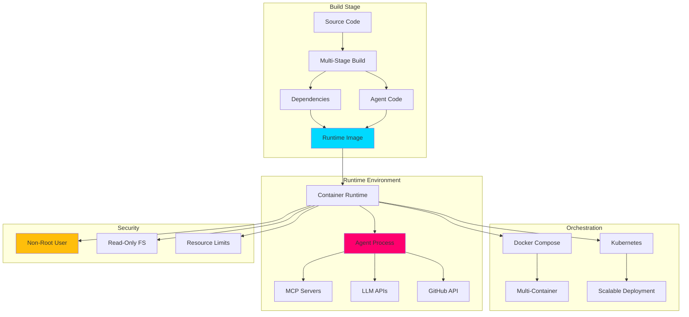

# 🐳 Containerization for Agentic Workflows


## 🔴 AI FIRST Quality Principle

> **Apply the AI FIRST principle: never accept first-pass quality. Minimum 2 iterations. Read all output, improve every section. No shortcuts.**

## 📋 Overview

This skill provides comprehensive patterns for containerizing GitHub Agentic Workflows using Docker and container orchestration platforms. It covers container isolation strategies, security hardening techniques, multi-stage build optimization, Docker Compose orchestration, and Kubernetes deployment patterns for production-ready autonomous agent systems.

## 🎯 Core Concepts

### Container Architecture



### Key Principles

1. **Isolation**: Containers provide process and resource isolation
2. **Immutability**: Containers are built once, run anywhere
3. **Security**: Defense-in-depth with multiple security layers
4. **Efficiency**: Minimal image size and resource usage
5. **Orchestration**: Automated deployment and scaling
6. **Observability**: Comprehensive logging and monitoring

## 🏗️ Multi-Stage Builds

### 1. Optimized Node.js Agent

```dockerfile
# docker/agent-node.Dockerfile
# Multi-stage build for Node.js agentic workflow

# Stage 1: Build dependencies
FROM node:24-alpine AS deps
LABEL stage=deps

WORKDIR /app

# Copy dependency manifests
COPY package.json package-lock.json ./

# Install dependencies (production only)
RUN npm ci --only=production \
    && npm cache clean --force

# Stage 2: Build application
FROM node:24-alpine AS builder
LABEL stage=builder

WORKDIR /app

# Copy dependencies from deps stage
COPY --from=deps /app/node_modules ./node_modules

# Copy source code
COPY scripts/agents ./scripts/agents
COPY .github/copilot-mcp.json ./config/

# Build TypeScript if needed
# RUN npm run build

# Stage 3: Production runtime
FROM node:24-alpine AS runtime

# Install security updates
RUN apk update && apk upgrade \
    && apk add --no-cache \
        dumb-init \
        ca-certificates \
    && rm -rf /var/cache/apk/*

# Create non-root user
RUN addgroup -g 1001 -S agent \
    && adduser -u 1001 -S agent -G agent

WORKDIR /app

# Copy production dependencies
COPY --from=deps --chown=agent:agent /app/node_modules ./node_modules

# Copy application code
COPY --from=builder --chown=agent:agent /app/scripts/agents ./scripts/agents
COPY --from=builder --chown=agent:agent /app/config ./config

# Set environment variables
ENV NODE_ENV=production \
    NODE_OPTIONS="--max-old-space-size=2048" \
    LOG_LEVEL=info

# Switch to non-root user
USER agent

# Health check
HEALTHCHECK --interval=30s --timeout=10s --start-period=5s --retries=3 \
    CMD node -e "require('http').get('http://localhost:3000/health', (r) => { process.exit(r.statusCode === 200 ? 0 : 1); });"

# Expose port (if needed)
EXPOSE 3000

# Use dumb-init to handle signals properly
ENTRYPOINT ["dumb-init", "--"]

# Default command
CMD ["node", "scripts/agents/main.js"]
```

### 2. Optimized Python Agent

```dockerfile
# docker/agent-python.Dockerfile
# Multi-stage build for Python agentic workflow

# Stage 1: Build dependencies
FROM python:3.11-slim AS builder

# Install build dependencies
RUN apt-get update \
    && apt-get install -y --no-install-recommends \
        build-essential \
        gcc \
        g++ \
    && rm -rf /var/lib/apt/lists/*

WORKDIR /app

# Copy dependency manifests
COPY requirements.txt requirements-agent.txt ./

# Create virtual environment and install dependencies
RUN python -m venv /opt/venv \
    && /opt/venv/bin/pip install --upgrade pip setuptools wheel \
    && /opt/venv/bin/pip install --no-cache-dir \
        -r requirements.txt \
        -r requirements-agent.txt

# Stage 2: Production runtime
FROM python:3.11-slim

# Install security updates and runtime dependencies
RUN apt-get update \
    && apt-get upgrade -y \
    && apt-get install -y --no-install-recommends \
        ca-certificates \
        dumb-init \
        curl \
    && rm -rf /var/lib/apt/lists/*

# Create non-root user
RUN useradd -m -u 1001 -s /bin/bash agent

WORKDIR /app

# Copy virtual environment from builder
COPY --from=builder --chown=agent:agent /opt/venv /opt/venv

# Copy application code
COPY --chown=agent:agent scripts/agents ./scripts/agents
COPY --chown=agent:agent .github/copilot-mcp.json ./config/

# Set environment variables
ENV PATH="/opt/venv/bin:$PATH" \
    PYTHONUNBUFFERED=1 \
    PYTHONDONTWRITEBYTECODE=1 \
    PYTHONHASHSEED=random \
    PIP_NO_CACHE_DIR=1 \
    PIP_DISABLE_PIP_VERSION_CHECK=1

# Switch to non-root user
USER agent

# Health check
HEALTHCHECK --interval=30s --timeout=10s --start-period=5s --retries=3 \
    CMD python -c "import urllib.request; urllib.request.urlopen('http://localhost:3000/health')"

# Expose port
EXPOSE 3000

# Use dumb-init
ENTRYPOINT ["dumb-init", "--"]

# Default command
CMD ["python", "scripts/agents/main.py"]
```

### 3. Multi-Runtime Agent

```dockerfile
# docker/agent-multi.Dockerfile
# Multi-stage build with Node.js and Python

# Stage 1: Node.js dependencies
FROM node:24-alpine AS node-deps
WORKDIR /app
COPY package.json package-lock.json ./
RUN npm ci --only=production && npm cache clean --force

# Stage 2: Python dependencies
FROM python:3.11-slim AS python-deps
WORKDIR /app
COPY requirements.txt ./
RUN python -m venv /opt/venv \
    && /opt/venv/bin/pip install --no-cache-dir -r requirements.txt

# Stage 3: Production runtime
FROM ubuntu:22.04

# Install Node.js, Python, and runtime dependencies
RUN apt-get update \
    && apt-get upgrade -y \
    && apt-get install -y --no-install-recommends \
        ca-certificates \
        curl \
        dumb-init \
        nodejs \
        npm \
        python3.11 \
        python3-pip \
    && rm -rf /var/lib/apt/lists/*

# Create non-root user
RUN useradd -m -u 1001 -s /bin/bash agent

WORKDIR /app

# Copy Node.js dependencies
COPY --from=node-deps --chown=agent:agent /app/node_modules ./node_modules

# Copy Python virtual environment
COPY --from=python-deps --chown=agent:agent /opt/venv /opt/venv

# Copy application code
COPY --chown=agent:agent scripts/agents ./scripts/agents
COPY --chown=agent:agent .github/copilot-mcp.json ./config/

# Set environment variables
ENV PATH="/opt/venv/bin:$PATH" \
    NODE_ENV=production \
    PYTHONUNBUFFERED=1

USER agent

ENTRYPOINT ["dumb-init", "--"]
CMD ["node", "scripts/agents/orchestrator.js"]
```

## 🔒 Security Hardening

### 1. Non-Root User

```dockerfile
# Never run containers as root

# Create user and group
RUN addgroup -g 1001 -S agent \
    && adduser -u 1001 -S agent -G agent

# Set ownership
COPY --chown=agent:agent ./app ./app

# Switch to non-root user
USER agent
```

### 2. Read-Only Filesystem

```dockerfile
# Make root filesystem read-only for security

# In Dockerfile: specify writable volumes
VOLUME ["/tmp", "/app/logs"]

# In docker-compose.yml
services:
  agent:
    read_only: true
    tmpfs:
      - /tmp:mode=1777
      - /app/logs:mode=0755
```

```yaml
# In Kubernetes
apiVersion: v1
kind: Pod
spec:
  containers:
  - name: agent
    securityContext:
      readOnlyRootFilesystem: true
    volumeMounts:
    - name: tmp
      mountPath: /tmp
    - name: logs
      mountPath: /app/logs
  volumes:
  - name: tmp
    emptyDir: {}
  - name: logs
    emptyDir: {}
```

### 3. Resource Limits

```dockerfile
# Set resource limits in Dockerfile (documentation)
LABEL resource.memory="512Mi"
LABEL resource.cpu="0.5"
```

```yaml
# docker-compose.yml
services:
  agent:
    deploy:
      resources:
        limits:
          cpus: '0.5'
          memory: 512M
        reservations:
          cpus: '0.25'
          memory: 256M
```

```yaml
# Kubernetes
apiVersion: v1
kind: Pod
spec:
  containers:
  - name: agent
    resources:
      limits:
        cpu: "500m"
        memory: "512Mi"
      requests:
        cpu: "250m"
        memory: "256Mi"
```

### 4. Security Scanning

```yaml
# .github/workflows/container-security.yml
name: Container Security Scan

on:
  push:
    branches: [main]
    paths:
      - 'docker/**'
  pull_request:
    paths:
      - 'docker/**'

jobs:
  scan:
    runs-on: ubuntu-latest
    steps:
      - name: Checkout Code
        uses: actions/checkout@v4
        
      - name: Build Image
        run: |
          docker build -f docker/agent-node.Dockerfile \
            -t agentic-workflow:${{ github.sha }} .
            
      - name: Run Trivy Vulnerability Scanner
        uses: aquasecurity/trivy-action@master
        with:
          image-ref: agentic-workflow:${{ github.sha }}
          format: 'sarif'
          output: 'trivy-results.sarif'
          severity: 'CRITICAL,HIGH'
          
      - name: Upload Trivy Results
        uses: github/codeql-action/upload-sarif@v3
        with:
          sarif_file: 'trivy-results.sarif'
          
      - name: Run Dockle Security Lint
        run: |
          docker run --rm \
            -v /var/run/docker.sock:/var/run/docker.sock \
            goodwithtech/dockle:latest \
            --exit-code 1 \
            --exit-level fatal \
            agentic-workflow:${{ github.sha }}
```

### 5. Secrets Management

```dockerfile
# Use BuildKit secrets for sensitive build-time data
# syntax=docker/dockerfile:1

FROM node:24-alpine

# Mount secret during build (never stored in image)
RUN --mount=type=secret,id=npm_token \
    echo "//registry.npmjs.org/:_authToken=$(cat /run/secrets/npm_token)" > ~/.npmrc \
    && npm ci \
    && rm ~/.npmrc
```

```bash
# Build with secrets
docker build \
  --secret id=npm_token,src=$HOME/.npmrc \
  -f docker/agent.Dockerfile \
  -t agent:latest .
```

## 🎨 Image Optimization

### 1. Layer Caching

```dockerfile
# Optimize layer caching for faster builds

# ❌ Bad: Copy everything first
COPY . /app
RUN npm install

# ✅ Good: Copy dependencies first (cached layer)
COPY package*.json /app/
RUN npm ci

# Then copy code (invalidates cache only if code changes)
COPY . /app/
```

### 2. Minimize Image Size

```dockerfile
# Use Alpine base images
FROM node:24-alpine  # ~180MB vs ~1GB for full Node.js

# Remove build dependencies after installation
RUN apk add --no-cache --virtual .build-deps \
        python3 \
        make \
        g++ \
    && npm ci --only=production \
    && apk del .build-deps

# Clean up package manager cache
RUN rm -rf /var/cache/apk/* \
    && npm cache clean --force

# Use .dockerignore to exclude unnecessary files
# .dockerignore:
# node_modules
# npm-debug.log
# .git
# .github
# tests
# *.md
```

### 3. Distroless Images

```dockerfile
# Use distroless images for maximum security and minimal size
FROM gcr.io/distroless/nodejs24-debian12

# Copy application
COPY --from=builder /app /app

WORKDIR /app

# Distroless images:
# - No shell
# - No package manager
# - Minimal attack surface
# - Only runtime dependencies

CMD ["scripts/agents/main.js"]
```

### 4. Build Cache Optimization

```yaml
# .github/workflows/build-container.yml
name: Build Container

on:
  push:
    branches: [main]

jobs:
  build:
    runs-on: ubuntu-latest
    steps:
      - name: Checkout Code
        uses: actions/checkout@v4
        
      - name: Set up Docker Buildx
        uses: docker/setup-buildx-action@v3
        
      - name: Login to GitHub Container Registry
        uses: docker/login-action@v3
        with:
          registry: ghcr.io
          username: ${{ github.actor }}
          password: ${{ secrets.GITHUB_TOKEN }}
          
      - name: Build and Push with Cache
        uses: docker/build-push-action@v5
        with:
          context: .
          file: ./docker/agent.Dockerfile
          push: true
          tags: ghcr.io/${{ github.repository }}/agent:latest
          cache-from: type=gha
          cache-to: type=gha,mode=max
          build-args: |
            BUILD_DATE=${{ github.event.head_commit.timestamp }}
            VCS_REF=${{ github.sha }}
```

## 🐳 Docker Compose Orchestration

### 1. Multi-Container Agent System

```yaml
# docker-compose.yml
version: '3.8'

services:
  # MCP Gateway
  mcp-gateway:
    build:
      context: .
      dockerfile: docker/mcp-gateway.Dockerfile
    container_name: mcp-gateway
    restart: unless-stopped
    ports:
      - "3000:3000"
    environment:
      - NODE_ENV=production
      - LOG_LEVEL=info
    volumes:
      - ./config/copilot-mcp.json:/app/config/mcp.json:ro
    networks:
      - agent-network
    healthcheck:
      test: ["CMD", "curl", "-f", "http://localhost:3000/health"]
      interval: 30s
      timeout: 10s
      retries: 3
      start_period: 10s
      
  # Agent Runner
  agent:
    build:
      context: .
      dockerfile: docker/agent.Dockerfile
    container_name: agent-runner
    restart: unless-stopped
    depends_on:
      mcp-gateway:
        condition: service_healthy
      redis:
        condition: service_healthy
    environment:
      - NODE_ENV=production
      - MCP_GATEWAY_URL=http://mcp-gateway:3000
      - REDIS_URL=redis://redis:6379
      - GITHUB_TOKEN=${GITHUB_TOKEN}
      - ANTHROPIC_API_KEY=${ANTHROPIC_API_KEY}
    volumes:
      - ./logs:/app/logs
      - agent-data:/app/data
    networks:
      - agent-network
    deploy:
      resources:
        limits:
          cpus: '1'
          memory: 1G
        reservations:
          cpus: '0.5'
          memory: 512M
    security_opt:
      - no-new-privileges:true
    read_only: true
    tmpfs:
      - /tmp:mode=1777
      
  # Redis for caching and queuing
  redis:
    image: redis:7-alpine
    container_name: redis
    restart: unless-stopped
    ports:
      - "6379:6379"
    volumes:
      - redis-data:/data
    networks:
      - agent-network
    command: redis-server --appendonly yes
    healthcheck:
      test: ["CMD", "redis-cli", "ping"]
      interval: 10s
      timeout: 5s
      retries: 5
      
  # PostgreSQL for persistent data
  postgres:
    image: postgres:16-alpine
    container_name: postgres
    restart: unless-stopped
    environment:
      - POSTGRES_DB=agentic_workflow
      - POSTGRES_USER=agent
      - POSTGRES_PASSWORD=${POSTGRES_PASSWORD}
    volumes:
      - postgres-data:/var/lib/postgresql/data
      - ./docker/postgres/init.sql:/docker-entrypoint-initdb.d/init.sql:ro
    networks:
      - agent-network
    healthcheck:
      test: ["CMD-SHELL", "pg_isready -U agent"]
      interval: 10s
      timeout: 5s
      retries: 5
      
  # Prometheus for metrics
  prometheus:
    image: prom/prometheus:latest
    container_name: prometheus
    restart: unless-stopped
    ports:
      - "9090:9090"
    volumes:
      - ./docker/prometheus/prometheus.yml:/etc/prometheus/prometheus.yml:ro
      - prometheus-data:/prometheus
    networks:
      - agent-network
    command:
      - '--config.file=/etc/prometheus/prometheus.yml'
      - '--storage.tsdb.path=/prometheus'
      - '--storage.tsdb.retention.time=15d'
      
  # Grafana for visualization
  grafana:
    image: grafana/grafana:latest
    container_name: grafana
    restart: unless-stopped
    ports:
      - "3001:3000"
    environment:
      - GF_SECURITY_ADMIN_PASSWORD=${GRAFANA_PASSWORD}
      - GF_INSTALL_PLUGINS=redis-datasource
    volumes:
      - grafana-data:/var/lib/grafana
      - ./docker/grafana/dashboards:/etc/grafana/provisioning/dashboards:ro
    networks:
      - agent-network
    depends_on:
      - prometheus

networks:
  agent-network:
    driver: bridge
    ipam:
      config:
        - subnet: 172.28.0.0/16

volumes:
  agent-data:
  redis-data:
  postgres-data:
  prometheus-data:
  grafana-data:
```

### 2. Development Environment

```yaml
# docker-compose.dev.yml
version: '3.8'

services:
  agent:
    build:
      context: .
      dockerfile: docker/agent.Dockerfile
      target: builder  # Use builder stage for development
    environment:
      - NODE_ENV=development
      - DEBUG=agent:*,mcp:*
      - LOG_LEVEL=debug
    volumes:
      - ./scripts:/app/scripts:ro  # Live code reload
      - ./config:/app/config:ro
      - ./logs:/app/logs
    ports:
      - "9229:9229"  # Node.js debugger
    command: ["node", "--inspect=0.0.0.0:9229", "scripts/agents/main.js"]
```

### 3. Production Environment

```yaml
# docker-compose.prod.yml
version: '3.8'

services:
  agent:
    image: ghcr.io/your-org/agent:${VERSION:-latest}
    restart: always
    logging:
      driver: "json-file"
      options:
        max-size: "10m"
        max-file: "3"
    deploy:
      replicas: 3
      update_config:
        parallelism: 1
        delay: 10s
        order: start-first
      restart_policy:
        condition: on-failure
        delay: 5s
        max_attempts: 3
```

## ☸️ Kubernetes Deployment

### 1. Agent Deployment

```yaml
# k8s/agent-deployment.yaml
apiVersion: apps/v1
kind: Deployment
metadata:
  name: agentic-workflow
  namespace: agents
  labels:
    app: agentic-workflow
    version: v1
spec:
  replicas: 3
  strategy:
    type: RollingUpdate
    rollingUpdate:
      maxSurge: 1
      maxUnavailable: 0
  selector:
    matchLabels:
      app: agentic-workflow
  template:
    metadata:
      labels:
        app: agentic-workflow
        version: v1
      annotations:
        prometheus.io/scrape: "true"
        prometheus.io/port: "9090"
        prometheus.io/path: "/metrics"
    spec:
      serviceAccountName: agent
      securityContext:
        runAsNonRoot: true
        runAsUser: 1001
        fsGroup: 1001
      containers:
      - name: agent
        image: ghcr.io/your-org/agent:latest
        imagePullPolicy: Always
        ports:
        - containerPort: 3000
          name: http
          protocol: TCP
        - containerPort: 9090
          name: metrics
          protocol: TCP
        env:
        - name: NODE_ENV
          value: "production"
        - name: MCP_GATEWAY_URL
          value: "http://mcp-gateway:3000"
        - name: GITHUB_TOKEN
          valueFrom:
            secretKeyRef:
              name: github-credentials
              key: token
        - name: ANTHROPIC_API_KEY
          valueFrom:
            secretKeyRef:
              name: llm-credentials
              key: anthropic-key
        resources:
          limits:
            cpu: "1"
            memory: "1Gi"
          requests:
            cpu: "500m"
            memory: "512Mi"
        livenessProbe:
          httpGet:
            path: /health
            port: 3000
          initialDelaySeconds: 30
          periodSeconds: 10
          timeoutSeconds: 5
          failureThreshold: 3
        readinessProbe:
          httpGet:
            path: /ready
            port: 3000
          initialDelaySeconds: 10
          periodSeconds: 5
          timeoutSeconds: 3
          failureThreshold: 2
        securityContext:
          allowPrivilegeEscalation: false
          readOnlyRootFilesystem: true
          runAsNonRoot: true
          runAsUser: 1001
          capabilities:
            drop:
            - ALL
        volumeMounts:
        - name: tmp
          mountPath: /tmp
        - name: logs
          mountPath: /app/logs
        - name: config
          mountPath: /app/config
          readOnly: true
      volumes:
      - name: tmp
        emptyDir: {}
      - name: logs
        emptyDir: {}
      - name: config
        configMap:
          name: agent-config
      imagePullSecrets:
      - name: ghcr-credentials
```

### 2. Service and Ingress

```yaml
# k8s/agent-service.yaml
apiVersion: v1
kind: Service
metadata:
  name: agentic-workflow
  namespace: agents
  labels:
    app: agentic-workflow
spec:
  type: ClusterIP
  ports:
  - port: 3000
    targetPort: 3000
    protocol: TCP
    name: http
  - port: 9090
    targetPort: 9090
    protocol: TCP
    name: metrics
  selector:
    app: agentic-workflow
---
apiVersion: networking.k8s.io/v1
kind: Ingress
metadata:
  name: agentic-workflow
  namespace: agents
  annotations:
    cert-manager.io/cluster-issuer: "letsencrypt-prod"
    nginx.ingress.kubernetes.io/ssl-redirect: "true"
    nginx.ingress.kubernetes.io/force-ssl-redirect: "true"
spec:
  ingressClassName: nginx
  tls:
  - hosts:
    - agent.example.com
    secretName: agent-tls
  rules:
  - host: agent.example.com
    http:
      paths:
      - path: /
        pathType: Prefix
        backend:
          service:
            name: agentic-workflow
            port:
              number: 3000
```

### 3. ConfigMap and Secrets

```yaml
# k8s/agent-config.yaml
apiVersion: v1
kind: ConfigMap
metadata:
  name: agent-config
  namespace: agents
data:
  copilot-mcp.json: |
    {
      "mcpServers": {
        "github": {
          "type": "local",
          "command": "npx",
          "args": ["-y", "@modelcontextprotocol/server-github"]
        }
      }
    }
---
apiVersion: v1
kind: Secret
metadata:
  name: github-credentials
  namespace: agents
type: Opaque
stringData:
  token: ${GITHUB_TOKEN}
---
apiVersion: v1
kind: Secret
metadata:
  name: llm-credentials
  namespace: agents
type: Opaque
stringData:
  anthropic-key: ${ANTHROPIC_API_KEY}
  openai-key: ${OPENAI_API_KEY}
```

### 4. Horizontal Pod Autoscaler

```yaml
# k8s/agent-hpa.yaml
apiVersion: autoscaling/v2
kind: HorizontalPodAutoscaler
metadata:
  name: agentic-workflow
  namespace: agents
spec:
  scaleTargetRef:
    apiVersion: apps/v1
    kind: Deployment
    name: agentic-workflow
  minReplicas: 2
  maxReplicas: 10
  metrics:
  - type: Resource
    resource:
      name: cpu
      target:
        type: Utilization
        averageUtilization: 70
  - type: Resource
    resource:
      name: memory
      target:
        type: Utilization
        averageUtilization: 80
  behavior:
    scaleDown:
      stabilizationWindowSeconds: 300
      policies:
      - type: Percent
        value: 50
        periodSeconds: 60
    scaleUp:
      stabilizationWindowSeconds: 0
      policies:
      - type: Percent
        value: 100
        periodSeconds: 15
      - type: Pods
        value: 2
        periodSeconds: 15
      selectPolicy: Max
```

### 5. Pod Disruption Budget

```yaml
# k8s/agent-pdb.yaml
apiVersion: policy/v1
kind: PodDisruptionBudget
metadata:
  name: agentic-workflow
  namespace: agents
spec:
  minAvailable: 1
  selector:
    matchLabels:
      app: agentic-workflow
```

## 🚀 Deployment Workflows

### 1. Build and Push

```yaml
# .github/workflows/docker-build-push.yml
name: Build and Push Container

on:
  push:
    branches: [main]
    tags:
      - 'v*'
  pull_request:
    branches: [main]

env:
  REGISTRY: ghcr.io
  IMAGE_NAME: ${{ github.repository }}/agent

jobs:
  build:
    runs-on: ubuntu-latest
    permissions:
      contents: read
      packages: write
      
    steps:
      - name: Checkout Code
        uses: actions/checkout@v4
        
      - name: Set up QEMU
        uses: docker/setup-qemu-action@v3
        
      - name: Set up Docker Buildx
        uses: docker/setup-buildx-action@v3
        
      - name: Login to Container Registry
        uses: docker/login-action@v3
        with:
          registry: ${{ env.REGISTRY }}
          username: ${{ github.actor }}
          password: ${{ secrets.GITHUB_TOKEN }}
          
      - name: Extract Metadata
        id: meta
        uses: docker/metadata-action@v5
        with:
          images: ${{ env.REGISTRY }}/${{ env.IMAGE_NAME }}
          tags: |
            type=ref,event=branch
            type=ref,event=pr
            type=semver,pattern={{version}}
            type=semver,pattern={{major}}.{{minor}}
            type=sha
            
      - name: Build and Push
        uses: docker/build-push-action@v5
        with:
          context: .
          file: ./docker/agent.Dockerfile
          platforms: linux/amd64,linux/arm64
          push: ${{ github.event_name != 'pull_request' }}
          tags: ${{ steps.meta.outputs.tags }}
          labels: ${{ steps.meta.outputs.labels }}
          cache-from: type=gha
          cache-to: type=gha,mode=max
          build-args: |
            BUILD_DATE=${{ fromJSON(steps.meta.outputs.json).labels['org.opencontainers.image.created'] }}
            VCS_REF=${{ fromJSON(steps.meta.outputs.json).labels['org.opencontainers.image.revision'] }}
            VERSION=${{ fromJSON(steps.meta.outputs.json).labels['org.opencontainers.image.version'] }}
```

### 2. Deploy to Kubernetes

```yaml
# .github/workflows/k8s-deploy.yml
name: Deploy to Kubernetes

on:
  push:
    branches: [main]
  workflow_dispatch:
    inputs:
      environment:
        description: 'Deployment environment'
        required: true
        type: choice
        options:
          - staging
          - production

permissions:
  contents: read
  id-token: write

jobs:
  deploy:
    runs-on: ubuntu-latest
    environment: ${{ github.event.inputs.environment || 'staging' }}
    
    steps:
      - name: Checkout Code
        uses: actions/checkout@v4
        
      - name: Configure AWS Credentials
        uses: aws-actions/configure-aws-credentials@v4
        with:
          role-to-assume: ${{ secrets.AWS_ROLE_ARN }}
          aws-region: us-east-1
          
      - name: Update Kubeconfig
        run: |
          aws eks update-kubeconfig \
            --name ${{ secrets.EKS_CLUSTER_NAME }} \
            --region us-east-1
            
      - name: Deploy to Kubernetes
        run: |
          kubectl set image deployment/agentic-workflow \
            agent=${{ env.REGISTRY }}/${{ env.IMAGE_NAME }}:${{ github.sha }} \
            --namespace=agents \
            --record
            
      - name: Wait for Rollout
        run: |
          kubectl rollout status deployment/agentic-workflow \
            --namespace=agents \
            --timeout=5m
            
      - name: Verify Deployment
        run: |
          kubectl get pods \
            --namespace=agents \
            --selector=app=agentic-workflow
```

## 📊 Monitoring and Observability

### 1. Container Metrics

```yaml
# docker/prometheus/prometheus.yml
global:
  scrape_interval: 15s
  evaluation_interval: 15s

scrape_configs:
  - job_name: 'agent'
    static_configs:
      - targets: ['agent:9090']
    metrics_path: '/metrics'
    
  - job_name: 'docker'
    static_configs:
      - targets: ['host.docker.internal:9323']
```

### 2. Health Checks

```javascript
// scripts/agents/lib/health.js
import http from 'http';

/**
 * Health check endpoint for container orchestration
 */
export function createHealthServer(port = 3000) {
  const server = http.createServer((req, res) => {
    if (req.url === '/health') {
      // Liveness probe - is process running?
      res.writeHead(200, { 'Content-Type': 'application/json' });
      res.end(JSON.stringify({
        status: 'healthy',
        timestamp: new Date().toISOString()
      }));
    } else if (req.url === '/ready') {
      // Readiness probe - can accept traffic?
      const ready = checkReadiness();
      const status = ready ? 200 : 503;
      res.writeHead(status, { 'Content-Type': 'application/json' });
      res.end(JSON.stringify({
        status: ready ? 'ready' : 'not ready',
        timestamp: new Date().toISOString()
      }));
    } else {
      res.writeHead(404);
      res.end();
    }
  });
  
  server.listen(port, () => {
    console.log(`Health server listening on port ${port}`);
  });
  
  return server;
}

function checkReadiness() {
  // Check dependencies (MCP servers, databases, etc.)
  return true;
}
```

## 🎯 Best Practices

### 1. Container Labels

```dockerfile
# Add OCI standard labels
LABEL org.opencontainers.image.title="Agentic Workflow" \
      org.opencontainers.image.description="GitHub Agentic Workflow Agent" \
      org.opencontainers.image.vendor="Your Organization" \
      org.opencontainers.image.version="${VERSION}" \
      org.opencontainers.image.created="${BUILD_DATE}" \
      org.opencontainers.image.revision="${VCS_REF}" \
      org.opencontainers.image.source="https://github.com/your-org/repo" \
      org.opencontainers.image.licenses="Apache-2.0"
```

### 2. .dockerignore

```
# .dockerignore
# Exclude unnecessary files from build context

# Git
.git
.github
.gitignore

# Documentation
*.md
docs/

# Tests
tests/
coverage/
*.test.js

# Dependencies (will be installed in container)
node_modules/
venv/

# IDE
.vscode/
.idea/

# Logs
logs/
*.log

# Build artifacts
dist/
build/

# Environment
.env
.env.*
```

### 3. Health Check Script

```bash
#!/bin/sh
# docker/health-check.sh
# Container health check script

set -e

# Check if main process is running
if ! pgrep -f "node.*main.js" > /dev/null; then
  echo "Main process not running"
  exit 1
fi

# Check if health endpoint responds
if ! curl -f http://localhost:3000/health > /dev/null 2>&1; then
  echo "Health endpoint not responding"
  exit 1
fi

echo "Container healthy"
exit 0
```

## 📚 Related Skills

- **[gh-aw-github-actions-integration](../gh-aw-github-actions-integration/)** - CI/CD patterns
- **[gh-aw-logging-monitoring](../gh-aw-logging-monitoring/)** - Observability
- **[gh-aw-authentication-credentials](../gh-aw-authentication-credentials/)** - Secrets management
- **[gh-aw-mcp-gateway](../gh-aw-mcp-gateway/)** - MCP Gateway
- **[gh-aw-safe-outputs](../gh-aw-safe-outputs/)** - Safe outputs

## 🔗 References

### Docker Documentation
- [Dockerfile Best Practices](https://docs.docker.com/develop/develop-images/dockerfile_best-practices/)
- [Multi-Stage Builds](https://docs.docker.com/build/building/multi-stage/)
- [BuildKit](https://docs.docker.com/build/buildkit/)
- [Docker Compose](https://docs.docker.com/compose/)

### Security
- [Docker Security](https://docs.docker.com/engine/security/)
- [CIS Docker Benchmark](https://www.cisecurity.org/benchmark/docker)
- [OWASP Container Security](https://cheatsheetseries.owasp.org/cheatsheets/Docker_Security_Cheat_Sheet.html)

### Kubernetes
- [Kubernetes Documentation](https://kubernetes.io/docs/)
- [Pod Security Standards](https://kubernetes.io/docs/concepts/security/pod-security-standards/)
- [Resource Management](https://kubernetes.io/docs/concepts/configuration/manage-resources-containers/)

### Tools
- [Trivy Scanner](https://github.com/aquasecurity/trivy)
- [Dockle](https://github.com/goodwithtech/dockle)
- [Dive (Image Analysis)](https://github.com/wagoodman/dive)

## ✅ Remember Checklist

When containerizing agentic workflows:

- [ ] Use multi-stage builds for optimization
- [ ] Run as non-root user
- [ ] Implement read-only root filesystem
- [ ] Set resource limits (CPU, memory)
- [ ] Add health and readiness checks
- [ ] Scan images for vulnerabilities
- [ ] Use Alpine or distroless base images
- [ ] Minimize image layers
- [ ] Use .dockerignore effectively
- [ ] Pin base image versions with digests
- [ ] Add OCI standard labels
- [ ] Implement proper logging
- [ ] Use BuildKit for faster builds
- [ ] Cache dependencies separately from code
- [ ] Use secrets management (not environment variables)

---

**License**: Apache-2.0  
**Version**: 2.0.0  
**Last Updated**: 2026-04-02  
**Maintained by**: Hack23 Organization


---

## 🔗 Integration with Riksdagsmonitor agentic workflows

This gh-aw skill is applied by the 11 agentic news workflows in `.github/workflows/news-*.md`. Their domain contract (analysis-artifact product, gate, article contract) lives in:

- [`.github/prompts/README.md`](../../prompts/README.md) — module catalogue, import rules, AI-FIRST 2-pass rule.
- [`analysis/methodologies/ai-driven-analysis-guide.md`](../../../analysis/methodologies/ai-driven-analysis-guide.md) + [`analysis/templates/`](../../../analysis/templates/) — 9 core / 14 Tier-C artifacts.
- [`05-analysis-gate.md`](../../prompts/05-analysis-gate.md) — the single blocking gate before any article content is written.

**Upstream gh-aw docs** (v0.69.3): [abridged](https://github.github.com/gh-aw/llms-small.txt) · [complete](https://github.github.com/gh-aw/llms-full.txt) · [agentic-workflows blog series](https://github.github.com/gh-aw/_llms-txt/agentic-workflows.txt) · [source repo](https://github.com/github/gh-aw) · [GitHub CLI manual](https://cli.github.com/manual/).
