# YoLoIT

YoLoIT is a CLI-first desktop workspace. Everything — boards, panels, widgets, runs, chats — can be created, read, updated, and driven through the `yoloit` terminal command. Use this skill when you need to interact with the YoLoIT app on behalf of the user.

## Core concepts

- **Board**: an infinite canvas that contains panels. `yoloit boards`, `yoloit board:create`, `yoloit board:use`, `yoloit board:current`.
- **Panel**: a typed widget on a board (note, terminal, kanban, chat, file tree, run configs, playlist, webpage, timer, drawing, etc.). Create with `yoloit panel:create <board> <type-id> <title>`.
- **Group**: a visual/logical collection of panels. `yoloit group:create`, `yoloit group:collapse`, `yoloit group:expand`.
- **App / Widget**: a custom JavaScript panel type. Develop with `yoloit app:dev-skill`, run with `yoloit app:run .`, reload with `yoloit app:reload .`.
- **Run panel**: persistent long-running shell processes. Start via the panel actions discovered with `yoloit panel:help <board> <panel>`.
- **AI Chat panel**: chat with local or cloud models. Send messages with `yoloit yolochat:send`.

## Command map

```mermaid
graph LR
  root[yoloit]
  root --> g_app(("app"))
  g_app --> g_app_0["reload"]
  g_app --> g_app_1["restart"]
  g_app --> g_app_2["help"]
  g_app --> g_app_3["app:list · myapps · widget:list · wg:ls"]
  g_app --> g_app_4["app:install · widget:install · wg:i"]
  g_app --> g_app_5["app:remove · widget:remove · wg:rm"]
  g_app --> g_app_6["app:run · app:open · widget:open · wg:o"]
  g_app --> g_app_7["app:create · widget:create · wg:new"]
  g_app --> g_app_8["app:help"]
  g_app --> g_app_9["app:state"]
  g_app --> g_app_10["app:execute"]
  g_app --> g_app_11["app:reload · app:refresh · widget:reload"]
  g_app --> g_app_12["app:logs"]
  g_app --> g_app_13["app:snapshot"]
  g_app --> g_app_14["app:screenshot"]
  g_app --> g_app_15["app:dev-skill · app:skill · app:docs"]
  g_app --> g_app_16["app:demo"]
  g_app --> g_app_17["app:demo-view"]
  root --> g_board(("board"))
  g_board --> g_board_0["boards"]
  g_board --> g_board_1["board"]
  g_board --> g_board_2["board:create"]
  g_board --> g_board_3["board:snapshot"]
  g_board --> g_board_4["board:diagram"]
  g_board --> g_board_5["boards:snapshot"]
  g_board --> g_board_6["board:screenshot"]
  g_board --> g_board_7["board:svg"]
  g_board --> g_board_8["board:apply"]
  g_board --> g_board_9["board:rename"]
  g_board --> g_board_10["board:folder · bfold"]
  g_board --> g_board_11["board:delete"]
  g_board --> g_board_12["board:archive"]
  g_board --> g_board_13["board:unarchive"]
  g_board --> g_board_14["board:focus"]
  g_board --> g_board_15["board:undo · bundo"]
  g_board --> g_board_16["board:redo · bredo"]
  g_board --> g_board_17["board:zoom"]
  g_board --> g_board_18["board:fit"]
  g_board --> g_board_19["board:arrange"]
  g_board --> g_board_20["board:grid"]
  g_board --> g_board_21["select"]
  g_board --> g_board_22["board:use"]
  g_board --> g_board_23["board:current"]
  g_board --> g_board_24["board:translate"]
  g_board --> g_board_25["sticky:create · sticky:new"]
  g_board --> g_board_26["shape:create · shape:new"]
  g_board --> g_board_27["frame:create · frame:new"]
  g_board --> g_board_28["draw:list · drl"]
  g_board --> g_board_29["draw:add · dra"]
  g_board --> g_board_30["draw:remove · drr"]
  g_board --> g_board_31["draw:clear · drc"]
  g_board --> g_board_32["draw:svg · drsvg"]
  g_board --> g_board_33["draw:export · drex"]
  g_board --> g_board_34["draw:file · drf"]
  root --> g_panel(("panel"))
  g_panel --> g_panel_0["panels"]
  g_panel --> g_panel_1["panel"]
  g_panel --> g_panel_2["panel:help"]
  g_panel --> g_panel_3["panel:create"]
  g_panel --> g_panel_4["do"]
  g_panel --> g_panel_5["panel:rename"]
  g_panel --> g_panel_6["panel:move"]
  g_panel --> g_panel_7["panel:resize"]
  g_panel --> g_panel_8["panel:z · panel:front · panel:back"]
  g_panel --> g_panel_9["panel:delete"]
  g_panel --> g_panel_10["panel:focus"]
  g_panel --> g_panel_11["panel:color"]
  g_panel --> g_panel_12["panel:hide"]
  g_panel --> g_panel_13["panel:show"]
  g_panel --> g_panel_14["panel:screenshot · psc"]
  g_panel --> g_panel_15["panel:types"]
  g_panel --> g_panel_16["panel:copy · pcy"]
  g_panel --> g_panel_17["panel:paste · ppt"]
  g_panel --> g_panel_18["panel:duplicate · pdp"]
  g_panel --> g_panel_19["calendar:create · ccr"]
  g_panel --> g_panel_20["calendar:events · cev"]
  g_panel --> g_panel_21["calendar:add-event · cae"]
  g_panel --> g_panel_22["calendar:delete-event · cde"]
  g_panel --> g_panel_23["calendar:set-view · csv"]
  g_panel --> g_panel_24["calendar:focus-date · cfd"]
  g_panel --> g_panel_25["calendar:scroll-to-time · cstm"]
  g_panel --> g_panel_26["calendar:scroll-to-event · cse"]
  g_panel --> g_panel_27["calendar:show-event · csh"]
  g_panel --> g_panel_28["table:create · tbc"]
  g_panel --> g_panel_29["table:set · tbs"]
  g_panel --> g_panel_30["table:add-row · tbar"]
  g_panel --> g_panel_31["table:update-row · tbur"]
  g_panel --> g_panel_32["table:remove-row · tbrr"]
  g_panel --> g_panel_33["table:add-column · tbac"]
  g_panel --> g_panel_34["table:remove-column · tbrc"]
  g_panel --> g_panel_35["table:clear · tbcl"]
  g_panel --> g_panel_36["chart:create · chc"]
  g_panel --> g_panel_37["chart:set-data · chsd"]
  g_panel --> g_panel_38["chart:set-type · chst"]
  g_panel --> g_panel_39["chart:link-table · chlt"]
  g_panel --> g_panel_40["chart:refresh · chfr"]
  g_panel --> g_panel_41["filetree:create · ftc"]
  g_panel --> g_panel_42["filetree:set-root · ftsr"]
  g_panel --> g_panel_43["terminal:output"]
  g_panel --> g_panel_44["terminal:config"]
  g_panel --> g_panel_45["terminal:set-dir"]
  g_panel --> g_panel_46["filetree:list"]
  g_panel --> g_panel_47["filetree:open"]
  g_panel --> g_panel_48["filetree:expand"]
  g_panel --> g_panel_49["filetree:collapse"]
  g_panel --> g_panel_50["filetree:refresh"]
  root --> g_run(("run"))
  g_run --> g_run_0["run:list"]
  g_run --> g_run_1["run:input"]
  g_run --> g_run_2["run:attach"]
  g_run --> g_run_3["run:popout"]
  g_run --> g_run_4["run:output"]
  g_run --> g_run_5["run:detach"]
  g_run --> g_run_6["run:add"]
  g_run --> g_run_7["run:update"]
  g_run --> g_run_8["run:remove"]
  g_run --> g_run_9["run:run"]
  g_run --> g_run_10["run:stop"]
  g_run --> g_run_11["run:config"]
  g_run --> g_run_12["run:close"]
  g_run --> g_run_13["run:logs"]
  g_run --> g_run_14["run:set-group"]
  g_run --> g_run_15["run:select-session"]
  g_run --> g_run_16["run:clear-session"]
  root --> g_timer(("timer"))
  g_timer --> g_timer_0["timer:create"]
  g_timer --> g_timer_1["timer:status"]
  g_timer --> g_timer_2["timer:set"]
  g_timer --> g_timer_3["timer:start"]
  g_timer --> g_timer_4["timer:pause"]
  g_timer --> g_timer_5["timer:resume"]
  g_timer --> g_timer_6["timer:reset"]
  root --> g_cloud(("cloud"))
  g_cloud --> g_cloud_0["cloud:list"]
  g_cloud --> g_cloud_1["cloud:add"]
  g_cloud --> g_cloud_2["cloud:remove"]
  g_cloud --> g_cloud_3["cloud:select"]
  g_cloud --> g_cloud_4["cloud:update"]
  g_cloud --> g_cloud_5["cloud:provider"]
  root --> g_agents(("agents"))
  g_agents --> g_agents_0["agent:list"]
  g_agents --> g_agents_1["agent:default"]
  g_agents --> g_agents_2["agent:run"]
  g_agents --> g_agents_3["agent:model"]
  g_agents --> g_agents_4["agent:asr"]
  root --> g_yolochat(("yolochat"))
  g_yolochat --> g_yolochat_0["yolochat:panels"]
  g_yolochat --> g_yolochat_1["yolochat:send"]
  g_yolochat --> g_yolochat_2["yolochat:terminal · chat:terminal · terminal:send · term:send"]
  g_yolochat --> g_yolochat_3["yolochat:messages"]
  g_yolochat --> g_yolochat_4["yolochat:clear"]
  g_yolochat --> g_yolochat_5["yolochat:sessions"]
  g_yolochat --> g_yolochat_6["yolochat:history"]
  g_yolochat --> g_yolochat_7["yolochat:restore"]
  g_yolochat --> g_yolochat_8["yolochat:status"]
  g_yolochat --> g_yolochat_9["yolochat:stop"]
  g_yolochat --> g_yolochat_10["yolochat:logs"]
  g_yolochat --> g_yolochat_11["yolochat:config"]
  g_yolochat --> g_yolochat_12["yolochat:follow-up"]
  root --> g_files(("files"))
  g_files --> g_files_0["files:search"]
  g_files --> g_files_1["files:list"]
  g_files --> g_files_2["files:read"]
  g_files --> g_files_3["files:preview"]
  g_files --> g_files_4["filetree:read · ftr"]
  root --> g_search(("search"))
  g_search --> g_search_0["search"]
  root --> g_link(("link"))
  g_link --> g_link_0["links"]
  g_link --> g_link_1["link:create"]
  g_link --> g_link_2["link:delete"]
  g_link --> g_link_3["link:style"]
  g_link --> g_link_4["link:color"]
  root --> g_note(("note"))
  g_note --> g_note_0["note · note"]
  g_note --> g_note_1["note:add · n:a"]
  g_note --> g_note_2["note:create · n:c"]
  g_note --> g_note_3["note:append"]
  g_note --> g_note_4["note:wrap"]
  g_note --> g_note_5["note:nowrap"]
  g_note --> g_note_6["note:get"]
  g_note --> g_note_7["sticky:get"]
  g_note --> g_note_8["sticky:set"]
  g_note --> g_note_9["sticky:append"]
  g_note --> g_note_10["sticky:color"]
  g_note --> g_note_11["shape:get"]
  g_note --> g_note_12["shape:set"]
  g_note --> g_note_13["code:get"]
  g_note --> g_note_14["code:set"]
  root --> g_checklist(("checklist"))
  g_checklist --> g_checklist_0["checklist:add · cl:a"]
  g_checklist --> g_checklist_1["checklist:new · cl:n"]
  g_checklist --> g_checklist_2["checklist:check · cl:ch"]
  g_checklist --> g_checklist_3["checklist:uncheck · cl:u"]
  g_checklist --> g_checklist_4["checklist:items"]
  g_checklist --> g_checklist_5["checklist:remove"]
  g_checklist --> g_checklist_6["checklist:rename"]
  root --> g_kanban(("kanban"))
  g_kanban --> g_kanban_0["kanban:columns · k:col"]
  g_kanban --> g_kanban_1["kanban:add-column · k:c"]
  g_kanban --> g_kanban_2["kanban:rename-column · k:rc"]
  g_kanban --> g_kanban_3["kanban:remove-column · k:dc"]
  g_kanban --> g_kanban_4["kanban:add-card · k:a · kanban:card"]
  g_kanban --> g_kanban_5["kanban:move-card · k:mv"]
  g_kanban --> g_kanban_6["kanban:remove-card · k:rm"]
  g_kanban --> g_kanban_7["kanban:update-card · k:up"]
  g_kanban --> g_kanban_8["kanban:cards · k:ls"]
  g_kanban --> g_kanban_9["kanban:paste · k:p"]
  g_kanban --> g_kanban_10["kanban:send-card-to-chat"]
  root --> g_playlist(("playlist"))
  g_playlist --> g_playlist_0["play"]
  g_playlist --> g_playlist_1["pause · pause"]
  g_playlist --> g_playlist_2["stop · stop"]
  g_playlist --> g_playlist_3["next · next"]
  g_playlist --> g_playlist_4["prev · prev"]
  g_playlist --> g_playlist_5["playlist:list · pll"]
  g_playlist --> g_playlist_6["playlist:add"]
  g_playlist --> g_playlist_7["playlist:remove"]
  root --> g_webpage(("webpage"))
  g_webpage --> g_webpage_0["web:open"]
  g_webpage --> g_webpage_1["web:get"]
  g_webpage --> g_webpage_2["web:exec"]
  g_webpage --> g_webpage_3["web:content"]
  g_webpage --> g_webpage_4["web:title"]
  g_webpage --> g_webpage_5["web:url"]
  g_webpage --> g_webpage_6["web:scroll"]
  g_webpage --> g_webpage_7["web:click"]
```

## Common commands

### app
- **`reload`** — Hot reload the running Flutter app
  - example: `yoloit reload`
- **`restart`** — Hot restart the running Flutter app
  - example: `yoloit restart`
- **`help`** — Show CLI help
  - params: --format short|detailed|mermaid|tools
  - example: `yoloit help --format tools`
- **`app:list`** *(aliases: myapps, widget:list, wg:ls)* — List installed apps and which are currently running
  - example: `yoloit app:list`
- **`app:install`** *(aliases: widget:install, wg:i)* — Install an app from a local path or URL
  - params: source*
  - example: `yoloit app:install ~/myapp`
- **`app:remove`** *(aliases: widget:remove, wg:rm)* — Remove an installed app by id
  - params: id*
  - example: `yoloit app:remove weather`
- **`app:run`** *(aliases: app:open, widget:open, wg:o)* — Open an app in a new panel on a board. Then use app:help, app:state, or app:snapshot to read app data.
  - params: id_or_path*, [board], [panel-title]
  - example: `yoloit app:run calculator`
- **`app:create`** *(aliases: widget:create, wg:new)* — Scaffold a new app in the apps directory
  - params: name*, --template
  - example: `yoloit app:create my-app --template network`
- **`app:help`** — Show CLI commands, events, and examples for a specific app. Call this before app:execute when unsure which events exist.
  - params: id*
  - example: `yoloit app:help weather`
- **`app:state`** — Read structured state (yoloit.exportState) and visible text from a running app. Preferred over app:snapshot for weather, prices, calculator values.
  - params: id*
  - example: `yoloit app:state weather`
- **`app:execute`** — Execute a JS event in a running app. Weather city change: set_city '{"city":"Grodno"}' then app:state.
  - params: id*, action*, [payload]
  - example: `yoloit app:execute calculator btn_5`
- **`app:reload`** *(aliases: app:refresh, widget:reload)* — Hot-reload a running app (re-reads JS from disk)
  - params: id*
  - example: `yoloit app:reload weather`
- **`app:logs`** — Show console.log output from a running app
  - params: id*, -f
  - example: `yoloit app:logs .`
- **`app:snapshot`** — Get the JSON render tree of a running app plus extracted text lines. Use app:state first when the app exports structured data.
  - params: id*
  - example: `yoloit app:snapshot calculator`
- **`app:screenshot`** — Save a PNG screenshot of a running app panel (panel must be visible on screen). Prefer app:snapshot for the JSON render tree when headless.
  - params: id*, [output]
  - example: `yoloit app:screenshot calculator /tmp/calc.png`
- **`app:dev-skill`** *(aliases: app:skill, app:docs)* — Print the full YoLoIT app development guide (JS API, node types, examples). Useful for AI agents writing apps.
  - example: `yoloit app:dev-skill`
- **`app:demo`** — List built-in demo apps with their local paths. Use app:demo-view <id> to read a full example.
  - example: `yoloit app:demo`
- **`app:demo-view`** — Show the full source (manifest.json + widget.js) of a built-in demo app. Great for learning patterns before writing a new app.
  - params: id*
  - example: `yoloit app:demo-view calculator`

### board
- **`boards`** — List all boards
  - params: --archived
  - example: `yoloit boards --archived`
- **`board`** — Show board details
  - params: id|name*
  - example: `yoloit board "My Board"`
- **`board:create`** — Create a board, optionally from a template
  - params: name*, --template <id>, --params <json|k=v,...>
  - example: `yoloit board:create "My Board" --template flutter-project --params projectPath=/projects/shop`
- **`board:snapshot`** — Text snapshot of board layout
  - params: id|name*, --format md|mermaid
  - example: `yoloit board:snapshot "My Board" --format mermaid`
- **`board:diagram`** — Mermaid-focused board diagram
  - params: id|name*, --format mermaid|md
  - example: `yoloit board:diagram "My Board" --format mermaid`
- **`boards:snapshot`** — Snapshot all boards and panels as Mermaid graph
  - params: --format mermaid|md
  - example: `yoloit boards:snapshot --format mermaid`
- **`board:screenshot`** — Save PNG screenshot
  - params: id|name*, file.png
  - example: `yoloit board:screenshot "My Board" out.png`
- **`board:svg`** — Export SVG layout
  - params: id|name*, file.svg
  - example: `yoloit board:svg "My Board" layout.svg`
- **`board:apply`** — Apply YAML bulk operations to a board (create/move/rename panels). Pass inline `yaml` string or a `file` path.
  - params: id|name*, file|-
  - example: `yoloit board:apply "My Board" flow.yaml`
- **`board:rename`** — Rename a board
  - params: id|name*, new*
  - example: `yoloit board:rename "Old" "New"`
- **`board:folder`** *(aliases: bfold)* — Set or clear the board default folder for new chats, terminals, and file trees
  - params: id|name*, path|clear*
  - example: `yoloit board:folder "My Board" ~/git/project`
- **`board:delete`** — Delete a board
  - params: id|name*
  - example: `yoloit board:delete "Scratch"`
- **`board:archive`** — Archive a board (hide from overview and previews)
  - params: id|name*
  - example: `yoloit board:archive "Old Project"`
- **`board:unarchive`** — Restore an archived board
  - params: id|name*
  - example: `yoloit board:unarchive "Old Project"`
- **`board:focus`** — Focus a board in the UI
  - params: id|name*
  - example: `yoloit board:focus "My Board"`
- **`board:undo`** *(aliases: bundo)* — Undo the latest panel history batch on a board
  - params: id|name*
  - example: `yoloit board:undo "My Board"`
- **`board:redo`** *(aliases: bredo)* — Redo the latest undone panel history batch on a board
  - params: id|name*
  - example: `yoloit board:redo "My Board"`
- **`board:zoom`** — Set board zoom/scale level. Use for "уменьши зум", "увеличь зум", "zoom in", "zoom out", "приблизь", "отдали". Pass absolute scale: 0.5 = 50%, 1.0 = 100%, 2.0 = 200%.
  - params: id|name*, scale*
  - example: `yoloit board:zoom "My Board" 0.8`
- **`board:fit`** — Fit board to viewport
  - params: id|name*, WxH
  - example: `yoloit board:fit "My Board" 1280x800`
- **`board:arrange`** — Arrange visible panels
  - params: id|name*, direction, hSpacing, vSpacing
  - example: `yoloit board:arrange "My Board" right 80 60`
- **`board:grid`** — Toggle, reset or configure grid view for a board. Use "on" to enable, "off" to disable, or "reset" to restore defaults.
  - params: id|name*, on|off|reset*, --cell N, --spacing N, --arrange, --group
  - example: `yoloit board:grid "My Board" on --cell 220 --spacing 24 --arrange`
- **`select`** — Select panels by ids or rectangle, or show current selection
  - params: board*, --panels p1,p2, --rect x,y,w,h
  - example: `yoloit select "My Board" --rect 0,0,1200,800`
- **`board:use`** — Set default board for subsequent commands (no UI switch)
  - params: board*
  - example: `yoloit board:use "My Board"`
- **`board:current`** — Show current board
  - example: `yoloit board:current`
- **`board:translate`** — Move board viewport
  - params: board*, x*, y*
  - example: `yoloit board:translate "My Board" 0 0`
- **`sticky:create`** *(aliases: sticky:new)* — Create a Miro-style sticky note panel. Board is optional and defaults to the current board.
  - params: [board], title*, text, --color #RRGGBB
  - example: `yoloit sticky:create "Ideas" "Ship terminal control" --color "#FEF08A"`
- **`shape:create`** *(aliases: shape:new)* — Create a geometric board panel: rectangle, circle, diamond, triangle, hexagon, or frame.
  - params: [board], shape*, title*, --text label, --fill #RRGGBB, --stroke #RRGGBB
  - example: `yoloit shape:create diamond "Decision" --text "Go / No-go"`
- **`frame:create`** *(aliases: frame:new)* — Create a Miro-style frame panel for grouping a section of the board.
  - params: [board], title*
  - example: `yoloit frame:create "Sprint scope"`
- **`draw:list`** *(aliases: drl)* — List all drawings (freehand strokes / shapes) on a board. Returns id, position, size, strokeColor, zIndex for each element.
  - params: board
  - example: `yoloit draw:list board-123`
- **`draw:add`** *(aliases: dra)* — Add a shape drawing to a board. Supports BOTH positional and named-flag syntax. POSITIONAL (preferred for brevity): "draw:add <boardId> <type> <params...>" — circle: draw:add board-123 circle <cx> <cy> <r>; line: draw:add board-123 line <x1> <y1> <x2> <y2>; arrow: draw:add board-123 arrow <x1> <y1> <x2> <y2>; rect: draw:add board-123 rect <x> <y> <width> <height>; freehand: draw:add board-123 freehand <points-json>. Board defaults to active board. Returns the new drawing id.
  - params: board, type, color, width
  - example: `yoloit draw:add --board board-123 --shape line --x1 100 --y1 100 --x2 300 --y2 200 --color '#FF0000'`
- **`draw:remove`** *(aliases: drr)* — Remove a specific drawing from a board by its id.
  - params: board*, id*
  - example: `yoloit draw:remove --board board-123 --id drawing-456`
- **`draw:clear`** *(aliases: drc)* — Remove ALL drawings from a board.
  - params: board*
  - example: `yoloit draw:clear board-123`
- **`draw:svg`** *(aliases: drsvg)* — Draw SVG path data on the board canvas as a free-floating drawing (M/L/C/Q/Z). NOT for images inside board.ui cards — use ui:render with {"type":"svg",...} instead.
  - params: board*, d*, x, y, color, width
  - example: `yoloit draw:svg board-123 'M 10 10 L 200 200 Z'`
- **`draw:export`** *(aliases: drex)* — Export all drawings on a board as SVG. Prints SVG to stdout or saves to a file. Agents can read this to understand what has been drawn.
  - params: board, out
  - example: `yoloit draw:export board-123 --out drawings.svg`
- **`draw:file`** *(aliases: drf)* — Render an SVG file as drawings on a board. All path elements in the SVG file are drawn as strokes. Use to import diagrams, icons, or illustrations from .svg files.
  - params: board*, file*, x, y, color, width
  - example: `yoloit draw:file board-123 diagram.svg`

### panel
- **`panels`** — List panels on a board
  - params: board*
  - example: `yoloit panels "My Board"`
- **`panel`** — Show panel details and content. Use this to inspect note markdown when searching by content.
  - params: board*, panel*
  - example: `yoloit panel "My Board" "Run"`
- **`panel:help`** — List dynamic panel actions and parameter docs (use panel / pgt for panel content)
  - params: board*, panel*
  - example: `yoloit panel:help "My Board" "Run"`
- **`panel:create`** — Create a panel. Include exact panel type id (call panel:types first). For custom JS widget apps use app:run — NOT panel:create board.widget.custom. For folder browser use board.filetree or filetree:create.
  - params: board*, type*, title*
  - example: `yoloit panel:create "My Board" board.note.markdown "Notes"`
- **`do`** — Advanced fallback: run a raw panel action from panel:help when no dedicated YoLoIT tool exists (table row ops, terminal output, custom widget actions). Do NOT use for sticky/shape/note/checklist/kanban/board.ui when typed tools exist — use sticky:append, shape:set, note:append, checklist:add, kanban:add-card, uirnd, etc. JSON body must be an object like {"text":"..."}, never a bare JSON string.
  - params: board*, panel*, action*, json
  - example: `yoloit do "My Board" "Run" list`
- **`panel:rename`** — Rename a panel
  - params: board*, panel*, new*
  - example: `yoloit panel:rename "My Board" "Old" "New"`
- **`panel:move`** — Move a panel
  - params: board*, panel*, x*, y*
  - example: `yoloit panel:move "My Board" "Notes" 120 160`
- **`panel:resize`** — Resize a panel. Supports explicit width/height or presets: small(420x300), medium(720x480), desktop(1200x800), large(1400x900), mobile(390x844), tablet(768x1024).
  - params: board*, panel*, w|preset*, h
  - example: `yoloit panel:resize "My Board" "Notes" desktop`
- **`panel:z`** *(aliases: panel:front, panel:back)* — Set panel depth/layer order. Use front/back or an explicit integer zIndex.
  - params: board*, panel*, front|back|zIndex*
  - example: `yoloit panel:z "My Board" "Shape" front`
- **`panel:delete`** — Delete a panel
  - params: board*, panel*
  - example: `yoloit panel:delete "My Board" "Scratch"`
- **`panel:focus`** — Focus/scroll-to/zoom a panel to bring it into view. Use for "сделай фокус на", "фокус на", "покажи", "открой" any panel — notes, playlists, kanban, etc. Examples: "сделай фокус на плейлист", "focus playlist", "show note", "открой заметку".
  - params: board*, panel*
  - example: `yoloit panel:focus "My Board" "Run"`
- **`panel:color`** — Set or clear panel color
  - params: board*, panel*, color|clear*
  - example: `yoloit panel:color "My Board" "Notes" "#ffcc00"`
- **`panel:hide`** — Hide a panel
  - params: board*, panel*
  - example: `yoloit panel:hide "My Board" "Notes"`
- **`panel:show`** — Show a hidden panel
  - params: board*, panel*
  - example: `yoloit panel:show "My Board" "Notes"`
- **`panel:screenshot`** *(aliases: psc)* — Save PNG screenshot of a single panel (headless offscreen render)
  - params: board*, panel*, file_png
  - example: `yoloit panel:screenshot "My Board" "Kanban" /tmp/kanban.png`
- **`panel:types`** — List all available panel/widget type ids on the board. Use this before panel:create when user asks for a specific widget type.
  - params: board*
  - example: `yoloit panel:types "My Board"`
- **`panel:copy`** *(aliases: pcy)* — Copy selected panel(s) to the clipboard. If no panel ids are given, copies the currently selected panel(s).
  - params: board*, panels
  - example: `yoloit panel:copy "My Board" "Notes,Kanban"`
- **`panel:paste`** *(aliases: ppt)* — Paste copied panels onto the board
  - params: board*
  - example: `yoloit panel:paste "My Board"`
- **`panel:duplicate`** *(aliases: pdp)* — Duplicate selected panel(s). If no panel ids are given, duplicates the currently selected panel(s).
  - params: board*, panels
  - example: `yoloit panel:duplicate "My Board" "Notes"`
- **`calendar:create`** *(aliases: ccr)* — Create a Calendar panel on a board
  - params: board*, title*
  - example: `yoloit calendar:create "My Board" "Sprint Calendar"`
- **`calendar:events`** *(aliases: cev)* — List events from a Calendar panel
  - params: board*, panel*, start, end
  - example: `yoloit calendar:events "My Board" "Sprint Calendar"`
- **`calendar:add-event`** *(aliases: cae)* — Add an event to a Calendar panel
  - params: board*, panel*, title*, start*, end, allDay, description, color
  - example: `yoloit calendar:add-event "My Board" "Sprint Calendar" "Standup" "2026-06-19T10:00:00"`
- **`calendar:delete-event`** *(aliases: cde)* — Delete an event from a Calendar panel
  - params: board*, panel*, eventId*
  - example: `yoloit calendar:delete-event "My Board" "Sprint Calendar" ev-123`
- **`calendar:set-view`** *(aliases: csv)* — Switch Calendar panel view
  - params: board*, panel*, view*
  - example: `yoloit calendar:set-view "My Board" "Sprint Calendar" week`
- **`calendar:focus-date`** *(aliases: cfd)* — Set the focused date of a Calendar panel
  - params: board*, panel*, date*
  - example: `yoloit calendar:focus-date "My Board" "Sprint Calendar" 2026-06-21`
- **`calendar:scroll-to-time`** *(aliases: cstm)* — Scroll the Calendar timeline to a specific hour
  - params: board*, panel*, hour*
  - example: `yoloit calendar:scroll-to-time "My Board" "Sprint Calendar" 14`
- **`calendar:scroll-to-event`** *(aliases: cse)* — Focus and scroll to a Calendar event
  - params: board*, panel*, eventId, title
  - example: `yoloit calendar:scroll-to-event "My Board" "Sprint Calendar" "Standup"`
- **`calendar:show-event`** *(aliases: csh)* — Show details of a Calendar event
  - params: board*, panel*, eventId*
  - example: `yoloit calendar:show-event "My Board" "Sprint Calendar" ev-123`
- **`table:create`** *(aliases: tbc)* — Create a Table panel on a board
  - params: board*, title*
  - example: `yoloit table:create "My Board" "Sales Data"`
- **`table:set`** *(aliases: tbs)* — Replace Table panel columns and rows (JSON)
  - params: board*, panel*, columns*, rows*
  - example: `yoloit table:set "My Board" "Sales Data" '[{"id":"m","title":"Month"}]' '[{"m":"Jan","sales":120}]'`
- **`table:add-row`** *(aliases: tbar)* — Add a row to a Table panel
  - params: board*, panel*, cells*
  - example: `yoloit table:add-row "My Board" "Sales Data" '{"month":"Apr","sales":220}'`
- **`table:update-row`** *(aliases: tbur)* — Update a row in a Table panel
  - params: board*, panel*, rowId*, cells*
  - example: `yoloit table:update-row "My Board" "Sales Data" r-1 '{"sales":999}'`
- **`table:remove-row`** *(aliases: tbrr)* — Remove a row from a Table panel
  - params: board*, panel*, rowId*
  - example: `yoloit table:remove-row "My Board" "Sales Data" r-1`
- **`table:add-column`** *(aliases: tbac)* — Add a column to a Table panel
  - params: board*, panel*, id*, title*, type, options
  - example: `yoloit table:add-column "My Board" "Sales Data" region Region text`
- **`table:remove-column`** *(aliases: tbrc)* — Remove a column from a Table panel
  - params: board*, panel*, id*
  - example: `yoloit table:remove-column "My Board" "Sales Data" region`
- **`table:clear`** *(aliases: tbcl)* — Remove all rows from a Table panel
  - params: board*, panel*
  - example: `yoloit table:clear "My Board" "Sales Data"`
- **`chart:create`** *(aliases: chc)* — Create a Chart panel on a board
  - params: board*, title*, type
  - example: `yoloit chart:create "My Board" "Sales Chart" line`
- **`chart:set-data`** *(aliases: chsd)* — Set inline data for a Chart panel (JSON array)
  - params: board*, panel*, data*, xKey, yKey
  - example: `yoloit chart:set-data "My Board" "Sales Chart" '[{"month":"Jan","sales":120}]'`
- **`chart:set-type`** *(aliases: chst)* — Change Chart panel type
  - params: board*, panel*, type*
  - example: `yoloit chart:set-type "My Board" "Sales Chart" bar`
- **`chart:link-table`** *(aliases: chlt)* — Link a Chart panel to a Table panel as its data source
  - params: board*, panel*, tablePanelId*
  - example: `yoloit chart:link-table "My Board" "Sales Chart" p-123`
- **`chart:refresh`** *(aliases: chfr)* — Snapshot linked Table panel data into Chart panel state
  - params: board*, panel*, tablePanelId
  - example: `yoloit chart:refresh "My Board" "Sales Chart"`
- **`filetree:create`** *(aliases: ftc)* — Create a File Tree panel on a board and set its root directory. Use this when the user asks to show a file tree, directory tree, folder browser, or "дерево файлов". The panel shows an interactive expandable file browser.
  - params: board, path*, title
  - example: `yoloit filetree:create "My Board" ~/git/project "Project Tree"`
- **`filetree:set-root`** *(aliases: ftsr)* — Set the root directory path of an existing File Tree panel.
  - params: board*, panel*, path*
  - example: `yoloit filetree:set-root "My Board" "Project Tree" ~/git/project`
- **`terminal:output`** — Read the latest output from an interactive terminal panel. Pass the panel title or id; the session is resolved automatically.
  - params: board*, panel*, session
  - example: `yoloit terminal:output "My Board" "Terminal"`
- **`terminal:config`** — Get terminal configuration
  - params: board*, panel*
  - example: `yoloit terminal:config "My Board" "Terminal"`
- **`terminal:set-dir`** — Set the working directory of an interactive terminal panel
  - params: board*, panel*, dir*
  - example: `yoloit terminal:set-dir "My Board" "Terminal" ~/project`
- **`filetree:list`** — List file tree nodes
  - params: board*, panel*
  - example: `yoloit filetree:list "My Board" "Project Tree"`
- **`filetree:open`** — Open a path in the file tree panel
  - params: board*, panel*, path*
  - example: `yoloit filetree:open "My Board" "Project Tree" lib/main.dart`
- **`filetree:expand`** — Expand a file tree node
  - params: board*, panel*, path*
  - example: `yoloit filetree:expand "My Board" "Project Tree" lib`
- **`filetree:collapse`** — Collapse a file tree node
  - params: board*, panel*, path*
  - example: `yoloit filetree:collapse "My Board" "Project Tree" lib`
- **`filetree:refresh`** — Refresh file tree contents
  - params: board*, panel*
  - example: `yoloit filetree:refresh "My Board" "Project Tree"`

### run
- **`run:list`** — List run configs and sessions. If the user names a panel, pass that exact panel title.
  - params: board*, panel*
  - example: `yoloit run:list "My Board" "Run"`
- **`run:input`** — Send stdin to a run session
  - params: board*, panel*, sessionId|id|name*, text*, --enter
  - example: `yoloit run:input "My Board" "Run" preset_flutter_run_macos r`
- **`run:attach`** — Attach run console to a session
  - params: board*, panel*, sessionId|id|name, --any
  - example: `yoloit run:attach "My Board" "Run" --any`
- **`run:popout`** — Open detached session in a new Run panel
  - params: board*, panel*, sessionId|id|name
  - example: `yoloit run:popout "My Board" "Run"`
- **`run:output`** — Read run session output
  - params: board*, panel*, sessionId|id|name
  - example: `yoloit run:output "My Board" "Run"`
- **`run:detach`** — Detach run session from panel
  - params: board*, panel*, sessionId|id|name
  - example: `yoloit run:detach "My Board" "Run"`
- **`run:add`** — Add a run configuration
  - params: board*, panel*, name*, command*, --working-dir, --flutter
  - example: `yoloit run:add "My Board" "Run" "Test" "flutter test"`
- **`run:update`** — Update a run configuration
  - params: board*, panel*, id|name*, --name, --command, --working-dir, --flutter
  - example: `yoloit run:update "My Board" "Run" "Test" --command "flutter test integration_test"`
- **`run:remove`** — Remove a run configuration
  - params: board*, panel*, id|name*
  - example: `yoloit run:remove "My Board" "Run" "Test"`
- **`run:run`** — Start a run configuration
  - params: board*, panel*, id|name*
  - example: `yoloit run:run "My Board" "Run" "macOS"`
- **`run:stop`** — Stop a running session
  - params: board*, panel*, sessionId|id|name*
  - example: `yoloit run:stop "My Board" "Run" "macOS"`
- **`run:config`** — Show run configuration details
  - params: board*, panel*, id|name*
  - example: `yoloit run:config "My Board" "Run" "macOS"`
- **`run:close`** — Remove a run session tab from the panel
  - params: board*, panel*, sessionId|id|name*
  - example: `yoloit run:close "My Board" "Run" sess_123`
- **`run:logs`** — Read the full output of a run session
  - params: board*, panel*, sessionId|id|name*, --limit
  - example: `yoloit run:logs "My Board" "Run" sess_123 --limit 100`
- **`run:set-group`** — Set the run session group scope for a board.run panel
  - params: board*, panel*, group*
  - example: `yoloit run:set-group "My Board" "Run" review`
- **`run:select-session`** — Focus a run session tab in a board.run panel
  - params: board*, panel*, sessionId*
  - example: `yoloit run:select-session "My Board" "Run" sess_123`
- **`run:clear-session`** — Clear the focused run session tab in a board.run panel
  - params: board*, panel*
  - example: `yoloit run:clear-session "My Board" "Run"`

### timer
- **`timer:create`** — Create and optionally start a timer
  - params: duration, --label, --start
  - example: `yoloit timer:create 600 --label "Pomodoro" --start`
- **`timer:status`** — Show timer status
  - params: board*, panel*
  - example: `yoloit timer:status "My Board" "Timer"`
- **`timer:set`** — Set timer duration and label without starting
  - params: board*, panel*, duration, --label
  - example: `yoloit timer:set "My Board" "Timer" 600 --label "Pomodoro"`
- **`timer:start`** — Start (or restart) the timer
  - params: board*, panel*, duration, --label
  - example: `yoloit timer:start "My Board" "Timer" 600`
- **`timer:pause`** — Pause the running timer
  - params: board*, panel*
  - example: `yoloit timer:pause "My Board" "Timer"`
- **`timer:resume`** — Resume a paused timer
  - params: board*, panel*
  - example: `yoloit timer:resume "My Board" "Timer"`
- **`timer:reset`** — Reset timer to full duration
  - params: board*, panel*
  - example: `yoloit timer:reset "My Board" "Timer"`

### cloud
- **`cloud:list`** — List cloud LLM providers and active config
  - example: `yoloit cloud:list`
- **`cloud:add`** — Add a cloud LLM provider config
  - params: name*, --url base-url*, --key api-key*, --model model-id*
  - example: `yoloit cloud:add OpenRouter --url https://openrouter.ai/api/v1 --key sk-... --model mistralai/mistral-small-3.1-24b-instruct`
- **`cloud:remove`** — Remove a cloud provider config by id
  - params: id*
  - example: `yoloit cloud:remove cloud-1234567890`
- **`cloud:select`** — Set the active cloud provider config
  - params: id*
  - example: `yoloit cloud:select cloud-1234567890`
- **`cloud:update`** — Update fields of an existing cloud provider config
  - params: id*, --name name, --url base-url, --key api-key, --model model-id
  - example: `yoloit cloud:update cloud-123 --model gpt-4o`
- **`cloud:provider`** — Get or set assistant provider type (cloud only)
  - params: local|cloud
  - example: `yoloit cloud:provider cloud`

### agents
- **`agent:list`** — List configured agents, default agent, and live agent sessions
  - example: `yoloit agent:list`
- **`agent:default`** — Get or set the default agent id for agent:run (board.chat provider, default: copilot)
  - params: agent-id
  - example: `yoloit agent:default copilot`
- **`agent:run`** — Start an agent session: creates a board.chat panel in the folder and sends the initial task. When task is sent the response includes STOP — do not call yolochat:send again. For typing into an existing terminal panel use yolochat:terminal.
  - params: agent-id, path*, task, --name label
  - example: `yoloit agent:run copilot ~/src/project "fix tests"`
- **`agent:model`** — Get or set the default LLM model for an agent
  - params: agent-id*, model-id
  - example: `yoloit agent:model copilot gpt-5.4`
- **`agent:asr`** — Get or set the ASR (transcription) config for an agent
  - params: agent-id*, mode, --provider config-id, --model model-name
  - example: `yoloit agent:asr copilot cloud --provider openai-cfg --model whisper-1`

### yolochat
- **`yolochat:panels`** — List all board.chat panels
  - example: `yoloit yolochat:panels`
- **`yolochat:send`** — Send a message to a YoLo chat panel — non-blocking, returns immediately with status:processing. Use yolochat:messages to read the response. Always pass --panel when multiple board.chat panels exist. Do NOT call after agent:run with task (task already sent).
  - params: text*, --board id|name, --panel id|title
  - example: `yoloit yolochat:send "Summarize this board" --board "Main" --panel "AI Chat"`
- **`yolochat:terminal`** *(aliases: chat:terminal, terminal:send, term:send)* — Send literal text to an existing terminal panel and press Enter. The `text` parameter is the command/characters to type (e.g. "npm test", not an agent name). Use --no-enter to type without pressing Enter.
  - params: text*, --board id|name, --panel id|title, --session id, --no-enter
  - example: `yoloit yolochat:terminal "npm test" --board "Main" --panel "Terminal"`
- **`yolochat:messages`** — Read YoLo chat messages
  - params: --board id|name, --panel id|title, --limit N
  - example: `yoloit yolochat:messages --board "Main" --panel "AI Chat" --limit 20`
- **`yolochat:clear`** — Clear YoLo chat messages
  - params: --board id|name, --panel id|title
  - example: `yoloit yolochat:clear --board "Main"`
- **`yolochat:sessions`** — List active YoLo chat sessions
  - example: `yoloit yolochat:sessions`
- **`yolochat:history`** — List saved YoLo chat sessions from chat history
  - example: `yoloit yolochat:history`
- **`yolochat:restore`** — Restore a saved YoLo chat session into a chat panel
  - params: session-id*, --board id|name, --panel id|title
  - example: `yoloit yolochat:restore session-123 --board "Main"`
- **`yolochat:status`** — Show YoLo chat status
  - params: --board id|name, --panel id|title
  - example: `yoloit yolochat:status --board "Main"`
- **`yolochat:stop`** — Stop active YoLo chat streaming (target panel or any active)
  - params: --board id|name, --panel id|title
  - example: `yoloit yolochat:stop`
- **`yolochat:logs`** — Dump full YoLo chat log for debugging
  - params: --board id|name, --panel id|title
  - example: `yoloit yolochat:logs --board "Main"`
- **`yolochat:config`** — Get chat panel configuration
  - params: --board, --panel
  - example: `yoloit yolochat:config --board "My Board" --panel "AI Chat"`
- **`yolochat:follow-up`** — Set follow-up question suggestions
  - params: --board, --panel, questions*
  - example: `yoloit yolochat:follow-up --board "My Board" --panel "AI Chat" "Q1" "Q2"`

### files
- **`files:search`** — Read-only search for files and folders on the local file system. If user names a folder/scope ("в папке ai.m", "in ~/project"), pass it via --root to restrict results.
  - params: query*, --root path, --type files|dirs|all, --limit N
  - example: `yoloit files:search README.md --root ~/ai.m`
- **`files:list`** — Read-only list of directory entries for a file system path
  - params: path*
  - example: `yoloit files:list ~/ai.m`
- **`files:read`** — Read-only display of a text file from the local file system
  - params: path*, --lines N
  - example: `yoloit files:read ~/ai.m/README.md --lines 120`
- **`files:preview`** — Open a file as a preview panel on the board (supports markdown, images, text, code). Use this when user asks to "открой", "покажи", "preview" a file. Do NOT use note:create — use files:preview to show the actual file.
  - params: board*, path*, --title TITLE
  - example: `yoloit files:preview "My Board" ~/ai.m/README.md`
- **`filetree:read`** *(aliases: ftr)* — Read and print a directory tree as text (no panel required). Useful for agents to understand folder structure without creating a UI panel. Use this for "what files are in X", "show me the structure of X".
  - params: path*, --depth N, --all
  - example: `yoloit filetree:read ~/git/project --depth 3`

### search
- **`search`** — Search text across all boards, panels, active chats, and saved chat sessions
  - params: query*, --scope all|boards|active-chats|sessions
  - example: `yoloit search mermaid --scope all`

### link
- **`links`** — List links on a board
  - params: board*
  - example: `yoloit links "My Board"`
- **`link:create`** — Create panel link
  - params: board*, from*, to*
  - example: `yoloit link:create "My Board" "A" "B"`
- **`link:delete`** — Delete panel link
  - params: board*, link-id*
  - example: `yoloit link:delete "My Board" link_123`
- **`link:style`** — Set link style and geometry
  - params: board*, linkId*, arrow|line*, bezier|straight|elbow
  - example: `yoloit link:style "My Board" link_123 arrow elbow`
- **`link:color`** — Set link color
  - params: board*, linkId*, color*
  - example: `yoloit link:color "My Board" link_123 "#7c3aed"`

### note
- **`note`** *(aliases: note)* — Set markdown note text
  - params: text*, [panel], [board]
  - example: `yoloit note "# Plan"`
- **`note:add`** *(aliases: n:a)* — Append text to note — board and panel optional
  - params: text*, [panel], [board]
  - example: `yoloit note:add "Купить кофе"`
- **`note:create`** *(aliases: n:c)* — Create a new note panel
  - params: title*, [content], [board]
  - example: `yoloit note:create "Sprint Plan" "# Goals\n- Ship"`
- **`note:append`** — Append markdown text (explicit board+panel)
  - params: board*, panel*, text*
  - example: `yoloit note:append "My Board" "Notes" "- item"`
- **`note:wrap`** — Enable note auto-height wrapping
  - params: board*, panel*
  - example: `yoloit note:wrap "My Board" "Notes"`
- **`note:nowrap`** — Disable note auto-height wrapping
  - params: board*, panel*
  - example: `yoloit note:nowrap "My Board" "Notes"`
- **`note:get`** — Read note content (board and panel optional)n:g
  - params: board*, panel*
  - example: `yoloit note:get "My Board" "Notes"`
- **`sticky:get`** — Read sticky note content (board and panel optional)
  - params: board*, panel*
  - example: `yoloit sticky:get "My Board" "Idea"`
- **`sticky:set`** — Set sticky note text (board and panel optional)
  - params: board*, panel*, text*
  - example: `yoloit sticky:set "My Board" "Idea" "Buy milk"`
- **`sticky:append`** — Append text to a sticky note (board and panel optional)
  - params: board*, panel*, text*
  - example: `yoloit sticky:append "My Board" "Idea" " tomorrow"`
- **`sticky:color`** — Set sticky note color
  - params: board*, panel*, color*
  - example: `yoloit sticky:color "My Board" "Idea" #FEF08A`
- **`shape:get`** — Get shape panel state
  - params: board*, panel*
  - example: `yoloit shape:get "My Board" "Diamond"`
- **`shape:set`** — Set shape panel properties
  - params: board*, panel*, --text, --fill, --stroke, --stroke-width
  - example: `yoloit shape:set "My Board" "Diamond" --text "Go"`
- **`code:get`** — Get code snippet content
  - params: board*, panel*
  - example: `yoloit code:get "My Board" "Snippet"`
- **`code:set`** — Set code snippet content
  - params: board*, panel*, code*
  - example: `yoloit code:set "My Board" "Snippet" "print(1)"`

### checklist
- **`checklist:add`** *(aliases: cl:a)* — Add checklist item
  - params: item*, [panel], [board]
  - example: `yoloit checklist:add "Купить кофе"`
- **`checklist:new`** *(aliases: cl:n)* — Create a new checklist panel
  - params: title*, [board]
  - example: `yoloit checklist:new "Shopping"`
- **`checklist:check`** *(aliases: cl:ch)* — Mark a checklist item done by text, id, or zero-based index. Use checklist:uncheck to revert.
  - params: item*, [panel], [board]
  - example: `yoloit checklist:check "Купить кофе"`
- **`checklist:uncheck`** *(aliases: cl:u)* — Mark a checklist item not done (by text, id, or index)
  - params: item*, [panel], [board]
  - example: `yoloit checklist:uncheck "Купить кофе"`
- **`checklist:items`** — List checklist items (board and panel optional)cl:ls
  - params: board*, panel*
  - example: `yoloit checklist:items "My Board" "Shopping"`
- **`checklist:remove`** — Remove a checklist itemcl:rm
  - params: board*, panel*, item*
  - example: `yoloit checklist:remove "My Board" "Shopping" "milk"`
- **`checklist:rename`** — Rename a checklist itemcl:rn
  - params: board*, panel*, old*, new*
  - example: `yoloit checklist:rename "My Board" "Shopping" "milk" "oat milk"`

### kanban
- **`kanban:columns`** *(aliases: k:col)* — List kanban columns — board and panel optional (alias: k:col)
  - params: [panel], [board]
  - example: `yoloit kanban:columns`
- **`kanban:add-column`** *(aliases: k:c)* — Add kanban column
  - params: column-name*, [panel], [board]
  - example: `yoloit kanban:add-column "Review"`
- **`kanban:rename-column`** *(aliases: k:rc)* — Rename kanban column
  - params: col-name*, new-name*, [panel], [board]
  - example: `yoloit kanban:rename-column "Todo" "Backlog"`
- **`kanban:remove-column`** *(aliases: k:dc)* — Remove kanban column — board and panel optional (alias: k:dc)
  - params: col-name*, [panel], [board]
  - example: `yoloit kanban:remove-column "Old"`
- **`kanban:add-card`** *(aliases: k:a, kanban:card)* — Add kanban card — board and panel optional (alias: k:a, kanban:card)
  - params: column*, title*, [panel], [board]
  - example: `yoloit kanban:card "Todo" "Fix mic"`
- **`kanban:move-card`** *(aliases: k:mv)* — Move kanban card
  - params: cardId*, to-column*, [panel], [board]
  - example: `yoloit kanban:move-card card_1 Done`
- **`kanban:remove-card`** *(aliases: k:rm)* — Remove kanban card — board and panel optional (alias: k:rm)
  - params: cardId*, [panel], [board]
  - example: `yoloit kanban:remove-card card_1`
- **`kanban:update-card`** *(aliases: k:up)* — Update kanban card title
  - params: cardId*, new-title*, [panel], [board]
  - example: `yoloit kanban:update-card card_1 "New title"`
- **`kanban:cards`** *(aliases: k:ls)* — List kanban cards — board and panel optional (alias: k:ls)
  - params: [panel], [board]
  - example: `yoloit kanban:cards`
- **`kanban:paste`** *(aliases: k:p)* — Create a kanban card from text — board and panel optional (alias: k:p)k:p
  - params: text*, [column], [panel], [board]
  - example: `yoloit kanban:paste "Fix bug\nDescription here"`
- **`kanban:send-card-to-chat`** — Send a kanban card to a chat panelk:sc
  - params: board*, panel*, cardId*
  - example: `yoloit kanban:send-card-to-chat "My Board" "Kanban" card_123`

### playlist
- **`play`** — START or RESUME music/audio playback in a playlist panel. Use ONLY when the user wants to START playing — not for pause, stop, listing tracks, or showing the panel. Examples: "включи музыку", "play music", "resume", "продолжи воспроизведение".
  - params: board, panel, file-or-url
  - example: `yoloit play "My Board" "Playlist" video.mp4`
- **`pause`** *(aliases: pause)* — PAUSE music playback (temporary stop, can be resumed). Use for "пауза", "поставь на паузу", "поставь музыку на паузу", "pause music", "приостанови". NOT for stopping completely or showing playlist.
  - params: board, panel
  - example: `yoloit pause music`
- **`stop`** *(aliases: stop)* — STOP music playback completely (resets to beginning). Use for "останови", "выключи музыку", "стоп", "stop music". NOT for pause or listing tracks.
  - params: board, panel
  - example: `yoloit stop music`
- **`next`** *(aliases: next)* — Skip to the next track in the playlist
  - params: board, panel
  - example: `yoloit next music`
- **`prev`** *(aliases: prev)* — Go to the previous track in the playlist
  - params: board, panel
  - example: `yoloit prev music`
- **`playlist:list`** *(aliases: pll)* — SHOW/LIST tracks in a playlist panel. Use for "покажи плейлист", "что в плейлисте", "список треков", "show playlist", "list tracks". NOT for playing music.
  - params: board, panel
  - example: `yoloit playlist:list music`
- **`playlist:add`** — Add a track to a playlist
  - params: board*, panel*, path*
  - example: `yoloit playlist:add "My Board" music ~/song.mp3`
- **`playlist:remove`** — Remove a track from a playlist
  - params: board*, panel*, index*
  - example: `yoloit playlist:remove "My Board" music 2`

### webpage
- **`web:open`** — Open URL in webpage panel
  - params: board*, panel*, url*
  - example: `yoloit web:open "My Board" "Web" https://example.com`
- **`web:get`** — Get webpage panel state
  - params: board*, panel*
  - example: `yoloit web:get "My Board" "Web"`
- **`web:exec`** — Execute JavaScript in the panel WebView
  - params: board*, panel*, js*
  - example: `yoloit web:exec "My Board" "Web" "document.title"`
- **`web:content`** — Return the current page HTML
  - params: board*, panel*
  - example: `yoloit web:content "My Board" "Web"`
- **`web:title`** — Return the current page title
  - params: board*, panel*
  - example: `yoloit web:title "My Board" "Web"`
- **`web:url`** — Return the current live URL from the WebView
  - params: board*, panel*
  - example: `yoloit web:url "My Board" "Web"`
- **`web:scroll`** — Scroll the page to or by coordinates
  - params: board*, panel*, x, y, --by
  - example: `yoloit web:scroll "My Board" "Web" 0 500`
- **`web:click`** — Click the first element matching a CSS selector
  - params: board*, panel*, selector*
  - example: `yoloit web:click "My Board" "Web" "button.submit"`

## Tool schemas

Run `yoloit help --format tools` for a machine-readable JSON catalog of every command with its aliases and input JSON schema. This is useful when exposing YoLoIT commands as LLM tools.

## Working patterns

1. Before creating an unknown panel type, call `yoloit panel:types "<board>"`.
2. Discover dynamic actions for a panel with `yoloit panel:help "<board>" "<panel>"`, then execute with `yoloit do "<board>" "<panel>" <action> '{...}'`.
3. Prefer `yoloit board:apply "<board>" flow.yaml` for multi-step mutations.
4. Use `yoloit board:snapshot "<board>" --format mermaid` to understand layout.
5. Long-running processes should be created as Run panels and started with `yoloit do`, not by blocking the terminal.
