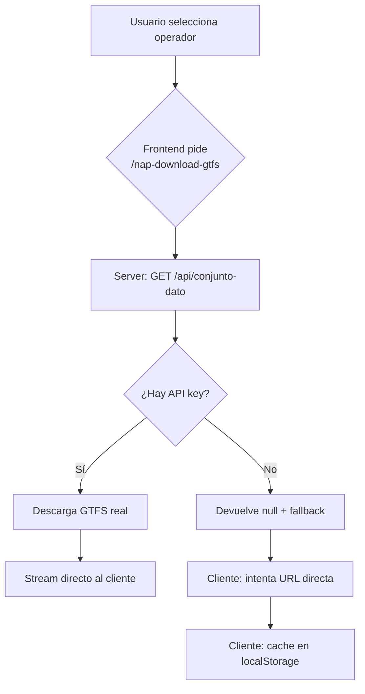

# Routing & Isocronas — Patrón de Herramienta

## Cuándo cargar esta skill

Cuando el usuario pida: isocronas, mapas de accesibilidad, cálculo de rutas, transporte público con horarios, planes de movilidad, "hasta dónde llego en X minutos", routing multi-modal, GTFS, NAP transportes.

## Concepto

Herramienta web que calcula isocronas y rutas de movilidad desde cualquier punto: coche, bicicleta, peatón y transporte público. Pones origen + destino + horario objetivo, obtienes un informe con isocronas y rutas de bus disponibles.

**Arquitectura clave:** Sistema de plugins para motores de routing intercambiables. Cada backend (ORS, OTP, NAP) implementa la misma interfaz.

---

## Patrones de UI (dos variantes)

### Variante A: Punto de interés (simple)
Cuando el usuario quiere "hasta dónde llego desde X" — un solo punto, no formulario de ruta:

```
┌─────────────────────────────────────────────┐
│  Header oscuro (título + subtítulo)          │
├──────────┬──────────────────────────────────┤
│ Sidebar  │  Mapa (CARTO light tiles)        │
│          │                                  │
│ Modo     │  [click en mapa → punto]         │
│ (4 btns) │                                  │
│          │                                  │
│ Tiempo   │                                  │
│ (slider) │                                  │
│          │                                  │
│ Dirección│                                  │
│ (input)  │                                  │
│          │                                  │
│ Calcular │                                  │
│          │                                  │
│ PDF      │                                  │
│          │                                  │
│ Resultados│                                │
│ (KPIs)   │                                  │
└──────────┴──────────────────────────────────┘
```

- **4 botones de modo:** coche 🚗, bici 🚲, andando 🚶, bus 🚌
- **Slider de tiempo:** 5-60 min con presets rápidos (10, 15, 30, 45, 60)
- **Input de dirección:** con debounce 800ms + click en mapa para poner punto
- **Sidebar limpia:** fondo blanco, bordes sutiles, sin gradientes
- **Mapa:** CARTO light tiles, Canvas renderer

### Variante B: Origen + Destino (completa)
Para planes de movilidad laboral con horarios GTFS:

```
Origen (casa) + Destino (oficina) + Horario → Isocronas + Rutas bus
```

---

## Diseño visual — Reglas críticas

**David odia el "look de IA" (dark, neón, glass, gradientes).**

Para herramientas de movilidad:
- ✅ **Header oscuro** (`#1a1a2e`) + **sidebar blanca** + **mapa CARTO light**
- ✅ **Botones con bordes sutiles**, colores por modo (azul=bici, naranja=coche, verde=andando, púrpura=bus)
- ✅ **Tipografía system font** (-apple-system, BlinkMacSystemFont, Segoe UI)
- ✅ **KPIs en grid 2x2** con fondo gris claro
- ❌ **NUNCA** gradientes Aurora, glassmorphism, efectos neón
- ❌ **NUNCA** fondo oscuro en la app completa
- ❌ **NUNCA** decoraciones innecesarias

**CSS base:** `background: #f8f9fa`, `color: #1a1a2e`, `font-family: -apple-system, BlinkMacSystemFont, 'Segoe UI', Roboto, sans-serif`

---

## Arquitectura de Plugins

```javascript
// js/plugins.js
const PLUGINS = {
    ors: ORSRouter,    // OpenRouteService (coche/bici/peatón)
    otp: OTPRouter,    // OpenTripPlanner (transit con transbordos)
    nap: GTFSNapRouter // NAP/GTFS España (horarios reales)
};

// Registrar nuevo plugin
registerPlugin('name', {
    resolve(origin, dest, mode) { ... },
    getIsochrones(point, time, mode) { ... }
});
```

**Para añadir un nuevo motor:**
1. Crear `js/routing-{name}.js`
2. Implementar `resolve()` y `getIsochrones()`
3. Registrar: `registerPlugin('name', router)`

### Interfaz IRouter

```javascript
class IRouter {
    // Calcular ruta entre origen y destino
    async resolve(origin, dest, mode) {
        // origin: {lat, lng, name}
        // dest: {lat, lng, name}
        // mode: 'car' | 'bike' | 'walk' | 'transit'
        // Returns: {distance, duration, geometry, steps, mode}
    }

    // Calcular isocrona desde un punto
    async getIsochrones(point, time, mode) {
        // point: {lat, lng}
        // time: segundos
        // Returns: {geojson, area, success}
        //   geojson: FeatureCollection (Polygon)
        //   area: km² (number)
        //   success: boolean
        //   error: string (solo si success=false)
    }
}
```

**⚠️ Shape consistente:** El return de `getIsochrones` debe tener SIEMPRE la misma forma. Si el backend real falla o no hay API key, devolver `{ geojson: simulatedData, area: estimatedArea, success: true }` en vez de tirar error.

---

## Stack tecnológico

| Componente | Tecnología | Justificación |
|---|---|---|
| Mapa | Leaflet (Canvas renderer) | Ligero, sin framework, ya probado |
| Isocronas | OpenRouteService API | Gratis, 3 modos, desnivel incluido |
| Routing TP | OpenTripPlanner | Transbordos reales, GTFS |
| Geocodificación | Nominatim (OSM) | Gratis, no requiere key |
| PDF | jsPDF + autoTable + html2canvas | Generación cliente con captura de mapa |
| CSS | Simple/clean (NO Aurora glass) | Header oscuro + sidebar blanca + CARTO light |
| JS | Vanilla ES modules | Sin bundler, un solo HTML |

---

## OpenRouteService (ORS) v2

**CRITICAL:** The v2 API changed from the v1 format shown in old docs. The correct endpoint and body format are below.

### Dos patrones de acceso a ORS

#### Patrón A: Server-side proxy (recomendado para apps privadas/produción)

**NO llamar a ORS directamente desde el navegador** si la API key es del servidor — se expondría. Usar proxy:

```javascript
// server.mjs — proxy endpoint
if (req.method === 'POST' && req.url.startsWith('/isochrone')) {
  const ORS_KEY = process.env.ORS_API_KEY;
  if (!ORS_KEY) {
    res.writeHead(400, { 'Content-Type': 'application/json' });
    res.end(JSON.stringify({ error: 'ORS_API_KEY no configurada', fallback: true }));
    return;
  }
  let body = '';
  req.on('data', chunk => body += chunk);
  req.on('end', () => {
    const { profile, locations, range } = JSON.parse(body);
    const bodyObj = { locations: [locations], range, range_type: 'time', attributes: ['area'] };
    // ⚠️ NO incluir 'interval' para rango único — ORS lo rechaza con 400
    if (range.length > 1) bodyObj.interval = range[0];
    const options = {
      hostname: 'api.openrouteservice.org',
      path: `/v2/isochrones/${profile}`,
      method: 'POST',
      headers: {
        'Authorization': ORS_KEY,
        'Content-Type': 'application/json; charset=utf-8',
        'Accept': 'application/json, application/geo+json'
      }
    };
    const proxyReq = https.request(options, (proxyRes) => {
      let data = '';
      proxyRes.on('data', chunk => data += chunk);
      proxyRes.on('end', () => { res.writeHead(proxyRes.statusCode, { 'Content-Type': 'application/json' }); res.end(data); });
    });
    proxyReq.on('error', (err) => { res.writeHead(502); res.end(JSON.stringify({ error: err.message, fallback: true })); });
    proxyReq.write(JSON.stringify(bodyObj));
    proxyReq.end();
  });
  return;
}
```

### Request body (correct v2 format)

```
POST https://api.openrouteservice.org/v2/isochrones/{profile}
Headers:
  Authorization: {api_key}
  Content-Type: application/json; charset=utf-8
  Accept: application/json, application/geo+json
Body: {
  "locations": [[lng, lat]],     // single pair, NOT [{lat, lng}]
  "range": [900],                // seconds (15 min)
  "range_type": "time",
  "attributes": ["area"]         // returns area in m²
  // DO NOT include "interval" for single-range (see quirk below)
}
```

### ⚠️ ORS v2 API quirks

1. **`interval` quirk (CRITICAL):** Adding `"interval": [900]` with a single-range request causes ORS to respond `400: Parameter 'interval' has incorrect value or format.` Never include `interval` for single-range requests. Only use it when auto-generating multiple ranges (e.g. range: [900], interval: 300).

2. **Error response format:** ORS returns errors as string or object. Parse defensively:
   ```javascript
   const errMsg = typeof errData.error === 'string' ? errData.error
     : errData.error?.message || errData.error?.error || resp.statusText;
   ```

3. **Rate limiting (429):** Free ORS tier ≈ 1 req/s. With 12 isochrones (4×3), parallel `Promise.all()` triggers 429. Solution: stagger sequentially with 300-1000ms delay between each request.

4. **"Access to this API has been disallowed" (403):** The key exists but lacks isochrone permissions. Some ORS keys work for routing (`/v2/directions`) but NOT for isochrones (`/v2/isochrones`). This is a permissions issue, not a format issue. **Diagnose:** call `/isochrone` from server and check healthz `ors_api` field. If `ors_api: false`, the key is invalid or lacks permissions. **Fix:** create a new key at openrouteservice.org (free tier includes isochrones if registered). Old keys from v1 era may not have isochrone scope.

5. **No transit profile in ORS** — Use `driving-car` as approximation for bus, metro, and tram. These are NOT accurate — they show road travel range, not transit network range. Label them clearly in the UI as "aproximación por carretera" and note that real transit data comes from GTFS/NAP.

6. **Area from ORS:** `features[0].properties.area` is in **m²**. Divide by 1,000,000 for km².

### Pattern: Async fallback con stagger

```javascript
const ORS_PROFILES = {\n  car: 'driving-car', bike: 'cycling-regular',\n  foot: 'foot-walking', bus: 'driving-car',\n  metro: 'driving-car', tram: 'driving-car'\n};

export async function calcularIsocronaAsync(lng, lat, modo, minutos) {
  try { // Intentar ORS real
    const resp = await fetch('/isochrone', {
      method: 'POST', headers: { 'Content-Type': 'application/json' },
      body: JSON.stringify({ profile: ORS_PROFILES[modo], locations: [lng, lat], range: [minutos * 60] }),
      signal: AbortSignal.timeout(15000)
    });
    if (!resp.ok) {
      const errData = await resp.json().catch(() => ({}));
      if (errData.fallback) throw new Error('ORS no disponible (sin key)');
      const errMsg = typeof errData.error === 'string' ? errData.error
        : errData.error?.message || errData.error?.error || resp.statusText;
      throw new Error(`ORS HTTP ${resp.status}: ${errMsg}`);
    }
    const data = await resp.json();
    const areaKm2 = (data.features?.[0]?.properties?.area || 0) / 1_000_000;
    return { geojson: data, areaKm2, real: true };
  } catch (err) {
    console.warn(`⚠️ ORS fallback ${modo} ${minutos}min: ${err.message}`);
  }
  return { ...calcularIsocronaSim(lng, lat, modo, minutos), real: false };
}

export async function calcularTodasAsync(punto, modos, tiempos) {
  const resultados = [];
  for (const modo of modos) {
    for (const min of tiempos) {
      const r = await calcularIsocronaAsync(punto.lng, punto.lat, modo, min).catch(
        e => ({ modo, minutos: min, geojson: null, areaKm2: 0, error: e.message, real: false })
      );
      resultados.push({ modo, minutos: min, ...r });
      await new Promise(r => setTimeout(r, 300)); // stagger
    }
  }
  return resultados;
}
```

### Health check con validación de key

```javascript
// server.mjs /healthz
res.end(JSON.stringify({
  status: 'ready', uptime: process.uptime(),
  checks: { ors_api: typeof ORS_KEY === 'string' && ORS_KEY.length > 20 }
}));
// ↑ Más robusto que !!ORS_KEY (detecta strings vacíos)
```

#### Patrón B: Client-side directo (para herramientas públicas con key del usuario)

**Cuándo usar:** Herramientas públicas tipo Pages donde el usuario provee su propia API key de ORS (free tier 2000 req/día). La key se almacena en `localStorage` del usuario, no en el código.

**Ventaja:** Sin servidor. Despliegue 100% estático (GitHub Pages, Netlify, etc.)
**Riesgo:** La key es visible en DevTools. Aceptable para keys free-tier de uso personal.

**ISOTime** (`github.com/Ntizar/ISOTime`) es un ejemplo funcional de este patrón:
- HTML único + ES modules, sin bundler
- ORS API v2 llamado directamente desde `fetch()` con `Authorization: key`
- Key en `localStorage` (modal de setup首次, luego se lee)
- Fallback simulado si no hay key (polígono con jitter)
- Export GeoJSON + SHP binario en-browser (JSZip)
- Tiles IGN WMTS (EPSG:3857) como alternativa a CARTO light

```javascript
// Patrón ISOTime: acceso directo ORS desde el navegador
async function calcularIsocrona(lng, lat, modo, minutos) {
  const apiKey = localStorage.getItem('ors_api_key');
  if (!apiKey) return calcularIsocronaSim(lng, lat, modo, minutos);

  const profile = { car: 'driving-car', walk: 'foot-walking', bike: 'cycling-regular' }[modo];
  const resp = await fetch(`https://api.openrouteservice.org/v2/isochrones/${profile}`, {
    method: 'POST',
    headers: {
      'Authorization': apiKey,
      'Content-Type': 'application/json; charset=utf-8'
    },
    body: JSON.stringify({
      locations: [[lng, lat]],
      range: [minutos * 60],
      range_type: 'time',
      attributes: ['area']
    })
  });

  if (!resp.ok) return calcularIsocronaSim(lng, lat, modo, minutos);
  const data = await resp.json();
  const areaKm2 = (data.features?.[0]?.properties?.area || 0) / 1_000_000;
  return { geojson: data, areaKm2, real: true };
}
```

**Ver:** `references/isotime-client-side-pattern.md` para arquitectura completa, estructura de archivos, y patrones de export.

### Simulación de isocronas (fallback)

Generar círculos irregulares con jitter cuando ORS no está disponible:

```javascript
function calcularIsocronaSim(lng, lat, modo, minutos) {
  const m = CONFIG.MODOS[modo];
  const radioM = (m.speedKmh / 3.6) * minutos * 60;
  const PTS = 48, coords = [];
  for (let i = 0; i <= PTS; i++) {
    const ang = (i / PTS) * 2 * Math.PI;
    const jitter = 1 - (0.12 * (Math.sin(i * 7.3) * 0.5 + 0.5));
    const r = radioM * jitter;
    const dLat = (r * Math.cos(ang)) / 111320;
    const dLng = (r * Math.sin(ang)) / (111320 * Math.cos(lat * Math.PI / 180));
    coords.push([lng + dLng, lat + dLat]);
  }
  return {
    geojson: { type: 'FeatureCollection', features: [{
      type: 'Feature', geometry: { type: 'Polygon', coordinates: [coords] },
      properties: { modo, minutos, simulado: true }
    }]},
    areaKm2: calcularAreaPoligonoKm2(coords, lat)
  };
}

function calcularAreaPoligonoKm2(coords, refLat) {
  let area = 0; const n = coords.length;
  for (let i = 0; i < n; i++) {
    const j = (i + 1) % n;
    area += coords[i][0] * coords[j][1] - coords[j][0] * coords[i][1];
  }
  const cosLat = Math.cos((refLat ?? coords.reduce((s, c) => s + c[1], 0) / n) * Math.PI / 180);
  return Math.abs(area) / 2 * (111.32 * 111.32 * cosLat);
}
```

### Patrón: Wrapper consistente getIsochrone()

**CRÍTICO:** La función `getIsochrone()` DEBE devolver SIEMPRE el mismo shape `{ geojson, area, success }`, tanto si usa la API real como el fallback simulado.

```javascript
// ❌ MAL: devuelve shapes diferentes según el camino
export async function getIsochrone(lng, lat, profile, rangeSeconds) {
  if (!API_KEY) return getSimulatedIsochrone(lng, lat, profile, rangeSeconds);
  // ... fetch ORS ...
  return { geojson: data, area, success: true };
}
// → `computeAllIsochrones` espera `.geojson` y `.area`, pero
//   simulated devuelve el GeoJSON raw → `.geojson` es undefined

// ✅ BIEN: siempre mismo shape
export async function getIsochrone(lng, lat, profile, rangeSeconds) {
  if (!API_KEY) {
    const geojson = getSimulatedIsochrone(lng, lat, profile, rangeSeconds);
    const coords = geojson.features[0].geometry.coordinates[0];
    const area = calculatePolygonAreaKm2(coords, lat);
    return { geojson, area, success: true };
  }
  // ... fetch ORS real ...
  return { geojson: data, area, success: true };
}
```

**Regla de oro:** cualquier wrapper de API externa debe envolver SIEMPRE la respuesta en un shape consistente, independientemente de si la llamada fue real, simulada, o en error.

### Config: evaluación perezosa (getter)

La key de ORS NO debe evaluarse al cargar el módulo, porque si el módulo ES se cachea en el navegador, la key queda congelada en el valor del primer load. Usar un getter:

```javascript
const CONFIG = {
  ORS: {
    get key() {  // ← getter, evaluado CADA VEZ que se accede
      if (typeof window !== 'undefined' && window.__ENV?.ORS_API_KEY) {
        return window.__ENV.ORS_API_KEY;
      }
      return '';
    }
  }
};
```

El servidor inyecta `window.__ENV = { ORS_API_KEY: "..." }` en el HTML antes del módulo. Con el getter, el valor se lee en tiempo de ejecución, no al cargar.

**Endpoint routing:**
```
GET https://api.openrouteservice.org/v2/directions/{o_lng},{o_lat};{d_lng},{d_lat}
Params: ?profile=driving-car
```

**API Key gratis:** https://openrouteservice.org/sign-up (2.000 req/día)

**Desnivel:** ORS ya lo considera internamente:
- `cycling-regular` penaliza subidas
- `cycling-mountain` penaliza más
- `foot-walking` considera pendiente

---

## OpenTripPlanner (OTP)

**Para routing con transbordos reales.**

**Endpoints:**
```
POST /otp/routers/default/plan          — routing general
POST /otp/routers/default/isochrone     — isocronas
POST /otp/routers/default/arriveby      — llegar a hora X
POST /otp/routers/default/departby      — salir a hora X
```

**Docker:**
```bash
docker run -d -p 8080:8080 \
  -v /path/to/config:/opt/otp/config \
  opentripplanner/otp:latest \
  --build
```

**Datos:** Descargar OSM extract de Overpass API + GTFS de cada ciudad.

---

## GTFS + NAP (Transporte Público España)

**NAP es un catálogo de datasets GTFS**, no un motor de routing.

### 📊 Volumen REAL de datos (verificado 2026-06-23)

**161 conjuntos de datos** (160 activos, 1 obsoleto). **0.65 GB total** (661.9 MB).

| Métrica | Valor |
|---|---|
| Conjuntos | 161 |
| Tamaño total | 0.65 GB |
| Viajes totales | 2,088,524 |
| Rutas totales | 24,252 |
| Paradas totales | 191,065 |
| Organizaciones | 122 |
| Actualización | Diaria (varios datasets se actualizan TODOS los días) |

**Distribución por tipo:**
- Autobús: 137 conjuntos
- Ferroviario: 28 conjuntos
- Marítimo: 3 conjuntos
- Aéreo: 1 conjunto

**Top 5 por tamaño:**
1. Xunta de Galicia → 136 MB (133K viajes, 6.5K rutas, 26K paradas)
2. CRTM Madrid interurbanos → 72 MB
3. Cataluña completa → 66 MB
4. Cataluña simplificada → 57 MB
5. Tenerife TITSA → 22 MB

**Distribución de tamaños:**
- 102 datasets < 1 MB
- 35 datasets entre 1-5 MB
- 10 datasets entre 5-10 MB
- 10 datasets entre 10-50 MB
- 3 datasets entre 50-100 MB
- 1 dataset > 100 MB

**Actualización diaria:** Algunos datasets se actualizan TODOS los días:
- Cataluña completa: 426 versiones en ~1 año (~1.2/día)
- Tenerife TITSA: 854 versiones (~2.3/día)
- Comunidad Valenciana interurbano: 1,540 versiones (~4.2/día)

**Históricos:** Media de 743 versiones por dataset (pero muchas son duplicados). Si se guardan las 3 últimas versiones por dataset: ~2-3 GB adicionales.

**Estrategia recomendada:** Full dump inicial ~0.7 GB + delta semanal ~100-500 MB + históricos recientes ~2 GB = **~3-4 GB total estable**.

### 📋 Top 10 datasets por tamaño (IDs reales)

| Dataset | Tamaño | ID | Viajes | Rutas | Paradas |
|---|---|---|---|---|---|
| Xunta de Galicia | 136.4 MB | 1386 | 133,153 | 6,584 | 26,004 |
| CRTM Madrid interurbanos | 72.2 MB | 1160 | 55,219 | 354 | 8,402 |
| Cataluña completa | 66.1 MB | 1536 | 210,708 | 2,092 | 29,050 |
| Cataluña simplificada | 56.6 MB | 1535 | 194,727 | 1,605 | 23,246 |
| Cataluña interurbano | 21.9 MB | 1163 | 26,148 | 939 | 8,942 |
| Tenerife TITSA | 21.5 MB | 1130 | 72,653 | 178 | 3,815 |
| Bizkaibus | 20.8 MB | 1061 | 38,042 | 93 | 2,335 |
| CRTM Madrid urbano | 20.0 MB | 934 | 87,005 | 236 | 4,911 |
| Comunidad Valenciana | 17.4 MB | 1325 | 10,646 | 381 | 5,225 |
| EMT Madrid | 16.1 MB | 896 | 81,798 | 236 | 4,924 |

### Flujo completo

```
1. Listar conjuntos GTFS → GET /api/v2/conjunto-dato?regionId=X
2. Filtrar por tipo → solo "Autobús urbano"
3. Descargar fichero GTFS → GET /api/v2/fichero/{id}/descarga
4. Parsear GTFS localmente en JS
5. Calcular paradas cercanas a origen y destino
6. Calcular rutas que conecten ambas zonas
7. Filtrar por horario objetivo (7:30-9:30 / 16:30-18:30)
8. Mostrar resultados
```

### Motor de horarios laborales

```javascript
// Filtrar por horario de llegada al trabajo (7:30-9:30)
const morningArrivals = stopTimes.filter(st => {
    const time = parseTime(st.arrival_time); // "07:45:00" → 7.75 horas
    return time >= 7.5 && time <= 9.5;
});

// Filtrar por horario de salida del trabajo (16:30-18:30)
const eveningDepartures = stopTimes.filter(st => {
    const time = parseTime(st.departure_time);
    return time >= 16.5 && time <= 18.5;
});
```

### Archivos GTFS necesarios

| Archivo | Qué contiene | Uso |
|---|---|---|
| `stops.txt` | Paradas (id, lat, lon, nombre) | Calcular paradas cercanas |
| `routes.txt` | Rutas (id, short_name, agency, type) | Filtrar por tipo |
| `trips.txt` | Viajes (route_id, trip_id, direction_id) | Ida vs vuelta |
| `stop_times.txt` | Horarios por parada | **El más importante** |
| `calendar.txt` | Fechas de servicio | Días laborables |

### Limitación importante

**GTFS no es routing real.** Dice "el bus X llega a la parada Y a las 7:45", pero no calcula transbordos. Para routing real con transbordos se necesita **OpenTripPlanner** o **Valhalla con GTFS**.

### 📦 Repositorio GTFSSpain — Datos offline completos

**Patrón para tener TODO el transporte público español en local:**

- **Repo privado:** `github.com/Ntizar/GTFSSpain`
- **Estructura:** `data/` (GTFS ZIPs, gitignored) + `metadata/` (JSON ligero, en git) + `descargar-nap.py` (script)
- **Tamaño:** ~0.65 GB GTFS actuales + ~3 GB con históricos
- **Actualización:** cron semanal vía Hermes cron job (domingo 06:00 UTC, delta mode)

**Script de descarga:** `descargar-nap.py` en el repo
- `python3 descargar-nap.py` — full dump
- `python3 descargar-nap.py --delta` — solo actualizados (últimas 24h)
- `python3 descargar-nap.py --dry-run` — preview sin descargar

**Patrón de descarga NAP (API v2):**
1. `GET /api/v2/conjunto-dato` → lista TODOS los conjuntos (161 datasets, ~9 MB response)
2. Para cada conjunto: `GET /api/v2/conjunto-dato/{id}` → metadatos + ficheros
3. Para cada fichero GTFS: `GET /api/v2/fichero/{id}/descarga` → JSON con `enlaceDescarga` (S3 temporal 900s)
4. `GET {enlaceDescarga}` → descarga el ZIP real

**Importante:** Solo descargar ficheros con `nombreTipoFichero` conteniendo "GTFS" (filtrar GTFS-ZIP). Los tipos RT, NetEx, SIRI son datos en tiempo real, no ZIPs descargables.

**Los enlaces S3 caducan en 900 segundos (15 min).** Hay que descargar rápido.

**Estructura local de datos:**
```
data/
  00896_Autobus_urbano_de_Madrid/
    metadata.json          # metadatos del conjunto
    2060_GTFS-ZIP.zip      # fichero GTFS
  01386_Autobuses_Xunta_Galicia/
    metadata.json
    2083_GTFS-ZIP.zip
  ...
```

**Cron job:** `gtfsspain-update` — ejecuta `descargar-nap.py --delta` cada domingo 06:00 UTC.

### NAP API — GTFS auto-download (server-side)

Cuando la app necesita GTFS de operadores de transporte público españoles, **no se puede cargar el GTFS desde el frontend directamente** porque:

1. El frontend no tiene API key de NAP (transportes.gob.es)
2. Los archivos GTFS pueden ser 50-200MB (el navegador no puede cargarlos vía fetch directo)
3. CORS del NAP no permite acceso desde dominios de apps

**Solución:** Servidor proxy con tres endpoints:

| Endpoint | Función | Llamada desde |
|---|---|---|
| `/nap-download-gtfs` | NAP API: lista datasets → encuentra GTFS → descarga | Frontend (JS) |
| `/gtfs-download-proxy` | Proxy directo: descarga un GTFS por URL | Frontend (JS) |
| `/nap-datasets` | Proxy informativo: lista todos los conjuntos GTFS de un operador | Frontend (JS) |

**Flujo completo:**



**Código server.mjs:**

```javascript
// Endpoint 1: NAP proxy con 2 pasos
if (req.url.startsWith('/nap-download-gtfs')) {
  const parts = req.url.split('?');
  const params = new URLSearchParams(parts[1]);
  const datasetId = params.get('datasetId');
  
  // Paso 1: Obtener info del dataset
  const datasetURL = `${NAP_BASE_URL}/api/v2/conjunto-dato/${datasetId}`;
  const resp1 = await fetch(datasetURL, { headers: { 'ApiKey': NAP_KEY } });
  const datasetInfo = await resp1.json();
  
  // Buscar el fichero GTFS dentro del dataset
  const gtfsFile = datasetInfo.ficheros?.find(f => 
    f.tipo === 'GTFS' || f.nombre?.endsWith('.zip')
  );
  
  if (!gtfsFile) return { error: 'No GTFS file found' };
  
  // Paso 2: Descargar el fichero GTFS
  const downloadURL = `${NAP_BASE_URL}/api/v2/fichero/${gtfsFile.id}/descarga`;
  const resp2 = await fetch(downloadURL, { 
    headers: { 'ApiKey': NAP_KEY } 
  });
  
  // Stream al cliente
  const arrayBuffer = await resp2.arrayBuffer();
  res.writeHead(200, {
    'Content-Type': 'application/zip',
    'Content-Length': arrayBuffer.byteLength
  });
  res.end(Buffer.from(arrayBuffer));
}
```

**Fallback para cuando no hay NAP key:** 
- Probar 3 fuentes: cache → NAP proxy → URL directa → localStorage
- Si ninguna funciona, mostrar mensaje "Sube tu GTFS manualmente" con botón de upload

### NAP operadores de Madrid (IDs reales)

| Operador | NAP dataset ID | Líneas | GTFS |
|---|---|---|---|
| EMT Madrid | 2111 | 217 | ✅ Auto |
| Metro Madrid | 2113 | 13 | ✅ Auto |
| Renfe Cercanías | 1738 | 9 | ✅ Auto |
| CRTM | 286 | 400 | ✅ Auto |

---

## Estructura del proyecto (moderna)

```
project/
├── index.html          # HTML único (frontend)
├── css/
│   └── style.css       # Estilos específicos
├── js/
│   ├── config.js       # Configuración centralizada (velocidades, colores, modos, tiempos, opacidad)
│   ├── utils.js        # geocode(), reverseGeocode(), formatNum(), formatKm2(), debounce
│   ├── map.js          # Leaflet Canvas + marcadores + renderizado isocronas + capturarMapa() para PDF
│   ├── isochrones.js   # Motor async: ORS real con fallback simulación (stagger 300ms)
│   ├── pdf.js          # PDF con jsPDF + autoTable + html2canvas (captura de mapa)
│   ├── shp.js          # Descarga SIG: GeoJSON, CSV, SHP (.shp+.shx+.dbf+.prj empaquetados en ZIP)
│   ├── nap.js          # Catálogo de transporte público: operadores por ciudad detectada
│   ├── clip.js         # Sea clipping: detección de ciudades costeras + preparación para recorte
│   └── main.js         # Orquestador: geocode → isocronas → render → PDF → descargas
├── server.mjs          # Servidor estático + proxy Nominatim + proxy ORS
├── PLAN.md
└── README.md
```

**vs. la versión antigua** (plugin-based con `ors.js`, `gtfs.js`, `plugins.js` separados):
La arquitectura moderna unifica ORS + GTFS en un solo `isochrones.js` con async/await y fallback automático. El sistema de plugins se reemplazó por un patrón de try/catch por request: cada isócrona intenta ORS real, y si falla, usa simulación local. Esto es más simple y robusto que la interfaz IRouter.

---

## Geocodificación Nominatim

```javascript
// Geocodificación directa
const resp = await fetch(
    `${NOMINATIM.baseUrl}/search?format=json&q=${encodeURIComponent(query)}&limit=1`,
    { headers: { 'User-Agent': 'Time/2.0' } }
);

// Geocodificación inversa
const resp = await fetch(
    `${NOMINATIM.baseUrl}/reverse?format=json&lat=${lat}&lon=${lon}`,
    { headers: { 'User-Agent': 'Time/2.0' } }
);
```

**Rate limit:** 1 request/segundo. Usar debounce en inputs.

---

## Pitfalls

1. **GTFS no es routing** — solo horarios. Para transbordos reales necesitas OTP o Valhalla con GTFS
2. **NAP solo España** — para otros países necesitas GTFS directo de cada operador o Transitland API
3. **Nominatim rate limit** — 1 req/segundo. Siempre debounce los inputs
4. **ORS API key en frontend** — visible para el usuario. Para producción, usar proxy backend
5. **Leaflet Canvas + interactividad** — eventos de mouse son por bounding box, no por forma exacta. Para polígonos pequeños, usar `tolerance` en `L.canvas({tolerance: 5})`
6. **GTFS stop_times.txt es el archivo más grande** — puede ser 100MB+. Parsear con streaming o filtrar por ruta antes de cargar
7. **ORS wrapper: shape consistente** — `getIsochrone()` debe devolver SIEMPRE `{geojson, area, success}`. Si el fallback simulado devuelve raw GeoJSON (sin wrapper), el consumidor recibe `undefined.geojson` y las isocronas no se renderizan. Ver sección ORS > Patrón de wrapper.
8. **Nominatim geocoding devuelve `lon`, no `lng`** — Nomination usa `lon` para longitud. Si en tu código desestructuras como `{lng}` obtendrás `undefined`. La forma correcta es devolver `lng: parseFloat(data[0].lon)` en el wrapper de geocoding. Este es un gotcha recurrente con OSM/Nominatim.
9. **Config: no evaluar env vars al cargar módulo** — ES modules se cachean por URL en el navegador. Si `CONFIG.ORS.key` se evalúa al cargar el módulo, ese valor queda congelado aunque el servidor inyecte un `window.__ENV` diferente en el HTML. Usar getter para evaluación perezosa (ver sección ORS > Config).
10. **Cache de ES modules en desarrollo** — Los ES modules importados estáticamente se cachean en el navegador POR URL. Cambiar el contenido del archivo en el servidor NO fuerza recarga si la URL es la misma. Soluciones:
    - Añadir `?v=N` a todos los imports: `import { x } from './modulo.js?v=2'` (cascade: el HTML carga `main.js?v=2`, que a su vez importa `./map.js?v=2`, etc.)
    - Configurar el servidor con `Cache-Control: no-cache, no-store, must-revalidate` para JS (no es suficiente solo: el cache ES module es distinto del HTTP cache)
    - Navegar a un dominio COMPLETAMENTE diferente (https://example.com) entre pruebas. `about:blank` no limpia el módulo cache
11. **ORS simulado para desarrollo** — si no hay API key, generar círculos simples como fallback. No confundir con datos reales
12. **ORS `interval` quirk** — NUNCA incluir `interval` en el body cuando se solicita un solo rango. ORS v2 lo rechaza con 400 aunque el valor sea correcto. `interval` solo se usa para generar múltiples rangos automáticamente (ej. range:[900], interval:300 genera isocronas a 300, 600 y 900s)
13. **Stagger sequential > Promise.all** — Con 12 isocronas (4×3), lanzar todas en paralelo con `Promise.all()` provoca 429 Rate Limit en el free tier de ORS (~1 req/s). Usar bucle secuencial con `await delay(300-1000ms)` entre cada request. Aunque tarda más (~3.6s con 300ms stagger), evita los fallos por rate limit
14. **NaN deploy: health check with ORS key validation** — `!!process.env.ORS_API_KEY` devuelve `true` incluso para strings vacíos. Usar `typeof key === 'string' && key.length > 20`. NaN tarda 1-5 min en detectar cambios de GitHub y redeployar. El uptime en healthz confirma si se redeployó
15. **Cache-buster de ES modules** — El script `<script>document.querySelectorAll('script[src*="main.js"]')...</script>` NO funciona para cache-busting porque se ejecuta ANTES de que el `<script type="module">` exista en el DOM. Solución: hardcodear `?v=N` directamente en el src del módulo en el HTML
16. **SHP generation in browser** — No hay librería CDN que genere .shp directamente. Construir el binario manualmente: file header (100B big-endian), record (8B header + Polygon=5 content). Empaquetar .shp+.shx+.dbf+.prj en ZIP via JSZip. Ver session-2026-06-19.md para el patrón completo.
17. **html2canvas for Leaflet map capture** — Las tiles deben permitir CORS (CARTO light_all sí). Usar `useCORS: true, scale: 2` en las opciones. El contenedor del mapa debe estar visible en el viewport antes de capturar.
18. **NAP city detection** — `detectarCiudad()` usa `string.includes()` sobre el `display_name` de Nominatim. Las direcciones largas o con nombres compuestos pueden fallar. Extender el catálogo manualmente para nuevas ciudades.
20. **ES Module import mismatch = failure silencioso** — Si un `import { nombre }` NO coincide exactamente (case-sensitive) con la exportación del módulo destino, ES module falla **sin ningún mensaje de error visible**. No aparece en `window.onerror`, no hay stack trace, no hay 404. El síntoma es que la página carga pero nada funciona — el módulo principal nunca se ejecuta. Debug: verificar cada import contra su export real. Ver `systematic-debugging` → `references/es-module-silent-failure.md`.

   **Caso real:** Llamar a `DEMO.cargarGTFS()` desde `main.js` cuando `demographics.js` solo exporta `cargarDatos()`. El módulo `demographics.js` se carga pero su ejecución se aborta silenciosamente porque `cargarGTFS` no existe. El resto de imports que dependen de `main.js` nunca se ejecutan. Síntoma: página en blanco sin errores en consola. Solución: revisar cada import vs su export, y usar `console.log('module loaded')` al inicio de cada módulo para saber cuáles se ejecutan.

21. **DOCX UMD library: usar `window.docx`, no `import('docx')`** — Cuando se carga la librería `docx` mediante `<script src="docx.umd.js">`, se inyecta como global `window.docx`. NO se puede usar `await import('docx')` porque:
   - El UMD wrapper detecta que ya está en un entorno de módulos (ES modules) y se registra a sí mismo como `define('docx', ...)` en lugar de como global
   - `import('docx')` resuelve a una **copia vacía** del módulo — las funciones existen pero son stubs que no hacen nada
   - El resultado: `generate({...})` se ejecuta sin errores pero no produce documento, y `save()` no descarga nada
   - **Solución:** Siempre usar `window.docx` para acceder a la librería UMD: `const { Document, Packer, Paragraph } = window.docx;`
   - **Para nuevas librerías:** Verificar si vía CDN es UMD (global) o ESM. Si es UMD, usar `window.LibName`. Si es ESM (`type="module"`), usar `import`.

22. **Git branch naming (GitHub vs local):** Cuando creas un repo GitHub con `curl -X POST /user/repos`, GitHub usa `main` como default branch. Pero `git init` crea `master`. Si haces push a `main` y falla con "refspec main does not match any", es que el repo remoto tiene `main` pero tu local tiene `master`. Solución: `git push origin master` en vez de `git push origin main`.

23. **Private repo + CDN = 404:** jsDelivr, unpkg, y otros CDN públicos NO sirven archivos de repositorios privados de GitHub. Si tu CSS/JS está en un repo privado y lo referencias vía `cdn.jsdelivr.net/gh/owner/repo@branch/file`, obtendrás 404 silencioso. **Solución:** copiar el archivo al proyecto local (ej. `css/kaizen.css`) y servirlo desde el mismo servidor.

24. **Kaizen sidebar `position:fixed` rompe el layout del mapa:** El Kaizen Design System usa `.kz-sidebar { position: fixed }` que saca el sidebar del flow normal. Si el mapa usa `width: 100%` o CSS Grid, se solapa con el sidebar o se corta. **Solución:** el mapa también debe ser `position: fixed` con `left: var(--kz-sidebar-width); right: 0; top: 0; bottom: 0;`. NO usar CSS Grid ni `margin-left` — ambos causan doble compensación. En mobile (<768px): sidebar como bottom-sheet (`position: fixed; bottom: 0`), mapa `left: 0`.

25. **GTFS compact cache: auto-load sin JSZip:** En vez de parsear ZIPs GTFS en el navegador con JSZip (lento, RAM-intensive), pre-procesar los GTFS en JSON compacto (`{stops, routes, route_trip_counts, stop_trip_map}`) y servirlos desde el servidor. Auto-cargar al detectar la ciudad. Ventajas: ~150-350KB por ciudad (vs 50-200MB ZIP), carga instantánea, sin dependencia JSZip. Endpoint: `GET /gtfs-cache/:city`. Ver `references/gtfs-compact-cache.md`.

26. **Subagentes en paralelo + archivos compartidos = duplicación silenciosa:** Cuando se delegan 3 tareas en paralelo y dos subagentes modifican el mismo archivo (ej: `nap.js`), ambos pueden añadir la misma función (`renderSeccionParadas`), resultando en declaración duplicada. El error de sintaxis es invisible en `node --check` (válido en módulos independientes) pero rompe la app en el navegador (`Identifier 'x' has already been declared`). **Debug:** `import('/js/main.js').catch(e => e.message)` en la consola del navegador. **Prevención:** Si dos subagentes necesitan modificar el mismo archivo, hacerlos en serie o dar a cada uno una sección/clase distinta del archivo.
27. **Convex hull produce círculos de mierda para isócronas** — David lo probó y corrigió: "Hace cálculos de mierda… solo hace un círculo roro alrededor". El convex hull conecta los puntos más exteriores alcanzables, pero ignora la forma real de la isócrona. **Solución:** usar boundary detection por dirección (72 direcciones × 8 radios, interpolación lineal entre último alcanzable y primero que excede). Ver sección "Isochrone Boundary Detection".
28. **GitHub Pages ES module cache — hard refresh NO basta** — Después de push a GitHub Pages, el browser puede seguir sirviendo JS antiguo aunque hagas hard refresh. Causa: ES modules se cachean POR URL, separado del HTTP cache. **Solución completa:** (1) Añadir `?v=N` al `<script src="js/main.js?v=N">` en el HTML, (2) Navegar a `index.html?t=hash` (no solo `/`), (3) Para testing, cambiar a dominio completamente diferente entre pruebas. `?v=N` en el HTML NO propaga a los imports estáticos del módulo — cada `import`也需要 su propio `?v=N`.

---

## GTFS Transit Routing — Motor de Rutas con Transbordo (absorbido de `gtfs-transit-routing`)

### Concepto
Motor de routing que usa datos GTFS reales (`stop_times.txt`, `trips.txt`, `calendar.txt`) para calcular rutas con transbordos (0, 1 o 2), horarios reales y ranking por tiempo total.

### Arquitectura
```
origen + destino + horario → findStopsNear() → buildTransitGraph() → BFS(maxTransfers=2) → filterBySchedule() → rank()
```

### Algoritmo BFS con transbordos
```javascript
function bfsWithTransfers(startStop, endStop, maxTransfers, adjacency, tripStops, tripInfo) {
  // BFS con estado: {stop_id, transfers, current_route, arrival_time, path}
  // newTransfers = current_route && edge.route_id !== current_route ? transfers+1 : transfers
  // visited map para evitar ciclos
}
```

### Filtrado por horario laboral
```javascript
function filterBySchedule(routes, horarioObjetivo) {
  // morningWindow: 7:30-9:30, eveningWindow: 16:30-18:30
}
```

### Ranking
Por tiempo, transbordos, o directa (prefiere sin transbordo).

### Pitfalls de GTFS routing
- **GTFS sin stop_times:** El grafo transit no se puede construir. Fallback a BFS simple.
- **Cruce de medianoche:** `(to - from + 86400) % 86400`
- **Performance:** BFS explota combinatoriamente. Limitar `maxTransfers=2` y usar `visited` map.
- **Paradas de transbordo:** Dos paradas físicamente cercanas pero con IDs distintos. Considerar <100m como conectables.
- **Direccionalidad:** `trips.direction_id` puede ser 0 o 1. Verificar dirección deseada.
- **GTFS no es routing:** Solo horarios. Para transbordos reales necesitas OTP o Valhalla con GTFS.

---

## Visor HTML con JSZip — GTFS en el navegador

**Patrón para construir un visor de transporte público que funcione 100% en el navegador** sin servidor, parseando ZIPs GTFS locales con JSZip.

### Cuándo usarlo
Cuando necesitas buscar paradas cercanas, rutas y horarios de transporte público sin depender de una API externa. Ideal para estudios de movilidad, análisis de cobertura, o como componente de una app más grande.

### Arquitectura

```
HTML único + JSZip (CDN) + Vanilla JS
  ↓
1. Usuario arrastra ZIPs GTFS (o selecciona)
2. JSZip parsea cada ZIP en memoria
3. Lee stops.txt, routes.txt, trips.txt, stop_times.txt
4. Busca paradas cercanas a coordenadas (Haversine)
5. Muestra paradas + rutas + empresas
```

### Implementación mínima

```javascript
// Cargar JSZip desde CDN
// <script src="https://cdnjs.cloudflare.com/ajax/libs/jszip/3.10.1/jszip.min.js"></script>

async function handleFiles(files) {
    for (const file of files) {
        const zip = await JSZip.loadAsync(file);
        await processGTFS(zip, file.name);
    }
}

async function processGTFS(zip, zipName) {
    const stopsFile = zip.file('stops.txt');
    if (!stopsFile) return;
    const stopsText = await stopsFile.async('string');
    const stops = parseCSV(stopsText);
    stops.forEach(stop => {
        const lat = parseFloat(stop.stop_lat);
        const lon = parseFloat(stop.stop_lon);
        if (isNaN(lat) || isNaN(lon)) return;
        allStops.push({
            id: stop.stop_id,
            name: stop.stop_name || stop.stop_id,
            lat, lon,
            routes: [],
            agency: zipName.replace('.zip', '')
        });
    });
}

// Distancia Haversine (metros)
function haversine(lat1, lon1, lat2, lon2) {
    const R = 6371000;
    const dLat = (lat2 - lat1) * Math.PI / 180;
    const dLon = (lon2 - lon1) * Math.PI / 180;
    const a = Math.sin(dLat/2)**2 + Math.cos(lat1*Math.PI/180) * Math.cos(lat2*Math.PI/180) * Math.sin(dLon/2)**2;
    return R * 2 * Math.atan2(Math.sqrt(a), Math.sqrt(1-a));
}
```

### Limitaciones importantes

1. **Memoria del navegador:** Cada ZIP de 100 MB puede consumir 500 MB+ de RAM del navegador. No cargar todos los ZIPs de golpe.
2. **Solo archivos estáticos:** GTFS RT (tiempo real), NetEx, SIRI no son ZIPs descargables. Solo procesar `nombreTipoFichero` que contenga "GTFS".
3. **Archivos procesados:** Solo `stops.txt`, `routes.txt`, `trips.txt`, `stop_times.txt`, `agencies.txt`. `calendar.txt` y `calendar_dates.txt` no se procesan en la versión base.
4. **No es routing real:** Solo muestra paradas cercanas y rutas. No calcula transbordos ni rutas óptimas. Para eso se necesita OTP o Valhalla con GTFS.

### Pitfalls del visor HTML

1. **JSZip no es stream:** Carga TODO el ZIP en memoria. ZIPs de 100+ MB pueden colgar el navegador.
2. **CSV parsing manual:** Los archivos GTFS tienen comillas, delimitadores variados, caracteres especiales. Implementar parser robusto con manejo de comillas dobles (`""` → `"`).
3. **Coordenadas GPS:** `navigator.geolocation` requiere HTTPS. En localhost funciona, pero en GitHub Pages necesita HTTPS.
4. **No hay servidor:** Los ZIPs se seleccionan manualmente por el usuario. No se pueden servir desde un CDN directamente de forma fiable.
5. **Performance con 100+ ZIPs:** Parsear 100 ZIPs puede tardar varios minutos. Mostrar progreso al usuario.

---

## GBFS — Bicicletas Compartidas (NUEVO 2026-06-23)

**GBFS (General Bikeshare Feed Specification)** es el estándar NTC para datos de bicis compartidas. Mucho más simple que GTFS: JSON directo, kilobytes en vez de megabytes, sin ZIPs, sin JSZip.

### Cuándo usar GBFS
Cuando necesites visualizar sistemas de bicicletas compartidas: disponibilidad en tiempo real, estaciones, geocercado, tipos de vehículo.

### Arquitectura GBFS vs GTFS

| | GTFS | GBFS |
|---|---|---|
| Formato | CSVs en ZIP | JSON REST API |
| Tamaño | 50-200 MB | 200-500 KB |
| Parsing | CSV manual + JSZip | JSON nativo |
| Archivos | 6-10 CSVs | 6-10 JSONs |
| Actualización | Semanal/diaria | Cada 30s |

### Endpoints GBFS estándar

```
gbfs.json                  → discovery (lista de feeds disponibles)
station_information.json   → estaciones (lat, lon, nombre, capacidad)
station_status.json        → estado en tiempo real (bikes/spaces disponibles)
vehicle_types.json         → tipos de vehículo (estándar, eléctrica, carga)
geofencing_zones.json      → zonas de geocercado
system_information.json    → info del sistema (nombre, operador, licencia)
system_regions.json        → regiones
system_pricing_plans.json  → precios
gbfs_versions.json         → versiones soportadas
```

### Catálogo España: 68 sistemas GBFS (ver `references/gbfs-spain-catalog.md`)

**Fuente:** `raw.githubusercontent.com/MobilityData/gbfs/master/systems.csv`

**Resumen:** 68 sistemas en España, TODOS públicos sin autenticación.
- **Public Bike System (JCDecaux):** 8 sistemas v3.0 — BiciMAD, Bicing BCN, Sevici, Valenbisi, Dbizi, Bizi Zaragoza, Bicicoruña, Bilbao Bizi, Valladolid, Ganxeta Reus, BicinRivas
- **Nextbike:** 14 sistemas v2.3 — AMBici, bizkaibizi, BiciPalma, moxsi, TUeBICI, nextbike León, BiciLOG, BBK Klimabizi, bibo Boadilla...
- **Cyclocity:** 2 sistemas v3.0 — Sevici, Valenbisi
- **Bird:** 7 sistemas v2.3 — Bird Madrid, Bird Barcelona, Bird Gijón, Bird Murcia...
- **Dott:** 9 sistemas v2.3 — Dott Murcia, Dott Tenerife, Dott Ibiza, Dott Tarragona...
- **Getaround:** 25 sistemas v3.0 — Madrid, Barcelona, Valencia, Sevilla, Granada, Alicante, Badalona, Getafe, Fuenlabrada, Alcobendas, Majadahonda, Parla, Coslada, Aranjuez, Granollers, Sabadell, Viladecans, Castelldefels, Benidorm, Torremolinos, Torrent, Paterna, Valdemoro, Candelaria, Mao
- **Donkey Republic:** 1 sistema v3.0 — Donkey Barcelona
- **Cooltra:** 1 sistema v3.0 — Cooltra Barcelona (scooters)
- **Ganxeta:** 1 sistema v3.0 — Ganxeta Reus

**38 de los 68 son v3.0** (última versión del estándar).

**Catálogo completo en:** `references/gbfs-spain-catalog.md`
**Datos estructurados en:** `github.com/Ntizar/GBFSSpain/data/systems.json` (JSON parseable)

### Parser GBFS v3.0 — Guía completa de parsing (NUEVO 2026-06-23)

**CRÍTICO:** GBFS v3.0 tiene una estructura de anidamiento DIFERENTE a v2.3. Ver `references/gbfs-v3-parsing.md` para guía completa con ejemplos.

**Resumen de diferencias clave:**
- Discovery: `data.feeds[].url` (no `feeds[].file`)
- Feeds individuales: `data.data.stations` (doble anidamiento, no `data.stations`)
- Campo bicis: `num_vehicles_available` (no `num_bikes_available`)

**Patrón de parsing universal (v2.3 + v3.0):**
```javascript
// Discovery
const feeds = response.data?.feeds || [];
// Feed individual
const stations = response.data?.data?.stations || response.data?.stations || [];
// Bikes
const bikes = station.num_vehicles_available ?? station.num_bikes_available ?? 0;
```

### Parser GBFS mínimo

```javascript
// Cargar discovery
const gbfs = await fetch('https://madrid.publicbikesystem.net/customer/gbfs/v3.0/gbfs.json').then(r => r.json());
// → { version: '3.0', data: { feeds: [{ name: 'station_information', url: '...' }, ...] } }

// Cargar estaciones
const stations = await fetch(gbfs.data.feeds.find(f => f.name === 'station_information').url).then(r => r.json());
// → { data: { stations: [{ station_id, name, lat, lon, capacity, num_bikes_available, num_docks_available, ... }] } }

// Cargar estado en tiempo real
const status = await fetch(gbfs.data.feeds.find(f => f.name === 'station_status').url).then(r => r.json());
// → { data: { stations: [{ station_id, num_bikes_available, num_docks_available, status }] } }
```

### Colores por disponibilidad

```javascript
function getStationColor(station) {
    const bikes = station.num_bikes_available || 0;
    const capacity = station.capacity || station.num_docks_available || 1;
    const ratio = bikes / capacity;
    if (ratio > 0.3) return '#16a34a';    // 🟢 Verde: tiene bicis
    if (ratio > 0) return '#f59e0b';      // 🟡 Amarillo: pocas bicis
    return '#dc2626';                      // 🔴 Rojo: sin bicis
}
```

### Geocercado (geofencing)

Los feeds GBFS incluyen zonas de geocercado:
- **Station Parking:** zonas donde debes aparcar
- **Transit Only:** solo para transporte público
- **Speed Limited:** zonas de velocidad reducida
- **No Ride Zone:** zonas prohibidas
- **Standard Zone:** zona normal

```javascript
// Cargar zonas de geocercado
const zones = await fetch(gbfs.data.feeds.find(f => f.name === 'geofencing_zones').url).then(r => r.json());
// → { data: { zones: [{ id, name, color, shape: { type: 'Polygon', coordinates: [...] } }, ...] } }
```

### Pitfalls GBFS

1. **Algunos feeds están inactivos** — Los datos pueden estar vacíos aunque el endpoint exista. No todos los sistemas actualizan sus feeds constantemente.
2. **URLs relativas** — Las URLs en gbfs.json pueden ser relativas al discovery URL. Usar `new URL(feed.url, discoveryUrl)` para resolver.
3. **Rate limiting** — Los feeds se actualizan cada 30s. No hacer polling más frecuente.
4. **CORS** — La mayoría de feeds GBFS permiten CORS, pero algunos (Bird, Dott) pueden necesitar proxy.
5. **Nextbike usa v2.3** — Los sistemas Nextbike en España usan GBFS v2.3, no v3.0. La estructura es similar pero con diferencias menores.
6. **Campo `capacity` vs `num_docks_available`** — Algunos feeds usan `capacity` en station_information, otros usan `num_docks_available`. Normalizar ambos.
7. **station_status vs station_information** — station_status tiene datos en tiempo real (bikes/spaces actuales), station_information tiene datos estáticos (capacidad, ubicación). Combinar ambos para info completa.
8. **GBFS v3.0 DOBLE anidamiento** — Los feeds individuales de v3.0 tienen `data.data.stations` (no `data.stations`). El discovery tiene `data.feeds` (no `feeds`). Ver `references/gbfs-v3-parsing.md` para guía completa.
9. **GBFS v3.0 campo genérico** — v3.0 usa `num_vehicles_available` en vez de `num_bikes_available`. El parser debe fallback: `station.num_vehicles_available ?? station.num_bikes_available ?? 0`.
10. **GBFS v3.0 feed URLs** — v3.0 usa `feed.url` (no `feed.file`). Resolver URLs relativas con `new URL(feed.url, discoveryUrl)`.
11. **GBFS v3.0 `name` es array de objetos** — En station_information, el campo `name` es `[{text: "...", language: "es"}, ...]`, NO un string. Usar `extraerNombre()` que busque preferentemente `language: 'es'`. Ver `references/gbfs-v3-parsing.md`.
12. **GBFS v3.0 booleans vs integers** — `is_installed`/`is_renting` son `true/false` en v3.0, `0/1` en v2.x. El parser debe soportar ambos: `=== true || === 1`.
13. **Getaround: API responde pero sin estaciones** — Los 25 sistemas Getaround responden OK con 4 feeds, pero NO incluyen `station_information` ni `station_status`. Solo system_information, pricing, versions, vehicle_types. No se pueden mostrar estaciones.
14. **Nextbike/Bird/Dott: 0 feeds en discovery** — Responden OK pero el JSON no tiene campo `feeds`. Posiblemente usan un formato no estándar o los feeds están obsoletos.

### Referencias

- `references/gbfs-spain-catalog.md` — Catálogo completo de 68 sistemas GBFS en España con URLs y metadatos
- `references/gbfs-v3-parsing.md` — Guía completa de parsing GBFS v3.0: doble anidamiento, campos, ejemplos (NUEVO 2026-06-23)
- MobilityData/gbfs: `github.com/MobilityData/gbfs` — Catálogo oficial de feeds GBFS (`systems.csv`)
- GBFS spec: `github.com/MobilityData/gbfs/blob/master/specification.md`

## Motores de Routing Locales (sin API externa)

**Cuándo usar:** Cuando ORS no está disponible (key sin permisos, sin internet, sin API key), o cuando se necesita precisión de red vial real sin depender de servicios externos.

### Cuadro comparativo

| Motor | Precisión | Internet | Lenguaje | Isochoronas nativas | RAM | Despliegue |
|---|---|---|---|---|---|---|
| **Valhalla** | ⭐⭐⭐⭐⭐ | Solo descarga OSM | Docker/C++ | ✅ Nativo (`/isochrones/{profile}`) | 2-4GB | Docker |
| **OSMnx + NetworkX** | ⭐⭐⭐⭐ | Solo descarga OSM | Python | ❌ Manual (Dijkstra + polígono) | Variable | Script |
| **OSRM** | ⭐⭐⭐⭐ | Solo descarga OSM | Docker/C++ | ❌ Solo `/table` (no nativo) | 1-2GB | Docker |
| **pgRouting** | ⭐⭐⭐⭐ | Solo descarga OSM | SQL/PostGIS | ✅ `pdrivingDistance()` | 2-4GB | PostgreSQL |
| **ORS API** | ⭐⭐⭐⭐⭐ | Sí (API key) | HTTP | ✅ Nativo | 0 | Cloud |
| **Buffer euclidiano** | ⭐⭐ | No | Cualquiera | ❌ Solo círculos | 0 | N/A |

### Recomendación por caso de uso

- **Producción permanente (sin API key):** Valhalla en Docker — nativo isochrones, soporta car/bike/walk, offline tras descarga
- **Prototipado rápido / script Python:** OSMnx + NetworkX — descarga grafo con `ox.graph_from_place()`, Dijkstra con `nx.single_source_dijkstra_path_length()`, polígono convexo de nodos alcanzables
- **Backend Node.js existente:** Valhalla como servicio sidecar (mismo Docker Compose)
- **MVP sin infra:** ORS API con key gratuita (2000 req/día)

### Valhalla — Setup completo

```bash
# Descargar datos OSM (Europa completa ~2GB, España ~200MB)
wget https://download.geofabrik.de/europe/spain-latest.osm.pbf -O /data/spain.osm.pbf

# Lanzar Valhalla
docker run -d --name valhalla \
  -p 8002:8002 \
  -v /data:/data \
  -e tile_extract=/data/valhalla.tar \
  -e build=true \
  ghcr.io/gis-ops/valhalla:latest
```

**Endpoint isochrones:**
```
GET /isochrones/{profile}?json={"locations":[{"lat":40.4167,"lon":-3.7038}],"costing":"auto","contours":[{"time":15}]}
```

**Profiles disponibles:** `auto`, `bicycle`, `pedestrian` (con velocidades reales por tipo de vía OSM)

### OSMnx + NetworkX — Setup Python

```python
import osmnx as ox
import networkx as nx
import geopandas as gpd
from shapely.geometry import MultiPoint

# 1. Descargar grafo de calles
G = ox.graph_from_place("Madrid, Spain", network_type='drive')  # 'bike' o 'walk'

# 2. Punto origen
center = ox.geocode("Plaza Mayor, Madrid")
origin_node = ox.distance.nearest_nodes(G, center[1], center[0])

# 3. Dijkstra: nodos alcanzables en 900s (15 min)
cutoff = 900  # segundos
costs, paths = nx.single_source_dijkstra(G, origin_node, weight='length')
# Convertir distancias a tiempo según modo
speed_ms = {'drive': 13.8, 'bike': 4.2, 'walk': 1.4}[network_type]
reachable = {n: d/speed_ms for n, d in costs.items() if d/speed_ms <= cutoff}

# 4. Generar polígono de nodos alcanzables
reachable_nodes = [G.nodes[n] for n in reachable]
polygon = MultiPoint([(n['x'], n['y']) for n in reachable_nodes]).convex_hull
```

**Ventaja:** No necesita servidor corriendo. Script Python que genera GeoJSON que el frontend consume.
**Desventaja:** Solo funciona para ciudades descargadas previamente. El grafo se cachea en `~/.cache/osmnx/`.

### Pitfalls de motores locales

1. **Valhalla tile extract:** Usar `valhalla_build_tiles` sobre el PBF completo puede tardar 30-60 min y usar 4-8GB RAM. Para ciudades puntuales, recortar el PBF primero con `osmium extract`
2. **OSMnx rate limiting:** Overpass API limita a ~10000 nodos por query. Para ciudades grandes, usar `network_type='drive'` y filtrar después
3. **OSMnx cache:** Los grafos se cachean en `~/.cache/osmnx/`. Si cambias el network_type, borra la caché
4. **Velocidades por defecto:** OSMnx usa velocidades medias de OSM. Para mayor precisión, sobreescribir con `ox.add_edge_speeds()` y `ox.add_edge_travel_times()`

---

## Cross-references

- **`map-optimization-patterns`** — Optimización combinatoria sobre mapas: p-median, p-center, TSP, problema de transporte. Heurísticas JS (2-opt, VAM), integración con routing ORS/OSRM, UI Leaflet. **Complementa este skill:** aquí resolvemos routing/isocronas, allí resolvemos optimización de ubicación y rutas
- **`gtfs-transit-routing`** — Motor de routing con transbordos, horarios reales (`stop_times.txt`), calendar filtering, ranking de rutas. Va más allá de la búsqueda de paradas: calcula rutas completas con transbordos y horarios.
- **`gtfs-browser-parser`** — Parser GTFS + catálogo de operadores + búsqueda de paradas cercanas. No calcula rutas con transbordos.
- **`time`** (antes `timeineco`) — Visor de isocronas multi-modo con GBFS, NAP/GTFS, datos INE por CP. Repo: `github.com/Ntizar/Time`.
- **ISOTime** (`github.com/Ntizar/ISOTime`) — Isocronas 100% client-side con ORS API directa + tiles IGN. Template funcional para herramientas de isocronas en Pages sin servidor. Ver `references/isotime-client-side-pattern.md`.

## Overlap con otros skills

- **`leaflet-canvas-choropleth`** — cubre mapa 2D con Canvas renderer. Este skill usa Leaflet pero se enfoca en routing/isocronas.
- **`geospatial-asset-platform`** — cubre plataforma GIS completa con backend. Este skill es frontend-only, zero backend.
- **`satellite-gis-patterns`** — cubre routing client-side con OpenMapTiles. Este skill cubre isocronas + GTFS + NAP.
- **`frontend-dashboard-patterns`** — cubre patrones de dashboards. Este skill es específico de movilidad/routing.

---

## Referencias

- `references/nap-api.md` — Documentación completa de la API NAP (transportes.gob.es): endpoints, esquemas, tipos de transporte
- `references/nap-real-data.md` — Datos reales verificados 2026-06-23: volumen, top datasets, frecuencia de actualización, operadores Madrid
- `references/config-centralized.md` — Patrón de configuración centralizada para apps multi-API
- `references/ui-patterns.md` — Patrón CSS para UI de herramientas de movilidad: header oscuro + sidebar blanca + CARTO light, botones de modo, slider de tiempo, KPIs, responsive
- `references/browser-es-module-cache.md` — Cache de ES modules en desarrollo: por qué no se refrescan y cómo forzar recarga con `?v=N` en cascade
- `references/session-2026-06-19.md` — TimeIneco sesión: SHP in-browser, html2canvas map capture, NAP city detection, sea clipping
- `references/gtfs-compact-cache.md` — Patrón GTFS compact cache: JSON pre-procesado, auto-load por ciudad, endpoint servidor, renderizado en mapa
- `references/local-routing-engines.md` — Comparativa de motores de routing locales (Valhalla, OSMnx, OSRM, pgRouting) para isócronas sin API externa. Setup Docker, scripts Python, arquitectura propuesta.
- `references/mitma-opendata-movilidad.md` — Open Data Movilidad MITMA: bucket S3 con matrices OD diarias (2022-hoy), rutas por carretera, zonificación shapefiles. Técnica de exploración S3 con curl, formato pipe-delimited, integración con TimeIneco/GBFSSpain.

## Isochrone Routing Tools — Absorbido desde `isochrone-routing-tools`

### Isochrone Boundary Detection (OSRM sin API key)

**⚠️ CRÍTICO: NO usar convex hull con OSRM** — David lo probó y los resultados son un círculo de mierda. El convex hull conecta los puntos más exteriores alcanzables, pero ignora que la isócrona real tiene forma irregular: se estira por autovías y se comprime por ríos/montañas.

**Algoritmo correcto: Boundary Detection por dirección**

```
72 direcciones × 8 radios = 576 puntos
  → OSRM Table endpoint (multi-batch)
  → Para cada dirección: interpolación lineal entre último alcanzable y primero que excede
  → Polígono irregular que sigue la red de carreteras real
```

**Implementación (probada en ISOTime):**

1. **Generar puntos radiales:** 72 direcciones (cada 5°) × radios adaptativos según tiempo
   - Radios: `[2, 5, 8, 12, 18, 25, 35, 50, 65, 80]` filtrados por `radioMax = max(minutos * 0.9, 5)`
   - Ejemplo 30min: radios `[2, 5, 8, 12, 18, 25]` → 432 puntos

2. **Query OSRM `table` por batches** (max 89 coords por llamada):
   ```
   GET https://router.project-osrm.org/table/v1/driving/{coords}?annotations=duration
   ```
   - Coords: `lng1,lat1;lng2,lat2;...` (origen primero)
   - Respuesta: `durations[0]` = array de tiempos desde origen
   - Stagger 80ms entre batches para no saturar

3. **Para cada dirección, encontrar boundary:**
   ```javascript
   // Para cada dirección d (0-71):
   const ptsDir = resultados.filter(r => r.dir === d).sort((a,b) => a.radioKm - b.radioKm);
   let lastReach = null, firstOver = null;
   for (const p of ptsDir) {
     if (p.dur <= targetSec) lastReach = p;
     else if (!firstOver) { firstOver = p; break; }
   }
   // Interpolación lineal
   if (lastReach && firstOver) {
     const frac = (targetSec - lastReach.dur) / (firstOver.dur - lastReach.dur);
     rBoundary = lastReach.radioKm + frac * (firstOver.radioKm - lastReach.radioKm);
   }
   // Convertir a coordenadas y añadir al polígono
   ```

4. **Cerrar polígono** (primer punto = último punto, sin convex hull)

**Resultados comparados (Madrid, 30min coche):**
| Método | Área | Forma |
|--------|------|-------|
| Convex hull | 1250 km² | Círculo irregular |
| Boundary detection | 879 km² | Forma irregular real, sigue carreteras |

**Pitfalls:**
1. **OSRM público solo tiene `driving`** — No hay `foot` o `bicycle`. Para andar, usar ORS o simulación.
2. **Variable case-sensitive** — `dlat` ≠ `dLat`. JS no da error, solo `undefined`.
3. **Cache de GitHub Pages** — El CDN cachea JS agresivamente. Después de push, necesitas: (1) `?v=N` en `<script src>`, (2) navegar a `index.html?t=hash` para bust HTML cache. El ES module cache es SEPARADO del HTTP cache.
4. **Radios adaptativos** — Si el radio máximo estimado es muy bajo (ej: 5min), puedes no tener suficientes radios. Asegurar al menos `[2, 5]` km.

### Coastline Clipping (Sea Clipping)
Recorta isocronas a tierra firme para evitar que los polígonos se extiendan sobre el mar.
- Stack: Natural Earth 110m land (135KB) + turf.js (200KB) + turf.intersect()
- Carga lazy: solo se descarga si esZonaCostera() detecta ciudad costera
- Detección: 14 ciudades costeras (Gijón, Barcelona, Valencia, Málaga, Bilbao, Alicante, Cádiz, San Sebastián, A Coruña, Palma, Cartagena, Huelva, Santander, Vigo, Almería, Tarragona)
- Fallback para polígonos marítimos: crear polígono mínimo 50m
- Referencia: `references/coastline-clipping.md`

### Proxy ORS con Node.js
Implementación de servidor proxy que oculta la API key de ORS:
- server.mjs con endpoint `/isochrone` que reenvía a openrouteservice.org
- Arranque con `node --env-file=.env server.mjs` (⚠️ sin flag, process.env.ORS_API_KEY está vacío)
- Health check endpoint para validar key con `typeof key === 'string' && key.length > 20`
- Referencia: `references/ors-proxy-nodejs.md`

### Simulación de isocronas (fallback visual)
Motor de simulación multicapa para cuando ORS no está disponible:
- 72 puntos base + 5 capas de ruido (frecuencias 0.7, 2.3, 5.1, 11.3, 17.1)
- 12 corredores radiales simulando calles
- Perfiles diferenciados: Andando (suave), Bici (estrellada con elevación), Coche (compacta)
- Elevación simulada solo para bici: 5 capas de ruido orográfico
- Suavizado Gaussiano de 3 puntos
- Prioridad: ORS real → simulación multicapa → clipeo costero
