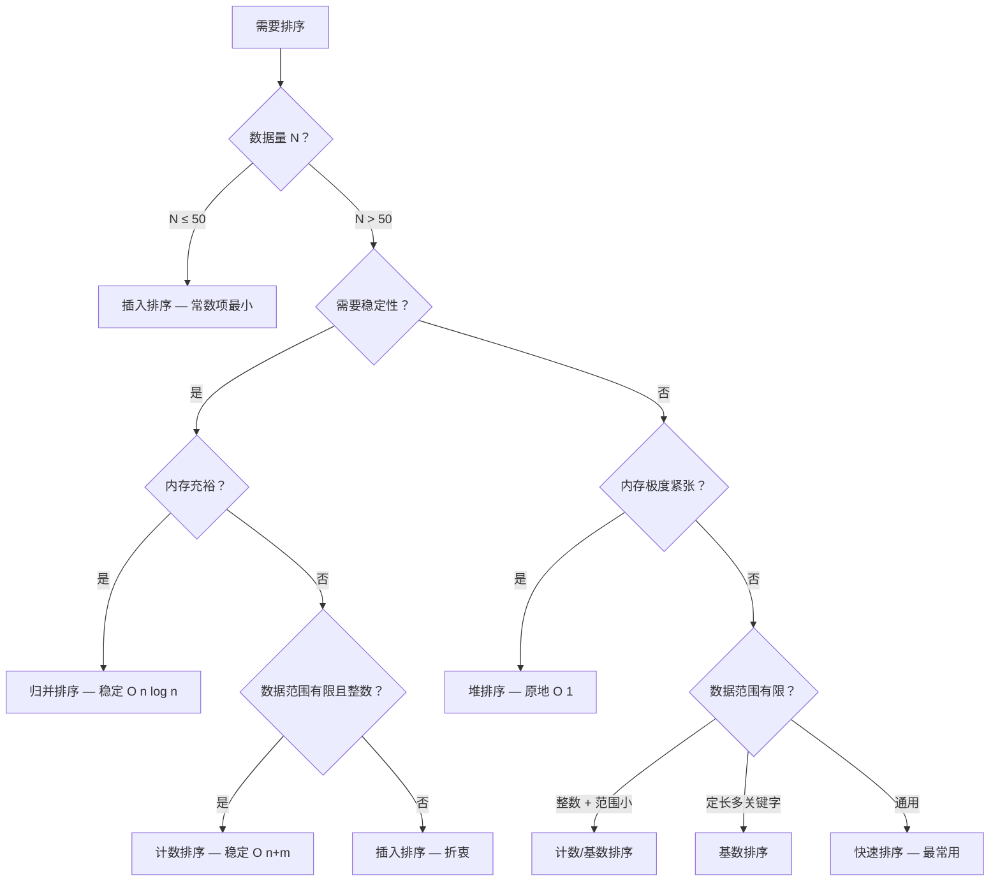

---
name: dart-algorithms
description: 《Hello 算法》Dart 版完整技能手册——从算法思维基础、复杂度分析、数据结构选择、排序搜索、算法范式到常见陷阱的全体系方法论
metadata:
  model: deepseek-v4-pro
  last_modified: 2026-05-15T10:00:00Z
  tags: [dart, fundamentals, core-libraries, collections-iterables]
  source_book: hello-algo-dart
---

# Hello 算法 Dart 版 · 完整技能手册

> 来源：靳宇栋《Hello 算法》Dart 语言版 Release 1.3.0，2026
> 蒸馏日期：2026-05-14 | 合并日期：2026-05-15

## 总目录

- [第一部分：算法思维基础](#第一部分算法思维基础)
- [第二部分：复杂度分析](#第二部分复杂度分析)
- [第三部分：数据结构选择决策](#第三部分数据结构选择决策)
- [第四部分：排序与搜索](#第四部分排序与搜索)
- [第五部分：算法范式对比与选择](#第五部分算法范式对比与选择)
- [第六部分：常见陷阱与反模式](#第六部分常见陷阱与反模式)

---

# 第一部分：算法思维基础

# dart-algorithms-foundations

> 来源：靳宇栋《Hello 算法》Dart 语言版 Release 1.3.0，2026
> 覆盖章节：第 0 章（前言/学习路线）、第 1 章（初识算法）、第 3 章（数据结构分类）

## Contents

- [一、为什么要学算法](#一为什么要学算法)
- [二、算法生活类比](#二算法生活类比)
- [三、数据结构分类体系](#三数据结构分类体系)
- [四、三段式学习路线](#四三段式学习路线)
- [五、算法不是万能钥匙](#五算法不是万能钥匙)
- [六、Dart 基础语法在算法中的角色](#六dart-基础语法在算法中的角色)
- [Workflow: 建立算法思维](#workflow-建立算法思维)
- [Examples](#examples)

## 一、为什么要学算法

### R: 原文引用

> 算法是问题的解决方案。在计算机科学中，算法是一系列用于解决特定问题的明确指令。它是计算机程序的灵魂——没有算法的程序只是一堆毫无意义的代码。学习算法不仅是准备技术面试的需要，更是提升工程效率和逻辑思维能力的根本途径。

### I: 重述

算法的本质是把"怎么解决问题"变成精确的、可重复执行的步骤序列。学算法有三层价值：第一层是**面试通行证**——大厂技术面试必考数据结构与算法；第二层是**工程效率**——知道什么场景用什么结构、算法瓶颈在哪里，写出性能合格的代码；第三层是**思维训练**——算法教会你的不是死记硬背的模板，而是一种"遇问题 -> 拆解 -> 建模 -> 逐步解决"的思维习惯。这种思维可迁移到任何工程领域。

### A1: 书中案例

| 场景 | 算法思维体现 |
|------|-------------|
| 微信红包分配 | 二倍均值算法在 O(n) 时间内随机拆分金额 |
| 导航路径规划 | Dijkstra 最短路径算法在路网图中搜索最优路线 |
| 搜索引擎排序 | PageRank 算法用图结构 + 迭代收敛对网页排名 |
| 推荐系统 | 协同过滤算法基于用户行为相似性做推荐 |
| LeetCode 刷题 | 每道题背后都对应一种或多种算法范式的应用 |

### A2: 触发场景

- 刚入门编程，面对算法一词感到困惑和畏惧
- 刷 LeetCode 时不知从何下手，题目和数据结构对不上号
- 面试准备中需要系统了解算法学习的大方向
- 日常开发中遇到性能问题，需要判断"是不是算法选错了"
- 阅读开源项目源码时看到陌生的数据结构想理解其用途

### E: 可执行步骤

1. **建立心理锚点**：记住一个核心类比——"算法是乐谱，程序是演奏；数据结构是积木块，算法是拼装图纸"
2. **分类你的问题**：遇到一个新问题，先判断它属于哪类算法问题——查找、排序、最优化、遍历、规划？
3. **选对数据结构**：用什么结构承载数据决定了你后续能做什么操作、能多快完成
4. **动手写代码**：看懂不等同于会写。每个算法至少手写 3 遍，能盲打出核心模板
5. **复盘总结**：做完一道题后问三个问题——为什么选这个数据结构？复杂度是多少？还有更优解吗？

### B: 边界

- 算法不是银弹：很多实际工程问题的瓶颈不在算法而在 I/O、网络、数据库
- 简单场景不用过度设计：20 条数据的列表，线性查找足够，不需要把二分查找包装成服务
- 不是所有问题都有多项式解：NP 难问题（如旅行商问题）只能求近似解
- 面试算法和工程算法有差距：面试追求最优复杂度，工程追求可读、可维护、够用就好

---

## 二、算法生活类比

### 2.1 拼装积木——数据结构与算法的共生关系

**R**：数据结构就像积木的"形状"——有长方形、正方形、三角形；算法就像"拼装步骤"——先拼底座、再搭墙壁、最后盖屋顶。单独看每块积木没什么意义，只有按照一定的顺序和方法把它们组合起来，才能搭出一个完整的作品。

**I**：数据结构和算法是一体两面。数据结构是数据的组织方式（存储形式），算法是操作数据的方法（执行逻辑）。你无法脱离数据结构讨论算法——二分查找必须在有序数组上运行；你也无法脱离算法讨论数据结构——栈的价值体现在 push/pop 操作的 LIFO 语义上。正确的思维是：先确定需要什么样的数据组织方式，再设计对应的操作方法。

**A**：以手机通讯录为例——联系人数据用**数组**（有序存储）存放 -> 支持按姓名**二分查找** O(log n)；如果要按标签（如"同事""家人"）分组 -> 改用**哈希表**（key=标签，value=联系人列表）-> 支持 O(1) 按标签查找。

**E**：拿到一个需求后，用两个问题启动设计——1. 数据长什么样？（决定结构）2. 我要对它做什么操作？（决定算法）

**B**：没有"最好的"数据结构，只有"最适合当前场景的"数据结构。

---

### 2.2 扑克牌排序——插入排序的直觉理解

**R**：打扑克时拿到一手牌，大多数人会一边摸牌一边整理——从右往左一张张比较，找到合适的位置把新牌插入进去，保持手中的牌始终有序。这个过程就是插入排序的核心思想。

**I**：插入排序的每个步骤都在维护一个"已排序区间"——初始时是手中的第一张牌（天然有序），每次摸到一张新牌，就在已排序区间中从右往左扫描，找到第一个小于等于新牌的位置，把新牌塞进去。扫描过程中需要把比新牌大的牌整体右移一位。

**A**：手牌 `[5, 2, 4, 6, 1]` -> 摸 5（已排序 `[5]`）-> 摸 2 插入到 5 前（`[2,5]`）-> 摸 4 插入到 2 和 5 之间（`[2,4,5]`）-> 摸 6 插到末尾（`[2,4,5,6]`）-> 摸 1 插到最前（`[1,2,4,5,6]`）。时间复杂度 O(n^2)，但当牌近乎有序时只需 O(n)——因为每次比较一下就结束，不需要大量右移。

**E**：

```dart
void insertionSort(List<int> nums) {
  final n = nums.length;
  for (var i = 1; i < n; i++) {
    final base = nums[i];
    var j = i - 1;
    while (j >= 0 && nums[j] > base) {
      nums[j + 1] = nums[j];
      j--;
    }
    nums[j + 1] = base;
  }
}
```

**B**：数据量超过 10^4 时 O(n^2) 不可接受；反序排列是最坏情况，每次都要移动到最左端。

---

### 2.3 查字典——二分查找的直觉理解

**R**：查一本按拼音排序的字典时，你不会从第一页开始逐页翻。你会先翻到中间，看当前页的首字拼音在你目标拼音之前还是之后——如果在之前就翻后半本，在之后就翻前半本。每翻一次查找范围减半，最多翻 log2(n) 次。

**I**：二分查找的四个前提：1. 数据**有序**（字典按拼音排序）2. 支持**随机访问**（能直接翻到任意页）3. 静态或低频更新（字典不会每天重排）4. 不是链表（链表翻到中间需要 O(n) 走一遍）。满足前提时，O(log n) 的效率在 n=10^6 时只需约 20 次比较——这是指数级差距。

**A**：在 26 个字母的字典中找 "K" 开头的词 -> 翻到中间 (M) -> K<M，翻前半本 -> 翻到中间 (F) -> K>F，翻后半本 -> 翻到中间 (I) -> K>I，翻后 -> 翻到 (K)，命中。共 4 次翻页（log2 26 ~~ 4.7）。

**E**：

```dart
int binarySearch(List<int> arr, int target) {
  var left = 0, right = arr.length - 1;
  while (left <= right) {
    final mid = left + (right - left) ~/ 2;
    if (arr[mid] == target) return mid;
    if (arr[mid] < target) {
      left = mid + 1;
    } else {
      right = mid - 1;
    }
  }
  return -1;
}
```

**B**：数据必须有序——无序数据要先排序（O(n log n) 的前置成本）；不适合频繁增删的场景（维护有序性需 O(n) 移动元素）；不适合链表（取中点需要遍历）。

---

### 2.4 整理钞票——计数排序的直觉理解

**R**：假设你有一堆面值分别为 1 元、5 元、10 元、20 元、50 元、100 元的纸币，要按面值从小到大整理。你不会一张张比较面值大小，而是按面值分堆——所有 1 元的放一堆，所有 5 元的放一堆……最后把各堆按面值顺序合并，瞬间完成"排序"。这就是计数排序。

**I**：计数排序绕过了比较排序的 O(n log n) 下界——它不比较元素大小，而是利用数据本身的值作为索引，统计每个值出现了多少次，然后按值的顺序"铺回"结果。代价是需要 O(n+m) 额外空间（m 为数据取值范围）。当 m 远小于 n 时（如考试成绩 0~100 分），效率极高。

**A**：学生成绩排序——100 万考生，成绩范围 0~750 分。不需要 O(n log n) 的比较排序，统计每个分数的人数，按 0->750 的顺序输出即可，O(n+750) ~~ O(n)。

**E**：

```dart
void countingSort(List<int> nums) {
  if (nums.isEmpty) return;
  final m = nums.reduce((a, b) => a > b ? a : b);
  final counter = List<int>.filled(m + 1, 0);
  for (final num in nums) counter[num]++;
  var i = 0;
  for (var val = 0; val <= m; val++) {
    for (var c = 0; c < counter[val]; c++) {
      nums[i++] = val;
    }
  }
}
```

**B**：数据必须是**非负整数**，且取值范围 m 不能远大于数据量 n（否则大量空间浪费在空计数位上）；不适用于浮点数或字符串排序；稳定版计数排序需要前缀和技巧。

---

## 三、数据结构分类体系

### R: 原文引用

> 数据结构的分类可以从两个维度展开。第一个维度是**逻辑结构**——反映数据元素之间的逻辑关系，分为线性和非线性两大类。第二个维度是**物理结构**——反映数据在计算机内存中的存储方式，分为连续存储（数组）和分散存储（链表）。所有复杂数据结构都是数组或链表（或二者组合）在逻辑结构维度上的设计。

### I: 重述

数据结构分类体系的精髓在于：**逻辑结构**描述的是"看起来怎么样"（元素之间的抽象关系），**物理结构**描述的是"放在哪"（内存中的真实布局）。比如说，栈在逻辑上是 LIFO 的线性结构，但在物理上可以用数组（连续空间）或链表（分散空间）两种方式实现。再比如，二叉树在逻辑上是树形结构，但在物理上可以用数组（完全二叉树按层编号存储）或链表节点（左右指针）两种方式实现。理解这两个维度，你就理解了数据结构设计的全部可能性。

### 逻辑结构分类

```
数据结构（逻辑维度）
|-- 线性结构（元素之间是一对一关系）
|   |-- 数组 —— 索引访问，定长/动态扩容
|   |-- 链表 —— 指针串联，增删 O(1)
|   |-- 栈   —— LIFO，后进先出
|   +-- 队列 —— FIFO，先进先出
|
+-- 非线性结构（元素之间是一对多/多对多关系）
    |-- 树   —— 层级关系，一对多（二叉树、堆、AVL）
    |-- 堆   —— 特殊完全二叉树，用于优先队列
    |-- 哈希表 —— 键值映射，O(1) 平均查找
    +-- 图   —— 多对多，顶点+边构成网络
```

### 物理结构对比表

| 维度 | 连续空间（数组） | 分散空间（链表） |
|------|-----------------|-----------------|
| 存储方式 | 一块连续内存，按索引顺序排列 | 节点散落在内存各处，通过指针串联 |
| 随机访问 | O(1) — 通过索引直接定位 | O(n) — 必须从头遍历到目标位置 |
| 插入/删除 | O(n) — 需要移动后续所有元素 | O(1) — 仅修改相邻节点指针（已知位置时） |
| 缓存友好度 | 高 — 连续内存，CPU 缓存预取命中率高 | 低 — 跳转访问，频繁 cache miss |
| 空间开销 | 低 — 仅存数据本身 | 高 — 每节点额外存指针（Dart 对象头更大） |
| 扩容机制 | 动态数组扩容需搬移 O(n)，但均摊 O(1) | 天然动态，无扩容问题 |
| Dart 对应 | `List<T>`（基于数组） | 无内置链表，需自建或 `dart:collection` 的 `LinkedList` |

### A1: 物理结构选择案例

| 场景 | 选择物理结构 | 原因 |
|------|------------|------|
| 算法题中的栈 | 基于数组实现 | 缓存命中率高，操作效率优于链表 |
| 浏览器前进后退 | 基于双向链表 | 频繁在中间删除（关闭标签页），O(1) |
| 大型游戏的场景管理 | 链表 | 频繁增删实体，随机访问不是主力操作 |
| Twitter 时间线 | 数组（动态列表） | 主要操作是按时间顺序追加和遍历显示 |
| LRU 缓存 | 哈希表 + 双向链表 | 哈希 O(1) 查找 + 链表 O(1) 调整顺序 |

### 数据结构设计的三要素

**R**：任何一种数据结构的设计都围绕三个要素展开——**空间占用**（占多少内存）、**操作速度**（各种操作有多快）、**信息表示**（能否准确表达数据之间的关系）。

**I**：三要素是"不可能三角"——你通常只能在三个维度中取其二。数组取"速度快 + 空间小"，牺牲了"增删灵活"；链表取"增删快 + 灵活扩容"，牺牲了"随机访问"和"空间紧致"；哈希表取"查找快 + 表示灵活"，牺牲了"有序性"和"额外空间"；红黑树取"有序 + 平衡"，牺牲了"常数项大 + 额外指针空间"。选择数据结构时，你是在回答：我愿意牺牲哪个指标来换取哪个指标？

**E**：设计或选择数据结构时的评估清单：

1. **画操作贴图**：列出你的代码中每种操作（查/增/删/改/遍历）的频率比例
2. **算空间上限**：估算数据量 n 及上限，确定 O(n) 空间是否可接受
3. **标有序需求**：数据是否需要保持插入顺序、排序顺序、或任意顺序均可
4. **查复杂度正交表**：看哪种结构在最高频操作上有最优复杂度
5. **考虑 Dart 现实**：Dart 内置 `List` 是数组、`Map`/`Set` 是哈希表、`Queue` 基于 `List`——大多数场景不需要手写结构

### B: 数据结构分类边界

- 分类是人为的，不是绝对的：哈希表既可以是"线性结构"（拉链法本质是数组+链表），也可以是"非线性"（键值映射不算线性关系）
- 物理结构不止数组和链表两种：内存池、B+ 树的页式存储等在操作系统/数据库层面才是真实的物理结构
- Dart 层面的"物理结构"被 VM 封装：我们只能控制逻辑组织，无法精确控制内存布局（GC 移动对象对程序员透明）

---

## 四、三段式学习路线

### R: 原文引用

> 本书建议的学习路径分为三个阶段。阶段一：算法入门——先熟悉各种数据结构的特点和用法，能够用代码实现基本操作。阶段二：刷算法题——先刷热门题目，积累 100 道以上的刷题量，在实战中理解算法的应用。阶段三：构建体系——在大量练习后，知识开始融会贯通，此时回头整理知识图谱，形成自己的算法思维体系。

### I: 重述

三段式的核心逻辑是**先广度、后深度、再融通**。阶段一不求精，只求"见过"——你知道数组、链表、栈、队列、哈希、树、堆、图各长什么样、各有什么特点。阶段二是"练内功"——LeetCode 刷题不是目的，是通过大量题的交叉印证，把"冒泡排序 O(n^2)"从背的变成肌肉记忆。阶段三时你不再需要死记模板——看到一个题目，脑子里自动浮现出"这用哈希表 + 双指针就行"的方案。三个阶段缺一不可：不经历阶段一的广度，阶段二就是瞎撞；不经历阶段二的量变，阶段三就永远是别人的经验。

### A1: 书中案例

| 阶段 | 学习内容 | 对应章节 |
|------|---------|---------|
| 阶段一 | 复杂度分析、数据结构遍历、基本排序 | 第 1-11 章 |
| 阶段二 | LeetCode Hot 100、剑指 Offer 等 | 各章配套练习 |
| 阶段三 | 重新整理复杂度速查表、画出个人知识图谱 | 全书回顾 |

### A2: 触发场景

- 不知道从哪本书/哪个章节开始学算法
- 刷了 30 道题感觉没有进步，开始怀疑方法
- 看到 Hard 题就开始发怵，不知道该用什么数据结构
- 面试前几天突击复习，想系统性地过一遍
- 学完一段时间后想检验自己是否真正掌握了

### E: 阶段一可执行清单

1. **跑通环境**：克隆 Hello 算法 Dart 版仓库，运行每个示例代码
2. **画结构图**：用手画出 8 种核心数据结构的逻辑结构和物理存储示意图
3. **默写基本操作**：List 的增删查改、Map/Set 的增删查、链表节点的创建/删除/遍历（手写 3 遍）
4. **理解复杂度**：看到一种数据结构，能立刻说出它的查/增/删复杂度（至少 80% 准确率）
5. **完成阶段性自测**：不看答案实现插入排序、二分查找，验证正确性

### E: 阶段二可执行清单

1. **定计划**：每天 1-3 道题，优先做 LeetCode Hot 100 中你已经认识数据结构的题
2. **记录模板**：每学一个新算法范式，写入个人模板库（分治、回溯、DP、贪心各一个核心模板）
3. **交叉练习**：同一道题尝试用不同数据结构和算法范式解决
4. **复盘瓶颈**：做不出来的题，标注"是数据结构选错了"还是"算法范式不熟"，针对性补
5. **积累 100+**：到达 100 道题时，你应该能对 70% 的 Medium 题在 5 分钟内给出大致思路

### E: 阶段三可执行清单

1. **画知识图谱**：用思维导图或流程图把学过的所有数据结构和算法范式画出来，标出相互引用关系
2. **写 Skill 文档**：参考本书蒸馏技能的格式，把你自己总结的心得写成结构化的 SKILL.md
3. **教别人**：给另一个刚学算法的人讲一遍——如果你能讲清楚，才算真的理解了
4. **写总结文章**：把"数组 vs 链表"、"BFS vs DFS"、"DP vs 贪心"等核心对比写出来

### B: 学习路线边界

- 阶段不可跳跃：没有阶段一的广度就想跳到阶段三的融通 = 空中楼阁
- 刷题量不是唯一指标：100 道题是参考值，有些人需要 200 道，关键是每道题都复盘总结
- 书不是唯一的资源：本书以基础数据结构为主，高级算法（字符串算法、数论、计算几何）需另寻资源
- 算法学习是长期过程：不能指望两周"突击"掌握——把它当成健身，每周保持训练节奏

---

## 五、算法不是万能钥匙

### R: 原文引用

> 虽然算法在计算机科学中占据核心地位，但我们不应神化算法。算法是解决问题的工具，而不是目的。在实际工程中，代码的可读性、可维护性、团队协作效率往往比极致的算法优化更重要。

### I: 重述

算法思维和工程思维有本质区别。算法追求**极端效率**——哪怕常数因子大一倍都要优化；工程追求**恰到好处**——代码要人看得懂、改得动、测得到。你不需要在每个 for 循环前面分析时间复杂度，也不需要把每个缓存都实现成 LRU。真正的能力是"知道什么时候该用算法思维"——当数据量从 1000 变成 1000 万时，当响应延迟从 100ms 飙升到 5s 时，你能迅速定位瓶颈并选择正确的优化策略。

### A: 过度优化的反面案例

| 场景 | 过度优化 | 正确做法 |
|------|---------|---------|
| 配置列表排序 | 10 条配置用自平衡 BST 存储 | `List.sort()` 足够，O(1) 完全可以忽略 |
| 聊天消息列表 | 为找最新消息实现跳表 | 直接在末尾 append，用线性倒查 |
| 单次数据库查询 | 在内存里写复杂的图算法去重 | 让数据库用 DISTINCT 或 GROUP BY |
| 微服务 API | 为省 2ms 延迟把同步改异步 | 除非吞吐量到瓶颈，否则同步更简单、更好调试 |

### E: 判断是否需要算法优化的决策流程

1. **测量，不要猜**：用 profiler 或 benchmark 找出真正的瓶颈，不要凭直觉
2. **算一笔账**：优化带来的性能提升 vs 增加的代码复杂度和维护成本
3. **问一个问题**：这个操作会执行多少次？如果 `n` 永远不会超过 100，O(n^2) 完全 OK
4. **检查已有轮子**：Dart SDK 和常用包里的方法（`sort()`、`where()`、`fold()`）已经高度优化，不要重复发明

### B: 终极边界

- 算法优化有极限：比较排序不能突破 O(n log n) 的理论下界
- 有些问题是 NP 难的：你必须接受近似解，而不是追求最优解
- 代码腐烂速度 > 性能退化速度：三个月后没人能维护的"极致优化"代码，比多跑 500ms 的"朴素实现"更危险
- 过早优化是万恶之源（Donald Knuth）：先让代码正确运行，再让代码跑得快

---

## 六、Dart 基础语法在算法中的角色

### 6.1 变量与类型推断

```dart
// var 类型推断——省去冗长类型声明，保持代码清爽
var count = 0;        // int
var ratio = 3.14;     // double
var flag = true;      // bool
var items = <int>[];  // List<int>

// final vs const——算法中的常量定义
final n = nums.length;          // 运行时确定
const mod = 1000000007;         // 编译时常量，取模用
```

### 6.2 集合操作链（Collection If/For）

```dart
// 集合字面量中的控制流——比传统 for 循环更声明式
List<int> evenSquares(List<int> nums) {
  return [
    for (final n in nums)
      if (n % 2 == 0) n * n,   // 偶数的平方
  ];
}

// 等价传统写法
List<int> evenSquaresOld(List<int> nums) {
  final result = <int>[];
  for (final n in nums) {
    if (n % 2 == 0) result.add(n * n);
  }
  return result;
}
```

### 6.3 可空类型在算法中的安全处理

```dart
// null 用于"未找到"的语义
int? findIndex(List<int> nums, int target) {
  for (var i = 0; i < nums.length; i++) {
    if (nums[i] == target) return i;
  }
  return null; // 明确表示"不存在"，比返回 -1 更安全
}

// null-aware 操作符简化边界处理
void process(List<int>? nums) {
  final n = nums?.length ?? 0;     // 如果 nums 为 null，用 0
  final safe = nums ?? [];          // 给默认空列表
  safe.forEach(print);
}
```

### 6.4 Map 和 Set 在算法题中的高频用法

```dart
// 两数之和——Map 的经典 O(n) 解法
List<int> twoSum(List<int> nums, int target) {
  final seen = <int, int>{};  // value -> index
  for (var i = 0; i < nums.length; i++) {
    final complement = target - nums[i];
    if (seen.containsKey(complement)) {
      return [seen[complement]!, i];
    }
    seen[nums[i]] = i;
  }
  return [];
}

// 去重——Set 的 O(1) 判断存在性
bool hasDuplicate(List<int> nums) {
  final seen = <int>{};
  for (final n in nums) {
    if (!seen.add(n)) return true; // Set.add 返回 false 表示已存在
  }
  return false;
}

// 字符频率统计——Map 计数模式
Map<String, int> charFrequency(String s) {
  final freq = <String, int>{};
  for (final ch in s.split('')) {
    freq[ch] = (freq[ch] ?? 0) + 1;
  }
  return freq;
}
```

### 6.5 级联操作符（Cascade）

```dart
// 级联操作符构建复杂数据结构——链式操作
final graph = <int, List<int>>{}
  ..[0] = [1, 2]
  ..[1] = [0, 3]
  ..[2] = [0, 3]
  ..[3] = [1, 2];

// 等价于
final graph2 = <int, List<int>>{};
graph2[0] = [1, 2];
graph2[1] = [0, 3];
graph2[2] = [0, 3];
graph2[3] = [1, 2];
```

### E: Dart 语法速查在算法中的应用

| 语法特性 | 算法场景 | 示例 |
|---------|---------|------|
| `~/` 整除 | 二分查找 mid 计算、取一半 | `final mid = (left + right) ~/ 2;` |
| `??` 空值合并 | 统计计数时初始化 | `freq[ch] = (freq[ch] ?? 0) + 1;` |
| `...` 展开 | 合并两个列表（归并排序） | `result.addAll(left.sublist(i));` |
| `collection if/for` | 条件过滤、列表推导 | `[for (final n in nums) if (n > 0) n]` |
| `Set.add` 返回值 | 去重、检测重复 | `if (!seen.add(n)) return true;` |
| `reduce` | 求和、找最大值 | `final max = nums.reduce((a, b) => a > b ? a : b);` |

### B: Dart 语法边界

- `~/` 是截断除法，不是 round——`3 ~/ 2 == 1`，不是 2
- `List.filled(length, fill)` 填充的是**同一个对象引用**——对 mutable 对象的 filled 要小心
- 集合字面量中的 `for`/`if` 会立即执行并构建完整集合——不是惰性的
- `Set.add` 对已存在元素返回 false，但**不会抛出异常**——可以作为去重哨兵
- Dart 无内置对 tuple 的语法支持——算法中需要返回多个值时，用 `Record`（`(int, int)`）或自定义类

---

## Workflow: 建立算法思维

### Task Progress

- [ ] **Step 1: 理解问题域。** 面对一个新问题时，先用自然语言描述清楚——输入是什么？输出是什么？约束条件是什么？（数据范围、时间限制、空间限制）
- [ ] **Step 2: 判断算法类型。** 是查找（二分/哈希/遍历）？排序（比较/非比较）？最优化（DP/贪心）？遍历（BFS/DFS）？排列组合（回溯）？先贴一个标签。
- [ ] **Step 3: 选择数据结构。** 根据操作模式（查/增/删哪个多）和有序性需求，从 8 种核心结构中选出候选。对照第 3 章的"不可能三角"做权衡。
- [ ] **Step 4: 画流程图 / 状态图。** 在纸上画出算法的执行流程——每一步数据如何变化、指针如何移动。不要跳过这一步直接写代码。
- [ ] **Step 5: 分析复杂度。** 标注时间复杂度和空间复杂度，确认在给定数据范围内是否可行。如 n=10^6 则 O(n^2) 不可用。
- [ ] **Step 6: 编写 Dart 代码。** 遵循 Effective Dart 风格，使用恰当的 Dart 语法特性（非空类型、集合操作符、final 优先）。
- [ ] **Step 7: 测试边界。** 测试空输入、单元素、全部相同元素、反序排列等极端情况。用 `assert` 编写自测用例。
- [ ] **Step 8: 复盘 + 找更优解。** 做完后问：这是最优复杂度吗？有没有常数项更小的实现？Dart 有没有内置方法可以替代？

### 条件逻辑

- **如果输入规模 n <= 10^2** -> O(n^2) 算法可接受，优先选择代码简洁的实现
- **如果输入规模 n >= 10^6** -> 必须 O(n) 或 O(n log n)，禁止 O(n^2)
- **如果数据已经有序** -> 优先考虑二分查找 O(log n)，而不是从头遍历
- **如果需要反复查找** -> 构建哈希表（空间换时间），而不是每次线性查找
- **如果问题涉及"全部组合/排列"** -> 这是回溯算法的信号，复杂度通常是 O(2^n) 或 O(n!)
- **如果问题求"最大/最小/最优"且有重叠子问题** -> 这是动态规划的信号，先找状态转移方程
- **如果数据范围固定且很小（如 26 个字母）** -> 可以用固定大小的数组替代 Map 做计数，O(1) 空间 + O(1) 访问
- **如果 Dart 内置方法能满足需求** -> 不要重复发明轮子。`nums.sort()`、`nums.where()`、`nums.fold()` 已经高度优化

---

## Examples

### 示例 1: 如何判断一个问题属于哪种算法类型

```dart
/// 问题：给定一个整数数组，找出其中任意一个重复的数字。
/// 返回重复的数字，如果没有重复则返回 null。

// 判断流程：
// Step 1: 输入 int[]，输出 int?，约束：无（数据范围未指定）
// Step 2: 算法类型标签——"查找重复"
// Step 3: 数据结构选型——
//   方案A: 遍历 + Set 去重 -> O(n) 时间，O(n) 空间
//   方案B: 排序 + 相邻比较 -> O(n log n) 时间，O(1) 空间
// Step 4: 无需复杂流程图，简单的一趟遍历
// Step 5: 方案A 适合 n 不大时；方案B 适合内存紧张时

int? findDuplicate(List<int> nums) {
  final seen = <int>{};
  for (final n in nums) {
    if (!seen.add(n)) return n; // Set.add 返回 false = 已存在
  }
  return null;
}

// 自测用例
void main() {
  assert(findDuplicate([1, 3, 4, 2, 2]) == 2);
  assert(findDuplicate([3, 1, 3, 4, 2]) == 3);
  assert(findDuplicate([1, 2, 3, 4]) == null);
  assert(findDuplicate([1]) == null);
  assert(findDuplicate(<int>[]) == null);
}
```

### 示例 2: 数据结构选择决策——同一个问题，三种方案

```dart
/// 问题：设计一个支持"插入"和"获取中位数"的数据结构
/// 展示了数据结构选择如何改变算法策略

// 方案A: 无序数组 + 每次查询时排序
// 插入 O(1)，查询 O(n log n) —— 适合写多读少的场景
class MedianFinderA {
  final List<int> _data = [];

  void addNum(int num) => _data.add(num); // O(1)

  double findMedian() {
    _data.sort(); // O(n log n)
    final mid = _data.length ~/ 2;
    if (_data.length % 2 == 1) return _data[mid].toDouble();
    return (_data[mid - 1] + _data[mid]) / 2.0;
  }
}

// 方案B: 两个堆（大顶堆 + 小顶堆）
// 插入 O(log n)，查询 O(1) —— 适合读多写多
import 'dart:collection';

class MedianFinderB {
  final _lo = HeapPriorityQueue<int>((a, b) => b.compareTo(a)); // 大顶堆
  final _hi = HeapPriorityQueue<int>(); // 小顶堆（默认）

  void addNum(int num) {
    _lo.add(num);
    _hi.add(_lo.removeFirst());
    if (_lo.length < _hi.length) {
      _lo.add(_hi.removeFirst());
    }
  }

  double findMedian() {
    if (_lo.length > _hi.length) return _lo.first.toDouble();
    return (_lo.first + _hi.first) / 2.0;
  }
}
```

### 示例 3: 递归思维入门——从迭代到递归的思维转换

```dart
/// 计算 1+2+...+n，用两种方式实现，体会递归的递与归

// 迭代版——显式循环，状态在迭代中累加
int sumIterative(int n) {
  var result = 0;
  for (var i = 1; i <= n; i++) result += i;
  return result;
}

// 递归版——隐式循环，状态通过参数传递和返回值回溯
int sumRecursive(int n) {
  if (n == 1) return 1;                 // 终止条件（归的起点）
  return n + sumRecursive(n - 1);        // 递：把 n 入栈，自己处理 n-1
}

// 递归树分析（n=5）：
// sumRecursive(5) = 5 + sumRecursive(4)
//                   4 + sumRecursive(3)
//                       3 + sumRecursive(2)
//                           2 + sumRecursive(1)
//                               1           <- 触底，开始归
//                           = 3
//                       = 6
//                   = 10
//               = 15

// Dart 注意：无尾递归优化，n 过大时用迭代版或 fold
int sumDartWay(int n) => List.generate(n, (i) => i + 1).fold(0, (a, b) => a + b);
```

### 示例 4: 复杂度分析的实战流程

```dart
/// 问题：判断一个整数 n 是否为质数
/// 不同实现有不同的复杂度——展示从 O(n) 到 O(sqrt(n)) 的优化

// 版本1: 暴力试除法 —— O(n) 时间，O(1) 空间
bool isPrimeV1(int n) {
  if (n < 2) return false;
  for (var i = 2; i < n; i++) {   // n-2 次循环
    if (n % i == 0) return false;
  }
  return true;
}

// 版本2: sqrt 优化 —— O(sqrt(n)) 时间，O(1) 空间
// 关键洞察：如果 n 是合数，必有一个因子 <= sqrt(n)
bool isPrimeV2(int n) {
  if (n < 2) return false;
  for (var i = 2; i * i <= n; i++) { // sqrt(n) 次循环
    if (n % i == 0) return false;
  }
  return true;
}

// 复杂度对比：
// n = 10^12 时，V1 需要 ~10^12 次循环（不可能完成）
// V2 只需 ~10^6 次循环（瞬间完成）
// 这就是"算法选择"的威力——从不可用到可用
```

### 示例 5: 边界条件检查——Dart 中的防御性编程

```dart
/// 二分查找的完整边界检查版本
/// 展示算法实现中需要考虑的所有边界情况

int? binarySearchSafe(List<int>? nums, int target) {
  // 边界1: null 或空列表
  if (nums == null || nums.isEmpty) return null;

  var left = 0;
  var right = nums.length - 1;

  // 边界2: 单元素列表
  if (left == right) return nums[left] == target ? left : null;

  while (left <= right) {
    // 边界3: 防溢出（虽然 Dart int 是 BigInt，但保持好习惯）
    final mid = left + (right - left) ~/ 2;

    if (nums[mid] == target) return mid;
    if (nums[mid] < target) {
      left = mid + 1;
    } else {
      right = mid - 1;
    }
  }

  // 边界4: 未找到
  return null;
}

// 自测
void test() {
  assert(binarySearchSafe(null, 5) == null);     // null
  assert(binarySearchSafe([], 5) == null);        // 空
  assert(binarySearchSafe([3], 3) == 0);          // 单元素命中
  assert(binarySearchSafe([3], 5) == null);        // 单元素未命中
  assert(binarySearchSafe([1, 3, 5, 7, 9], 1) == 0);  // 最左
  assert(binarySearchSafe([1, 3, 5, 7, 9], 9) == 4);  // 最右
  assert(binarySearchSafe([1, 3, 5, 7, 9], 6) == null); // 不存在
}
```


---

# 第二部分：复杂度分析

# 复杂度分析方法论

## Contents
- [R: 核心原文引用](#r-核心原文引用)
- [I: 方法论重述](#i-方法论重述)
- [A1: 书中经典案例](#a1-书中经典案例)
- [A2: 未来触发场景](#a2-未来触发场景)
- [E: 可执行步骤](#e-可执行步骤)
- [B: 边界与不适用场景](#b-边界与不适用场景)
- [Workflow: 分析算法复杂度](#workflow-分析算法复杂度)
- [常见时间复杂度速查](#常见时间复杂度速查)
- [常见空间复杂度速查](#常见空间复杂度速查)
- [Examples](#examples)

## R: 核心原文引用

> 时间复杂度分析统计的不是算法运行时间，而是算法运行时间随着数据量变大时的增长趋势。"时间增长趋势"这个概念很抽象，我们通过一个例子来理解。假设输入数据大小为 n，给定三个算法 A、B、C，它们分别执行 1 次、n 次、n² 次操作。从增长趋势来看，足够大的 n 会使得不同阶数之间的差距变得巨大，因此我们通常只关注最高阶的项。

*—— 靳宇栋《Hello 算法》Dart 版，第 2 章*

## I: 方法论重述

复杂度分析的本质是**忽略常数因子、只关注增长趋势的渐进性思维**。大 O 表示法给出了一个函数在 n→∞ 时的上界。这个方法论的三个支柱：

1. **以操作为单位**：不直接计时（受硬件影响），而是统计基本操作（赋值、比较、算术、函数调用）的执行次数。
2. **推算渐近上界**：从统计到的操作数 f(n) 出发，找到增长阶最高的项，忽略常数系数和低阶项，得到 O(g(n))。
3. **最差情况优先**：通常取最坏输入下的操作数作为复杂度，因为它给出了算法的性能底线。

两个关键技巧：**乘法法则**（嵌套循环各层相乘）和**加法法则**（顺序执行各步相加再取最高阶）。递归的复杂度分析需要额外的手段——递归树法或主定理。

## A1: 书中经典案例

| 案例 | 复杂度 | 关键特征 |
|------|--------|----------|
| 数组随机访问 | O(1) | 通过索引直接定位，操作次数不随 n 增大 |
| 二分查找 | O(log n) | 每次比较将问题规模减半 |
| 线性查找 | O(n) | 最坏情况下遍历整个数组 |
| 冒泡排序 | O(n²) | 双层嵌套循环，每层遍历约 n 次 |
| 递归斐波那契 | O(2ⁿ) | 每次调用分裂为两个子问题，呈指数增长 |
| 全排列 | O(n!) | 第一个位置有 n 种选择，第二个有 n−1 种，以此类推 |
| 归并排序（递归树） | O(n log n) | log n 层递归，每层合并操作 O(n) |
| 递归求和（尾递归） | O(n) | 线性递归，每层 O(1)，共 n 层 |

## A2: 未来触发场景

用户有以下需求时应加载本技能：

- 编写算法后不确定其性能瓶颈在哪里
- 比较多个解决方案时无法量化判断谁更优
- 设计递归函数需要评估栈深度和总操作量
- 面试准备、Code Review 中需要论证代码效率
- 数据规模从几百增长到百万级别，需要预估是否有性能风险
- 权衡"时间换空间"或"空间换时间"的架构决策

## E: 可执行步骤

### Step 1: 确定输入规模 n

明确 n 代表什么——数组长度、节点数、字符串长度、递归深度等。

### Step 2: 统计基本操作数

逐行遍历代码，为每行标注执行次数（用 n 表示），累加得到 f(n)：
- 简单语句（赋值、return）：计数 1
- 循环体：循环次数 × 循环体内操作数
- 条件分支：取分支中最大操作数（最差情况）
- 函数调用：计入被调用函数的操作数

### Step 3: 应用大 O 化简规则

从 f(n) 提取渐近上界：
1. 保留最高阶项（忽略低阶项）
2. 忽略常数系数
3. 嵌套循环内层操作数与外层相乘
4. 顺序块取各块复杂度的最大值

### Step 4: 分类并标注

将结果归入常见复杂度类型（见下方速查表）。

### Step 5: 分析空间复杂度

按照三类空间分别统计：
- **输入空间**：存储输入数据的空间（通常不计入复杂度）
- **暂存空间**：算法执行中临时分配的变量、栈帧
- **输出空间**：存储返回结果的空间

判定是否为原地算法（O(1) 额外空间）。

### Step 6: 递归场景专用分析

使用**递归树法**：
1. 画出递归展开的树形结构
2. 标注每层的操作数
3. 统计树的深度和每层节点数
4. 层数 × 每层操作数 = 总复杂度

## B: 边界与不适用场景

| 场景 | 说明 |
|------|------|
| 小规模数据（n < 100） | 常数因子可能主导，O(n²) 可能比 O(n log n) 更快 |
| 已排序/近乎有序的输入 | 最差复杂度可能高估（如插入排序在有序时退化为 O(n)） |
| 硬件异构环境 | 复杂度不反映缓存命中率、分支预测、SIMD 等硬件特性 |
| 分布式系统 | 单机算法复杂度不适用网络延迟、数据分片等场景 |
| 实时系统 | 关注的是 worst-case execution time (WCET)，需更精确的分析 |
| 递归深度受限 | Dart 无尾递归优化，深度递归可能先爆栈而非受复杂度限制 |
| 常数因子巨大的算法 | O(n) 操作如涉及数据库查询，实际耗时远超 O(n²) 纯内存操作 |

## Workflow: 分析算法复杂度

### Task Progress

- [ ] **Step 1: 识别输入规模 n。** 确定哪个参数代表数据量——数组长度 `list.length`、递归深度 `depth`、字符串长度 `s.length`。如有多个输入维度，分别标注 m、n。
- [ ] **Step 2: 标注每行执行次数。** 遍历代码，在心理上为每行标注执行频次（1, n, n² 等）。循环体标注循环次数，递归标注调用次数。
- [ ] **Step 3: 累加并提取最高阶。** 将所有行的操作数相加得 f(n)，忽略常数系数和低阶项，提取 O(g(n))。
- [ ] **Step 4: 匹配复杂度类型。** 将结果与下方速查表对照，确认类型名称和中文描述。
- [ ] **Step 5: 分析空间占用。** 区分输入空间、暂存空间、输出空间。统计额外分配的变量数量和递归调用栈深度。
- [ ] **Step 6: 如果是递归，画递归树。** 确认树深度和每层操作数，验证递归树法的复杂度推算与步骤 3 一致。
- [ ] **Step 7: 写出分析结论。** 格式：`T(n) = O(g(n)), S(n) = O(h(n))`，附一句话说明瓶颈所在。
- [ ] **Step 8: Review + 复核。** 检查是否遗漏隐藏的操作（如 `List.contains` 是 O(n)）、Dart 内置方法的真实复杂度（`sort` 是 O(n log n)），确认常数系数不是实际瓶颈。

### 条件逻辑

- **如果算法有多层嵌套循环：** 使用乘法法则——各层循环次数相乘。`for (i) { for (j) {} }` 中内层次数 × 外层次数。
- **如果算法有多个顺序步骤：** 使用加法法则——取各步骤中最高阶。step1 O(n) + step2 O(n²) = O(n²)。
- **如果输入有两个独立维度（如矩阵的行 m 和列 n）：** 分别保留，不能化简为一个 n。如 O(m × n)。
- **如果递归函数每次分裂为 k 个子问题：** 检查子问题规模是否等比缩小。若无重叠子问题，复杂度通常为 O(kᵈ) 或 O(nˡᵒᵍᵏ)。
- **如果 Dart 代码使用了集合字面量操作符（spread `...`、collection if/for）：** 展开为等价的循环再分析——每个元素都被遍历一次。
- **如果算法使用了 `dart:collection` 中的数据结构（如 `LinkedList`、`SplayTreeMap`）：** 查阅对应数据结构的操作复杂度，纳入分析。

## 常见时间复杂度速查

| 复杂度 | 名称 | 示例操作 | Dart 代码线索 |
|--------|------|----------|---------------|
| O(1) | 常数阶 | 数组索引访问、哈希表查找 | `list[i]`、`map[key]`（平均） |
| O(log n) | 对数阶 | 二分查找、平衡树操作 | 每轮循环 n 减半：`while (low <= high) { mid = ... }` |
| O(n) | 线性阶 | 单层遍历、线性查找 | `for (final e in list)`、`list.where()` |
| O(n log n) | 线性对数阶 | 归并排序、堆排序 | `list.sort()` 默认实现 |
| O(n²) | 平方阶 | 双层嵌套遍历、冒泡排序 | `for (i) { for (j) {} }` 两层都依赖 n |
| O(2ⁿ) | 指数阶 | 递归斐波那契、子集枚举 | 每步分支为 2 个子问题，无记忆化 |
| O(n!) | 阶乘阶 | 全排列 | 逐位选择，选项数递减：n × (n−1) × … × 1 |

## 常见空间复杂度速查

| 复杂度 | 名称 | 触发条件 |
|--------|------|----------|
| O(1) | 常数空间（原地算法） | 仅使用有限个临时变量，无额外数组分配 |
| O(log n) | 对数空间 | 递归深度为 log n（如二分递归、合并排序非原地版） |
| O(n) | 线性空间 | 分配与输入等长的辅助数组、或递归深度为 n |
| O(n²) | 平方空间 | 分配 n × n 的二维数组（如动态规划表） |

## Examples

### 示例 1: 分析线性查找的复杂度

```dart
/// 在列表中查找目标值，返回索引；未找到返回 -1。
/// 时间复杂度：O(n)，空间复杂度：O(1)
int linearSearch(List<int> nums, int target) {
  for (var i = 0; i < nums.length; i++) {
    // 第 i 次迭代：1 次比较 + 1 次返回（命中时）
    if (nums[i] == target) return i;
  }
  return -1; // 1 次操作
}
// 分析：循环最多执行 n 次 → T(n) = O(n)
//       仅使用 i 一个额外变量 → S(n) = O(1)
```

### 示例 2: 分析冒泡排序的复杂度

```dart
/// 冒泡排序。时间复杂度 O(n²)，空间复杂度 O(1)（原地排序）。
void bubbleSort(List<int> nums) {
  final n = nums.length;
  // 外层：n−1 轮
  for (var i = 0; i < n - 1; i++) {
    // 内层：每轮比较 n−1−i 次（仍在 O(n) 级别）
    for (var j = 0; j < n - 1 - i; j++) {
      if (nums[j] > nums[j + 1]) {
        // swap 是 O(1)
        final tmp = nums[j];
        nums[j] = nums[j + 1];
        nums[j + 1] = tmp;
      }
    }
  }
}
// 分析：外层 n 次 × 内层 n 次 → T(n) = O(n²)
//       仅使用 tmp 一个临时变量 → S(n) = O(1)（原地算法）
```

### 示例 3: 递归斐波那契——指数爆炸

```dart
/// 递归斐波那契。时间复杂度 O(2ⁿ)，空间复杂度 O(n)（递归栈深度）。
int fib(int n) {
  if (n <= 1) return n;
  return fib(n - 1) + fib(n - 2);
}
// 递归树分析：
//   - 每层问题规模减 1，共 n 层
//   - 第 k 层约 2ᵏ 个节点
//   - 总节点数 ≈ 2ⁿ → T(n) = O(2ⁿ)
//   - 栈深度 = n → S(n) = O(n)
//
// 优化建议：使用记忆化递归或迭代法可将时间降至 O(n)。
```

### 示例 4: 归并排序——递归树法实战

```dart
/// 归并排序。时间复杂度 O(n log n)，空间复杂度 O(n)。
List<int> mergeSort(List<int> nums) {
  if (nums.length <= 1) return nums;

  final mid = nums.length ~/ 2;
  final left = mergeSort(nums.sublist(0, mid));
  final right = mergeSort(nums.sublist(mid));

  return _merge(left, right);
}

List<int> _merge(List<int> left, List<int> right) {
  final result = <int>[];
  var i = 0, j = 0;
  while (i < left.length && j < right.length) {
    if (left[i] <= right[j]) {
      result.add(left[i++]);
    } else {
      result.add(right[j++]);
    }
  }
  result.addAll(left.sublist(i));
  result.addAll(right.sublist(j));
  return result;
}
// 递归树分析：
//   深度：每次对半切分 → log₂ n 层
//   每层操作：所有节点合并操作合计 O(n)
//   总复杂度：log₂ n 层 × 每层 O(n) → T(n) = O(n log n)
//   空间：辅助数组 result 总计 O(n)（非原地）
```

### 示例 5: 分析 Dart 内置方法链的复杂度

```dart
/// 计算正数的平方和。需要识别链中每一步的隐藏复杂度。
int sumOfPositiveSquares(List<int> nums) {
  return nums
      .where((n) => n > 0)    // O(n)：遍历一次
      .map((n) => n * n)      // O(n)：遍历一次
      .fold(0, (a, b) => a + b); // O(n)：归约一次
}
// 总时间复杂度：O(n) + O(n) + O(n) = O(n)（加法法则，最高阶为 O(n)）
// 中间集合：where 和 map 返回惰性 Iterable，不产生额外 O(n) 空间
// 空间复杂度：O(1)（仅 fold 累加器）
```

### 示例 6: 权衡思维——时间换空间 vs 空间换时间

```dart
/// 版本 A：哈希表缓存 → O(n) 时间，O(n) 空间
int firstDuplicateA(List<int> nums) {
  final seen = <int>{};
  for (final n in nums) {
    if (seen.contains(n)) return n; // Set.contains 平均 O(1)
    seen.add(n);
  }
  return -1;
}

/// 版本 B：暴力双重循环 → O(n²) 时间，O(1) 空间
int firstDuplicateB(List<int> nums) {
  for (var i = 0; i < nums.length; i++) {
    for (var j = 0; j < i; j++) {
      if (nums[i] == nums[j]) return nums[i];
    }
  }
  return -1;
}
// 权衡：版本 A 用 O(n) 额外空间换取 O(n) 时间
//       版本 B 用 O(1) 额外空间但付出 O(n²) 时间
// 选择取决于：内存约束 vs 数据规模。n ≥ 10⁵ 时 B 几乎不可用。
```

### 示例 7: 递归深度警告——Dart 无尾递归优化

```dart
/// 求和递归版。看似 O(n) 时间，但实际风险在栈空间。
int sumRecursive(List<int> nums, int i) {
  if (i == nums.length) return 0;
  return nums[i] + sumRecursive(nums, i + 1);
}
// 时间复杂度：O(n)（n 次调用，每次 O(1)）
// 空间复杂度：O(n)（递归调用栈，每帧保存局部变量）
// Dart 风险：Dart 不支持尾递归优化（TCO），n ≈ 10⁵ 时可能栈溢出。
// 对大 n 建议改用迭代：
//   int sumIterative(List<int> nums) => nums.fold(0, (a, b) => a + b);
```


---

# 第三部分：数据结构选择决策

# 数据结构选择决策

> 来源：靳宇栋《Hello 算法》Dart 语言版（Release 1.3.0，2026），第 4-9 章

## Contents

- [RIA++ 核心分析](#ria-核心分析)
- [数据结构选择决策矩阵](#数据结构选择决策矩阵)
- [Workflow: 选择合适的数据结构](#workflow-选择合适的数据结构)
- [各结构关键操作复杂度速查](#各结构关键操作复杂度速查)
- [Examples (Dart 代码示例)](#examples-dart-代码示例)
- [Dart List（列表）—— 动态数组封装](#dart-list列表-动态数组封装)

## RIA++ 核心分析

### R (Reading) —— 书中原文

> 数组和链表是两种基本的数据结构，分别代表数据在计算机内存中的两种存储方式：连续空间存储和分散空间存储。两者的特点呈现出互补的特性。所有数据结构都是基于数组、链表或二者的组合实现的。

— 《Hello 算法》4.5 小结

### I (Interpretation) —— 方法论提炼

数据结构选择的本质是在**时间效率**与**空间效率**之间做权衡。连续存储（数组）以空间换时间——内存紧凑、缓存友好、随机访问 O(1)，但增删 O(n)。分散存储（链表）以时间换空间——增删 O(1)、灵活扩容，但访问 O(n)、指针开销大。所有高级数据结构都是这两种基础结构的选择或组合：哈希表是数组+链表；树是链表节点的层级组织；堆是数组实现的完全二叉树；图则需要在邻接矩阵（空间换时间）与邻接表（时间换空间）之间二选一。

**决策核心公式**：选择 = 根据访问模式（随机/顺序/两端） × 操作频率（查/增/删哪个多） × 空间约束（内存是否紧张） × 有序性要求。

### A1 (Past Application) —— 书中案例

| 场景 | 选择 | 原因 |
|------|------|------|
| 算法题中的栈 | 基于数组实现 | 缓存命中率高，操作效率优 |
| 数据量大、动态性高的栈 | 基于链表实现 | 避免数组扩容开销，分散存储 |
| 图的稠密图场景（电路网络） | 邻接矩阵 | 边数接近 n²，需要快速判断连通性 |
| 图的稀疏图场景（社交网络） | 邻接表 | 节省 O(n²) 空间为 O(n+m) |
| 软件的"撤销"功能 | 双向队列替代栈 | 需要支持从栈底删除超限历史 |
| Top-K 热搜排行 | 小顶堆 | O(1) 取堆顶 + O(log k) 维护 |

### A2 (Future Trigger) —— 何时需要

你在以下任一场景中遇到选择困难时，加载本 skill：

- 需要一个集合存储数据，但不确定用 `List`、`Set` 还是 `Map`
- 需要频繁在头部/尾部插入删除，考虑是否该用 `Queue`
- 需要按键查找且希望 O(1)，但担心内存占用
- 需要维护数据的排序状态，在 BST 和排序数组之间犹豫
- 需要找出"最大/最小的 K 个"元素
- 需要建模一个关系网络（社交、地图、依赖）
- 面试算法题中对数据结构选型没有把握

### E (Execution) —— 可执行步骤

1. **画出访问模式**：你的代码主要做什么操作？读取（索引/按键/遍历）、写入（追加/插入/删除）各占多少比例？
2. **查阅决策矩阵**：对照下方决策矩阵，找到匹配你操作模式的行
3. **确认空间约束**：内存是否紧张？数据量是否可能大幅增长？
4. **选择实现方式**：确定数据结构后，选择基于数组还是链表的实现（参考复杂度速查表）
5. **编写并测试**：用 Dart 原生集合类实现，运行验证性能

### B (Boundary) —— 不适用场景

- **纯函数式计算或不可变数据**：本 skill 关注 Dart 原生可变集合；如需不可变集合，应使用 `built_collection` 等包
- **并发环境下的线程安全集合**：Dart Isolate 隔离模型通常不需要；若跨 Isolate 共享，需用 `SendPort`/`ReceivePort` 传递副本
- **数据库级别的数据管理**：本 skill 不涉及 SQLite、Hive、Drift 等持久化存储的选择
- **极端性能优化场景**：复杂度分析提供趋势判断，但常数因子在极端场景下可能逆转结论——需实测验证

---

## 数据结构选择决策矩阵

> 从四个维度评估每种数据结构：访问速度、增删效率、空间开销、有序性。按你的操作模式匹配最佳选择。

| 数据结构 | 随机访问 | 增删（已知位置） | 空间效率 | 有序性 | 典型 Dart 类型 |
|----------|---------|----------------|---------|-------|---------------|
| 数组 | **O(1)** | O(n) | 高（无额外开销） | 有序/无序 | `List<T>` |
| 链表 | O(n) | **O(1)** | 低（指针开销） | 无序 | 自定义 `ListNode` |
| 栈 | O(1)(顶) | O(1)(顶) | 取决于实现 | LIFO | `List<T>`（当栈用） |
| 队列 | O(1)(两端) | O(1)(两端) | 取决于实现 | FIFO | `Queue<T>` |
| 哈希表 | **O(1)*** | **O(1)*** | 低（空位浪费） | **无序** | `Map<K,V>` / `Set<T>` |
| 二叉搜索树 | O(log n)* | O(log n)* | 中（指针开销） | **有序** | 自定义 `TreeNode` |
| 堆（优先队列） | **O(1)**(顶) | O(log n) | 高（数组实现） | 部分有序 | 自定义 `MinHeap` |
| 图 | — | O(1)/O(n) | O(n²) 或 O(n+m) | — | `Map<V, List<V>>` |

> \* 哈希表为平均情况，最坏 O(n)；BST 平均 O(log n)，退化时 O(n)

### 按需求快速定位

| 你的需求 | 首选结构 | 备选方案 |
|----------|---------|---------|
| "我需要快速按索引取值" | List | — |
| "我需要频繁在中间增删" | 链表 | Queue（仅两端） |
| "我需要先进先出的处理顺序" | Queue | List（手动管理索引） |
| "我需要后进先出的处理顺序" | List（栈） | Queue（双向） |
| "我需要按 Key 快速查找" | Map | BST（需有序时） |
| "我需要数据不重复" | Set | Map<K, bool> |
| "我需要数据始终保持有序" | BST / SplayTreeMap | 排序 List + 二分查找 |
| "我需要实时获取最大/最小值" | 堆 | 每次排序（不推荐） |
| "我需要建模节点间关系" | 图（邻接表） | 邻接矩阵（稠密图） |

---

## Workflow: 选择合适的数据结构

### Task Progress

- [ ] 列出你的核心操作（查找、插入、删除、遍历）及其频率
- [ ] 判断是否有顺序要求（FIFO / LIFO / 排序 / 无序）
- [ ] 判断是否需要唯一性约束（去重）
- [ ] 判断是否需要 Key-Value 映射
- [ ] 估算数据规模：＜1000 → 低成本结构即可；＞10^6 → 优先 O(1) / O(log n)
- [ ] 确认内存限制：嵌入式/移动端 → 优先数组实现
- [ ] 对照决策矩阵选择数据结构
- [ ] 选择具体实现变体（基于数组 vs 基于链表）
- [ ] 在 Dart 中用原生类型或自定义类实现
- [ ] 编写基准测试验证性能假设

### 条件逻辑

```
你主要的操作模式是什么？
├─ 索引访问 + 尾部追加
│   → List<T>（Dart 原生）
│
├─ 头部 + 尾部插入/删除
│   → Queue<T>（dart:collection）
│
├─ Key → Value 查找（无需排序）
│   → Map<K,V> / HashMap<K,V>
│   └─ 数据量大 + 内存敏感？→ 链式哈希 vs 开放寻址
│
├─ Key → Value 查找（需要排序遍历）
│   → SplayTreeMap<K,V>（dart:collection）
│
├─ 只要值，不重复（去重）
│   → Set<T> / HashSet<T>
│
├─ 经常取最大/最小 K 个
│   → 自定义堆（用 List 实现）
│
├─ 建模网络/地图/依赖关系
│   ├─ 边数 < 顶点数²/10（稀疏）→ Map<V, List<V>>（邻接表）
│   └─ 边数接近顶点数²（稠密）→ List<List<int>>（邻接矩阵）
│
└─ 所有以上需求的组合
    → 分层设计：外层用 Map 索引，内层用 List 存储
```

### Decision Tree

```
需要随机访问（按索引）？
├─ YES → 需要增删在中间？
│   ├─ YES → 数据量如何？
│   │   ├─ < 1000 → List（O(n) 可接受）
│   │   └─ > 10^6 → 链表 + 辅助索引结构
│   └─ NO  → List<T>
│
└─ NO  → 需要按 Key 查找？
    ├─ YES → 需要有序遍历？
    │   ├─ YES → SplayTreeMap / 自定义 BST
    │   └─ NO  → Map / HashMap
    │
    └─ NO  → 需要特定顺序处理？
        ├─ LIFO → List 当做栈
        ├─ FIFO → Queue
        ├─ 最值优先 → 堆
        └─ 无所谓   → 需要去重？
            ├─ YES → Set
            └─ NO  → List（通用）
```

---

## 各结构关键操作复杂度速查

| 操作 | List (数组) | 链表 | Queue | Map (哈希) | BST (平衡) | 堆 |
|------|------------|------|-------|-----------|-----------|----|
| 访问 | O(1) | O(n) | O(1)(两端) | O(1)* | O(log n) | O(1)(顶) |
| 搜索 | O(n) | O(n) | O(n) | O(1)* | O(log n) | O(n) |
| 插入 | O(n) | O(1) | O(1) | O(1)* | O(log n) | O(log n) |
| 删除 | O(n) | O(1) | O(1) | O(1)* | O(log n) | O(log n) |
| 遍历 | O(n) | O(n) | O(n) | O(n) | O(n) | O(n) |
| 空间 | O(n) | O(n) | O(n) | O(n) | O(n) | O(n) |

> \* 哈希表为平均复杂度；最坏（大量冲突）退化为 O(n)。
> BST 未平衡时最坏退化为 O(n)。

### 图：邻接表 vs 邻接矩阵

| 操作 | 邻接表 | 邻接矩阵 |
|------|--------|---------|
| 空间 | O(\|V\|+\|E\|) | O(\|V\|²) |
| 添加边 | O(1) | O(1) |
| 删除边 | O(\|E\|) | O(1) |
| 添加顶点 | O(1) | O(\|V\|²) |
| 删除顶点 | O(\|V\|+\|E\|) | O(\|V\|²) |
| 查询边 | O(\|V\|) | O(1) |

选择规则：边数 > \|V\|²/10 → 邻接矩阵；边数 < \|V\|²/10 → 邻接表。

---

## Examples (Dart 代码示例)

### 1. 数组（List）—— 随机访问王者

```dart
void demoList() {
  // 初始化
  List<int> nums = [1, 3, 2, 5, 4];

  // 随机访问 O(1)
  int item = nums[2];       // 2

  // 尾部追加 O(1)
  nums.add(6);              // [1, 3, 2, 5, 4, 6]

  // 中间插入 O(n) —— 后续元素后移
  nums.insert(2, 10);       // [1, 3, 10, 2, 5, 4, 6]

  // 删除 O(n) —— 后续元素前移
  nums.removeAt(2);         // [1, 3, 2, 5, 4, 6]

  // 遍历 O(n)
  for (var n in nums) { print(n); }
}
```

### Dart List（列表）— 动态数组封装

> **R**: "在 Dart 中，List 是一个动态数组，底层基于数组实现，自动管理扩容。"（《Hello 算法》第 4 章）

**I**: Dart 的 `List` 本质上是一个会自动扩容的数组。它提供了随机访问 O(1) 和尾部增删 O(1)，但中间插入删除为 O(n)。扩容时会分配新内存并拷贝，触发时 O(n)。

**A1**: 书中所有排序算法均以 `List<int>` 作为输入，利用其随机访问特性实现高效排序。

**A2**: 需要随机访问且增删集中在尾部时（如日志收集、打点记录），`List` 是首选。

**E**:
1. 确认主要操作是随机读取还是频繁增删
2. 主操作为随机读取且增删在尾部 → `List`
3. 中间频繁插入删除 → 考虑 `Queue` 或自定义链表

**B**: 中间大量插入删除操作 O(n)，此时应改用 `Queue` 或链表。

```dart
// Dart List 示例
final nums = <int>[];
nums.add(1);        // 尾部添加 O(1) 均摊
nums.addAll([2,3]); // 批量添加
nums.insert(1, 99); // 中间插入 O(n)
nums.removeAt(0);   // 删除 O(n)
nums[2];            // 随机访问 O(1)

// 固定长度 List
final fixed = List.filled(5, 0); // 长度不可变
```

### 2. 链表 —— 频繁增删的首选

```dart
class ListNode {
  int val;
  ListNode? next;
  ListNode(this.val, [this.next]);
}

void demoLinkedList() {
  // 构建链表: 1 → 3 → 2
  ListNode n0 = ListNode(1);
  ListNode n1 = ListNode(3);
  ListNode n2 = ListNode(2);
  n0.next = n1;
  n1.next = n2;

  // 在 n0 后插入节点 O(1)
  void insertAfter(ListNode target, ListNode newNode) {
    newNode.next = target.next;
    target.next = newNode;
  }
  insertAfter(n0, ListNode(4));  // 1 → 4 → 3 → 2

  // 删除 n0 的后继节点 O(1)
  void removeAfter(ListNode target) {
    if (target.next == null) return;
    target.next = target.next?.next;
  }
  removeAfter(n0);  // 1 → 3 → 2

  // 查找 O(n)
  int indexOf(ListNode? head, int target) {
    int index = 0;
    while (head != null) {
      if (head.val == target) return index;
      head = head.next;
      index++;
    }
    return -1;
  }
}
```

### 3. 栈 —— LIFO 后进先出

```dart
import 'dart:collection';

void demoStack() {
  // Dart List 天然支持栈操作
  List<int> stack = [];

  // 入栈 O(1)
  stack.add(1);
  stack.add(3);
  stack.add(2);

  // 访问栈顶 O(1)
  int top = stack.last;     // 2

  // 出栈 O(1)
  int popped = stack.removeLast(); // 2
  // stack 现在是 [1, 3]

  // 判空
  bool empty = stack.isEmpty;
}

// 栈的典型应用：括号匹配
bool isValid(String s) {
  List<String> stack = [];
  Map<String, String> pairs = {')': '(', ']': '[', '}': '{'};
  for (var ch in s.split('')) {
    if (pairs.containsValue(ch)) {
      stack.add(ch);
    } else if (pairs.containsKey(ch)) {
      if (stack.isEmpty || stack.removeLast() != pairs[ch]) return false;
    }
  }
  return stack.isEmpty;
}
```

### 4. 队列 —— FIFO 先进先出

```dart
import 'dart:collection';

void demoQueue() {
  // Queue 提供 O(1) 的两端操作
  Queue<int> queue = Queue<int>();

  // 入队（队尾） O(1)
  queue.addLast(1);
  queue.addLast(3);
  queue.addLast(2);

  // 访问队首 O(1)
  int front = queue.first;  // 1

  // 出队（队首） O(1)
  int dequeued = queue.removeFirst(); // 1
  // queue 现在是 [3, 2]

  int size = queue.length;  // 2
}

// 队列的典型应用：BFS 层序遍历
List<int> levelOrder(Map<int, List<int>> graph, int start) {
  List<int> result = [];
  Set<int> visited = {start};
  Queue<int> queue = Queue<int>()..add(start);

  while (queue.isNotEmpty) {
    int node = queue.removeFirst();
    result.add(node);
    for (var neighbor in (graph[node] ?? [])) {
      if (!visited.contains(neighbor)) {
        visited.add(neighbor);
        queue.addLast(neighbor);
      }
    }
  }
  return result;
}
```

### 5. 哈希表 —— O(1) 键值查找

```dart
void demoHashMap() {
  // Dart Map 即哈希表
  Map<String, int> map = {};

  // 插入/更新 O(1)*
  map['apple'] = 5;
  map['banana'] = 3;
  map['cherry'] = 8;

  // 查找 O(1)*
  int? price = map['apple'];    // 5
  bool has = map.containsKey('grape'); // false

  // 删除 O(1)*
  map.remove('banana');

  // 遍历 O(n) —— 无序！
  map.forEach((key, value) => print('$key: $value'));

  // 去重利器
  List<int> nums = [1, 2, 2, 3, 3, 3];
  Set<int> unique = nums.toSet(); // {1, 2, 3}

  // 计数统计
  Map<int, int> freq = {};
  for (var n in nums) {
    freq[n] = (freq[n] ?? 0) + 1;
  } // {1: 1, 2: 2, 3: 3}
}
```

### 6. 堆（优先队列）—— O(1) 取最值

```dart
// 小顶堆 —— 用于 Top-K 问题
class MinHeap {
  final List<int> _heap = [];

  int peek() => _heap[0];
  int size() => _heap.length;
  bool isEmpty() => _heap.isEmpty;

  void push(int val) {
    _heap.add(val);
    _siftUp(size() - 1);
  }

  int pop() {
    int root = _heap[0];
    _heap[0] = _heap.removeLast();
    if (_heap.isNotEmpty) _siftDown(0);
    return root;
  }

  void _siftUp(int i) {
    int p = (i - 1) ~/ 2;
    while (p >= 0 && _heap[p] > _heap[i]) {
      _swap(p, i);
      i = p;
      p = (i - 1) ~/ 2;
    }
  }

  void _siftDown(int i) {
    while (true) {
      int l = 2 * i + 1, r = 2 * i + 2, min = i;
      if (l < _heap.length && _heap[l] < _heap[min]) min = l;
      if (r < _heap.length && _heap[r] < _heap[min]) min = r;
      if (min == i) break;
      _swap(i, min);
      i = min;
    }
  }

  void _swap(int i, int j) {
    int tmp = _heap[i]; _heap[i] = _heap[j]; _heap[j] = tmp;
  }
}

// Top-K 问题：从海量数据找最大的 K 个元素
List<int> topKLargest(List<int> nums, int k) {
  MinHeap heap = MinHeap();
  // 先用前 K 个元素建堆
  for (int i = 0; i < k; i++) heap.push(nums[i]);
  // 维护小顶堆：大于堆顶则替换
  for (int i = k; i < nums.length; i++) {
    if (nums[i] > heap.peek()) {
      heap.pop();
      heap.push(nums[i]);
    }
  }
  // 导出结果
  List<int> result = [];
  while (!heap.isEmpty()) result.add(heap.pop());
  return result; // 升序输出
}

void demoTopK() {
  List<int> data = [3, 1, 5, 12, 2, 11, 7, 8, 9, 4];
  List<int> top3 = topKLargest(data, 3);
  print(top3); // [9, 11, 12]
}
```

### 7. 图 —— 关系网络建模

```dart
// 邻接表实现（适用于稀疏图）
class GraphAdjList {
  final Map<int, List<int>> adjList = {};

  void addVertex(int v) => adjList.putIfAbsent(v, () => []);

  void addEdge(int a, int b) {
    addVertex(a);
    addVertex(b);
    adjList[a]!.add(b);
    // 无向图需双向添加
    // adjList[b]!.add(a);
  }

  void removeEdge(int a, int b) {
    adjList[a]?.remove(b);
  }

  void removeVertex(int v) {
    adjList.remove(v);
    for (var list in adjList.values) list.remove(v);
  }

  bool hasEdge(int a, int b) => adjList[a]?.contains(b) ?? false;
}

// 邻接矩阵实现（适用于稠密图）
class GraphAdjMat {
  List<int> vertices = [];
  List<List<int>> adjMat = [];

  void addVertex(int v) {
    int n = vertices.length;
    vertices.add(v);
    // 扩充矩阵
    for (var row in adjMat) row.add(0);
    adjMat.add(List.filled(n + 1, 0));
  }

  void addEdge(int i, int j) => adjMat[i][j] = 1;
  void removeEdge(int i, int j) => adjMat[i][j] = 0;
  bool hasEdge(int i, int j) => adjMat[i][j] == 1;
}

void demoGraph() {
  // 社交网络示例
  GraphAdjList social = GraphAdjList();
  social.addEdge(1, 2);
  social.addEdge(1, 3);
  social.addEdge(2, 4);

  print(social.adjList); // {1: [2, 3], 2: [4], 3: [], 4: []}
}
```

### 8. 综合示例：从需求到数据结构选择

```dart
void main() {
  // 场景：需要维护一个排行榜，支持：
  // 1) 快速获取前 10 名
  // 2) 按用户名查找排名
  // 3) 更新分数

  // 选择组合：
  // - 堆 → 维护 Top-10
  // - Map → 按用户名 O(1) 查找

  Map<String, int> scores = {};
  MinHeap topK = MinHeap();
  int k = 3; // 演示用 3

  void updateScore(String user, int newScore) {
    int oldScore = scores[user] ?? 0;
    scores[user] = newScore;

    // 如果进入 Top-K 则更新堆
    if (topK.size() < k || newScore > topK.peek()) {
      // 简化处理：重建（生产环境用更精细的维护策略）
      topK = MinHeap();
      List<int> sorted = scores.values.toList()..sort((a, b) => b.compareTo(a));
      for (int i = 0; i < k && i < sorted.length; i++) topK.push(sorted[i]);
    }
  }

  updateScore('Alice', 100);
  updateScore('Bob', 200);
  updateScore('Charlie', 50);
  updateScore('Diana', 300);

  print(scores); // {Alice: 100, Bob: 200, Charlie: 50, Diana: 300}
}
```

---

## 双向队列（Deque）—— 两端操作均 O(1)

```dart
import 'dart:collection';

void demoDeque() {
  // Dart 的 Queue 即双向队列
  Queue<int> deque = Queue<int>();

  // 两端入队 O(1)
  deque.addFirst(1);
  deque.addLast(2);
  deque.addFirst(3);  // 3 → 1 → 2

  // 两端出队 O(1)
  int first = deque.removeFirst(); // 3
  int last = deque.removeLast();   // 2

  // 滑动窗口最大值 —— 双向队列经典应用
  List<int> maxSlidingWindow(List<int> nums, int k) {
    List<int> result = [];
    Queue<int> deque = Queue<int>(); // 存储索引

    for (int i = 0; i < nums.length; i++) {
      // 移除超出窗口的索引
      while (deque.isNotEmpty && deque.first <= i - k)
        deque.removeFirst();
      // 维护递减队列：移除所有小于当前值的索引
      while (deque.isNotEmpty && nums[deque.last] < nums[i])
        deque.removeLast();
      deque.addLast(i);
      // 窗口形成后记录最大值
      if (i >= k - 1) result.add(nums[deque.first]);
    }
    return result;
  }

  List<int> result = maxSlidingWindow([1, 3, -1, -3, 5, 3, 6, 7], 3);
  print(result); // [3, 3, 5, 5, 6, 7]
}
```

---

## 总结：一分钟决策速查

```
数据有索引/位置含义？
├─ YES → List<T>（Dart 默认，90% 场景适用）
└─ NO  → 数据有 Key 且需要查找？
    ├─ YES → Map<K,V>（O(1) 查找）
    └─ NO  → 需要特定顺序？
        ├─ FIFO（先进先出）→ Queue<T>
        ├─ LIFO（后进先出）→ List 当做栈
        ├─ 最值优先 → 自定义堆（List 实现）
        └─ 需要排序 + 范围查询 → SplayTreeMap<K,V>
```

**核心原则**：用最简单的结构，能 `List` 就不自定义类。复杂度只在数据量 > 10^5 时真正重要。


---

# 第四部分：排序与搜索

# dart-algorithms-sort-search

> 来源：靳宇栋《Hello 算法》Dart 语言版 Release 1.3.0，2026
> 覆盖章节：第 10 章（搜索）、第 11 章（排序）

## Contents
- [排序算法概览](#一排序算法概览)
- [排序选择决策](#二排序选择决策)
- [二分查找及变体](#三二分查找)
- [哈希优化策略](#四哈希查找空间换时间)
- [Dart 内置排序参考](#七dart-内置排序参考)
- [Workflow: 选择排序与搜索策略](#workflow-选择排序与搜索策略)

## 一、排序算法概览

### 1.1 对比矩阵

| 算法 | 平均时间 | 最差时间 | 最佳时间 | 空间 | 稳定 | 原地 | 自适应 |
|------|---------|---------|---------|------|-----|-----|-------|
| 选择排序 | O(n²) | O(n²) | O(n²) | O(1) | 否 | 是 | 否 |
| 冒泡排序 | O(n²) | O(n²) | O(n) | O(1) | 是 | 是 | 是(加 flag) |
| 插入排序 | O(n²) | O(n²) | O(n) | O(1) | 是 | 是 | 是 |
| 快速排序 | O(n log n) | O(n²) | O(n log n) | O(log n) | 否 | 是 | 否 |
| 归并排序 | O(n log n) | O(n log n) | O(n log n) | O(n) | 是 | 否 | 否 |
| 堆排序 | O(n log n) | O(n log n) | O(n log n) | O(1) | 否 | 是 | 否 |
| 桶排序 | O(n+k) | O(n²) | O(n+k) | O(n+k) | 是 | 否 | 否 |
| 计数排序 | O(n+m) | O(n+m) | O(n+m) | O(n+m) | 是 | 否 | 否 |
| 基数排序 | O(nk) | O(nk) | O(nk) | O(n+d) | 是 | 否 | 否 |

### 1.2 RIA++ 详解

---

#### 选择排序

**R**：开启一个循环，每轮从未排序区间选择最小的元素，将其交换到已排序区间的末尾。设数组长度为 n，共 n-1 轮循环，每轮内部比较 n-i 次。时间复杂度 O(n²)，非稳定排序。

**I**：每次在剩余元素中找最小值的下标，然后把它和当前轮次的起始位置交换。两层循环：外层控制已排序边界，内层扫描最小值。因为选择后直接交换而非插入，可能打乱相等元素的相对顺序，所以不稳定。

**A1**：对 `[4, 1, 3, 1, 5]` 排序，两个 `1` 的相对顺序可能被破坏——第一个 `1` 被交换到末尾后，顺序反转。

**A2**：数据量 N ≤ 50 且不关心稳定性时可接受；内存极度受限（原地 O(1)）但一般不如插入排序。

**E**：
```dart
void selectionSort(List<int> nums) {
  final n = nums.length;
  for (var i = 0; i < n - 1; i++) {
    int k = i;
    for (var j = i + 1; j < n; j++) {
      if (nums[j] < nums[k]) k = j;
    }
    final tmp = nums[i];
    nums[i] = nums[k];
    nums[k] = tmp;
  }
}
```

**B**：不稳定，交换可能破坏相等元素顺序。

---

#### 冒泡排序

**R**：连续地比较与交换相邻元素实现排序。每轮将未排序区间内的最大元素"冒泡"到末尾。可加 `swapped` 标志位，若某轮无交换说明已有序，提前终止。

**I**：从前往后两两比较相邻元素，大的往后走（如气泡上浮）。每次内循环把当前范围的最大值推到右端。加 flag 后最佳情况 O(n)——一轮扫描无交换即退出。

**A1**：对 `[4, 1, 3, 1, 5]` 排序，第一轮把 `5` 推到最后，第二轮把 `4` 推到倒数第二……相等元素只在 `>` 时交换，故稳定。

**A2**：教学场景最常用；小数据量且需要稳定排序时可用，但常数项比插入大。

**E**：
```dart
void bubbleSort(List<int> nums) {
  final n = nums.length;
  for (var i = n - 1; i > 0; i--) {
    var swapped = false;
    for (var j = 0; j < i; j++) {
      if (nums[j] > nums[j + 1]) {
        final tmp = nums[j];
        nums[j] = nums[j + 1];
        nums[j + 1] = tmp;
        swapped = true;
      }
    }
    if (!swapped) break;
  }
}
```

**B**：无 flag 退化；每轮只冒泡一个元素，大数据量下极慢。

---

#### 插入排序

**R**：在未排序区间选择一个基准元素，将该元素与其左侧已排序区间的元素逐一比较大小，并将其插入到正确的位置。时间复杂度 O(n²)，但常数项小，在小数据量和几乎有序的数据上表现优异。

**I**：就像打扑克时整理手牌——每次拿到一张新牌，从右往左和已有的牌比较，找到合适位置插入。左侧已排序区间始终保持有序。因为它只是"挤"出一个位置放入元素，相等元素不会互换顺序，因此稳定。

**A1**：对 `[3, 2, 1, 5, 4]` 排序，第一轮 `3` 已有序，第二轮把 `2` 插入到 `3` 之前变成 `[2, 3]`，第三轮 `1` 插入到最前……

**A2**：数据库中小批量数据的"最后排序"；快速排序递归到子数组 ≤ 15 时切换插入排序（多数语言 sort() 内部策略）；在线处理（数据流式到达）。

**E**：
```dart
void insertionSort(List<int> nums) {
  final n = nums.length;
  for (var i = 1; i < n; i++) {
    final base = nums[i];
    var j = i - 1;
    while (j >= 0 && nums[j] > base) {
      nums[j + 1] = nums[j];
      j--;
    }
    nums[j + 1] = base;
  }
}
```

**B**：大规模乱序数据 O(n²) 不可接受。

---

#### 快速排序

**R**：选取一个基准数（pivot），将数组分为"小于基准数"和"大于基准数"两个子数组，再递归地对子数组排序。哨兵划分的核心操作是从两端向中间扫描交换。平均时间复杂度 O(n log n)，但若每次选到最值元素退化为 O(n²)。不稳定。

**I**：分治策略的典范。每轮选一个 pivot，然后用双指针从左右两端向中间扫描：左边找到 ≥ pivot 的元素，右边找到 ≤ pivot 的元素，交换两者，直到指针相遇。递归处理左右子数组。随机选择 pivot 或三数取中法可规避退化。平均跑得最快的通用排序算法。

**A1**：对 `[3, 2, 1, 5, 4]`，选 `3` 为 pivot，左指针找到 `5`，右指针找到 `1`，交换得 `[3, 2, 5, 1, 4]`，直至指针相遇，最终 pivot 与 `1` 交换得 `[1, 2, 3, 5, 4]`，左侧 `< 3`，右侧 `> 3`。

**A2**：通用排序首选（Dart `List.sort()` 内部实现）；大数据量、不要求稳定性的场景。

**E**：
```dart
void quickSort(List<int> nums, int left, int right) {
  if (left >= right) return;
  final pivot = _partition(nums, left, right);
  quickSort(nums, left, pivot - 1);
  quickSort(nums, pivot + 1, right);
}

int _partition(List<int> nums, int left, int right) {
  int i = left, j = right;
  final pivot = nums[left];
  while (i < j) {
    while (i < j && nums[j] >= pivot) j--;
    while (i < j && nums[i] <= pivot) i++;
    final tmp = nums[i];
    nums[i] = nums[j];
    nums[j] = tmp;
  }
  nums[left] = nums[i];
  nums[i] = pivot;
  return i;
}
```

**B**：不稳定（相等元素可能互换位置）；最差 O(n²) 需用随机基准/三数取中规避；递归栈深 O(log n) 需注意栈溢出。

---

#### 归并排序

**R**：基于分治策略，划分为"划分阶段"（递归将数组从中点平分为两个子数组）和"合并阶段"（将有序子数组合并为一个有序数组）。时间复杂度稳定 O(n log n)，空间 O(n)（合并阶段需辅助数组）。稳定排序。

**I**：先一刀切到底——不停对半分直到子数组仅含一个元素（天然有序）。再自底向上合并：用两个指针分别指向两个有序子数组的头部，每次取较小者放入临时数组。相等时取左侧元素，因此稳定。O(n) 辅助空间是代价，但对链表排序时可原地合并。

**A1**：对 `[3, 2, 1, 5, 4]`，分到 `[3] [2] [1] [5] [4]`，合并 `[2,3]` 和 `[1]` → `[1,2,3]`，合并 `[4,5]` → `[4,5]`，最终合并得 `[1,2,3,4,5]`。

**A2**：要求稳定排序的场景（多级排序中保留前一轮顺序）；链表排序（可原地合并，无 O(n) 空间开销）；外部排序（海量数据分块排序后合并）。

**E**：
```dart
void mergeSort(List<int> nums, int left, int right) {
  if (left >= right) return;
  final mid = (left + right) ~/ 2;
  mergeSort(nums, left, mid);
  mergeSort(nums, mid + 1, right);
  _merge(nums, left, mid, right);
}

void _merge(List<int> nums, int left, int mid, int right) {
  final tmp = List<int>.filled(right - left + 1, 0);
  int i = left, j = mid + 1, k = 0;
  while (i <= mid && j <= right) {
    if (nums[i] <= nums[j]) {
      tmp[k++] = nums[i++];
    } else {
      tmp[k++] = nums[j++];
    }
  }
  while (i <= mid) tmp[k++] = nums[i++];
  while (j <= right) tmp[k++] = nums[j++];
  for (var p = 0; p < tmp.length; p++) {
    nums[left + p] = tmp[p];
  }
}
```

**B**：O(n) 辅助空间（数组排序的硬伤）；常数项比快排大，实际运行慢于快排。

---

#### 堆排序

**R**：利用堆数据结构实现的排序。首先将数组构建为最大堆，然后依次将堆顶元素（最大值）与堆底元素交换，并缩小堆的范围，对新堆顶执行"从顶至底堆化"。时间复杂度严格 O(n log n)，原地排序，但不稳定。

**I**：建堆阶段将数组转化为大顶堆（从最后一个非叶节点开始自底向上堆化）。排序阶段不断取出堆顶最大值放到数组末尾，然后对剩余部分重新下沉堆化。优势是 O(1) 额外空间且性能稳定，适合内存极度受限场景。

**A1**：数组 `[4, 10, 3, 5, 1]` → 建堆 → `[10, 5, 3, 4, 1]` → 交换堆顶与堆底 → `[1, 5, 3, 4, 10]` → 堆化 → `[5, 4, 3, 1, 10]` → 循环……

**A2**：嵌入式/小内存设备；需要 O(n log n) 且不接受快排退化风险但可接受不稳定的场景。

**E**：
```dart
void heapSort(List<int> nums) {
  final n = nums.length;
  for (var i = (n ~/ 2) - 1; i >= 0; i--) _siftDown(nums, n, i);
  for (var i = n - 1; i > 0; i--) {
    final tmp = nums[0];
    nums[0] = nums[i];
    nums[i] = tmp;
    _siftDown(nums, i, 0);
  }
}

void _siftDown(List<int> nums, int n, int i) {
  while (true) {
    int l = 2 * i + 1, r = 2 * i + 2, ma = i;
    if (l < n && nums[l] > nums[ma]) ma = l;
    if (r < n && nums[r] > nums[ma]) ma = r;
    if (ma == i) break;
    final tmp = nums[i];
    nums[i] = nums[ma];
    nums[ma] = tmp;
    i = ma;
  }
}
```

**B**：不稳定（堆化过程中交换破坏相对顺序）；缓存不友好（跳转访问）；实际运行通常慢于快排。

---

#### 桶排序 / 计数排序 / 基数排序（线性排序）

**R**：非比较排序，利用数据本身的特性（取值范围、数位长度）绕过比较，达到 O(n) 级别。桶排序将数据分散到多个桶内各自排序后合并；计数排序统计各值的出现次数并通过前缀和确定位置；基数排序从低位到高位对每一位实施稳定计数排序。

**I**：这三种排序都用"空间换时间"把 O(n log n) 的比较下界突破到 O(n)。桶排序先分桶再桶内排序（桶内通常用插入/快排）；计数排序直接统计每个值的出现次数，然后按顺序"铺回"结果数组；基数排序逐位排序（从个位到最高位），每一趟用计数排序保证稳定性。

**A1**：计数排序处理 `[2, 1, 1, 0, 3]` → count 数组 `[1, 2, 1, 1]` → 前缀和 `[1, 3, 4, 5]` → 将元素按前缀和放到正确位置。

**A2**：计数排序——成绩排名（0-100 分）、年龄统计等取值范围有限的整数；基数排序——身份证号排序、IP 地址排序等定长多关键字排序；桶排序——均匀分布的浮点数、海量数据预分割。

**E**（计数排序示例）：
```dart
void countingSort(List<int> nums) {
  final m = nums.reduce((a, b) => a > b ? a : b);
  final counter = List<int>.filled(m + 1, 0);
  for (final num in nums) counter[num]++;
  var i = 0;
  for (var val = 0; val <= m; val++) {
    for (var c = 0; c < counter[val]; c++) {
      nums[i++] = val;
    }
  }
}
```

**B**：计数排序要求数据为**非负整数**且 **取值范围 m 不能太大**（空间 O(n+m) 若 m ≫ n 浪费严重）；基数排序要求数据可表示为固定位数的关键字；桶排序依赖数据均匀分布，分布不均时某桶承载过多元素退化。

---

## 二、排序选择决策



**一句话决策**：小就用插入，要稳就归并，内存紧用堆，通用选快排，范围有限用计数。

---

## 三、二分查找

### 3.1 标准二分查找

**R**：在有序数组中，每次取区间中点与目标值比较，根据比较结果将搜索范围缩小一半。时间复杂度 O(log n)，仅适用于有序数据。

**I**：核心是维护一个 `[left, right]` 闭区间，每次算 `mid`，若 `nums[mid] == target` 返回下标；若 `target < nums[mid]` 则 `right = mid - 1`；否则 `left = mid + 1`。循环终止条件是 `left > right`。在移动端、物联网等计算资源受限环境下极为实用。

**A1**：在 `[1, 3, 5, 7, 9, 11, 13]` 中找 `7`：mid=3(7) 命中返回 3。找 `6`：mid=3(7)→左缩，mid=1(3)→右缩，mid=2(5)→右缩，left>right，返回 -1。

**A2**：有序数组中定位特定值（基础用法）；搜索建议的自动补全、IP路由表查找；数据库索引 B+ 树的核心逻辑。

**E**：
```dart
int binarySearch(List<int> nums, int target) {
  int left = 0, right = nums.length - 1;
  while (left <= right) {
    final mid = left + (right - left) ~/ 2;
    if (nums[mid] == target) return mid;
    if (nums[mid] < target) {
      left = mid + 1;
    } else {
      right = mid - 1;
    }
  }
  return -1;
}
```

**B**：数组必须已排序！无序数据必须先用 O(n log n) 排序；仅适用于随机访问数据结构（数组），不适用于链表；若数组频繁插入/删除，维护有序性的成本很高。

---

### 3.2 二分查找变体：查找插入点

**R**：当目标元素不存在时，返回该元素应插入的位置（保持数组有序）。这是 `left` 指针的含义——循环结束时 `left` 指向第一个 ≥ target 的元素位置。

**I**：与标准二分几乎相同，只是不提前返回（不在 `mid` 命中时 return），而是在循环结束后返回 `left`。`left` 在退出时刚好指向插入位置——0 到 n 之间。

**A1**：在 `[1, 3, 5, 7, 9]` 中找 `6` 的插入点：最终 left=3 → 应插入在 index 3（7 之前）。

**A2**：实现有序集合的 `add()` 方法；合并两个有序列表；在排序数组中找第一个 ≥ target 的位置（lower_bound）。

**E**：
```dart
int binarySearchInsertion(List<int> nums, int target) {
  int left = 0, right = nums.length - 1;
  while (left <= right) {
    final mid = left + (right - left) ~/ 2;
    if (nums[mid] < target) {
      left = mid + 1;
    } else {
      right = mid - 1;
    }
  }
  return left;
}
```

**B**：返回的是第一个 ≥ target 的位置（重复元素时插在最左侧）。

---

### 3.3 二分查找变体：查找左/右边界

**R**：在含重复元素的有序数组中找到目标值的起始和结束位置。左边界二分：遇到 `nums[mid]==target` 时继续向左搜；右边界二分：遇到相等时继续向右搜。

**I**：左边界：`nums[mid] >= target` 时 `right = mid - 1`，最终 `left` 停在第一个 target 位置。右边界：`nums[mid] <= target` 时 `left = mid + 1`，最终 `right` 停在最后一个 target 位置。需额外验证——检查 `left` 是否越界且 `nums[left] == target`。

**A1**：在 `[1, 2, 2, 2, 3, 4]` 中找 `2` → 左边界返回 1，右边界返回 3。

**A2**：搜索一个值在数组中的出现次数（`right - left + 1`）；区间查询（如"价格在 100-200 之间的商品"）；数据去重统计。

**E**：
```dart
int binarySearchLeftEdge(List<int> nums, int target) {
  int left = 0, right = nums.length - 1;
  while (left <= right) {
    final mid = left + (right - left) ~/ 2;
    if (nums[mid] < target) {
      left = mid + 1;
    } else {
      right = mid - 1;
    }
  }
  if (left == nums.length || nums[left] != target) return -1;
  return left;
}

int binarySearchRightEdge(List<int> nums, int target) {
  int left = 0, right = nums.length - 1;
  while (left <= right) {
    final mid = left + (right - left) ~/ 2;
    if (nums[mid] <= target) {
      left = mid + 1;
    } else {
      right = mid - 1;
    }
  }
  if (right < 0 || nums[right] != target) return -1;
  return right;
}
```

**B**：返回值需做越界和目标值相等性校验；仅适用于有序数组。

---

### 3.4 二分查找前提条件

| 条件 | 说明 |
|------|------|
| 数据有序 | 数组必须按升序（或降序）排列，否则二分逻辑失效 |
| 随机访问 | 必须能在 O(1) 时间内访问任意位置元素 → 数组、列表 |
| 静态/低频更新 | 若频繁增删，维护有序性的 O(n) 代价可能抵消 O(log n) 优势 |
| 非链表 | 链表取中点需 O(n) 遍历，二分退化为 O(n log n)，此时不如遍历 |

> 思考题：有序链表若要支持 O(log n) 查询，用什么数据结构？答案：跳表（Skip List）。

---

## 四、哈希查找（空间换时间）

**R**：使用哈希表建立键值映射，通过哈希函数计算出目标元素的存储位置，实现 O(1) 平均查询效率。但需要 O(n) 额外空间，且无法进行范围查询。

**I**：当你需要反复查找某个值时，把查找从 O(n) 降到 O(1) 的最简单策略就是——先建一个哈希表。比如"两数之和"题：`target - nums[i]` 是否出现过？用 HashMap 一次遍历就解决，暴力 O(n²) → 哈希 O(n)。代价是内存。

**A1**：LeetCode 两数之和：遍历数组 `[2, 7, 11, 15]`，target=9。遍历到 7 时，在 HashMap 中查 `9-7=2` 存在 → 返回 `[0, 1]`。

**A2**：高频查询且无须范围/顺序的场景；去重（Set）；缓存层（LRU）；统计频率、计数。

**E**：
```dart
List<int> twoSum(List<int> nums, int target) {
  final map = <int, int>{};
  for (var i = 0; i < nums.length; i++) {
    final complement = target - nums[i];
    if (map.containsKey(complement)) return [map[complement]!, i];
    map[nums[i]] = i;
  }
  return [];
}
```

**B**：O(n) 额外空间；无序——需要范围查询或 topK 时不如堆/树；哈希冲突严重时退化 O(n)。

---

## 五、重述算法（盲打模板）

### 快速排序（核心模板）

```
选 pivot → 左右指针 → 循环交换 → pivot 归位 → 递归左右
```

### 归并排序（核心模板）

```
递归平分 → 合并两个有序数组 → 辅助数组拷贝回原数组
```

### 二分查找（核心模板）

```
while left <= right:
  mid = left + (right-left)/2
  相等返回 / 比目标小左移 / 比目标大右移
```

### 哈希优化（核心模板）

```
遍历 → target - current 是否在哈希表中 → 找到返回 / 否则存入
```

---

## 六、搜索方法四象限选择

| 维度 | 线性搜索 | 二分查找 | 哈希查找 | 树查找 |
|------|---------|---------|---------|-------|
| 时间复杂度 | O(n) | O(log n) | O(1) 平均 | O(log n) |
| 空间开销 | O(1) | O(1) | O(n) | O(n) |
| 数据有序要求 | 否 | 是 | 否 | 是(部分有序) |
| 范围查询 | 否 | 是(有序) | 否 | 是 |
| 更新友好性 | 好(O(1)增删) | 差(O(n)维护) | 好(O(1)平均) | 中(O(log n)) |
| 适用场景 | 小数据/单次/高频更新 | 有序数组/低频增删 | 高频查询/无范围 | 海量+有序+范围 |

---

## 七、Dart 内置排序参考

```dart
// Dart 内置 sort——内部使用 TimSort（归并+插入的混合排序），稳定
final nums = [3, 1, 4, 1, 5];
nums.sort();                        // 升序，原地修改
nums.sort((a, b) => b.compareTo(a)); // 自定义比较器

// 获取排序后的新列表（不修改原列表）
final sorted = [...nums]..sort();

// 二分查找——需要 package:collection
import 'package:collection/collection.dart';
final idx = binarySearch(nums, 4);   // 返回下标，未找到返回 -1
```

---

## 八、边界限制汇总

| 边界 | 详情 |
|------|------|
| 比较排序下界 | 基于比较的排序理论最优为 O(n log n)，要突破必须用非比较排序 |
| 快排退化 | 选到最值 pivot 退化为 O(n²)，用随机 pivot 或三数取中解决 |
| 二分查找前提 | 数据必须有序且支持随机访问，不适用于链表 |
| 计数排序限制 | 数据须为非负整数，且取值范围 m 不能远大于 n（否则空间浪费） |
| 基数排序限制 | 数据可表示为固定位数的关键字（如数字、定长字符串） |
## Workflow: 选择排序与搜索策略

### Task Progress

- [ ] **Step 1: 分析数据特征。** 数据量大小？是否有序？需要稳定性吗？内存限制？
- [ ] **Step 2: 选择排序算法。** 参照排序对比矩阵，根据数据特征选最优算法。
- [ ] **Step 3: 实现排序。** 优先使用 Dart 内置 `sort()`（TimSort），特殊场景才手写。
- [ ] **Step 4: 选择搜索策略。** 数据有序且需多次搜索 → 二分；高频查询 → 哈希；小数据 → 线性。
- [ ] **Step 5: 处理边界。** 数据是否有序（二分前提）？哈希冲突处理？浮点比较用 epsilon？
- [ ] **Step 6: 运行测试。** 验证排序正确性（有序性检查）和搜索准确性。

### 条件逻辑

- **如果 n < 50** → 用插入排序或内置 sort
- **如果需要稳定性** → 归并排序或 Dart sort()（TimSort 稳定）
- **如果数据范围远小于 n** → 计数排序
- **如果数据基本有序** → 插入排序 / 冒泡排序（加 early exit）
- **如果数据可表示为固定位数** → 基数排序

## Examples

### 排序选择实例

```dart
// 场景1: 小数据量排序 → Dart 内置
final small = [3, 1, 4, 1, 5];
small.sort(); // TimSort，稳定，原地

// 场景2: 大数据 + 需稳定 → 归并排序
List<int> mergeSort(List<int> arr) {
  if (arr.length <= 1) return arr;
  final mid = arr.length ~/ 2;
  final left = mergeSort(arr.sublist(0, mid));
  final right = mergeSort(arr.sublist(mid));
  return _merge(left, right);
}

// 场景3: 海量数据 + 范围小 → 计数排序
List<int> countingSort(List<int> arr) {
  if (arr.isEmpty) return [];
  final max = arr.reduce((a, b) => a > b ? a : b);
  final count = List.filled(max + 1, 0);
  for (final x in arr) count[x]++;
  final result = <int>[];
  for (var i = 0; i <= max; i++) {
    result.addAll(List.filled(count[i], i));
  }
  return result;
}
```

### 二分查找实例

```dart
// 标准二分查找
int binarySearch(List<int> nums, int target) {
  var i = 0, j = nums.length; // [i, j)
  while (i < j) {
    final mid = i + (j - i) ~/ 2;
    if (nums[mid] < target) {
      i = mid + 1;
    } else if (nums[mid] > target) {
      j = mid;
    } else {
      return mid;
    }
  }
  return -1;
}

// 查找插入点（左边界）
int binarySearchInsertion(List<int> nums, int target) {
  var i = 0, j = nums.length;
  while (i < j) {
    final mid = i + (j - i) ~/ 2;
    if (nums[mid] < target) { i = mid + 1; }
    else { j = mid; }
  }
  return i; // 返回最左插入位置
}
```


---

# 第五部分：算法范式对比与选择

# 算法范式对比与选择

> 来源：靳宇栋《Hello 算法》Dart 语言版，Release 1.3.0，2026

## Contents

- [四大范式速览](#四大范式速览)
- [一、分治 Divide & Conquer](#一分治-divide-conquer)
- [二、回溯 Backtracking](#二回溯-backtracking)
- [三、动态规划 Dynamic Programming](#三动态规划-dynamic-programming)
- [四、贪心 Greedy](#四贪心-greedy)
- [五、范式选择决策框架](#五范式选择决策框架)
- [六、回溯→记忆化搜索→动态规划渐进路径](#六回溯记忆化搜索动态规划渐进路径)
- [七、范式横向对比表](#七范式横向对比表)
- [Workflow：拿到新问题如何选范式](#workflow拿到新问题如何选范式)
- [Examples](#examples)

---

## 四大范式速览

| 范式 | 核心思想 | 时间复杂度典型 | 适合场景 | 致命缺陷 |
|------|---------|--------------|---------|---------|
| 分治 | 分解→独立求解→合并 | O(n log n) | 子问题独立可合并 | 子问题重叠时重复计算 |
| 回溯 | 穷举+剪枝+回退 | O(k^n) / O(n!) | 求所有解/排列组合 | 无剪枝时状态爆炸 |
| 动态规划 | 存储子问题解避免重复 | O(n) / O(n²) | 最优解+重叠子问题 | 不满足最优子结构则失败 |
| 贪心 | 每一步选局部最优 | O(n) / O(n log n) | 贪心选择性质成立 | 不可靠的局部选择导致次优 |

---

## 一、分治 Divide & Conquer

### R — 原文引用

> 分治算法递归地将原问题划分为多个相互独立的子问题，直至最小子问题，并在回溯中合并子问题的解，最终得到原问题的解。— §14.2

> 分：递归地将原数组划分为两个子数组，直到子数组只剩一个元素。治：从底至顶地将有序的子数组合并。— §12.1

### I — 用自己的话重写

分治将大问题递归拆分为若干个**结构相同、规模更小**的子问题。子问题之间**完全独立**（无重叠），各自求解后再将结果**合并**为原问题解。核心是"分—治—合"三步，每一层的子问题与父问题形式一致，只是数据规模递减。提升效率的底层逻辑有二：操作数量优化（划分后常数项缩小，递归至 O(n log n)）；并行计算优化（独立子问题可多核并行）。

### A1 — 书中案例

**归并排序**：将数组从中间分成两半，递归排好左右子数组，再合并两个有序数组。

```dart
/// 归并排序 — 分治经典实现
void mergeSort(List<int> nums, int left, int right) {
  if (left >= right) return;                  // 终止条件：子数组长度为 1
  int mid = left + (right - left) ~/ 2;      // 分：计算中点
  mergeSort(nums, left, mid);                 // 治：递归排序左半
  mergeSort(nums, mid + 1, right);            // 治：递归排序右半
  _merge(nums, left, mid, right);             // 合：合并两个有序子数组
}

void _merge(List<int> nums, int left, int mid, int right) {
  List<int> tmp = List.filled(right - left + 1, 0);
  int i = left, j = mid + 1, k = 0;
  while (i <= mid && j <= right) {
    if (nums[i] <= nums[j]) tmp[k++] = nums[i++];
    else tmp[k++] = nums[j++];
  }
  while (i <= mid) tmp[k++] = nums[i++];
  while (j <= right) tmp[k++] = nums[j++];
  for (int p = 0; p < tmp.length; p++) nums[left + p] = tmp[p];
}
```

**汉诺塔**：n 个盘子从 A 移到 C，借助 B。分解为三步：n-1 个盘子 A→B、第 n 个盘子 A→C、n-1 个盘子 B→C。

```dart
/// 汉诺塔 — 分治递归
void hanoi(List<int> A, List<int> B, List<int> C) {
  void _move(int n, List<int> src, List<int> buf, List<int> tar) {
    if (n == 1) { tar.add(src.removeLast()); return; }
    _move(n - 1, src, tar, buf);   // 子问题1：n-1 移到缓冲柱
    tar.add(src.removeLast());      // 最大盘直接移到目标
    _move(n - 1, buf, src, tar);   // 子问题2：n-1 从缓冲移到目标
  }
  _move(A.length, A, B, C);
}
```

### A2 — 何时需要分治

- 问题能按相同逻辑分解为更小规模的子问题
- 子问题间无依赖、无重叠（否则应选 DP）
- 子问题的解可以合并还原原问题的解
- 典型信号：归并排序、快速排序、二分查找、构建二叉树、最近点对、大整数乘法

### E — 可执行步骤 / Dart 实现模板

```dart
/// 分治通用模板
ReturnType divideAndConquer(Params params) {
  // 1. 终止条件：问题规模已经足够小，直接求解
  if (isBaseCase(params)) return solveBaseCase(params);

  // 2. 分（Divide）：将原问题拆分为 k 个子问题
  var subProblems = divide(params, k);

  // 3. 治（Conquer）：递归解决每个子问题（可并行）
  var subResults = subProblems.map((p) => divideAndConquer(p));

  // 4. 合（Combine）：合并子问题的解得到原问题的解
  return merge(subResults);
}
```

### B — 边界限制

- 三个条件缺一不可：可分解、子问题独立、解可合并（§12.1.1）
- 若子问题重叠（如 Fibonacci），分治会重复计算导致指数级开销——应改用 DP
- 递归深度可能导致栈溢出，部分场景需转为迭代（如归并排序的非递归实现）
- 等分 k 份时，当 n > 4 划分才有操作数量优势（§12.1.2）

---

## 二、回溯 Backtracking

### R — 原文引用

> 回溯算法在尝试和回退中穷举所有可能的解，并通过剪枝避免不必要的搜索分支。— §14.2

> "剪枝"可避免遍历无意义的搜索空间，从而提升搜索效率。— §13.1

### I — 用自己的话重写

回溯是一种**试探性穷举**搜索：每一步在可选集合中尝试一个选项，递归深入；若当前路径不可能产生解，则**剪枝**终止该分支；若所有选项穷尽或遇错，则**回退**到上一步，撤销选择，替换下一个候选。本质是 DFS 在解空间树上的搜素，辅以约束条件剪枝来压缩搜索空间。核心四要素：状态（state）、选择（choice）、剪枝条件（isValid）、回退（undo）。

### A1 — 书中案例

**全排列**：给定不重复数字数组，返回所有排列。

```dart
/// 全排列 — 回溯模板
List<List<int>> permute(List<int> nums) {
  List<List<int>> res = [];
  List<int> state = [];
  List<bool> selected = List.filled(nums.length, false);
  void backtrack() {
    if (state.length == nums.length) { res.add(List.from(state)); return; }
    for (int i = 0; i < nums.length; i++) {
      if (selected[i]) continue;           // 剪枝：跳过已选元素
      selected[i] = true;
      state.add(nums[i]);                  // 尝试
      backtrack();                         // 递归
      selected[i] = false;
      state.removeLast();                  // 回退
    }
  }
  backtrack();
  return res;
}
```

**子集和 I**：无重复元素数组，求所有和等于 target 的子集。

```dart
/// 子集和 — 带 start 剪枝
void backtrack(List<int> state, int target, int start, List<int> choices,
               List<List<int>> res) {
  if (target == 0) { res.add(List.from(state)); return; }
  for (int i = start; i < choices.length; i++) {
    if (target - choices[i] < 0) break;        // 剪枝一：超出目标
    state.add(choices[i]);                      // 尝试
    backtrack(state, target - choices[i], i, choices, res);
    state.removeLast();                         // 回退
  }
}
```

**N 皇后**：n×n 棋盘放 n 个皇后，彼此不攻击。

```dart
/// N 皇后 — 逐行放置 + 对角线剪枝
List<List<String>> solveNQueens(int n) {
  List<List<String>> res = [];
  List<int> cols = List.filled(n, 0);      // cols[row] = col
  List<bool> diag1 = List.filled(2 * n, false);
  List<bool> diag2 = List.filled(2 * n, false);
  void backtrack(int row) {
    if (row == n) { res.add(_buildBoard(cols)); return; }
    for (int col = 0; col < n; col++) {
      int d1 = row - col + n, d2 = row + col;
      if (cols.contains(col) || diag1[d1] || diag2[d2]) continue; // 剪枝
      cols[row] = col; diag1[d1] = diag2[d2] = true; // 尝试
      backtrack(row + 1);
      diag1[d1] = diag2[d2] = false;                // 回退
    }
  }
  backtrack(0);
  return res;
}
```

### A2 — 何时需要回溯

- 需要**穷举所有可能解**（全排列、子集、组合）
- 问题可用**决策树**建模，每个节点代表一次选择
- 搜索空间可通过**约束条件剪枝**大幅压缩
- 典型信号：排列、组合、子集、棋盘问题、数独、图着色

### E — 可执行步骤 / Dart 实现模板

```dart
/// 回溯通用模板
void backtrack(
  State state,           // 当前状态
  List<Choice> choices,  // 当前可选列表
  List<State> res,       // 结果集
) {
  // 1. 检查是否为解 → 记录
  if (isSolution(state)) { res.add(state.copy()); /* 可选 return */ }

  // 2. 遍历所有选择
  for (final choice in choices) {
    // 3. 剪枝：跳过不合法选项
    if (!isValid(state, choice)) continue;

    // 4. 尝试：做出选择，更新状态
    makeChoice(state, choice);

    // 5. 递归深入
    backtrack(state, nextChoices(choice), res);

    // 6. 回退：撤销选择，恢复状态
    undoChoice(state, choice);
  }
}
```

### B — 边界限制

- 时间复杂度可达 O(k^n) 或 O(n!)，**剪枝是核心竞争力**——无剪枝的回溯在大规模问题中不可行
- 剪枝条件必须**正确且尽可能紧**：宽松则效率低，过紧则漏解
- 重复选择剪枝 vs 相等元素剪枝目标不同：前者防同一元素被多次选（用 `selected` 数组），后者防等值元素产生重复排列/子集（用 `duplicated` 集合或 `start` 索引，§13.2-13.3）
- 回溯不适合纯"求最优解"问题——那是 DP 的领地

---

## 三、动态规划 Dynamic Programming

### R — 原文引用

> 动态规划将一个问题分解为一系列更小的子问题，并通过存储子问题的解来避免重复计算，从而大幅提升时间效率。— §14.1

> 动态规划中的子问题是相互依赖的，在分解过程中会出现许多重叠子问题。— §14.2

### I — 用自己的话重写

DP 的核心是**空间换时间**：将分解出的重叠子问题的解存入 dp 表，后续直接查表而不用重新计算，将指数级复杂度降为多项式级。DP 与分治的关键区别：分治的子问题**独立**（各自求解，无重复），DP 的子问题**依赖重叠**（同一子问题被反复用到）。三大前提条件：重叠子问题（驱动动力）、最优子结构（原问题最优解由子问题最优解构建）、无后效性（状态未来发展只取决于当前状态，与历史路径无关）。

### A1 — 书中案例

**爬楼梯**：每步可上 1 或 2 阶，n 阶楼梯有几种爬法？dp[i] = dp[i-1] + dp[i-2]

```dart
/// 爬楼梯 — DP（自底向上 + 滚动变量优化）
int climbingStairsDP(int n) {
  if (n == 1 || n == 2) return n;
  int a = 1, b = 2;               // a=dp[i-2], b=dp[i-1]
  for (int i = 3; i <= n; i++) {
    int c = a + b;                // dp[i] = dp[i-1] + dp[i-2]
    a = b;
    b = c;
  }
  return b;
}
```

**0-1 背包**：n 个物品，重量 w[i]、价值 v[i]，容量 cap，求最大价值。

```dart
/// 0-1 背包 — DP 空间优化版（一维倒序）
int knapsack01(List<int> w, List<int> v, int cap) {
  List<int> dp = List.filled(cap + 1, 0);
  for (int i = 0; i < w.length; i++) {
    for (int c = cap; c >= w[i]; c--) {   // 倒序遍历，防覆盖
      dp[c] = max(dp[c], dp[c - w[i]] + v[i]);
    }
  }
  return dp[cap];
}
```

**编辑距离**：将 s1 变成 s2 的最少操作数（增/删/改）。

```dart
/// 编辑距离 — DP
int editDistance(String s1, String s2) {
  int m = s1.length, n = s2.length;
  List<List<int>> dp = List.generate(m + 1, (_) => List.filled(n + 1, 0));
  for (int i = 0; i <= m; i++) dp[i][0] = i;
  for (int j = 0; j <= n; j++) dp[0][j] = j;
  for (int i = 1; i <= m; i++) {
    for (int j = 1; j <= n; j++) {
      if (s1[i - 1] == s2[j - 1]) {
        dp[i][j] = dp[i - 1][j - 1];
      } else {
        dp[i][j] = min(min(dp[i - 1][j], dp[i][j - 1]), dp[i - 1][j - 1]) + 1;
      }
    }
  }
  return dp[m][n];
}
```

### A2 — 何时需要动态规划

- 问题可用回溯但出现**大量重叠子问题**（递归树中有大量相同子树）
- 题目含"最大/最小/最多/最少/最长/最短"等最优化描述（加分项）
- 状态能表示为列表/矩阵/树，且状态间存在递推关系
- 目标是求**最优解**而非列举所有方案（减分项：需要返回所有具体方案时 DP 不适用，§14.3.1）

### E — 可执行步骤 / Dart 实现模板

```dart
/// DP 解题五步法（§14.3.2）
///
/// Step 1: 定义状态与 dp 表
///   将决策变量抽象为状态维度，如 dp[i][j] 表示前 i 个物品容量 j 下的最大价值
///
/// Step 2: 找出最优子结构
///   原问题最优解如何从子问题最优解构建，如 dp[i][c] = max(dp[i-1][c], dp[i-1][c-w]+v)
///
/// Step 3: 推导状态转移方程
///   用公式表达递推关系
///
/// Step 4: 确定边界条件与遍历顺序
///   初始化 dp[0][*] 和 dp[*][0]，确保计算 dp[i] 时前序状态已就绪
///
/// Step 5: 可选空间优化
///   若当前状态仅依赖有限个前序状态，用滚动变量/数组降维
///
/// 模板代码：
ReturnType dynamicProgramming(Params params) {
  // 1. 定义 dp 表
  var dp = List.generate(n + 1, (_) => List.filled(m + 1, 0));

  // 2. 初始化边界条件
  for (int i = 0; i <= n; i++) dp[i][0] = baseValue(i);
  for (int j = 0; j <= m; j++) dp[0][j] = baseValue(j);

  // 3. 按正确顺序递推（确保依赖的状态已计算）
  for (int i = 1; i <= n; i++) {
    for (int j = 1; j <= m; j++) {
      // 4. 状态转移
      dp[i][j] = transition(dp, i, j, params);
    }
  }

  // 5. 返回目标状态
  return dp[n][m];
}
```

### B — 边界限制

- **三道门槛**：重叠子问题 + 最优子结构 + 无后效性，缺一不可（§14.2）
- **无后效性被违反时**：可通过增加状态维度（如 [i] 扩为 [i, j]）来恢复，但代价是 dp 表维度膨胀（§14.2.2 带约束爬楼梯例）。严重有后效性问题（如每次决策改变全局约束）即使扩展状态也无法救回
- **空间优化有坑**：0-1 背包一维化时**必须倒序遍历** c（因为当前状态依赖上一行正上方和左上方，倒序防止尚未使用的旧值被覆盖）；完全背包则**正序**（因为依赖同一行正上方和正左方，§14.7 小结）
- **目标不是"最优值"而是"所有方案"时**：DP 不适用，退回回溯

---

## 四、贪心 Greedy

### R — 原文引用

> 贪心算法不会考虑过去的决策，而是一路向前地进行贪心选择。— §15.1

> 动态规划会根据之前阶段的所有决策来考虑当前决策。— §15.1（对比 DP）

### I — 用自己的话重写

贪心在每一步都做出**当前看来最好**的选择（局部最优），期望一路选下去就得到全局最优解。它"只看眼前"——不回头改之前的决定，也不规划未来。核心挑战在于**贪心策略的正确性**：并非所有问题都满足贪心选择性质（局部最优→全局最优）。当条件满足时，贪心往往比 DP 快一个数量级；当条件不满足时，贪心会给出次优解甚至错误解。

### A1 — 书中案例

**分数背包**：物品可分割，每次选单位价值最高的物品装满背包。

```dart
/// 分数背包 — 贪心（按单位价值降序）
double fractionalKnapsack(List<int> w, List<int> v, int cap) {
  List<_Item> items = [];
  for (int i = 0; i < w.length; i++) items.add(_Item(w[i], v[i]));
  items.sort((a, b) => (b.v / b.w).compareTo(a.v / a.w)); // 贪心策略：按单位价值排序

  double res = 0;
  for (final item in items) {
    if (item.w <= cap) { res += item.v; cap -= item.w; }
    else { res += (item.v / item.w) * cap; break; }
  }
  return res;
}
```

**最大容量问题**：给定 n 个隔板高度，选两个隔板使得构成的容器能装最多水。

```dart
/// 最大容量 — 贪心双指针
int maxCapacity(List<int> ht) {
  int i = 0, j = ht.length - 1, res = 0;
  while (i < j) {
    int cap = min(ht[i], ht[j]) * (j - i);
    res = max(res, cap);
    if (ht[i] < ht[j]) i++; else j--;  // 贪心策略：移动较短的板
  }
  return res;
}
```

**零钱兑换（正例与反例）**：

```dart
/// 零钱兑换 — 贪心（仅当硬币面额满足特定条件时才正确）
int coinChangeGreedy(List<int> coins, int amt) {
  coins.sort((a, b) => b.compareTo(a)); // 从大到小
  int count = 0;
  for (final coin in coins) {
    count += amt ~/ coin;
    amt %= coin;
  }
  return amt == 0 ? count : -1;
}
// ✅ coins=[1,5,10,20], amt=31 → 20+10+1 = 3 枚，正确
// ❌ coins=[1,5,11], amt=15 → 贪心选 11+1+1+1+1=5 枚，但最优是 5+5+5=3 枚
```

### A2 — 何时需要贪心

- 问题满足**贪心选择性质**：每一步的局部最优决策不会阻止达到全局最优
- 同时满足**最优子结构**（与 DP 共享）
- 数据具有某种可排序/可比较的性质，能定义清晰的贪心策略
- 典型信号：分数背包、区间调度、霍夫曼编码、Dijkstra 最短路径、活动选择、最大容量

### E — 可执行步骤 / Dart 实现模板

```dart
/// 贪心三步法（§15.1.3）
///
/// Step 1: 问题分析 — 梳理状态、优化目标、约束条件
/// Step 2: 确定贪心策略 — 每一步选择什么规则（如"选最大"、"选最轻"、"选最早结束"）
/// Step 3: 正确性验证 — 用反证法或数学归纳法证明（实践中可用测试样例迭代验证）
///
/// 模板代码：
ResultType greedy(Input input) {
  // 1. 预处理（排序、建堆等），为贪心策略做准备
  input.sort((a, b) => greedyComparator(a, b));

  ResultType result = initialValue;

  // 2. 按贪心策略逐步决策
  for (final item in input) {
    if (canInclude(item, result)) {
      result = applyGreedyChoice(result, item);  // 局部最优选择
      if (isComplete(result)) break;             // 提前终止条件
    }
  }

  return result;
}
```

### B — 边界限制

- **贪心选择性质是硬条件**：不满足时贪心结果不可靠（如零钱兑换 coins=[1,5,11] 时，§15.1）
- **正确性必须验证**：书中建议用反证法或数学归纳法；不可想当然——很多看似可贪心的问题实则需要 DP（§15.1.2）
- **贪心≠简单**：贪心策略设计千变万化，不同问题差异巨大，没有万用模板
- **贪心失败时用 DP**：贪心是"健忘的"只向前看，DP 是"记忆的"回顾过去；两者共享最优子结构，前者更高效但条件苛刻

---

## 五、范式选择决策框架

```
                      ┌─ 拿到一个新问题 ─┐
                      │                   │
                      ▼                   ▼
              能否拆成独立子问题？    需要穷举所有解？
              ├─ 是 → 分治           ├─ 是 → 回溯（+剪枝）
              │                       │
              ▼                       ▼
         子问题有重叠？        有大量重叠子问题且求最优？
         ├─ 否 → 分治 ✓       ├─ 是 → 动态规划
         │                       │
         ▼                       ▼
     是 → 动态规划          局部最优 = 全局最优？
                           ├─ 是 → 贪心（更快）
                           └─ 否 → 动态规划
```

### 决策检查清单

| 检查项 | 是 → | 否 → 下一项 |
|--------|------|-----------|
| 1. 子问题可分解且独立？ | **分治** | 2 |
| 2. 需要穷举所有解（排列/组合/子集）？ | **回溯** + 剪枝 | 3 |
| 3. 求最优解 + 重叠子问题 + 最优子结构？ | **动态规划** | 4 |
| 4. 局部最优可保证全局最优？ | **贪心** | 5 |
| 5. 回溯可解但有大量重叠子问题？ | **DP**（渐进优化） | 回到回溯 |

### 动态规划加分/减分项（§14.3.1）

**加分项**（适合 DP）：
- 题目含"最大/最小/最多/最少/最长/最短"
- 状态可用列表/矩阵/树表示且存在递推关系
- 时间复杂度可通过缓存从指数降为多项式

**减分项**（不适合 DP）：
- 目标是找出**所有方案**而非最优解
- 有明显的排列组合特征需返回多个具体方案
- 严重有后效性，扩展状态维度也无法消除

---

## 六、回溯→记忆化搜索→动态规划渐进路径

> 面对 DP 问题的推荐开发顺序（§14.1, §14.3）

### 四阶段渐进优化

```
回溯（暴力 DFS）                复杂度 O(2^n) / O(n!)
    │  加入 mem 数组缓存已解子问题
    ▼
记忆化搜索（自顶向下 + 缓存）   复杂度 O(n) / O(nm)
    │  转为迭代，从最小值推到目标
    ▼
动态规划（自底向上迭代）        复杂度 O(n) / O(nm)
    │  观察当前状态仅依赖有限前序状态
    ▼
滚动变量优化（空间降维）        空间从 O(n) → O(1)
```

### Dart 四阶段代码对比（以爬楼梯为例）

```dart
// ── 阶段一：暴力回溯 O(2^n) ──
int dfs(int i) {
  if (i == 1 || i == 2) return i;
  return dfs(i - 1) + dfs(i - 2);       // 大量重复计算
}

// ── 阶段二：记忆化搜索 O(n) 时间, O(n) 空间 ──
int dfsMem(int i, List<int> mem) {
  if (i == 1 || i == 2) return i;
  if (mem[i] != 0) return mem[i];       // 缓存命中
  mem[i] = dfsMem(i - 1, mem) + dfsMem(i - 2, mem);
  return mem[i];
}

// ── 阶段三：动态规划（自底向上）O(n) 时间, O(n) 空间 ──
int climbingStairsDP(int n) {
  if (n == 1 || n == 2) return n;
  List<int> dp = List.filled(n + 1, 0);
  dp[1] = 1; dp[2] = 2;
  for (int i = 3; i <= n; i++) dp[i] = dp[i - 1] + dp[i - 2];
  return dp[n];
}

// ── 阶段四：滚动变量优化 O(n) 时间, O(1) 空间 ──
int climbingStairsOptimized(int n) {
  if (n == 1 || n == 2) return n;
  int a = 1, b = 2;                     // a=dp[i-2], b=dp[i-1]
  for (int i = 3; i <= n; i++) {
    int c = a + b; a = b; b = c;
  }
  return b;
}
```

### 渐进路径适用条件

| 阶段 | 何时适用 | 何时跳回 |
|------|---------|---------|
| 回溯 | 任何新 DP 问题的起点，理清决策树 | — |
| 记忆化搜索 | 回溯中发现大量重叠子树 | 递归深度过大导致栈溢出时转迭代 |
| 动态规划 | 所有 DP 问题，编码量比记忆化多但无递归开销 | — |
| 滚动变量 | 状态转移仅依赖 dp[i-1]、dp[i-2] 等紧邻状态 | 依赖跨度大或需保留完整 dp 表回溯路径时不可用 |

---

## 七、范式横向对比表

| 维度 | 分治 | 回溯 | 动态规划 | 贪心 |
|------|------|------|---------|------|
| 子问题关系 | 独立 | 递进（共享部分前缀） | 重叠依赖 | 不分解 |
| 方向 | 自顶向下递归 | 自顶向下试探 | 自底向上递推 | 自左向右单次扫描 |
| 记忆化 | 不需要 | 可选（状态去重） | 核心必需 | 不需要 |
| 正确性保证 | 数学归纳 | 穷举保证 | 状态转移方程 | 需严格证明 |
| 典型复杂度 | O(n log n) | O(k^n) / O(n!) | O(n) ~ O(n²) | O(n) / O(n log n) |
| 是否求最优 | 不保证 | 不专攻 | 核心目标 | 条件苛刻 |
| Dart 常见模式 | 递归 + 合并 | 递归 + selected/used + undo | List.filled + 双层循环 | 排序 + 单次扫描 |

---

## Workflow：拿到新问题如何选范式

### Task Progress

- [ ] **Step 1: 建模。** 将问题抽象为状态 + 决策树，确定输入输出范围。
- [ ] **Step 2: 穷举判断。** 是否要穷举所有解（排列/组合）？→ 是 → **回溯 + 剪枝**。
- [ ] **Step 3: 独立性判断。** 问题可分解为独立子问题且无重叠？→ 是 → **分治**。
- [ ] **Step 4: 重叠子问题判断。** 递归树中是否有大量重复子树？→ 是 → **DP**（从记忆化搜索起步）。
- [ ] **Step 5: 贪心适用判断。** 每步局部最优能否保证全局最优？→ 是 → **贪心**；否 → **DP**。
- [ ] **Step 6: 兜底验证。** 不确定时，先写回溯暴力解，观察递归树 → 有重叠→DP；有剪枝空间→回溯优化；独立子问题→分治。

### 条件逻辑

- **如果需要穷举所有排列/组合** → 回溯（加剪枝优化）
- **如果子问题相互独立、无共享状态** → 分治
- **如果子问题有大量重叠计算** → 动态规划（自底向上或记忆化搜索）
- **如果贪心选择性质可证 + 最优子结构成立** → 贪心
- **如果无法判断范式** → 先写回溯暴力解，分析递归树再决定优化方向
- **如果 DP 空间过大** → 尝试滚动变量优化（如爬楼梯 O(n)→O(1)）

## Examples

### 分治示例：归并排序

```dart
List<int> mergeSort(List<int> nums) {
  if (nums.length <= 1) return nums;
  final mid = nums.length ~/ 2;
  final left = mergeSort(nums.sublist(0, mid));
  final right = mergeSort(nums.sublist(mid));
  return _merge(left, right);
}

List<int> _merge(List<int> a, List<int> b) {
  final res = <int>[];
  var i = 0, j = 0;
  while (i < a.length && j < b.length) {
    res.add(a[i] < b[j] ? a[i++] : b[j++]);
  }
  res.addAll(a.sublist(i));
  res.addAll(b.sublist(j));
  return res;
}
```

### DP 示例：爬楼梯（空间优化）

```dart
int climbingStairs(int n) {
  if (n == 1 || n == 2) return n;
  var a = 1, b = 2;
  for (var i = 3; i <= n; i++) {
    final c = a + b;
    a = b;
    b = c;
  }
  return b;  // O(n) 时间, O(1) 空间
}
```

### 贪心示例：分数背包

```dart
double fractionalKnapsack(List<int> w, List<int> v, int cap) {
  final items = List.generate(w.length, (i) => [v[i] / w[i], w[i], v[i]]);
  items.sort((a, b) => b[0].compareTo(a[0])); // 按单位价值降序
  double res = 0;
  for (final item in items) {
    if (item[1] <= cap) { res += item[2]; cap -= item[1]; }
    else { res += item[0] * cap; break; }
  }
  return res;
}
```


---

# 第六部分：常见陷阱与反模式

# Dart 算法实现中的常见陷阱与反模式

基于《Hello 算法》Dart 版（靳宇栋，2026）。

## Contents
- [递归陷阱](#一递归陷阱)
- [二分查找陷阱](#二二分查找陷阱)
- [排序陷阱](#三排序陷阱)
- [哈希陷阱](#四哈希陷阱)
- [DP与贪心陷阱](#五动态规划与贪心陷阱)
- [数值陷阱](#六数值陷阱)
- [Workflow: 上线前检查清单](#workflow-算法实现上线前检查清单)
- [Examples](#examples)

---

## 一、递归陷阱

### 1.1 递归栈溢出

> **R**: "递归调用深度过大时，每次递归调用都会在调用栈上分配新的栈帧。当递归深度超过系统栈容量时，会引发 Stack Overflow 错误。"（《Hello 算法》第 2 章）

**I**: 递归每深入一层就占用一块栈内存，深度过大时直接爆栈。Dart 栈空间有限（通常几千层），递归解决深层问题不可靠。

**A1**: 递归计算斐波那契第 100 项——即便用了记忆化，第一次线性展开的深度也达 100 层；若不加记忆化，指数爆炸先于栈溢出到来。标准做法是改用迭代。

**A2**: 当数据规模未知或输入规模 > 1000 时；树/图遍历中子树可能退化为链表时；需要稳定可预测的内存消耗时。

**E**:

```dart
// ❌ 危险：深度不可控
int factorial(int n) {
  if (n <= 1) return 1;
  return n * factorial(n - 1);
}

// ✅ 安全：显式栈迭代
int factorialSafe(int n) {
  int result = 1;
  for (int i = 2; i <= n; i++) {
    result *= i;
  }
  return result;
}

// ✅ 树遍历显式栈（避免递归打爆调用栈）
void dfsIterative(Node root) {
  final stack = <Node>[root];
  while (stack.isNotEmpty) {
    final node = stack.removeLast();
    _process(node);
    if (node.right != null) stack.add(node.right!);
    if (node.left != null) stack.add(node.left!);
  }
}
```

**B**: 尾递归函数 Dart VM 不保证优化为循环；`Iterable.generate` 等惰性构造不替代栈安全。

---

### 1.2 尾递归不被 Dart 优化

> **R**: "尾递归是指递归调用是函数最后一个操作……部分编译器会自动优化尾递归为迭代形式，但 Dart 目前不保证这一优化。"

**I**: Dart VM 不会将尾递归转成循环，该爆栈还是爆栈。别指望 tail call optimization（TCO）。

**A1**: 尾递归求和 `sum(n, acc)` ——在 Scala/Elixir 中安全，在 Dart 中 n=10000 直接 StackOverflow。

**A2**: 任何看起来是尾递归的函数，尤其处理列表/流时。

**E**:

```dart
// ❌ 看似安全，实则会爆栈
int sumTail(int n, int acc) {
  if (n == 0) return acc;
  return sumTail(n - 1, acc + n); // Dart 不会优化此尾调用
}

// ✅ 老老实实写循环
int sumLoop(int n) {
  int acc = 0;
  for (int i = 1; i <= n; i++) {
    acc += i;
  }
  return acc;
}
```

**B**: 不依赖任何编译标志或 `--optimization-level` 来期望 TCO。

---

### 1.3 重叠子问题导致指数爆炸

> **R**: "暴力递归通常包含大量重复计算。以斐波那契数列为例，时间复杂从 O(2^n) 降至 O(n) 的关键在于引入记忆化搜索（Memoization）。"

**I**: 递归树中同一子问题被反复求解，计算量指数增长。这是从不可行到可行的关键一步。

**A1**: `fib(50)` 暴力递归需要约 2×10^10 次调用，实际无法在有限时间完成；加 `Map<int, int>` 缓存后只需 ~99 次调用。

**A2**: 当递归函数参数空间有限而反复出现同一组参数时；问题具备最优子结构但尚未使用 DP 时；`pub get` 前不想引入额外依赖但又需要效率时。

**E**:

```dart
// ❌ 指数爆炸
int fib(int n) {
  if (n <= 1) return n;
  return fib(n - 1) + fib(n - 2);
}

// ✅ 记忆化递归
int fibMemo(int n, [Map<int, int>? memo]) {
  memo ??= {};
  if (memo.containsKey(n)) return memo[n]!;
  if (n <= 1) return n;
  return memo[n] = fibMemo(n - 1, memo) + fibMemo(n - 2, memo);
}

// ✅ 自底向上 DP（空间 O(1)）
int fibDP(int n) {
  if (n <= 1) return n;
  int a = 0, b = 1;
  for (int i = 2; i <= n; i++) {
    final c = a + b;
    a = b;
    b = c;
  }
  return b;
}
```

**B**: 记忆化适合参数空间稀疏的情况；自底向上 DP 适合参数空间密集、需严格控制内存时。

---

### 1.4 BST 退化

> **R**: "二叉搜索树的各项操作时间复杂度与树高成正比。若按有序序列顺序插入节点，BST 退化为链表，查找、插入、删除操作退化为 O(n)。"（第 7 章）

**I**: 有序插入 BST → 全挂在右子树 → 变成链表。平衡是 BST 高效的前提。

**A1**: 依次插入 `[1,2,3,4,5,6]` 构建 BST，搜索 6 需要遍历整棵"树"；同一组数据用 AVL 树插入，树高保持 O(log n)。

**A2**: 数据源可能有序（从数据库 ORDER BY 拿到、从排序后的列表构建）；需要构建 BST 做范围查询。

**E**:

```dart
// ❌ 朴素 BST 插入 → 有序数据退化为链表
TreeNode? insert(TreeNode? root, int val) {
  if (root == null) return TreeNode(val);
  if (val < root.val) {
    root.left = insert(root.left, val);
  } else {
    root.right = insert(root.right, val);
  }
  return root;
}

// ✅ 使用 AVL 树——Dart 中可以用 SplayTreeSet 作为替代
import 'dart:collection';
final balancedSet = SplayTreeSet<int>();
for (final v in [1, 2, 3, 4, 5, 6]) {
  balancedSet.add(v);
}
// SplayTreeSet 自平衡，查找 O(log n)
```

**B**: `SplayTreeSet`/`SplayTreeMap` 基于伸展树，摊还 O(log n)，但不保证单次操作 O(log n)；需要严格 O(log n) 可用 `package:avl_tree`。

---

## 二、二分查找陷阱

### 2.1 区间定义混淆

> **R**: "二分查找的边界条件是最容易出错的环节。必须在实现前明确区间定义：双闭区间 `[i, j]` 还是左闭右开 `[i, j)`，并保持循环条件与边界更新一致。"（第 10 章）

**I**: `while (i <= j)` 配 `[i,j]`，`while (i < j)` 配 `[i,j)`。混用导致死循环或漏元素。

**A1**: 在 `[0, n)` 区间搜索，但用了 `i <= j` 条件 → 越界；在 `[0, n-1]` 区间却用 `j = mid` 更新 → 死循环。

**A2**: 每次写二分查找时；面试手写二分；代码 review 中看到二分查找。

**E**:

```dart
// 双闭区间 [i, j]
int binarySearchClosed(List<int> nums, int target) {
  int i = 0, j = nums.length - 1;
  while (i <= j) { // 区间为空时 i > j
    final mid = i + (j - i) ~/ 2;
    if (nums[mid] < target) {
      i = mid + 1;
    } else if (nums[mid] > target) {
      j = mid - 1; // 排除 mid
    } else {
      return mid;
    }
  }
  return -1;
}

// 左闭右开 [i, j)
int binarySearchHalfOpen(List<int> nums, int target) {
  int i = 0, j = nums.length;
  while (i < j) { // 区间为空时 i == j
    final mid = i + (j - i) ~/ 2;
    if (nums[mid] < target) {
      i = mid + 1;
    } else if (nums[mid] > target) {
      j = mid; // mid 不在搜索范围内
    } else {
      return mid;
    }
  }
  return -1;
}
```

**B**: 左闭右开更符合 Dart 的 `List.sublist` / `for (var i = 0; i < list.length; i++)` 惯例，推荐首选。

---

### 2.2 mid 计算溢出

> **R**: "在 i 和 j 都很大时，`(i + j) / 2` 可能超出整数范围导致溢出。安全的写法是 `i + (j - i) / 2`。"

**I**: `(i + j) ~/ 2` 在 i+j 超过 2^63-1 时溢出。Dart 整数是任意精度（big int），严格来说不会溢出——但 **Dart2JS 编译目标下 int 回退到 JS Number（53 位）**，i+j 超过 2^53 会丢失精度。

**A1**: Dart2JS 中搜索 2^53 级别的大数组，`(i+j)~/2` 导致 mid 计算错误，返回值偏差。

**A2**: 目标平台可能是 Web（Dart2JS）；处理超大索引数组；团队编码规范要求防御性写法。

**E**:

```dart
// ❌ Dart2JS 下可能精度丢失
final mid = (i + j) ~/ 2;

// ✅ 安全写法，JIT/AOT/JS 全平台正确
final mid = i + (j - i) ~/ 2;
```

**B**: Dart VM（JIT/AOT）int 无精度问题，但统一写成安全形式保证跨平台一致性。

---

### 2.3 忘记数据必须有序

> **R**: "二分查找的前提是数据已按关键字有序排列。在无序数组上使用二分查找，结果无意义。"

**I**: 二分查找依赖有序性。无序数据先排序（O(n log n)）再二分（O(log n)）——如果只查一次，不如线性扫描 O(n)。

**A1**: 拿到一个未排序的 List 直接传进二分查找，得到随机结果。

**A2**: 不确定输入是否有序时；数据源是第三方 API 或用户输入。

**E**:

```dart
int safeBinarySearch(List<int> nums, int target) {
  // 防御性检查：只在开发/测试阶段开启
  assert(() {
    for (int i = 1; i < nums.length; i++) {
      if (nums[i - 1] > nums[i]) {
        throw StateError('输入数组必须有序，索引 $i 处违反有序性');
      }
    }
    return true;
  }(), 'binary search requires sorted input');
  // ... 二分查找逻辑
}
```

**B**: assert 只在 debug 模式生效，release 模式会被移除。生产环境如需校验，自行实现显式检查。

---

## 三、排序陷阱

### 3.1 快速排序基准选择不良

> **R**: "快速排序的性能高度依赖于基准元素的选择。若每次选择最左或最右元素作为基准，在已有序或接近有序的数据上，快速排序退化为 O(n²)。"（第 11 章）

**I**: 选最左/最右元素当 pivot → 遇到有序数据直接 O(n²)。随机选或三数取中可避免。

**A1**: 对一个近乎有序的 10 万元素数组做快排（固定取最左元素为 pivot），递归深度 ~10^5，栈溢出或极慢；随机 pivot 使深度期望 O(log n)。

**A2**: 数据来源不可控（可能已局部有序）；生产环境排序；快速排序是唯一可行的 in-place O(n log n) 方案时。

**E**:

```dart
import 'dart:math';

final _rand = Random();

// ✅ 随机基准
int _partitionRandom(List<int> nums, int left, int right) {
  final pivotIdx = left + _rand.nextInt(right - left + 1);
  _swap(nums, left, pivotIdx); // 把随机基准换到最左边
  return _partition(nums, left, right);
}

// ✅ 三数取中
int _medianOfThree(List<int> nums, int left, int right) {
  final mid = left + (right - left) ~/ 2;
  // 取 left, mid, right 的中位数作为基准
  if (nums[left] > nums[mid]) _swap(nums, left, mid);
  if (nums[left] > nums[right]) _swap(nums, left, right);
  if (nums[mid] > nums[right]) _swap(nums, mid, right);
  _swap(nums, left, mid); // 将中位数换到最左
  return _partition(nums, left, right);
}

void _swap(List<int> nums, int i, int j) {
  final tmp = nums[i];
  nums[i] = nums[j];
  nums[j] = tmp;
}

// _partition 同标准 Lomuto 划分，此处省略
```

**B**: 随机 pivot 每次调用 `Random.nextInt` 有微小开销，三数取中在近乎有序数据上表现更好且无随机开销。工程实践选三数取中。

---

### 3.2 相等元素稳定性丢失

> **R**: "排序算法的稳定性指相等元素在排序后是否保持原始相对顺序。快速排序、堆排序不稳定；归并排序、插入排序稳定。Dart 的 `List.sort` 默认使用快速排序（不稳定）。"

**I**: Dart `sort()` 不保证稳定。需要稳定排序时，要么用稳定算法，要么把原始索引编码进比较器。

**A1**: 先按年龄排序再按姓名排序——若 sort 不稳定，第二次排序可能打乱第一次的年龄分组。

**A2**: 多级排序（先按 A 再按 B）；排序对象有主键/次键；UI 列表需要保持用户感知顺序。

**E**:

```dart
// ❌ 不稳定排序可能破坏已有顺序
items.sort((a, b) => a.age.compareTo(b.age));

// ✅ 方案一：使用归并排序（稳定）
List<T> mergeSort<T>(List<T> list, int Function(T, T) compare) {
  if (list.length <= 1) return list;
  final mid = list.length ~/ 2;
  final left = mergeSort(list.sublist(0, mid), compare);
  final right = mergeSort(list.sublist(mid), compare);
  return _merge(left, right, compare);
}

// ✅ 方案二：把原始索引编码进比较器（Schwartzian transform）
final sorted = items
    .asMap()
    .entries
    .toList()
  ..sort((a, b) {
    final cmp = a.value.age.compareTo(b.value.age);
    if (cmp != 0) return cmp;
    return a.key.compareTo(b.key); // 索引保序
  });
final result = sorted.map((e) => e.value).toList();
```

**B**: 归并排序需要 O(n) 额外空间；索引编码法在原 List 所有元素相等时不影响结果正确性。

---

## 四、哈希陷阱

### 4.1 哈希冲突退化

> **R**: "哈希冲突不可避免。当冲突严重时（如所有键映射到同一桶），哈希表操作退化为 O(n)。需要设计良好的哈希函数和冲突处理策略（链式地址、开放寻址）来保证均摊 O(1)。"（第 6 章）

**I**: 所有 key 哈希到同一个桶 → 退化为链表遍历。常见于恶意构造的输入（哈希碰撞攻击）或糟糕的 `hashCode` 实现。

**A1**: 自定义类覆盖了 `hashCode` 但始终返回 `0`，存入 10 万元素后 `map[key]` 退化为 O(n) 线性扫描。

**A2**: 自定义对象的 `hashCode` 实现；处理来自不可信源的 key；高频 HashMap 操作。

**E**:

```dart
// ❌ 糟糕的 hashCode：所有对象落入同一桶
class BadKey {
  final String id;
  const BadKey(this.id);

  @override
  int get hashCode => 0; // 全部冲突！

  @override
  bool operator ==(Object other) =>
      other is BadKey && other.id == id;
}

// ✅ 使用 Object.hash() 自动生成良好分布的 hashCode
class GoodKey {
  final String id;
  final int version;
  const GoodKey(this.id, this.version);

  @override
  int get hashCode => Object.hash(id, version);

  @override
  bool operator ==(Object other) =>
      other is GoodKey && other.id == id && other.version == version;
}
```

**B**: `Object.hash()` 从 Dart 2.14 开始可用。确保 `==` 和 `hashCode` 一致：`a == b` → `a.hashCode == b.hashCode`。

---

### 4.2 TOMBSTONE 死标签累积

> **R**: "开放寻址法的删除操作不能简单将桶置空，否则会切断探测链。通常使用 TOMBSTONE 标记已删除元素。但大量删除后，TOMBSTONE 占比过高会导致查找性能下降。"

**I**: 开放寻址哈希表删除时插"墓碑"占位，防止探测链断裂。墓碑太多 → 表里空位多但探测路径长 → 性能退化。

**A1**: 开放寻址哈希表经历大量增删交替操作，load factor 只有 0.3 但查找仍需探测 5-8 步。

**A2**: 自己实现哈希表；增删频繁的场景（如 LRU 淘汰后重建）；理解 Dart `HashMap` 内部行为。

**E**:

```dart
// 开放寻址哈希表删除示意
class OpenAddressingHashMap<K, V> {
  static final _TOMBSTONE = Object();

  V? remove(K key) {
    final idx = _findIndex(key);
    if (idx == -1) return null;
    final old = _values[idx] as V;
    _keys[idx] = _TOMBSTONE; // 墓碑占位，不设 null
    _values[idx] = null;
    _size--;
    // ⚠️ 墓碑累积：当墓碑比例 > 50% 时重新哈希
    if (_tombstoneCount > _capacity ~/ 2) {
      _rehash();
    }
    return old;
  }
}
```

**B**: Dart 标准库 `HashMap` 使用链式地址法，无需关心墓碑问题；此陷阱仅针对自己实现的开放寻址表。

---

## 五、动态规划与贪心陷阱

### 5.1 贪心不一定全局最优

> **R**: "贪心算法在每一步选择当前看起来最优的选项，但这种局部最优并不必然导向全局最优解。最典型的是零钱兑换问题：当硬币面额为 `[1,3,4]`、目标金额为 6 时，贪心策略选择 4+1+1 共 3 枚，而最优解是 3+3 共 2 枚。"（第 15 章）

**I**: 贪心是赌当前最优=全局最优。硬币面额不满足贪心选择性质时赌输。

**A1**: 面额 `[1,3,4]` 兑 6 元——贪心输出 3 枚，DP 输出 2 枚。

**A2**: 每次想用贪心时，先证明"贪心选择性质 + 最优子结构"；否则用 DP。

**E**:

```dart
// ❌ 贪心策略：对 [1,3,4] 目标 6 给出错误结果 3
int coinChangeGreedy(List<int> coins, int amount) {
  final sorted = coins..sort((a, b) => b.compareTo(a)); // 降序
  int count = 0, remaining = amount;
  for (final coin in sorted) {
    count += remaining ~/ coin;
    remaining %= coin;
  }
  return remaining == 0 ? count : -1;
}

// ✅ DP 保证全局最优
int coinChangeDP(List<int> coins, int amount) {
  final dp = List.filled(amount + 1, amount + 1);
  dp[0] = 0;
  for (int i = 1; i <= amount; i++) {
    for (final coin in coins) {
      if (coin <= i) {
        dp[i] = dp[i] < dp[i - coin] + 1 ? dp[i] : dp[i - coin] + 1;
      }
    }
  }
  return dp[amount] > amount ? -1 : dp[amount];
}
```

**B**: 部分硬币系统（如人民币 `[1,2,5,10]`）贪心确实最优，但这需要数学证明，不能假定。

---

### 5.2 背包遍历顺序错误

> **R**: "0-1 背包问题中，若使用正序遍历容量会导致物品被重复选用（即退化为完全背包）。0-1 背包的容量维度必须倒序遍历，而完全背包必须正序遍历。"（第 14 章）

**I**: 0-1 背包正序遍历 → 同一件物品可能被放多次；完全背包倒序遍历 → 物品不能重复使用。遍历方向搞反，结果完全错误。

**A1**: 0-1 背包 `dp[j] = max(dp[j], dp[j-w]+v)` 正序遍历 j → 物品 i 被重复计入（因为 `dp[j-w]` 可能刚被物品 i 更新过）。

**A2**: 写任何背包变种（0-1、完全、多重）；面试中手写 DP。

**E**:

```dart
// 0-1 背包：每个物品最多选一次
int knapsack01(List<int> weights, List<int> values, int capacity) {
  final dp = List.filled(capacity + 1, 0);
  for (int i = 0; i < weights.length; i++) {
    // ✅ 倒序遍历：避免重复使用物品 i
    for (int j = capacity; j >= weights[i]; j--) {
      final take = dp[j - weights[i]] + values[i];
      if (take > dp[j]) dp[j] = take;
    }
  }
  return dp[capacity];
}

// 完全背包：每个物品可选无限次
int knapsackUnbounded(List<int> weights, List<int> values, int capacity) {
  final dp = List.filled(capacity + 1, 0);
  for (int i = 0; i < weights.length; i++) {
    // ✅ 正序遍历：允许重复使用物品 i
    for (int j = weights[i]; j <= capacity; j++) {
      final take = dp[j - weights[i]] + values[i];
      if (take > dp[j]) dp[j] = take;
    }
  }
  return dp[capacity];
}
```

**B**: 二维 DP 数组版本不存在遍历方向陷阱（`dp[i][j]` 隔离了物品维度），但空间占用 O(n×cap) vs 一维 O(cap)。

---

## 六、数值陷阱

### 6.1 浮点精度问题

> **R**: "浮点数遵循 IEEE 754 标准，无法精确表示所有实数。在算法中直接使用 `==` 比较浮点数可能导致逻辑错误。应当使用差值比较法。"（第 3 章）

**I**: `0.1 + 0.2 == 0.3` 为 `false`。浮点运算有舍入误差，算法中用 `==` 做浮点等值判断是 bug 来源。

**A1**: 用 `==` 比较两个"相等"的 `double` 结果，条件分支走到错误路径；二分查找中 `double` mid 比较导致无限循环。

**A2**: 任何涉及浮点比较的地方——几何计算、物理模拟、金融计算、ML 梯度检查。

**E**:

```dart
import 'dart:math';

// ❌ 直接等值比较——不可靠
bool isZero(double x) => x == 0.0;

// ✅ 差值比较
const eps = 1e-9;
bool isZeroSafe(double x) => x.abs() < eps;
bool approxEqual(double a, double b) => (a - b).abs() < eps;

// 二分查找中的浮点安全写法
int binarySearchFloats(List<double> nums, double target) {
  int i = 0, j = nums.length - 1;
  while (i <= j) {
    final mid = i + (j - i) ~/ 2;
    if (nums[mid] < target - eps) {
      i = mid + 1;
    } else if (nums[mid] > target + eps) {
      j = mid - 1;
    } else {
      return mid; // 在 eps 范围内视为相等
    }
  }
  return -1;
}
```

**B**: `eps = 1e-9` 适合大多数场景；金融计算请用 `package:decimal` 定点数而非浮点；科学计算中 eps 应根据数据量级动态计算。

---

## 七、速查表

| 陷阱 | 症状 | 快速修复 |
|------|------|----------|
| 递归爆栈 | StackOverflow | 改显式栈迭代 |
| 尾递归 | 大 n 时爆栈 | 改循环 |
| 重叠子问题 | 运算时间指数增长 | 加 Map 缓存 / 改 DP |
| BST 退化 | 查找变慢 | 用 AVL / SplayTreeSet |
| 二分区间混乱 | 死循环/漏元素 | 统一 `[i,j)` + `i<j` |
| mid 溢出（JS） | 查找结果错误 | `i + (j-i)~/2` |
| 无序二分 | 结果随机 | 先排序或线性扫描 |
| 快排选基准 | 有序数据 O(n²) | 三数取中 / 随机 pivot |
| 排序不稳定 | 相等元素乱序 | 归并排序 / 编码索引 |
| hashCode=0 | HashMap O(n) | `Object.hash(...)` |
| 墓碑累积 | 探测路径变长 | 定期 rehash |
| 贪心非最优 | 硬币兑换多给币 | 改用 DP |
| 背包遍历反 | 物品重复/缺失 | 0-1 倒序，完全正序 |
| 浮点 == | 条件分支错误 | `abs(a-b) < eps` |

---

## Workflow: 算法实现上线前检查清单

### Task Progress

- [ ] **Step 1: 递归深度检查。** 数据规模 > 1000？改迭代或显式栈。
- [ ] **Step 2: 重复计算检查。** 子问题是否反复出现？加记忆化或改 DP。
- [ ] **Step 3: 数据结构假设验证。** BST 有序插入？用自平衡树。
- [ ] **Step 4: 二分前提确认。** 数据是否有序？不放心加 assert。
- [ ] **Step 5: 区间语义。** `[i,j)` 还是 `[i,j]`？写注释，保持一致。
- [ ] **Step 6: 基准选择。** 快排 pivot 是否固定？随机或三数取中。
- [ ] **Step 7: 排序稳定性。** 相等元素顺序是否重要？选稳定排序。
- [ ] **Step 8: hashCode 质量。** 自定义类 hashCode 是否均匀分布？
- [ ] **Step 9: 贪心证明。** 是否已验证最优子结构？
- [ ] **Step 10: DP 遍历方向。** 0-1 倒序，完全正序。
- [ ] **Step 11: 浮点比较。** 是否用了 `==`？改为 `(a-b).abs() < eps`。
- [ ] **Step 12: Feedback Loop。** 满足全部检查项，算法实现才具备上线质量。

### 条件逻辑

- **如果遇到栈溢出** → 改为迭代或显式栈实现
- **如果性能不达标** → 检查是否存在隐藏的 O(n²) 操作
- **如果结果不稳定** → 检查排序算法是否稳定，或编码时加入稳定化处理

在执行任何算法实现前，按此清单逐项检查：

1. **递归深度** —— 数据规模 > 1000？改迭代或显式栈。
2. **重复计算** —— 子问题是否反复出现？加记忆化或改 DP。
3. **数据结构假设** —— BST 有序插入？用自平衡树。
4. **二分前提** —— 数据是否有序？不放心加 assert。
5. **区间语义** —— `[i,j)` 还是 `[i,j]`？写注释，保持一致性。
6. **基准选择** —— 快排 pivot 是否固定？随机或三数取中。
7. **排序稳定性** —— 相等元素顺序是否重要？选稳定排序。
8. **hashCode 质量** —— 自定义类 `hashCode` 是否声明为 const 且分布均匀？
9. **贪心证明** —— 是否已验证贪心选择性质和最优子结构？
10. **DP 遍历方向** —— 0-1 背包容量倒序，完全背包容量正序。
11. **浮点比较** —— 是否用了 `==`？改为 `(a-b).abs() < eps`。

满足全部检查项，算法实现才具备上线质量。

## Examples

### ❌ 错误：未检查有序直接二分

```dart
final unsorted = [3, 1, 4, 1, 5];
final idx = binarySearch(unsorted, 3); // ❌ 结果不可预测
```

### ✅ 正确：二分前确保有序

```dart
final data = [3, 1, 4, 1, 5];
data.sort();                              // ✓ 先排序
final idx = binarySearch(data, 3);        // ✓ 结果可靠
```

### ❌ 错误：0-1 背包正序遍历导致物品复用

```dart
for (var i = 0; i < n; i++)
for (var c = 0; c <= cap; c++)  // ❌ 正序：同一物品可多次计算
  if (c >= w[i]) dp[c] = max(dp[c], dp[c - w[i]] + v[i]);
```

### ✅ 正确：0-1 背包倒序遍历

```dart
for (var i = 0; i < n; i++)
for (var c = cap; c >= w[i]; c--)  // ✓ 倒序：每件物品只用一次
  dp[c] = max(dp[c], dp[c - w[i]] + v[i]);
```

### ❌ 错误：浮点直接用 == 比较

```dart
if (a + b == 1.0) { /* ❌ 精度误差导致误判 */ }
```

### ✅ 正确：浮点安全比较

```dart
const eps = 1e-9;
if ((a + b - 1.0).abs() < eps) { /* ✓ 安全比较 */ }
```


