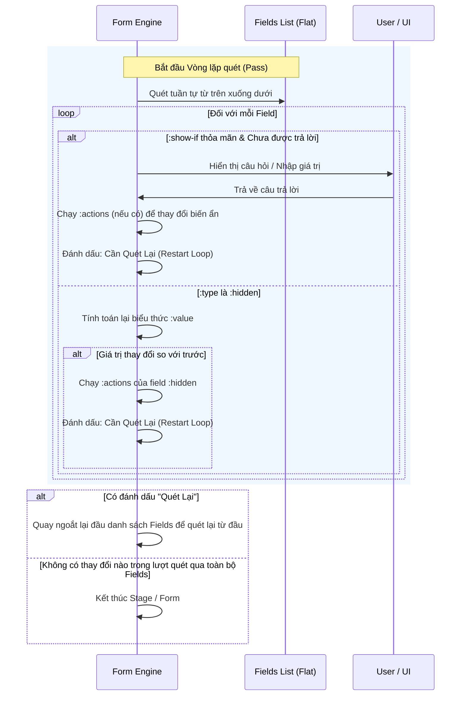

# Hướng Dẫn Thiết Kế Biểu Mẫu EDN (bb-form EDN Form Guide)

Tài liệu này là cẩm nang toàn diện dành cho cả **Lập trình viên (Con người)** và **Tác nhân AI (AI Agents)** để thiết kế, lập trình và xây dựng các biểu mẫu (forms) thông minh dưới định dạng EDN (Extensible Data Notation) trong dự án `bb-form`.

`bb-form` hỗ trợ tính toán thời gian thực, rẽ nhánh logic phức tạp, chia giai đoạn (stages), quản lý biến ẩn (hidden variables), liên kết các hàm Clojure/EDN tự viết và tích hợp các mô hình thống kê Bayesian (Stan MCMC) cùng khả năng biên dịch sang web Forms.md.

---

## 1. Cấu Trúc Tổng Thể Của Một File EDN Form

Mỗi biểu mẫu EDN là một bản đồ (map) Clojure. Dưới đây là khung cấu trúc đầy đủ chứa tất cả các miền cấu hình cấp cao nhất:

```clojure
{;; === THÔNG TIN CHUNG ===
 :title             "Tiêu đề của Biểu Mẫu"
 :description       "Mô tả chi tiết về mục đích hoặc hướng dẫn của biểu mẫu này."
 :format            :normal                       ; Định dạng chạy form: :normal (rẽ nhánh thông thường) hoặc :expert (hệ chuyên gia)
 :id                "survey-id-unique"           ; Định danh cho formsmd (tùy chọn)
 :submit-button-text "Hoàn thành & Gửi"           ; Nhãn nút gửi trên web formsmd (tùy chọn)
 :restart-button    "show"                        ; Hiển thị nút làm lại trên web: "show" | "hide"
 :post-url          "https://api.yourdomain/submit" ; Endpoint nhận dữ liệu POST trên web

 ;; === THƯ VIỆN ĐỘT NHẬP (IMPORTS) ===
 :import [;; Nhập file Clojure (.clj) và đặt bí danh (alias)
          ["../formulas/candidate_score.clj" :as :score]
          ;; Nhập file công thức EDN (.edn) dùng namespace trực tiếp
          "../formulas/cardio_risk.edn"]

 ;; === BIẾN ẨN TOÀN CỤC (GLOBAL VARIABLES) ===
 :variables {:diem_tin_dung 100
             :trang_thai "Chờ duyệt"
             :stan_result {}}

 ;; === PHÂN GIAI ĐOẠN (:stages) HOẶC DANH SÁCH CÂU HỎI PHẲNG (:fields) ===
 ;; Sử dụng :stages nếu form cần phân bước phức tạp. Dưới đây là ví dụ dùng :stages:
 :stages
 [{:id :stage_thong_tin_co_ban
   :show-if [:default] ; Điều kiện hiển thị Stage
   :on-begin [[:print "▶ Bắt đầu khảo sát thông tin cơ bản"]]
   :fields
   [{:id       :ho_ten
     :label    "Họ và tên đầy đủ"
     :type     :text
     :required true}]
   :on-complete [[:print "Đã lưu thông tin cơ bản!"]]}]}
```

> [!TIP]
> Nếu biểu mẫu đơn giản, không cần chia bước, bạn có thể loại bỏ hoàn toàn key `:stages` và khai báo trực tiếp key `:fields [...]` ở cấp cao nhất của map (ngang hàng với `:title`).

---

## 2. Cấu Hình Cấp Biểu Mẫu (Global Configuration)

### 2.1. Nhóm Khai Báo metadata
- **`:title`** (Kiểu: `String` - Bắt buộc): Tiêu đề của biểu mẫu được in đậm nổi bật ở phần header.
- **`:description`** (Kiểu: `String` - Tùy chọn): Mô tả hoặc lời chào giới thiệu nằm ngay dưới tiêu đề.
- **`:format`** (Kiểu: `Keyword` - Tùy chọn): Khai báo định dạng của form. Nhận giá trị `:expert` để tự động kích hoạt chế độ **Hệ chuyên gia (Expert System)** với bộ giải ngược và RETE rules. Nếu không khai báo hoặc nhận `:normal` (mặc định), hệ thống sẽ chạy ở chế độ câu hỏi rẽ nhánh thông thường.
- **`:id`** (Kiểu: `String` - Tùy chọn): Định danh của form. Được dùng làm thuộc tính `#! id` khi biên dịch sang Forms.md.
- **`:submit-button-text`** (Kiểu: `String` - Tùy chọn): Nhãn của nút bấm gửi kết quả ở slide cuối cùng của Forms.md.
- **`:restart-button`** (Kiểu: `String` - Tùy chọn): Nhận giá trị `"show"` hoặc `"hide"`. Quyết định xem Forms.md có hiện nút "Restart" để điền lại hay không.
- **`:post-url`** (Kiểu: `String` - Tùy chọn): Địa chỉ API Endpoint để Forms.md gửi phương thức POST chứa JSON payload kết quả của người dùng.

### 2.2. Nhập Thư Viện Hàm (`:import`)
Miền `:import` nhận một vector chứa các đường dẫn tương đối (tính từ thư mục chứa file form hiện tại) để nạp các file logic ngoài.
- **Dạng chuỗi đơn giản**: `"../formulas/cardio_risk.edn"`
  - Sẽ nạp thư viện và sử dụng namespace được khai báo trong file đó để gọi hàm (ví dụ: `:cardio-risk/calc-risk`).
- **Dạng vector thiết lập bí danh (`:as`)**: `["../formulas/candidate_score.clj" :as :score]`
  - Cho phép rút gọn tên gọi khi tham chiếu. Hàm `analyze-candidate` trong namespace của file trên sẽ được gọi thông qua `:score/analyze-candidate`.

### 2.3. Khai Báo Biến Ẩn Toàn Cục (`:variables`)
Nhận một map chứa các cặp `khóa giá-trị`.
```clojure
:variables {:score 0 :role "Chưa xác định" :result_map {}}
```
- Các biến này tồn tại trong suốt vòng đời chạy form.
- Chúng không bao giờ hiển thị trực tiếp thành câu hỏi cho người dùng nhập.
- Chúng được truy cập bằng toán tử `[:var :tên_biến]` và thay đổi giá trị bằng hành động `[:set :tên_biến biểu_thức]`.

---

## 3. Hệ Thống Giai Đoạn (`:stages`)

Đối với các form lớn, việc chia nhỏ thành các Stage (Slide) giúp tối ưu trải nghiệm điền dữ liệu. Cấu trúc một Stage bao gồm:

```clojure
{:id          :nhom_suc_khoe           ; (Keyword - Bắt buộc) Định danh Stage
 :show-if     [:= [:var :tuoi] 18]     ; (Vector Logic - Tùy chọn) Điều kiện hiển thị Stage
 :on-begin    [[:set :flag_stage 1]]   ; (Vector Actions - Tùy chọn) Chạy trước khi vào Stage
 :fields      [...]                    ; (Vector Fields - Bắt buộc) Danh sách câu hỏi trong Stage
 :on-complete [[:print "Hoàn tất"]]    ; (Vector Actions - Tùy chọn) Chạy sau khi điền hết Stage
}
```

### Các Thuộc Tính Của Stage:
1. **`:id`**: Định danh duy nhất dạng Keyword.
2. **`:show-if`**: Biểu thức logic EDN quyết định việc có hiển thị stage này hay không. Nếu biểu thức trả về `false`, toàn bộ stage (bao gồm tất cả các field bên trong) sẽ bị bỏ qua.
   - *Lưu ý đối với Forms.md*: Hệ thống sẽ tự động biên dịch điều kiện này sang cú pháp nhảy slide đặc trưng của Forms.md (`-> điều_kiện_js`).
3. **`:on-begin`**: Danh sách các hành động side-effect (ví dụ: `:set`, `:print`) chạy ngay trước khi hiển thị câu hỏi đầu tiên của Stage.
4. **`:on-complete`**: Danh sách các hành động chạy ngay sau khi người dùng trả lời xong câu hỏi cuối cùng được hiển thị trong Stage đó.

---

## 4. Cấu Hình Câu Hỏi Chi Tiết (`:fields`)

Key `:fields` nhận một vector chứa các map định nghĩa câu hỏi hoặc biến tính toán cục bộ.

### 4.1. Các Thuộc Tính Chung Cho Mọi Field

| Thuộc tính | Kiểu dữ liệu | Mô tả |
| :--- | :--- | :--- |
| **`:id`** | `Keyword` | (Bắt buộc) Định danh duy nhất để lưu đáp án của trường này vào kết quả. |
| **`:type`** | `Keyword` | (Bắt buộc) Kiểu của trường: `:text`, `:number`, `:date`, `:datetime`, `:select`, `:radio`, `:multiselect`, `:hidden`, `:info`. |
| **`:label`** | `String` hoặc `Vector` | (Bắt buộc, trừ `:hidden`) Nội dung hiển thị câu hỏi. Hỗ trợ nhãn động và nhãn điều kiện (Xem mục 4.3). |
| **`:required`** | `Boolean` | Thiết lập trường bắt buộc (`true` / `false`). Mặc định là `false`. |
| **`:show-if`** | `Vector` | Điều kiện logic để hiển thị trường này. |
| **`:actions`** | `Vector` | Danh sách các action chạy ngay sau khi người dùng trả lời xong trường này. |
| **`:form`** | `String` | Ánh xạ giao diện chuyên biệt trên Web Forms.md (Xem mục 4.4). |
| **`:placeholder`**| `String` | Gợi ý mờ hiển thị trong khung nhập liệu. |

---

### 4.2. Chi Tiết Từng Kiểu Field (`:type`) và Thuộc Tính Riêng Biệt

#### 1. `:text` (Nhập văn bản một dòng)
- **Các tùy chọn riêng biệt**:
  - `:regex` (Kiểu: `String`): Chuỗi biểu thức chính quy (Regex) để kiểm định tính hợp lệ của giá trị nhập. Ví dụ: `"^NV[0-9]{3}$"`.
  - `:regexError` (Kiểu: `String`): Thông báo lỗi hiển thị trên Terminal/Web khi người dùng nhập sai định dạng regex.
- **Ví dụ**:
  ```clojure
  {:id         :ma_nhan_vien
   :type       :text
   :label      "Nhập mã nhân viên của bạn"
   :required   true
   :regex      "^NV[0-9]{3}$"
   :regexError "Mã nhân viên phải có định dạng NV + 3 chữ số (Ví dụ: NV001)"}
  ```

#### 2. `:number` (Nhập số nguyên)
- **Các tùy chọn riêng biệt**:
  - `:min` (Kiểu: `Number`): Giá trị tối thiểu cho phép nhập.
  - `:max` (Kiểu: `Number`): Giá trị tối đa cho phép nhập.
  - `:step` (Kiểu: `Number`): Bước tăng/giảm (chỉ áp dụng đối với Forms.md).
- **Ví dụ**:
  ```clojure
  {:id       :tuoi
   :type     :number
   :label    "Số tuổi của bạn?"
   :required true
   :min      1
   :max      120}
  ```

#### 3. `:date` và `:datetime` (Trường thời gian và các biến thể)

Các trường thời gian hỗ trợ 2 kiểu trường nền tảng khác nhau và chuẩn hóa đầu ra tự động:
- **`:date`**: Lưu trữ định dạng `YYYY-MM-DD 00:00`. Nếu để trống (nhấn Enter), mặc định là ngày hôm nay lúc `00:00`.
- **`:datetime`**: Nhập đầy đủ ngày giờ hoặc chỉ nhập giờ (khi chỉ nhập giờ, ngày mặc định là ngày hôm nay hoặc tính theo offset ngày đi kèm). Lưu trữ định dạng `YYYY-MM-DD HH:mm`.

##### Cơ Chế Nhập Rút Gọn (Shortcuts) Cực Kỳ Linh Hoạt:
- **Rút gọn ngày**:
  - `DD` (ví dụ: `23` $\rightarrow$ ngày 23 của tháng hiện tại, năm hiện tại).
  - `DDMM` (ví dụ: `2304` $\rightarrow$ ngày 23 tháng 04 của năm hiện tại).
  - `DDMMYYYY` (ví dụ: `23042025` $\rightarrow$ ngày 23-04-2025).
- **Rút gọn ngày kèm sai số ngày (day offset) hoặc năm (year offset)**:
  - `DD[+-]N` (ví dụ: `23+10` $\rightarrow$ ngày 23 của tháng hiện tại cộng thêm 10 ngày. Nếu thời điểm hiện tại là `23-07-2026`, nó sẽ tự động tính toán thành `02-08-2026`).
  - `DDMM[+-]N` (ví dụ: `2304-1` $\rightarrow$ ngày 23-04 của năm trước năm hiện tại. Nếu năm hiện tại là `2026`, nó sẽ thành `23-04-2025`).
- **Rút gọn giờ**:
  - `hHHMM` (ví dụ: `h0823` $\rightarrow$ 08h23, ngày mặc định là hôm nay).
- **Rút gọn giờ kèm sai số ngày (day offset)**:
  - `hHHMM-N` (ví dụ: `h0823-1` $\rightarrow$ 08h23, ngày trước ngày hôm nay 1 ngày).
  - `hHHMM+N` (ví dụ: `h0823+2` $\rightarrow$ 08h23, ngày sau ngày hôm nay 2 ngày).
- **Kết hợp rút gọn ngày + giờ**:
  - `DD hHHMM` (ví dụ: `23 h0835` $\rightarrow$ ngày 23 của tháng hiện tại năm hiện tại, giờ 08:35).
  - `DD[+-]N hHHMM` (ví dụ: `23+10 h0835` $\rightarrow$ ngày 23 của tháng hiện tại cộng thêm 10 ngày, giờ 08:35).
  - `DDMM[+-]N hHHMM` (ví dụ: `2304-1 h0834` $\rightarrow$ ngày 23 tháng 04 năm trước, giờ 08:34).
  - `DD-MM-YYYY hHHMM` (ví dụ: `23-04-2026 h0834` $\rightarrow$ ngày 23 tháng 04 năm 2026, giờ 08:34).
  - *Lưu ý*: Nếu nhập cả ngày viết tắt lẫn giờ có offset (ví dụ: `2304 h0834-1`), offset ngày sẽ được tính dựa trên ngày được chỉ định (tức là 23-04-2026 trừ đi 1 ngày thành 22-04-2026).

#### 4. `:select` hoặc `:radio` (Lựa chọn một giá trị duy nhất)
- **Các tùy chọn riêng biệt**:
  - `:options` (Kiểu: `Vector` của `String` hoặc `Keyword`): Danh sách các lựa chọn hiển thị.
- **Ví dụ**:
  ```clojure
  {:id       :gioi_tinh
   :type     :select
   :label    "Giới tính"
   :options  ["Nam" "Nữ" "Khác"]
   :required true}
  ```

#### 5. `:multiselect` (Lựa chọn nhiều giá trị)
- **Đặc điểm Terminal (TUI)**: Sử dụng phím mũi tên để di chuyển, nhấn phím `Space` (khoảng trắng) để chọn/bỏ chọn, nhấn `Enter` để xác nhận toàn bộ.
- **Các tùy chọn riêng biệt**:
  - `:options` (Kiểu: `Vector` của `String` hoặc `Keyword`): Các lựa chọn.
- **Đầu ra**: Trả về một mảng/danh sách chứa các chuỗi đã chọn.

#### 6. `:hidden` (Biến địa phương tính toán động)
- Không bao giờ hiển thị trên giao diện người dùng. Được dùng để tính toán các giá trị trung gian.
- **Các tùy chọn riêng biệt**:
  - **`:value`** (Kiểu: `Vector` biểu thức - Bắt buộc): Biểu thức tính toán tự động dựa trên các toán tử.
- **Ví dụ**:
  ```clojure
  {:id    :chi_so_double_score
   :type  :hidden
   :value [:* [:var :diem_gốc] 2]}
  ```

#### 7. `:info` (Hiển thị văn bản đọc/thông báo)
- Không nhận dữ liệu nhập từ người dùng. Nó hiển thị một nội dung nhãn tĩnh hoặc động và nhấn Enter để tiếp tục.
- **Đầu ra**: Nhãn sau khi giải quyết xong (resolved label) sẽ được tự động lưu vào file kết quả đầu ra dưới dạng kết quả của trường này.
- **Ví dụ**:
  ```clojure
  {:id    :thong_bao_ket_qua
   :type  :info
   :label "Chúc mừng bạn đã vượt qua bài thi với điểm số {{[:var :diem_so]}}."}
  ```

---

### 4.3. Nhãn Động (Dynamic & Conditional Labels)

Nhãn câu hỏi (`:label`) trong `bb-form` cực kỳ linh hoạt và có thể biểu diễn dưới 2 dạng:

#### Dạng 1: Chuỗi nội suy tĩnh/động (Interpolated String)
Sử dụng cú pháp cặp ngoặc nhọn kép `{{...}}`. Bên trong ngoặc nhọn có thể là một Keyword để lấy giá trị biến nhanh, hoặc là một biểu thức EDN Logic hoàn chỉnh.
- **Ví dụ lấy biến nhanh**: `"Chào {{ho_ten}}, bạn khỏe không?"`
- **Ví dụ biểu thức logic nhúng**: `"Điểm số của bạn là {{[:+ [:var :diem_ly_thuyet] [:var :diem_thuc_hanh]]}} điểm."`

#### Dạng 2: Vector điều kiện rẽ nhánh (Conditional Label Vector)
Nhận một vector chứa các map điều kiện. Hệ thống sẽ duyệt từ trên xuống dưới, hiển thị nhãn của điều kiện đầu tiên khớp với logic hiện tại. Điều kiện cuối cùng dùng `:default` làm fallback.
```clojure
:label [{:show-if [:< [:var :diem_tin_dung] 50]
         :text "CẢNH BÁO: Điểm tín dụng của bạn quá thấp ({{[:var :diem_tin_dung]}})."
        }
        {:show-if [:default]
         :text "Trạng thái tín dụng của bạn an toàn ({{[:var :diem_tin_dung]}})."}]
```

---

### 4.4. Ánh Xạ Giao Diện Web Cao Cấp Với `:form`
Khi biên dịch sang giao diện HTML tĩnh chạy trên trình duyệt thông qua engine `formsmd`, thuộc tính `:form` (không phân biệt chữ hoa/thường) được ánh xạ sang các thành phần giao diện (Constructors) chuyên biệt của Forms.md:

| Giá trị `:form` | Type nền tảng | Constructor trong Forms.md | Hành vi hiển thị trên Web |
| :--- | :--- | :--- | :--- |
| `"Email"` | `:text` | `EmailInput` | Tự động xác thực định dạng email, hiện bàn phím `@` trên mobile. |
| `"Tel"` / `"Telephone"`| `:text` | `TelInput` | Mở bàn phím số điện thoại trên di động. |
| `"URL"` | `:text` | `URLInput` | Ràng buộc định dạng link bắt đầu bằng `http`/`https`. |
| `"Password"` | `:text` | `PasswordInput` | Ẩn ký tự nhập thành dấu chấm tròn bảo mật. |
| `"Rating"` | `:number`| `RatingInput` | Giao diện chọn số sao trực quan (1-5 sao). |
| `"OpinionScale"` | `:number`| `OpinionScale` | Hiển thị thang điểm ngang NPS từ 0 đến 10. |
| `"Datetime"` | `:datetime` | `DatetimeInput` | Hộp thoại chọn Ngày và Giờ kết hợp. |
| `"Time"` | `:datetime` | `TimeInput` | Hộp thoại chọn Giờ phút (HH:MM). |

*Lưu ý: Các Terminal Engine (Gum và TUI) sẽ tự động bỏ qua thuộc tính `:form` này và dùng kiểu `:type` nền tảng tương thích để chạy mượt mà trên CLI.*

---

## 5. Trình Thông Dịch Logic (EDN Logic Operators)

Trình thông dịch logic của `bb-form` hoạt động theo cú pháp Lisp/Clojure: `[:toán_tử tham_số_1 tham_số_2 ...]`.

Dưới đây là bảng tra cứu đầy đủ 26 toán tử tích hợp sẵn trong nhân hệ thống:

### 5.1. Nhóm Truy Xuất Dữ Liệu
*   **`[:var :ten_bien]`**
    *   *Mô tả*: Lấy giá trị hiện tại của câu hỏi hoặc biến ẩn có định danh `:ten_bien`.
    *   *Ví dụ*: `[:var :ho_ten]` $\rightarrow$ `"Nguyen Van A"`
*   **`[:get map_expr :key]`**
    *   *Mô tả*: Trích xuất giá trị của một khóa từ một đối tượng bản đồ (map). Cực kỳ hữu dụng khi xử lý kết quả trả về của các mô hình Bayesian hoặc thư viện tính toán ma trận.
    *   *Ví dụ*: `[:get [:var :stan_result] :prob]` $\rightarrow$ `78`

### 5.2. Nhóm So Sánh
*   **`[:= expr1 expr2 ...]`**
    *   *Mô tả*: Kiểm tra tất cả các biểu thức truyền vào có bằng nhau hay không.
    *   *Ví dụ*: `[:= [:var :gioi_tinh] "Nam"]`
*   **`[:!= expr1 expr2]`**
    *   *Mô tả*: Kiểm tra hai biểu thức có khác nhau không.
    *   *Ví dụ*: `[:!= [:var :vai_tro] "Admin"]`
*   **`[:> expr1 expr2]`**, **`[:< expr1 expr2]`**, **`[:>= expr1 expr2]`**, **`[:<= expr1 expr2]`**
    *   *Mô tả*: Phép so sánh lớn hơn, nhỏ hơn, lớn hơn hoặc bằng, nhỏ hơn hoặc bằng đối với số.
    *   *Ví dụ*: `[:>= [:var :tuoi] 18]`

### 5.3. Nhóm Logic Boolean
*   **`[:and expr1 expr2 ...]`**
    *   *Mô tả*: Trả về `true` nếu mọi biểu thức con đều đúng.
    *   *Ví dụ*: `[:and [:= [:var :phong_ban] "Kỹ thuật"] [:>= [:var :kinh_nghiem] 3]]`
*   **`[:or expr1 expr2 ...]`**
    *   *Mô tả*: Trả về `true` nếu có ít nhất một biểu thức con đúng.
    *   *Ví dụ*: `[:or [:= [:var :bang_cap] "Thạc sĩ"] [:= [:var :bang_cap] "Tiến sĩ"]]`
*   **`[:not expr]`**
    *   *Mô tả*: Phủ định giá trị logic của biểu thức.
    *   *Ví dụ*: `[:not [:var :co_tien_su_benh]]`

### 5.4. Nhóm Toán Học
*   **`[:+ expr1 expr2 ...]`**, **`[:- expr1 expr2 ...]`**, **`[:* expr1 expr2 ...]`**, **`[:/ expr1 expr2 ...]`**
    *   *Mô tả*: Phép cộng, trừ, nhân, chia số. Nếu giá trị biến chưa tồn tại hoặc bị lỗi, hệ thống mặc định coi là `0`.
    *   *Ví dụ*: `[:+ [:var :diem_toan] [:var :diem_van]]`
*   **`[:mod expr1 expr2]`**
    *   *Mô tả*: Lấy phần dư của phép chia `expr1` cho `expr2`.
    *   *Ví dụ*: `[:mod [:var :so_thu_tu] 2]`

### 5.5. Nhóm Xử Lý Chuỗi (String)
*   **`[:str/includes? s sub]`**
    *   *Mô tả*: Kiểm tra xem chuỗi `s` có chứa chuỗi con `sub` hay không.
    *   *Ví dụ*: `[:str/includes? [:var :email] "@gmail.com"]`
*   **`[:str/lower-case s]`**
    *   *Mô tả*: Chuyển chuỗi `s` thành chữ thường.
    *   *Ví dụ*: `[:str/lower-case [:var :ho_ten]]` $\rightarrow$ `"nguyen van a"`
*   **`[:str/upper-case s]`**
    *   *Mô tả*: Chuyển chuỗi `s` thành chữ hoa.
    *   *Ví dụ*: `[:str/upper-case [:var :quoc_gia]]` $\rightarrow$ `"VIETNAM"`

### 5.6. Nhóm Mảng và Tập Hợp (Collections)
*   **`[:contains? coll item]`**
    *   *Mô tả*: Kiểm tra xem tập hợp `coll` (thường là kết quả của `:multiselect`) có chứa phần tử `item` hay không.
    *   *Ví dụ*: `[:contains? [:var :ky_nang] "Ngoại ngữ"]`
*   **`[:count coll]`**
    *   *Mô tả*: Lấy kích thước (số lượng phần tử) của mảng hoặc độ dài chuỗi.
    *   *Ví dụ*: `[:count [:var :so_thich]]`
*   **`[:first coll]`**
    *   *Mô tả*: Lấy phần tử đầu tiên của tập hợp.
    *   *Ví dụ*: `[:first [:var :danh_sach_chon]]`
*   **`[:concat coll1 coll2 ...]`**
    *   *Mô tả*: Ghép nhiều mảng lại với nhau thành một mảng phẳng duy nhất.
    *   *Ví dụ*: `[:concat [:var :mang_a] [:var :mang_b]]`
*   **`[:array expr1 expr2 ...]`**
    *   *Mô tả*: Tạo một mảng mới từ các giá trị biểu thức con truyền vào.
    *   *Ví dụ*: `[:array [:var :diem_1] [:var :diem_2]]`

### 5.7. Nhóm Đặc Biệt & Nhúng
*   **`[:if dieu_kien then_expr else_expr]`**
    *   *Mô tả*: Rẽ nhánh biểu thức. Nếu `dieu_kien` đúng, tính toán và trả về giá trị của `then_expr`, ngược lại trả về `else_expr`.
    *   *Ví dụ*: `[:if [:= [:var :loai_khach] "VIP"] 20 0]`
*   **`[:call :alias/ten_ham tham_so1 ...]`**
    *   *Mô tả*: Gọi một hàm được định nghĩa trong thư viện công thức ngoài đã được import ở đầu file.
    *   *Ví dụ*: `[:call :score/tinh_toan [:var :ui_score]]`
*   **`[:default]`**
    *   *Mô tả*: Toán tử luôn trả về `true`. Thường dùng làm nhánh mặc định cuối cùng trong cấu trúc nhãn điều kiện.

---

## 6. Hiệu Ứng Phụ & Chỉnh Sửa Trạng Thái (`:actions`)

Các action thường xuất hiện trong `:on-begin` của Stage, `:on-complete` của Stage, hoặc thuộc tính `:actions` gắn liền với từng field. Mỗi action là một vector có dạng `[:tên_action tham_số_1 tham_số_2 ...]`.

Có 2 lệnh action được hỗ trợ:

### 6.1. Lệnh Gán Biến (`:set`)
Dùng để thay đổi giá trị của một biến ẩn toàn cục được khai báo trong `:variables`.
- **Cú pháp**: `[:set :tên_biến biểu_thức_logic]`
- **Ví dụ**:
  ```clojure
  ;; Thay đổi trạng thái duyệt dựa trên tuổi
  [:set :trang_thai [:if [:>= [:var :tuoi] 18] "Đủ điều kiện" "Không đủ điều kiện"]]
  ```

### 6.2. Lệnh In Ra Màn Hình (`:print`)
Hiển thị một thông báo văn bản ra cửa sổ terminal và tạm dừng luồng hoạt động (người dùng nhấn Enter để tiếp tục).
- **Cú pháp**: `[:print biểu_thức_hoặc_chuỗi]`
- **Ví dụ**:
  ```clojure
  [:print "Cảnh báo: Dữ liệu bạn nhập không đồng nhất!"]
  ```

---

## 7. Xây Dựng Thư Viện Hàm Ngoài (Formulas)

Để giữ cho file EDN biểu mẫu ngắn gọn và dễ bảo trì, hãy tách các logic nghiệp vụ phức tạp ra thành các file thư viện ngoài trong thư mục `formulas/`. Hệ thống hỗ trợ 2 định dạng file:

### 7.1. Viết Thư Viện Bằng File Clojure (`.clj`)
Đây là cách mạnh mẽ nhất. Bạn có thể sử dụng tất cả tính năng của Clojure, import các thư viện Maven/Babashka Java Interop, gọi tiến trình con, v.v.

*Lưu ý: Tên namespace (`ns`) khai báo ở dòng đầu phải khớp với đường dẫn tương đối và quy tắc đặt tên của Clojure.*

```clojure
;; file: formulas/candidate_score.clj
(ns formulas.candidate-score
  (:require [clojure.string :as str]))

(defn calculate-average [scores]
  (if (empty? scores)
    0
    (/ (apply + scores) (count scores))))

(defn classify [avg]
  (cond
    (>= avg 8.0) "Xuất sắc"
    (>= avg 5.0) "Đạt"
    :else "Không đạt"))
```

### 7.2. Viết Thư Viện Bằng File EDN (`.edn`)
Thích hợp cho các công thức tính toán đơn giản, không muốn tạo hẳn file code Clojure. File EDN Formula có cấu trúc chuẩn như sau:

```clojure
;; file: formulas/math_lib.edn
{:ns :math-lib
 :consts {:pi 3.14159
          :he_so_k 1.5}
 :fns {:tinh-dien-tich
       ;; Sử dụng ký hiệu đặc biệt 'consts' để truy cập miền hằng số bên trên
       (fn [radius] (* (:pi consts) radius radius))
       
       :tinh-diem-chuan
       (fn [diem_goc] (* diem_goc (:he_so_k consts)))}}
```

---

## 8. Lập Trình Thống Kê Bayesian (Stan/MCMC Integration)

`bb-form` cho phép tích hợp trực tiếp các mô hình dự báo Bayesian được biên dịch bằng **Stan** (thông qua `cmdstan` / `cmdstanpy` của Python) và trả về phân phối xác suất hậu nghiệm (posterior distribution) hoàn chỉnh.

### Quy Trình Thiết Kế Và Tích Hợp:

```mermaid
graph TD
    A[EDN Form: User Answer] -->|Field Action :call| B[Clojure Formula Wrapper]
    B -->|shell/sh python bridge| C[Python Script: cmdstanpy]
    C -->|Run MCMC sampling| D[Stan C++ Binary]
    D -->|Posterior samples| C
    C -->|Return Summary JSON| B
    B -->|Parse JSON to Map| E[Save to :variables]
    E -->|[:get] operator| F[Dynamic Label / Info Display]
```

1.  **Viết Mô Hình Stan**: Định nghĩa mô hình xác suất trong file `.stan` (ví dụ: `formulas/stan_models/hiring_model.stan`).
2.  **Viết Python Bridge**: Tạo một script Python nhận dữ liệu qua đối số JSON dòng lệnh, thực thi mô hình qua `cmdstanpy`, tóm tắt phân phối (trung bình posterior, khoảng tin cậy 95% HDI) và in ra JSON chuẩn.
3.  **Viết Clojure Wrapper**:
    ```clojure
    (defn run-stan-model [exp score]
      ;; Sử dụng clojure.java.shell/sh để gọi Python bridge
      (let [result (shell/sh "python" "run_model.py" (json/generate-string {:exp exp :score score}))]
        (json/parse-string (:out result) true)))
    ```
4.  **Cấu Hình Trong Form EDN**:
    ```clojure
    :import [["../formulas/bayesian_hiring.clj" :as :stan]]
    :variables {:stan_result {}}
    :fields
    [;; ... Các câu hỏi nhập ...
     {:id :test_score :type :number :label "Điểm test"
      :actions [[:set :stan_result [:call :stan/run-stan-model [:var :exp] [:var :test_score]]]]}
     
     ;; Hiển thị kết quả ước lượng kèm độ bất định (uncertainty)
     {:id :display_result :type :info
      :label "Khả năng thành công: {{[:get [:var :stan_result] :prob]}}% (Khoảng tin cậy 95%: {{[:get [:var :stan_result] :lower_bound]}}% - {{[:get [:var :stan_result] :upper_bound]}}%)"}]
    ```

---

## 9. Cơ Chế Thuật Toán "Restarting Loop"

Để thiết kế các form rẽ nhánh thông minh và có tính tương tác cao, bạn cần hiểu rõ cách thức vận hành của Engine bên trong `bb-form`.



### Ứng Dụng Thiết Kế Nhánh Ngược (Backward Dependency):
Nhờ cơ chế tự động quét lại từ đầu mỗi khi có câu trả lời mới hoặc biến ẩn bị thay đổi, bạn có thể thiết kế một câu hỏi rẽ nhánh nằm ở **phía trên** của danh sách `:fields`, nhưng điều kiện hiển thị `:show-if` của nó lại phụ thuộc vào câu trả lời nằm ở **phía dưới**.
Khi người dùng cuộn đến và trả lời câu cuối, Engine sẽ phát hiện biến trạng thái thay đổi, lập tức khởi động lại vòng quét và làm xuất hiện "đột ngột" câu hỏi đầu tiên đó trên màn hình!

---

## 10. Chế Độ Marathon, Giải Quyết Xung Đột & Cơ Chế Giá Trị Mặc Định

Để tự động hóa việc điền và xuất dữ liệu mà không cần sự tương tác trực tiếp của người dùng (chế độ headless/marathon), `bb-form` tích hợp một cơ chế tìm kiếm đường đi (Pathfinder Solver) và xử lý giá trị mặc định cực kỳ mạnh mẽ.

### 10.1. Chế Độ Marathon (`--marathon`) là gì?
- **Khái niệm**: Là chế độ chạy tự động không tương tác. Hệ thống sẽ tự động điền các câu hỏi dựa trên các giá trị đã được cung cấp trước (`prefilled` qua CLI hoặc file `values`) và tự động áp dụng các giá trị mặc định (`:default`) cho các câu hỏi còn lại để đi tới đích cuối cùng.
- **Phân biệt với Chế độ Tương tác**:
  - Ở chế độ tương tác (TUI, Gum, Web Forms.md), thuộc tính `:default` trong file form EDN **hoàn toàn bị bỏ qua khi điền tự động**. Hệ thống bắt buộc phải hiển thị câu hỏi và chờ đợi người dùng nhập, trừ khi trường đó đã được khai báo cụ thể trong dữ liệu nhập (`values`).
  - Ở chế độ marathon, `:default` được dùng tích cực để tự điền và đi tiếp mà không dừng lại hỏi.

### 10.2. Phân Rã Dữ Liệu Nhập & Giải Quyết Xung Đột (Conflict Resolution)
Khi người dùng truyền vào một tập các giá trị trả trước (`prefilled` values) từ dòng lệnh hoặc từ file values:
1. **Chuẩn hóa kiểu dữ liệu (Parsing & Casting)**:
   - Các giá trị đầu vào ban đầu ở dạng chuỗi (String) sẽ được tự động phân tích và chuyển đổi thành đúng kiểu dữ liệu khai báo trong form EDN (ví dụ: chuyển `"18"` thành số `18` cho trường `:number`, hoặc `"Nam"` thành chuỗi tương ứng).
2. **Xác định Thứ tự Ưu tiên (Priority-based Sorting)**:
   - Các trường nhập được sắp xếp theo độ ưu tiên giảm dần dựa trên thuộc tính `:priority` được cấu hình trong mỗi trường (mặc định `:priority` là `0`). Các trường có độ ưu tiên cao hơn sẽ được giải quyết trước.
3. **Tìm Đường Đi và Giải Quyết Xung Đột (Pathfinder Backtracking)**:
   - Bộ giải đường đi (`solve-stages`) thực hiện duyệt đệ quy (backtracking search) qua các stage để tìm ra một tập hợp các giá trị đồng nhất thỏa mãn toàn bộ luật điều kiện logic (`:show-if`).
   - **Xử lý Xung đột**: Nếu người dùng cung cấp các giá trị mâu thuẫn nhau (ví dụ: khai báo `:ngoi_thai "Ngang"` nhưng lại cung cấp `:do_xoa_ctc "60%"` trong khi `:do_xoa_ctc` chỉ hiển thị khi ngôi thai là `"Đầu"` hoặc `"Mông"`), hệ thống sẽ:
     - Giữ lại giá trị của trường có độ ưu tiên cao hơn.
     - Loại bỏ (discard) các giá trị có độ ưu tiên thấp hơn gây xung đột ra khỏi tập câu trả lời được chấp nhận cuối cùng (`final-accepted`).
     - Trả về danh sách câu trả lời sạch, không xung đột để đảm bảo chương trình không bị crash và luôn chạy trên một đường đi logic hợp lệ.

### 10.3. Cách Thức Hoạt Động Của Giá Trị Mặc Định (`:default`)
Khi chạy ở chế độ Marathon, nếu một trường câu hỏi chưa có câu trả lời từ người dùng, hệ thống sẽ lấy giá trị mặc định theo thứ tự ưu tiên sau:
1. **Giá trị cấu hình tĩnh**: Lấy trực tiếp từ khóa `:default` khai báo trong trường (ví dụ: `:default "Đầu"`).
2. **Công thức tính toán động**: Nếu `:default` là một biểu thức logic EDN (ví dụ: `:default [:if [:= [:var :a] 1] "Đúng" "Sai"]`), hệ thống sẽ truyền ngữ cảnh câu trả lời hiện tại (`answers-atom`) vào để tính toán ra giá trị thực tế tại thời điểm đó.

### 10.4. Cơ Chế Lấy Giá Trị Tối Thiểu Thỏa Mãn (Fallback to Minimum Satisfying Value)
Nếu biểu mẫu được chạy ở chế độ Marathon nhưng trường đó **không được cấu hình thuộc tính `:default`**, để tránh việc luồng chạy bị tắc nghẽn, `bb-form` sẽ kích hoạt cơ chế fallback tự động sinh ra **giá trị nhỏ nhất/tối thiểu thỏa mãn** dựa trên kiểu dữ liệu của trường:
- **`:number`**: Nếu trường cấu hình giới hạn dưới `:min`, hệ thống lấy đúng giá trị `:min`. Nếu không có `:min`, mặc định trả về số `0`.
- **`:text`**: Trả về một chuỗi rỗng `""`.
- **`:date`**: Trả về ngày hiện tại lúc `00:00` (định dạng `YYYY-MM-DD 00:00`).
- **`:datetime`**: Trả về ngày và giờ hiện tại (định dạng `YYYY-MM-DD HH:mm`).
- **`:select` / `:radio`**: Lấy lựa chọn đầu tiên xuất hiện trong danh sách `:options`.
- **`:multiselect`**: Trả về một mảng rỗng `[]`.
- **`:info`**: Giải quyết nhãn động và trả về nội dung text tương ứng.

---

## 11. Hướng Dẫn Tác Nhân AI (AI Coding Guidelines)

Khi nhận yêu cầu viết, nâng cấp hoặc gỡ lỗi file form EDN, các tác nhân AI cần tuân thủ nghiêm ngặt các quy tắc sau:

1.  **Dùng Định Dạng Từ Khóa Cho ID**: Các khóa ID của câu hỏi hay biến ẩn phải viết bằng kiểu `Keyword` của Clojure (bắt đầu bằng dấu hai chấm, ví dụ: `:ho_ten`, không viết chuỗi `"ho_ten"` hoặc biểu tượng không có dấu hai chấm).
2.  **Đảm Bảo Mối Quan Hệ Biến Phụ Thuộc**: Khi viết biểu thức `:show-if` hay `:value` của trường `:hidden`, tất cả các biến trung gian được tham chiếu phải được bọc trong hàm `[:var :tên_biến]`.
3.  **Khai Báo `:variables` Đầy Đủ**: Bất cứ khi nào bạn sử dụng hành động `[:set :tên_biến ...]`, biến `:tên_biến` đó bắt buộc phải được khai báo giá trị khởi tạo trong map `:variables` toàn cục ở đầu file.
4.  **Tương Thích Đồng Thời Cả CLI & Web**:
    - Khi dùng các kiểu nhập nâng cao, hãy giữ `:type` nền tảng là `:text`, `:number`, `:date`, hoặc `:datetime` để chạy CLI bình thường, đồng thời khai báo thuộc tính `:form` kiểu chữ thường (ví dụ: `"email"`, `"rating"`, `"datetime"`, `"time"`) để Forms.md tự động ánh xạ giao diện web đẹp mắt.
    - Tránh dùng các kiểu type lạ không có trong danh sách chuẩn ở mục 4.2.
5.  **Thiết Kế Rẽ Nhánh Cấp Stage Cho Forms.md**: Khi muốn ẩn/hiện cả một Slide (Stage) lớn, hãy sử dụng thuộc tính `:show-if` ở cấp độ của Stage đó. Tránh việc bọc thủ công các field bên trong stage bằng biểu thức logic điều kiện, vì Forms.md sẽ dịch `:show-if` của Stage thành toán tử nhảy trang (`-> jump`) mượt mà hơn.
6.  **Tránh Sử Dụng Các Toán Tử Ngoài Danh Sách Tích Hợp**: Trình thông dịch logic `eval-expr` trong nhân hệ thống chỉ biên dịch các toán tử được khai báo ở mục 5. Hãy sử dụng `:call` kết hợp với import nếu cần xử lý các logic toán học phức tạp hay thao tác dữ liệu nâng cao nằm ngoài khả năng của trình thông dịch gốc.
