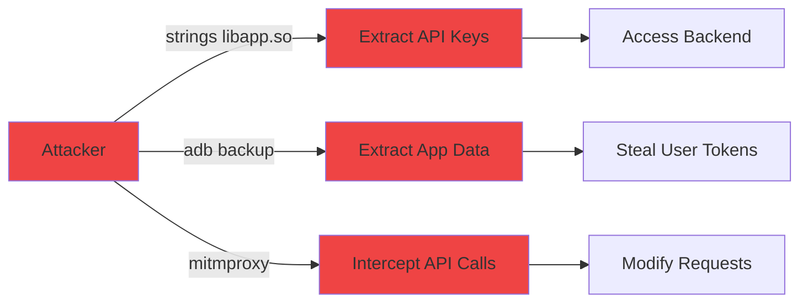
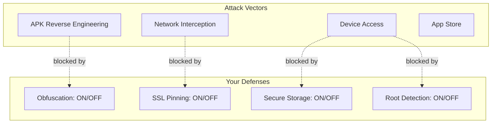

# Flutter Security Hardening Skill

**Version: 1.1.0**

Before starting any audit, run the update check (non-blocking, 3s timeout):
```bash
bash "${SKILL_PATH}/scripts/check-update.sh" "1.1.0"
```
If an update is available, show the user the update message. Then continue with the audit regardless.

This is the DEFENSE counterpart to the `flutter-reverse-engineering` skill. That skill shows how to break into Flutter apps. This skill PROTECTS them.

## Input Modes

### Mode A: Source Code (Default)
The user has the Flutter project source code. Scans code for vulnerabilities, offers fixes.

**How to detect:** User is in a Flutter project directory (has `pubspec.yaml` + `lib/`), or says
"secure my app", "security audit", "harden my app".

**Action:** Proceed to Phase 0 (source audit).

### Mode B: APK/XAPK File (Post-Build Verification)
The user provides a built APK — from `build/app/outputs/`, Downloads, or any path.
This is a **post-build security verification**: did your security measures actually survive compilation?

**How to detect:** User provides a `.apk` or `.xapk` path, or says "check my APK",
"audit my build", "is my release APK secure", "verify build/app/outputs/flutter-apk/app-release.apk".

**Example prompts:**
- "Check if my release APK is secure: build/app/outputs/flutter-apk/app-release.apk"
- "Audit this APK: C:/Users/me/Downloads/myapp.apk"
- "I built my app, verify the APK is hardened"
- "Scan my APK for leaked secrets"

**Action:** Proceed to [APK Security Audit](#apk-security-audit) instead of source audit.

### Mode C: Both (Source + APK)
If the user has both source code AND the built APK, run BOTH audits and **compare**:
- What the source code intends vs what the binary actually contains
- Did `--obfuscate` actually work? Compare class names in source vs strings in libapp.so
- Are there secrets in source that DON'T appear in the binary? (good — means they're server-side)
- Are there secrets in the binary that AREN'T in source? (bad — means a dependency leaks them)

**How to detect:** User is in a Flutter project AND provides an APK path, or says
"audit my project and verify the build too".

---

## APK Security Audit
*For Mode B and Mode C*

This is the "attacker's eye view" of your app. Extract and analyze the compiled APK
to find what's actually exposed.

### APK Step 1: Extract and Validate

```bash
WORK_DIR="./security-audit-output"
mkdir -p "$WORK_DIR"
unzip -o <apk_path> -d "$WORK_DIR/extracted"
```

Verify it's a Flutter app (check for `libflutter.so`, `libapp.so`, `flutter_assets/`).

### APK Step 2: Manifest Security Checks

Extract and check AndroidManifest.xml for:

```bash
# Use aapt2 to dump manifest (handles binary XML)
aapt2 dump xmltree <apk_path> --file AndroidManifest.xml 2>/dev/null
```

| Check | Secure Value | What to flag |
|-------|-------------|-------------|
| `android:debuggable` | `false` or absent | `true` = anyone can attach debugger |
| `android:allowBackup` | `false` | `true` = `adb backup` extracts all app data |
| `android:usesCleartextTraffic` | `false` | `true` = allows HTTP (not HTTPS) |
| `android:networkSecurityConfig` | Present | Missing = no certificate pinning config |
| `android:exported` on activities | Only intended ones | Unnecessary exports = attack surface |

Check permissions — flag dangerous ones without clear justification:
- `READ_PHONE_STATE`, `READ_CONTACTS`, `ACCESS_FINE_LOCATION` — needed?
- `WRITE_EXTERNAL_STORAGE` — still used or legacy?
- `SYSTEM_ALERT_WINDOW` — very suspicious unless overlay feature exists

### APK Step 3: Obfuscation Verification (THE KEY CHECK)

This proves whether `--obfuscate` actually worked:

```bash
# Extract strings from compiled Dart code
strings -n 6 "$WORK_DIR/extracted/lib/arm64-v8a/libapp.so" > "$WORK_DIR/dart_strings.txt"

# Check for readable class names — if obfuscated, these should be random
grep -E "^[A-Z][a-z]+[A-Z][a-zA-Z]+" "$WORK_DIR/dart_strings.txt" | head -50 > "$WORK_DIR/class_names_found.txt"

# Check for readable method names
grep -E "^(get|set|on|handle|fetch|load|save|update|delete|create)[A-Z]" "$WORK_DIR/dart_strings.txt" | head -50 > "$WORK_DIR/method_names_found.txt"
```

**Scoring:**
- If class/method names are readable (UserProvider, CallService, etc.) → **OBFUSCATION FAILED** (Critical)
- If names are random (aB3, xQ7, etc.) → Obfuscation working (Pass)
- If some readable, some not → Partial obfuscation (Warning — check which aren't obfuscated)

### APK Step 4: Secret Extraction Test

The most critical check — can an attacker extract your secrets?

```bash
# API keys and tokens
grep -iE "(api[_-]?key|api[_-]?secret|secret[_-]?key|access[_-]?token|private[_-]?key|bearer)" "$WORK_DIR/dart_strings.txt" | sort -u > "$WORK_DIR/leaked_secrets.txt"

# Hardcoded URLs with credentials
grep -E "https?://[^:]+:[^@]+@" "$WORK_DIR/dart_strings.txt" > "$WORK_DIR/urls_with_creds.txt"

# API endpoints (not secrets but shows attack surface)
grep -E "https?://" "$WORK_DIR/dart_strings.txt" | sort -u > "$WORK_DIR/api_endpoints.txt"

# Firebase config
grep -iE "(firebase|google-services|api_key|project_id|messaging_sender)" "$WORK_DIR/dart_strings.txt" | sort -u > "$WORK_DIR/firebase_config.txt"

# Razorpay/payment keys
grep -iE "(rzp_|razorpay|stripe|sk_live|pk_live|sk_test|pk_test)" "$WORK_DIR/dart_strings.txt" | sort -u > "$WORK_DIR/payment_keys.txt"

# Agora keys
grep -iE "(agora|app_?id|app_?certificate)" "$WORK_DIR/dart_strings.txt" | sort -u > "$WORK_DIR/agora_keys.txt"
```

**For each secret found:**
- Classify severity (Critical: payment keys, auth tokens. High: API keys. Medium: config IDs)
- Show exactly what string was extracted
- Show how to fix it (move to server-side, NDK, etc.)
- If source code is available (Mode C), show which file it came from

### APK Step 5: Network Security Config Check

```bash
# Check if network_security_config.xml exists in APK
ls "$WORK_DIR/extracted/res/xml/network_security_config.xml" 2>/dev/null

# Check for certificate pins
grep -i "pin-set\|pin digest" "$WORK_DIR/extracted/res/xml/network_security_config.xml" 2>/dev/null

# Check if cleartext is blocked
grep -i "cleartextTrafficPermitted" "$WORK_DIR/extracted/res/xml/network_security_config.xml" 2>/dev/null
```

| Finding | Severity |
|---------|----------|
| No network_security_config.xml at all | High |
| Config exists but no certificate pins | Medium |
| Config exists with pins | Pass |
| `cleartextTrafficPermitted="true"` on base-config | High |
| Cleartext only for localhost/10.0.2.2 | Pass (debug only) |

### APK Step 6: Native Library Security

```bash
# List all native libraries
find "$WORK_DIR/extracted/lib/" -name "*.so" | while read lib; do
  echo "$(basename $lib): $(du -h "$lib" | cut -f1)"
done

# Check if debug symbols are stripped
file "$WORK_DIR/extracted/lib/arm64-v8a/libapp.so" | grep -i "stripped\|not stripped"
```

**Check for:**
- `libapp.so` should be stripped (no debug symbols)
- No `libflutter_debug.so` (should be `libflutter.so` release variant)
- Third-party `.so` files should match known packages

### APK Step 7: Flutter Assets Audit

```bash
# Check for sensitive files in flutter_assets
find "$WORK_DIR/extracted/assets/flutter_assets/" -type f | sort

# Check for .env files accidentally bundled
find "$WORK_DIR/extracted/assets/" -name "*.env" -o -name ".env*" -o -name "config.json" -o -name "secrets*"

# Check for debug kernel (should NOT be in release)
ls "$WORK_DIR/extracted/assets/flutter_assets/kernel_blob.bin" 2>/dev/null
```

| Finding | Severity |
|---------|----------|
| `.env` file in assets | Critical |
| `kernel_blob.bin` present | Critical (debug build released!) |
| `config.json` with secrets | Critical |
| Only expected assets (images, fonts) | Pass |

### APK Step 8: Generate APK Security Score

Score the APK separately from source:

| Category | Max Points | What's checked |
|----------|-----------|----------------|
| Obfuscation | 20 | Class/method names unreadable in libapp.so |
| Secret Protection | 25 | No API keys, tokens, passwords in strings |
| Manifest Security | 15 | debuggable=false, allowBackup=false, no cleartext |
| Network Config | 15 | network_security_config exists with pins |
| Native Libraries | 10 | Stripped, release variant, no debug symbols |
| Asset Security | 10 | No .env, no kernel_blob.bin, no config secrets |
| Permissions | 5 | Only necessary permissions declared |
| **Total** | **100** | |

### APK Audit Report

Output as:
```markdown
# APK Security Audit: [app-name.apk]

## APK Security Score: [X/100]

## Binary vs Source Comparison (if both available)
| Check | Source Intent | Binary Reality | Match? |
|-------|-------------|----------------|--------|
| Obfuscation | --obfuscate in build script | Class names [readable/obfuscated] | [YES/NO] |
| API Keys | 3 keys in source | 2 keys visible in binary | NO — 1 leaked |
| allowBackup | Set to false in source | false in manifest | YES |
| ... | ... | ... | ... |

## Critical Findings
## High Findings
## Medium Findings
## Passed Checks
## Remediation Steps
```

After the APK audit, if the user also has source code, offer:
> "I found [N] issues in your APK. Want me to fix the source code so your next build is clean?"

Then proceed to the source-mode auto-fix phases.

---

## Overview

Run all phases sequentially. Phase 0 (audit) always runs first to establish baseline. Then walk through each phase, reporting findings and offering fixes. Phase 10 (auto-fix) runs when the user explicitly asks to fix/harden.

---

## Phase 0: Security Audit

**Run this FIRST on every invocation.** Scan the Flutter project and produce a security score.

### Steps

1. **Locate the Flutter project.** Look for `pubspec.yaml` in the working directory or prompt the user for the path.

2. **Check pubspec.yaml for security packages** (present or missing):
   ```bash
   # Check for these packages in pubspec.yaml:
   grep -E "flutter_secure_storage|freerasp|safe_device|flutter_jailbreak_detection|http_certificate_pinning|encrypt|firebase_app_check|local_auth" pubspec.yaml
   ```
   - Present: note version
   - Missing: flag as recommendation

3. **Scan for hardcoded secrets** in all `.dart` files:
   ```bash
   # Search for potential secrets
   grep -rn --include="*.dart" -E "(api[_-]?key|apiKey|secret|password|token|bearer|authorization|razorpay|agora.*app.*id|AGORA|RAZORPAY|firebase|private[_-]?key)" lib/
   grep -rn --include="*.dart" -E "(https?://[^ ]*@|https?://[^ ]*:[^ ]*@)" lib/
   grep -rn --include="*.dart" -E "(['\"][A-Za-z0-9_-]{20,}['\"])" lib/  # Long string literals that might be keys
   ```
   - Flag any hardcoded API keys, tokens, passwords, or base URLs containing credentials
   - Check for secrets in `const` declarations (these are embedded in the binary)
   - Check `--dart-define` usage in build scripts

4. **Check Android security settings:**
   ```bash
   # AndroidManifest.xml checks
   grep -r "debuggable" android/app/src/main/AndroidManifest.xml
   grep -r "allowBackup" android/app/src/main/AndroidManifest.xml
   grep -r "usesCleartextTraffic" android/app/src/main/AndroidManifest.xml
   
   # Network security config
   ls android/app/src/main/res/xml/network_security_config.xml 2>/dev/null
   
   # ProGuard
   ls android/app/proguard-rules.pro 2>/dev/null
   grep -r "minifyEnabled\|shrinkResources" android/app/build.gradle
   ```

5. **Check iOS security settings:**
   ```bash
   # ATS (App Transport Security)
   grep -A5 "NSAppTransportSecurity" ios/Runner/Info.plist
   grep "NSAllowsArbitraryLoads" ios/Runner/Info.plist
   ```

6. **Check sensitive data storage:**
   ```bash
   # SharedPreferences used for sensitive data?
   grep -rn --include="*.dart" "SharedPreferences" lib/ | grep -iE "(token|password|secret|key|auth|session|jwt|bearer)"
   
   # flutter_secure_storage usage?
   grep -rn --include="*.dart" "FlutterSecureStorage\|SecureStorage" lib/
   ```

7. **Check for SSL pinning:**
   ```bash
   grep -rn --include="*.dart" -iE "(certificate.*pin|ssl.*pin|pin.*certificate|SecurityContext|badCertificateCallback)" lib/
   ```

8. **Check obfuscation in build configs:**
   ```bash
   # Check build scripts, CI configs, Makefile, etc.
   grep -rn "obfuscate\|split-debug-info" . --include="*.yaml" --include="*.yml" --include="*.sh" --include="Makefile" --include="*.gradle"
   ```

9. **Check Firebase security** (if Firebase is used):
   - Look for `firebase.json`, `firestore.rules`, `database.rules.json`, `storage.rules`
   - Flag if rules contain `allow read, write: if true` or `".read": true, ".write": true`

10. **Check for debug code in release paths:**
    ```bash
    grep -rn --include="*.dart" -E "^[^/]*print\(|^[^/]*debugPrint\(" lib/ | head -20
    grep -rn --include="*.dart" "kDebugMode\|kReleaseMode\|kProfileMode" lib/
    ```

### Scoring

Calculate a score out of 100. Deduct points for each issue:

| Check | Points deducted if failing |
|-------|---------------------------|
| Hardcoded API keys/secrets in Dart code | -20 (CRITICAL) |
| No obfuscation configured | -15 |
| `allowBackup="true"` or not set | -10 |
| `debuggable="true"` in release | -10 |
| `usesCleartextTraffic="true"` | -10 |
| No network_security_config.xml | -5 |
| Tokens in SharedPreferences (not secure storage) | -10 |
| No SSL pinning | -8 |
| No root/jailbreak detection | -5 |
| No runtime protection (freerasp etc.) | -5 |
| NSAllowsArbitraryLoads=YES in iOS | -8 |
| Firebase rules too permissive | -10 |
| print() statements without kReleaseMode guard | -3 |
| No ProGuard/R8 configured | -5 |

**Score interpretation:**
- 90-100: Excellent. Production-hardened.
- 70-89: Good. A few improvements needed.
- 50-69: Moderate. Several security gaps.
- 30-49: Poor. Significant vulnerabilities.
- 0-29: Critical. App is wide open.

---

## Phase 1: Secret Protection

THE number one problem. Never store secrets in Dart code.

### What Is Extractable (the attacker's view)

Reference the `flutter-reverse-engineering` skill — everything it can extract is a vulnerability:

- **Any string literal in Dart code** is visible in `libapp.so` via `strings` command
- **`const` values** are embedded directly in the binary snapshot
- **`--dart-define` values** are still compiled into the binary, just slightly harder to find
- **`.env` files bundled as assets** are trivially extractable from the APK
- **SharedPreferences** are stored as plaintext XML at `/data/data/<package>/shared_prefs/`
- **Asset files** (JSON configs, certificates) are directly readable from the APK

### Solutions (ranked by security level)

#### 1. Server-Side Secrets (BEST)

Never put secrets in the app at all. The app authenticates with YOUR backend via JWT, and your backend holds the third-party API keys.

**Example — Razorpay:**
```
BEFORE (insecure):
  App has Razorpay key → App calls Razorpay directly
  
AFTER (secure):
  App calls YOUR backend → Backend has Razorpay key → Backend calls Razorpay
  App never sees the Razorpay key
```

**Example — Agora tokens:**
```
BEFORE (insecure):
  App has Agora App Certificate → App generates tokens locally

AFTER (secure):
  App calls YOUR backend → Backend has Agora App Certificate → Backend generates token → Returns token to app
  App only has the Agora App ID (which is public by design)
```

**Migration pattern:**
1. Identify every secret in the app
2. For each: can the operation be done server-side? If yes, move it.
3. Create a backend endpoint that performs the operation
4. App calls your endpoint instead

#### 2. Native Code Storage (GOOD)

For secrets that MUST be on-device (e.g., encryption keys for local data):

**Android — NDK/C++ via dart:ffi:**
```dart
// Secrets stored in native C code, compiled into .so file
// Much harder to extract than Dart strings
// See references/secure-code-examples.md for full implementation
```

**Cross-platform — flutter_secure_storage:**
```dart
// Uses Keychain on iOS, EncryptedSharedPreferences on Android
final storage = FlutterSecureStorage();
await storage.write(key: 'auth_token', value: token);
final token = await storage.read(key: 'auth_token');
```

#### 3. Encrypted Config (MODERATE)

Encrypt secrets at build time, decrypt at runtime using a key derived from device-specific info.

```dart
// Build time: encrypt with known key
// Runtime: decrypt using device fingerprint + app signature
// Not unbreakable but raises the bar significantly
```

#### 4. Environment Separation (MINIMUM)

At least separate debug/release keys:
```bash
# Debug
flutter run --dart-define=API_BASE=https://dev-api.example.com

# Release  
flutter build apk --dart-define=API_BASE=https://api.example.com
```
- Never commit production keys to git
- Use CI/CD secrets injection

### Action Items

For each secret found in Phase 0 audit, provide specific migration steps:
1. What the secret is
2. Where it was found (file + line)
3. Which solution level is appropriate
4. Exact code changes needed

---

## Phase 2: Code Obfuscation

Make reverse engineering significantly harder.

### Dart Obfuscation (MUST DO)

```bash
# Release build with obfuscation
flutter build apk --obfuscate --split-debug-info=build/debug-info/
flutter build appbundle --obfuscate --split-debug-info=build/debug-info/
flutter build ipa --obfuscate --split-debug-info=build/debug-info/
```

**What this does:**
- Renames ALL Dart symbols to random names (a, b, c, aa, ab, etc.)
- Class names, method names, variable names all become meaningless
- `strings libapp.so` becomes useless for finding class/method names
- Stack traces in crash reports use obfuscated names

**CRITICAL: Save the debug-info directory securely!**
- Needed for crash report symbolication (`flutter symbolize`)
- Store in CI/CD artifacts, NOT in the repository
- Without it, crash reports are unreadable

```bash
# Symbolicate a crash report
flutter symbolize -i crash_report.txt -d build/debug-info/
```

### ProGuard/R8 for Android Native Code

Add to `android/app/build.gradle`:
```groovy
android {
    buildTypes {
        release {
            minifyEnabled true
            shrinkResources true
            proguardFiles getDefaultProguardFile('proguard-android-optimize.txt'), 'proguard-rules.pro'
        }
    }
}
```

Create `android/app/proguard-rules.pro` — see `references/secure-code-examples.md` for the template.

### Tree Shaking

Flutter does this by default in release mode:
- Dead code elimination removes unused code paths
- Unused packages are stripped from release builds
- Verify with: `flutter build apk --analyze-size`

---

## Phase 3: Network Security

### SSL/TLS Certificate Pinning

**With dio (most common Flutter HTTP client):**
```dart
// See references/secure-code-examples.md for full implementation
// Key concept: pin the certificate's public key hash
// When the server certificate changes, only the hash needs updating
```

**Fallback strategy for certificate rotation:**
- Pin multiple certificates (current + next)
- Include a backup unpinned endpoint for emergency config updates
- Implement remote certificate hash update mechanism

### Network Security Config (Android)

Create `android/app/src/main/res/xml/network_security_config.xml`:
```xml
<?xml version="1.0" encoding="utf-8"?>
<network-security-config>
    <base-config cleartextTrafficPermitted="false">
        <trust-anchors>
            <certificates src="system" />
        </trust-anchors>
    </base-config>
    <domain-config cleartextTrafficPermitted="false">
        <domain includeSubdomains="true">your-api-domain.com</domain>
        <pin-set expiration="2026-01-01">
            <pin digest="SHA-256">YOUR_BASE64_HASH_HERE=</pin>
            <pin digest="SHA-256">BACKUP_BASE64_HASH_HERE=</pin>
        </pin-set>
    </domain-config>
</network-security-config>
```

Reference it in `AndroidManifest.xml`:
```xml
<application
    android:networkSecurityConfig="@xml/network_security_config"
    ...>
```

### iOS App Transport Security

Ensure ATS is NOT disabled in `ios/Runner/Info.plist`. Remove or never add:
```xml
<!-- DO NOT HAVE THIS IN PRODUCTION -->
<key>NSAppTransportSecurity</key>
<dict>
    <key>NSAllowsArbitraryLoads</key>
    <true/>  <!-- THIS IS BAD -->
</dict>
```

If you need exceptions for specific domains only:
```xml
<key>NSAppTransportSecurity</key>
<dict>
    <key>NSExceptionDomains</key>
    <dict>
        <key>your-api-domain.com</key>
        <dict>
            <key>NSExceptionMinimumTLSVersion</key>
            <string>TLSv1.2</string>
            <key>NSExceptionRequiresForwardSecrecy</key>
            <true/>
        </dict>
    </dict>
</dict>
```

### API Security

1. **Request signing (HMAC):** Sign every request with a shared secret so the server can verify the request came from your app. See `references/secure-code-examples.md`.

2. **API versioning:** Always version your API (`/api/v1/`, `/api/v2/`) so you can deprecate insecure old versions.

3. **Rate limiting awareness:** Implement exponential backoff on 429 responses. Do not retry indefinitely.

4. **Token refresh flow security:**
   - Store refresh tokens in `flutter_secure_storage`, never SharedPreferences
   - Implement token rotation (new refresh token on each use)
   - Short-lived access tokens (15-30 min)
   - Revoke refresh tokens server-side on logout
   - See `references/secure-code-examples.md` for implementation

---

## Phase 4: Local Data Protection

### Secure Storage

**Replace SharedPreferences with flutter_secure_storage for ALL sensitive data:**
- Auth tokens, JWT tokens, session IDs
- User credentials (if stored locally)
- Encryption keys
- Any PII

```dart
// BEFORE (insecure)
final prefs = await SharedPreferences.getInstance();
await prefs.setString('auth_token', token);

// AFTER (secure)
final secureStorage = FlutterSecureStorage();
await secureStorage.write(key: 'auth_token', value: token);
```

**SharedPreferences is FINE for:**
- User preferences (theme, language, notification settings)
- Non-sensitive app state
- Feature flags
- Onboarding completion status

### Encrypted Local Databases

**Hive with encryption:**
```dart
final encryptionKey = await getOrCreateEncryptionKey();
final encryptedBox = await Hive.openBox('sensitive_data',
  encryptionCipher: HiveAesCipher(encryptionKey),
);
```

**SQLite with SQLCipher:**
```dart
// Use sqlcipher_flutter_libs package
// Encrypts the entire SQLite database file
```

### Data Lifecycle

- Clear sensitive data on logout (tokens, cached user data)
- Clear cached images/files that contain sensitive content
- Implement optional app data auto-wipe after N failed auth attempts

### Clipboard Protection

```dart
// Prevent sensitive text from lingering in clipboard
import 'package:flutter/services.dart';

// After pasting sensitive data, clear clipboard
Future.delayed(Duration(seconds: 30), () {
  Clipboard.setData(ClipboardData(text: ''));
});
```

---

## Phase 5: Tamper Detection & Runtime Protection

### APK Integrity Checks

Verify the APK has not been modified or repackaged:
```dart
// Check APK signing certificate hash at runtime
// If hash doesn't match your known certificate, the app has been tampered with
// See references/secure-code-examples.md for implementation
```

### Root/Jailbreak Detection

```dart
// Using flutter_jailbreak_detection
import 'package:flutter_jailbreak_detection/flutter_jailbreak_detection.dart';

bool isCompromised = await FlutterJailbreakDetection.jailbroken;
bool isDeveloperMode = await FlutterJailbreakDetection.developerMode;
```

### Comprehensive Runtime Protection with freeRASP

**freeRASP by Talsec** is the most comprehensive free option:
```dart
// Detects:
// - Root/jailbreak
// - Debugger attached
// - Emulator
// - Tampering (app repackaged)
// - Hooks (Frida, Xposed)
// - Unofficial installation source
// See references/security-packages.md for setup
```

### Anti-Debugging

- Detect if a debugger is attached at runtime
- Detect if the app is running with debug flags enabled
- Detect reFlutter/Frida/Xposed frameworks

### What to Do When Tampering Is Detected

Options (choose based on your threat model):
1. **Log and report** — silently report to your backend (for analytics)
2. **Degrade functionality** — disable sensitive features
3. **Block entirely** — show error and refuse to run
4. **Combination** — warn user, report to backend, disable payments

---

## Phase 6: Firebase Security

Only applicable if Firebase is used. Check for `google-services.json` or `firebase` in `pubspec.yaml`.

### Firebase API Keys

**Important nuance:** Firebase API keys in the app are PUBLIC BY DESIGN. They are not secrets. Security comes from Firebase Security Rules, not key secrecy. However:
- Restrict the API key in Google Cloud Console (limit to your app's package name and SHA-1)
- Enable Firebase App Check to prevent unauthorized API usage

### Firestore Security Rules

Audit `firestore.rules`. Flag these patterns as CRITICAL:
```
// DANGEROUS - anyone can read/write everything
rules_version = '2';
service cloud.firestore {
  match /databases/{database}/documents {
    match /{document=**} {
      allow read, write: if true;
    }
  }
}
```

Secure pattern:
```
rules_version = '2';
service cloud.firestore {
  match /databases/{database}/documents {
    match /users/{userId} {
      allow read: if request.auth != null;
      allow write: if request.auth.uid == userId;
    }
  }
}
```

### Realtime Database Rules

Audit `database.rules.json`. Same principle — never `".read": true, ".write": true` at root.

### Firebase Storage Rules

Audit `storage.rules`. Ensure uploaded files are scoped to authenticated users.

### Firebase App Check

Recommend enabling Firebase App Check:
- Android: Play Integrity / SafetyNet
- iOS: App Attest / DeviceCheck
- Prevents unauthorized clients from accessing Firebase resources

---

## Phase 7: Dependency Security

### Scan pubspec.yaml

For each dependency:
1. Check last publish date on pub.dev — flag if >1 year old
2. Check pub.dev score — flag if <100 points
3. Check for known vulnerabilities (search GitHub advisories)
4. Verify publisher is official/verified on pub.dev
5. Flag packages with very low download counts (potential typosquatting)

### Dependency Confusion Risks

- Check if any packages use `hosted` or `git` dependencies pointing to non-pub.dev sources
- Check for path dependencies that might not exist in CI/CD

### Action Items

For each flagged dependency:
- Is there a more maintained alternative?
- Can it be removed entirely?
- Is the vulnerability relevant to how the app uses it?

---

## Phase 8: Build & Release Security

### Debug Mode Checks

Ensure debug code is guarded:
```dart
// GOOD - guarded
if (kDebugMode) {
  print('Debug info: $sensitiveData');
}

// BAD - prints in release
print('User token: $token');
```

### Remove Print Statements

```bash
# Find unguarded print statements
grep -rn --include="*.dart" -E "^\s*(print|debugPrint)\(" lib/ | grep -v "kDebugMode\|kReleaseMode"
```

### Android Release Configuration

In `android/app/src/main/AndroidManifest.xml`:
```xml
<application
    android:debuggable="false"
    android:allowBackup="false"
    android:usesCleartextTraffic="false"
    android:networkSecurityConfig="@xml/network_security_config"
    ...>
```

### Signing Key Security

- NEVER commit the keystore file (`.jks`, `.keystore`) to git
- NEVER commit `key.properties` to git
- Add to `.gitignore`:
  ```
  *.jks
  *.keystore
  key.properties
  ```
- Store signing keys in CI/CD secrets (GitHub Actions secrets, etc.)

### Shorebird OTA Security (if used)

- Shorebird patches are code-signed — only patches from the original developer can be applied
- Ensure Shorebird channel configuration separates staging from production
- Monitor Shorebird dashboard for unauthorized patch attempts

---

## Phase 9: Generate Security Report

After running all phases, output a structured report:

```markdown
# [App Name] — Security Hardening Report

**Date:** [current date]
**Flutter Version:** [detected version]
**Security Score:** [X/100] — [Excellent/Good/Moderate/Poor/Critical]

---

## Critical Issues (fix immediately)
[List each with file, line, description, and fix]

## High Issues (fix before next release)
[List each with file, line, description, and fix]

## Medium Issues (fix soon)
[List each with file, line, description, and fix]

## Low Issues (improve when possible)
[List each with description and recommendation]

## Passed Checks
[List what's already secure — give credit where due]

---

## Implementation Checklist

### Secrets
- [ ] Move [specific key] to backend — found in [file:line]
- [ ] Replace SharedPreferences token storage with flutter_secure_storage — [file:line]

### Obfuscation
- [ ] Add --obfuscate --split-debug-info to release builds
- [ ] Configure ProGuard/R8 for Android

### Network
- [ ] Add SSL certificate pinning
- [ ] Create network_security_config.xml
- [ ] Verify iOS ATS settings

### Storage
- [ ] Migrate [specific items] from SharedPreferences to flutter_secure_storage

### Runtime Protection
- [ ] Add root/jailbreak detection
- [ ] Add freerasp for comprehensive runtime protection
- [ ] Add APK integrity verification

### Build
- [ ] Set android:allowBackup="false"
- [ ] Set android:debuggable="false"
- [ ] Remove unguarded print() statements ([count] found)
- [ ] Verify keystore is not in git

### Firebase (if applicable)
- [ ] Audit and tighten Firestore rules
- [ ] Audit and tighten RTDB rules
- [ ] Enable Firebase App Check
- [ ] Restrict API key in Google Cloud Console

### Dependencies
- [ ] Update [outdated packages]
- [ ] Replace [insecure packages]
```

---

## Phase 10: Auto-Fix Mode

Trigger when user says "fix it", "harden my app", "apply fixes", or similar.

**CRITICAL: ASK PERMISSION before each change.** List what will be changed and get user confirmation.

### Auto-fix actions (in order):

1. **Add flutter_secure_storage to pubspec.yaml**
   - Add dependency
   - Run `flutter pub get`

2. **Create network_security_config.xml**
   - Create `android/app/src/main/res/xml/network_security_config.xml`
   - Reference it in AndroidManifest.xml

3. **Update AndroidManifest.xml**
   - Set `android:debuggable="false"` (or remove — defaults to false in release)
   - Set `android:allowBackup="false"`
   - Set `android:usesCleartextTraffic="false"`
   - Add `android:networkSecurityConfig="@xml/network_security_config"`

4. **Add obfuscation to build configuration**
   - Update build scripts / CI config to include `--obfuscate --split-debug-info=build/debug-info/`
   - If no build script exists, create a `build_release.sh`

5. **Create security_config.dart**
   - Central security configuration file
   - Runtime security checks initialization
   - Secure storage helper methods

6. **Migrate SharedPreferences tokens to secure storage**
   - Find all instances where tokens/secrets use SharedPreferences
   - Create migration code that reads old values, writes to secure storage, deletes old values

7. **Add ProGuard rules**
   - Create `android/app/proguard-rules.pro` with Flutter-optimized rules
   - Enable minifyEnabled and shrinkResources in build.gradle

**After each change, briefly explain what was done and why.**

---

## Phase 11: Security Documentation Export

After completing the security audit, offer to generate documentation. Ask the user: "Want me to generate a security report package? I'll create a markdown report and an interactive HTML dashboard with your security score and findings."

### 11.1: Markdown Security Report (`SECURITY_REPORT.md`)

Generate `SECURITY_REPORT.md` in the project root with the following structure, populated with real data from the audit:

```markdown
# [App Name] — Security Hardening Report

> Generated by flutter-security-hardening skill
> Date: [date]
> Flutter SDK: [version] | Dart SDK: [version]

---

## Security Score: [X/100] [GRADE: A/B/C/D/F]

### Score Breakdown


### Score by Category
| Category | Score | Max | Status |
|----------|-------|-----|--------|
| Secret Protection | X | 15 | [PASS/FAIL/WARN] |
| Code Obfuscation | X | 10 | ... |
| Network Security | X | 15 | ... |
| Local Data | X | 15 | ... |
| Tamper Detection | X | 10 | ... |
| Firebase Security | X | 10 | ... |
| Dependencies | X | 10 | ... |
| Build Security | X | 15 | ... |

---

## Critical Issues (Fix Immediately)
[Red severity items with specific file paths and line numbers]

### Vulnerability Flow


## High Issues (Fix Before Release)
[Orange severity items]

## Medium Issues (Fix Soon)
[Yellow severity items]

## Low Issues (Improve When Possible)
[Blue severity items]

## Passed Checks
[Green items — what's already secure]

---

## Attack Surface Map


## Implementation Checklist
- [ ] Move all API keys to backend server
- [ ] Enable `--obfuscate --split-debug-info` in build
- [ ] Add SSL certificate pinning
- [ ] Replace SharedPreferences with flutter_secure_storage for tokens
- [ ] Add network_security_config.xml
- [ ] Set allowBackup=false in AndroidManifest
- [ ] Add root/jailbreak detection (freeRASP)
- [ ] Audit Firebase security rules
- [ ] Remove all print() statements in release
- [ ] Configure ProGuard/R8
- [ ] Add APK signature verification
- [ ] ...

## Detailed Findings
[For each finding: description, affected files, risk, exploit scenario, fix with code example]

## Appendix: Recommended Packages
[Security packages to add with priority]
```

### 11.2: Interactive HTML Security Dashboard (`security_dashboard.html`)

Generate a single self-contained HTML file (`security_dashboard.html` in the project root) with ALL findings populated from the audit — not a template, but a complete report with real data.

**Required features:**

- **Security Score Gauge** — big circular gauge at the top showing 0-100 score with color (red < 30, orange < 50, yellow < 70, green >= 70)
- **Category Breakdown** — horizontal bar chart showing score per category
- **Issue Cards** — color-coded cards (red=critical, orange=high, yellow=medium, blue=low, green=passed) with expandable details
- **Attack Surface Visualization** — Mermaid diagram showing what's protected and what's not
- **Implementation Checklist** — interactive checkboxes (state saved to localStorage so they persist across browser sessions)
- **Dark/light mode toggle**
- **Print-friendly CSS** via `@media print`
- **Sidebar navigation** for jumping between sections
- **Mermaid.js via CDN** for diagrams (`https://cdn.jsdelivr.net/npm/mermaid/dist/mermaid.min.js`)
- **All CSS/JS inline** — zero external dependencies except the mermaid CDN
- **Export checklist as JSON button** so the team can track progress

**HTML template structure:**

```html
<!DOCTYPE html>
<html lang="en" data-theme="light">
<head>
    <meta charset="UTF-8">
    <meta name="viewport" content="width=device-width, initial-scale=1.0">
    <title>[App Name] — Security Dashboard</title>
    <script src="https://cdn.jsdelivr.net/npm/mermaid/dist/mermaid.min.js"></script>
    <style>
        /* Modern dashboard CSS — dark/light mode support */
        :root { --bg: #fff; --text: #1a1a2e; --accent: #6366f1; --card: #f8fafc; --border: #e2e8f0; --red: #ef4444; --orange: #f97316; --yellow: #eab308; --green: #22c55e; --blue: #3b82f6; }
        [data-theme="dark"] { --bg: #0f172a; --text: #e2e8f0; --accent: #818cf8; --card: #1e293b; --border: #334155; }
        
        /* Score gauge (CSS-only circular gauge) */
        .score-gauge { width: 200px; height: 200px; border-radius: 50%; background: conic-gradient(var(--score-color) calc(var(--score) * 1%), var(--border) 0); display: flex; align-items: center; justify-content: center; margin: 2rem auto; }
        .score-gauge .inner { width: 160px; height: 160px; border-radius: 50%; background: var(--bg); display: flex; align-items: center; justify-content: center; flex-direction: column; }
        .score-number { font-size: 3rem; font-weight: 800; color: var(--score-color); }
        .score-grade { font-size: 1.2rem; color: var(--text); opacity: 0.7; }
        
        /* Issue cards */
        .issue-card { border-left: 4px solid; border-radius: 8px; padding: 1rem; margin: 0.5rem 0; background: var(--card); }
        .issue-critical { border-color: var(--red); }
        .issue-high { border-color: var(--orange); }
        .issue-medium { border-color: var(--yellow); }
        .issue-low { border-color: var(--blue); }
        .issue-pass { border-color: var(--green); }
        
        /* Category bars */
        .category-bar { height: 24px; border-radius: 12px; background: var(--border); margin: 0.5rem 0; position: relative; overflow: hidden; }
        .category-fill { height: 100%; border-radius: 12px; transition: width 0.5s; }
        
        /* Checklist */
        .checklist-item { display: flex; align-items: center; gap: 0.75rem; padding: 0.5rem; border-bottom: 1px solid var(--border); }
        .checklist-item input[type="checkbox"] { width: 20px; height: 20px; accent-color: var(--green); }
        .checklist-item.checked label { text-decoration: line-through; opacity: 0.6; }
    </style>
</head>
<body>
    <!-- Sidebar + Main content with all sections populated with real data from the audit -->
    <script>
        mermaid.initialize({ startOnLoad: true, theme: 'default' });
        // Theme toggle logic
        // Checklist localStorage persistence
        // JSON export functionality
    </script>
</body>
</html>
```

**IMPORTANT:** The skill should generate the FULL HTML with ALL findings populated — not a template. Every issue card, every score, every diagram should contain actual data from the audit. Replace all placeholder values with real findings.

### 11.3: Output and User Communication

Save the two files to:
- `SECURITY_REPORT.md` in the project root
- `security_dashboard.html` in the project root

After generating both files, tell the user:

> "Generated two security documentation files:
> - `SECURITY_REPORT.md` — Full markdown report with Mermaid diagrams (renders on GitHub)
> - `security_dashboard.html` — Interactive dashboard with score gauge, issue cards, and checklist (open in any browser)
> 
> The HTML dashboard saves your checklist progress in the browser, so you can track fixes over time."
