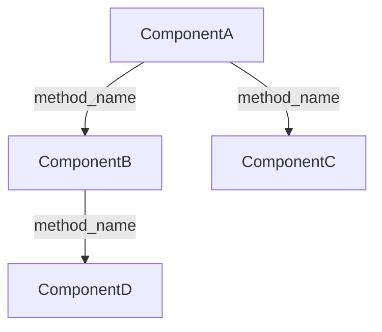

End-to-end development workflow: **plan → implement → analyze**.

Follows TDD, DRY, KISS, SOLID, and industry-standard design patterns.
**Functional tests must never be executed.**

---

## Principles

Apply these principles throughout every phase. They are not optional.

| Principle | Rule |
|-----------|------|
| **TDD** | Write tests before implementation. No production code without a failing test first. Prefer `unittest.TestCase` subclasses unless the user specifies pytest style or the existing codebase already uses it. |
| **SOLID** | Single responsibility per class; depend on abstractions, not concretions; open for extension, closed for modification. |
| **DRY** | Every piece of knowledge has a single authoritative location. No duplicated logic. |
| **KISS** | Prefer the simplest solution that satisfies the requirement. Complexity must be justified. |
| **YAGNI** | Do not build what is not needed now. No speculative abstractions, no future-proofing hooks. |
| **LoD** | A component only calls methods on its immediate dependencies — never reaches through them to a third object. |
| **Imports** | All `import` statements must be at the top of the file. Never import inside a function or method — doing so hides circular dependencies and makes the dependency graph opaque. |

When a design decision touches one of these principles, document it in `PLAN.md` under **Design notes**.

---

## Environment setup

Before any planning or implementation, ensure a virtual environment exists:

```bash
ls .venv 2>/dev/null
```

- **If `.venv` exists**: proceed — all subsequent `python`, `pip`, and `pytest` calls must
  use `.venv/bin/python`, `.venv/bin/pip`, and `.venv/bin/pytest` (or prefix each shell
  command with `. .venv/bin/activate &&`).
- **If `.venv` does not exist**: ask the user:
  > "No virtual environment found. Which Python version should I use?
  > (e.g. `python3.12`, `python3.11`, …)"

  Once confirmed, create and activate it:

  ```bash
  <python-version> -m venv .venv
  . .venv/bin/activate && pip install --upgrade pip
  ```

  Then ask the user whether to install project dependencies now (e.g. `pip install -e .[dev]`)
  and run the install if confirmed.

All subsequent commands in every phase must run inside the virtual environment.

---

## Phase 1 — Planning

### Pre-planning: read the codebase

Before proposing anything, orient yourself:

1. Read `CLAUDE.md` if present.
2. Explore the existing directory structure:
   ```bash
   find . -maxdepth 3 -not -path '*/.git/*' -not -path '*/__pycache__/*'
   ```
3. Read source files relevant to the task.

### Divide and analyze

Enter plan mode. Break `$task_description` (or the task described in the conversation)
into sub-problems. For each sub-problem:

- Identify components, classes, interfaces, and functions required.
- Identify relationships and dependencies between components (which depends on which).
- Apply design patterns where appropriate — document which pattern and why.
- If multiple valid approaches exist, **stop and ask the user** — do not pick one autonomously.
  Present each option with its concrete use-case fit and trade-offs. Avoid defaulting to
  the "modern" or "trending" alternative; every pattern exists because it solves a specific
  problem, and the right choice depends on the actual context, not on current convention.
  A common example of a frequently misapplied pattern is **composition over inheritance**.
  Use the following decision rule — do not deviate from it without user approval:
  - **is-a** relationship → inheritance. The subclass is a true specialization of the
    parent and can substitute it anywhere (Liskov Substitution Principle holds).
  - **has-a** relationship → composition. The class owns or delegates to another object
    as a part; no substitutability is needed.
  - **Runtime behavior injection** → composition (Strategy, Decorator, or dependency
    injection). Behavior varies dynamically; encoding it in a class hierarchy would
    require an explosion of subclasses.
  "Prefer composition over inheritance" is a warning against abusing inheritance for
  pure code reuse when no true is-a relationship exists, not a universal default.
  When the relationship is ambiguous, present both options and ask the user.
- Use `WebSearch` or `WebFetch` if any technical clarification is needed.

### Write `PLAN.md`

Create `PLAN.md` at the project root with this structure:

```markdown
# PLAN.md

## Problem statement
<what needs to be built and why>

## Sub-problems
1. <sub-problem 1>
2. <sub-problem 2>

## Components

### ComponentName
- **Responsibility:** <single-sentence description>
- **Interface:** <Python abstract class or Protocol — signatures + type annotations>
- **Depends on:** [list of other components, or "none"]
- **Design pattern:** <pattern name and rationale>

## Dependency graph
<ordered list or table showing which components must exist before others>
<determines whether agents run in parallel or sequentially>

## Test strategy
- **Unit:** <what each component's unit tests cover>
- **Integration:** <which cross-component flows need integration tests>

## Design notes
<patterns applied, standards followed, constraints, non-obvious decisions>
```

### Generate Python interface stubs

Before exiting plan mode, write Python stubs for each component:

- Use `ABC` (abstract base class) or `typing.Protocol` — whichever fits better.
- Include full type annotations on every method signature.
- Add a one-line docstring per method describing the contract (the *what*, not the *how*).
- No implementation body — use `...` or `raise NotImplementedError`.
- Place each stub in the correct package location per the existing project structure.

These stubs are the contracts agents must implement exactly. Any deviation must be
justified and approved by the user before the agent continues.

**Exit plan mode. Wait for the user to review and approve `PLAN.md` before proceeding.**

---

## Phase 2 — Implementation

### Git: create feature branch

```bash
git checkout -b feature/<task-slug>
```

### Spawn agents

Read `PLAN.md` to determine components and their dependency order:

- **Independent components** (no dependency on other components being built now):
  spawn the corresponding agents **in parallel** (single message, multiple Agent calls).
- **Dependent components**: spawn them **sequentially**, only after all their
  dependencies are confirmed complete.

**Each agent receives:**

- The stub file it must implement.
- Its component section from `PLAN.md` (responsibility, interface, test strategy).
- Relevant existing code and `CLAUDE.md` for project context.
- These mandatory rules:
  1. **Write unit tests first** (TDD — tests before any implementation).
     Prefer `unittest.TestCase` subclasses; use pytest-style functions only if
     the user requests it or the existing codebase already uses that convention.
     pytest is used only as the test runner.
  2. Implement the component until all tests pass.
  3. Achieve **100 % unit test coverage** for its component.
  4. Run `/run-linters <package>` to ensure all linters and type checkers pass; fix all issues before reporting back.
  5. The implemented public interface must match the stub exactly unless a
     deviation is necessary — in which case, flag it explicitly in the report.

**Each agent reports back:**

- Files created or modified.
- Tests written (count and IDs).
- Coverage achieved.
- Any deviations from the interface stub, with justification.

**If an agent fails** (cannot reach 100 % coverage or a linter-clean state after
reasonable effort): main Claude takes over and resolves the remaining issues inline,
then re-runs the agent's checks to confirm.

### Integration tests

After **all agents** have reported back, main Claude writes integration tests that cover:

- Component interactions defined in the dependency graph in `PLAN.md`.
- End-to-end flows that exercise the full component chain.

Run the full test suite and confirm everything passes before moving to Phase 3.

---

## Phase 3 — Analysis

Run each step sequentially in the main conversation (no agents):

1. **`/run-linters <package>`** — linters and type checkers across the full package.
2. **`/run-security <package>`** — bandit static analysis + pip-audit CVE scan.
3. **`/security-review`** — built-in Claude Code security review of all pending changes.
4. **`/review`** — built-in Claude Code code review.

Address any findings before the commit.

### Git: single commit

Stage all relevant files and create one commit covering the entire implementation.
Use the **Conventional Commits** format for the message:

```
<type>(<scope>): <short summary>

<optional body>
```

Common types: `feature` (new feature), `fix` (bug fix), `refactor` (no behavior change),
`test` (tests only), `docs` (documentation only), `chore` (tooling/config).

```bash
git add <relevant files>
git commit -m "feature(<scope>): <summary>"
```

Future fix iterations (if the user decides to continue work) get their own commits.

### Architecture diagram

If the implementation involved **two or more components** with notable relationships,
create `DIAGRAM.md` at the project root using a Mermaid diagram:

````markdown

````

Label each edge with the primary interface method or dependency type.

### Final report

Present a concise summary to the user:

- Each component: responsibility, public interface, which components it depends on.
- Total test coverage achieved.
- Any issues found and resolved during the analysis phase.
- Branch name and commit SHA.

### PR

Ask the user whether they want to open a pull request.
If yes:

```bash
gh pr create --title "<title>" --body "$(cat <<'EOF'
## Summary
<bullet points>

## Test plan
<checklist>

EOF
)"
```
