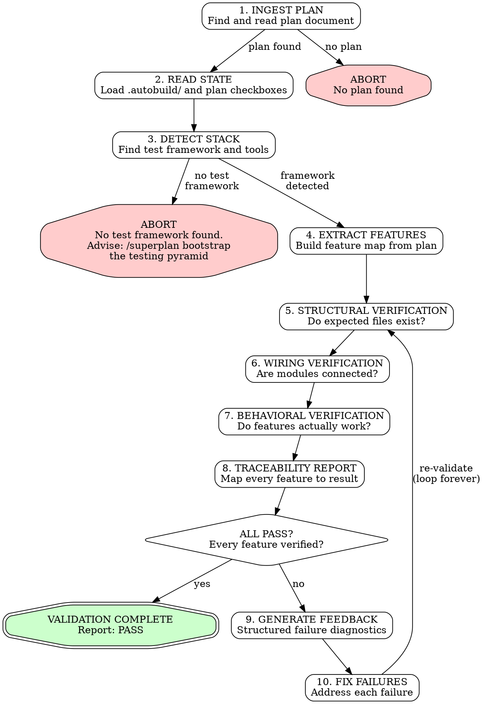

# Superval - Plan-Driven Validation Loop

> Version: 1.0.0 by skulto

## Overview

Superval is a **plan-driven validation engine** that proves a built project matches its plan. It reads the plan, reads all build state, detects the test framework, and validates at three levels (structural, wiring, behavioral). For behavioral verification, it writes **outside-in black-box acceptance tests** -- independent scripts (often bash or a scripting language) that automate the **built application from the outside**, never importing source code. It loops until everything passes. It never stops trying.

**Core principle:** The plan is the specification. The built code is the implementation. Superval is the proof. Acceptance tests treat the app as a black box -- they poke it from the outside, through its public interface, like a real user would.

**Position in pipeline:**
```
/superplan -> /superbuild or /autobuild -> /superval
  (plan)         (build)                    (validate)
```

---

## When to Use

- After `/superbuild` or `/autobuild` completes all phases
- When you need proof that every planned feature exists and works
- When a build failed partway and you need to assess what's missing
- When resuming after context compaction and need to verify state
- Before creating a PR to prove the implementation is correct

## When NOT to Use

- Before a plan exists (use `/superplan` first)
- During active building (use `/superbuild` or `/autobuild`)
- For projects without a plan document (nothing to validate against)

---

## Execution Flow



---

## Phase Reference Index

Read the reference doc BEFORE executing that phase:

| Phase | Reference Document | When to Read |
|---|---|---|
| 1. Ingest Plan | `references/PLAN-PARSING.md` | Before parsing any plan |
| 2. Read State | `references/STATE-FILE-CONTRACTS.md` | Before reading .autobuild/ |
| 3. Detect Stack | `scripts/detect-test-framework.sh` | Run this script |
| 4-7. Verification | `references/VALIDATION-PATTERNS.md` | Before any verification |
| 5-7. Test Generation | `references/CLI-TESTING-PATTERNS.md` | Before writing any test |

---

## Phase 1: INGEST PLAN

**Find the plan document.** Search in this order:

1. User-provided path (if given as argument to `/superval`)
2. `docs/*-plan.md` or `docs/*-plan-*.md`
3. Root-level `*-plan.md`
4. `.autobuild/config.json` -> `plan_path` field

**If no plan found:** ABORT immediately.

```
SUPERVAL ABORT: No plan found.

Searched:
  - docs/*-plan.md
  - docs/*-plan-*.md
  - .autobuild/config.json

To create a plan, run: /superplan <feature description>
```

**If plan found:** Read the entire plan. Output confirmation:

```
SUPERVAL: Plan loaded
Plan: docs/autobuild-plan.md
Phases: 6 (0, 1, 2A, 2B, 2C, 3)
Acceptance Criteria: 4
```

**Multi-file plans:** If plan is split across files (`*-plan-1.md`, `*-plan-2.md`), read ALL parts.

---

## Phase 2: READ STATE

Load all available build state to understand what was attempted.

### 2a. Check for .autobuild/ directory

If `.autobuild/` exists (project was built with `/autobuild`):

1. Read `.autobuild/config.json` -> extract stack, commands, phase counts
2. Read each `.autobuild/phases/phase-*.json` -> extract per-phase status, file lists, quality gate results
3. Read `.autobuild/logs/execution.log` -> understand execution timeline

### 2b. Check plan document checkboxes

Read the plan document for superbuild-style state:

1. Phase Overview table -> Status column (⬜/✅/🔄)
2. Per-phase objectives -> `- [x]` vs `- [ ]` counts
3. Per-phase Definition of Done -> `- [x]` vs `- [ ]` counts

### 2c. Output state summary

```
SUPERVAL: State loaded
Source: .autobuild/ + plan checkboxes

Phase Status:
  Phase 0: Bootstrap ......... complete (autobuild verified)
  Phase 1: Core Services ...... complete (autobuild verified)
  Phase 2A: Backend API ....... complete (autobuild verified)
  Phase 2B: Frontend .......... complete (autobuild verified)
  Phase 2C: Tests ............. complete (autobuild verified)
  Phase 3: Integration ........ complete (autobuild verified)

Files expected: 24 created, 8 modified
Quality gates claimed: ALL PASS

NOTE: All claims will be independently verified.
```

---

## Phase 3: DETECT STACK

Run the detection script or perform manual detection.

### Using the script

```bash
./scripts/detect-test-framework.sh <project-dir>
```

### Manual detection (if script unavailable)

Check for these files in order:

| File | Stack |
|---|---|
| `package.json` + `tsconfig.json` | TypeScript |
| `package.json` | JavaScript |
| `pyproject.toml` / `requirements.txt` | Python |
| `go.mod` | Go |
| `Cargo.toml` | Rust |

Then check for test framework:

| Stack | Config Files to Check |
|---|---|
| TypeScript | `vitest.config.ts`, `jest.config.ts`, package.json deps |
| Python | `pytest.ini`, `pyproject.toml` [tool.pytest] |
| Go | Built-in (`go test`) |
| Rust | Built-in (`cargo test`) |

### No test framework found: ABORT

```
SUPERVAL ABORT: No test framework detected.

Stack: typescript
Checked: vitest.config.ts, jest.config.ts, package.json

Cannot validate without a test framework.
To bootstrap testing, run: /superplan bootstrap the testing pyramid for me
```

**This is a hard stop. Do NOT proceed without a test framework.**

### Framework found: Continue

```
SUPERVAL: Stack detected
Stack: typescript
Package Manager: npm
Test Framework: vitest
Linter: eslint
Formatter: prettier
Type Checker: tsc
Test Command: npm test
Test Files Found: 12
```

---

## Phase 4: EXTRACT FEATURES

Parse the plan to build the complete feature map. See `references/PLAN-PARSING.md` for parsing details.

### Extract from plan:

1. **Phase Overview table** -> all phases with names and status
2. **Per-phase Objectives** -> feature checklist per phase
3. **Per-phase Code Changes** -> expected files (CREATE/MODIFY/DELETE)
4. **Per-phase Tests** -> expected test files
5. **Acceptance Criteria** -> high-level feature requirements
6. **Definition of Done** -> quality gate requirements per phase

### Build the feature map:

For each phase, create a feature entry:

```
Feature: Phase 1 - Core Services
  Objectives: [config service, logger service, state service]
  Files Created: [src/services/config.ts, src/services/logger.ts, src/services/state.ts]
  Files Modified: [src/index.ts]
  Test Files: [src/__tests__/unit/services/config.test.ts, ...]
  DoD: [linter, formatter, typecheck, tests]
```

### Output feature map:

```
SUPERVAL: Feature map extracted
Total features: 8 phases
Total files expected: 24 created, 8 modified
Total test files expected: 12
Acceptance criteria: 4
```

---

## Phase 5: STRUCTURAL VERIFICATION (Level 1)

**Question: Does the code EXIST?**

For every file in the feature map:

### 5a. Source file existence

Check each `files_created` and `files_modified` path:

```
STRUCTURAL VERIFICATION
=======================

Phase 0: Bootstrap
  PASS  eslint.config.js
  PASS  .prettierrc
  PASS  vitest.config.ts

Phase 1: Core Services
  PASS  src/services/config.ts
  PASS  src/services/logger.ts
  PASS  src/services/state.ts
  FAIL  src/services/missing.ts     <-- STRUCTURAL FAILURE
```

### 5b. Test file existence

For every source file, verify a corresponding test file exists:

```
TEST FILE VERIFICATION
======================
  PASS  src/services/config.ts -> src/__tests__/unit/services/config.test.ts
  PASS  src/services/logger.ts -> src/__tests__/unit/services/logger.test.ts
  FAIL  src/services/missing.ts -> (no test file found)
```

### 5c. Dependency verification

Check that declared dependencies are installed:

```bash
# Node.js
npm ls --depth=0 2>/dev/null | grep -c "ERR!"
# Should be 0

# Python
pip check 2>/dev/null
```

### Structural failures gate further verification

If a file doesn't exist, skip wiring and behavioral checks for that feature. Record as STRUCTURAL FAIL in the traceability matrix.

---

## Phase 6: WIRING VERIFICATION (Level 2)

**Question: Is the code CONNECTED?**

For every feature that passed structural verification:

### 6a. Import chain verification

Verify that entry points reach the feature code:

```
WIRING VERIFICATION
===================

CLI -> Commands:
  PASS  src/cli.ts imports src/commands/start.ts
  PASS  src/cli.ts imports src/commands/run.ts
  PASS  src/cli.ts imports src/commands/status.ts
  PASS  src/cli.ts imports src/commands/config.ts

Commands -> Services:
  PASS  src/commands/start.ts imports src/services/agent-orchestrator.ts
  PASS  src/commands/status.ts imports src/services/state.ts
  FAIL  src/commands/run.ts does NOT import src/services/plan-registry.ts
```

**How to check:** Use grep/Grep to search for import statements:
```
Pattern: "import .* from ['\"]\./services/config"
File: src/commands/start.ts
```

### 6b. Export verification

Verify barrel files (index.ts) re-export expected symbols:

```typescript
// Dynamic import check
const mod = await import('./src/index.ts');
const keys = Object.keys(mod);
// Verify expected exports are present
```

### 6c. Service instantiation

Verify services can be imported without errors (catches circular deps):

```typescript
const imports = [
  import('./src/services/config.ts'),
  import('./src/services/logger.ts'),
  // ... all services
];
const results = await Promise.allSettled(imports);
// All should be 'fulfilled'
```

---

## Phase 7: BEHAVIORAL VERIFICATION (Level 3)

**Question: Does the code WORK?**

For every feature that passed wiring verification:

### 7a. Smoke test (first gate)

The project must build and start without errors:

```bash
# Build
npm run build
# Exits 0? Continue. Exits non-zero? BEHAVIORAL FAIL for ALL features.

# Start (quick check)
node dist/cli.js --help
# Exits 0? Continue. Exits non-zero? BEHAVIORAL FAIL for ALL features.
```

**If smoke test fails, skip all other behavioral checks.** Fix the build first.

### 7b. Quality gates

Run all quality gate commands:

```bash
npm run lint          # Linter
npm run format        # Formatter (check mode)
npm run typecheck     # Type checker
npm test              # Full test suite
```

Each must exit 0. Capture output for the traceability report.

### 7c. Generate outside-in acceptance tests

**These are BLACK BOX tests.** They treat the built application as an opaque artifact and poke it from the outside -- exactly like a real user or consumer would. They do NOT import source code. They do NOT call internal functions. They automate the app under test through its public interface.

**Key principle:** The acceptance test is an independent script that could be written in ANY language. A bash script can test a TypeScript CLI. A Python script can test a Go API. The test language does not need to match the project language. Pick whatever is most natural for automating the interface.

**What makes these different from the project's own tests:**

| | Project's Unit/Integration Tests | Superval Acceptance Tests |
|---|---|---|
| **Perspective** | Inside the codebase | Outside the app |
| **Imports source?** | Yes | **Never** |
| **Tests what?** | Functions, modules, classes | The built artifact |
| **Written in** | Same language as project | Any scripting language |
| **Runs against** | Source code or mocks | The compiled/running application |
| **Purpose** | Developer confidence | Proof the feature exists in the product |

### Acceptance test patterns by project type

Every acceptance test automates the **built application through its user-facing interface**. The interface determines the automation tool. Here is the complete catalog:

#### CLI Tools -- Bash script testing the built binary

The user's interface is the terminal. Test exactly what they'd type.

```bash
#!/bin/bash
# acceptance-test.sh -- Black box CLI tests
set -euo pipefail

PASS=0; FAIL=0
CLI="node dist/cli.js"  # The BUILT artifact, not source

run_test() {
  local name="$1"; shift
  if "$@" >/dev/null 2>&1; then
    echo "  PASS  $name"; PASS=$((PASS + 1))
  else
    echo "  FAIL  $name (exit code: $?)"; FAIL=$((FAIL + 1))
  fi
}

assert_output_contains() {
  local name="$1"; local pattern="$2"; shift 2
  local output; output=$("$@" 2>&1) || true
  if echo "$output" | grep -q "$pattern"; then
    echo "  PASS  $name"; PASS=$((PASS + 1))
  else
    echo "  FAIL  $name (expected '$pattern' in output)"; FAIL=$((FAIL + 1))
  fi
}

echo "ACCEPTANCE TESTS (outside-in)"
echo "=============================="

# AC-1: CLI displays version
assert_output_contains "AC-1: displays version" "[0-9]\.[0-9]" $CLI --version

# AC-2: CLI shows help for all commands
assert_output_contains "AC-2: help shows 'start'" "start" $CLI --help
assert_output_contains "AC-2: help shows 'config'" "config" $CLI --help

# AC-3: Each subcommand has --help
for cmd in start run status config; do
  run_test "AC-3: $cmd --help exits 0" $CLI $cmd --help
done

echo ""; echo "RESULTS: $PASS passed, $FAIL failed"
[ "$FAIL" -eq 0 ] && exit 0 || exit 1
```

#### TUI (Terminal UI) Apps -- expect/pexpect for interactive terminals

TUI apps (ncurses, blessed, ink, bubbletea) don't just print output -- they draw screens and respond to keystrokes. You need a tool that can drive an interactive terminal session.

```bash
#!/usr/bin/expect -f
# acceptance-tui.exp -- Drives an interactive TUI app
# Uses expect (TCL-based) to send keystrokes and match screen output

set timeout 10

# Launch the built TUI app
spawn ./dist/my-tui-app

# AC-1: Main menu renders
expect {
  "Select an option" { puts "  PASS  AC-1: main menu renders" }
  timeout { puts "  FAIL  AC-1: main menu did not render"; exit 1 }
}

# AC-2: Arrow keys navigate menu
send "\[B"  ;# Down arrow
expect {
  "> Option 2" { puts "  PASS  AC-2: down arrow selects option 2" }
  timeout { puts "  FAIL  AC-2: navigation broken"; exit 1 }
}

# AC-3: Enter selects item
send "\r"
expect {
  "Option 2 selected" { puts "  PASS  AC-3: enter selects item" }
  timeout { puts "  FAIL  AC-3: selection broken"; exit 1 }
}

# AC-4: q quits
send "q"
expect eof
puts "  PASS  AC-4: q exits cleanly"
```

**Python alternative using pexpect:**
```python
#!/usr/bin/env python3
# acceptance-tui.py -- Drives interactive TUI with pexpect
import pexpect

child = pexpect.spawn('./dist/my-tui-app', timeout=10)

# AC-1: Main menu renders
child.expect('Select an option')
print('  PASS  AC-1: main menu renders')

# AC-2: Navigate with arrow keys
child.send('\x1b[B')  # Down arrow
child.expect('> Option 2')
print('  PASS  AC-2: arrow navigation works')

child.sendline('q')
child.expect(pexpect.EOF)
print('  PASS  AC-3: clean exit')
```

#### Web Applications (React, Vue, Angular, etc.) -- Playwright or Cypress

The user's interface is the browser. Playwright and Cypress automate real browsers against the running app.

```typescript
// acceptance-web.spec.ts -- Playwright drives RUNNING app in REAL browser
import { test, expect } from '@playwright/test';

// No source imports. Playwright hits the live URL.
test('AC-1: User can create a new item', async ({ page }) => {
  await page.goto('http://localhost:3000/items/new');
  await page.fill('[data-testid="name"]', 'Test Item');
  await page.click('button[type="submit"]');
  await expect(page.locator('.success')).toBeVisible();
});

test('AC-2: Navigation shows all sections', async ({ page }) => {
  await page.goto('http://localhost:3000');
  await expect(page.getByRole('link', { name: 'Dashboard' })).toBeVisible();
  await expect(page.getByRole('link', { name: 'Settings' })).toBeVisible();
});
```

**Cypress alternative:**
```javascript
// acceptance-web.cy.js
describe('Acceptance Tests', () => {
  it('AC-1: User can create a new item', () => {
    cy.visit('http://localhost:3000/items/new');
    cy.get('[data-testid="name"]').type('Test Item');
    cy.get('button[type="submit"]').click();
    cy.get('.success').should('be.visible');
  });
});
```

#### Backend APIs -- curl/HTTP from outside the process

The user's interface is HTTP. Test via actual HTTP requests to a running server. Never import the app module.

```bash
#!/bin/bash
# acceptance-api.sh -- Tests a RUNNING API server from outside
set -euo pipefail

BASE_URL="http://localhost:3000"
PASS=0; FAIL=0

assert_http() {
  local name="$1" expected_code="$2"; shift 2
  local response http_code body
  response=$(curl -s -w "\n%{http_code}" "$@")
  http_code=$(echo "$response" | tail -1)
  body=$(echo "$response" | sed '$d')
  if [ "$http_code" = "$expected_code" ]; then
    echo "  PASS  $name (HTTP $http_code)"; PASS=$((PASS + 1))
  else
    echo "  FAIL  $name (expected $expected_code, got $http_code)"; FAIL=$((FAIL + 1))
  fi
}

echo "API ACCEPTANCE TESTS"
echo "===================="

# AC-1: Health endpoint
assert_http "AC-1: GET /health returns 200" "200" "$BASE_URL/health"

# AC-2: Create resource
assert_http "AC-2: POST /api/items returns 201" "201" \
  -X POST "$BASE_URL/api/items" \
  -H "Content-Type: application/json" \
  -d '{"name": "Test"}'

# AC-3: Unauthorized access rejected
assert_http "AC-3: GET /api/secret returns 401" "401" "$BASE_URL/api/secret"

echo ""; echo "RESULTS: $PASS passed, $FAIL failed"
[ "$FAIL" -eq 0 ] && exit 0 || exit 1
```

#### iOS Apps -- XCUITest (Xcode UI Testing)

The user's interface is the touch screen. XCUITest drives the app through the accessibility hierarchy.

```swift
// AcceptanceTests.swift -- Xcode UI Test target (separate from app target)
import XCTest

class AcceptanceTests: XCTestCase {
    let app = XCUIApplication()

    override func setUp() {
        continueAfterFailure = false
        app.launch()  // Launches the BUILT .app bundle
    }

    func testAC1_LoginScreenAppears() {
        XCTAssertTrue(app.textFields["Email"].exists)
        XCTAssertTrue(app.secureTextFields["Password"].exists)
        XCTAssertTrue(app.buttons["Sign In"].exists)
    }

    func testAC2_UserCanLogin() {
        app.textFields["Email"].tap()
        app.textFields["Email"].typeText("test@example.com")
        app.secureTextFields["Password"].tap()
        app.secureTextFields["Password"].typeText("password123")
        app.buttons["Sign In"].tap()
        XCTAssertTrue(app.staticTexts["Welcome"].waitForExistence(timeout: 5))
    }
}
```

#### Android Apps -- Espresso or UI Automator

Espresso for single-app testing, UI Automator for cross-app flows.

```kotlin
// AcceptanceTest.kt -- Android instrumentation test (separate from app code)
@RunWith(AndroidJUnit4::class)
class AcceptanceTest {

    @get:Rule
    val activityRule = ActivityScenarioRule(MainActivity::class.java)

    @Test
    fun ac1_loginScreenAppears() {
        // Drives the RUNNING app through the accessibility layer
        onView(withId(R.id.email_input)).check(matches(isDisplayed()))
        onView(withId(R.id.password_input)).check(matches(isDisplayed()))
        onView(withId(R.id.sign_in_button)).check(matches(isDisplayed()))
    }

    @Test
    fun ac2_userCanLogin() {
        onView(withId(R.id.email_input)).perform(typeText("test@example.com"))
        onView(withId(R.id.password_input)).perform(typeText("password123"))
        onView(withId(R.id.sign_in_button)).perform(click())
        onView(withText("Welcome")).check(matches(isDisplayed()))
    }
}
```

#### React Native Apps -- Detox

Detox tests the built app on a real device/simulator, not the JS bundle.

```javascript
// acceptance.e2e.js -- Detox drives the BUILT React Native app
describe('Acceptance Tests', () => {
  beforeAll(async () => {
    await device.launchApp();  // Launches the BUILT .app/.apk
  });

  it('AC-1: login screen renders', async () => {
    await expect(element(by.id('email-input'))).toBeVisible();
    await expect(element(by.id('password-input'))).toBeVisible();
    await expect(element(by.id('sign-in-button'))).toBeVisible();
  });

  it('AC-2: user can login', async () => {
    await element(by.id('email-input')).typeText('test@example.com');
    await element(by.id('password-input')).typeText('password123');
    await element(by.id('sign-in-button')).tap();
    await expect(element(by.text('Welcome'))).toBeVisible();
  });
});
```

#### Desktop Apps (Electron, Tauri, native) -- Accessibility API via bash/script

Desktop apps expose an accessibility tree. On macOS, use AppleScript/`osascript`. On Windows, use UI Automation via PowerShell. On Linux, use `xdotool` + AT-SPI.

**macOS -- AppleScript via osascript:**
```bash
#!/bin/bash
# acceptance-desktop-macos.sh -- Drives desktop app via macOS Accessibility API
set -euo pipefail

APP_NAME="MyApp"
APP_PATH="./dist/MyApp.app"

# Launch the built app
open "$APP_PATH"
sleep 3  # Wait for launch

PASS=0; FAIL=0

assert_ax() {
  local name="$1" script="$2"
  if osascript -e "$script" 2>/dev/null; then
    echo "  PASS  $name"; PASS=$((PASS + 1))
  else
    echo "  FAIL  $name"; FAIL=$((FAIL + 1))
  fi
}

# AC-1: Main window appears
assert_ax "AC-1: main window exists" \
  "tell application \"System Events\" to tell process \"$APP_NAME\" to exists window 1"

# AC-2: Menu bar has expected items
assert_ax "AC-2: File menu exists" \
  "tell application \"System Events\" to tell process \"$APP_NAME\" to exists menu bar item \"File\" of menu bar 1"

# AC-3: Click a button and verify result
osascript -e "
  tell application \"System Events\"
    tell process \"$APP_NAME\"
      click button \"New Document\" of window 1
    end tell
  end tell
" 2>/dev/null
sleep 1

assert_ax "AC-3: new document created" \
  "tell application \"System Events\" to tell process \"$APP_NAME\" to get name of window 1 contains \"Untitled\""

# Cleanup
osascript -e "tell application \"$APP_NAME\" to quit"

echo ""; echo "RESULTS: $PASS passed, $FAIL failed"
[ "$FAIL" -eq 0 ] && exit 0 || exit 1
```

**Electron apps -- Playwright with Electron support:**
```typescript
// acceptance-electron.spec.ts -- Playwright can drive Electron directly
import { test, expect, _electron as electron } from '@playwright/test';

test('AC-1: app launches and shows main window', async () => {
  const app = await electron.launch({ args: ['./dist/main.js'] });
  const window = await app.firstWindow();
  await expect(window.locator('h1')).toContainText('Welcome');
  await app.close();
});
```

#### Libraries (npm, pip, crate) -- Script that installs and uses the published package

The user's interface is `import`/`require` from a package. Test the published artifact, not source.

```bash
#!/bin/bash
# acceptance-library.sh -- Install from local tarball and test
set -euo pipefail

TMPDIR=$(mktemp -d)
trap 'rm -rf $TMPDIR' EXIT

# Pack the built library (not source)
npm pack --pack-destination "$TMPDIR"
cd "$TMPDIR"
npm init -y >/dev/null 2>&1
npm install ./mylib-*.tgz >/dev/null 2>&1

# AC-1: Can import the package
node -e "const lib = require('mylib'); console.log('PASS  AC-1: import works')" || {
  echo "FAIL  AC-1: import failed"; exit 1
}

# AC-2: Exported function works
node -e "
  const { createThing } = require('mylib');
  const result = createThing({ name: 'test' });
  if (result.name === 'test') {
    console.log('PASS  AC-2: createThing works');
  } else {
    console.log('FAIL  AC-2: unexpected result');
    process.exit(1);
  }
"
```

### Choosing the automation tool

| Project Type | User Interface | Automation Tool | Script Language |
|---|---|---|---|
| **CLI tool** | Terminal (stdout/stderr/exit code) | Direct invocation | **Bash** |
| **TUI app** | Interactive terminal (ncurses, etc.) | expect / pexpect | **TCL (expect)** or **Python (pexpect)** |
| **Web app** (React, Vue, etc.) | Browser | **Playwright** or Cypress | TypeScript/JavaScript |
| **Backend API** | HTTP | curl / httpie | **Bash** |
| **iOS app** | Touch screen / accessibility tree | **XCUITest** | Swift |
| **Android app** | Touch screen / accessibility tree | **Espresso** or UI Automator | Kotlin/Java |
| **React Native** | Touch screen (cross-platform) | **Detox** | JavaScript |
| **Desktop app (macOS)** | Windows / accessibility tree | **osascript** (AppleScript) | **Bash + AppleScript** |
| **Desktop app (Electron)** | Browser-in-window | **Playwright** (Electron mode) | TypeScript |
| **Desktop app (Windows)** | Windows / accessibility tree | PowerShell + UI Automation | **PowerShell** |
| **Desktop app (Linux)** | X11/Wayland / AT-SPI | xdotool + AT-SPI | **Bash** or **Python** |
| **Library/package** | import/require from package | Install package, call functions | **Bash** + consumer language |

**The guiding principle:** Match the automation tool to the **user-facing interface**, not the implementation language. A Go CLI is tested with bash. A Rust TUI is tested with expect. A TypeScript web app is tested with Playwright. The test script is always external to the codebase.

### 7d. Run acceptance tests

Execute the generated acceptance test script:

```bash
# CLI / API / Desktop / Library (bash scripts):
bash .superval/acceptance-tests/acceptance-test.sh

# Web app (Playwright):
npx playwright test .superval/acceptance-tests/

# Web app (Cypress):
npx cypress run --spec .superval/acceptance-tests/

# TUI (expect):
expect .superval/acceptance-tests/acceptance-tui.exp

# iOS (XCUITest):
xcodebuild test -scheme AcceptanceTests -destination 'platform=iOS Simulator,name=iPhone 15'

# Android (Espresso):
./gradlew connectedAndroidTest

# React Native (Detox):
detox test --configuration ios.sim.release
```

Record results per acceptance criterion. The exit code is the verdict:
- **Exit 0:** All acceptance tests pass
- **Exit non-zero:** At least one acceptance test failed

### Critical rule: NEVER import source code in acceptance tests

```
Acceptance tests automate the APP, not the CODE.

These tests must NOT:
  import { anything } from '../../src/...'    // importing source
  require('../src/...')                         // importing source
  from mypackage.internal import ...            // importing source

These tests MUST:
  Spawn a process          (bash, exec, subprocess.run)
  Hit a URL                (curl, Playwright, Cypress)
  Drive a UI               (XCUITest, Espresso, Detox, osascript)
  Drive an interactive tty  (expect, pexpect)
  Install and use a package (npm pack + npm install + require)

If you find yourself importing source code, STOP.
You are writing an integration test, not an acceptance test.
Acceptance tests automate the built application from the outside.
```

---

## Phase 8: TRACEABILITY REPORT

Map every plan feature to its verification result.

### Output format

```
SUPERVAL TRACEABILITY REPORT
=============================
Plan: docs/autobuild-plan.md
Project: /Users/adamcobb/codes/autobuild
Attempt: 1
Date: 2025-01-25T10:00:00Z

FEATURE VERIFICATION
+--------+---------------------------+-----------+---------+------------+--------+
| Phase  | Feature                   | Struct.   | Wiring  | Behavioral | Status |
+--------+---------------------------+-----------+---------+------------+--------+
| 0      | Bootstrap (eslint)        | PASS      | PASS    | PASS       | PASS   |
| 0      | Bootstrap (prettier)      | PASS      | PASS    | PASS       | PASS   |
| 1      | Config service            | PASS      | PASS    | PASS       | PASS   |
| 1      | Logger service            | PASS      | PASS    | PASS       | PASS   |
| 1      | State service             | PASS      | PASS    | PASS       | PASS   |
| 2      | CLI start command         | PASS      | PASS    | PASS       | PASS   |
| 2      | CLI run command            | PASS      | FAIL    | SKIP       | FAIL   |
+--------+---------------------------+-----------+---------+------------+--------+

QUALITY GATES
+-------------+---------+--------------------------------+
| Gate        | Result  | Output                         |
+-------------+---------+--------------------------------+
| Build       | PASS    | tsc compiled successfully      |
| Lint        | PASS    | 0 errors, 0 warnings           |
| Format      | PASS    | All files formatted            |
| Typecheck   | PASS    | No type errors                 |
| Test        | PASS    | 94 passed, 0 failed            |
+-------------+---------+--------------------------------+

ACCEPTANCE TESTS
+--------+------------------------------------------+---------+
| AC     | Criterion                                | Result  |
+--------+------------------------------------------+---------+
| AC-1   | CLI displays version                     | PASS    |
| AC-2   | CLI shows help for all commands           | PASS    |
| AC-3   | Each command has --help                   | PASS    |
| AC-4   | Config loads from file                    | FAIL    |
+--------+------------------------------------------+---------+

SUMMARY: 6/7 features verified, 3/4 acceptance criteria met
STATUS: FAIL
```

---

## Phase 9: GENERATE FEEDBACK (on failure)

For each failure, produce structured, actionable feedback:

```
FAILURE REPORT
==============

FAILURE 1:
  Feature: CLI run command
  Phase: 2
  Level: WIRING
  Check: Import chain from src/commands/run.ts to src/services/plan-registry.ts
  Expected: run.ts should import and use planRegistry
  Actual: No import statement found for plan-registry in run.ts
  Suggestion: Add `import { planRegistry } from '../services/plan-registry.js';` to run.ts

FAILURE 2:
  Feature: AC-4 Config loads from file
  Phase: 1
  Level: BEHAVIORAL
  Check: Config service reads from ~/.autobuild/config.json
  Expected: loadConfig() returns parsed config when file exists
  Actual: Test threw: "Cannot read properties of undefined (reading 'plansDir')"
  Suggestion: Check config.ts loadConfig() error handling for missing fields
```

---

## Phase 10: FIX FAILURES

**Fix every reported failure.** Work through them in order: structural first, then wiring, then behavioral.

### Fix strategy

| Failure Level | Fix Action |
|---|---|
| Structural (file missing) | Create the file with content from the plan |
| Structural (test missing) | Create the test file |
| Wiring (import missing) | Add the import statement |
| Wiring (export missing) | Add the export |
| Behavioral (build fails) | Fix compilation errors |
| Behavioral (test fails) | Fix the test or implementation |
| Behavioral (quality gate) | Run the fix command (lint:fix, format:fix) |
| Behavioral (acceptance test) | Fix the feature implementation |

### After fixing: RETURN TO PHASE 5

Re-run the entire verification from structural through behavioral. Do not skip levels even if only behavioral tests failed -- a fix may have introduced structural or wiring regressions.

---

## The Validation Loop: NEVER STOP

```
IRON RULE: Superval loops until ALL features pass ALL levels.

There is no maximum retry count.
There is no "good enough."
There is no "let's move on."

If the plan says it should exist, it must exist.
If the plan says it should work, it must work.
If the plan says it should be tested, it must be tested.

Keep trying. Fix. Verify. Fix. Verify.
Stop only when the traceability report reads: STATUS: PASS
```

### Escalation strategy

If the same failure persists after 3 fix attempts:

1. **Expand context:** Read more of the surrounding code to understand the system
2. **Read the plan more carefully:** The fix may require understanding a different phase
3. **Check dependencies:** The failure may be caused by a different feature's incompleteness
4. **Try a different approach:** If the obvious fix isn't working, rethink the implementation
5. **Ask the user:** If truly stuck after multiple diverse attempts, describe the problem and ask for guidance

But **do not stop the loop**. Even asking the user is a step in the loop, not an exit from it.

---

## Integration with Build State

### Reading .autobuild/ state

If `.autobuild/` exists, superval can:

1. **Skip stack detection** -- use `config.json` stack info
2. **Know which files to check** -- use `phases/*.json` file lists
3. **Compare claims** -- autobuild's `verification.fresh_verification` vs superval's own results
4. **Understand failures** -- read `error` field for context on what went wrong

### Reading superbuild plan updates

If the plan has checked checkboxes (`- [x]`):

1. **Know what was claimed complete** -- checked objectives
2. **Know quality gate claims** -- checked DoD items
3. **Verify independently** -- superbuild's self-reported status is not evidence

### Trust hierarchy

```
Plan document: SOURCE OF TRUTH (what should exist)
.autobuild/ state: EVIDENCE (what was attempted)
Plan checkboxes: CLAIMS (what was self-reported)
Superval verification: PROOF (what actually exists and works)
```

Superval trusts nothing. It verifies everything.

---

## Output Artifacts

Superval writes its results to `.superval/`:

```
.superval/
  report.json              # Machine-readable traceability report
  report.md                # Human-readable report (same as terminal output)
  acceptance-tests/        # Generated acceptance test files
    structural.test.ts     # Level 1 checks as test file
    wiring.test.ts         # Level 2 checks as test file
    behavioral.test.ts     # Level 3 acceptance tests
```

These files persist across validation attempts so progress can be tracked.

---

## Quick Reference

### Commands

| Action | Command |
|---|---|
| Detect stack | `./scripts/detect-test-framework.sh .` |
| Run quality gates | `npm run lint && npm run format && npm run typecheck && npm test` |
| Run acceptance tests | `npx vitest run .superval/acceptance-tests/` |
| Smoke test | `npm run build && node dist/cli.js --help` |

### Status Icons

| Icon | Meaning |
|---|---|
| PASS | Verified and working |
| FAIL | Verification failed (needs fix) |
| SKIP | Skipped (dependency failed or phase skipped) |
| N/A | Not applicable (config files, docs) |

### Abort Conditions (only 2)

1. **No plan found** -> Cannot validate without specification
2. **No test framework** -> Cannot run behavioral verification

Everything else is fixable. Keep looping.

---

## Common Mistakes

| Mistake | Fix |
|---|---|
| Trusting build state without verifying | Always run fresh verification |
| Skipping structural checks after behavioral fix | Always re-run all 3 levels |
| Stopping after partial pass | Loop until 100% pass |
| Importing source code in acceptance tests | Acceptance tests are BLACK BOX -- spawn process, hit URL, drive UI, never import |
| Picking automation tool based on project language | Match tool to USER INTERFACE: bash for CLI, Playwright for web, XCUITest for iOS, etc. |
| Generating tests that test implementation detail | Test user-visible behavior through the public interface only |
| Running acceptance tests against source (tsx/ts-node) | Run against the BUILT artifact (node dist/cli.js, not npx tsx src/cli.ts) |
| Using unit test patterns for TUI/desktop apps | TUI needs expect/pexpect, desktop needs accessibility API (osascript, UI Automation) |
| Checking only files from state, not from plan | Plan is the source of truth, not state files |
| Accepting "mostly works" | The plan is binary. It either matches or it doesn't. |

---

## Red Flags -- STOP and Reassess

If you find yourself thinking:

- "Close enough" -- **No.** The plan is the spec. Match it exactly.
- "The tests pass so it's fine" -- **No.** Tests passing doesn't mean the feature is wired correctly.
- "That feature isn't important" -- **No.** If it's in the plan, it must be verified.
- "I'll skip this one" -- **No.** Every feature. Every level. Every time.
- "The user can verify this manually" -- **No.** Superval's job is automated proof.

These thoughts mean you're about to exit the loop prematurely. Don't.
