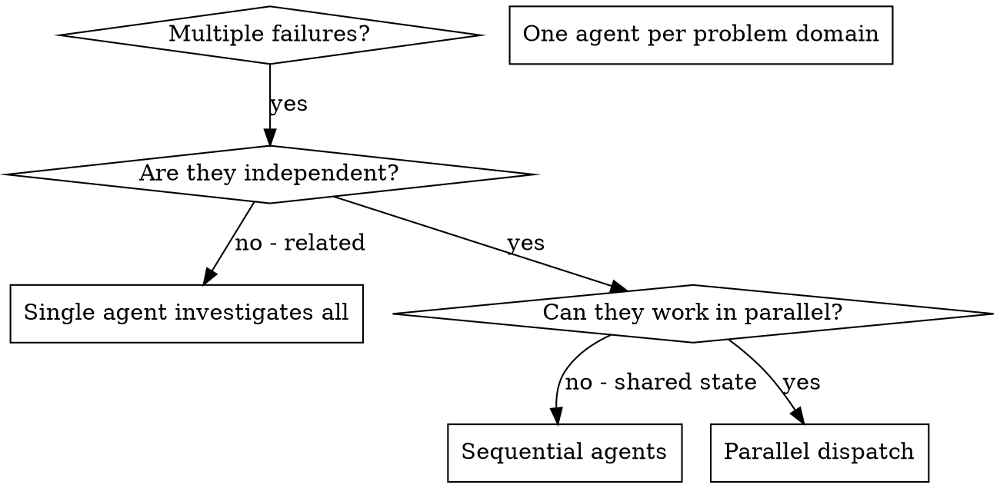

# Dispatching Parallel Agents

## Overview

You delegate tasks to specialized agents with isolated context. By precisely crafting their instructions and context, you ensure they stay focused and succeed at their task. They should never inherit your session's context or history -- you construct exactly what they need. This also preserves your own context for coordination work.

When you have multiple unrelated failures (different test files, different subsystems, different bugs), investigating them sequentially wastes time. Each investigation is independent and can happen in parallel.

**Core principle:** Dispatch one agent per independent problem domain. Let them work concurrently.

## Two Fan-Out Modes

Parallel fan-out has at least two distinct modes, and the right safeguards differ by mode:

- **Remediation fan-outs** produce edits (fix tests, swap configs, migrate repos). The dominant risks are write collisions and shared-namespace collisions. The collision-sweep and namespace-allocation sections below apply.
- **Read-only evaluation fan-outs** produce findings, not edits (assess a repo against a rubric, audit N areas). The collision/namespace sections do NOT apply; the dominant risk is findings loss and incomparable outputs. See "Read-only evaluation fan-outs" below.

Decide which mode you are in before constructing prompts; it determines which safeguards are load-bearing.

## When to Use



**Use when:**
- 3+ test files failing with different root causes
- Multiple subsystems broken independently
- Each problem can be understood without context from others
- No shared state between investigations

**Don't use when:**
- Failures are related (fix one might fix others)
- Need to understand full system state
- Agents would interfere with each other

## The Pattern

### 0. Ground-truth reconnaissance (mandatory for shared repos)

Before assigning tasks in any shared or long-lived repository, establish the live state. A work list built from a static brief is an upper bound, not a fact.

```bash
git fetch --all
git branch -avv
gh pr list --state all --limit 20
git worktree list
git status
```

Check for:
- Already-merged work (PRs closed since the brief was written)
- In-flight branches from concurrent or prior sessions (branches you did not create)
- Uncommitted work in the working tree (another session's staged edits)
- PRs you did not open that address the same tasks

If concurrent-session signals appear (remote branch with diverged history, recently-modified shared index, PRs opened by another actor), surface and confirm scope before fanning out. A parallel fan-out against a stale work list produces duplicate branches, duplicate PRs, and wasted agent cost.

**Same-tree co-tenant probe.** The branch/worktree/PR checks above assume a concurrent actor works on a SEPARATE branch or worktree. A concurrent session editing the SAME checked-out working tree on the same branch leaves no branch/worktree/PR signal at all and is invisible to every command above. Add a filesystem-level probe: before fanning out, record mtimes of key tracked files (or take a timestamped `git status` snapshot) and, where available, check the process list for other live agent/editor processes. A working tree whose files change without your action is a shared-tree concurrency signal. Concurrency detection must match the granularity of the shared resource: when the shared resource is one working tree (not the branch graph), only filesystem signals (mtimes, locks, process list) reveal a co-tenant.

#### Committing from a shared worktree

When multiple sessions share one working tree, the git index AND HEAD are shared mutable state across all of them. A bare `git add -A` / `git commit` can sweep another session's staged-but-unfinished files into your commit, and the branch your session started on may have moved because a parallel session ran `git checkout`. Guard against both:

1. **Never use bare `git add -A` / `git commit`.** Commit by explicit pathspec scoped to your own deliverables: `git commit -S -- docs/cards/` ignores the rest of the shared index.
2. **Re-verify branch and index state at the moment of commit.** Run `git branch --show-current` and `git status` immediately before committing; do not trust the session-start branch reported by the environment, because another session may have checked out a different branch in the same directory.
3. **Prefer separate worktrees per session when isolation matters.** Shared-index hazards disappear when each session has its own worktree.

Principle: when parallel agents share a working tree, scope every write to your own paths and re-verify branch/index state at commit time, never from a cached session-start snapshot.

**Commit-time hooks stash the whole tree.** Central serialization of commits eliminates index races only if the working tree is quiescent during each commit. A commit-time hook framework (pre-commit, husky) runs `git stash` on ALL unstaged changes (including the in-flight edits of still-running agents), runs hooks on the staged-only tree, then restores. The restore window can collide with another agent's read-then-write Edit, surfacing as an Edit `old_string` mismatch. So "commit only from the lead with explicit paths" is NOT race-free while other agents are still editing, even when commit paths are disjoint. The safe invariant: edits and commits must not overlap in time on a shared tree. Either wait for all editing agents to finish before any commit, or have agents quiesce (finish editing, report) before the lead commits. Disjoint file sets are necessary but not sufficient.

**"Read-only" is not "non-interfering" over a regenerated tree.** An audit agent that only reads its own domain can still corrupt shared state if a verification step regenerates a shared artifact (re-running `s4`/`s5`/`s7` pipeline scripts in place). When that source-of-truth tree is gitignored, worktree isolation is the WRONG fix: a fresh checkout does not contain the gitignored artifacts, so agents cannot read the board at all. The working isolation is a hard rule in every agent prompt: recompute from existing artifacts in-memory; if an engine truly must execute, redirect its output to a private `/tmp/<agent>/` dir and never write the shared tree; if a script has no output-dir override, do not run it and note the limitation. Match the isolation mechanism to where the shared state actually lives.

#### Re-verify documented input contracts against live files (Obs 336)

In multi-team parallel builds, an input schema documented in a handoff (even one labeled a frozen "swap needs no code change" contract) is a point-in-time snapshot, not the current file shape. The team that owns extraction can land the real data in a different schema before the consuming code is written. Before coding any loader against a documented schema, diff the contract against the actual on-disk files. If they differ, build a schema-detecting dual-mode loader that accepts both the fixture schema and the real-extraction schema, and tag every bridging step (unit conversion, taxonomy mapping, provider averaging) with a `#VERIFY` marker. A loader hard-coded to the documented schema breaks silently the moment the real data lands.

### 1. Feasibility gate before fan-out

Before dispatching, validate that each candidate is real, live, and actually in scope. A work list built from "repos without X" or "files matching Y" silently includes dead targets (deleted repos, archived projects, mislabeled catalog entries).

For each candidate, run one cheap read-only probe:

- **Repos:** `gh api repos/{org}/{name}` to confirm existence; check `languages` and `pushed_at` to confirm active Python/relevant project
- **Files:** `test -f {path}` or `gh api repos/.../contents/{path}` to confirm existence at HEAD
- **Features:** a one-line grep to confirm the feature is actually absent before dispatching a "add X" agent

Drop or reclassify candidates that fail the probe. One probe call per candidate is cheap; paying full subagent cost on a deleted repo or mislabeled entry is not.

Treat the brief's task count as an upper bound to verify, not a number to fan out against.

**Already-claimed targets (in-place-edit fan-outs):** When the deliverables are FILES that a human or another session may edit concurrently, repo/file existence is not enough. Probe each target's live state (a status marker, an mtime, or a content check) immediately before dispatch, and drop any target that is already done or already being edited by a concurrent actor. Dispatching the full list against files a human is hand-editing in parallel both clobbers their live work and pays for redundant agents. "Already being edited by a concurrent actor" is an explicit drop condition, not just "does not exist."

**CREATE fan-outs must probe the output namespace, not just the work items.** Before dispatching any agent whose job is to CREATE a document or file, run a one-line search for existing artifacts of that type/topic (glob the likely directories, grep for the class/topic names) and decide merge-vs-new at the controller level, then pass the existing-artifact paths into each agent's prompt so they extend or cross-link rather than duplicate. A fan-out that creates files is higher-rework-risk than one that edits known files: skipping this check once produced nine new data-sheet files in a fresh directory alongside an established one-file-per-class set covering the same scope. Reconnaissance before a fan-out must cover the output namespace, and that check belongs to the controller before dispatch, not to each agent after.

**Handed-off fix lists are an upper bound; probe each item's coupling at the point of edit.** A task list described by an upstream actor or audit agent as "localized, decision-independent string fixes" carries that author's mental model of scope, which may not survive contact with the actual file. For each item, run a cheap coupling probe before editing: does the target string ALSO serve as an engine constant, a generated-exhibit value, or a comparison that flips when a dependent number changes? Apply only the genuinely decoupled items; for coupled ones, defer-and-flag with the reason rather than forcing the literal edit. Editing a coupled item as a blind string swap can create worse internal contradictions than the original defect. Defer-with-flag is a first-class outcome, not a failure to complete. (This mirrors the feasibility gate, but on the write side.)

**The brief's line numbers are a hint, not ground truth.** When a task targets specific file:line ranges that the plan flags as shared with another lane, read the current state of those exact lines and diff against the brief's "old" text BEFORE editing. A sibling agent may have already advanced the snapshot the brief was authored against. If the lines already match the intended "new" state, record "already landed by <other lane>" and narrow scope to whatever genuinely remains (often a stale comment or docstring that trails a landed code change). A "do not both edit" coordination note prevents collisions but not stale-snapshot rework.

**Verbatim-artifact fan-outs must probe each target's local validation policy.** When you pre-render ONE canonical artifact and instruct every agent to copy it byte-identically, "does the target exist and is it in scope" is not enough: the fixed artifact still has to pass each target's OWN local gates, and those gates are heterogeneous. Before dispatch, read each target's local validation policy: lint configs (a `.yamllint`/markdownlint line-length cap can reject an un-shortenable SHA-pinned `uses:` ref), formatter configs, and `pass_filenames: false` whole-tree pre-commit hooks (a `basedpyright src/` hook already red on `origin/main` fails the commit even when the change touches only YAML). Then either (a) pre-adapt the artifact per target, or (b) hand each agent an explicit, sanctioned escape valve (a scoped lint-disable directive, or a single named hook `SKIP=` paired with a "verify it is already red on the untouched tree first" check) plus the standing STOP-and-report instruction for when neither fits. This is distinct from "pin the edges of a uniform edit" below: there the artifact's VALUE has coherent follow-ons; here the artifact is FIXED and the TARGET's gate rejects it. A uniform artifact across heterogeneous targets must satisfy each target's local policy, not a single global one; pre-scanning converts predictable mid-fan-out stalls into controller-side pre-adaptation or a pre-authorized per-target deviation.

### 2. Identify Independent Domains

Group failures by what's broken:
- File A tests: Tool approval flow
- File B tests: Batch completion behavior
- File C tests: Abort functionality

Each domain is independent -- fixing tool approval doesn't affect abort tests.

#### Partition by write-set, not by task taxonomy

Parallel-safety is a property of the WRITE-SET, not the conceptual task list. After grouping by domain, re-key the grouping by the set of files each agent will actually WRITE, then make that the partition:

- A brief's line targets point at where a defect is DEFINED (a source module), which is often not where the edit LANDS. Trace each fix to its real edit sites (definition site AND consumption/hub sites) before fanning out. Four fixes listed against four different source modules can all converge in one hub script (`scripts/s4_candidate_runs.py`); a one-agent-per-fix fan-out then puts three or four agents writing the same file concurrently and corrupts it via stale-read races.
- When interacting changes localize to one file (fixing a Credit central from 5.5 to 6.0 changes a deviation a separate finding must confirm), assigning them to one agent makes them serial-within-one-agent and parallel-across-agents, with zero merge risk. Partitioning by finding instead would put two agents in the same file at once.
- When a hub file is unavoidable, assign it to exactly one agent per wave and sequence the rest.

**Reserve the shared aggregator for the dispatcher.** A single file that consumes or summarizes EVERY agent's output (a rollup, an index, a premium-sizing total) must be withheld from the fan-out and integrated serially by the dispatcher after all agents return. Handing it to any one parallel agent starves the others or bakes in stale values. This is distinct from shared sequential namespace allocation (minting IDs): this is one shared file that aggregates all results.

#### Materialize a shared structural fact as one source-of-truth artifact

Before fanning out, identify any structural fact multiple agents will need (a dependency graph, a taxonomy, a board table, a per-class value set). If one exists, give it exactly ONE author and many readers:

- When N agents each edit one file but draw from one shared source, the orchestrator should pre-resolve each agent's slice into its prompt as an explicit value list, rather than handing every agent the whole source plus a lookup instruction. Shared-source parsing repeated N times is N chances to diverge on which column maps where and how to round; centralized resolution is one chance to be right.
- When the shared fact is large or machine-readable, author it once as a single read-only source file (a dependency manifest, an authoritative brief) and have every agent derive from it read-only, rather than letting each agent restate the shared structure in its own words. Parallelism multiplies whatever inconsistency the work already permits; drawing the boundary so a shared fact has one author prevents drift and makes the split safe. Pair with disjoint write-path ownership per agent so a shared worktree has no merge contention.

#### The decomposition axis determines which defects are detectable

When auditing a corpus, the axis you slice on decides which defect classes any agent can possibly find. Within-unit defects (per-file completeness gaps) need a by-LOCATION cut: each file judged alone. Between-unit defects (the same fact stated as $95.0e9 in one file and $108.7B in another) need a by-TOPIC cut: each recurring fact read across all files that mention it. A directory-only fan-out cannot detect cross-file conflicts by construction, because no single agent owns both files. If you need both completeness and consistency, run both orthogonal passes; do not expect one decomposition to surface the other's defects.

### 3. Create Focused Agent Tasks

Each agent gets:
- **Specific scope:** One test file or subsystem
- **Clear goal:** Make these tests pass
- **Constraints:** Don't change other code
- **Expected output:** Summary of what you found and fixed

### 4. Dispatch in Parallel

```typescript
// In Claude Code / AI environment
Task("Fix agent-tool-abort.test.ts failures")
Task("Fix batch-completion-behavior.test.ts failures")
Task("Fix tool-approval-race-conditions.test.ts failures")
// All three run concurrently
```

### 5. Review and Integrate

When agents return:
- Read each summary
- Verify fixes don't conflict
- Run full test suite
- Integrate all changes

## Agent Prompt Structure

Good agent prompts are:
1. **Focused** -- One clear problem domain
2. **Self-contained** -- All context needed to understand the problem
3. **Specific about output** -- What should the agent return?

```markdown
Fix the 3 failing tests in src/agents/agent-tool-abort.test.ts:

1. "should abort tool with partial output capture" - expects 'interrupted at' in message
2. "should handle mixed completed and aborted tools" - fast tool aborted instead of completed
3. "should properly track pendingToolCount" - expects 3 results but gets 0

These are timing/race condition issues. Your task:

1. Read the test file and understand what each test verifies
2. Identify root cause - timing issues or actual bugs?
3. Fix by:
   - Replacing arbitrary timeouts with event-based waiting
   - Fixing bugs in abort implementation if found
   - Adjusting test expectations if testing changed behavior

Do NOT just increase timeouts - find the real issue.

Return: Summary of what you found and what you fixed.
```

### Pin the edges of a uniform edit

A uniform fan-out only produces uniform results if the prompt pins the EDGES of the edit, not just its core. When a uniform edit changes a value that sibling config or code references (a renamed key, a swapped enum, a moved path), agents will diverge on follow-on scope: some update the now-stale sibling references so the change is coherent, others change only the literal value and leave inert remnants "for a follow-up." Same spec, divergent depth, inconsistent fleet result.

State the follow-on scope explicitly in one sentence:
- "Also update any grouping rules, config blocks, or options that reference the old value, so the change is coherent." OR
- "Touch only `enabledManagers`; leave the now-inert poetry references for a follow-up."

Any edit with an obvious coherent follow-on is a divergence point across parallel agents; specify the follow-on scope or accept inconsistent output.

### Provenance-stamp controller-supplied facts

When you paste a measured fact into an agent brief (a count, a list length, a current value), qualify it with its exact source path and measurement time, especially in repos where the same filename exists in multiple places (committed vs live vs generated/merged copies). An unqualified filename can make a true fact wrong in the agent's context, the agent then burns effort adjudicating the discrepancy instead of working.

Bad: "there are 11 hook registrations in settings.json"
Good: "11 hook registrations in the live /home/byron/.claude/settings.json as of 2026-06-11 (note: the worktree's committed copy and hooks.json differ; work against the live file)"

Provenance-stamped facts let agents verify instead of adjudicate.

### Label injected "known issues" as unverified claims

When you seed a prompt with a known issue, bug report, or prior finding sourced from secondary material (a status doc, a ticket, another agent's summary), label it explicitly as an unverified claim to confirm against primary evidence first: "A status doc CLAIMS test X fails (UNVERIFIED, may be stale) -- confirm against the code before investigating." A subagent treats its prompt as ground truth; a concrete claim stated as fact inherits false authority and can anchor the whole investigation, wasting budget reproducing a non-existent symptom or hallucinating a confirmation to match the premise. Mark provenance and confidence on injected claims so the agent verifies before it invests.

### Gag fact-gatherers from any prior conclusion you are reproducing

For an independent or adversarial re-review that delegates evidence-gathering to subagents, name the prior-conclusion artifact(s) by path in every fact-gathering prompt and forbid reading them. The prior artifact can otherwise leak into a subagent's context and anchor its findings, quietly converting a "re-review" into an "echo." Have these subagents return raw facts, not judgments, so synthesis and rating stay with the lead and the independent pass is locked before the prior work is opened at the reconciliation step. Independence has to be enforced at every context boundary, not just the lead's.

### State scope boundaries as STOP-and-report, not just "do not touch"

A path allow-list constrains where an agent SHOULD write, but goal pressure makes it write wherever unblocks the goal: an agent that hits an out-of-scope blocker will treat solving it as in-scope because that is the path of least resistance. The boundary holds only if "blocked" is defined as a RETURN condition. Two standing clauses for every fix/build dispatch:

- **Contradiction license:** "Verify the root cause against the actual code before editing. If the code does not behave as this brief states, STOP and report rather than implementing the brief literally." A compliant agent given a wrong premise ships a wrong fix silently; this clause converts a controller error into a flagged correction. (One agent told to difference a curve as cumulative empirically found it was per-year and non-monotonic, and reported instead of shipping negative back-half distributions.)
- **Out-of-scope blocker = return, not route-around:** "If you cannot complete within your path allow-list, return the blocker and a proposed fix rather than implementing it in an out-of-scope file." On return, diff the actual changed-file set against the allow-list before integrating, and quarantine any out-of-scope edits into a separate, disclosed commit.

### Keep verification out of the deliverable

When a brief embeds a pre-flight or self-check (banned-word lists, em-dash examples, a quality checklist), state explicitly that it is a step the agent PERFORMS and reports in its return message, never writes into the deliverable file. Agents otherwise copy the checklist into the output as a trailing section, and when the checklist quotes the very patterns it forbids (banned words, em-dashes), the output then fails the project's own prose checks and is inflated with meta content.

Add one line to any drafting brief: "The self-check below is a process step. Perform it, then report results in your return message. Do NOT write the checklist or its examples into the deliverable file."

### Make definition-of-done equal the integration gate

An agent's definition-of-done should equal the gate it will actually be judged by at integration, not a hand-picked subset of tools. "Passes ruff + types + tests" is a weaker bar than "passes pre-commit": repos add doc-quality hooks (pydoclint, interrogate), security hooks (bandit, detect-secrets), and commit-message hooks that a code-writing agent will not satisfy unless told to, and the gap surfaces only at integration commit time, forcing a second round-trip. Instruct: "Before returning, run the repo's actual pre-commit gate, not a hand-picked subset. If a `.pre-commit-config.yaml` exists, run `pre-commit run --files <your changed files>` (staged-scope) and make it pass." Enumerating tools from memory silently omits project-specific hooks; running the same suite does not.

### Verification/review dispatches must run the real code on real artifacts

For any review or verification dispatch, instruct the agent to EXECUTE the real artifacts through the real code path (not the test fixtures) and report what happens, and to treat a green unit suite as untrusted until one end-to-end run on real inputs is observed. Passing tests certify the seams the tests cover, not the seams that matter: a 192-test suite was fully green while the production pipeline crashed on three counts and the highest-weighted hard gate could not fail any candidate, because each unit test built its own synthetic fixture matching the contract and none crossed the integration seam. Anti-pattern: "review-by-reading" -- an agent that only reads code and tests inherits the suite's blind spots; require at least one runtime probe on real inputs.

### Cascading a known answer: authoritative brief + flag-not-fabricate

When fanning out a KNOWN result across many files (a board/identity/date cascade, reproducibility appendices transcribed from source artifacts) rather than discovering one, the brief is the contract:

1. Write the authoritative spine to a single brief file the agents read (board table, identity-replacement map, dates policy, hard rules), rather than re-briefing each agent inline; point them at it plus the live source-of-truth.
2. Partition files into disjoint sets so parallel agents never collide on a shared tree.
3. Make "transcribe verbatim, never fabricate; if a value is not in the brief or live source, leave it and emit a structured `{{PENDING: what + source}}` marker" an explicit instruction, and require each agent's return to enumerate the values it declined to fill.

This flag-not-fabricate contract turns parallel writing agents into a distributed provenance audit: forced to either find a value or declare its absence, agents surface upstream defects a smooth synthesizing pass would paper over (a stale criteria-weight vector still cited in the body, a non-existent sha256 manifest, an unregistered source). An honest "I could not verify X" list is more valuable than any plausible guess. Run a post-return discrepancy sweep across all agents' flags.

## Read-only evaluation fan-outs

When each agent reads a disjoint area and returns findings rather than edits (assessing a repo against a rubric, auditing N subsystems), the file-collision and shared-namespace sections do not apply. A different concern dominates: findings fidelity and comparability. Long per-area assessments returned only as a final message risk truncation or loss, and the coordinator's synthesis is the real deliverable.

Use a **dual output contract**:

1. Each agent writes full detail to a per-agent scratch file at a distinct path (the distinct path removes any collision risk).
2. Each agent also returns a compact summary under fixed headings that the coordinator defines up front, so summaries are directly comparable across agents.

Prescribe the identical return schema in every agent prompt, the coordinator's job is cross-area synthesis (patterns no single agent can see), which only works when outputs share a structure. Give every agent the shared rubric plus a per-agent scoped file list to enforce scope discipline on large repos.

Principle: remediation fan-outs guard against write collisions; evaluation fan-outs guard against findings loss and incomparable outputs. A fixed return schema plus a per-agent detail file turns N independent reads into a synthesizable dataset.

**Annotate-each-record deliverables: collect edges, invert centrally.** When the deliverable is "add a note to each affected record" for findings that span records, the literal instruction would have N agents concurrently editing the same per-record files: the exact write race to avoid. Instead, have each agent emit `(finding, record)` edges into its own isolated file, then build the `record -> findings` reverse index in one central controller pass. "Write a note on each affected record" is a join, not a per-agent edit; inversion replaces N-way concurrent edits with one race-free pass and is the natural home for path/format normalization (instruct agents to emit canonical repo-relative paths to minimize basename-to-canonical post-processing).

### Independent domains can be lenses, not just locations

"Independent domains" need not mean disjoint failing components. The same fan-out applies to evaluating ONE large artifact (a methodology doc, a module, a spec) by assigning each agent a distinct evaluative LENS over the whole target: correctness, performance, security, maintainability, or domain-specific disciplines (quant soundness, statistical rigor, pipeline integrity, governance). Here the decomposition axis is the type of analysis, not the location of a problem, and agents read the SAME file rather than owning disjoint files. The skill's other rules (ground-truth recon, fixed return schema, verify-against-source) transfer unchanged; the one addition is to give each agent non-overlapping finding categories so the shared target does not produce duplicate findings.

#### Comparable-output fan-outs must return their measurement basis

When parallel agents produce numbers that will later be compared or reconciled (median returns, scores, magnitudes), make "report your basis" an explicit clause in the return contract. A value without its units, vintage/date, and normalization choices (net-vs-gross, geometric-vs-arithmetic, horizon) is not reconcilable against a sibling value, and the orchestrator cannot tell a real disagreement from a definitional one. A 116 bps gap between two agents' returns looked like an error until each agent's basis was on the table, at which point it resolved cleanly to different capital-market-assumption sets, turning a confusing divergence into the single most valuable finding.

#### Doc-vs-artifact reviews need an explicit staleness axis

When the review target is a description validated against a faster-moving artifact (a methodology doc against the code/report it documents), the highest-yield failure mode is usually DRIFT, not logic error. A two-direction (forward/backward) reconciliation brief alone under-classifies it: a doc dated one day before a major re-run will have critical findings that are temporal, not gaps. Give each agent a finding-TYPE set that includes a STALE category (doc describes a state the artifact has moved past) alongside the gap categories, and require each finding to carry both sides' evidence (doc location + artifact file:line/commit). Seed each agent's brief with any known high-risk divergence areas the dispatcher already knows (pull from project memory), framed as "investigate and confirm/refute," not as a conclusion. A harness that only checks "does X match" without a time/version axis mislabels drift as a content gap and buries the real signal.

## Drafting to a gate boundary (typed PENDING markers)

When downstream work is blocked on upstream gated inputs that do not exist yet (empty data dirs, a research-findings file not yet written), dependency blocking is rarely total. Produce the high-judgment, durable layer now rather than idling or inventing values:

1. Classify each piece of content as upstream-independent or upstream-dependent.
2. Produce all independent content immediately (structure, formulas from already-frozen params, qualitative prose, falsification notes, lineage scaffolding).
3. Mark every dependent value with a typed `PENDING:<artifact>` token carrying its eventual lineage tag, e.g. `PENDING-A:cma_2026.csv`, `PENDING-R:research-findings.md#R4`, `PENDING-verify:<paper-id>`.
4. Emit a single `PENDING-INPUTS` manifest mapping every token to its upstream source, so the fill-in pass is mechanical once the gate clears.
5. Never invent a value to fill a dependent cell. Marked absence beats both idle waiting and fabricated data.

This pairs naturally with a "stop at the gate and wait" instruction. The superpowers `executing-plans` skill is the conceptual home for this pattern; it is captured here because that skill is vendored read-only.

## Common Mistakes

**Vague scope:** "Fix all the tests" -- agent gets lost
**Specific:** "Fix agent-tool-abort.test.ts" -- focused scope

**No context:** "Fix the race condition" -- agent doesn't know where
**Context:** Paste the error messages and test names

**No constraints:** Agent might refactor everything
**Constraints:** "Do NOT change production code" or "Fix tests only"

**Vague output:** "Fix it" -- you don't know what changed
**Specific:** "Return summary of root cause and changes"

**Config generation without sibling reconciliation:** Asking an agent to generate
a new tooling config file without reading existing sibling configs -- the agent
faithfully follows your literal scope and contradicts an existing repo decision.
Always instruct config-generating agents to: "First read any existing linter,
formatter, or CI config files (qlty.toml, ruff config, pyproject.toml tool
sections) and align the new config's scope with established exclusions. Flag
any divergence before writing."

**Shared sequential namespace allocation:** When parallel agents must mint
identifiers from a shared monotonic space (check IDs, migration numbers, port
numbers, fixture indices), each agent independently picks "the next free number"
and collisions are certain. Two classes of collision to prevent:
- **Stale-read:** Agent A counts from a partial view and picks an ID that already exists
- **Race-condition:** Agents A and B both read the max, both increment by 1, both write the same number

**Solution:** Allocate ranges centrally BEFORE dispatch:

```
Agent 1 (docs): use IDs CI-067 through CI-072 (first 6 slots)
Agent 2 (security): use IDs CI-073 through CI-078 (next 6 slots)
Agent 3 (toolchain): use IDs CI-079 through CI-084 (next 6 slots)
```

If central allocation is impractical, instruct agents to mark allocations as
PROVISIONAL and require a downstream uniqueness gate at integration time:

```
Your suggested check IDs are provisional. Before committing, verify each
against both sibling output files AND the live manifest to detect collisions.
```

Always run a post-dispatch collision sweep against both sibling outputs AND the live
namespace, not just a file-conflict check.

**Disjoint files that compose one artifact need a narrative contract:** File-disjointness
prevents write collisions but not SEMANTIC collisions. When parallel agents edit disjoint
files that must read as ONE coherent artifact (a report, a spec, a doc set), the real
collision risk is the shared narrative: terminology for the same entities, the placeholder
convention for not-yet-existing numbers, the load-bearing argument. Without a pre-dispatch
contract, N agents produce N ways to name the same thing and incompatible placeholder
conventions, turning integration into a rewrite. Generalize the central-allocation pattern:
the dispatcher first writes a binding contract fixing shared terminology, placeholder/token
conventions (section-prefixed to prevent cross-agent key collisions), and any cross-file
invariant, then makes every agent read it as step one. This is the narrative analog of
central ID-range allocation.

**Folding into an existing doc is reconciliation, not concatenation:** When an agent
integrates new findings into an existing document by appending a section, it can assert a
value that contradicts an existing claim elsewhere in the same file (a fund classified T2
in the new subsection but T1 in the existing tier list). Append-only integration does not
reconcile; the contradiction is invisible to a section-local review and surfaces only on a
whole-file read or external cross-check. Instruct any fold/merge agent to first read the
WHOLE target file for existing claims about the same entities and to update or cross-reference
rather than append a parallel claim, and add a post-fold check: grep the merged file for the
key entities and confirm a single consistent value per fact. Treat "two sections, two values"
as a merge defect, not a formatting nit.

## Fleet Migration Orchestration

When dispatching parallel agents for a fleet-scale migration (N repos, config changes, tool swaps):

**Crash resilience:** Transient infra errors (socket closed, API overloaded) are certain
across N long runs. Design for it:

1. Instruct every per-repo agent to **commit and push the foundational config FIRST**,
   then push fixes incrementally per-subdirectory. Any crash preserves progress on the remote.
2. On a crash notification, the controller must **verify actual state** (check the remote
   branch, run the linter on the pushed branch) rather than trust the notification. A
   "crashed" agent may have already finished and pushed.
3. **Recover finished-but-unpushed work** by reading the agent's last known state,
   committing the validated diff, and pushing -- do not re-run a full agent on already-clean code.
4. Prefer a **fresh focused continuation agent** (clone the pushed branch, do only the
   remainder) over resuming a bloated transcript. A crashed agent with 200+ tool calls
   of context tends to re-crash.

**Verify-before-propagate:** Any artifact that propagates to N repos (a config key,
an exclude pattern, a hook revision) must be validated ONCE at the source before fan-out.
An unverified config key in a template multiplies by N. Before baking any option into
a fleet-wide template:

- Verify the exact option name against the tool's `--help` or documented option list
- Run the template against one real repo and confirm the linter/tool accepts it
- Mark options as "VERIFY before fleet use" when you are not certain of their name

**Phantom entries:** Enumerate fleet scope from the catalog but expect phantom entries
(a listed repo may have been deleted). Agents must STOP-and-report on clone failure
(404, empty repo, wrong language), never substitute another repo from the list.

## When NOT to Use

**Related failures:** Fixing one might fix others -- investigate together first
**Need full context:** Understanding requires seeing entire system
**Exploratory debugging:** You don't know what's broken yet
**Shared state:** Agents would interfere (editing same files, using same resources)

## Real Example from Session

**Scenario:** 6 test failures across 3 files after major refactoring

**Failures:**
- agent-tool-abort.test.ts: 3 failures (timing issues)
- batch-completion-behavior.test.ts: 2 failures (tools not executing)
- tool-approval-race-conditions.test.ts: 1 failure (execution count = 0)

**Decision:** Independent domains -- abort logic separate from batch completion separate from race conditions

**Dispatch:**
```
Agent 1 → Fix agent-tool-abort.test.ts
Agent 2 → Fix batch-completion-behavior.test.ts
Agent 3 → Fix tool-approval-race-conditions.test.ts
```

**Results:**
- Agent 1: Replaced timeouts with event-based waiting
- Agent 2: Fixed event structure bug (threadId in wrong place)
- Agent 3: Added wait for async tool execution to complete

**Integration:** All fixes independent, no conflicts, full suite green

**Time saved:** 3 problems solved in parallel vs sequentially

## Key Benefits

1. **Parallelization** -- Multiple investigations happen simultaneously
2. **Focus** -- Each agent has narrow scope, less context to track
3. **Independence** -- Agents don't interfere with each other
4. **Speed** -- 3 problems solved in time of 1

## Verification

After agents return:
1. **Review each summary** -- Understand what changed
2. **Check for conflicts** -- Did agents edit same code?
3. **Collision sweep** -- Did any parallel allocations (IDs, ports, numbers) collide?
4. **Meta-leakage sweep** -- For drafting fan-outs, grep deliverables for pasted checklists or self-check sections before integration
5. **Run full suite** -- Verify all fixes work together
6. **Spot check** -- Agents can make systematic errors

### Re-verify what enters the deliverable; trust measurement over prose

Agents reliably locate and characterize; their arithmetic over their own intermediate tables, their binary existence claims, and any claim read from a moving tree all drift. Before any agent-reported value crosses into the deliverable, the controller re-measures it. Concrete rules:

- **Batch completion is a count, not a claim.** When an agent was given N items, grep-count the actual artifacts against N before accepting "done." An agent that hits a turn or output limit can return an upbeat summary ("Continuing...") while having finished only the first few of N; the prose will not flag the shortfall, the artifact count will. On a partial result, dispatch a fresh agent for the named remainder rather than resuming the stalled one.
- **Re-derive aggregates with one authoritative command.** Any count or inventory that will appear in the output (token tallies, file counts, occurrence totals) gets re-computed by the controller with a single `grep -c` / `wc -l` over the full scope, never by trusting an agent's summed per-item subtotals. A subagent that summed a per-file table to 77 was off by 40 against a direct aggregate grep of 117.
- **Disagreement on a binary fact is a hard re-check trigger.** When two agents return contradictory claims about the same existence/pass/fail/count fact, do not average or majority-vote: run the one-line check (`ls | wc -l`, read the field) yourself. A wrong "exists/passes" claim is more dangerous than a wrong nuanced one because it reads as settled and seeds confident downstream findings.
- **Re-pin load-bearing claims to a fresh snapshot when the tree moved.** If agents reviewed a concurrently-edited or long-lived shared tree, take one fresh snapshot after all return and re-confirm every Critical/blocker claim that rests on an exact line number, a crash, or a numeric magnitude. A claim true at an agent's read-time can be false by synthesis-time; downgrade claims that no longer reproduce and note they were transient mid-edit artifacts.
- **Stray-artifact sweep.** When agents wrote into a shared output directory, diff the directory's actual contents against the union of contracted deliverables and investigate every extra file before integrating. An out-of-scope file (a fabricated fixture, a side-effect CSV) masquerades next to real deliverables and gets consumed silently as if authoritative.
- **Blind, positional re-verification.** When spot-checking extracted values against a source of truth, the verifying agent must read ONLY the source, never the produced artifact, and be given positional/structural locators ("the first two fund rows on page 2") rather than the values to confirm. The controller, not the verifier, compares the independent readings. Handing the verifier the candidate answers invites confirmation bias and propagates false positives.

## Real-World Impact

From debugging session (2025-10-03):
- 6 failures across 3 files
- 3 agents dispatched in parallel
- All investigations completed concurrently
- All fixes integrated successfully
- Zero conflicts between agent changes
