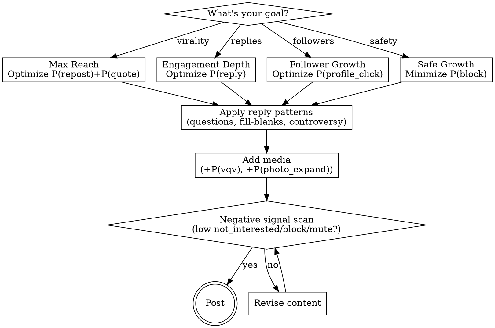

# X Algorithm Optimizer

Optimize content for X's 2026 neural recommendation system. Based on technical analysis of the `xai-org/x-algorithm` codebase (May 15, 2026 release), this skill provides both **tactical templates** for immediate use and **deep architectural understanding** for strategic advantage.

> **Changelog — 2026-05-15:** Re-audited against the `xai-org/x-algorithm` repo refresh (`run_pipeline.py`, Grox content-understanding service, ads blending, `RankingScorer`). See "What Changed (2026-05-15)" at the bottom. Key corrections: the exact action list is now confirmed (no `bookmark`, no `expand_details`); negative signals use a **bounded normalization**, NOT a raw `-1000` multiplier; scoring weights are runtime feature-switch params and are NOT published in the repo (do not quote specific numbers as fact).

## The Paradigm Shift: Neural > Heuristics

X has moved to an **end-to-end neural architecture** and, per the repo, has "eliminated every single hand-engineered feature and most heuristics" (`README.md`). The pipeline:

- **Home Mixer**: Rust orchestration layer — query hydration → candidate sourcing → hydration → filters → scorers → selector → post-selection filters → ads blending.
- **Thunder**: In-network candidate source — an in-memory store of recent posts from accounts you follow (sub-millisecond lookups, Kafka-fed).
- **Phoenix**: Out-of-network retrieval (Two-Tower model over a global corpus) + the neural ranker (a Grok-1-derived transformer).
- **Grox**: A separate content-understanding service (spam, safety/PTOS, post category, "banger" quality screen, multimodal embeddings).

**The implication**: posting-time tricks and hashtag stuffing don't work. The Phoenix ranker predicts engagement-action probabilities from your engagement-history embeddings; Grox classifiers screen content quality and safety. Alignment beats manipulation.

> Accuracy note: the Phoenix **ranker** is a Grok-1-derived transformer that operates on hash-based ID embeddings and engagement sequences — it does not "read" your post as natural-language prose. Genuine content reading (spam/safety/category/multimodal) happens in the **Grox** service.

---

## Quick Start

**Analyze a post**: "Score this X post against the algorithm: [paste]"

**Generate optimized content**: "Write an algorithm-optimized X post about [topic]"

**Deep dive**: "Explain why this post would/wouldn't perform using Phoenix mechanics"

**Debug underperformance**: "Why isn't this post getting reach? Analyze against weighted scorer"

---

## Cheat Sheet

**DO:**
- Maximize replies + reposts + quotes + shares: questions, fill-blanks, "hot take + nuance" (network-extending actions are the top tier)
- Include media: adds the `photo_expand` and `vqv` (video quality view) terms; videos must clear a minimum duration to score `vqv`
- Diversify (don't expect multiple of your posts in one feed response — `AuthorDiversityScorer` attenuates repeat authors per-response)
- Post when your audience is active (the `AgeFilter` hard-drops posts past `max_age`; early velocity matters)
- Build a concentrated niche (strengthens your User Tower embedding for out-of-network retrieval)
- Lean on in-network reach — out-of-network candidates are multiplied down by `OonWeightFactor`

**DON'T:**
- Use spammy patterns (the Grox `spam` classifier and `banger_screen` exist; low-follower reply spam is specifically classified)
- Post rage-bait (negative actions renormalize the score into the suppressed bucket)
- Link-only posts (forfeit media probability terms; low intrinsic engagement)
- Post unsafe/PTOS-violating content (Grox safety classifiers + post-selection `VFFilter`)

**TARGET:** minimize `not_interested` / `block` / `mute` / `report`. Specific "block rate %" thresholds are NOT in the repo — treat any percentage as a rule of thumb, not code.

---

## The Weighted Scorer Formula

Every post receives a score. Source: `home-mixer/scorers/weighted_scorer.rs` and the newer `home-mixer/scorers/ranking_scorer.rs`.

```
combined_score = Σ (weight_action × P(action))   // positive AND negative actions summed
final_score    = offset_score(combined_score)    // bounded normalization, NOT a raw cliff
```

The Phoenix Grok-based transformer predicts a probability for each action. Weights are pulled at **request time from a feature-switch `Params` system** (`params.get(FavoriteWeight)`, `params.get(ReplyWeight)`, etc. — see `ranking_scorer.rs::ScoringWeights::from_params`). **The actual weight numbers are NOT in the open-source repo.** Anyone quoting "P(reply) = 15" is guessing.

### The 19 confirmed action types

Source: `phoenix/runners.py::ACTIONS` and `weighted_scorer.rs`:

`favorite, reply, repost, photo_expand, click, profile_click, vqv (video quality view), share, share_via_dm, share_via_copy_link, dwell, quote, quoted_click, follow_author, not_interested, block_author, mute_author, report, dwell_time`

The Rust `RankingScorer` additionally references `quoted_vqv`, `click_dwell_time`, and `not_dwelled`. **Note: there is no `bookmark` action and no `expand_details`/"Show more" action** — those were in earlier versions of this skill and have been removed.

### Engagement hierarchy (DIRECTION confirmed, magnitude inferred)

The repo confirms the **sign** of each action but NOT its weight. Treat the tiers below as relative ordering, not literal multipliers.

| Tier | Actions | Sign | Strategic Implication |
|------|---------|------|----------------------|
| **1. Network-extending** | reply, repost, quote, share, share_via_dm, share_via_copy_link | positive | High-friction actions that push content to new networks. Algorithm is built around conversation. |
| **2. Validators** | favorite, vqv (video), photo_expand, follow_author | positive | Lower friction, validate relevance. `vqv` only counts when `video_duration_ms > MIN_VIDEO_DURATION_MS`. |
| **3. Passive signals** | click, profile_click, quoted_click, dwell, dwell_time | positive | Passive signals. Low weight by design to prevent clickbait farming. |
| **4. Negative** | not_interested, block_author, mute_author, report, not_dwelled | negative | Push content down. See "How negatives actually work" below — it is NOT a `-1000` cliff. |

### How negatives actually work (corrected)

The previous version of this skill claimed blocks are weighted `~-1000x`. **That is wrong.** The codebase (`weighted_scorer.rs::offset_score` / `ranking_scorer.rs::offset_score`) does this:

```
if combined_score < 0.0:
    final = (combined_score + NEGATIVE_WEIGHTS_SUM) / WEIGHTS_SUM * NEGATIVE_SCORES_OFFSET
else:
    final = combined_score + NEGATIVE_SCORES_OFFSET
```

Negative actions still hurt — they pull `combined_score` toward/below zero, and a negative `combined_score` is renormalized into a small bounded range. But the effect is a **bounded floor**, not an unbounded `-1000` penalty that "negates hundreds of likes" with a single block. The strategic takeaway is unchanged (negative signals are disproportionately damaging and you should minimize them), but stop quoting the fake `-1000` math.

### The strategic takeaway

You cannot compute a literal score without X's private weights. What you CAN rely on from the code:
1. Positive actions sum; negative actions subtract; the result is normalized.
2. Conversation/amplification actions are the highest-value class.
3. Negative actions disproportionately damage reach (renormalization floor).
4. Video `vqv` only scores if the video clears a minimum duration.

---

## The Seven Alpha Mechanics

These are the specific, hard-coded mechanisms that determine content fate—derived directly from the codebase.

| # | Mechanic | Key Insight | Source | Action |
|---|----------|-------------|--------|--------|
| 1 | Candidate Isolation | Posts scored independently via attention masking, not on a curve | `phoenix/README.md` attention mask | Focus on intrinsic quality |
| 2 | Author Diversity Penalty | `(1-floor)·decay^position + floor` per repeat author IN ONE FEED | `author_diversity_scorer.rs` | Diversify; don't expect 5 posts in one feed |
| 3 | Negative Signal Renormalization | Negatives pull score below zero → bounded renormalization (NOT a -1000 cliff) | `weighted_scorer.rs::offset_score` | Minimize blocks/mutes/reports/not-interested |
| 4 | Multimodal Bonus | Media adds `photo_expand` + `vqv` terms; `vqv` needs min video duration | `weighted_scorer.rs` vqv_weight_eligibility | Include media; videos must clear min length |
| 5 | OON Demotion | Out-of-network posts multiplied by `OonWeightFactor` (<1) | `oon_scorer.rs`, `ranking_scorer.rs` | In-network reach is structurally favored |
| 6 | Two-Tower Retrieval | `dot(UserTower, ItemTower)` over a global corpus for OON discovery | `phoenix/recsys_retrieval_model.py` | Build a concentrated niche embedding |
| 7 | Age Filter | Hard cutoff: posts older than `max_age` are dropped before scoring | `home-mixer/filters/age_filter.rs` | Post when audience is active; early velocity matters |
| 8 | Grox Content Understanding | Separate service classifies spam, post category, "banger" potential, PTOS safety | `grox/` service | Avoid spam patterns; quality content gets a positive screen |

> Note on Mechanic 2: the `AuthorDiversityScorer` deduplicates authors **within a single feed response**, not across a day. The "space posts 4-6 hours apart" advice is still reasonable for impression fatigue, but the code mechanism is per-response author attenuation, not a cross-session timer.

### 1. Candidate Isolation (Fair Scoring)

The Phoenix transformer uses a custom **attention mask** that prevents "context bleeding" between posts in the same scoring batch. Each post is scored **independently** against only the user context.

**What this means**: Your content is judged solely on its relationship with the viewer—not graded on a curve against whatever else is in that millisecond's batch. Quality is intrinsic.

### 2. Author Diversity Penalty (Anti-Spam)

The `AuthorDiversityScorer` tracks which authors have already been selected for the timeline. If Author A appears at position 1, their next post gets an **attenuation penalty** (estimated 0.3-0.7x) for positions 2+.

**Optimal strategy**:
- Space posts 4-6+ hours apart to reset fatigue
- Quality over quantity is mathematically enforced
- "Posting sprees" compound penalties—your 3rd post in an hour may score 0.3 × 0.3 = 0.09x

### 3. Negative Signal Renormalization (Harm Reduction)

Correction from prior versions: there is **no `-1000` weight**. The mechanism (`weighted_scorer.rs` / `ranking_scorer.rs`) is:

- All actions (positive and negative) are summed into `combined_score`.
- If `combined_score` ends up negative, it is renormalized: `(combined_score + negative_weights_sum) / total_weights_sum * NEGATIVE_SCORES_OFFSET`.
- If positive, it just gets `+ NEGATIVE_SCORES_OFFSET`.

So negative actions still operate on **harm reduction over engagement maximization** — enough negative signal flips a post into the negative-score bucket where it is heavily suppressed. But the penalty is a **bounded floor**, not an exploding multiplier. Do not present per-block point math (e.g. "one block = -1000 likes") as fact; the weights are private feature-switch values.

**Author-level reputation, cluster demotion, and "author health score" are NOT in this open-source release.** They are plausible but unverified — flag them as inference, not code-confirmed.

**Practical guidance (unchanged):** keep `not_interested` / `block` / `mute` / `report` as low as possible. They are the only thing that can flip an otherwise-good post negative.

### 4. Multimodal Shadow Algorithms

Phoenix predicts **media-specific probabilities**: `vqv` (video quality view) and `photo_expand`. These are distinct scoring terms.

**Text-only posts forfeit these entirely**:
```
Text:  Score = w_reply×P(reply) + w_like×P(like)
Media: Score = w_reply×P(reply) + w_like×P(favorite) + w_vqv×P(vqv) + w_photo×P(photo_expand)
```

**The media bonus is structural, not optional.**

### 5. Grok-Based Ranking + Grox Content Understanding

Two distinct Grok-related systems are in the repo — don't conflate them:

**a) The Phoenix ranker (Grok-1 transformer).** The ranking model in `phoenix/` is "ported from the Grok-1 open source release ... adapted for recommendation system use cases" (`phoenix/README.md`). It is a transformer that consumes your engagement history as a sequence and predicts the 19 action probabilities. It is NOT a chat-style LLM reading your post and reasoning about it in natural language. It works on **hash-based embeddings** of post IDs, author IDs, and actions. So "Grok literally reads your tweet" overstates it for the ranking stage — the ranker learns relevance from engagement-sequence patterns, not from prose comprehension.

**b) The Grox content-understanding service (new in this release).** `grox/` is a separate task-execution service with classifiers and embedders. Confirmed tasks include:
- `task_spam_detection.py` — spam classification (with a low-follower spam classifier)
- `task_safety_ptos_policy.py` / `task_safety_ptos_category.py` — PTOS policy/safety enforcement
- `task_banger_screen.py` — a "banger initial screen" classifier that scores post/topic quality
- `task_multimodal_post_embedding.py` — multimodal (text+image+video) post embeddings
- `task_post_safety_screen_deluxe.py` — post safety screening

This is where genuine content understanding happens (spam, safety, category, multimodal embedding). The `BangerInitialScreenClassifier` is the closest thing to a "quality score" — high-quality posts get a positive screen.

**The death of hacks (still true):** spam-like behavior, low-effort patterns, and unsafe content are caught by Grox classifiers and by negative-action prediction. Hashtag stuffing remains a bad idea, but the precise "Grok sees hashtag-content mismatch" claim is inference, not a code-confirmed feature.

### 6. Two-Tower Retrieval (Cold Start Solution)

Out-of-network discovery uses a **Two-Tower Neural Network**:
- **User Tower**: Encodes your engagement history, demographics, negative feedback into vector U
- **Item Tower**: Encodes post content, media, author features into vector I
- **Similarity**: dot(U, I) determines retrieval

**Cold start strategy**: New accounts have weak User Tower embeddings. Solutions:
1. Ride trending topics (aligns with global context vector)
2. Build niche first (concentrated topic cluster builds clear embedding)
3. Engage authentically (your reply history shapes your User Tower)

### 7. Age Filter (Hard Cutoff, Not Decay)

Correction: `home-mixer/filters/age_filter.rs` is a **hard binary filter**, not an exponential decay curve. It computes the post's age from its tweet ID and drops any candidate older than `max_age`:

```rust
fn is_within_age(&self, tweet_id: u64) -> bool {
    duration_since_creation_opt(tweet_id)
        .map(|age| age <= self.max_age)
        .unwrap_or(false)
}
```

There is no graded decay multiplier in this filter — a post is either within the window or removed entirely before scoring. The `max_age` value is a config parameter and is not published in the repo.

**Optimal timing (still valid):** post when your audience is active so early engagement accrues while the post is fresh and still inside the candidate window. Out-of-network discovery via Phoenix retrieval also favors recent posts (the demo corpus is a 6-hour window).

---

## Content Generation Framework



### Step 1: Choose Optimization Target

| Goal | Primary Metric | Format Bias |
|------|---------------|-------------|
| Maximum reach | P(repost) + P(quote) | Shareable insights, data, frameworks |
| Engagement depth | P(reply) | Questions, debates, incomplete statements |
| Follower growth | P(profile_click) | Thread hooks, expertise signals |
| Safe growth | Low P(block) | Nuanced takes, inclusive framing |

### Step 2: Apply the Reply Optimization

Replies are a top-tier network-extending action (exact weight is a private feature-switch param). Structure content to maximize them:

**High P(reply) patterns**:
- Open questions demanding specific experience: "What's your biggest [X] failure?"
- Fill-in-the-blank: "The most underrated skill is ___"
- Intentional incompleteness: List with obvious gap
- Nuanced controversy: "Hot take: [statement]. But here's the nuance..."
- Correctability: Slightly wrong statement experts will correct

**Low P(reply) patterns**:
- Rhetorical questions (no answer expected)
- Perfect statements (nothing to add)
- Closed conclusions ("In summary...")

### Step 3: Add Media (Structural Bonus)

Media adds probability terms you otherwise forfeit.

**Image optimization**:
- Vertical aspect ratios get cropped → forces P(photo_expand)
- Data visualizations invite inspection
- High contrast catches scroll

**Video optimization**:
- Hook in first 3 seconds (before scroll-away)
- Captions for sound-off (80% watch muted)
- Loop-worthy endings increase replay

### Step 4: Negative Signal Scan

Before posting, check:
- Could any audience segment find this block-worthy?
- Is the engagement mechanism genuine or annoying?
- Does controversial content include nuance to reduce polarization?

**The rule**: If your post might generate 5+ blocks per 1000 impressions, reconsider.

---

## Thread Strategy (Per-Tweet Scoring)

Threads are scored **per tweet**. The algorithm evaluates Tweet 1 independently.

**Tweet 1 (The Hook)**:
- Must work standalone—this is what gets scored for reach
- Include the value proposition clearly
- Don't waste on "Thread!" or "🧵" alone

**Tweet 2-N (The Delivery)**:
- Scored only for users who click through
- Deliver on the hook's promise
- Each tweet should have standalone value

**Final Tweet (The CTA)**:
- Clear call to action (follow, comment, share)
- Summary of key insight
- Bookmark-worthy standalone

**Anti-pattern**: "Thread! 🧵" as Tweet 1 with thin content = spam signal to Grok.

---

## Platform Specs (Quick Reference)

> These are UX/craft heuristics, not algorithm parameters. The repo confirms media adds the `photo_expand` and `vqv` action terms; everything else below is sensible practice, not code-derived.

| Element | Optimal | Why |
|---------|---------|-----|
| **Characters** | 71-100 (max 280) | Reduce reader friction (heuristic, not a scoring term) |
| **Hashtags** | 0-1 | Low-effort/spammy patterns risk Grox spam classification |
| **Images** | 1200×675px or vertical | Vertical crops in feed → invites the `photo_expand` action |
| **Video** | Hook in 3s, captioned, clears min duration | `vqv` only scores when `video_duration_ms > MIN_VIDEO_DURATION_MS` |
| **Media source** | Native upload only | Links don't produce `photo_expand`/`vqv` terms |

---

## Debugging Underperformance

When content underperforms, diagnose against the weighted scorer:

### Low Reach Despite Engagement
**Likely cause**: Negative actions (`not_interested`/`block`/`mute`/`report`) pulling the score into the suppressed bucket.
**Check**: Is content polarizing? Does it generate negative reactions alongside positive?

### High Impressions, Low Engagement
**Likely cause**: Weak network-extending signal (reply/repost/quote/share).
**Check**: Does content invite response? Is it shareable?

### New Account Struggling
**Likely cause**: Weak User Tower embedding, cold-start problem. Note: the repo has explicit new-user handling — a separate `PhoenixRankerNewUserInferenceClusterId` model and a `NewUserOonWeightFactor` (new users with enough follows get a different out-of-network weighting).
**Solution**: Build a concentrated topic presence and engage authentically so your engagement sequence is informative.

### Declining Reach Over Time
**Likely cause**: Sustained negative-action rate. Note: a persistent per-author "health score" is NOT in this open-source release — treat it as inference. The code-confirmed mechanism is per-post negative-action prediction.
**Solution**: Audit recent content for patterns that draw `not_interested`/`block`, rebuild with safer content.

---

## Anti-Patterns (Algorithmic Self-Sabotage)

### Engagement Pods
Coordinated/low-follower reply spam is exactly what the Grox `SpamEapiLowFollowerClassifier` (`grox/tasks/task_spam_detection.py`) is built to catch. "Grok detects coordination patterns" is plausible but the specific coordination-graph claim is inference.

### Hashtag Stuffing
Still a bad idea — low-effort, spam-adjacent. The precise "semantic mismatch detection" mechanism is inference, not a code-confirmed feature.

### Link-Only Posts
No media probability terms (`photo_expand`, `vqv`) + low intrinsic engagement = structural disadvantage.

### Rage-Farming
Negative actions push `combined_score` negative, which renormalizes into the suppressed bucket. High engagement does not rescue it.

### Posting Sprees
The `AuthorDiversityScorer` attenuates repeat authors **within one feed response** (`(1-floor)·decay^position + floor`). It is not a cross-day timer, but flooding still means your own posts compete against each other and get attenuated when more than one is a candidate.

---

## Reference Files

| File | Contents |
|------|----------|
| `references/phoenix-architecture.md` | Two-Tower model, Grok adaptation, embedding dynamics |
| `references/weighted-scorer.md` | Complete weight hierarchy, probability math, examples |
| `references/post-templates.md` | 12+ proven formats with algorithm alignment notes |

## Analysis Script

Run the analyzer directly:
```bash
python scripts/analyze_x_post.py
```

Or import in Python:
```python
from scripts.analyze_x_post import analyze_post, format_report, calculate_weighted_score

# Analyze a post
result = analyze_post("Your post text", include_media=True, media_type="image")
print(format_report(result))

# Calculate raw weighted score (illustrative only — weights are inferred, not from the repo)
score = calculate_weighted_score(p_reply=0.15, p_like=0.08, p_block=0.001)
```

> The analysis script uses **inferred placeholder weights**. X's real weights are runtime feature-switch params not published in `xai-org/x-algorithm`. Use the script for relative comparison between two drafts, never as an absolute score.

---

## The Meta-Strategy

**Old paradigm**: Game the algorithm with hacks (hashtags, timing, pods)
**New paradigm**: Align with the neural network's objective function

The algorithm optimizes for:
1. Conversation and amplification (reply, repost, quote, share — the top-tier positive actions)
2. Relevance to your engagement-history embedding (Phoenix ranker)
3. User satisfaction (negative actions renormalize the score into the suppressed bucket)
4. Content quality and safety (Grox classifiers: spam, PTOS safety, banger screen)

**Your strategy**: Create content that genuinely maximizes these. The era of manipulation is over; the era of alignment has begun.

---

## What Changed (2026-05-15)

Re-audit of this skill against the `xai-org/x-algorithm` repo (May 15, 2026 release). Corrections applied:

| Area | Old claim | Corrected |
|------|-----------|-----------|
| Action list | Included `bookmark`, `expand_details`/"Show more" | Repo's `phoenix/runners.py::ACTIONS` lists 19 actions; **no `bookmark`, no `expand_details`**. Confirmed set: favorite, reply, repost, photo_expand, click, profile_click, vqv, share, share_via_dm, share_via_copy_link, dwell, quote, quoted_click, follow_author, not_interested, block_author, mute_author, report, dwell_time. Rust `RankingScorer` adds `quoted_vqv`, `click_dwell_time`, `not_dwelled`. |
| Negative weights | "Blocks weighted ~-1000x; one block ≈ -1000 likes" | No such number. `offset_score` renormalizes a negative `combined_score` via `(combined + negative_sum)/total_sum * NEGATIVE_SCORES_OFFSET` — a **bounded floor**, not a -1000 cliff. Worked-math examples (-25.42 etc.) were fabricated. |
| Weight values | Quoted specific weights (15/12/10/1/-1000) as if from `main.rs` | Weights come from a runtime feature-switch `Params` system (`params.get(FavoriteWeight)`...). **Not in the repo.** All numbers are inferred. |
| Time decay | "`AgeFilter` applies exponential decay" | `age_filter.rs` is a **hard binary cutoff** at `max_age`. No decay curve. |
| Grok "reads your tweet" | LLM reads post prose, detects sarcasm/tone/hashtag-mismatch | The Phoenix **ranker** is a Grok-1-derived transformer over hash-based ID embeddings + engagement sequences — not prose comprehension. Content reading lives in the separate **Grox** service (spam, PTOS safety, banger screen, multimodal embeddings). |
| Author "health score" / cluster shadowban | Presented as code-confirmed | Not in this release. Flagged as inference. |
| Video signal | `P(video_view)` | Actual action is `vqv` (video quality view); only scores when `video_duration_ms > MIN_VIDEO_DURATION_MS`. |

### New since prior version
- **Grox content-understanding service** (`grox/`): spam detection, PTOS safety policy/category, "banger" quality screen, multimodal post embeddings, ASR, reply ranking.
- **Ads blending** (`home-mixer/ads/`): `SafeGapAdsBlender` / `PartitionOrganicBlender` inject ads into safe gaps with brand-safety tracking.
- **New candidate sources**: ads, who-to-follow (max 3), Phoenix MoE retrieval, Phoenix topics, prompts, push-to-home.
- **OON demotion confirmed**: `oon_scorer.rs` / `ranking_scorer.rs` multiply out-of-network candidates by `OonWeightFactor`; topic requests use `TopicOonWeightFactor`; eligible new users use `NewUserOonWeightFactor`.
- **Richer query hydration**: followed topics, starter packs, impression bloom filters, IP, mutual-follow graph, served history, inferred gender/demographics.
- **End-to-end pipeline**: `phoenix/run_pipeline.py` runs retrieval → ranking from exported checkpoints; a ~3 GB pre-trained mini Phoenix model ships via Git LFS.
