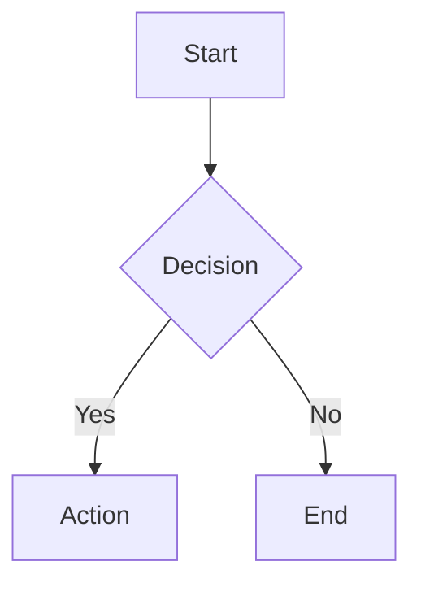

# Notion Sync

Two-way sync between local markdown files and Notion pages via the Notion Markdown API.

## Prerequisites

- `NOTION_API_KEY` environment variable must be set (a Notion internal integration token)
- Optional: `NOTION_PARENT_PAGE_ID` env var as default parent for new pages
- The Notion integration must have access to the target pages/databases
- Required capabilities vary by operation — see [Access Control](#access-control) below

### Authentication Setup

1. Create an internal integration at https://www.notion.so/profile/integrations/internal
2. Copy the integration token (starts with `ntn_` or `secret_`)
3. Store it securely — **never commit tokens to git or hardcode in files**

**Recommended: set via shell profile** (most secure for personal use):
```bash
# Add to ~/.zshrc or ~/.bashrc (the token stays in your local shell config)
export NOTION_API_KEY="ntn_your_token_here"
```

**Alternative: `.env` file** (for project-specific tokens):
```bash
# .env (make sure this is in .gitignore!)
NOTION_API_KEY=ntn_your_token_here
```

**Alternative: system keychain** (macOS):
```bash
# Store
security add-generic-password -a "$USER" -s "notion-api-key" -w "ntn_your_token_here"
# Retrieve
export NOTION_API_KEY=$(security find-generic-password -a "$USER" -s "notion-api-key" -w)
```

Check and load the API key before any operation:

```bash
if [ -z "$NOTION_API_KEY" ]; then
  echo "Error: NOTION_API_KEY is not set. Create an integration at https://www.notion.so/profile/integrations/internal"
  exit 1
fi
```

**Important**: Always use `export` when setting the key. A bare assignment like `NOTION_API_KEY="value" && curl ...` will NOT make the variable available — the `&&` creates a separate command context. Use `export NOTION_API_KEY=...` followed by your commands.

4. Grant the integration access to your pages/databases: open the page in Notion → `...` menu → `Connections` → add your integration

**API version 2026-03-11 breaking changes** (vs older versions): `in_trash` replaces `archived` in all request/response bodies; `position` object replaces the flat `after` string for block placement; `meeting_notes` replaces `transcription` block type.

## Operations

The user may ask for any of these operations. Determine which one based on their request:

### 1. Push (Local -> Notion): `notion-push`

Push a local markdown file to Notion — either creating a new page or updating an existing one.

**New page (no `notion_page_id` in frontmatter):**

Requires `insert_content` and `insert_property` capabilities.

```bash
# Auto-preprocess: converts GFM → Notion format if needed, skips if already Notion format
SCRIPT_DIR="$(cd "$(dirname "$0")" && pwd)"
PREPROCESSED=$(python3 "$SCRIPT_DIR/../scripts/notion_preprocess.py" "$FILE_PATH")

# Extract the markdown content (strip ONLY the leading YAML frontmatter block, then strip leading blank lines)
# Note: sed '/^---$/,/^---$/d' would strip ALL --- pairs, destroying divider blocks in the body
CONTENT=$(echo "$PREPROCESSED" | awk '/^---$/ && fm_done==0 { in_fm = 1 - in_fm; if (in_fm==0) fm_done = 1; next } in_fm==0' | awk 'NF{found=1} found')

# Extract title from the first H1 heading (strip any {color=...} attributes)
TITLE=$(echo "$CONTENT" | grep -m1 '^# ' | sed 's/^# //' | sed 's/ *{[^}]*}$//')

# Strip the leading H1 from content — title is set via properties.title (or properties.Name for databases)
# If we leave it in, database pages show a duplicate H1 in the body
CONTENT=$(echo "$CONTENT" | awk 'NR==1 && /^# /{next} {print}')

# Build JSON payload safely — jq -n --arg handles tabs, quotes, and large content correctly
# (Inline jq -Rs . inside curl --data breaks with tabs and shell metacharacters)
PAYLOAD=$(jq -n \
  --arg parent "$PARENT_PAGE_ID" \
  --arg title "$TITLE" \
  --arg md "$CONTENT" \
  '{parent: {page_id: $parent}, properties: {title: [{text: {content: $title}}]}, markdown: $md}')

curl -s -X POST 'https://api.notion.com/v1/pages' \
  -H 'Authorization: Bearer '"$NOTION_API_KEY"'' \
  -H 'Notion-Version: 2026-03-11' \
  -H 'Content-Type: application/json' \
  --data "$PAYLOAD"
```

The `markdown` field expects actual newline characters — `jq -n --arg` handles this by safely JSON-encoding the content (including tabs, quotes, and special characters). The `markdown` parameter is mutually exclusive with `children`, `content`, and `template` — never mix them. **Always set `properties.title` explicitly** — Notion's auto-extraction is unreliable (fails with leading blank lines, includes `{color=...}` literally). The response is a standard page object — extract `id` and `url` from it.

**Critical: How Notion handles the first H1 and page title.** The page title is a separate property (`properties.title`), NOT part of the body markdown. Behavior differs by parent type:
- **Standalone pages** (parent is a page): A leading `# H1` that matches `properties.title` is consumed — Notion strips it from the body. On pull, the H1 is NOT in the returned markdown.
- **Database pages** (parent is a database): The leading `# H1` is **NOT consumed** — it stays in the body as a visible heading, creating a duplicate with the title property.

Because of this inconsistency, **always strip the leading `# H1` from markdown before pushing** and rely solely on `properties.title` (or `properties.Name` for databases) to set the page title. This ensures consistent behavior regardless of parent type. On pull, always restore the H1 by prepending `# {title}\n` to the markdown for local readability.

After successful creation:
- Extract `id` and `url` from the response
- Update the local file's YAML frontmatter with `notion_page_id`, `notion_url`, `notion_parent_id`, `notion_last_synced`, and `title`

**Existing page (has `notion_page_id` in frontmatter):**

Requires `update_content` capability.

Use `replace_content` for full replacement:
```bash
# Auto-preprocess: converts GFM → Notion format if needed, skips if already Notion format
SCRIPT_DIR="$(cd "$(dirname "$0")" && pwd)"
PREPROCESSED=$(python3 "$SCRIPT_DIR/../scripts/notion_preprocess.py" "$FILE_PATH")

CONTENT=$(echo "$PREPROCESSED" | awk '/^---$/ && fm_done==0 { in_fm = 1 - in_fm; if (in_fm==0) fm_done = 1; next } in_fm==0' | awk 'NF{found=1} found')

# Strip leading H1 — title is managed via properties, not body content
CONTENT=$(echo "$CONTENT" | awk 'NR==1 && /^# /{next} {print}')

PAYLOAD=$(jq -n --arg md "$CONTENT" '{type: "replace_content", replace_content: {new_str: $md}}')

curl -s -X PATCH 'https://api.notion.com/v1/pages/'"$PAGE_ID"'/markdown' \
  -H 'Authorization: Bearer '"$NOTION_API_KEY"'' \
  -H 'Notion-Version: 2026-03-11' \
  -H 'Content-Type: application/json' \
  --data "$PAYLOAD"
```

For surgical edits (only parts of a page changed), prefer `update_content` with search-and-replace. Each `old_str` must match exactly one location (matching is case-sensitive). If it matches multiple locations, set `"replace_all_matches": true` on that operation:
```bash
PAYLOAD=$(jq -n --arg old "$OLD" --arg new "$NEW" \
  '{type: "update_content", update_content: {content_updates: [{old_str: $old, new_str: $new}]}}')

curl -s -X PATCH 'https://api.notion.com/v1/pages/'"$PAGE_ID"'/markdown' \
  -H 'Authorization: Bearer '"$NOTION_API_KEY"'' \
  -H 'Notion-Version: 2026-03-11' \
  -H 'Content-Type: application/json' \
  --data "$PAYLOAD"
```

If an update would delete child pages or databases, the API refuses by default. To allow it, add `"allow_deleting_content": true` to the command body. This works on `replace_content`, `update_content`, and the legacy `replace_content_range`:
```json
{
  "type": "update_content",
  "update_content": {
    "content_updates": [{"old_str": "...", "new_str": "..."}],
    "allow_deleting_content": true
  }
}
```

**Note:** The API supports four update command variants (a discriminated union), but only `update_content` and `replace_content` are recommended for new integrations. The legacy `insert_content` and `replace_content_range` commands use an ellipsis-based selection format — see `references/working-with-markdown-content.md` if you need them.

**Note:** All update variants return the full page markdown in the response (as a `page_markdown` object with `markdown`, `truncated`, and `unknown_block_ids` fields) — use this to update the local file and `notion_last_synced` timestamp after a successful push.

**Synced pages cannot be updated** — if the target is an `external_object_instance_page` (synced page), the API returns a `validation_error`. Check for this and inform the user.

**Meeting note transcripts are skipped during updates** — the update endpoint ignores transcript content. If you retrieved a page with `include_transcript=true`, don't try to match transcript text in `old_str` selections — the update endpoint does not see transcript content during matching and will return a `validation_error`.

### 2. Pull (Notion -> Local): `notion-pull`

Retrieve a Notion page and save it locally as markdown. Requires `read_content` capability.

```bash
RESPONSE=$(curl -s 'https://api.notion.com/v1/pages/'"$PAGE_ID"'/markdown' \
  -H 'Authorization: Bearer '"$NOTION_API_KEY"'' \
  -H 'Notion-Version: 2026-03-11')
```

The response is a `page_markdown` object:
```json
{
  "object": "page_markdown",
  "id": "page-uuid",
  "markdown": "# Page content...",
  "truncated": false,
  "unknown_block_ids": []
}
```

Parse the response:
- Extract `markdown` field content
- **Restore the page title as `# H1`** — fetch the page title from `GET /v1/pages/:id` (`properties.title`) and prepend `# {title}\n` to the markdown **if** it doesn't already start with `# `. Use a single newline (not `\n\n`) — Notion doesn't preserve a blank line between the consumed title and the first block, so `\n\n` creates a spurious blank line that breaks round-trip fidelity.
- Check `truncated` — if `true`, some blocks were not loaded (either the page exceeded ~20,000 blocks, or child content is permission-restricted); iteratively fetch unknown blocks (see below)
- Check `unknown_block_ids` — if non-empty, attempt to fetch each one
- Add YAML frontmatter with sync metadata
- Write to local file
- **Download media locally** — run the media handler to preserve files before URLs expire (see [Media Handling](#media-handling))

Blocks may appear as `<unknown url="..." alt="block_type"/>` tags for two reasons: (1) truncation beyond the ~20,000 block limit, or (2) permission restrictions (child pages/content not shared with the integration). For unsupported block types (bookmark, embed, etc.), you can fall back to the block-based API to retrieve structured data.

**For meeting notes with transcripts**, add `?include_transcript=true`:
```bash
RESPONSE=$(curl -s 'https://api.notion.com/v1/pages/'"$PAGE_ID"'/markdown?include_transcript=true' \
  -H 'Authorization: Bearer '"$NOTION_API_KEY"'' \
  -H 'Notion-Version: 2026-03-11')
```
Transcripts appear as `<meeting-notes>` blocks in the markdown output.

**Handling large/truncated pages** — when `truncated` is `true`, re-fetch unknown block IDs to get the full content. For best experience, keep pages under a few thousand blocks.
```python
import os, json, requests

headers = {
    "Authorization": f"Bearer {os.environ['NOTION_API_KEY']}",
    "Notion-Version": "2026-03-11",
}

resp = requests.get(
    f"https://api.notion.com/v1/pages/{page_id}/markdown",
    headers=headers,
).json()

all_markdown = resp["markdown"]

# Re-fetch truncated blocks — object_not_found means permission issue, skip gracefully
for block_id in resp.get("unknown_block_ids", []):
    try:
        block_resp = requests.get(
            f"https://api.notion.com/v1/pages/{block_id}/markdown",
            headers=headers,
        ).json()
        all_markdown += "\n" + block_resp.get("markdown", "")
    except Exception:
        pass  # object_not_found = permission-restricted, skip gracefully
```
The `unknown_block_ids` array doesn't distinguish between truncated blocks (fetchable) and permission-restricted blocks (returns `object_not_found`). Handle both gracefully.

The frontmatter to prepend:
```yaml
---
notion_page_id: "<page-id>"
notion_parent_id: "<parent-id>"
notion_parent_type: "<page or database>"
notion_last_synced: "<current ISO8601 timestamp>"
notion_url: "<notion-page-url>"
title: "<from properties.title>"
notion_icon: "<emoji, URL, or {type, id, name} object — see below>"
---
```

**Icon handling on pull** — read the `icon` field from `GET /v1/pages/:id` and store in frontmatter:

```python
icon = page_data.get("icon")
if icon:
    if icon["type"] == "emoji":
        # Store as literal emoji string
        frontmatter["notion_icon"] = icon["emoji"]  # e.g. "🚀"
    elif icon["type"] == "external":
        # Notion built-in icons (e.g. /icons/document_gray.svg) or any external URL
        frontmatter["notion_icon"] = icon["external"]["url"]
    elif icon["type"] == "custom_emoji":
        # Custom workspace emoji — need id to set it back
        frontmatter["notion_icon"] = {
            "type": "custom_emoji",
            "id": icon["custom_emoji"]["id"],
            "name": icon["custom_emoji"]["name"],
        }
    elif icon["type"] == "file":
        # Notion-hosted file — store the URL (may expire)
        frontmatter["notion_icon"] = icon["file"]["url"]
```

**Icon handling on push** — read `notion_icon` from frontmatter and set via `PATCH /v1/pages/:id`:

```python
icon_value = frontmatter.get("notion_icon")
if icon_value:
    if isinstance(icon_value, str):
        # Single character or emoji → emoji type
        # URL string → external type
        if icon_value.startswith("http://") or icon_value.startswith("https://"):
            icon_payload = {"type": "external", "external": {"url": icon_value}}
        else:
            icon_payload = {"type": "emoji", "emoji": icon_value}
    elif isinstance(icon_value, dict) and icon_value.get("type") == "custom_emoji":
        icon_payload = {"type": "custom_emoji", "custom_emoji": {"id": icon_value["id"]}}
    # Set icon via PATCH /v1/pages/:id (NOT the markdown endpoint)
    # Can be combined with property updates in a single PATCH call
```

For **new pages**, include `icon` in the `POST /v1/pages` body alongside `parent`, `properties`, and `markdown`:

```json
{
  "parent": {"database_id": "..."},
  "properties": {"Name": {"title": [{"text": {"content": "..."}}]}},
  "icon": {"type": "emoji", "emoji": "🚀"},
  "markdown": "..."
}
```

### 3. Two-way Sync: `notion-markdown-sync`

For files that already have `notion_page_id` in frontmatter:

1. Pull the current Notion content
2. Compare with local file content (ignoring frontmatter)
3. If only local changed: push local to Notion
4. If only Notion changed: update local file
5. If both changed: show a diff to the user and ask which version to keep (or attempt a merge)
6. If neither changed: report "already in sync"

To detect changes, compare the markdown content (stripped of frontmatter) with what Notion returns. A simple content hash comparison works — store the hash in frontmatter as `notion_content_hash` if desired.

### 4. Validate: `notion-validate`

Check a local markdown file for Notion compatibility. Read `references/enhanced-markdown-format.md` for the complete format specification, then validate:

**Must check:**
- No H5/H6 headings (they silently downgrade to H4 — warn)
- No unsupported block types: bookmark, embed, link preview, breadcrumb, template (these appear as `<unknown url="..." alt="block_type"/>` in Notion)
- Tables use `<table>` HTML format with `<tr>`/`<td>`, cells contain only rich text (no block-level content)
- Table attributes are valid: `fit-page-width`, `header-row`, `header-column` (all boolean), `<colgroup>/<col>` for column colors
- Table color precedence: cell > row > column
- Indentation uses tabs, not spaces, for nesting child blocks
- Multi-line quotes use `<br>` within a single `>` line (multiple `>` lines = separate blocks)
- Empty lines that matter use `<empty-block/>` (plain blank lines get stripped)
- Special characters outside code blocks are properly escaped: `\`, `*`, `~`, `` ` ``, `$`, `[`, `]`, `<`, `>`, `{`, `}`, `|`, `^`
- No escaping inside code blocks (content is literal)
- Images use `` format, optionally with `{color="Color"}`
- Code blocks use fenced syntax with optional language (use ` ```mermaid ` for Mermaid diagrams)
- Callouts use `<callout>` tags, NOT standard `> [!NOTE]` syntax
- Toggle blocks use `<details>`/`<summary>` tags with tab-indented children
- Headings do NOT support children blocks (but toggle headings with `{toggle="true"}` do)
- `<empty-block/>` must be on its own line
- Media blocks (`<audio>`, `<video>`, `<file>`, `<pdf>`) use correct tag format
- Mentions use correct `<mention-*>` tags
- Block equations use `$` fencing (single `$` on own line), inline equations use `$equation$`
- Underline uses `<span underline="true">text</span>` (not `<u>` tags)
- Paragraphs and quotes support tab-indented children blocks

**Report format:**
```
Validation Results for: <filename>
================================
[PASS] Headings: All H1-H3 (compatible)
[WARN] Line 45: H5 heading will be converted to H4 in Notion
[FAIL] Line 72: Contains bookmark block (unsupported in Notion)
[PASS] Indentation: Uses tabs correctly
[PASS] Tables: Valid Notion format
...
Summary: X passed, Y warnings, Z failures
```

### 5. Status: `notion-status`

Scan the current directory (or specified path) for markdown files with Notion sync metadata:

```
Notion Sync Status
==================
synced    docs/guide.md          (last sync: 2026-03-12T10:30:00Z)
synced    docs/api-ref.md        (last sync: 2026-03-11T15:00:00Z)
untracked docs/new-page.md       (no notion_page_id)
modified  docs/changelog.md      (local changes since last sync)
```

## Frontmatter Management

When reading/writing frontmatter, preserve any existing non-Notion fields.

### Sync metadata fields (always present)

- `notion_page_id` — The Notion page UUID
- `notion_parent_id` — Parent page or database UUID
- `notion_parent_type` — `"page"` or `"database"`
- `notion_last_synced` — ISO8601 timestamp of last successful sync
- `notion_url` — Full Notion URL for the page
- `title` — Page title (from `properties.title`)
- `notion_icon` — Page icon (optional). Three formats depending on type:
  - Emoji: `"🚀"` (literal emoji string)
  - Notion built-in / external URL: `"https://www.notion.so/icons/document_gray.svg"` (URL string)
  - Custom emoji: `{type: "custom_emoji", id: "uuid", name: "x-twitter"}` (object with id)

### Database page properties

For pages that live in a Notion database, all database properties are stored under a `notion_properties:` key in frontmatter. On pull, convert each Notion property type to its YAML representation. On push, convert back and send via `PATCH /v1/pages/:id` (the regular page endpoint — separate from the markdown endpoint).

**Frontmatter ↔ Notion property type mapping:**

| Notion Type | YAML Value | Example | Writable? |
|---|---|---|---|
| `title` | `string` | `"My Page"` | Yes (use top-level `title:` field) |
| `rich_text` | `string` (joined plain_text) | `"Description here"` | Yes |
| `number` | `number` or `null` | `42.5` | Yes |
| `select` | `string` (option name) or `null` | `"High"` | Yes |
| `multi_select` | `list of strings` | `["Bug", "Urgent"]` | Yes |
| `status` | `string` (option name) or `null` | `"In Progress"` | Yes |
| `date` | `string` or `{start, end, time_zone}` | `"2026-03-15"` or `{start: "2026-03-13", end: "2026-03-20"}` | Yes |
| `people` | `list of {name, id}` | `[{name: "Ada", id: "uuid"}]` | Yes (by id) |
| `files` | `list of {name, url}` | `[{name: "doc.pdf", url: "https://..."}]` | Yes (external only) |
| `checkbox` | `boolean` | `true` | Yes |
| `url` | `string` or `null` | `"https://example.com"` | Yes |
| `email` | `string` or `null` | `"ada@notion.com"` | Yes |
| `phone_number` | `string` or `null` | `"+1-555-0123"` | Yes |
| `relation` | `list of page UUIDs` | `["uuid-1", "uuid-2"]` | Yes |
| `formula` | `value` (string/number/boolean/date) | `42` | **Read-only** |
| `rollup` | `value` (number/date/array) | `15` | **Read-only** |
| `unique_id` | `string` (prefix + number) | `"TASK-3"` | **Read-only** |
| `created_time` | `string` (ISO8601) | `"2026-03-13T10:39:00.000Z"` | **Read-only** |
| `created_by` | `string` (user name) | `"Ada Lovelace"` | **Read-only** |
| `last_edited_time` | `string` (ISO8601) | `"2026-03-13T10:43:00.000Z"` | **Read-only** |
| `last_edited_by` | `string` (user name) | `"Ada Lovelace"` | **Read-only** |
| `verification` | `string` (state) | `"verified"` | **Read-only** |
| `place` | *(unsupported — returns `null`)* | — | No |
| `button` | *(skip — not readable)* | — | No |

**Example frontmatter for a database page:**

```yaml
---
notion_page_id: "a1b2c3d4-e5f6-7890-abcd-ef1234567890"
notion_parent_id: "f9e8d7c6-b5a4-3210-fedc-ba0987654321"
notion_parent_type: "database"
notion_last_synced: "2026-03-13T15:30:00Z"
notion_url: "https://www.notion.so/My-Page-Title-a1b2c3d4e5f67890..."
title: "My Page Title"
notion_properties:
  Area: "Marketing"
  Priority: "High"
  Tags: ["Bug", "Urgent"]
  Status: "In Progress"
  Due date: "2026-03-20"
  Assignee:
    - name: "Ada Lovelace"
      id: "c2f20311-..."
  Completed: false
  URL: "https://example.com"
  # Read-only (informational, not pushed back)
  Created at: "2026-03-13T10:39:00.000Z"
  Last updated at: "2026-03-13T10:43:00.000Z"
  AI Summary: "Content includes code blocks for testing..."
  ID: "TASK-3"
---
```

**On pull** — read properties from `GET /v1/pages/:id`, convert each to YAML form, store under `notion_properties:`. Mark read-only types with a comment or track them in a `notion_readonly:` list in frontmatter.

**On push** — read `notion_properties:` from frontmatter. Skip read-only and unsupported types (`formula`, `rollup`, `created_time`, `created_by`, `last_edited_time`, `last_edited_by`, `unique_id`, `verification`, `button`, `place`). Convert writable properties back to Notion API format and send via `PATCH /v1/pages/:id`:

```bash
curl -s -X PATCH 'https://api.notion.com/v1/pages/'"$PAGE_ID"'' \
  -H 'Authorization: Bearer '"$NOTION_API_KEY"'' \
  -H 'Notion-Version: 2026-03-11' \
  -H 'Content-Type: application/json' \
  --data '{ "properties": { ... } }'
```

Then push the markdown content separately via `PATCH /v1/pages/:id/markdown`.

**Icon and cover** — these are top-level fields (NOT inside `properties`). Set via the same `PATCH /v1/pages/:id`:
```json
{
  "icon": { "type": "emoji", "emoji": "🎯" },
  "cover": { "type": "external", "external": { "url": "https://..." } }
}
```
Clear with `"icon": null` or `"cover": null`. Icon types: `emoji`, `external`, `file`, `file_upload`, `custom_emoji`. Cover types: `external`, `file_upload`.

**Other PATCH parameters** — the page PATCH endpoint also supports:
- `in_trash: true/false` — move to or restore from trash (replaces `archived` in API version 2026-03-11)
- `is_locked: true/false` — lock/unlock page editing
- `erase_content: true` — **destructive**: deletes all child blocks (irreversible)

**YAML → Notion API conversion examples:**

```python
# select / status → {"name": "value"}
"High"  →  {"select": {"name": "High"}}

# multi_select → [{"name": "value"}, ...]
["Bug", "Urgent"]  →  {"multi_select": [{"name": "Bug"}, {"name": "Urgent"}]}

# date (simple) → {"start": "value"}
"2026-03-15"  →  {"date": {"start": "2026-03-15"}}

# date (range) → {"start": ..., "end": ...}
{start: "2026-03-13", end: "2026-03-20"}  →  {"date": {"start": "2026-03-13", "end": "2026-03-20"}}

# people → [{"object": "user", "id": "..."}]
[{name: "Ada", id: "uuid"}]  →  {"people": [{"object": "user", "id": "uuid"}]}

# relation → [{"id": "..."}]
["uuid-1", "uuid-2"]  →  {"relation": [{"id": "uuid-1"}, {"id": "uuid-2"}]}

# rich_text → [{"text": {"content": "value"}}]
"Description"  →  {"rich_text": [{"text": {"content": "Description"}}]}

# files (external) → [{"type": "external", "name": ..., "external": {"url": ...}}]
[{name: "doc.pdf", url: "https://..."}]  →  {"files": [{"type": "external", "name": "doc.pdf", "external": {"url": "https://..."}}]}

# number, checkbox, url, email, phone_number → direct value
42  →  {"number": 42}
true  →  {"checkbox": true}
null  →  {"url": null}  (clears the value)
```

**Important notes:**
- Array properties (`multi_select`, `people`, `files`, `relation`) **replace entirely** on update — they are not additive. Send the full desired array.
- `select` and `multi_select` auto-create new options if the name doesn't exist. `status` does NOT — options must be pre-configured in Notion UI. **Commas are not allowed in option names.**
- Standalone pages (parent is a page, not a database) only support `title` — no other properties.
- `checkbox` cannot be null — use `false` to uncheck.
- Notion-hosted file URLs in `files` properties expire. On pull, note these are temporary.
- For `people`, you need the user UUID to write back — store both `name` and `id` in frontmatter.
- `files` also supports `file_upload` type (requires prior upload via File Upload API) — see reference doc for structure.
- **Clearing properties**: Set scalar types (`number`, `select`, `status`, `date`, `url`, `email`, `phone_number`) to `null`. Set array types (`multi_select`, `people`, `files`, `relation`, `rich_text`) to `[]`. `checkbox` uses `false`. `title` cannot be cleared.
- **Pagination**: `relation`, `people`, `rich_text`, `title`, `formula`, and `rollup` return max 25 items inline. If `has_more: true` in the property value, fetch the rest via `GET /v1/pages/{page_id}/properties/{property_id}`.
- See `references/notion-page-property-types.md` for complete API JSON structures for each type.

## Access Control

| Endpoint | Required Capabilities |
|----------|----------------------|
| Create page (`POST /v1/pages`) | `insert_content`, `insert_property` |
| Read content (`GET .../markdown`) | `read_content` |
| Read properties (`GET /v1/pages/:id`) | `read_content` |
| Update content (`PATCH .../markdown`) | `update_content` |
| Update properties (`PATCH /v1/pages/:id`) | `update_content` |

All endpoints work with both public and internal integration types.

## Error Handling

| Error | Meaning | Action |
|-------|---------|--------|
| `validation_error` | `old_str` not found in page, multiple matches, would delete protected content, target is synced page, or ID is a database/non-page block | Show the specific error, suggest fix |
| `validation_error` (multiple matches) | `old_str` matches more than one location | Set `replace_all_matches: true` on that operation |
| `validation_error` (deleting content) | Operation would delete child pages/databases | Set `allow_deleting_content: true` if intentional |
| `validation_error` (synced page) | Target is an `external_object_instance_page` | Synced pages cannot be updated via API |
| `object_not_found` | Page missing or no access | Check page ID, verify integration has access |
| `restricted_resource` | Missing capability | Check integration permissions per access control table above |
| HTTP 401 | Bad API key | Check NOTION_API_KEY |
| HTTP 429 | Rate limited | Wait and retry (respect Retry-After header) |

All content matching (`old_str`) is **case-sensitive**.

Always show the full error response body to help debug issues. When using curl, add `-w "\n%{http_code}"` to capture the HTTP status code alongside the response body — curl with `-s` alone exits 0 even on 4xx/5xx errors.

## Important Notion Markdown Rules

These rules are critical for reliable sync — violating them causes silent data loss or corruption:

1. **Tabs only for nesting.** Spaces won't create child blocks. Every level of nesting = one more tab.
2. **Empty lines get stripped.** Use `<empty-block/>` for intentional blank lines. Must be on its own line.
3. **Multiple `>` lines = multiple quote blocks.** For a multi-line quote, use `<br>` within ONE `>` line: `> Line 1<br>Line 2<br>Line 3`
4. **H5/H6 silently become H4.** Warn the user, don't silently allow it.
5. **Headings do NOT support children.** Don't try to nest blocks under headings (use toggle headings with `{toggle="true"}` if you need expandable headings).
6. **Table cells = rich text only.** No block-level content inside `<td>`. Color precedence: cell > row > column.
7. **`markdown` is mutually exclusive with `children`, `content`, and `template`.** Never mix them in API calls.
8. **Pre-signed file URLs expire.** When pulling, use the media handler to download files locally (see [Media Handling](#media-handling)).
9. **Escape special chars outside code blocks:** `\`, `*`, `~`, `` ` ``, `$`, `[`, `]`, `<`, `>`, `{`, `}`, `|`, `^`. Do NOT escape inside code blocks — content is literal.
10. **Content matching is case-sensitive.** `old_str` must match exactly.
11. **Paragraphs and quotes support children.** Tab-indent blocks under them to create nested content.
12. **List items should contain inline rich text.** Other block types render as children of an empty list item.

## Media Handling

Notion pre-signed file URLs expire after ~1 hour. The bundled `scripts/notion_media.py` script handles downloading media on pull and uploading local media on push.

### On Pull: Download Media Locally

After pulling a page's markdown, run the media handler to download all pre-signed media (images, audio, video, files, PDFs) to a local `assets/` directory and rewrite the markdown to use local relative paths:

```bash
python "$(dirname "$0")/../scripts/notion_media.py" download "$OUTPUT_FILE" --assets-dir assets
```

This detects pre-signed S3 URLs (containing `prod-files-secure.s3.us-west-2.amazonaws.com` or `s3.us-west-2.amazonaws.com/secure.notion-static.com` with `X-Amz-Algorithm` params), downloads each file, and rewrites:
- `` → ``
- `<audio src="https://prod-files-secure.s3...audio.mp3?X-Amz...">Caption</audio>` → `<audio src="assets/audio.mp3">Caption</audio>`

The `--assets-dir` flag defaults to `assets` (relative to the markdown file). Duplicate filenames get a hash suffix to avoid collisions.

### On Push: Upload Local Media to Notion

Before pushing markdown that references local media files, run the upload command to convert local paths to Notion-hosted URLs:

```bash
python "$(dirname "$0")/../scripts/notion_media.py" upload "$FILE_PATH" --page-id "$PAGE_ID"
```

The upload flow is multi-step because the markdown API only accepts URLs — it cannot reference `file_upload` IDs directly:

1. **Upload** each local file via `POST /v1/file_uploads` + `POST /v1/file_uploads/{id}/send`
2. **Append temporary blocks** to the page via blocks API (`PATCH /v1/blocks/{page_id}/children`) using `file_upload` references — this triggers Notion to host the files
3. **GET page markdown** — the response now contains Notion-hosted pre-signed URLs for the uploads
4. **Match filenames** in the returned URLs to build a local-path → Notion-URL mapping
5. **Delete the temporary blocks** (cleanup)
6. **Rewrite** local paths in the markdown with the resolved Notion URLs

After the script completes, the markdown file has all local paths replaced with Notion-hosted URLs, and you can proceed with the normal push (`replace_content` or create page).

**Important**: For new pages, create the page first (with placeholder content or empty markdown), then run the upload script with the new page ID, then push the full content with `replace_content`. For existing pages, run the upload script directly since the page already exists.

### Push Workflow with Local Media (Complete)

```bash
# 1. Strip frontmatter and extract content
CONTENT=$(awk '/^---$/ && fm_done==0 { in_fm = 1 - in_fm; if (in_fm==0) fm_done = 1; next } in_fm==0' "$FILE_PATH" | awk 'NF{found=1} found')

# 2. Check for local media references
if grep -qE '!\[[^\]]*\]\([^)]+\)|<(audio|video|file|pdf) src="[^"]*"' "$FILE_PATH" && \
   grep -vE 'https?://' <<< "$(grep -oE '!\[[^\]]*\]\(([^)]+)\)' "$FILE_PATH" | grep -oP '\(([^)]+)\)' | tr -d '()')" 2>/dev/null | grep -q .; then
    # Has local media — upload first
    SCRIPT_DIR="$(cd "$(dirname "$0")" && pwd)"
    python "$SCRIPT_DIR/../scripts/notion_media.py" upload "$FILE_PATH" --page-id "$PAGE_ID"
    # Re-read the file (script rewrites it with Notion URLs)
    CONTENT=$(awk '/^---$/ && fm_done==0 { in_fm = 1 - in_fm; if (in_fm==0) fm_done = 1; next } in_fm==0' "$FILE_PATH" | awk 'NF{found=1} found')
fi

# 3. Push content normally
PAYLOAD=$(jq -n --arg md "$CONTENT" '{type: "replace_content", replace_content: {new_str: $md}}')
curl -s -X PATCH "https://api.notion.com/v1/pages/$PAGE_ID/markdown" \
  -H "Authorization: Bearer $NOTION_API_KEY" \
  -H "Notion-Version: 2026-03-11" \
  -H "Content-Type: application/json" \
  --data "$PAYLOAD"
```

### File Upload API Reference

The File Upload API has 5 endpoints. For single-part uploads (files ≤20MB):

| Step | Endpoint | Method | Body |
|------|----------|--------|------|
| Create | `/v1/file_uploads` | POST | `{"mode": "single_part", "filename": "...", "content_type": "..."}` |
| Send | `/v1/file_uploads/{id}/send` | POST | `multipart/form-data` with `file` field |

For multi-part uploads (files >20MB), use `"mode": "multi_part"` with `number_of_parts`, send each part to `/v1/file_uploads/{id}/send?part_number=N`, then complete with `POST /v1/file_uploads/{id}/complete`.

### Mermaid Diagrams

Mermaid diagrams use standard fenced code blocks with the `mermaid` language tag. They survive Notion round-trips with **full fidelity** — all diagram content, syntax, and special characters are preserved exactly.

```

```

No special handling is needed — Mermaid blocks are treated identically to any other fenced code block. Notion preserves the `mermaid` language identifier, all arrow syntax (`-->`, `->>`, `-->>`), node definitions, indentation, quoted strings, and numeric values. The only change is Notion's standard blank-line stripping between blocks, which is not specific to Mermaid.

**Limitation — display mode**: Notion's mermaid preview/code/split-view toggle is a UI-only setting not exposed in the API or markdown format. Newly created mermaid blocks always default to **code view**. Users must manually switch to "Preview" in the Notion UI. This cannot be set programmatically.

## GFM Pre-processing (auto-detecting)

The bundled `scripts/notion_preprocess.py` automatically detects whether a file is standard GFM or already Notion-enhanced, and only converts when needed. **Always run it before push** — it's safe on any markdown file.

**Auto-detection logic:**
- If the file contains any Notion-specific tags (`<table>`, `<callout>`, `<details>`, `<columns>`, `<empty-block>`, `{color=}`, etc.) outside code blocks → **skip** (already Notion format)
- Otherwise → **preprocess** (convert GFM patterns to Notion equivalents)

**What it converts (GFM files only):**

| GFM pattern | Notion-safe result | Why |
|---|---|---|
| `->`, `<-`, `=>` etc. | `→`, `←`, `⇒` etc. | Notion escapes `>` and `<` to `\>` and `\<` |
| `--` (standalone) | `—` (em dash) | Proper typography; `--` looks incomplete |
| `~10` (approx) | `\~10` | Notion escapes bare `~` to prevent strikethrough |
| GFM pipe tables | `<table>` HTML | Notion converts anyway; our version avoids content corruption |
| Unlabeled ` ``` ` blocks | ` ```plain text ` | Prevents Notion from guessing wrong language |
| Multi-line `> ` quotes | Single `> ` with `<br>` | Multiple `>` lines = separate quote blocks |
| `> [!NOTE]` callouts | `<callout>` tags | GFM callout syntax not supported by Notion |
| Bare `file.sh` names | `` `file.sh` `` | Prevents Notion auto-linking as domains |

The preprocessor is already integrated into the push examples above. It runs as the first step via:
```bash
PREPROCESSED=$(python3 "$SCRIPT_DIR/../scripts/notion_preprocess.py" "$FILE_PATH")
```

**Known limitations after pre-processing** (Notion platform behaviors, not fixable):
- Blank lines between blocks get stripped (use `<empty-block/>` if needed)
- `**\`code\`**` (bold around inline code) renders with extra `****` markers
- Leading spaces in code blocks may be adjusted to tabs

## Reference Documents

For complete details, read these reference files in the `references/` directory:

- `references/enhanced-markdown-format.md` — Full enhanced markdown format spec (from https://developers.notion.com/guides/data-apis/enhanced-markdown)
- `references/working-with-markdown-content.md` — Complete API guide with all update commands, truncation handling, meeting notes, access control (from https://developers.notion.com/guides/data-apis/working-with-markdown-content)

If the above docs need updating, fetch the latest from the source URLs or check the Notion docs index at https://developers.notion.com/llms.txt

## Writing Notion-Compatible Markdown

When creating new content or helping users write docs that will sync to Notion, always use the enhanced markdown format. Key patterns:

**Callouts** (not standard `> [!NOTE]` syntax — callouts support multiple child blocks, each tab-indented):
```html
<callout icon="💡" color="blue_bg">
	This is a callout with a tip.
	- Can contain child blocks
	- Each indented with tab
</callout>
```

**Toggles** (the `color` attribute is optional):
```html
<details color="gray_bg">
<summary>Click to expand</summary>
	Hidden content here, indented with tab.
	More content, also tab-indented.
</details>
```

**Toggle headings** (expandable headings — these DO support children, unlike regular headings):
```markdown
# Expandable Heading {toggle="true" color="blue"}
	Content revealed when expanded (tab-indented)
```

**Columns:**
```html
<columns>
	<column>
		Left column content
	</column>
	<column>
		Right column content
	</column>
</columns>
```

**Tables** (with all available attributes):
```html
<table fit-page-width="true" header-row="true" header-column="false">
	<colgroup>
		<col color="gray_bg">
		<col>
	</colgroup>
	<tr color="blue_bg">
		<td color="red_bg">Header 1</td>
		<td>Header 2</td>
	</tr>
	<tr>
		<td>Cell 1</td>
		<td>Cell 2</td>
	</tr>
</table>
```
All attributes are optional (default: `false`). Color precedence: cell > row > column.

**To-do lists:**
```markdown
- [ ] Unchecked item {color="Color"}
	Child blocks (tab-indented)
- [x] Checked item {color="Color"}
	Child blocks
```

**Divider:**
```markdown
---
```
Note: `---` as a divider is distinct from YAML frontmatter delimiters — frontmatter is stripped before sending to Notion.

**Colors** (block-level — append `{color="Color"}` to first line of any block):
```markdown
## Important Section {color="red"}

This paragraph has a background. {color="yellow_bg"}

- This list item is green {color="green"}
```

**Colors** (inline):
```markdown
This has <span color="red">red text</span> and <span color="blue_bg">blue highlighted</span>.
```

Available colors — text: `gray`, `brown`, `orange`, `yellow`, `green`, `blue`, `purple`, `pink`, `red`. Background: `gray_bg`, `brown_bg`, `orange_bg`, `yellow_bg`, `green_bg`, `blue_bg`, `purple_bg`, `pink_bg`, `red_bg`.

**Rich text formatting:**
```markdown
**bold**, *italic*, ~~strikethrough~~, `inline code`
<span underline="true">underlined text</span>
[link text](https://example.com)
<span color="red">colored text</span>
Line one<br>Line two (line break within a block)
```

**Mentions:**
```html
<mention-user url="https://notion.so/user-id">User Name</mention-user>
<mention-page url="https://notion.so/page-id">Page Title</mention-page>
<mention-database url="https://notion.so/db-id">Database Name</mention-database>
<mention-data-source url="https://notion.so/ds-id">Data Source</mention-data-source>
<mention-agent url="https://notion.so/agent-id">Agent Name</mention-agent>
<mention-date start="2026-03-12"/>
<mention-date start="2026-03-12" end="2026-03-15"/>
<mention-date start="2026-03-12" startTime="14:30" timeZone="America/New_York"/>
```
Self-closing format is also supported: `<mention-user url="..."/>`.

**Page and database references:**
```html
<page url="https://notion.so/page-id" color="Color">Page Title</page>
<database url="https://notion.so/db-id" inline="true" icon="📊" color="Color">Database Name</database>
```

**Images** (with optional color attribute):
```markdown
 {color="blue_bg"}
```

**Media blocks:**
```html
<audio src="https://example.com/audio.mp3" color="Color">Caption</audio>
<video src="https://example.com/video.mp4" color="Color">Caption</video>
<file src="https://example.com/document.pdf" color="Color">Caption</file>
<pdf src="https://example.com/document.pdf" color="Color">Caption</pdf>
```

**Equations:**
Block equation (single `$` on its own line per the official spec):
```
$
E = mc^2
$
```
Inline equation: `The formula is $E = mc^2$ in physics.`

**Code blocks** (use ` ```mermaid ` for Mermaid diagrams):
````
```python
def hello():
    print("Hello, world!")
```
````

**Quotes** (support tab-indented children):
```markdown
> Quote text with **rich text** {color="orange"}
	Child block under the quote (tab-indented)
```

**Synced blocks:**
```html
<synced_block url="https://notion.so/block-id">
	Content of the synced block
</synced_block>

<synced_block_reference url="https://notion.so/block-id">
	Content mirrors the original
</synced_block_reference>
```

**Meeting notes:**
```html
<meeting-notes>
	Transcript content here
</meeting-notes>
```

**Table of contents:**
```html
<table_of_contents color="Color"/>
```

**Custom emoji:** `:emoji_name:`

**Citations:** `[^https://example.com/source]`

**Empty block** (for intentional blank lines):
```html
<empty-block/>
```
