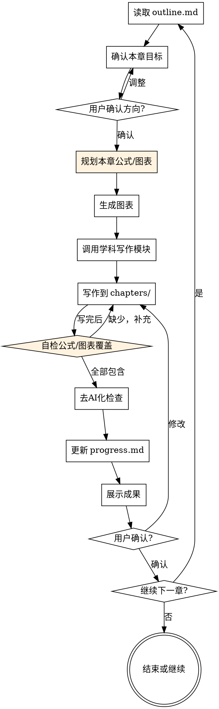

# 章节写作

负责论文各章节的实际写作。必须在头脑风暴完成、项目结构创建后调用。

<HARD-GATE>
调用此技能前必须满足以下条件：
1. plan/project-overview.md 存在且包含论文类型和章节结构
2. plan/outline.md 存在且已确认
3. chapters/ 目录已创建

如果任何条件不满足，必须先调用 brainstorming-research 技能。
`</HARD-GATE>`

## Checklist（每章必须完成）

- [ ] 读取 plan/outline.md 确认本章目标和要点
- [ ] 检查前置章节是否完成（按逻辑顺序）
- [ ] **读取项目代码库上下文**（见"代码上下文参考规则"节），确保对用户项目的技术实现有准确理解
- [ ] 与用户确认本章关键论点和内容方向
- [ ] **规划本章公式和图表**（见"每章公式/图表规划"节），列出具体清单并向用户展示
- [ ] 根据学科领域调用对应写作模块
- [ ] 生成规划中的图表（调用 figures-diagram/figures-python 技能）
- [ ] 写作输出到 chapters/XX-name.md（公式、图片引用、图注必须已嵌入）
- [ ] 执行去 AI 化检查
- [ ] **自检：本章规划的公式和图表是否全部包含**，缺少则补充
- [ ] 更新 plan/progress.md
- [ ] 展示写作成果，询问用户确认或修改
- [ ] 用户确认后，询问是否继续下一章

## 写作流程



## 代码上下文参考规则

<EXTREMELY-IMPORTANT>
**论文描述必须基于用户项目的真实代码，不得凭空编造技术细节。**

写作涉及用户项目的技术实现时（如系统设计、系统实现、技术方案、研究方法等章节），AI 必须先读取项目代码库中的相关文件，基于真实代码给出准确描述。

### 何时需要读取代码

- 描述系统架构、模块划分、技术栈时
- 描述具体功能的实现方案时
- 描述 API 接口、数据流、业务流程时
- 生成时序图、活动图、功能结构图前理解真实交互逻辑时
- 描述算法、核心逻辑、关键代码时
- 描述数据库表关系、字段用途时

### 代码阅读流程

**第 1 步：确定项目代码位置**

用户项目代码不在 `input/` 目录内时，**主动询问用户项目源码路径**。如果用户在初始化阶段已告知项目路径或代码库在当前工作区内，直接使用。

**第 2 步：扫描项目结构**

读取项目根目录，了解整体结构：

- 前端/后端/移动端目录划分
- 配置文件（如 `package.json`、`pom.xml`、`requirements.txt`、`go.mod` 等）→ 确认实际技术栈
- 路由文件、入口文件 → 了解模块划分
- 数据模型/实体类 → 了解数据结构

**第 3 步：按章节需求定向阅读**

| 章节内容          | 应阅读的代码文件                          |
| ----------------- | ----------------------------------------- |
| 系统架构/技术选型 | 配置文件、依赖声明、项目入口              |
| 功能模块划分      | 路由文件、控制器目录、模块目录结构        |
| 核心业务流程      | 对应的 Controller/Service/Handler 代码    |
| 数据库设计        | ORM 模型/实体类、migration 文件、SQL 文件 |
| 接口设计          | API 路由定义、请求/响应类型定义           |
| 安全认证          | 认证中间件、权限校验逻辑                  |
| 实验方法/算法     | 核心算法实现文件                          |

**第 4 步：在写作中准确引用**

- 技术栈描述必须与 `package.json` / `pom.xml` 等依赖文件一致，不得写错框架名或版本
- 模块名称、API 路径、数据表名必须与代码中的实际命名一致
- 功能描述必须反映代码中的真实逻辑，不得编造不存在的功能
- 如果代码中使用了某个设计模式或技术方案，论文中的描述应与之对应

### 禁止行为

- ❌ 未读代码就描述"系统采用 XXX 架构"（可能与真实架构不符）
- ❌ 编造不存在的 API 接口或数据表字段
- ❌ 描述的功能流程与代码实际逻辑矛盾
- ❌ 技术栈写错（如代码用的 Express.js 论文写成 Spring Boot）
- ❌ 凭推测描述系统行为而不验证代码

### 无源码时的处理

如果用户没有提供项目源码：

1. **主动询问**："本章需要描述 [具体内容]，请提供项目源码路径或相关代码文件，以确保论文描述准确。"
2. 如果用户无法提供源码，基于 `input/instruction.md` 需求文档和用户口述信息写作，但需在段落中使用"根据系统设计方案"等表述，避免断言代码层面的实现细节
3. **绝不编造具体的代码实现细节**（如具体类名、方法名、接口路径），只描述设计层面的方案
   `</EXTREMELY-IMPORTANT>`

## 图表自动生成规则

<EXTREMELY-IMPORTANT>
写作过程中遇到需要图表的内容时，必须自动调用 `scripts/` 下的脚本生成图片，并在 MD 中插入引用。不得跳过图表生成，不得只写文字描述而不配图。

**调用任何生图脚本之前，必须先读取该脚本文件**，查看其 `argparse` 参数定义或文件头部的使用说明，确认：

1. 需要传入哪些必填/可选参数
2. 参数的格式和类型（如 JSON 字符串、文件路径、列表等）
3. 输出路径的默认值或指定方式

禁止凭记忆猜测参数格式，每次调用前都必须先 `read` 脚本确认。

**图片路径规范**：在 MD 文件中插入图片引用时，路径必须**相对于该 MD 文件所在目录**，而不是项目根目录。插入前必须确认 MD 文件的实际位置，然后计算正确的相对路径。

示例（MD 文件在 `chapters/` 目录下）：

- ✅ 正确：``
- ❌ 错误：``（从 `chapters/` 出发找不到）

**备选方案（脚本内 API 调用失败时）**：如果生图脚本因 DeepSeek API 失败（超时、Key 失效、网络异常等）而无法生成图表，你（主进程 AI）必须自行编写脚本所需的**输入文件**，通过脚本内置的"跳过 LLM"参数完成渲染：

| 脚本                          | 你要编写的文件                    | 跳过 LLM 的调用方式                                          |
| ----------------------------- | --------------------------------- | ------------------------------------------------------------ |
| `gen_sequence_diagram.py`   | `.puml` 文件（PlantUML 时序图） | `--puml 你的文件.puml -o output/figures/xxx.png`           |
| `gen_activity_diagram.py`   | `.puml` 文件（PlantUML 活动图） | `--puml 你的文件.puml -o output/figures/xxx.png`           |
| `gen_function_structure.py` | `.json` 文件（功能结构树）      | `--json 你的文件.json -o output/figures/xxx.png`           |
| `gen_er_diagram.py`         | `.json` 文件（表结构数据）      | `输入文件.json --from-json -o output/figures/ --chapter N` |

- 此为备选方案，**优先使用脚本正常调用（含 Deepseek API）**
- 编写输入文件前，先 `read` 对应脚本确认文件格式要求
  `</EXTREMELY-IMPORTANT>`

### 触发条件（按章节）

不同章节需要生成不同类型的图表，写到对应章节时必须触发：

| 章节                                          | 典型小节内容                | 必须生成的图表                                                              | 调用脚本                              |
| --------------------------------------------- | --------------------------- | --------------------------------------------------------------------------- | ------------------------------------- |
| **系统设计**（通常第三章）              | 系统功能划分、模块层级      | **功能结构图**（1 张）                                                | `scripts/gen_function_structure.py` |
| **系统设计**（通常第三章）              | 核心业务交互、接口调用      | **时序图**（2~4 张核心流程）                                          | `scripts/gen_sequence_diagram.py`   |
| **系统设计**（通常第三章）              | 核心业务流程、审批/状态流转 | **活动图**（涉及判断分支的流程）                                      | `scripts/gen_activity_diagram.py`   |
| **数据库设计**（通常第三章）⚠️ 条件项 | 表结构、实体关系            | **ER 图** + **字段三线表**（仅 `has_database` 不为 false 时） | `scripts/gen_er_diagram.py`         |
| **系统实现**（通常第四章）              | 功能界面展示                | **系统截图**（从 `input/screenshots/`）                             | 无需脚本，直接引用                    |
| **系统实现**（通常第四章）              | 核心代码展示                | **代码块**（写前询问用户是否需要）                                    | 无需脚本，直接写 MD                   |

> **注意**：实际章节编号以 `plan/outline.md` 大纲为准。上表"通常第三/四章"仅为参考，按大纲匹配即可。

### 每章公式/图表规划（写作前强制步骤）

<EXTREMELY-IMPORTANT>
**每一章开始写作之前**，你必须先执行以下规划步骤。这不是建议，是强制要求。

**步骤 1：查表确定本章应包含的公式和图表**

根据章节类型，从下表中查出本章应该包含哪些公式和图表：

| 章节类型                    | 必须包含的公式                                     | 必须包含的图表                                       |
| --------------------------- | -------------------------------------------------- | ---------------------------------------------------- |
| **绪论**              | ≥1 处（如研究目标量化公式、问题规模公式）         | 无                                                   |
| **技术综述/文献综述** | ≥1 处（如技术原理公式、算法复杂度）               | 无（除非涉及技术架构对比）                           |
| **系统设计**          | ≥1 处（如安全加密公式、负载均衡权重、缓存命中率） | 功能结构图(1)、时序图(2~4)、活动图(≥1)              |
| **数据库设计** ⚠️   | 无                                                 | ER 图 + 字段三线表（仅 `has_database` 不为 false） |
| **系统实现**          | 无                                                 | 系统截图(按功能数) + 核心代码块(询问用户)            |
| **系统测试**          | ≥1 处（如测试覆盖率公式、TPS 吞吐量公式）         | 测试结果截图/表格                                    |
| **结论**              | 无                                                 | 无                                                   |
| **摘要**              | 无                                                 | 无                                                   |

**步骤 2：列出具体清单，向用户展示**

在"开始写作前的确认"中，必须明确列出规划的公式和图表：

> **本章计划包含的公式**：
>
> - [公式1描述]：$公式$（出现在 X.X 小节）
> - [公式2描述]：$公式$（出现在 X.X 小节）
>
> **本章计划包含的图表**：
>
> - 图 X-1：[图名]（[类型：时序图/活动图/功能结构图/ER图/截图]）
> - 图 X-2：[图名]

如果本章按上表不需要公式或图表，明确说明"本章无需公式/图表"。

**步骤 3：写作时严格按清单嵌入**

写作过程中必须按规划清单将公式和图表嵌入正文。公式要自然融入论述（先文字引出 → 给出公式 → 解释符号含义），不要生硬插入。

**步骤 4：写完后自检**

对照步骤 2 的清单逐项检查，缺少的必须补充后才能进入去 AI 化检查。
`</EXTREMELY-IMPORTANT>`

### 软件类论文图表最低要求

<EXTREMELY-IMPORTANT>
如果论文属于软件开发/信息系统/Web 应用等**软件类**选题（根据 `plan/project-overview.md` 判断），则整篇论文中**必须至少包含以下图表**，缺一不可：

| 要素类型           | 最低数量          | 通常出现章节                      |
| ------------------ | ----------------- | --------------------------------- |
| 功能结构图         | 1 张              | 系统设计                          |
| 时序图             | 2 张              | 系统设计                          |
| 活动图             | 1 张              | 系统设计                          |
| ER 图 + 三线表     | 按表数            | 数据库设计                        |
| 系统截图           | 按功能数          | 系统实现                          |
| **数学公式** | **≥ 3 处** | 绪论 / 技术综述 / 系统设计 / 测试 |

**数学公式要求**：

软件类论文也需要适当引入数学公式来提升学术性。以下是适合软件类论文的公式场景（可以作为参考，不必一定用他们，适合题目是最重要的），**至少选用 3 处**：

| 适用场景              | 公式示例                                                | 建议出现章节         |
| --------------------- | ------------------------------------------------------- | -------------------- |
| 系统性能/响应时间模型 | 排队论$T_{avg} = \frac{1}{\mu - \lambda}$             | 绪论（研究目标量化） |
| 缓存命中率与吞吐量    | $\mu_{eff} = \mu \cdot (1 + \alpha \cdot h)$          | 技术综述 / 系统设计  |
| 密码加密/哈希安全性   | BCrypt 代价函数$T = 2^{cost}$                         | 系统设计（安全模块） |
| 分页查询复杂度        | $O(n \log n)$、$O(1)$                               | 系统设计（算法选型） |
| 负载均衡权重分配      | 加权轮询$w_i = \frac{c_i}{\sum c_j}$                  | 系统设计（架构）     |
| 测试覆盖率            | $C = \frac{E_t}{E_{total}} \times 100\%$              | 系统测试             |
| 并发性能指标          | TPS =$\frac{N}{T}$，吞吐量公式                        | 系统测试（性能测试） |
| 相似度/推荐算法       | 余弦相似度$\cos\theta = \frac{A \cdot B}{\|A\|\|B\|}$ | 系统设计（核心算法） |

写作时自然地将公式融入正文论述中，先用文字引出，再给出公式，最后解释各符号含义。不要为了凑公式而生硬插入。

**自检时机**：每次写完"系统设计"章节后，检查是否已包含功能结构图、时序图、活动图。如果缺少任何一类，必须补充后再进入下一章。全文写完后检查公式数量是否 ≥ 3 处。

**如果大纲中没有独立的"系统设计"章节**（如合并在"系统设计与实现"中），则在该合并章节的设计部分完成上述图表。
`</EXTREMELY-IMPORTANT>`

### ER 图生成强制规则

<EXTREMELY-IMPORTANT>

**前置检查**：写到数据库设计章节时，先读取 `plan/overview.md` 中的 `has_database` 字段：

- `has_database: false` → **跳过整个数据库设计章节**，不生成 ER 图和字段三线表，在大纲中也应删除此章节
- 未标记或 `has_database: true` → 继续执行以下规则

#### 正常流程（LLM 模式优先）

**优先将 SQL 文件路径直接传给脚本**，由脚本内部的 DeepSeek 模型完成 SQL 解析和中文翻译。

**第 1 步：调用脚本生成 ER 图 + JSON**

```bash
python scripts/gen_er_diagram.py input/database/schema.sql -o output/figures/ --chapter 3 --save-json output/figures/tables.json
```

**第 2 步：读取 `output/figures/tables.json` 获取表结构数据**

**第 3 步：为每张表在 MD 中写入 ER 图引用（必须带图注）+ 字段三线表**

脚本会批量生成 `er_{表名}.png`，你必须在 MD 中为每张表逐一插入图注和三线表：

```markdown
### 3.3.1 用户账户表

用户账户表用于存储系统中所有注册用户的基本信息……（一段说明文字）


表 3-1 用户账户表

| 序号 | 字段名 | 类型 | 长度 | 主键 | 备注 |
|------|--------|------|------|------|------|
| 1 | id | BIGINT | - | 是 | 用户ID |
| 2 | username | VARCHAR | 50 | 否 | 用户名 |
```

#### LLM 失败时的回退流程（超时/报错/API 不可用）

**绝对禁止跳过 ER 图只生成三线表。ER 图和三线表必须成对出现，缺一不可。**

LLM 模式失败时，按以下步骤回退：

**回退第 1 步：AI 读取 SQL 文件，手动构建 tables.json**

读取 `input/database/*.sql`，解析每张表的结构，生成如下格式的 JSON 文件到 `output/figures/tables.json`：

```json
{
  "tables": [
    {
      "name": "user_account",
      "chinese_name": "用户账户表",
      "columns": [
        {"name": "id", "type": "BIGINT", "length": "-", "pk": true, "comment": "用户ID"},
        {"name": "username", "type": "VARCHAR", "length": "50", "pk": false, "comment": "用户名"}
      ]
    }
  ]
}
```

要求：

- 字段备注（comment）**必须是中文**，SQL 中有 COMMENT 的直接用，没有的根据字段名翻译
- 表的 `chinese_name` 必须填写中文名
- **所有会显示在 ER 图上的文字都必须是中文**，包括实体名、属性名、备注，不要留英文原文

**回退第 2 步：用 local 模式 + JSON 生成 ER 图**

```bash
python scripts/gen_er_diagram.py --mode local --json output/figures/tables.json -o output/figures/ --chapter 3
```

**回退第 3 步：验证 ER 图 PNG 文件已生成**

检查 `output/figures/` 下是否有 `er_*.png` 文件。如果仍然失败，告知用户具体错误并等待处理，**不要跳过**。

#### 关键规则

- ER 图的 `![图注]` 不能为空，格式为 `图 {章}-{序} {表中文名}ER图`
- 每张 ER 图后面必须紧跟对应的字段三线表
- 三线表的数据从 JSON 中获取，不要自己编造字段
- ER 图的所有标注（实体名、属性名）**必须是中文**
- API Key 已内置于 `scripts/.env`，无需额外配置

#### 绝对不允许的行为

- ❌ LLM 失败后跳过 ER 图，只写三线表
- ❌ ER 图和三线表不成对（有表无图或有图无表）
- ❌ 不回退、不重试，直接继续写下一章
  `</EXTREMELY-IMPORTANT>`

### 图表数量控制

<EXTREMELY-IMPORTANT>
一个系统中可能有几十个业务流程和模块交互，但论文不需要全部画出来。只生成**核心主要流程**的图表：

**时序图**：只画系统中最关键的 2~4 个交互流程（如登录认证、核心业务操作、支付/审批等关键链路），不要把每个 CRUD 接口都画成时序图。

**活动图**：只画涉及判断分支、多步骤协作的核心业务流程（如注册审核流程、订单状态流转等），简单的增删改查不需要活动图。

**功能结构图**：整个系统只需要 1 张，展示一级和二级功能模块即可。

**ER 图**：每张表一个 ER 图（由脚本自动批量生成），数量由数据库表数决定。

**选择标准**：

- 该流程是否体现系统的核心业务逻辑？
- 该流程是否包含条件判断、异常处理等值得展示的复杂性？
- 去掉这张图后，读者是否仍能理解系统？如果能，就不需要画。
  `</EXTREMELY-IMPORTANT>`

### 上下文获取（写作和生成图表前必读）

<EXTREMELY-IMPORTANT>
写作和生成图表前，你必须先阅读以下信息源来理解项目，不得凭空想象。**代码库阅读的详细规则见上方「代码上下文参考规则」节。**
</EXTREMELY-IMPORTANT>

**必读信息源**（按优先级）：

| 顺序 | 信息源（此为相对路径，可能需要../，需要按真实路径判断） | 获取方式                                   | 用途                                               |
| ---- | ------------------------------------------------------- | ------------------------------------------ | -------------------------------------------------- |
| 1    | `plan/project-overview.md`                            | 直接读取                                   | 研究背景、方法、系统概述                           |
| 2    | `plan/outline.md`                                     | 直接读取                                   | 本章要表达什么内容                                 |
| 3    | `input/instruction.md`                                | 直接读取                                   | 需求文档：功能需求、技术栈、项目背景               |
| 4    | **用户项目源代码**                                | **按「代码上下文参考规则」定向阅读** | **系统架构、模块交互、业务流程、真实技术栈** |
| 5    | `input/screenshots/`                                  | 逐一查看图片                               | 系统截图：写"系统实现"章节时必须引用并描述         |
| 6    | `input/database/*.sql`                                | 直接读取                                   | 数据库结构：生成 ER 图和字段三线表                 |
| 7    | 已写好的前置章节                                        | 读取 chapters/ 下已有文件                  | 保持图表与正文一致                                 |

**当信息不足时**：

- 如果项目中没有源代码或需求文档 → **询问用户**："本章需要描述 [具体内容]，请提供项目源码路径或相关代码文件，以确保论文描述准确。"
- 如果用户口头描述了系统但没有文档 → 根据用户之前的对话记录和 plan/ 中记录的信息来生成，但不编造具体代码细节

### 生成方式

**优先使用模式 A**（AI 直接生成代码 → 写入文件 → 脚本渲染）：

1. 阅读上述信息源，理解当前章节需要展示的系统/流程
2. 自己生成 PlantUML 代码或 JSON 结构
3. **将代码写入 `output/figures/` 目录下的 `.puml` 或 `.json` 文件**
4. 通过 `--puml` 或 `--json` 参数调用脚本渲染
5. 图片输出到 `output/figures/` 目录

> 注意：推荐先写文件再渲染，避免命令行传参时 shell 转义问题。`--puml-code` 和 `--json-code` 仅用于简短内容。

**当内容复杂或需要用户提供需求文档时，使用模式 B**（描述/文件 → DeepSeek → 渲染）：

1. 需求文档：询问用户提供，或从项目中读取
2. 通过 `-d` 传描述或 `-f` 传文件路径，由 DeepSeek 生成 PlantUML/JSON 后渲染
3. `-d` 传入的描述应包含：参与角色/模块名称、交互步骤、判断条件、数据流向等关键信息

### 调用命令参考

```bash
# 模式 A（推荐）：先写文件，再渲染
# 步骤 1：AI 将 PlantUML 代码写入 output/figures/ 下
# 步骤 2：调用脚本渲染
python scripts/gen_sequence_diagram.py --puml output/figures/ch3_login_sequence.puml -o output/figures/ch3_login_sequence.png
python scripts/gen_activity_diagram.py --puml output/figures/ch3_register_flow.puml -o output/figures/ch3_register_flow.png
python scripts/gen_function_structure.py --json output/figures/ch3_function_structure.json -o output/figures/ch3_function_structure.png

# ER 图生成
python scripts/gen_er_diagram.py schema.sql -o output/figures/ --chapter 3

# 模式 B：从描述或文件生成（需要 API Key）
python scripts/gen_sequence_diagram.py -d "用户登录流程..." -o output/figures/ch{N}_{name}.png
python scripts/gen_activity_diagram.py -f input/instruction.md -o output/figures/ch{N}_{name}.png
python scripts/gen_function_structure.py input/instruction.md -o output/figures/ch{N}_{name}.png
```

### 图片插入格式

生成图片后，在 MD 对应位置插入：

```markdown

```

<EXTREMELY-IMPORTANT>
**图注只写在 `![...]` 的方括号内**，转换器会自动居中显示图片和图注。

**禁止**额外添加 `<center>图注</center>` 或任何 HTML 标签，否则会产生冗余的图注文字。
`</EXTREMELY-IMPORTANT>`

示例：

```markdown


```

### 图注编写要求

- 图注要简洁准确，说明图表展示的核心内容
- 不得使用"如图所示"等空泛表述作为图注
- 图注编号按章节内顺序递增

### 系统截图使用规范

<EXTREMELY-IMPORTANT>
写"系统实现"或"系统测试"章节时，必须读取 `input/screenshots/` 目录下的用户截图，并在论文中引用和描述。
</EXTREMELY-IMPORTANT>

**处理流程**：

1. **扫描截图目录**：列出 `input/screenshots/` 下所有图片文件
2. **逐一查看截图**：用 Read 工具读取每张图片，理解其展示的功能界面
3. **复制到输出目录**：将截图复制到 `output/figures/` 目录，按章节重命名（如 `ch4_login_page.png`）
4. **在论文中引用**：为每张截图撰写功能描述段落，说明界面布局、操作流程和关键功能

**写作示例**（系统实现章节）：

```markdown
## 4.2 用户登录功能实现

用户登录界面采用简洁的表单设计，包含用户名输入框、密码输入框和登录按钮。
界面顶部显示系统 Logo 和名称，底部提供"忘记密码"和"注册账号"的快捷链接。
用户输入凭证后点击登录，系统通过 AJAX 异步请求将数据发送至后端认证接口，
认证成功后跳转至系统首页，失败则在输入框下方显示错误提示信息。
用户登录界面如图 4-1 所示。


```

**关键要求**：

- 不得忽略用户提供的任何截图
- 描述要具体：说明界面包含哪些元素、支持哪些操作、数据如何展示
- 先写功能描述段落，再引用截图（"如图 X-X 所示"放在段末）
- 每张截图至少配一个描述段落（100 字以上）

### 核心代码展示规范

<EXTREMELY-IMPORTANT>
"系统实现"章节的功能描述和截图全部写完后，**必须询问用户是否需要在各核心模块下附上关键代码片段**。
</EXTREMELY-IMPORTANT>

**询问时机**：系统实现章节的所有功能模块文字 + 截图写完之后，在提交章节前询问。

**询问模板**：

> "系统实现章节的功能描述已写完。是否需要在以下核心模块中附上关键代码片段？
>
> 1. [模块A，如：用户登录认证]
> 2. [模块B，如：文章发布与审核]
> 3. [模块C，如：数据统计接口]
>
> 如果需要，请告诉我：
>
> - 要附哪些模块的代码（可选全部或指定）
> - 代码来源（我从项目源码中提取，还是你提供）"

**代码写入规则**：

1. **位置**：代码放在对应功能模块小节的截图之后、下一个模块之前
2. **篇幅**：每个模块只展示最核心的 1~2 段代码（20~50 行），不要贴整个文件
3. **内容选择**：优先展示体现业务逻辑的代码（如认证流程、权限校验、核心算法），不要贴简单的 CRUD
4. **代码来源**：优先从用户项目源码中提取真实代码；如果没有源码则根据技术栈和功能描述生成合理的示例代码
5. **格式**：使用 Markdown 代码块，标注语言类型，代码前后各配一段说明文字

**写作示例**：

```markdown
用户登录接口采用 Spring Security 框架实现 JWT 认证，核心认证逻辑如下：

```java
@PostMapping("/api/auth/login")
public ResponseEntity<?> login(@RequestBody LoginRequest request) {
    Authentication auth = authenticationManager.authenticate(
        new UsernamePasswordAuthenticationToken(
            request.getUsername(), request.getPassword()
        )
    );
    SecurityContextHolder.getContext().setAuthentication(auth);
    String token = jwtUtils.generateToken(auth);
    return ResponseEntity.ok(new JwtResponse(token));
}
```

该接口接收用户名和密码，通过 `AuthenticationManager` 进行身份验证，验证通过后生成 JWT 令牌并返回给前端，前端将令牌存储于 LocalStorage 中用于后续请求的身份标识。

```

## 写作前准备

### 1. 读取项目信息

从 plan/ 读取：

- project-overview.md：论文类型、学科、研究背景
- outline.md：章节大纲和要点
- progress.md：已完成章节
- notes.md：用户偏好和特殊要求

### 2. 确认当前章节

> "根据大纲，本章「[章节名]」的主要内容是：
>
> - [要点1]
> - [要点2]
> - [要点3]
>
> 请确认这些要点，或告诉我需要调整的内容："

### 3. 调用学科模块

| 学科领域   | 调用模块                       |
| ---------- | ------------------------------ |
| 工科、理科 | writing-core                   |
| 文科       | writing-humanities             |
| 社科       | writing-humanities（侧重数据） |
| 医学       | writing-medical                |
| 法学       | writing-law                    |

## 写作规范

<EXTREMELY-IMPORTANT>
以下规范必须严格遵守，不得因为"效率"或"简化"而跳过。
</EXTREMELY-IMPORTANT>

### 去 AI 化写作

1. **禁用机械过渡词**：首先、其次、最后、此外、另外、总之
2. **禁用空壳强调句**：值得注意的是、需要指出的是、重要的是、显而易见
3. **禁用主观化表达**：我认为、我觉得、我的研究（正文中）
4. **禁用列表堆砌**：论文正文优先连贯段落，不使用项目符号
5. **语气客观**：使用"本文"、"本研究"、"研究表明"等客观表述

### 格式规范

1. **段落之间空一行**
2. **正文不使用加粗**（除术语首次定义）
3. **不使用斜体强调**
4. **标题层级清晰**
5. **禁止使用任何 Emoji / 表情符号**：论文正文、表格、图注中不得出现 ✅❌✓✗☑🔥 等表情或特殊符号。测试结果表中"是否通过"一律使用中文"是/否"或"通过/未通过"

### 引用规范

1. **绝不编造文献**
2. **引用必须可追溯**：作者、年份、出处至少完整两项
3. **英文文献可检索后引用**
4. **中文文献优先让用户提供来源**

### 参考文献角标格式

正文中引用参考文献时，使用方括号数字标记，转换器会自动将其转为**上标格式**：

```markdown
近年来，微服务架构在企业级系统中被广泛采用[1]。相关研究表明该方法可显著提升系统可维护性[2][3]。
```

转换后效果：近年来，微服务架构在企业级系统中被广泛采用^[1]^。

**支持的格式**：

- 单篇引用：`[1]`
- 多篇引用：`[1][2]` 或 `[1][2][3]`（每个编号独立方括号，**不要**写成 `[1,2]` 或 `[1-3]`）

**注意**：角标紧贴在句子末尾标点之前或之后（按学校要求），不要在角标前加空格。

## 章节写作模板

### 开始写作前的确认

> "我将开始写作「[章节名]」。
>
> **本章目标**：[从outline读取]
> **预计字数**：[根据论文类型估算]
> **包含小节**：
>
> - [小节1]
> - [小节2]
>
> **本章计划包含的公式**：
>
> - [公式描述]：$公式$（X.X 小节）
> - （如无需公式：本章无需数学公式）
>
> **本章计划包含的图表**：
>
> - 图 X-1：[图名]（[时序图/活动图/功能结构图/ER图/截图]）
> - （如无需图表：本章无需图表）
>
> **本章是否需要核心代码展示**：（仅系统实现章节需要询问）
>
> - 是 → 请告知要展示哪些模块的代码，或提供代码文件路径
> - 否 → 学校要求不需要 / 本章不涉及代码
>
> 请确认或调整后开始写作："

### 写作完成后的展示

> "「[章节名]」初稿已完成。
>
> **实际字数**：[字数]
> **主要内容**：[简要总结]
>
> 已保存到：chapters/[文件名].md
>
> 请审阅以下内容：
>
> ---
>
> [章节内容预览，可以是开头部分]
>
> ---
>
> 如需修改请告诉我具体位置和修改意见，确认无误后我将更新进度。"

### 更新进度

在 progress.md 中记录：

```markdown
## [日期] - [章节名]

- **状态**：已完成 / 待修改
- **字数**：[字数]
- **用户确认**：是 / 否
- **修改记录**：[如有]
```

## 特殊章节指导

### 摘要（Abstract）

- 留到正文全部完成后再写
- 中文摘要 300-500 字，英文摘要对应
- 结构：背景、目的、方法、结果、结论
- **公式**：无 | **图表**：无

### 绪论（Introduction）

- 研究背景（宏观到具体）
- 研究问题（现有不足）
- 研究目的和意义
- 研究内容和方法概述
- 论文结构安排
- **公式（≥1 处）**：在"研究目的"或"研究意义"小节中，用公式量化研究目标或问题规模。例如系统性能目标 $T_{avg} \leq T_{threshold}$、问题搜索空间 $O(n^k)$ 等
- **图表**：无

### 技术综述 / 文献综述（Literature Review）

- 调用 literature-review 技能
- 按主题/时间/方法分类
- 必须有批判性分析，指出研究空白
- **公式（≥1 处）**：在介绍核心技术原理时引入公式。例如介绍加密算法时写 BCrypt 代价公式 $T = 2^{cost}$，介绍推荐算法时写余弦相似度公式，介绍并发模型时写排队论公式等
- **图表**：无（除非涉及技术架构对比，可加对比表格）

### 系统设计（System Design）

- 系统总体架构、功能划分
- 核心模块详细设计
- 核心业务流程设计
- 数据库设计（如在本章）
- **公式（≥1 处）**：在安全设计、缓存策略、负载均衡、算法选型等小节中引入公式。例如缓存命中率 $\mu_{eff} = \mu \cdot (1 + \alpha \cdot h)$，分页复杂度 $O(n \log n)$，权重分配 $w_i = \frac{c_i}{\sum c_j}$ 等
- **图表（必须）**：
  - 功能结构图 × 1（展示系统一级/二级功能模块）
  - 时序图 × 2~4（核心业务交互流程，如登录、核心操作、审批等）
  - 活动图 × ≥1（涉及判断分支的业务流程）
  - ER 图 + 字段三线表（如数据库设计在本章）

### 系统实现（Implementation）

- 开发环境和工具说明
- 核心功能界面展示和描述
- 关键代码片段展示
- **公式**：无 | **图表（必须）**：系统截图（从 `input/screenshots/` 引用，按功能模块逐一描述）
- **核心代码（写前主动询问）**：

<EXTREMELY-IMPORTANT>
写"系统实现"章节**之前**，必须主动向用户确认是否需要展示核心代码：

> "本章「系统实现」通常会展示系统的核心代码片段来体现实现细节。
>
> **是否需要在本章中加入核心代码展示？**
>
> - 如果需要，请告诉我要展示哪些模块的代码（如登录认证、数据处理、核心算法等），或者将代码文件路径告诉我
> - 如果学校模板/要求中明确不需要代码，请告知
>
> 通常建议展示 2~4 段核心代码（每段 15~30 行），覆盖系统最关键的功能模块。"

**代码展示规范**：

- 每段代码前用文字说明该代码的功能和设计思路
- 代码块使用对应语言标记（如 `java`、`python`、`javascript`）
- 代码后解释关键逻辑（不要逐行翻译，聚焦设计决策和核心算法）
- 代码来源：优先从用户项目源代码中读取真实代码，不要自己编造
- 如果用户没有提供源代码，根据系统设计章节的描述生成符合实际的示例代码
  `</EXTREMELY-IMPORTANT>`

### 系统测试（Testing）

- 测试环境、测试方法、测试用例
- 功能测试结果
- 性能测试结果（如有）
- **公式（≥1 处）**：测试覆盖率 $C = \frac{E_t}{E_{total}} \times 100\%$，或 TPS 吞吐量 $TPS = \frac{N}{T}$，或响应时间统计公式等
- **图表**：测试结果截图或测试数据表格

### 结论（Conclusion）

- 总结研究发现，回应研究目的
- 指出创新点
- 提出未来方向
- **公式**：无 | **图表**：无

### 致谢（Acknowledgement）

<EXTREMELY-IMPORTANT>
写到致谢章节时，**必须先询问用户**，不要直接生成：

> "接下来是「致谢」部分。致谢内容非常个人化（感谢导师、家人、同学等），AI 生成的致谢往往不切实际。
>
> **你希望怎么处理致谢？**
>
> - 你自己写，我帮你放到对应位置
> - 你提供要感谢的对象和要点，我帮你组织语言
> - 跳过致谢，后续在 Word 中补充"

**禁止**未经用户确认就自行生成致谢内容。如果用户选择自己写，等用户提供后直接写入文件即可。
`</EXTREMELY-IMPORTANT>`

## 错误处理

### 如果 plan/ 不存在

> "检测到项目结构未创建。需要先完成头脑风暴才能开始写作。
>
> 是否现在开始头脑风暴？"

调用 brainstorming-research。

### 如果前置章节未完成

> "建议先完成「[前置章节]」再写「[当前章节]」，因为：
>
> - [原因]
>
> 是否要先写前置章节，还是跳过继续？"

记录用户选择到 notes.md。

### 如果用户要求跳过确认

> "理解你想加快进度。我会简化确认流程，但仍需要你在每章完成后简单确认。
>
> 现在开始写作「[章节名]」。"

## 关键原则

- **一次只写一章** — 完成并确认后再开始下一章
- **每章必须确认** — 不得自动继续
- **进度必须更新** — 每次写作后更新 progress.md
- **风格必须一致** — 遵循学科模块规范
- **引用必须真实** — 绝不编造

## 全部章节完成后

<EXTREMELY-IMPORTANT>
当所有章节写作完毕且用户确认无误后，**必须自动执行以下 4 步流程**，不需要用户额外触发，**不可跳过任何一步**：

1. 合并章节 → 2. **统一补充参考文献引用角标**（最容易遗忘！） → 3. 校验图表编号 → 4. 提示用户并转换

特别注意：**第 2 步「文献引用标注」是强制步骤**，写作阶段正文中可能未标注角标，合并后必须逐章扫描并补充 `[N]` 角标，覆盖率 ≥ 80%。绝对不能合并完就直接转 Word。
`</EXTREMELY-IMPORTANT>`

### 第 1 步：合并章节

将 `chapters/` 下所有 MD 文件按编号顺序合并为 `result/paper.md`：

```powershell
Get-ChildItem chapters/*.md | Sort-Object Name | ForEach-Object { Get-Content $_.FullName; "" } | Set-Content -Encoding UTF8 result/paper.md
```

### 第 2 步：文献引用标注

写作阶段为保持行文流畅，正文中**不强制要求带角标**。合并后需要统一补充引用标注：

**操作流程**：

1. **定位参考文献列表**：读取 `result/paper.md` 末尾的参考文献章节，建立编号→文献的映射（如 `[1]` → 张三, 2024...）
2. **逐章扫描正文**：找出所有引用了文献内容但尚未标注角标的语句，典型特征：
   - 提到"研究表明""相关文献指出""XX 等人提出"等引述语句
   - 引用了具体数据、观点、方法但未标注来源
   - 绪论中介绍国内外研究现状的段落
3. **插入角标**：在对应语句末尾（标点前或后，按学校要求）插入 `[N]` 标记，N 对应参考文献编号
4. **检查覆盖率**：
   - 绪论/文献综述章节：每段至少 1 处引用
   - 技术方案章节：涉及引用技术或框架时应标注
   - 系统测试章节：引用测试标准或方法时应标注
   - 总共引用数量应覆盖参考文献列表中 **≥ 80%** 的条目

**角标格式**（转换器会自动转为 Word 上标）：

```markdown
微服务架构近年来被广泛采用[1]。相关研究表明该方法可提升可维护性[2][3]。
```

**注意事项**：

- 多篇引用用连写方式：`[1][2]` 或 `[1][2][3]`，**不要**写成 `[1,2]` 或 `[1-3]`
- 角标紧贴文字，不要在角标前加空格
- 参考文献列表中的 `[1]` `[2]` 编号**不会**被转为上标（转换器已做分区判断）

### 第 3 步：校验图表编号

打开 `result/paper.md`，逐一检查：

1. **图编号**：扫描所有 `![图 X-Y ...]`，确认章节号（X）正确、序号（Y）从 1 连续递增
2. **表编号**：扫描所有 `表 X-Y ...`，同上
3. **公式编号**：确认与章节对应
4. **图片路径**：确认所有引用的图片文件存在
5. **引用角标**：确认所有 `[N]` 编号在参考文献列表中存在，无悬空引用

如果发现错误，直接在 `result/paper.md` 中修正。

### 第 4 步：提示用户并转换

> "所有章节已合并，文献引用已标注，图表编号已校验通过。现在为你转换为 Word 文档。"

**转换前置检查**：

1. 确认 `input/template/` 下有学校 .docx 模板文件（**必须有**，脚本直接加载模板保留封面和声明页）
2. 确认项目根目录下 `docx_template.yaml` 已存在且内容完整
   - 如果不存在：先用 python-docx 探测模板结构，填写 YAML 配置
   - 如果已存在：直接使用

然后调用 `docx-conversion` 技能执行转换。

<EXTREMELY-IMPORTANT>
**转换完成后必须进入迭代验证修正循环（由 docx-conversion 技能定义），不可跳过：**

1. 首次转换生成 `result/paper.docx` 后，**立即**执行 `detect_docx_template.py --compare` 对比模板与输出
2. 阅读对比报告，发现差异则修正 YAML 并重新转换
3. 循环执行直到无格式差异

**绝对禁止**：转换一次就交给用户、发现问题但不修正、跳过验证步骤。
`</EXTREMELY-IMPORTANT>`
